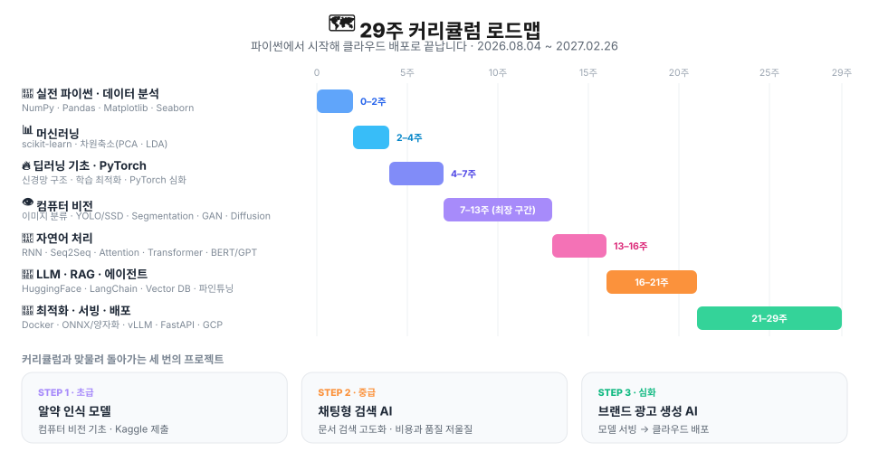

import DocLinks from '../../../../components/DocLinks.astro';

{/* 이 문서는 과정이 진행되는 동안 계속 갱신되는 살아 있는 기록입니다.
    아래 <DocLinks /> 는 빌드할 때 컬렉션을 읽어 링크를 만듭니다 — 새 글을 쓰면 알아서 붙습니다.
      · projects/ai/<프로젝트>/ 에 tags: [codeit-step1|2|3] 을 넣으면 해당 STEP 줄에 걸립니다.
      · posts/ai/<글>/ 에 글을 쓰면 진행 로그에 date 순으로 쌓입니다. */}

## 📌 한눈에 보기

| 항목 | 내용 |
| --- | --- |
| **과정** | 코드잇 스프린트 — 딥러닝 기반 **AI 엔지니어 트랙 15기** |
| **기간** | 2026.08.04 ~ 2027.02.26 · **29주**(약 7개월) |
| **핵심 스택** | `Python` `PyTorch` `HuggingFace` `LangChain` `Docker` `FastAPI` `GCP` |
| **산출물** | 프로젝트 3건(GitHub 공개) · 주차별 학습 회고 |
| **상태** | 🟡 **진행 예정** — 2026.08.04 개강 |

---

## 🤔 왜 CodeIT AI Engineer 과정을 선택했나?

운동과 생체역학에 깊은 관심을 가진 컴퓨터 공학 전공자로서, 모든 사람이 부상없이 즐겁게 운동하는 세상을 꿈꾸고 있습니다. 특히 Stanford 대학교의 Human Performance Lab의 OpenCap 프로젝트처럼, 컴퓨터 비전 기술으로 마커리스 모션캡처 기반으로 생체역학 데이터를 뽑아내고, 코칭 인사이트를 제공하는 기술에 큰 매력을 느끼고 있습니다. 

이러한 비전을 실현하고자 교내 창업동아리를 개설해 대표로 활동하며, ‘Spohelp’라는 **휴대폰 기반 마커리스 모션캡처 분석 솔루션**을 기획했습니다. 이 아이디어로 전국 대학생 SW 창업 아이디어톤에서 3위(우수상)를 달성하는 성과도 거두었습니다. 하지만 아이디어를 실제 서비스로 구현하는 과정에서 기술적인 한계에 부딪혔습니다. 이 솔루션의 핵심인 정교한 키포인트 추적을 위해서는 컴퓨터 비전과 딥러닝 모델에 대한 깊은 이해에서 더 나아가서 **기술을 서비스에 적용하는 경험**이 필수적임을 깨달았습니다.

최근에는 WestSide Barbell의 **Canjugate System**에 큰 매력을 느껴, 이 훈련 시스템을 보다 많은 사람들이 쉽게 접할 수 있도록 하는 프로젝트를 기획하고 있습니다. 

이 부트캠프에서 제가 얻고자 하는 것은 단 하나입니다.

> **깊은 인공지능 기술에 대한 이해를 바탕으로, AI를 서비스에 적용하는 경험을 해보자. 그리고 그 경험을 나만의 서비스에 녹여보자**

---

## 🗺 29주 로드맵

| 구간 | 주제 | 다루는 것 |
| --- | --- | --- |
| 사전 | 파이썬 기초 | 개강 전 사전 학습 |
| 0–2주 | 실전 파이썬 · 데이터 분석 | `NumPy` `Pandas` `Matplotlib` `Seaborn` |
| 2–4주 | 머신러닝 | `scikit-learn`, 차원축소(PCA · LDA) |
| 4–7주 | 딥러닝 · PyTorch | 신경망 구조, 학습 최적화, PyTorch 심화 |
| 7–13주 | 컴퓨터 비전 | 이미지 분류, 객체 탐지(YOLO · SSD), Semantic Segmentation, GAN, Diffusion |
| 13–16주 | 자연어 처리 | 임베딩, RNN · Seq2Seq · Attention, Transformer, BERT · GPT |
| 16–21주 | LLM · RAG · 에이전트 | `HuggingFace` `LangChain`, Vector DB, 파인튜닝 |
| 21–22주 | 컨테이너 · 모델 최적화 | `Docker`, ONNX, 양자화, `vLLM` |
| 22–29주 | 서빙 · 배포 | `Streamlit` `FastAPI` `GCP` |

---

## 🛠 다루는 기술 스택

| 영역 | 스택 |
| --- | --- |
| 언어 · 데이터 | `Python` `NumPy` `Pandas` `Matplotlib` `Seaborn` |
| 머신러닝 | `scikit-learn` · PCA · LDA |
| 딥러닝 | `PyTorch` |
| 컴퓨터 비전 | `OpenCV` · YOLO · SSD · Segmentation · GAN · Diffusion |
| NLP | RNN · Seq2Seq · Attention · Transformer · BERT · GPT |
| LLM 응용 | `HuggingFace` `LangChain` · Vector DB · RAG · Fine-tuning |
| 서빙 · 배포 | `Docker` · ONNX · 양자화 · `vLLM` · `Streamlit` · `FastAPI` · `GCP` |

---

## 🚀 세 번의 프로젝트

각 프로젝트는 **상황 → 과제 → 할 일 → 확인할 지표** 순으로 정리합니다. 지표 칸은 프로젝트가 끝나면 실제 수치로 교체됩니다.

### STEP 1 · 알약 인식 모델 (초급)

- **상황** — 실제 이미지 데이터셋으로 분류 모델을 처음부터 끝까지 만들어 봅니다.
- **과제** — 알약 이미지로 약 정보를 찾아내는 AI 모델을 설계하고 **Kaggle에 제출**합니다.
- **할 일** — 데이터 전처리·증강, 모델 선택과 학습, 하이퍼파라미터 튜닝, 리더보드 반복 제출.
- **프로젝트 기록** — <DocLinks collection="projects" under="ai" tag="codeit-step1" variant="inline" emptyKo="아직 시작 전입니다." emptyEn="Not started yet." />

### STEP 2 · 채팅형 검색 AI (중급)

- **상황** — 문서를 근거로 답하는 시스템을 직접 굴려 봅니다.
- **과제** — 문서 기반 대화형 검색 AI를 만들고 **검색 품질과 비용의 trade-off를 계산**해 고도화합니다.
- **할 일** — 청킹·임베딩 전략 비교, Vector DB 구성, 리트리버 튜닝, 프롬프트·모델 선택, 응답 품질 평가 파이프라인.
- **프로젝트 기록** — <DocLinks collection="projects" under="ai" tag="codeit-step2" variant="inline" emptyKo="아직 시작 전입니다." emptyEn="Not started yet." />

### STEP 3 · 브랜드 광고 생성 AI (심화)

- **상황** — 마지막 구간. 모델을 **서비스로** 만드는 단계입니다.
- **과제** — 브랜드 맞춤 광고를 생성하는 AI를 만들고 **클라우드에 배포**합니다.
- **할 일** — 생성 모델 파인튜닝, 모델 최적화(ONNX·양자화·`vLLM`), `FastAPI` 서빙, `Docker` 이미지화, `GCP` 배포.
- **프로젝트 기록** — <DocLinks collection="projects" under="ai" tag="codeit-step3" variant="inline" emptyKo="아직 시작 전입니다." emptyEn="Not started yet." />

---

## 📒 진행 로그

공부 기록과 회고는 `posts/ai` 에 쌓이고, 아래 목록은 글을 올리면 **날짜순으로 자동 갱신**됩니다.

- **개강** — 사전 학습(파이썬 기초) 시작 %% 2026.08.04

<DocLinks
  collection="posts"
  under="ai"
  order="asc"
  emptyKo="첫 회고가 올라오면 여기에 자동으로 쌓입니다."
  emptyEn="The first retrospective will show up here automatically."
/>
