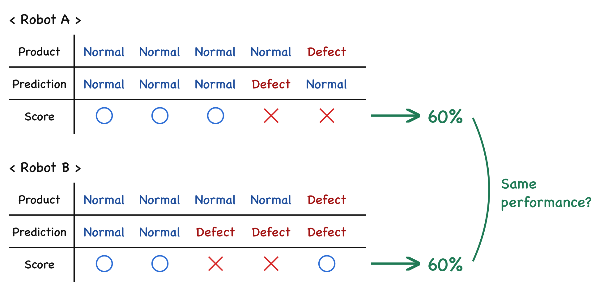
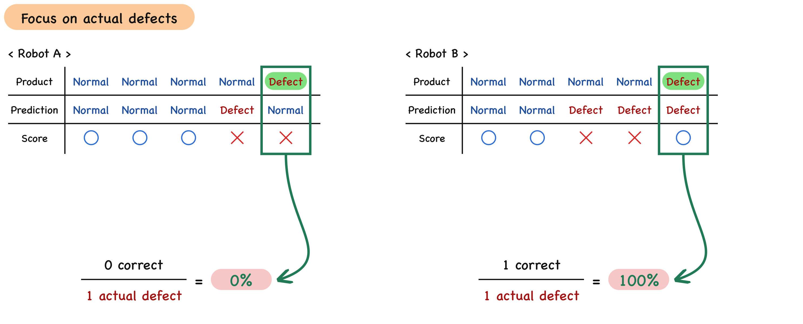
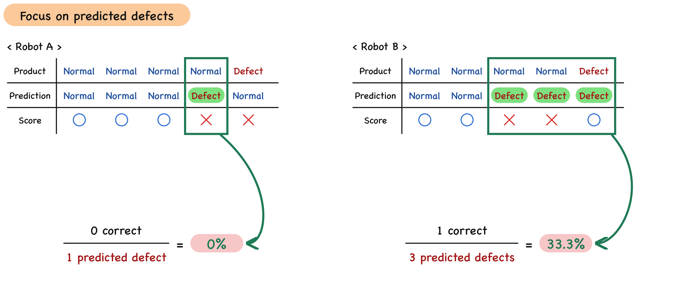
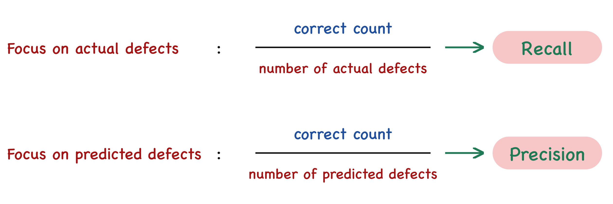
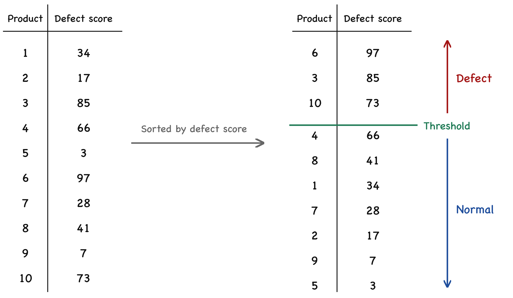
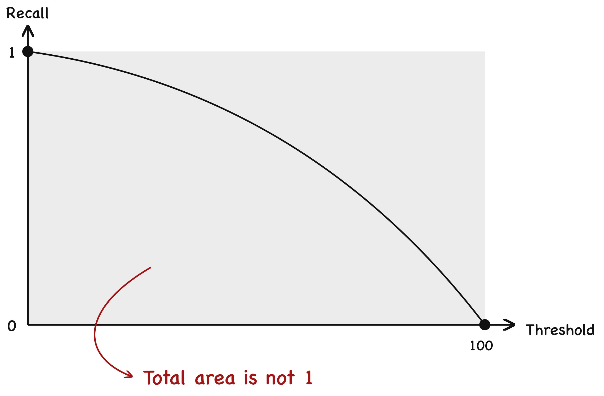
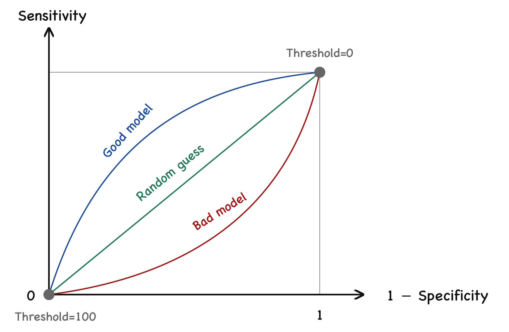

## 0. Introduction

How can we judge the predictions a model produces? We need some kind of metric to evaluate the model's performance — just like taking an exam and counting how many of the questions we got right. That is called an <u>**evaluation metric**</u>, and it means <u>**a way of quantifying performance and expressing it as a single value**</u>.

An evaluation metric is not just a single score. There are many of them: <u>**Accuracy**</u>, <u>**Precision**</u>, <u>**Recall**</u>, <u>**F1-Score**</u>, <u>**AUROC**</u>, and more. Today we'll look at each of them, and at which metric to use when and where.

> **📌 NOTE**
>
> The material on Accuracy, Precision, Recall, and F1-Score is based on the blog post [Precision & Recall | F1-Score | AUROC : 일상 사례로 쉽게 이해하기](https://ffighting.net/deep-learning-basic/%eb%94%a5%eb%9f%ac%eb%8b%9d-%ed%95%b5%ec%8b%ac-%ea%b0%9c%eb%85%90/accuracy-precision-recall-f1score-auroc/). That blog has plenty of write-ups on deep learning fundamentals beyond this topic, so I recommend taking a look :)

## 1. Accuracy

Imagine we're on a manufacturing floor and want to buy a robot that automatically detects defective products. Our company places great weight on reliability, and holds the creed that not a single product reaching a customer may be defective. In the end, two robots made the shortlist.

The table above summarizes how the two robots, A and B, judged whether each of 5 products was normal or defective. Both robots got 2 of the 5 wrong and 3 right. Since both robots got 60% of all their predictions right, do they perform equally well? This score is called <u>**accuracy**</u>, and it means <u>**the proportion of correctly predicted samples among all predictions**</u>.

Had we adopted robot A, roughly one in five products could have reached a customer defective. Robot B, on the other hand, caught the defective product but flagged as many as two normal products as defective. Given our company's situation, which robot should we adopt?

## 2. Precision and Recall

What matters most to our company is not detecting normal products, but never mistaking a defective product for a normal one. So what if we focus on exactly that and build <u>**a metric that focuses only on defects**</u>? *Here, "defect" covers both cases: the product actually being defective, and the robot predicting it as defective.*

First, let's look at the products that are actually defective.

Robot A did not correctly flag even one of the actually defective products. Robot B, on the other hand, correctly predicted the one actually defective product as defective. In numbers, that's 0% for robot A and 100% for robot B.

Now let's focus only on the cases the robot predicted as defective.

Of the products robot A predicted as defective, none were actually defective. Of the products robot B predicted as defective, only one was actually defective. In numbers, that's 0% for robot A and 33.3% for robot B.

The approach that focuses on "actual defects" like this is called Recall.

The approach that focuses on "predicted defects", on the other hand, is called Precision.

Mapping this onto the famous <u>**Confusion Matrix**</u>, it can be summarized as follows.

> Sensitivity is used to mean the same thing as Recall.

## 3. F1-Score

<u>**Precision and Recall are in a trade-off relationship**</u>. When Precision goes up, Recall goes down, and when Recall goes up, Precision goes down.

$$
\text{Precision} = \frac{\text{TP}}{\text{TP} + \text{FP}}
$$

$$
\text{Recall} = \frac{\text{TP}}{\text{TP} + \text{FN}}
$$

It's like archery. The model is given a limited number of arrows and shoots them at a target split into four zones: $TP, FN, FP, TN$.

If many arrows land in $FN$, fewer arrows are left for $FP$, right? Then Recall can get smaller and Precision can get larger. Conversely, if many arrows land in $FP$, fewer are left for $FN$, and so Recall can get larger and Precision smaller.

> Of course, if many arrows land in $TP$ or $TN$, both go up. And then Accuracy goes up too.

That led to the following thought.

Since Precision and Recall trade off against each other, is there a metric that can embrace both? Looking closely, they share the same numerator but have different denominators. There's an averaging method that's perfect for exactly this situation: the harmonic mean.

$$
\text{F1-Score} = 2 \times \frac{\text{Precision} \times \text{Recall}}{\text{Precision} + \text{Recall}} \\
 = \frac{2\text{TP}}{2\text{TP} + \text{FP} + \text{FN}}
$$

<u>**The metric that expresses Recall and Precision as their harmonic mean is called the F1-Score**</u>. If the model gets every question right without a single mistake ($FN = FP = 0$), the F1-Score is 1. The more mistakes it makes, the closer the F1-Score gets to 0.

### 3.1. Limitations of the F1-Score

We can now combine Recall and Precision and express performance as a single number, the F1-Score. So is everything fine now?

What if the model's "defect criterion" is very lenient, so it flags a product as defective at even the slightest flaw? Or what if the model's "defect criterion" is very strict, so it doesn't call most flaws defects?

Suppose the robot company has some <u>**defect score**</u> that quantifies how defective a product is, and the model has its own <u>**Threshold**</u> for judging something defective. The robot assigns each product a defect score, sorts them, and judges the products whose defect score is higher than the threshold to be defective.

The problem here is that <u>**the F1-Score can change depending on the threshold**</u>. In other words, you can tune the threshold to look good on whatever score the company uses as its yardstick, producing a model that only looks good on the surface.

$$
\text{F1-Score}
 = \frac{2\text{TP}}{2\text{TP} + \text{FP} + \text{FN}}
$$

The F1-Score depends on TP and FN/FP, and all of these values change with the threshold. That's why <u>**a single F1-Score on its own can't tell you how good a model is**</u>. You always have to state the threshold alongside it.

So we came to <u>**need a single tool that represents a model's performance across every possible threshold**</u>.

## 4. AU-ROC

Is there a way to express performance across all thresholds as a single number? Since we're evaluating a defective-product classifier, we could <u>**simply plot Recall over every threshold**</u>. When the threshold is 0, Recall will be 1, because every product is judged defective. Conversely, when the threshold is at its max, Recall will be 0, because every product is judged normal. That gives us a graph like the one below.

Then the area under this recall graph would represent the robot's defect-detection performance. But this graph has one problem.

> <u>**The threshold is not a value between 0 and 1, and its max has no fixed limit**</u>. So the area under this graph can't be compared with scores computed for other models or on different data. And then there's no point in computing a score at all.

That is why the <strong>ROC (Receiver Operating Characteristic)</strong> came along.

Suppose we have 10 products, lined up in order of their defect score.

Let's say $threshold=30$.

- <u>**Of the 5 "actually defective products", only 4 were predicted as defective**</u>, and 1 was wrongly predicted as normal. This is called the <u>**True Positive Rate (TPR)**</u>, also known as <u>**Sensitivity**</u>, and it's the same concept as <u>**Recall**</u>. As a formula:

  $$
  \text{TPR} = \frac{\text{TP}}{\text{TP} + \text{FN}}
  $$

  TP is the number correctly predicted as "defective", and FN is the number that were "actually defective but wrongly predicted as normal".

  So at threshold = 30, we can say TPR = 4/5 = 0.8.

- However, <u>**of the 5 "actually normal products", 2 were wrongly predicted as "defective"**</u>. This is called the <u>**False Positive Rate (FPR)**</u>, and it corresponds to <u>**1 - Specificity**</u>.

  $$
  \text{FPR} = \frac{\text{FP}}{\text{FP} + \text{TN}}
  $$

  FP is the number of "normal products wrongly predicted as defective".

  So at threshold=30, we can say FPR = 2/5 = 0.4.

If we repeat this for every threshold, we get a TPR and an FPR at each one. Plotting every (TPR, FPR) pair we can obtain finally gives a picture like the one below. And this is called the <u>**ROC Curve**</u>.

Picking one point on it, we can see that <u>**80% of the defective items were correctly predicted as defective**</u>, and <u>**20% of the normal items were wrongly predicted as defective**</u>.

Now we can use the area under this ROC Curve to compare different classification models — in the example above, robot A and robot B. This area is called the <u>**AU-ROC (Area Under ROC)**</u>. <u>**AU-ROC is an evaluation metric focused on how well the model finds positives across all thresholds**</u>.

If the model has no ability to tell defects apart — that is, if it's no better than guessing at random — it will show up as a straight line, because TPR and FPR change by the same amount as the threshold changes. If, on the other hand, <u>**the model is good at telling defects apart, the curve bows upward, since a good model means high TPR and low FPR**</u>. Conversely, if the model is poor at telling them apart, the curve bows downward.

So now we can express a model's predictive performance across all thresholds as a single number: the AUROC!

## 📚 References

- [https://ffighting.net/deep-learning-basic/딥러닝-핵심-개념/accuracy-precision-recall-f1score-auroc/](https://ffighting.net/deep-learning-basic/%eb%94%a5%eb%9f%ac%eb%8b%9d-%ed%95%b5%ec%8b%ac-%ea%b0%9c%eb%85%90/accuracy-precision-recall-f1score-auroc/)
- [https://chowonsang.com/혼동행렬의-개념과-핵심-평가지표/](https://chowonsang.com/%ED%98%BC%EB%8F%99%ED%96%89%EB%A0%AC%EC%9D%98-%EA%B0%9C%EB%85%90%EA%B3%BC-%ED%95%B5%EC%8B%AC-%ED%8F%89%EA%B0%80%EC%A7%80%ED%91%9C/)
- [ROC Curve and AUC Value](https://www.youtube.com/watch?v=QBVzZBsif20&list=LL&index=51)
