## 0. 들어가며

모델이 내놓은 예측결과를 어떻게 판단할 수 있을까요? 모델의 성능을 평가하는 일종의 지표가 필요합니다. 마치 우리가 시험을 보고, 전체 문제 중 몇 점을 맞았는지를 세는 것처럼요. 그걸 <u>**평가지표**</u>라고 하고, <u>**성능을 수치화하여 하나의 값으로 표현하는 방법**</u>을 의미합니다.

평가지표는 단순히 하나의 점수가 아닙니다. <u>**정확도(Accuracy)**</u>, <u>**정밀도(Precision)**</u>, <u>**재현율(Recall)**</u>, <u>**F1-Score**</u>, <u>**AUROC**</u> 등 여러 평가지표가 있습니다. 오늘은 이 하나 하나를 살펴보고, 언제 어디서 어떤 평가지표를 사용해야 하는지 살펴보겠습니다.

> **📌 NOTE**
>
> Accuracy, Precision, Recall, F1-Score에 대한 내용은 [Precision &amp; Recall | F1-Score | AUROC : 일상 사례로 쉽게 이해하기](https://ffighting.net/deep-learning-basic/%eb%94%a5%eb%9f%ac%eb%8b%9d-%ed%95%b5%ec%8b%ac-%ea%b0%9c%eb%85%90/accuracy-precision-recall-f1score-auroc/) 이 블로그의 내용을 기초로 하고있습니다. 이 주제 뿐만 아니라 딥러닝 기초에 대해 정리되어있는 글들이 매우 많으니, 한 번 들어가서 살펴보시길 권장드립니다 :)

## 1. 정확도(Accuracy)

제조업 현장에서, 불량 제품을 자동으로 검출해주는 로봇을 구입하려고 한다고 해봅시다. 우리 회사는 기업의 신뢰성을 매우 중시해서, 고객에게 전달되는 제품 하나라도 불량이면 안된다는 신조를 가지고 있습니다. 그리고 최종적으로 두 로봇이 후보에 올랐습니다.

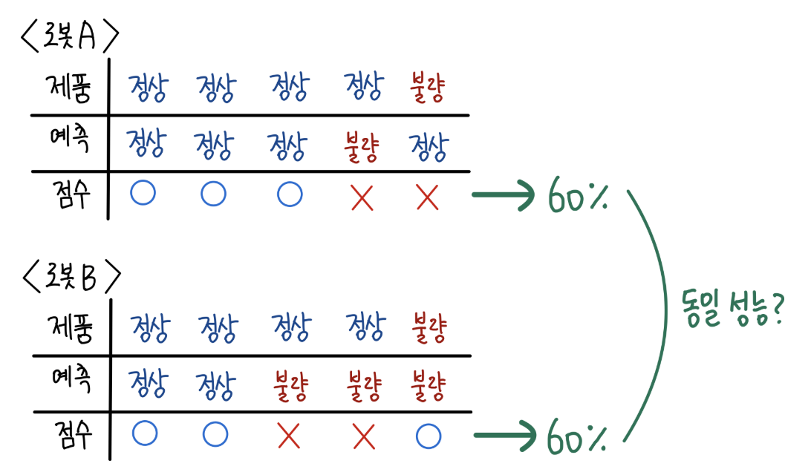

위 표는 제품 5개에 대해서 두 로봇, A와 B가 각 제품이 정상인지 불량인지 판단한 결과를 정리한 표입니다. 두 로봇 모두 5개 중 2개를 틀리고, 3개를 맞췄네요. 두 로봇 모두 전체 예측 중 맞춘 비율이 60%이니, 두 로봇은 같은 성능을 보이는 걸까요? 이 점수를 <u>**정확도**</u>라고 하며, <u>**전체 예측 개수 중에서 올바르게 예측한 샘플의 비율**</u>을 의미합니다.

만약 로봇 A를 채택했다면, 5개 중 하나 꼴로 고객에게 불량품이 전달될 뻔 했습니다. 반면 로봇 B는 불량 제품은 잘 걸렀지만 정상 제품을 두 개나 불량이라고 판별했네요. 우리 회사의 상황에서는 어떤 로봇을 채택해야 할까요?

## 2. 정밀도(Precision), 재현율(Recall)

우리 회사 입장에서 가장 중요한 건 정상을 검출하는 것 보다는, 불량을 정상이라고 잘못 판단하는 경우가 없어야 한다는 겁니다. 이 부분에 초점을 맞춰서, <u>**불량에만 초점을 맞춘 평가지표**</u>를 만들면 어떨까요? *이 때 불량이란, 실제 제품이 불량인 경우와 로봇이 불량이라고 예측한 경우를 모두 포함합니다.*

먼저 제품이 실제로 불량인 경우에 대해서 살펴보겠습니다.

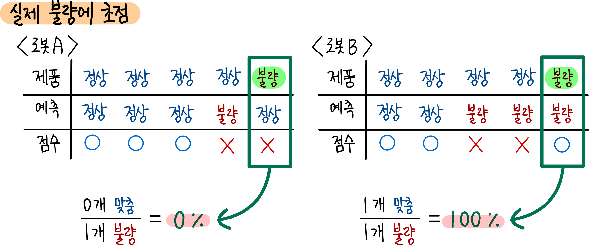

로봇 A는 실제 불량인 제품 중에서 한 제품도 불량이라고 맞추지 못했습니다. 반면, 로봇 B는 실제 불량인 제품 1개를 불량이라고 제대로 예측했네요. 이를 수치로 나타내면, 로봇 A는 0%, 로봇 B는 100%네요.

반면 로봇이 불량이라고 예측한 사례에만 초점을 맞춰서 살펴보겠습니다.

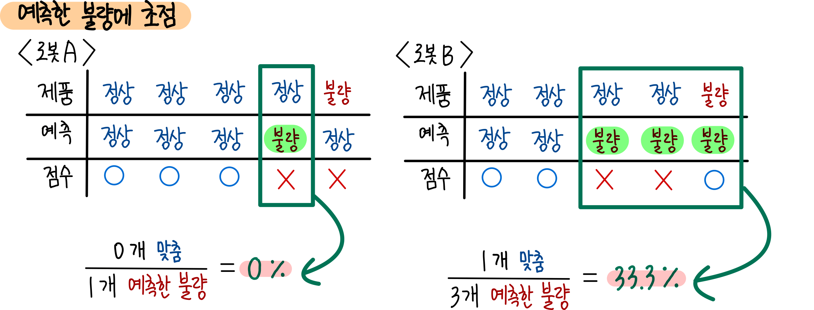

로봇 A가 불량이라고 예측한 것 중 실제 불량은 하나도 없었습니다. 반면 로봇 B가 불량이라고 예측한 것 중 실제 불량은 하나밖에 없었네요. 이를 수치로 나타내면 로봇 A는 0%, 로봇 B는 33.3%입니다.

이와 같이 ‘실제 불량’에 초점을 맞춘 방식을 재현율(Recall)이라고 합니다.

반면 ‘예측한 불량’에 초점을 맞춘 방식을 정밀도(Precision)라고 합니다.

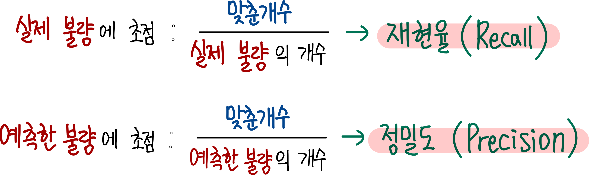

그 유명한 <u>**혼동행렬(Confusion Matrix)**</u>에 대입해서 이해하면 다음과 같이 정리됩니다.

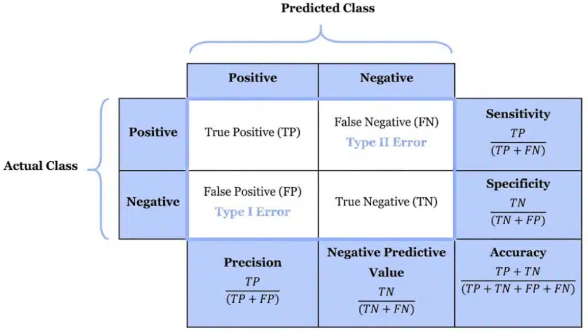

> Sensitivity는 Recall과 같은 의미로 쓰입니다.

## 3. F1-Score

<u>**Precision과 Recall은 서로 trade-off 관계**</u>에 있습니다. Precision이 올라가면 Recall은 줄어들고, Recall이 올라가면 Precision은 줄어드는 거죠.

$$
\text{Precision} = \frac{\text{TP}}{\text{TP} + \text{FP}}
$$

$$
\text{Recall} = \frac{\text{TP}}{\text{TP} + \text{FN}}
$$

마치 양궁을 하는 것과 같습니다. 모델에게는 한정된 화살이 주어져있고, $TP, FN, FP, TN$ 네 구역으로 나뉜 과녁에 화살을 쏘는 겁니다.

$FN$에 화살을 많이 맞추면, 그만큼 $FP$에 들어갈 화살은 줄어들겠죠? 그러면 Recall은 작아지고, Precision은 커질 수 있는 겁니다. 반대로 $FP$에 화살을 많이 맞추면, $FN$에 들어갈 화살은 줄어들테고, 그러면 Recall은 커지고, Precision은 작아질 수 있는 겁니다.

> 물론 화살이 $TP$나 $TN$에 많이 들어가면 두 개 모두 올라가겠죠. 그러면 Accuracy도 커질 겁니다.

그래서 이런 생각을 하게 됐습니다.

Precision과 Recall은 서로 trade-off 관계이니, 이 둘을 모두 포용할 수 있는 지표는 없을까요? 둘을 잘 살펴보면, 분자는 같지만 분모가 다릅니다. 이럴 때 사용하기 딱 좋은 평균 측정 방법이 있죠. 조화평균입니다.

$$
\text{F1-Score} = 2 \times \frac{\text{Precision} \times \text{Recall}}{\text{Precision} + \text{Recall}} \\
 = \frac{2\text{TP}}{2\text{TP} + \text{FP} + \text{FN}}
$$

이렇게 <u>**Recall과 Precision을 조화평균으로 표현하는 지표를 F1-Score**</u>라고 합니다. 만약 모델이 틀리지 않고 모든 문제를 다 맞췄다면($FN = FP = 0$), F1-Score = 1이 됩니다. 반면 많이 틀릴 수록 F1-Score는 0에 가까워질 겁니다.

### 3.1. F1-Score의 한계

이제 Recall과 Precision을 조합해서 F1-Score라는 하나의 숫자로 성능을 표현할 수 있게 되었습니다. 그러면 만사 오케이인 걸까요?

만약 모델의 ‘불량 판단 기준’이 매우 낮아서, 아주 사소한 결함만 보여도 불량이라고 짚어내면 어떻게 될까요? 아니면, 모델의 ‘불량 판단 기준’이 매우 엄격해서, 웬만한 결함에는 불량이라고 하지 않았다면 어떡할까요?

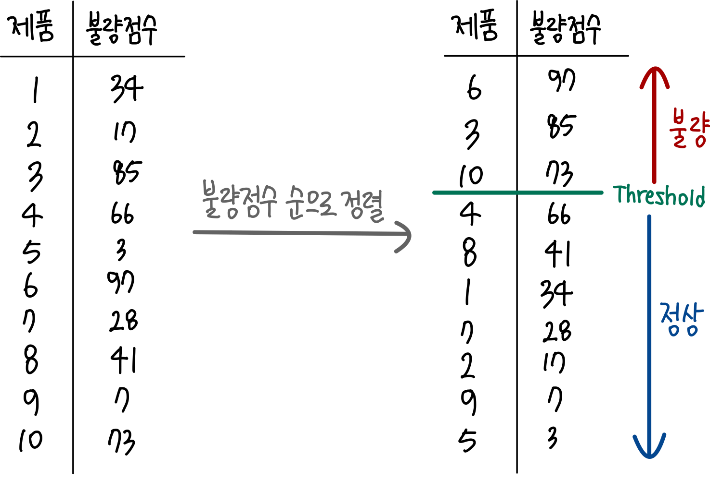

로봇 회사에게는 제품의 불량 정도를 수치화한 어떤 <u>**불량 점수**</u>가 있고, 모델에게는 자체적으로 불량이라고 판단하는 어떤 <u>**임계치(Threshold)**</u>가 있다고 해봅시다. 로봇은 제품에 불량 점수를 매겨서 정렬한 후, 불량 점수가 임계치(Threshold)보다 높은 제품들을 불량이라고 판단하는 겁니다.

여기서 문제는, <u>**임계치(Threshold)에 따라서 F1-Score가 달라질 수 있다**</u>는 겁니다. 즉, 회사가 기준으로 하는 점수에 잘보이게 하기 위해서 임계치를 조절해 겉보기에는 좋아보이는 모델을 만들 수 있다는 겁니다.

$$
\text{F1-Score}
 = \frac{2\text{TP}}{2\text{TP} + \text{FP} + \text{FN}}
$$

F1-Score는 TP와 FN/FP에 따라서 값이 달라집니다. 이 값들은 모두 Threshold에 따라서 변하는 값입니다. 그래서 만약 Threshold가 변한다면, 혼동행렬을 이루는 값들, TP, TN, FP, FN 값도 달라질 테고, 그러면 Precision, Recall도 달라지고, 그러면 F1-Score도 달라지겠죠. 그래서 <u>**단일 F1-Score 하나만으로는 모델의 성능을 판단할 수가 없습니다**</u>. 항상 Threshold를 같이 명시해줘야 하는 거죠.

그래서 <u>**가능한 모든 Threshold에 대해서 모델의 성능을 나타내는 하나의 도구가 필요**</u>해졌습니다.

## 4. AU-ROC

모든 Threshold에 대해 하나의 숫자로 성능을 표현하는 방법은 없을까요? 우리는 지금 불량 제품 판별 모델을 평가하고자 하니, <u>**단순히 Recall을 모든 Threshold에 대해서 그래프**</u>로 나타내볼 수 있을 것입니다. Threshold가 0일 때는 Recall이 1이 나올 겁니다. 모든 제품을 불량으로 판단하니깐요. 반대로 Threshold가 max일 때는 Recall이 0이 나오겠죠. 모든 제품을 정상으로 판단하니깐요. 그러면 아래와 같은 그래프를 그릴 수 있을 겁니다.

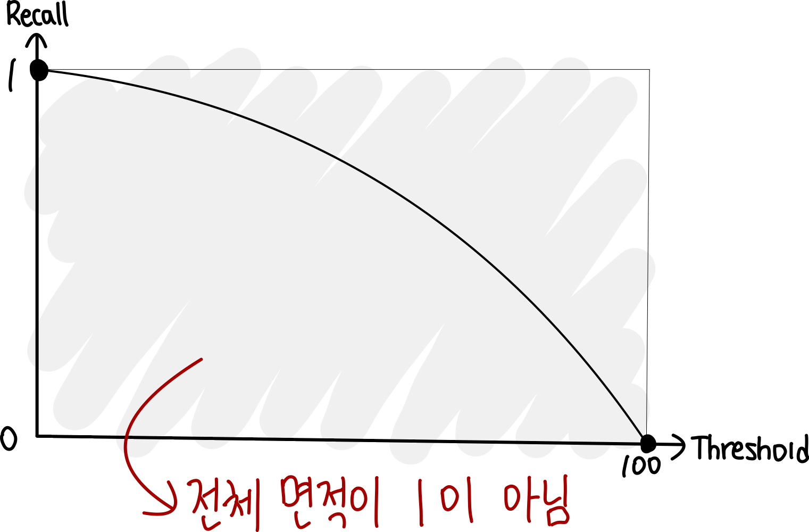

이러면 재현율 그래프의 면적은 로봇의 불량 검출 성능을 의미하겠네요. 

하지만 이 그래프는 치명적인 문제가 있습니다. **Recall만 보기 때문에 정상 제품을 불량으로 잘못 판단한 건(FP) 전혀 반영되지 않습니다.** 모든 제품에 높은 불량 점수를 주는 엉터리 모델도 면적이 커지겠죠. 게다가 threshold는 0과 1 사이의 값이 아니라서, 점수 스케일이 다른 모델끼리는 면적을 비교할 수도 없습니다.  

이 두 문제를 한 번에 해결하는 게 <strong>ROC(Receiver Operating Characteristic)</strong>입니다. 

ROC는 threshold를 축으로 쓰지 않고, **"불량을 얼마나 잘 잡았나(TPR)"와 "정상을 얼마나 잘못 잡았나(FPR)"를 양 축으로 놓고** 그립니다. 10개의 제품이 있고, 이 제품들의 불량 점수(defect score) 순서대로 나열해놓았다고 해봅시다.

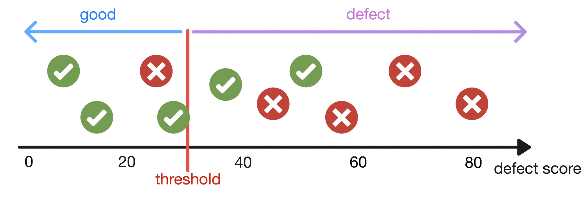

여기서 threshold보다 불량점수가 큰 제품들은 모델이 불량(defect)이라고 예측하는 거고, 그것보다 작은 제품들은 정상(good)이라고 예측하는 겁니다.

> 마치 Sigmoid activation function으로 이진분류를 할 때, Sigmoid의 출력값(확률)이 임계치 0.5보다 크면 positive, 작으면 negative로 분류하는 것과 마찬가지인 거죠. 이 상황에서는 결함 점수가 곧 '확률'인 거고, '임계치'가 곧 0.5가 되는 겁니다. 

만약 $threshold=30$ 이라고 해봅시다.

- <u>**5개의 ‘실제 불량 제품’ 중에서 4개만을 불량이라고 예측**</u>했고, 1개는 정상이라고 잘못 예측했습니다. 이걸 <u>**True Positive Rate(TPR)**</u>이라고 하고, 이를 <u>**민감도(Sensitivity)**</u>라고 부르며, <u>**Recall**</u>과 같은 개념입니다. 이를 공식으로 나타내면 다음과 같습니다.
  $$
  \text{TPR} = \frac{\text{TP}}{\text{TP} + \text{FN}}
  $$

  TP는 ‘불량’이라고 제대로 예측한 개수, FN은 ‘실제로는 불량인데 정상이라고 잘못 예측한 개수’입니다.

  그러면 threshold = 30일 때, TPR = 4/5 = 0.8이라고 할 수 있습니다.
- 하지만, <u>**5개의 ‘실제 정상 제품’중에서는 2개를 ‘불량’이라고 잘못 예측**</u>했습니다. 이걸 <u>**False Positive Rate(FPR)**</u>이라고 하고, <u>**1 - 특이도(Specificity)**</u>에 해당됩니다.
  $$
  \text{FPR} = \frac{\text{FP}}{\text{FP} + \text{TN}}
  $$

  FP는 ‘불량이라고 잘못 예측된 정상 제품’의 개수를 의미합니다.

  그러면 threshold=30일 때, FPR = 2/5 = 0.4라고 할 수 있습니다.

이런 과정을 모든 threshold에 대해서 진행해보면, 각각의 threshold에서 TPR과 FPR을 구할 수 있을 겁니다. 구할 수 있는 모든 (TPR, FPR) 쌍을 그래프에 그리면 최종적으로 다음 그림과 같이 그릴 수 있겠죠. 그리고 이걸 <u>**ROC Curve**</u>라고 부릅니다.

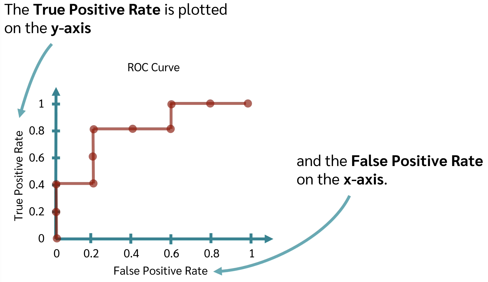

이렇게 하면 저희가 지금까지 겪었던 모든 문제를 해결할 수 있습니다. 

1. <u>**특정 threshold에 의존하지 않는다**</u>: 모든 threshold를 곡선 하나에 담았습니다.
2. <u>**오탐(FP)도 함께 본다**</u>: 불량을 잘 잡는 것(TPR)과 정상을 잘못 잡는 것(FPR)의 trade-off를 동시에 보여줍니다.
3. <u>**점수 스케일과 무관하다**</u>: 축이 모두 0~1 사이의 비율이라, 서로 다른 모델끼리 비교할 수 있습니다.

> 🤔 **왜 Precision이 아니라 FPR을 쓸까요?**
>
> 불량품을 <u>**80% 잡아내고**</u>, 정상품은 <u>**10% 확률로 잘못 잡는**</u> 모델 하나를 두 공장에 똑같이 설치해봅시다. 두 공장 모두 불량품은 100개인데, 정상품 수만 다릅니다.
>
>
> |                                    | 공장 A (정상품 100개) | 공장 B (정상품 10,000개) |
> | ---------------------------------- | --------------- | ------------------ |
> | TP / FN                            | 80 / 20         | 80 / 20            |
> | FP / TN                            | 10 / 90         | 1,000 / 9,000      |
> | **TPR** $= \frac{TP}{TP+FN}$       | 0.80            | 0.80               |
> | **FPR** $= \frac{FP}{FP+TN}$       | 0.10            | 0.10               |
> | **Precision** $= \frac{TP}{TP+FP}$ | 0.89            | **0.07**           |
>
>
> 모델은 똑같은데 Precision만 0.89에서 0.07로 떨어졌죠. 분모를 보면 이유를 알 수 있습니다. 
>
> - **TPR**은 실제 불량품 안에서만, **FPR**은 실제 정상품 안에서만 계산합니다. 정상품이 100배 많아지면 FP와 TN이 함께 100배가 되니 비율은 그대로입니다.
> - **Precision**은 분모에 불량품에서 온 TP와 정상품에서 온 FP가 <u>**섞여 있습니다**</u>. 정상품만 늘면 FP만 늘어나니, 같은 모델이라도 값이 떨어지는 겁니다.
>
> 즉, TPR과 FPR은 <u>**데이터 구성과 무관한 모델 자체의 구분 능력**</u>을, Precision은 <u>**그 현장에서 "불량"이라는 판정을 얼마나 믿을 수 있는지**</u>를 보여줍니다. ROC는 앞의 성질을 원해서 TPR과 FPR을 축으로 쓴 거죠.
>
> 다만 이 장점은 양날의 검입니다. 공장 B에서 FPR 0.1은 작아 보이지만, 실제로는 <u>**오탐(1,000개)이 진짜 불량(80개)보다 12배 많습니다**</u>. 정상이 압도적으로 많을수록 ROC는 모델을 실제보다 좋아 보이게 만드는 거죠. 
> 
> 🤔 그래서 객체탐지(Object Detection)에서는 ROC Curve가 아니라 <u><strong>PR Curve</strong></u>를 사용합니다. Negative(배경)이 객체에 비해 무수히 많기 때문이죠. 

이 중 한 점을 뽑아서 살펴보면, <u>**불량품의 80%가 불량이라고 제대로 예측**</u>되었고, <u>**정상제품의 20%가 불량이라고 잘못 예측**</u>되었다는 걸 알 수 있습니다.

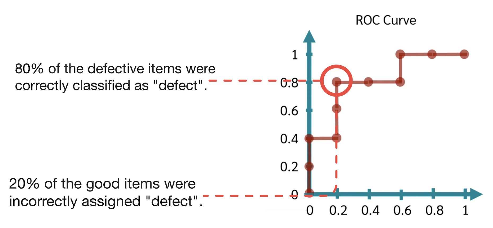

이제 이 ROC Curve 아래의 면적을 활용해서, 서로 다른 분류 모델들, 위의 예시에서는 로봇 A와 로봇 B, 를 비교할 수 있을 겁니다. 그리고 이 면적을 <u>**AU-ROC(Area Under the ROC Curve)**</u>라고 부릅니다. 즉, <u>**AU-ROC는 무작위로 뽑은 불량품 하나와 정상품 하나 중, 불량품이 더 높은 점수를 받을 확률**</u>입니다.

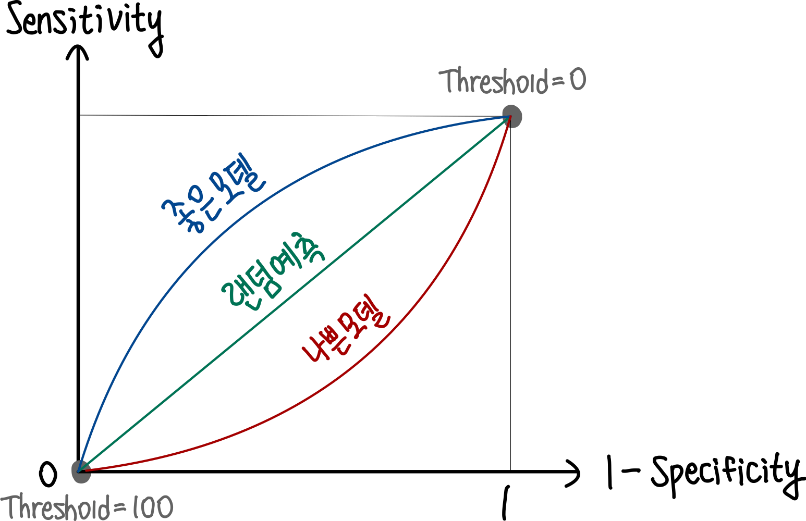

만약 모델이 불량에 대한 구분 능력이 없다면, 즉 랜덤하게 예측한 것과 같다면, 일직선으로 표현될 겁니다. Threshold의 변화에 따라 TPR과 FPR이 동등한 수준으로 변할거니까요. 반면 <u>**모델이 불량에 대한 구분 능력이 좋다면, 왼쪽 위 모서리(TPR=1, FPR=0)에 가까운 모양이 될 거예요. 모델이 좋다는 건 TPR은 높고 FPR은 낮은 거니까요**</u>. 반대로 모델이 거꾸로 구분하고 있다면 오른쪽 아래 모서리(TPR=0, FPR=1)에 가까운 형태로 그려질 겁니다.

그래서 이제 특정 모델의 모든 threshold에 대한 예측 성능을 하나의 수치 AUROC로 나타낼 수 있게 되었습니다!

## 📚 참고자료

- [https://ffighting.net/deep-learning-basic/딥러닝-핵심-개념/accuracy-precision-recall-f1score-auroc/](https://ffighting.net/deep-learning-basic/%eb%94%a5%eb%9f%ac%eb%8b%9d-%ed%95%b5%ec%8b%ac-%ea%b0%9c%eb%85%90/accuracy-precision-recall-f1score-auroc/)
- [https://chowonsang.com/혼동행렬의-개념과-핵심-평가지표/](https://chowonsang.com/%ED%98%BC%EB%8F%99%ED%96%89%EB%A0%AC%EC%9D%98-%EA%B0%9C%EB%85%90%EA%B3%BC-%ED%95%B5%EC%8B%AC-%ED%8F%89%EA%B0%80%EC%A7%80%ED%91%9C/)
- [ROC Curve and AUC Value](https://www.youtube.com/watch?v=QBVzZBsif20&list=LL&index=51)