## 1. Introduction

While learning about computer vision at the Codeit bootcamp, we covered transfer learning. So I set out to do a hands-on exercise: take AlexNet, VGGNet, GoogLeNet, and ResNet models trained on ImageNet, transfer-learn them on [CIFAR-10](https://www.cs.toronto.edu/~kriz/cifar.html) data, and measure their performance. But before getting to data preprocessing, a few questions came up.

> 🤔 They say that in transfer learning you should normalize the target images, but should it be <u><strong>based on the pretraining data (ImageNet)</strong></u>, or <u><strong>based on the transfer-learning target images (CIFAR-10)</strong></u>?
>
> <u><strong>🤔 Data augmentation</strong></u> is said to maximize generalization performance and prevent overfitting — <u><strong>is that really true?</strong></u>
>
> <u><strong>🤔 VerticalFlip can damage the essential characteristics of the original data</strong></u> and thus have side effects (for example, an upside-down car is anything but typical) — when you feed such images as training data, <u><strong>is that really true?</strong></u>

Here is what Gemini thought.

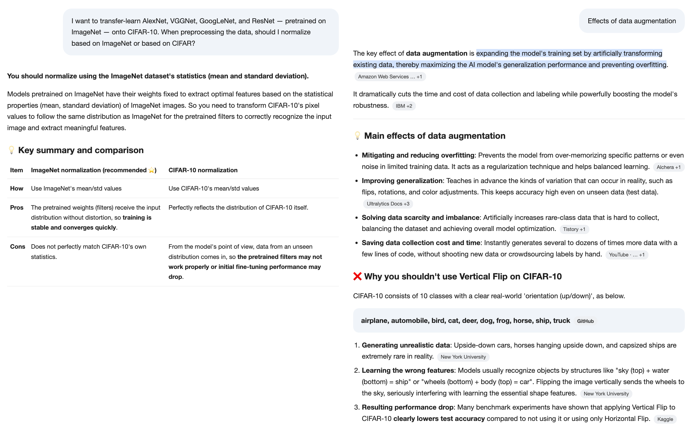

But can we just take this answer at face value? <u><strong><em>Seeing is believing!</em></strong></u> I decided to run an experiment.

**Experiment design**

1. **Data preprocessing**
   - Resize is done identically to (224,224) in every case. AlexNet and VGGNet don't use [GAP](https://medium.com/@sandhrabijoy/global-average-pooling-gradient-tape-0faf7971606c), so the input size has to match for the FC layers to run without errors.
   - Normalization compares three cases in total: 1. plain [0,1] scaling only, 2. normalization based on CIFAR-10, 3. normalization based on ImageNet.
   - Augmentation also compares three cases in total: 1. no augmentation, 2. Hflip + rot only, 3. Hflip + rot + Vflip.

   | Split | Resize | Normalization | Augmentation |
   | --- | --- | --- | --- |
   | train | (224,224) | Plain [0,1] scaling | No augmentation |
   | - | - | - | Horizontal Flip + Rotation(-15~+15) |
   | - | - | - | Horizontal Flip + Rotation(-15~+15) + Vertical Flip |
   | - | (224,224) | CIFAR-10 normalization | No augmentation |
   | - | - | - | Horizontal Flip + Rotation(-15~+15) |
   | - | - | - | Horizontal Flip + Rotation(-15~+15) + Vertical Flip |
   | - | (224,224) | ImageNet normalization | No augmentation |
   | - | - | - | Horizontal Flip + Rotation(-15~+15) |
   | - | - | - | Horizontal Flip + Rotation(-15~+15) + Vertical Flip |
   | validation | (224,224) | Plain [0,1] scaling | No augmentation |
   | - | - | CIFAR-10 normalization | No augmentation |
   | - | - | ImageNet normalization | No augmentation |
   | test | (224,224) | Plain [0,1] scaling | No augmentation |
   | - | - | CIFAR-10 normalization | No augmentation |
   | - | - | ImageNet normalization | No augmentation |

2. **Model preparation**
   - Since I'm on Colab's free plan, I go with feature extraction training, which takes the least training time and resources.
   - I prepare AlexNet, VGGNet16, GoogLeNet, and ResNet models pretrained on ImageNet, freeze the feature extraction part, and set them up so only the FC layers are trained.

     ```bash
     ==============================================================================
     • VGGNet     | trainable= 119,586,826 | total= 134,309,962 | frozen=  14,723,136
     • AlexNet    | trainable=  54,575,114 | total=  57,044,810 | frozen=   2,469,696
     • ResNet     | trainable=      20,490 | total=  23,528,522 | frozen=  23,508,032
     • GoogLeNet  | trainable=      10,250 | total=   5,610,154 | frozen=   5,599,904
     ==============================================================================
     ```

   - To make comparison easy, the data for each epoch is saved to csv along the way.

     | Column | Meaning | Example |
     | --- | --- | --- |
     | model | The model being trained. | One of AlexNet, VGGNet, GoogLeNet, ResNet. |
     | epoch | Training epoch. 1 row = (model, epoch). If one model ran 10 epochs, there are 10 rows. | 1 |
     | train_loss | train_loss per epoch. | 2.1204 |
     | train_acc | train_acc per epoch. Predictions from each batch are accumulated and computed at the end of the epoch. | 0.22 |
     | val_loss | val_loss per epoch. Computed with the updated model at the end of the epoch. | 1.9521 |
     | val_acc | val_acc per epoch. Computed on the validation set at the end of the epoch. | 0.13 |
     | epoch_sec | Training time taken per epoch (seconds). | 4.34 |
     | cumulative_sec | Cumulative training time up to the current epoch. | 4.34 |
     | lr | Learning rate. | 0.001 |
     | trainable_params | Number of trainable parameters. | 57044810 |
     | total_params | Total number of parameters in the model. | 57044810 |
     | batch_size | Batch size. | |
     | optimizer | Optimizer. | Adam |
     | seed | Random seed. | 42 |
     | device | Training machine. | One of cuda, mps. |

3. **Experiment**
   - Because of the limits of Colab's free plan, I can't grid-search all 9 train cases. So the experiment is split into steps.
     1. Step 1: Pick the best-performing Normalization among the three Normalization strategies.
     2. Step 2: On top of the Normalization strategy that won Step 1, compare the three Augmentation strategies.
   - **Accepted limitation**: Normalization strategies eliminated in Step 1 don't get an Augmentation experiment, so we can't obtain data for every case.
4. **Visualizing and comparing the experiment results**
   - For each of the four models — AlexNet, VGGNet, GoogLeNet, ResNet — compare the performance of the 9 data preprocessing cases.
   - Look at the train learning curves and validation curves to see with our own eyes how data preprocessing affects model training.
   - For each model, figure out which data preprocessing strategy works well for feature extraction training.

**Experiment code**

- [ :github: GitHub repository](https://github.com/raewoo0908/codeit/blob/main/course/part2/computer_vision/workbook/07_modeling_CIFAR10_practice.ipynb)

**Experiment result data .csv**

- [ :github: GitHub repository](https://github.com/raewoo0908/codeit/blob/main/course/part2/computer_vision/workbook/results/transfer_train_log.csv)

> 📌 **NOTE**
>
> **This experiment was not originally meant only to compare data preprocessing strategies. It originally had two goals.**
>
> 1. Experiment with data preprocessing strategies.
> 2. Compare the performance and training efficiency of three training approaches: Training From the Scratch VS Feature Extraction VS Full Fine Tuning.
>
> However, this post covers only the first goal. I'll see you in the next post for the second one.

## 2. Data Preprocessing

CIFAR-10 consists of 32x32 color images, provided as 50,000 train and 10,000 test images. I left test untouched for final evaluation and split the 50,000 train images 9:1 again to create a validation set. I used a stratified split so that the class ratios stay exactly the same in train and validation.

```python
from sklearn.model_selection import train_test_split

VAL_RATIO = 0.1          # share of train(50,000) used for validation
RESIZE = (224, 224)      # unify to the pretrained models' input size

train_targets = cifar10_train_dataset.targets
train_indices, val_indices = train_test_split(
    np.arange(len(train_targets)),
    test_size=VAL_RATIO,
    stratify=train_targets,   # keep per-class ratios identical in train/val
    random_state=RANDOM_SEED,
)
test_indices = np.arange(len(cifar10_test_dataset))  # test: all 10,000 images as-is
```

As a result, we have 45,000 train, 5,000 validation, and 10,000 test images.

### 2.1. Three Kinds of Normalization

First, I prepare the mean and standard deviation for normalization. For CIFAR-10, I computed them directly per channel (R, G, B) over the entire train data. For ImageNet, on the other hand, I couldn't download millions of images just for this one experiment, so I trusted the widely known values and used them as-is.

```python
# CIFAR-10: compute per-channel mean/std directly from my data
train_data = cifar10_train_dataset.data.astype(np.float32) / 255.0  # (50000, 32, 32, 3)
cifar_mean = train_data.mean(axis=(0, 1, 2)).tolist()
cifar_std = train_data.std(axis=(0, 1, 2)).tolist()

# ImageNet: widely known statistics
imagenet_mean = [0.485, 0.456, 0.406]
imagenet_std = [0.229, 0.224, 0.225]
```

```text
CIFAR-10 computed mean : [0.4914, 0.4822, 0.4465]
CIFAR-10 computed std  : [0.2470, 0.2435, 0.2616]
```

The two sets of values are more similar than you might expect, right? Applying these three methods to images and lining them up side by side looks like this.

![A grid comparing five CIFAR-10 images side by side: original, ToTensor [0,1], CIFAR-10 normalization, and ImageNet normalization](./image/cifar10-normalize-comparison.png)

To the human eye they look almost identical. That's because normalized values include negatives and values above 1, so they are stretched back to [0,1] when drawn on screen. But the range of values the model actually receives is quite different.

| Normalization | Value range of one sample |
| --- | --- |
| Plain [0,1] scaling | [0.000, 0.992] |
| CIFAR-10 normalization | [-1.989, 2.027] |
| ImageNet normalization | [-2.118, 2.501] |

In code, I made this a function that takes the name of the normalization method and returns the corresponding transform steps. Plain [0,1] scaling needs nothing extra, since `ToDtype(scale=True)` already does it.

```python
def build_normalize_step(norm_name: str) -> list:
    if norm_name == "totensor":
        return []  # [0,1] scaling only (ToDtype scale=True) — no separate Normalize
    if norm_name == "cifar":
        return [v2.Normalize(mean=cifar_mean, std=cifar_std)]
    if norm_name == "imagenet":
        return [v2.Normalize(mean=imagenet_mean, std=imagenet_std)]
```

### 2.2. Three Kinds of Augmentation

I checked augmentation the same way. To see the effect clearly, here the flips are always applied (p=1.0).

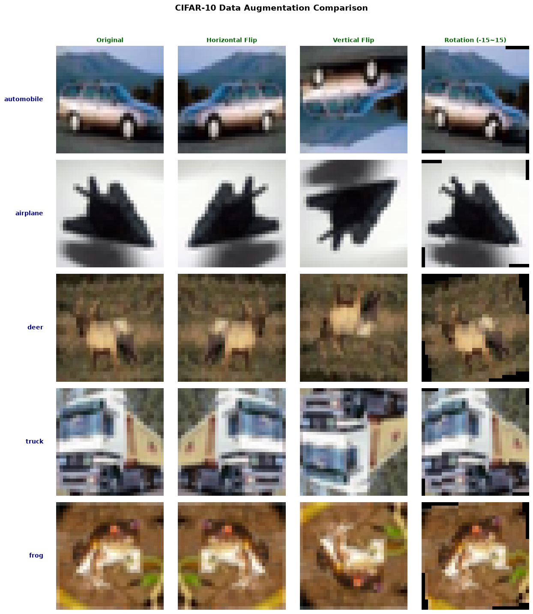

Horizontal Flip and Rotation still give plausible photos even after augmentation. With Vertical Flip, on the other hand, you get upside-down cars and trucks and a deer standing on its head. These are photos you'd almost never see in real life. This is exactly what Gemini was worried about.

In actual training, the flips were applied with 50% probability and Rotation randomly within -15 to +15 degrees.

```python
def build_augment_step(aug_name: str) -> list:
    if aug_name == "hflip_rot":
        return [v2.RandomHorizontalFlip(p=0.5), v2.RandomRotation(degrees=15)]
    if aug_name == "hflip_rot_vflip":
        return [
            v2.RandomHorizontalFlip(p=0.5),
            v2.RandomRotation(degrees=15),
            v2.RandomVerticalFlip(p=0.5),
        ]
    if aug_name == "none":
        return []
```

### 2.3. Assembling 9 Train Sets and 3 Validation · Test Sets

Now we chain Resize, augmentation, and normalization together with Compose(). Augmentation goes only into train, not into validation or test. Validation and evaluation should be done on the original distribution, after all.

```python
def build_train_transform(norm_name: str, aug_name: str) -> v2.Compose:
    """For training: Resize -> (augmentation) -> float scaling -> (normalization)"""
    return v2.Compose(
        [v2.ToImage(), v2.Resize(RESIZE)]
        + build_augment_step(aug_name)              # augmentation runs on uint8
        + [v2.ToDtype(torch.float32, scale=True)]   # 0~255 -> [0,1]
        + build_normalize_step(norm_name)
    )


def build_eval_transform(norm_name: str) -> v2.Compose:
    """For validation/test: no augmentation, Resize -> float scaling -> (normalization)"""
    return v2.Compose(
        [v2.ToImage(), v2.Resize(RESIZE), v2.ToDtype(torch.float32, scale=True)]
        + build_normalize_step(norm_name)
    )
```

There's one thing I paid attention to here. If the 9 train datasets used **different images**, there'd be no way to tell whether a performance gap came from the preprocessing or from the images. So I made a small wrapper so that every dataset shares **the same index split** and only the transform is swapped. Since it only references the original, it also saves having to copy the data 9 times.

```python
class TransformedDataset(Dataset):
    """A wrapper that picks the given indices from the original dataset and applies the given transform."""

    def __init__(self, base_dataset, indices, transform):
        self.base_dataset = base_dataset
        self.indices = list(indices)
        self.transform = transform

    def __len__(self):
        return len(self.indices)

    def __getitem__(self, i):
        img, label = self.base_dataset[self.indices[i]]
        return self.transform(img), label


NORM_TYPES = ["totensor", "cifar", "imagenet"]
AUG_TYPES = ["hflip_rot", "hflip_rot_vflip", "none"]

# train: normalization × augmentation = 9 (key: "normalization__augmentation")
train_datasets = {
    f"{norm}__{aug}": TransformedDataset(
        cifar10_train_dataset, train_indices, build_train_transform(norm, aug)
    )
    for norm in NORM_TYPES
    for aug in AUG_TYPES
}
# validation / test: 3 normalizations (no augmentation)
val_datasets = {
    norm: TransformedDataset(cifar10_train_dataset, val_indices, build_eval_transform(norm))
    for norm in NORM_TYPES
}
test_datasets = {
    norm: TransformedDataset(cifar10_test_dataset, test_indices, build_eval_transform(norm))
    for norm in NORM_TYPES
}
```

```text
• train dataset combinations      : 9
    - totensor__hflip_rot / totensor__hflip_rot_vflip / totensor__none
    - cifar__hflip_rot    / cifar__hflip_rot_vflip    / cifar__none
    - imagenet__hflip_rot / imagenet__hflip_rot_vflip / imagenet__none
• validation dataset combinations : 3 -> ['totensor', 'cifar', 'imagenet']
• test dataset combinations       : 3 -> ['totensor', 'cifar', 'imagenet']
```

## 3. Model Preparation

I load the ImageNet-pretrained weights from torchvision and change the last output layer to fit CIFAR-10's 10 classes. Then I freeze the feature-extracting part (the backbone) so it isn't trained. For VGGNet I used `vgg16_bn`, which includes BatchNorm, and for ResNet, `resnet50`.

```python
PRETRAINED_WEIGHTS = "DEFAULT"   # each model's ImageNet-pretrained weights
NUM_CLASSES = 10


def _freeze(module):
    for p in module.parameters():
        p.requires_grad_(False)


def build_alexnet_tf():
    m = models.alexnet(weights=PRETRAINED_WEIGHTS)
    _freeze(m.features)                                                    # freeze only the conv backbone
    m.classifier[6] = nn.Linear(m.classifier[6].in_features, NUM_CLASSES)  # replace output layer with 10
    return m


def build_vggnet_tf():
    m = models.vgg16_bn(weights=PRETRAINED_WEIGHTS)
    _freeze(m.features)
    m.classifier[6] = nn.Linear(m.classifier[6].in_features, NUM_CLASSES)
    return m


def build_resnet_tf():
    m = models.resnet50(weights=PRETRAINED_WEIGHTS)
    _freeze(m)                                        # freeze everything, then
    m.fc = nn.Linear(m.fc.in_features, NUM_CLASSES)   # train only a newly created fc
    return m


def build_googlenet_tf():
    m = models.googlenet(weights=PRETRAINED_WEIGHTS)  # auxiliary classifiers (aux) turned off
    _freeze(m)
    m.fc = nn.Linear(m.fc.in_features, NUM_CLASSES)
    return m
```

This is why the parameter counts we saw in section 0 differ so much between models. AlexNet and VGGNet have a classifier made of three FC layers, so even with only the conv part frozen, there are tens of millions to over 100 million parameters to train. ResNet and GoogLeNet, on the other hand, have just one FC layer after GAP, so only about 20,000 and 10,000 parameters are trained.

```bash
==============================================================================
• VGGNet     | trainable= 119,586,826 | total= 134,309,962 | frozen=  14,723,136
• AlexNet    | trainable=  54,575,114 | total=  57,044,810 | frozen=   2,469,696
• ResNet     | trainable=      20,490 | total=  23,528,522 | frozen=  23,508,032
• GoogLeNet  | trainable=      10,250 | total=   5,610,154 | frozen=   5,599,904
==============================================================================
```

I turned off GoogLeNet's auxiliary classifiers (aux1, aux2). Auxiliary classifiers inject gradients into the middle layers to help train the backbone, but with the backbone frozen they have nothing to do. On top of that, leaving them on would mix the auxiliary loss into train_loss, making it hard to compare loss with the other models.

> 💡 **`requires_grad=False` alone doesn't fully stop BatchNorm.**
>
> Besides its trainable parameters (weight, bias), BatchNorm keeps separate statistics called `running_mean` and `running_var`. These are updated not by gradients but on every forward pass in `model.train()` mode. In other words, even if you freeze it, running in train mode will gradually shift the statistics learned on ImageNet toward CIFAR-10. So after calling `model.train()`, I switched only the frozen BatchNorm layers back to eval mode.
>
> ```python
> def _set_frozen_bn_eval(model):
>     for mod in model.modules():
>         if isinstance(mod, nn.modules.batchnorm._BatchNorm) and not any(
>             p.requires_grad for p in mod.parameters()
>         ):
>             mod.eval()
> ```

## 4. Training

Every run is trained under the same conditions. The only thing that changes is the train dataset (normalization × augmentation).

| Item | Value |
| --- | --- |
| Epochs | 10 |
| Optimizer | Adam (lr = 1e-4) |
| Batch size | 64 |
| Seed | 42 (re-fixed each run → starts from the same head initialization and the same shuffle order) |
| Precision | AMP (fp16, when on cuda) |

### Step 1: Picking a Normalization — Extract Features Once and Reuse Them

Step 1 uses no augmentation. But if there's no augmentation and the backbone is fixed, the same image comes out as **exactly the same feature** every epoch. Then there's no reason to rerun the heavy backbone every epoch, right? So for each (model, normalization) pair, I passed the data through the backbone just once, collected the features in memory, and trained only the lightweight FC head for 10 epochs. This was the single biggest time saver on Colab's free plan.

```python
# ① Detach the head (Identity) and run in eval mode → model(x) = the head's input feature
setattr(model, attr, nn.Identity())
model.eval()
train_f, train_y = _extract_features(model, train_loader)
val_f, val_y = _extract_features(model, val_loader)
setattr(model, attr, head)   # put the head back

# ② Move the backbone to CPU and train only the head on GPU with the cached features
model.to("cpu")
net = head.to(device)
```

When Step 1 finishes, the normalization with the highest best val_acc is picked automatically for each model. In case of a tie, priority goes in order of closeness to the pretraining data distribution (ImageNet → CIFAR-10 → [0,1] scaling).

```python
STAGE1_TIE_PRIORITY = ["imagenet", "cifar", "totensor"]

def pick_stage1_winner(name):
    best = {}
    for r in _read_csv_rows_tf():
        if r["model"] == name and r["stage"] == "1":
            best[r["dataset"]] = max(best.get(r["dataset"], -1.0), float(r["val_acc"]))
    scores = {norm: best[f"{norm}__none"] for norm in NORM_TYPES}
    top = max(scores.values())
    winner = next(norm for norm in STAGE1_TIE_PRIORITY if scores[norm] == top)
    return winner, scores
```

### Step 2: Comparing Augmentations

Step 2 compares the three augmentations on top of the winning normalization. This time, augmentation changes the input images every epoch, so features can't be cached. So training is done the usual way, passing each batch of images through the backbone. Here, the `_set_frozen_bn_eval` from earlier is called every epoch to keep the BatchNorm statistics fixed at ImageNet values. The no-augmentation combination was already trained in Step 1, so it is skipped.

```python
TRANSFER_RUN_MODELS = ["ResNet", "GoogLeNet", "AlexNet", "VGGNet"]  # fastest models first

# Step 1: augmentation fixed to none, 3 normalizations (feature caching)
for name in TRANSFER_RUN_MODELS:
    for norm in NORM_TYPES:
        run_transfer(name, f"{norm}__none", stage=1)

# Step 2: each model's Step 1 winning normalization × 3 augmentations
for name in TRANSFER_RUN_MODELS:
    best_norm, scores = pick_stage1_winner(name)
    for aug in ["hflip_rot", "hflip_rot_vflip", "none"]:
        run_transfer(name, f"{best_norm}__{aug}", stage=2)   # none reuses the Step 1 result
```

Since a Colab session can drop at any moment, every time a run (model × train dataset) finished, I saved the trained FC head and its 10 epochs of records to csv. Even if the session drops, rerunning the cell skips the runs already finished and picks up where it left off. Running the fastest models first is for the same reason: so that as many models as possible have finished even if the session is cut off midway.

## 5. Analyzing the Results

> 📌 **Limitations of this experiment**
>
> 1. **Due to limited training resources and time, I couldn't do k-fold validation. Please bear in mind that these conclusions come from a single round of training and validation.**
> 2. **Due to limited training resources and time, I only experimented up to 10 epochs.**
> 3. **This applies only to the Feature Extraction training method. There's no guarantee the same results hold for Training From the Scratch or Full Fine Tuning.**
> 4. **This experiment is limited to transfer-learning ImageNet-pretrained models for CIFAR-10 classification. There's no guarantee the same results will come out in other domains or on other datasets.**

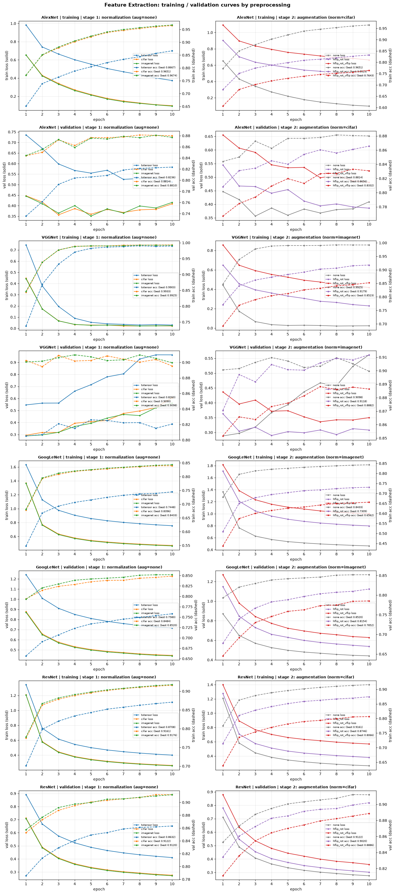

The 8 graphs above plot train_loss/acc (top) and val_loss/acc (bottom) for the Step 1 experiment (left) and the Step 2 experiment (right) on AlexNet, VGGNet, GoogLeNet, and ResNet.

### Finding 1: Data augmentation can help prevent overfitting, but it doesn't guarantee model prediction accuracy!

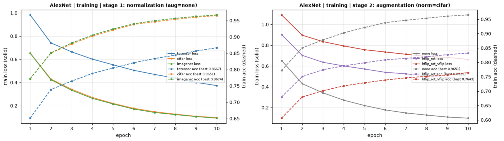

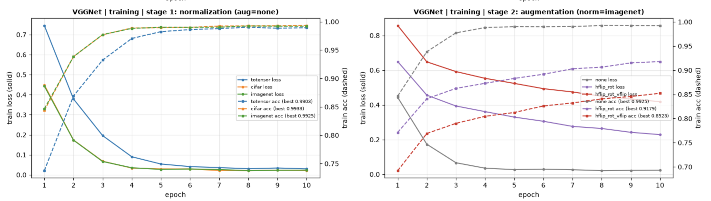

First, take a look at the four graphs above. These are the train learning curves for AlexNet and VGGNet. For both, in train, loss drops a little every epoch in both Step 1 and Step 2, and accuracy rises a little every epoch too. A very pretty, textbook picture.

<u><strong>B.U.T. validation was different.</strong></u>

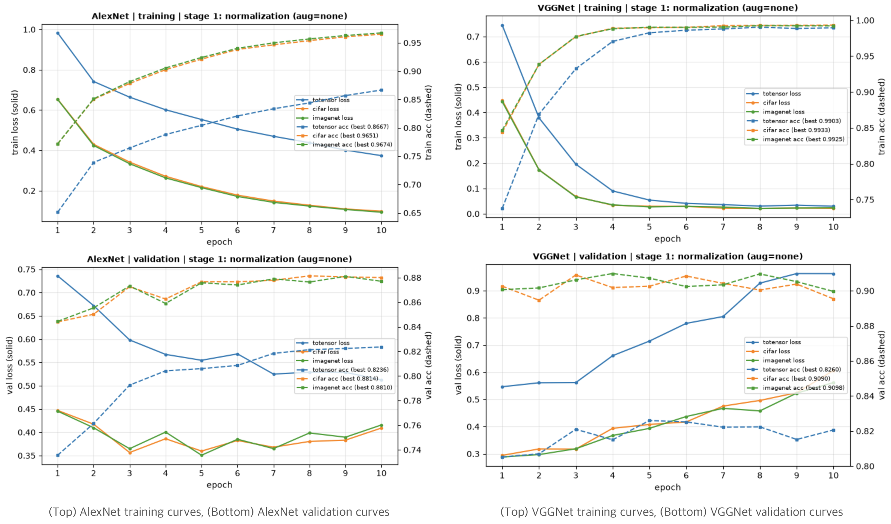

For AlexNet, loss doesn't go down every epoch; in some epochs it actually goes up and then down again, bouncing all over the place. Also, on the datasets normalized with CIFAR and ImageNet, loss doesn't decrease but jumps around, and in the 7 → 10 epoch range it actually tends to rise.

In VGGNet the trend shows up even more severely. On all three datasets, loss tends to diverge from epoch 1 to epoch 10. And acc doesn't rise every epoch either; it seems to stall at a certain level.

<u><strong><em>These are all classic signs of overfitting.</em></strong></u>

So how do things change on the datasets with augmentation applied?

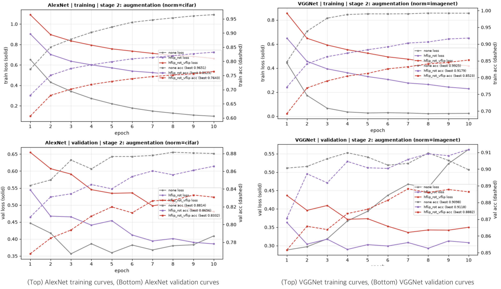

Please focus on the validation curves of the datasets with augmentation applied (purple and red).

In every case for AlexNet and VGGNet, validation loss oscillates a little, but its overall direction is heading toward 0. In contrast, on the dataset without augmentation (gray), loss oscillates and then starts to diverge. And validation accuracy on the augmented datasets also oscillates somewhat but heads toward 1.

<u><strong>In other words, data augmentation is preventing overfitting. However, the validation accuracy of the augmented datasets is not higher than that of the non-augmented one. So we can't say that data augmentation guarantees accuracy.</strong></u>

### Finding 2: Normalization: There was no meaningful difference between using the pretraining data and the transfer-learning target data as the reference. But both clearly beat plain [0, 1] scaling.

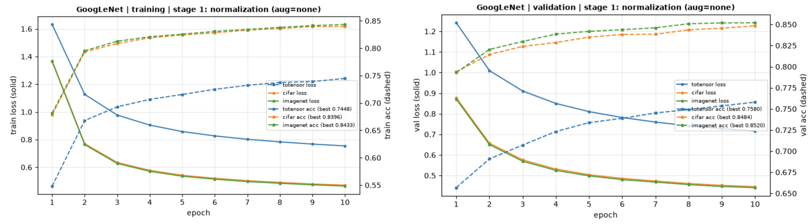

Let's check GoogLeNet's train and validation curves. The [0, 1] scaling dataset (blue) clearly sits higher in loss and lower in acc than the CIFAR and ImageNet normalization datasets (yellow, light green). But it's hard to tell which is better between CIFAR (yellow) and ImageNet (light green).

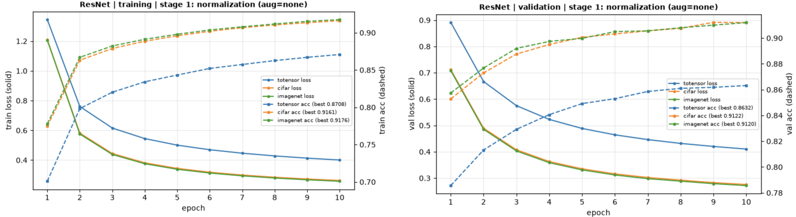

Now let's check ResNet's train and validation curves. Here too, the [0, 1] scaling dataset (blue) clearly sits higher in loss and lower in acc than the CIFAR and ImageNet normalization datasets (yellow, light green). But it's hard to tell which is better between CIFAR (yellow) and ImageNet (light green).

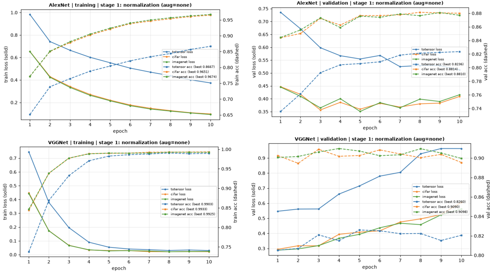

AlexNet and VGGNet also show overfitting, but you can see that the blue curve sits higher in loss and lower in acc than the yellow and light green curves.

<u><strong>In other words, whether based on the pretraining data or the transfer-learning target data, normalizing showed a clear performance difference compared to not normalizing.</strong></u>

### Finding 3: When training on CIFAR-10, it's definitely better not to use Vertical Flip.

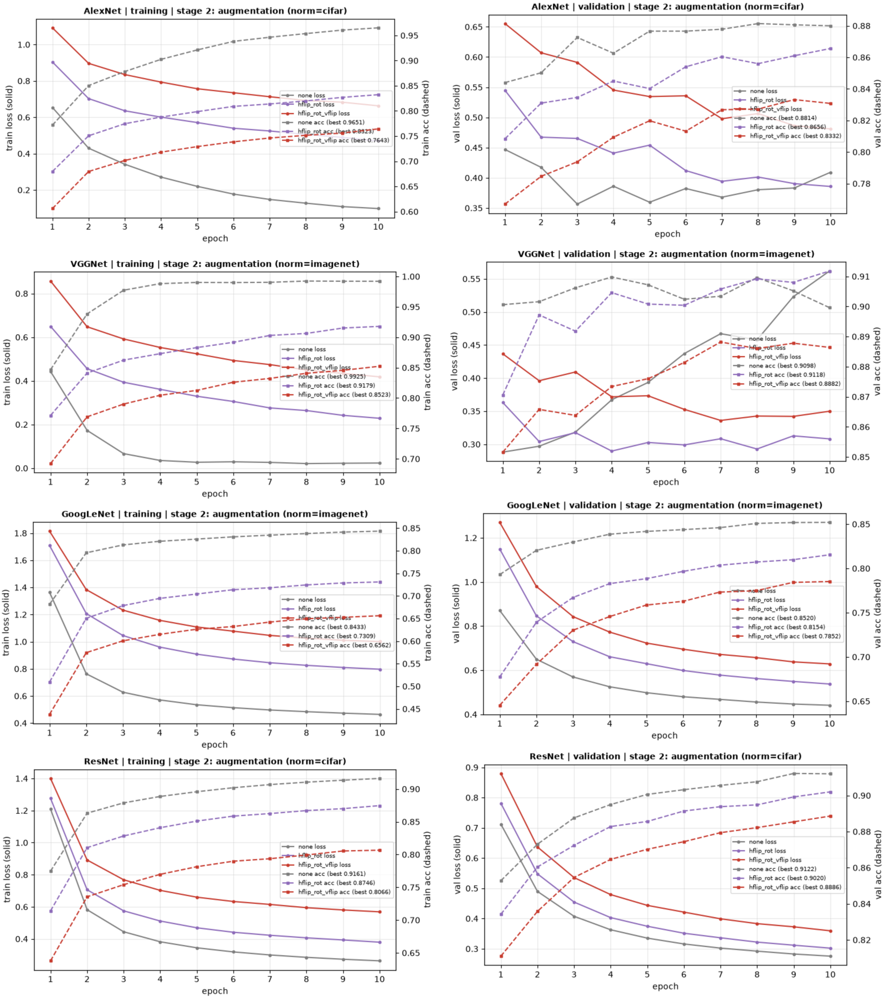

In all four models, the curve that includes vflip (red) had the highest loss and the lowest acc.

If anything, the curve without augmentation (gray) tended to have the lowest loss and the highest acc. As an exception, in VGGNet the hflip_rot curve (purple) achieved the highest acc, but since there was overfitting, it seems hard to trust.

<u><strong>In other words, data augmentation doesn't guarantee accuracy. But we can conclude that it's best not to use vflip.</strong></u>

## 6. Conclusion

With this, we can now answer the three questions I had at the start.

> 🤔 They say that in transfer learning you should normalize the target images, but should it be <u><strong>based on the pretraining data (ImageNet)</strong></u>, or <u><strong>based on the transfer-learning target images (CIFAR-10)</strong></u>?
>
> **Answer** <u><strong>→ The choice of normalization reference made no meaningful difference. But normalizing with either one performs better than not normalizing at all.</strong></u>

> <u><strong>🤔 Data augmentation</strong></u> is said to maximize generalization performance and prevent overfitting — <u><strong>is that really true?</strong></u>
>
> <u><strong>Answer → Yes, data augmentation helps improve generalization performance and prevent overfitting. But we can't say that data augmentation raises accuracy.</strong></u>

> <u><strong>🤔 VerticalFlip can damage the essential characteristics of the original data</strong></u> and thus have side effects (for example, an upside-down car is anything but typical) — when you feed such images as training data, <u><strong>is that really true?</strong></u>
>
> <u><strong>Answer → Yes, the dataset with Vertical Flip applied had the lowest performance.</strong></u>
