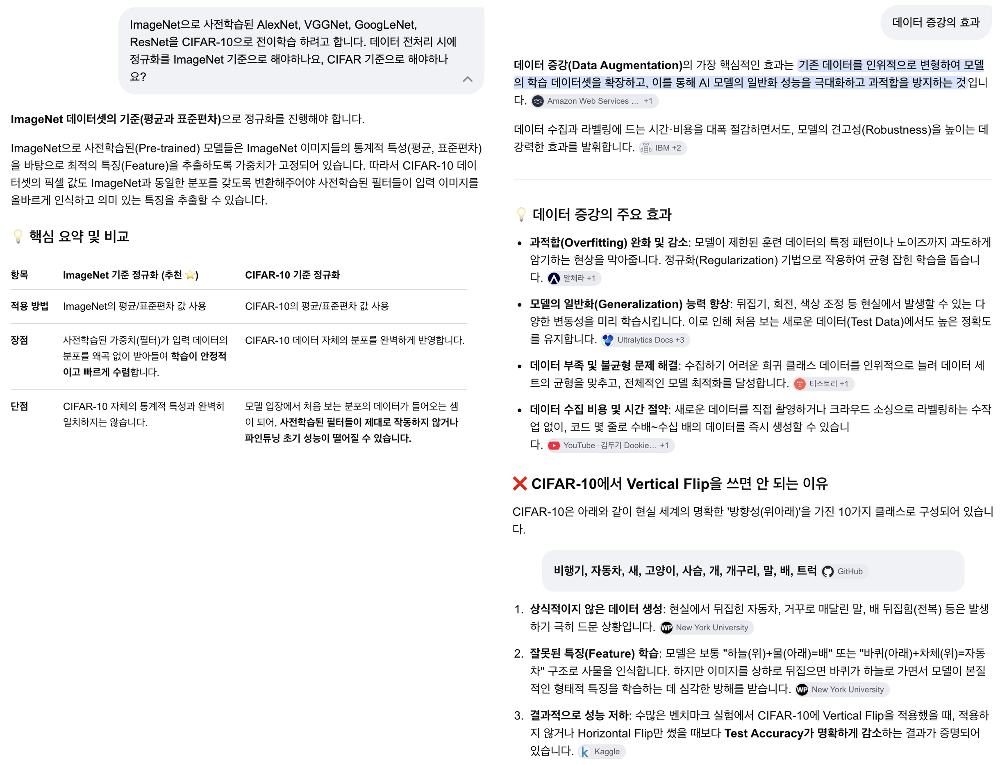
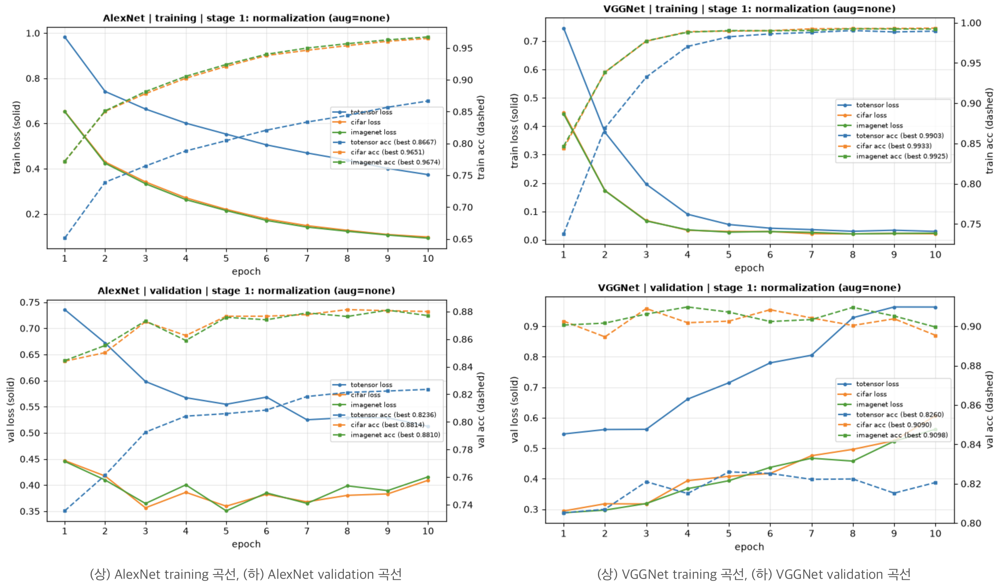
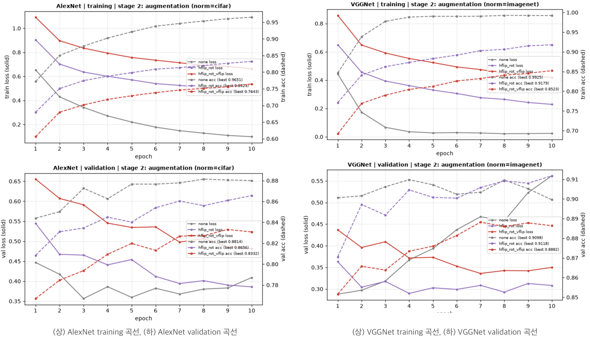

## 1. 들어가며

이번에 코드잇 부트캠프에서 컴퓨터비전에 대해 배우면서 전이학습에 대해 다뤘습니다. 그래서 ImageNet으로 학습된 AlexNet, VGGNet, GoogLeNet, ResNet 모델들에 대해서 [CIFAR-10](https://www.cs.toronto.edu/~kriz/cifar.html) 데이터로 전이학습(Transfer Learning)을 해보고, 성능을 측정해보는 실습을 해보고자 했습니다. 하지만 데이터 전처리에 앞서 이런 의문이 들었습니다.

> 🤔 전이학습을 할 때는 전이학습 대상 이미지를 정규화해야 한다고 하는데, <u><strong>사전학습 데이터(ImageNet)를 기준</strong></u>으로 해야 하는가, 아니면 <u><strong>전이학습 대상 이미지(CIFAR-10)를 기준</strong></u>으로 해야 하는가?
>
> <u><strong>🤔 데이터 증강(augmentation)</strong></u>을 하면 일반화 성능을 극대화하고 과적합을 방지할 수 있다고 하는데, <u><strong>정말 그럴까?</strong></u>
>
> <u><strong>🤔 VerticalFlip은 원본 데이터의 본질적인 특성을 훼손</strong></u>할 수 있어서 부작용이 있을 수 있다고 하는데(예를 들어 뒤집힌 자동차는 전혀 일반적이지 않은데), 이런 이미지를 학습 데이터로 주는 경우 <u><strong>정말 그럴까?</strong></u>

제미나이의 의견은 다음과 같았습니다.



하지만, 이 응답을 그대로 믿을 수 있을까요? <u><strong><em>백문이 불여일견!</em></strong></u> 한 번 실험을 해보고자 했습니다.

**실험 설계**

1. **데이터 전처리**
   - Resize는 모든 경우에 대해서 동일하게 (224,224)로 진행합니다. AlexNet과 VGGNet은 [GAP](https://medium.com/@sandhrabijoy/global-average-pooling-gradient-tape-0faf7971606c)을 쓰지 않으므로, 입력 사이즈를 맞춰야 FC가 오류 없이 돌아가기 때문입니다.
   - Normalization은 총 세 경우를 비교합니다. 1. 단순 [0,1] 스케일링만 한 경우, 2. CIFAR-10 기준으로 정규화한 경우, 3. ImageNet 기준으로 정규화한 경우.
   - Augmentation도 총 세 경우를 비교합니다. 1. 증강하지 않은 경우, 2. Hflip + rot만 한 경우, 3. Hflip + rot + Vflip까지 한 경우.

   | 구분 | Resize | Normalization | Augmentation |
   | --- | --- | --- | --- |
   | train | (224,224) | 단순 [0,1] 스케일링 | 증강 X |
   | - | - | - | Horizontal Flip + Rotation(-15~+15) |
   | - | - | - | Horizontal Flip + Rotation(-15~+15) + Vertical Flip |
   | - | (224,224) | CIFAR-10 기준 정규화 | 증강 X |
   | - | - | - | Horizontal Flip + Rotation(-15~+15) |
   | - | - | - | Horizontal Flip + Rotation(-15~+15) + Vertical Flip |
   | - | (224,224) | ImageNet 기준 정규화 | 증강 X |
   | - | - | - | Horizontal Flip + Rotation(-15~+15) |
   | - | - | - | Horizontal Flip + Rotation(-15~+15) + Vertical Flip |
   | validation | (224,224) | 단순 [0,1] 스케일링 | 증강 X |
   | - | - | CIFAR-10 기준 정규화 | 증강 X |
   | - | - | ImageNet 기준 정규화 | 증강 X |
   | test | (224,224) | 단순 [0,1] 스케일링 | 증강 X |
   | - | - | CIFAR-10 기준 정규화 | 증강 X |
   | - | - | ImageNet 기준 정규화 | 증강 X |

2. **모델 준비**
   - Colab의 무료 플랜을 사용하고 있기 때문에, 학습 시간과 리소스 소요가 가장 적은 feature extraction 학습으로 진행합니다.
   - ImageNet 데이터로 사전학습된 AlexNet, VGGNet16, GoogLeNet, ResNet 모델을 준비하고, feature extraction 부분은 freeze한 후 FC 레이어만 학습하도록 준비합니다.

     ```bash
     ==============================================================================
     • VGGNet     | trainable= 119,586,826 | total= 134,309,962 | frozen=  14,723,136
     • AlexNet    | trainable=  54,575,114 | total=  57,044,810 | frozen=   2,469,696
     • ResNet     | trainable=      20,490 | total=  23,528,522 | frozen=  23,508,032
     • GoogLeNet  | trainable=      10,250 | total=   5,610,154 | frozen=   5,599,904
     ==============================================================================
     ```

   - 원활한 비교를 위해 매 에폭 데이터를 csv로 중간중간 저장합니다.

     | 컬럼 | 의미 | 예시 |
     | --- | --- | --- |
     | model | 학습 대상 모델. | AlexNet, VGGNet, GoogLeNet, ResNet 중 하나. |
     | epoch | 학습 에폭. 1행 = (model, epoch). 1 모델이 10 에폭을 돌았다면 행이 10개. | 1 |
     | train_loss | 매 에폭 당 train_loss. | 2.1204 |
     | train_acc | 매 에폭 당 train_acc. 배치마다의 예측이 누적되어 에폭 끝 시점에 계산된다. | 0.22 |
     | val_loss | 매 에폭 당 val_loss. 에폭이 끝난 시점의 바뀐 모델로 계산한다. | 1.9521 |
     | val_acc | 매 에폭 당 val_acc. 에폭이 끝난 시점에 validation set으로 계산한다. | 0.13 |
     | epoch_sec | 매 에폭마다 소요된 학습 시간(초). | 4.34 |
     | cumulative_sec | 현재 에폭까지의 누적 학습 시간. | 4.34 |
     | lr | 학습률. | 0.001 |
     | trainable_params | 학습 대상 파라미터 수. | 57044810 |
     | total_params | 모델이 갖고 있는 총 파라미터 수. | 57044810 |
     | batch_size | 배치 사이즈. | |
     | optimizer | 옵티마이저. | Adam |
     | seed | 난수 시드값. | 42 |
     | device | 학습 머신. | cuda, mps 중 하나. |

3. **실험**
   - Colab 무료 플랜의 한계 때문에, train 9가지 경우를 모두 Grid Search할 수는 없습니다. 따라서 스텝을 나눠서 실험을 진행합니다.
     1. Step 1: 세 가지 Normalization 전략 중 가장 우수한 성능의 Normalization이 무엇인지 뽑습니다.
     2. Step 2: Step 1에서 우승한 Normalization 전략 위에서 Augmentation 세 가지 전략을 비교합니다.
   - **감수하는 한계**: Step 1에서 탈락한 Normalization 전략은 Augmentation 실험이 되지 않기 때문에 모든 경우에 대한 데이터를 얻을 수는 없습니다.
4. **실험 결과 데이터 시각화 및 비교**
   - AlexNet, VGGNet, GoogLeNet, ResNet 네 모델 각각에 대해서 9가지 경우의 데이터 전처리 성능을 비교합니다.
   - train 학습 곡선과 validation 곡선을 보면서 데이터 전처리가 모델 학습에 미치는 영향을 눈으로 확인합니다.
   - 각 모델별로 feature extraction 학습의 경우 어떤 데이터 전처리 전략이 좋은지 파악합니다.

**실험 코드**

- [ :github: GitHub 레포지토리](https://github.com/raewoo0908/codeit/blob/main/course/part2/computer_vision/workbook/07_modeling_CIFAR10_practice.ipynb)

**실험 결과 데이터 .csv**

- [ :github: GitHub 레포지토리](https://github.com/raewoo0908/codeit/blob/main/course/part2/computer_vision/workbook/results/transfer_train_log.csv)

> 📌 **NOTE**
>
> **이 실험은 본래 데이터 전처리 전략 비교만을 위한 실험이 아니었습니다. 이 실험의 목적은 본래 두 가지였습니다.**
>
> 1. 데이터 전처리 전략을 실험한다.
> 2. Training From the Scratch VS Feature Extraction VS Full Fine Tuning 세 학습 방식의 성능과 학습 효율성을 비교한다.
>
> 하지만 이번 포스트에서는 첫 번째 목표에 대한 내용만 다루고 있습니다. 두 번째 목표에 대한 내용은 다음 포스트에서 찾아뵙겠습니다.

## 2. 데이터 전처리

CIFAR-10은 32x32 크기의 컬러 이미지로, train 50,000장과 test 10,000장이 제공됩니다. test는 최종 평가용으로 그대로 두고, train 50,000장을 다시 9:1로 나눠서 validation을 만들었습니다. 이때 클래스 비율이 train과 validation에서 똑같이 유지되도록 stratified 분할을 썼습니다.

```python
from sklearn.model_selection import train_test_split

VAL_RATIO = 0.1          # train(50,000) 중 validation 비율
RESIZE = (224, 224)      # 사전학습 모델 입력 크기로 통일

train_targets = cifar10_train_dataset.targets
train_indices, val_indices = train_test_split(
    np.arange(len(train_targets)),
    test_size=VAL_RATIO,
    stratify=train_targets,   # 클래스별 비율을 train/val에 동일하게 유지
    random_state=RANDOM_SEED,
)
test_indices = np.arange(len(cifar10_test_dataset))  # test는 10,000장 그대로
```

결과적으로 train 45,000장, validation 5,000장, test 10,000장이 준비됩니다.

### 2.1. 정규화 세 가지

정규화에 쓸 평균과 표준편차부터 준비합니다. CIFAR-10은 train 데이터 전체에서 채널(R, G, B)별로 직접 계산했습니다. 반면 ImageNet은 이 실험 하나를 위해 수백만 장의 이미지를 내려받을 수는 없으니, 널리 알려진 값을 믿고 그대로 썼습니다.

```python
# CIFAR-10: 내 데이터에서 채널별 평균/표준편차를 직접 계산
train_data = cifar10_train_dataset.data.astype(np.float32) / 255.0  # (50000, 32, 32, 3)
cifar_mean = train_data.mean(axis=(0, 1, 2)).tolist()
cifar_std = train_data.std(axis=(0, 1, 2)).tolist()

# ImageNet: 널리 알려진 통계값
imagenet_mean = [0.485, 0.456, 0.406]
imagenet_std = [0.229, 0.224, 0.225]
```

```text
CIFAR-10 계산된 mean : [0.4914, 0.4822, 0.4465]
CIFAR-10 계산된 std  : [0.2470, 0.2435, 0.2616]
```

두 값이 생각보다 비슷하죠? 이 세 가지 방식을 이미지에 적용해서 나란히 놓고 보면 이렇습니다.

![CIFAR-10 이미지 다섯 장에 원본, ToTensor [0,1], CIFAR-10 정규화, ImageNet 정규화를 적용해 나란히 비교한 그리드](./image/cifar10-normalize-comparison.png)

사람 눈에는 거의 똑같아 보입니다. 정규화된 값은 음수나 1을 넘는 값이 섞여 있어서, 화면에 그릴 때는 다시 [0,1]로 늘려서 보여주기 때문입니다. 하지만 모델이 실제로 받는 값의 범위는 꽤 다릅니다.

| 정규화 | 샘플 한 장의 값 범위 |
| --- | --- |
| 단순 [0,1] 스케일링 | [0.000, 0.992] |
| CIFAR-10 기준 정규화 | [-1.989, 2.027] |
| ImageNet 기준 정규화 | [-2.118, 2.501] |

코드에서는 정규화 방식 이름을 받아서 해당하는 변환 단계를 돌려주는 함수로 만들었습니다. 단순 [0,1] 스케일링은 `ToDtype(scale=True)`가 이미 해주므로 추가로 할 게 없습니다.

```python
def build_normalize_step(norm_name: str) -> list:
    if norm_name == "totensor":
        return []  # [0,1] 스케일링만 (ToDtype scale=True) — 별도 Normalize 없음
    if norm_name == "cifar":
        return [v2.Normalize(mean=cifar_mean, std=cifar_std)]
    if norm_name == "imagenet":
        return [v2.Normalize(mean=imagenet_mean, std=imagenet_std)]
```

### 2.2. 증강 세 가지

증강도 똑같이 확인해봤습니다. 효과를 확실히 보기 위해 여기서는 Flip을 항상(p=1.0) 적용했습니다.


Horizontal Flip과 Rotation은 증강이 돼도 여전히 그럴 법한 사진입니다. 반면 Vertical Flip을 보면, 뒤집힌 자동차와 트럭, 거꾸로 선 사슴이 나옵니다. 현실에서는 거의 볼 일이 없는 사진들이죠. 제미나이가 걱정한 게 바로 이 부분입니다.

실제 학습에서는 Flip을 50% 확률로, Rotation을 -15도 ~ +15도 범위에서 무작위로 적용했습니다.

```python
def build_augment_step(aug_name: str) -> list:
    if aug_name == "hflip_rot":
        return [v2.RandomHorizontalFlip(p=0.5), v2.RandomRotation(degrees=15)]
    if aug_name == "hflip_rot_vflip":
        return [
            v2.RandomHorizontalFlip(p=0.5),
            v2.RandomRotation(degrees=15),
            v2.RandomVerticalFlip(p=0.5),
        ]
    if aug_name == "none":
        return []
```

### 2.3. train 9가지, validation · test 3가지 조립하기

이제 Resize, 증강, 정규화를 Compose()로 이어 붙입니다. 증강은 validation과 test에는 넣지 않고 train에만 넣습니다. 검증과 평가는 원본 분포 그대로 해야 하니까요.

```python
def build_train_transform(norm_name: str, aug_name: str) -> v2.Compose:
    """학습용: Resize -> (증강) -> float 스케일링 -> (정규화)"""
    return v2.Compose(
        [v2.ToImage(), v2.Resize(RESIZE)]
        + build_augment_step(aug_name)              # 증강은 uint8 상태에서 수행
        + [v2.ToDtype(torch.float32, scale=True)]   # 0~255 -> [0,1]
        + build_normalize_step(norm_name)
    )


def build_eval_transform(norm_name: str) -> v2.Compose:
    """검증/테스트용: 증강 없이 Resize -> float 스케일링 -> (정규화)"""
    return v2.Compose(
        [v2.ToImage(), v2.Resize(RESIZE), v2.ToDtype(torch.float32, scale=True)]
        + build_normalize_step(norm_name)
    )
```

여기서 한 가지 신경 쓴 점이 있습니다. 9가지 train 데이터셋이 서로 **다른 이미지**를 쓰면, 성능 차이가 전처리 때문인지 이미지 때문인지 알 수 없게 됩니다. 그래서 모든 데이터셋이 **같은 인덱스 분할**을 공유하고, transform만 갈아 끼우도록 작은 래퍼를 만들었습니다. 원본을 참조만 하니 데이터를 9번 복제하지 않아도 되는 효과도 있습니다.

```python
class TransformedDataset(Dataset):
    """원본 데이터셋에서 지정된 인덱스만 골라 지정된 transform을 적용하는 래퍼."""

    def __init__(self, base_dataset, indices, transform):
        self.base_dataset = base_dataset
        self.indices = list(indices)
        self.transform = transform

    def __len__(self):
        return len(self.indices)

    def __getitem__(self, i):
        img, label = self.base_dataset[self.indices[i]]
        return self.transform(img), label


NORM_TYPES = ["totensor", "cifar", "imagenet"]
AUG_TYPES = ["hflip_rot", "hflip_rot_vflip", "none"]

# train: 정규화 × 증강 = 9가지 (키: "정규화__증강")
train_datasets = {
    f"{norm}__{aug}": TransformedDataset(
        cifar10_train_dataset, train_indices, build_train_transform(norm, aug)
    )
    for norm in NORM_TYPES
    for aug in AUG_TYPES
}
# validation / test: 정규화 3가지 (증강 없음)
val_datasets = {
    norm: TransformedDataset(cifar10_train_dataset, val_indices, build_eval_transform(norm))
    for norm in NORM_TYPES
}
test_datasets = {
    norm: TransformedDataset(cifar10_test_dataset, test_indices, build_eval_transform(norm))
    for norm in NORM_TYPES
}
```

```text
• train 데이터셋 조합      : 9가지
    - totensor__hflip_rot / totensor__hflip_rot_vflip / totensor__none
    - cifar__hflip_rot    / cifar__hflip_rot_vflip    / cifar__none
    - imagenet__hflip_rot / imagenet__hflip_rot_vflip / imagenet__none
• validation 데이터셋 조합 : 3가지 -> ['totensor', 'cifar', 'imagenet']
• test 데이터셋 조합       : 3가지 -> ['totensor', 'cifar', 'imagenet']
```

## 3. 모델 준비

torchvision에서 ImageNet으로 사전학습된 가중치를 불러오고, 마지막 출력층을 CIFAR-10의 10개 클래스에 맞게 바꿉니다. 그리고 특징을 추출하는 부분(backbone)은 freeze해서 학습되지 않도록 막아둡니다. VGGNet은 BatchNorm이 들어간 `vgg16_bn`, ResNet은 `resnet50`을 썼습니다.

```python
PRETRAINED_WEIGHTS = "DEFAULT"   # 각 모델의 ImageNet 사전학습 가중치
NUM_CLASSES = 10


def _freeze(module):
    for p in module.parameters():
        p.requires_grad_(False)


def build_alexnet_tf():
    m = models.alexnet(weights=PRETRAINED_WEIGHTS)
    _freeze(m.features)                                                    # conv backbone만 freeze
    m.classifier[6] = nn.Linear(m.classifier[6].in_features, NUM_CLASSES)  # 출력층 10개로 교체
    return m


def build_vggnet_tf():
    m = models.vgg16_bn(weights=PRETRAINED_WEIGHTS)
    _freeze(m.features)
    m.classifier[6] = nn.Linear(m.classifier[6].in_features, NUM_CLASSES)
    return m


def build_resnet_tf():
    m = models.resnet50(weights=PRETRAINED_WEIGHTS)
    _freeze(m)                                        # 전체 freeze 후
    m.fc = nn.Linear(m.fc.in_features, NUM_CLASSES)   # fc만 새로 만들어 학습
    return m


def build_googlenet_tf():
    m = models.googlenet(weights=PRETRAINED_WEIGHTS)  # 보조 분류기(aux)는 끈 상태
    _freeze(m)
    m.fc = nn.Linear(m.fc.in_features, NUM_CLASSES)
    return m
```

0절에서 본 파라미터 수가 모델마다 크게 다른 이유가 여기 있습니다. AlexNet과 VGGNet은 분류기(classifier)가 FC 레이어 세 개로 이루어져 있어서, conv 부분만 freeze해도 학습할 파라미터가 수천만 ~ 1억 개가 넘습니다. 반면 ResNet과 GoogLeNet은 GAP 뒤에 FC 한 층만 붙어 있어서 학습할 파라미터가 2만 개, 1만 개 정도밖에 되지 않습니다.

```bash
==============================================================================
• VGGNet     | trainable= 119,586,826 | total= 134,309,962 | frozen=  14,723,136
• AlexNet    | trainable=  54,575,114 | total=  57,044,810 | frozen=   2,469,696
• ResNet     | trainable=      20,490 | total=  23,528,522 | frozen=  23,508,032
• GoogLeNet  | trainable=      10,250 | total=   5,610,154 | frozen=   5,599,904
==============================================================================
```

GoogLeNet의 보조 분류기(aux1, aux2)는 껐습니다. 보조 분류기는 중간 층에 gradient를 넣어서 backbone 학습을 돕는 장치인데, backbone이 freeze된 상태에서는 할 일이 없기 때문입니다. 게다가 켜두면 보조 분류기의 loss가 train_loss에 섞여서 다른 모델과 loss를 비교하기도 어려워집니다.

> 💡 **`requires_grad=False`만으로는 BatchNorm이 완전히 멈추지 않습니다.**
>
> BatchNorm은 학습 파라미터(weight, bias) 말고도 `running_mean`, `running_var`라는 통계값을 따로 갖고 있습니다. 이 값은 gradient가 아니라 `model.train()` 상태에서 forward를 할 때마다 갱신됩니다. 즉, freeze를 해도 train 모드로 돌리면 ImageNet에서 배운 통계가 CIFAR-10 쪽으로 조금씩 바뀌어 버립니다. 그래서 `model.train()`을 호출한 뒤에, freeze된 BatchNorm만 다시 eval 모드로 돌려놨습니다.
>
> ```python
> def _set_frozen_bn_eval(model):
>     for mod in model.modules():
>         if isinstance(mod, nn.modules.batchnorm._BatchNorm) and not any(
>             p.requires_grad for p in mod.parameters()
>         ):
>             mod.eval()
> ```

## 4. 학습

모든 run은 같은 조건으로 학습합니다. 달라지는 건 오직 train 데이터셋(정규화 × 증강)뿐입니다.

| 항목 | 값 |
| --- | --- |
| 에폭 | 10 |
| 옵티마이저 | Adam (lr = 1e-4) |
| 배치 사이즈 | 64 |
| 시드 | 42 (run마다 다시 고정 → 같은 헤드 초기값, 같은 셔플 순서에서 출발) |
| 정밀도 | AMP(fp16, cuda일 때) |

### Step 1: 정규화 고르기 — feature를 한 번만 뽑아서 재사용하기

Step 1은 증강을 하지 않습니다. 그런데 증강이 없고 backbone도 고정되어 있다면, 같은 이미지는 매 에폭 **완전히 같은 feature**로 바뀌어 나옵니다. 그렇다면 무거운 backbone을 매 에폭 다시 돌릴 이유가 없겠죠? 그래서 (모델, 정규화) 조합마다 backbone을 딱 한 번만 통과시켜 feature를 메모리에 모아두고, 10 에폭 동안은 가벼운 FC 헤드만 학습했습니다. Colab 무료 플랜에서 시간을 아끼는 데 가장 큰 역할을 한 부분입니다.

```python
# ① 헤드를 떼고(Identity) eval 모드로 돌리면 model(x) = 헤드 입력 feature
setattr(model, attr, nn.Identity())
model.eval()
train_f, train_y = _extract_features(model, train_loader)
val_f, val_y = _extract_features(model, val_loader)
setattr(model, attr, head)   # 헤드 원위치

# ② backbone은 CPU로 내리고, 헤드만 GPU에 올려 캐싱한 feature로 학습
model.to("cpu")
net = head.to(device)
```

Step 1이 끝나면 모델별로 best val_acc가 가장 높은 정규화를 자동으로 고릅니다. 동점이면 사전학습 데이터와 분포가 가장 가까운 순서(ImageNet → CIFAR-10 → [0,1] 스케일링)로 우선권을 줬습니다.

```python
STAGE1_TIE_PRIORITY = ["imagenet", "cifar", "totensor"]

def pick_stage1_winner(name):
    best = {}
    for r in _read_csv_rows_tf():
        if r["model"] == name and r["stage"] == "1":
            best[r["dataset"]] = max(best.get(r["dataset"], -1.0), float(r["val_acc"]))
    scores = {norm: best[f"{norm}__none"] for norm in NORM_TYPES}
    top = max(scores.values())
    winner = next(norm for norm in STAGE1_TIE_PRIORITY if scores[norm] == top)
    return winner, scores
```

### Step 2: 증강 비교하기

Step 2는 우승한 정규화 위에서 증강 세 가지를 비교합니다. 이번에는 증강 때문에 매 에폭 입력 이미지가 달라지므로 feature를 캐싱할 수 없습니다. 그래서 매 배치 이미지를 backbone부터 통과시키는 일반적인 방식으로 학습합니다. 이때 앞에서 만든 `_set_frozen_bn_eval`이 매 에폭 호출되어 BatchNorm 통계를 ImageNet 값으로 고정합니다. 증강 none 조합은 Step 1에서 이미 학습했으니 건너뜁니다.

```python
TRANSFER_RUN_MODELS = ["ResNet", "GoogLeNet", "AlexNet", "VGGNet"]  # 빠른 모델부터

# Step 1: 증강 none 고정, 정규화 3종 (feature 캐싱)
for name in TRANSFER_RUN_MODELS:
    for norm in NORM_TYPES:
        run_transfer(name, f"{norm}__none", stage=1)

# Step 2: 모델별 Step 1 우승 정규화 × 증강 3종
for name in TRANSFER_RUN_MODELS:
    best_norm, scores = pick_stage1_winner(name)
    for aug in ["hflip_rot", "hflip_rot_vflip", "none"]:
        run_transfer(name, f"{best_norm}__{aug}", stage=2)   # none은 Step 1 결과 재사용
```

Colab 세션은 언제든 끊길 수 있기 때문에, run(모델 × train 데이터셋) 하나가 끝날 때마다 학습된 FC 헤드와 10 에폭 분량의 기록을 csv에 저장했습니다. 세션이 끊겨도 셀을 다시 실행하면 이미 끝난 run은 건너뛰고 이어서 학습합니다. 빠른 모델부터 돌린 것도 같은 이유입니다. 중간에 끊기더라도 완주한 모델이 최대한 많이 남도록요.

## 5. 결과 분석

> 📌 **이 실험의 한계**
>
> 1. **학습 자원과 시간 관계상 k-fold validation을 하지 못했습니다. 단 한 번의 학습과 validation으로 낸 결론이라는 것을 양해해주세요.**
> 2. **학습 자원과 시간 관계상 10 epoch까지만 실험했습니다.**
> 3. **Feature Extraction 학습 방법의 경우에만 해당됩니다. Training From the Scratch나 Full Fine Tuning에서도 동일한 결과가 나온다고 보장할 수 없습니다.**
> 4. **이 실험은 ImageNet으로 사전학습된 모델들에 대해서 CIFAR-10 분류로 전이학습하는 목적에 국한됩니다. 다른 도메인이나 다른 데이터셋에서 동일한 결과가 나올 거라고 보장할 수 없습니다.**


위 8개의 그래프는 AlexNet, VGGNet, GoogLeNet, ResNet에서의 Step 1 실험(좌), Step 2 실험(우)에서의 train_loss/acc(상), val_loss/acc(하)를 그린 겁니다.

### 발견 1: 데이터 증강은 과적합 방지에 도움이 될 수 있지만, 모델 예측 정확도를 보장하지는 않는다!


우선 위 네 개의 그래프를 확인해보세요. AlexNet과 VGGNet에서의 train 학습 곡선입니다. 둘 다 train의 경우 Step 1, Step 2 모두 loss는 매 에폭 조금씩 줄고 있고, accuracy도 매 에폭 조금씩 늘고 있습니다. 아주 예쁜, 교과서적인 모습을 보여주고 있습니다.

<u><strong>하.지.만. validation은 달랐습니다.</strong></u>



AlexNet의 경우, 매 에폭 loss가 줄어드는 것이 아니라 어떤 에폭에서는 오히려 loss가 늘어났다가 또 줄어들었다가 하는 등 널뛰기를 하곤 합니다. 또, CIFAR와 ImageNet 기준으로 정규화한 데이터셋에서는 loss가 줄어들지 않고 날뛰다가 7 → 10 에폭 구간에는 loss가 오히려 상승하는 경향을 보이고 있습니다.

VGGNet에서는 그 경향이 더 심하게 드러납니다. 세 데이터셋 모두에서 loss가 1에폭부터 10에폭까지 발산하는 경향을 보이고 있습니다. acc도 매 에폭 느는 게 아니라 어느 정도에서 멈춰 있네요.

<u><strong><em>모두 전형적인 과적합(Overfitting)의 신호입니다.</em></strong></u>

그러면, 증강이 적용된 데이터셋에서는 어떻게 변할까요?



증강이 적용된 데이터셋의 validation 곡선을 집중해서 봐주세요(보라색과 빨간색).

AlexNet과 VGGNet 모든 경우에서 validation loss가 조금씩 진동하긴 하지만, 전체적인 방향성이 0을 향하고 있습니다. 반면 증강이 적용되지 않은 데이터셋(회색)은 loss가 진동하다가 발산하려고 하고 있네요. 그리고 validation accuracy도 증강이 적용된 데이터셋에서는 어느 정도 진동이 있긴 하지만 1을 향해 가고 있습니다.

<u><strong>즉, 데이터 증강은 과적합을 막아주고 있습니다. 하지만 데이터 증강이 적용된 데이터셋의 validation accuracy가 그렇지 않은 데이터셋에 비해서 높지는 않습니다. 이는 데이터 증강이 정확도를 보장한다고 볼 수는 없는 것이겠지요.</strong></u>

### 발견 2: 정규화: 사전학습 데이터 기준과 전이학습 대상 데이터 기준에 유의미한 차이는 없었다. 하지만 단순 [0, 1] 스케일링보다는 확실히 성능이 좋았다.


GoogLeNet의 train 곡선과 validation 곡선을 확인해보겠습니다. [0, 1] 스케일링 데이터셋(파란색)이 CIFAR, ImageNet 정규화 데이터셋(노란색, 연두색)보다 확실히 loss는 위에 있고, acc는 낮게 있네요. 하지만 CIFAR(노란색)과 ImageNet(연두색)의 우열은 가리기 힘들어 보입니다.


이제 ResNet의 train 곡선과 validation 곡선을 확인해보겠습니다. 이것도 마찬가지로 [0, 1] 스케일링 데이터셋(파란색)이 CIFAR, ImageNet 정규화 데이터셋(노란색, 연두색)보다 확실히 loss는 위에 있고, acc는 낮게 있네요. 하지만 CIFAR(노란색)과 ImageNet(연두색)의 우열은 가리기 힘들어 보입니다.


AlexNet과 VGGNet도 과적합이 보이긴 하지만, 파란색 곡선이 노란색, 연두색 곡선보다 loss는 더 위에 있고 acc는 더 아래에 있는 걸 확인할 수 있습니다.

<u><strong>즉, 사전학습 데이터든 전이학습 대상 데이터든, 정규화는 하는 게 하지 않는 것보다 뚜렷한 성능 차이를 보였습니다.</strong></u>

### 발견 3: CIFAR-10 학습 시에 Vertical Flip은 확실히 쓰지 않는 게 좋다.


네 모델 모두에서 vflip이 포함된 곡선(빨간색)이 loss는 제일 높았고, acc는 제일 낮았습니다.

오히려 증강을 하지 않은 곡선(회색)이 loss는 제일 낮고 acc는 제일 높은 경향을 보였네요. 예외적으로 VGGNet에서는 hflip_rot 곡선(보라색)이 가장 높은 acc를 달성했지만, 과적합이 있었으므로 신뢰하기는 힘들다고 보입니다.

<u><strong>즉, 데이터 증강이 정확도를 보장하지는 않습니다. 하지만 vflip은 쓰지 않는 것이 가장 좋다는 결론을 내릴 수 있습니다.</strong></u>

## 6. 결론

이로써 처음에 들었던 세 의문에 답을 내릴 수 있게 되었습니다.

> 🤔 전이학습을 할 때는 전이학습 대상 이미지를 정규화해야 한다고 하는데, <u><strong>사전학습 데이터(ImageNet)를 기준</strong></u>으로 해야 하는가, 아니면 <u><strong>전이학습 대상 이미지(CIFAR-10)를 기준</strong></u>으로 해야 하는가?
>
> **답** <u><strong>→ 정규화 기준에 따른 차이는 유의미하지 않았습니다. 하지만 어떤 것이든 정규화를 하는 게 하지 않는 것보다 성능이 더 좋습니다.</strong></u>

> <u><strong>🤔 데이터 증강(augmentation)</strong></u>을 하면 일반화 성능을 극대화하고 과적합을 방지할 수 있다고 하는데, <u><strong>정말 그럴까?</strong></u>
>
> <u><strong>답 → 네, 데이터 증강은 일반화 성능을 올리고, 과적합을 방지하는 데 도움이 됩니다. 하지만 데이터 증강이 정확도를 올린다고 볼 수는 없습니다.</strong></u>

> <u><strong>🤔 VerticalFlip은 원본 데이터의 본질적인 특성을 훼손</strong></u>할 수 있어서 부작용이 있을 수 있다고 하는데(예를 들어 뒤집힌 자동차는 전혀 일반적이지 않은데), 이런 이미지를 학습 데이터로 주는 경우 <u><strong>정말 그럴까?</strong></u>
>
> <u><strong>답 → 네, Vertical Flip을 적용한 데이터셋이 제일 성능이 낮았습니다.</strong></u>
