## 0. Introduction

In the CodeIt AI Engineer course, I worked on a hands-on project to identify pneumonia patients from chest X-ray images. <u><strong>The goal of this mission is to build a classification model that takes an X-ray image as input and determines whether the patient has pneumonia</strong></u>. To do this, I planned to transfer-learn an image classification model pretrained on ImageNet onto the X-ray images.

> **Dataset used**
>
> :kaggle: [Kaggle Chest X-Ray Images (Pneumonia)](https://www.kaggle.com/datasets/paultimothymooney/chest-xray-pneumonia)

> **EDA code**
>
> :github: [GitHub repository](https://github.com/raewoo0908/codeit_finetuning_for_x_ray/blob/main/eda.ipynb)

However, you should not feed the data into model training as-is. <u><strong>You must first understand how the data is distributed and what characteristics it has, and then apply an appropriate preprocessing strategy before using it for training.</strong></u> This is because data quality is crucial to training a model successfully.

The overall process goes in the following order.

> 📌 **EDA Steps**
>
> 1. **Check class ratios**
>    - **Purpose**
>      - Check whether the classes are evenly distributed across the train/val/test datasets, and review whether augmentation is needed during preprocessing.
>      - Establish the baseline when the model simply guesses PNEUMONIA for everything.
>      - Check whether val/test have enough data, and review whether the dataset needs to be re-split.
>      - If a re-split is needed, decide the split ratio and the grouping criteria as well.
> 2. **Visually inspect the images**
>    - **Purpose**
>      - Look at images by split and by class with my own eyes to examine their characteristics directly.
> 3. **Check image sizes and channels**
>    - **Purpose**
>      - Review whether the images can be fed as-is into a model trained on ImageNet, and review the need for preprocessing that unifies image size and channels, along with the candidates and their trade-offs.
>      - Review whether a histogram equalization technique (CLAHE) is needed.
> 4. **Detailed image analysis**
>    - **Purpose**
>      - ImageNet consists of color images, whose 3 channels have different pixel values. X-rays, on the other hand, are grayscale. Decide whether to normalize with ImageNet statistics or with the dataset's own statistics.
> 5. **Check for duplicate images**
>    - **Purpose**
>      - Check whether there are exact duplicate images across train/val/test, and establish deduplication criteria.
> 6. **Check for duplicate patients**
>    - **Purpose**
>      - If X-rays of the same patient end up split across train/val/test, there may be a risk of data leakage. Check whether this risk is real.

## 1. Class Distribution: Checking Absolute Counts and Ratios

First, I checked in what proportions each class is distributed across each split.

|  | **count** |  | **ratio** |  |
| --- | --- | --- | --- | --- |
| **split** | **NORMAL** | **PNEUMONIA** | **NORMAL** | **PNEUMONIA** |
| train | 1341 | 3875 | 0.257 | 0.743 |
| val | 8 | 8 | 0.500 | 0.500 |
| test | 234 | 390 | 0.375 | 0.625 |

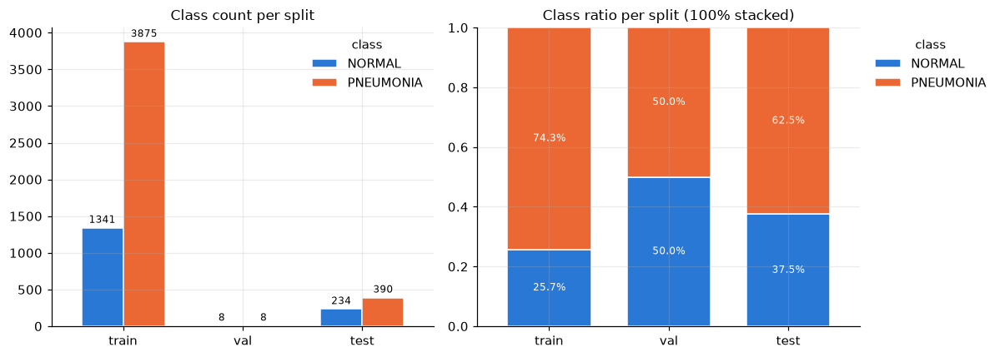

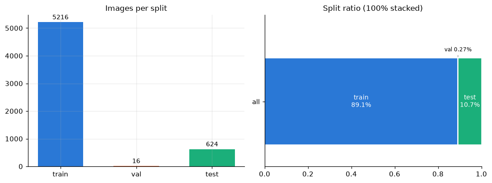

I found a few problems.

1. **The splits were imbalanced.** In particular, the validation split had only 16 images.
2. Every split had severe **class imbalance**.
   - train+val
     - NORMAL : PNEUMONIA ≈ 3:7
   - test
     - NORMAL : PNEUMONIA ≈ 0.4:0.6

I also measured the performance baseline when every prediction is PNEUMONIA.

| **split** | **accuracy** | **precision** | **recall** | **f1** |
| --- | --- | --- | --- | --- |
| train | 0.743 | 0.743 | 1.0 | 0.852 |
| val | 0.500 | 0.500 | 1.0 | 0.667 |
| test | 0.625 | 0.625 | 1.0 | 0.769 |

Therefore, I reached the following **conclusions**.

1. <u><strong>Merge train and val and re-split them at a 9:1 ratio</strong></u>. This is because train+val : test ≈ 9:1.
2. Use `WeightedRandomSampler` in the `DataLoader` <u><strong>to mitigate the class imbalance</strong></u>.

## 2. Visually Inspecting the Actual Images

Looking at the data statistically is important, but for image data in particular, inspecting it with your own eyes is essential.

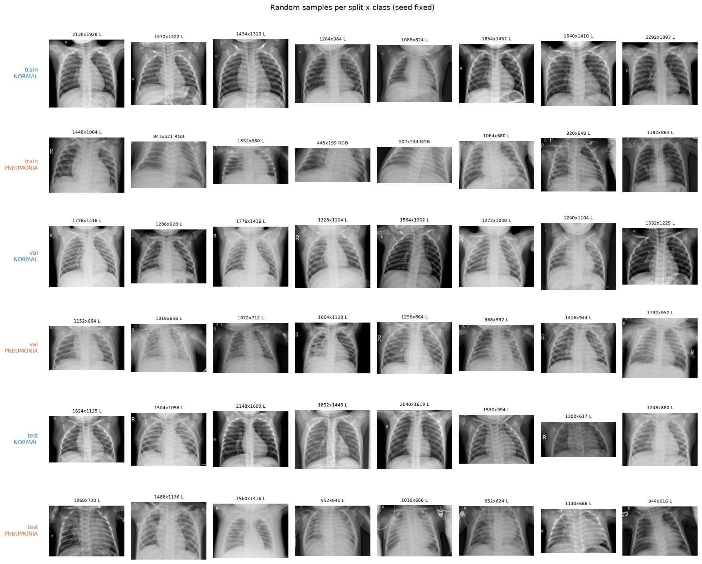

Looking at the images by split and by class with my own eyes, I made a few findings.

- L/R markers and white lines that appear to be medical equipment were visible in the images.
- The aspect ratios of the images varied a lot.

From this, I got a few **points to watch out for**.

- <u><strong>The L/R markers and medical equipment lines</strong></u> may affect training.
- If <u><strong>the aspect ratio difference between classes</strong></u> is significant, that difference may affect training.

## 3.1. Image Size and Aspect Ratio Distribution per Split

If the image size and aspect ratio distributions differ across train/val/test, we may not be able to fully trust the validation performance. So I checked whether image size and aspect ratio differ by split.

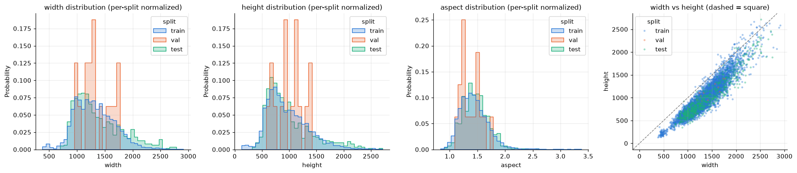

|  | Statistic | **train** | **val** | **test** |
| --- | --- | --- | --- | --- |
| width | min | 384.00 | 968.00 | 728.00 |
|  | 5% | 840.00 | 1004.00 | 889.20 |
|  | 50% | 1284.00 | 1280.00 | 1265.00 |
|  | 95% | 1928.00 | 1746.00 | 2224.50 |
|  | max | 2916.00 | 1776.00 | 2752.00 |
| height | min | 127.00 | 592.00 | 344.00 |
|  | 5% | 504.00 | 640.00 | 537.20 |
|  | 50% | 888.00 | 996.00 | 870.50 |
|  | 95% | 1670.00 | 1416.00 | 1914.65 |
|  | max | 2663.00 | 1416.00 | 2713.00 |
| aspect | min | 0.84 | 1.12 | 0.93 |
|  | 5% | 1.10 | 1.18 | 1.13 |
|  | 50% | 1.41 | 1.36 | 1.45 |
|  | 95% | 1.87 | 1.66 | 1.86 |
|  | max | 3.38 | 1.73 | 2.58 |

**Findings**

- Less than 5% of all images have an aspect ratio below 1.10. <u><strong>In other words</strong></u>, <u><strong>95% of all images are wider than they are tall</strong></u>.
- The aspect ratio is similar across train, val, and test. There was no difference in aspect ratio by split. <u><strong>Therefore, there is no need to re-split because of aspect ratio.</strong></u>

## 3.2. Image Size and Aspect Ratio Distribution per Class

However, if image size or aspect ratio differs greatly by class, the model may wrongly learn it as a characteristic of each class. So I checked whether image size and aspect ratio differ significantly by class.

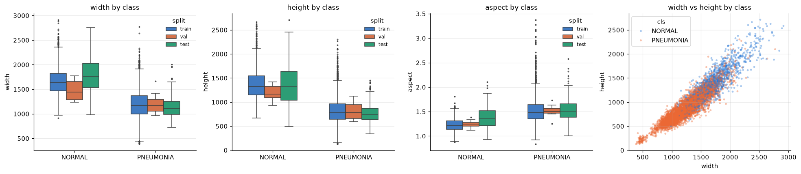

|  | **class** | **width median** | **height median** | **aspect median** |
| --- | --- | --- | --- | --- |
| train | NORMAL | 1640.0 | 1328.0 | 1.22 |
|  | PNEUMONIA | 1168.0 | 776.0 | 1.49 |
| val | NORMAL | 1446.0 | 1164.5 | 1.22 |
|  | PNEUMONIA | 1172.0 | 788.0 | 1.50 |
| test | NORMAL | 1762.0 | 1317.5 | 1.35 |
|  | PNEUMONIA | 1111.0 | 736.0 | 1.51 |

**Findings**

- <u><strong>PNEUMONIA</strong></u> images have a <u><strong>larger aspect ratio</strong></u> than NORMAL.
- <u><strong>PNEUMONIA</strong></u> images are smaller in both width and height than NORMAL. In other words, <u><strong>they are smaller in size.</strong></u>
- If image size is not unified, I expect **a risk that the model predicts based on size rather than image features. Therefore, so that there is no size difference between classes,** <u><strong>preprocessing that unifies image size must be considered.</strong></u>

## 3.3. Channel Distribution per Class/Split

X-ray images are generally grayscale and consist of a single channel. However, exceptions can always exist, so the channel distribution must be checked as well.

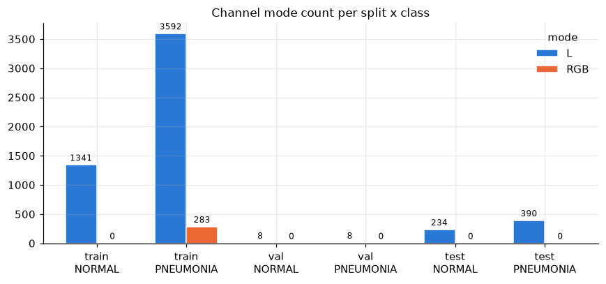

**Findings**

- <u><strong>100% of the 3-channel images are concentrated in the train PNEUMONIA class only</strong></u>.
- **Therefore, if the channels are not unified, there is a risk that the model predicts the PNEUMONIA class simply because an image has 3 channels.** <u><strong><em>The channels must be unified to either 1 or 3, no matter what.</em></strong></u>

## 3.4. Whether Pixel Values Are Identical Across Channels in 3-Channel Images

I confirmed that there are 3-channel images even though they are grayscale. So if I decide to merge them into 1 channel, I need to determine whether they can be merged as-is or whether a conversion algorithm is needed. So I checked whether each of the 3 channels contains the same pixel brightness.

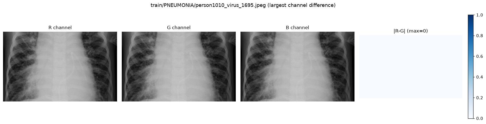

| **split** | **cls** | **n** | **all_equal** | **diff_max** | **diff_median** |
| --- | --- | --- | --- | --- | --- |
| train | PNEUMONIA | 283 | 283 | 0 | 0.0 |

**Findings**

- In all 283 three-channel images, the brightness of every channel was identical.
- <u><strong>Therefore, there is no problem merging 3 channels into 1, or copying 1 channel to expand it into 3.</strong></u>

## 3.5. Examples of Each Image Size and Channel Unification Strategy

From 3.1 through 3.4, I discussed the need to unify image size and channels. So I wanted to see the conversion results of several size and channel unification techniques with my own eyes, and check whether any information is lost.

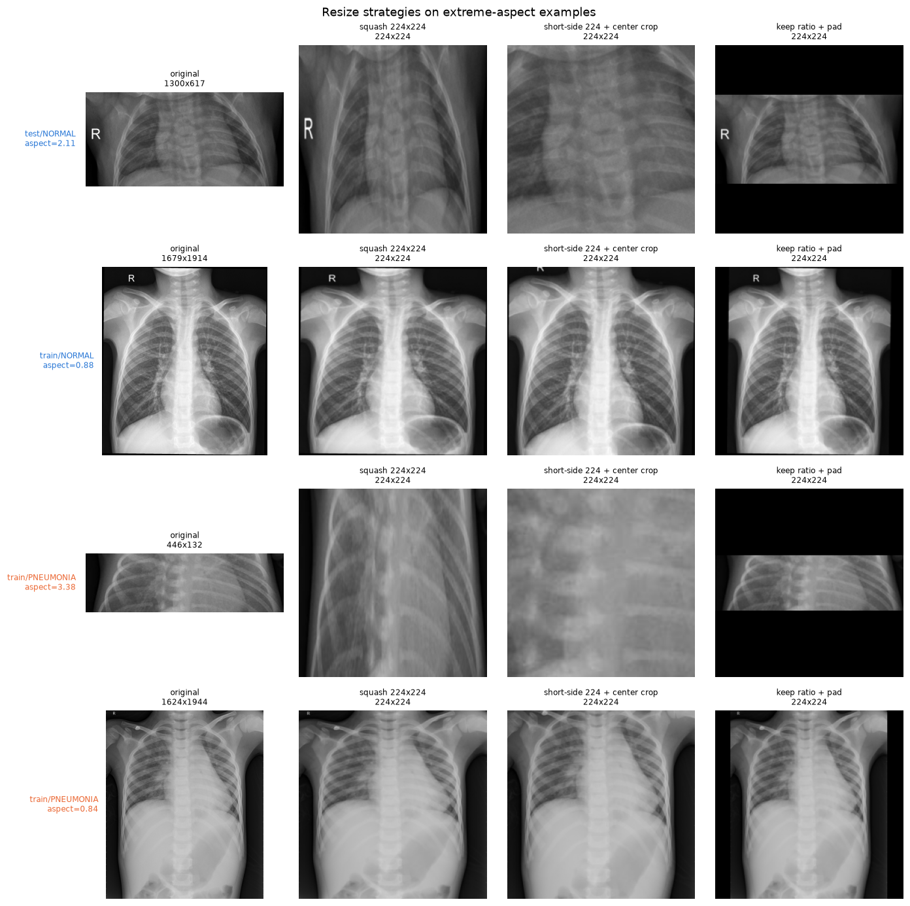

These are examples of unifying the size of the transfer-learning target images to (224,224), following the pretraining data, ImageNet. I compared the squash-resize, short-side center crop, and keep ratio+pad strategies against each other.

- **squash resize**: The simplest method. However, since we use images with various aspect ratios, I was concerned that a plain <u><strong>squash resize would distort the images</strong></u>.
- **short-side 224 crop**: For tall images, every region of the lungs is cropped evenly. However, I was concerned that for wide images, <u><strong>information at the edges of the lungs tends to be lost severely</strong></u>.
- **keep ratio+pad**: This method keeps the original image's aspect ratio while filling the surroundings with black. Since X-rays have black edges anyway, I thought it would lose the least. However, I was concerned that <u><strong>noise such as L/R markers and ECG lines would remain as-is</strong></u>.

### 3.5.1. bbox Crop Using UNet

All three alternatives—squash-resize, short-side center crop, and keep ratio+pad—had concerns. So I considered adopting the approach the instructor mentioned in class: <u><strong>inferring the lung-region bbox and then cropping based on it</strong></u>.

> **UNet training code and data**
>
> :github: [GitHub repository](https://github.com/raewoo0908/codeit_finetuning_for_x_ray/blob/main/unet_lung_seg.ipynb)

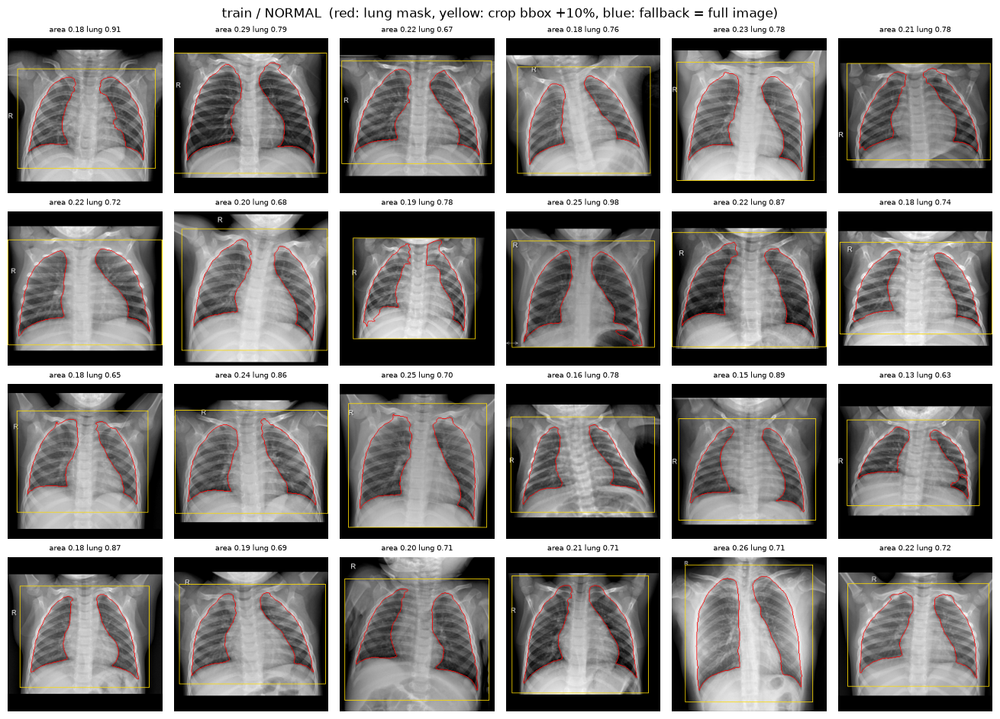

For NORMAL lungs, you can see that it crops the lungs and ribs very well.

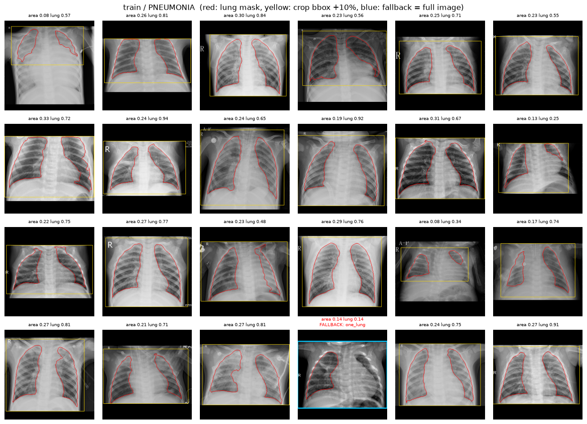

However, for PNEUMONIA lungs, I confirmed that the bbox performance drops sharply. In particular, please note the image at position (0,0). This is a case where only a very small dark part of the lungs remains due to pneumonia. In this case, the model recognized the lungs as very small, and I found that <u><strong>most of the lung area was cut off</strong></u>.

Also, please note the image drawn with a light-blue region in the bottom row. In this case, one lung has turned completely hazy due to pneumonia, and only the other lung is dark. You can see that in such cases, the UNet model <u><strong>recognized only the remaining lung as the lungs</strong></u>.

**Conclusion**

- Cropping the lung region through UNet image segmentation inference can actually <u><strong>ruin the data quality entirely.</strong></u>
- I judged this to be not a problem with the bbox crop approach itself, but <u><strong>a problem with the U-Net model's training data and training quality</strong></u>. I suspect the key cause is that the data used to train the UNet model was based on normal adult lungs.
- My biggest concern with the UNet-based bbox detection crop was that too many variables can affect it. The quality of the dataset UNet was transfer-learned on, and the quality of its training method, have too great an influence on the quality of this experiment's target dataset. Therefore, <u><strong>preprocessing with UNet risks being compared on differences in UNet performance rather than differences in the dataset.</strong></u>
- So I decided it was best not to include it among the candidates for this comparison experiment.
- In conclusion, since short-side center crop cuts the image and thus loses information in wide images, I decided it was worth running <u><strong>a dataset comparison experiment with squash-resize and keep ratio+pad as the two candidates</strong></u>.

## 3.6. Per-Image Brightness Mean and Standard Deviation Distribution

The brightness mean and standard deviation of an image represent <u><strong>the image's average exposure and its contrast</strong></u>. In other words, they can be summarized as follows.

> - High mean ➡ The image's overall exposure is high. It looks bright.
> - High std ➡ The image's overall contrast is high. Bones and lungs are clearly distinguished.
> - mean ↑ std ↓ ➡ The image is bright and hazy overall.
> - mean ↑ std ↑ ➡ The image is bright overall but well distinguished.
> - mean ↓ std ↓ ➡ The image is dark overall and poorly distinguished.
> - mean ↓ std ↑ ➡ The image is dark overall but well distinguished.

If the image exposure and contrast are not appropriate, the model may learn irrelevant features. Especially if the exposure/contrast difference between classes is stark, it needs to be corrected.

|  | **cls** | **NORMAL** | **PNEUMONIA** |
| --- | --- | --- | --- |
| img_mean | count | 1583.000 | 4273.000 |
|  | mean | 0.481 | 0.482 |
|  | std | 0.053 | 0.078 |
|  | min | 0.287 | 0.230 |
|  | 5% | 0.394 | 0.347 |
|  | 50% | 0.480 | 0.482 |
|  | 95% | 0.574 | 0.608 |
|  | max | 0.665 | 0.869 |
| img_std | count | 1583.000 | 4273.000 |
|  | mean | 0.240 | 0.217 |
|  | std | 0.023 | 0.039 |
|  | min | 0.130 | 0.080 |
|  | 5% | 0.202 | 0.155 |
|  | 50% | 0.241 | 0.215 |
|  | 95% | 0.276 | 0.284 |
|  | max | 0.326 | 0.343 |

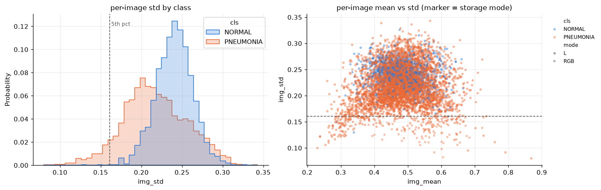

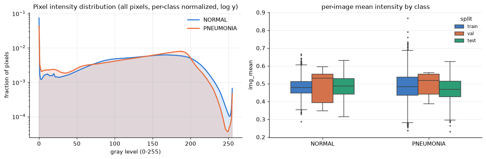

|  | **cls** | Low-contrast image count |
| --- | --- | --- |
| train | NORMAL | 2 |
|  | PNEUMONIA | 279 |
| test | NORMAL | 1 |
|  | PNEUMONIA | 11 |

> I classified an image as low-contrast if its brightness standard deviation was at or below the 5th percentile.

**Findings**

- Histogram: NORMAL is concentrated narrowly and tightly around 0.24, while PNEUMONIA is shifted to the left and widely spread out. <u><strong>This means contrast varies greatly from image to image even within PNEUMONIA, and the spread is too large to be explained by pneumonia alone.</strong></u>
- Scatter plot: The low-contrast points below the dashed line (5th pct) appear at both ends—around mean 0.3 (crushed dark) and above 0.6 (washed out bright). Lesions push the lungs toward white, which is only one direction, so the fact that they appear at both extremes is interpreted as <u><strong>a sign that exposure-condition problems are mixed in</strong></u>.
- Pixel Intensity distribution, box plot: I confirmed that <u><strong>there is no difference in brightness by class</strong></u>.
- Also, the images stored as RGB are concentrated below the dashed line (low contrast). In other words, there is <u><strong>a possibility of a defect in the image collection stage itself</strong></u>—images extracted in a different environment were extracted with low contrast.
- img_std is NORMAL mean 0.240 (std 0.023) and PNEUMONIA mean 0.217 (std 0.039). The spread of PNEUMONIA is about 1.7 times that of NORMAL. For img_mean, both classes have the same mean of 0.48, but PNEUMONIA's tails (5% 0.347, 95% 0.608) are wider.
- <u><strong>Of the 293 low-contrast (low std) images, 279 are in train/PNEUMONIA</strong></u>. Only 3 are NORMAL.

**Conclusion**

- The RGB-stored images and the extreme-exposure (very dark or very bright) images that exist only in PNEUMONIA create the low contrast. There is <u><strong>a concern that the model may learn this as a shortcut: "hazy or RGB path means pneumonia"</strong></u>.
- ImageNet-pretrained filters are tuned to inputs with edges and textures, so <u><strong>I expect they will have difficulty extracting lung structure features properly from images that are washed out overall</strong></u>.
- Therefore, I judged that it was worth trying <u><strong>CLAHE to restore washed-out images tile by tile</strong></u>.

**Concerns**

However, <u><strong>lesions where the lungs turn locally hazy are one of the main features of pneumonia</strong></u>. I thought that if I ignored this and applied CLAHE equalization, subtle differences in brightness or contrast might disappear and actually cause side effects. So I actually applied CLAHE equalization and compared the Before and After.

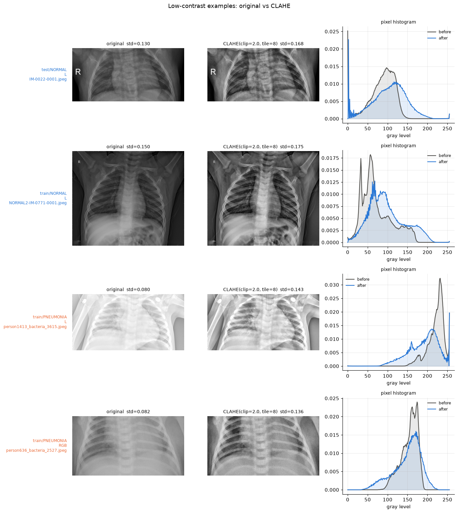

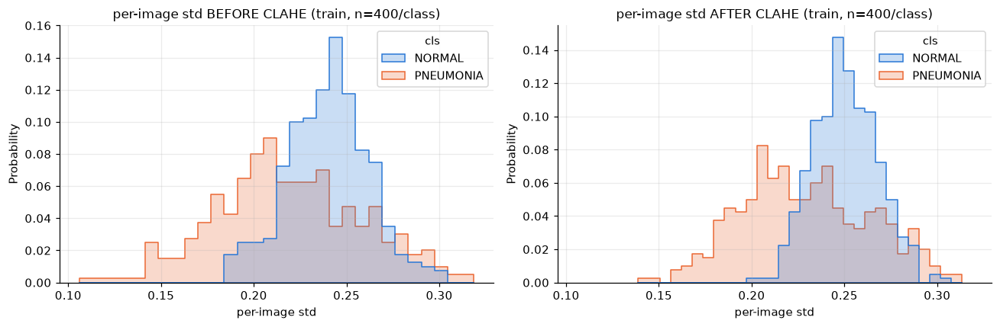

**Findings**

- In the low-contrast images, not only the lungs but also the bones, background, and clavicles are hazy or dark together. <u><strong>After CLAHE, I confirmed that the ribs and lung shadows become distinguishable again</strong></u>.
- However, looking at person636_bacteria_2527.jpeg, <u><strong>grainy noise stands out in the soft tissue and inside the lungs after CLAHE</strong></u>. There was also a concern that the model might learn this noise as a feature of pneumonia.
- Also, looking at person1413_bacteria_3615.jpeg, the lungs that were entirely white and hazy in the original become split by dark gaps between the ribs after CLAHE, giving an impression similar to NORMAL. <u><strong>If the haziness was a real lesion, CLAHE erased that signal.</strong></u>
- Also, looking at the final BEFORE/AFTER histograms, the difference in center position between the two classes stays almost the same, but PNEUMONIA's left tail (0.10~0.15) disappears and the distribution narrows. This means the **mean difference** between classes **was preserved**, but the **contrast diversity** within PNEUMONIA **decreased**.
- From this feature alone, I cannot tell whether CLAHE erased defects in the images themselves or erased pneumonia signals. The reduced contrast diversity could be the removal of defects or the loss of pneumonia signals, and the preserved contrast mean could likewise mean either that defects remain or that pneumonia signals were preserved.

**Conclusion**

CLAHE is worth trying, but since there are concerning side effects, I concluded that it is necessary to select it as one of the dataset configuration candidates and <u><strong>experiment with the performance of a dataset with CLAHE applied versus one without</strong></u>.

## 4. Dataset Statistics VS ImageNet Statistics

After scaling the image pixels to [0,1], they need to go through normalization. At this point, I need to decide whether to normalize with ImageNet statistics or with the dataset's own statistics. I thought that if the two distributions differed significantly, it would be worth comparing them experimentally.

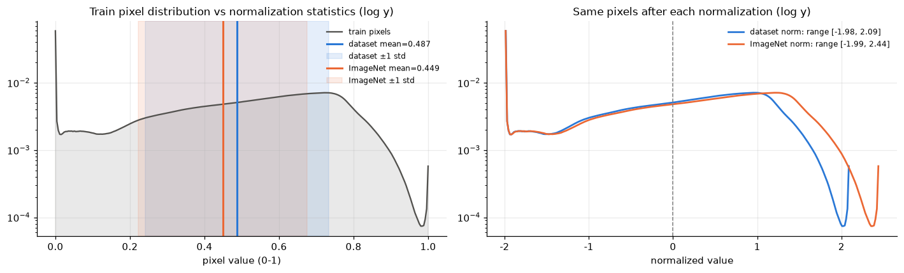

|  | **mean** | **std** |
| --- | --- | --- |
| dataset (train, gray) | 0.4875 | 0.2456 |
| dataset (all, gray) | 0.4874 | 0.2454 |
| ImageNet (RGB avg) | 0.4490 | 0.2260 |
| ImageNet R | 0.4850 | 0.2290 |
| ImageNet G | 0.4560 | 0.2240 |
| ImageNet B | 0.4060 | 0.2250 |

**Findings**

- Left: The target dataset's mean brightness is somewhat brighter.
- Right: When the original image's pixel distribution is normalized with ImageNet statistics, the distribution shifts toward the bright side by about +0.17.

**Conclusion**

**The difference between the two normalization methods is small. After normalizing with ImageNet statistics, the mean is 0.17 and the standard deviation is 1.09, which is not much different from normalizing with the dataset statistics.** <u><strong>I judged that it makes no difference which one is used, so considering consistency with the pretrained weights, I decided to normalize with ImageNet statistics.</strong></u>

## 5. Checking for Exact Duplicate Images

If duplicate images exist between train and val/test, this can be seen as a kind of data leakage. Also, if the same image appears multiple times in val or test, the validation is no longer correct. <u><strong>Getting one question right counts as getting several right, and getting one wrong counts as getting several wrong.</strong></u>

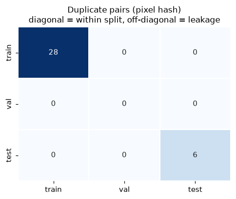

Exactly identical images exist within train (28) and within test (6), and there are no duplicates across splits. Therefore, there is no data leakage.

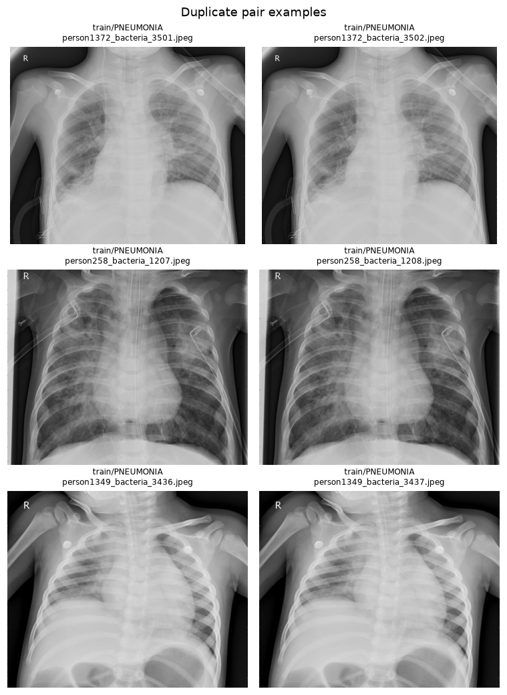

I inspected the hash-matched images with my own eyes.

**Conclusion**

- The duplicates within the train set are simple duplicates. Considering the total amount of data, I judged that only 28 duplicates would have no effect. I decided not to remove them, judging that it simply amounts to running a few extra epochs.
- However, <u><strong>duplicates within the test set must be removed, keeping only one of each.</strong></u>

## 6. Distribution of Images per Person in train

In Section 1, I concluded that train+val should be merged and then re-split. However, when splitting the data, <u><strong>if X-rays of the same person end up in both train and val, this can be seen as a kind of data leakage</strong></u>. So I wanted to check the distribution of images per person.

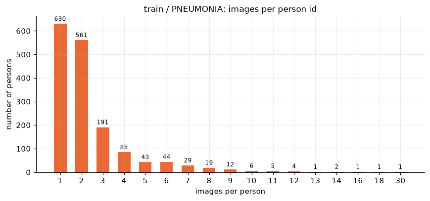

**Findings**

Based on the image filenames, there are cases where one person had up to 30 images taken.

<u><strong>But can we conclude that images with the same person# in their filenames were taken of the same person?</strong></u>

| **split** | **cls** | **pattern** | **n** |
| --- | --- | --- | --- |
| train | NORMAL | IM-#-#-#.jpeg | 80 |
|  |  | IM-#-#.jpeg | 517 |
|  |  | NORMAL#-IM-#-#-#.jpeg | 53 |
|  |  | NORMAL#-IM-#-#.jpeg | 691 |
|  | PNEUMONIA | person#_bacteria_#.jpeg | 2530 |
|  |  | person#_virus_#.jpeg | 1344 |
|  |  | person#_virus_#_#.jpeg | 1 |
| val | NORMAL | NORMAL#-IM-#-#.jpeg | 8 |
|  | PNEUMONIA | person#_bacteria_#.jpeg | 8 |
| test | NORMAL | IM-#-#-#.jpeg | 4 |
|  |  | IM-#-#.jpeg | 65 |
|  |  | NORMAL#-IM-#-#-#.jpeg | 6 |
|  |  | NORMAL#-IM-#-#.jpeg | 159 |
|  | PNEUMONIA | person#_bacteria_#.jpeg | 242 |
|  |  | person#_virus_#.jpeg | 148 |

The image filenames are structured as shown above. NORMAL has no person#; it appears only in PNEUMONIA.

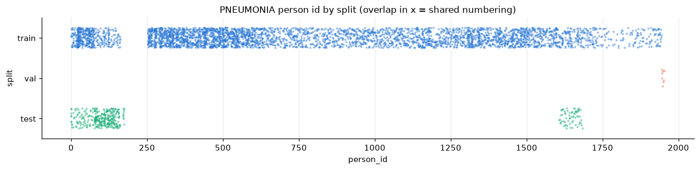

Also, many numbers overlapped between train and test.

|  | **split** | **cls** | **filename** | **width** | **height** | **pixel_md5** |
| --- | --- | --- | --- | --- | --- | --- |
| 2967 | train | PNEUMONIA | person1_bacteria_1.jpeg | 712 | 439 | c901b203e2751964e5c3b89e35326617 |
| 2968 | train | PNEUMONIA | person1_bacteria_2.jpeg | 1240 | 840 | 7f39f091cfb4237449423a515dd9e3a0 |
| 5719 | test | PNEUMONIA | person1_virus_11.jpeg | 872 | 560 | 2b8c531c86a4f2e37c76bb2979a593c9 |
| 5720 | test | PNEUMONIA | person1_virus_12.jpeg | 1080 | 624 | e34eb39a3de95c14aba2440cac26b09f |
| 5721 | test | PNEUMONIA | person1_virus_13.jpeg | 1136 | 654 | ca0fb78af19ebfce1f9152261d7bdb5d |
| 5722 | test | PNEUMONIA | person1_virus_6.jpeg | 944 | 640 | 97af9bb5486f4f0c5251438cca964d2a |
| 5723 | test | PNEUMONIA | person1_virus_7.jpeg | 1000 | 544 | a3f6886d7620627cedae843ce68dc21f |
| 5724 | test | PNEUMONIA | person1_virus_8.jpeg | 960 | 544 | a5f93650ed6a78dc4c70b57260089db9 |
| 5725 | test | PNEUMONIA | person1_virus_9.jpeg | 856 | 552 | 1b29e90e3bd3d7a5fd1783f0af93d51f |

I also computed md5 hashes of the images with overlapping person# values and compared them. There were 170 person# values shared between train and test, and not a single image among them was identical.

**Conclusion**

- person# is hard to regard as a number identifying a patient; it is presumably a number arbitrarily assigned within the PNEUMONIA class.
- When re-splitting train+val into train/val, <u><strong>person# does not need to be taken into account.</strong></u>

## 7. Final Conclusions

These are the conclusions from the EDA on what to apply in the final model-building experiments.

1. Merge train + val and re-split them.
   - However, aspect ratio does not need to be considered.
   - person# does not need to be considered either.
2. Remove duplicate data from the test set based on hashes.
3. <u><strong>Resize strategy: Run a comparison experiment of squash resize VS keep ratio+pad.</strong></u>
4. Channel unification strategy: Unify to 3 channels.
   - I limited the transfer-learning strategies to test to Full VS Partial VS Feature Extraction.
   - Therefore, I adopt the approach of preserving the pretrained model's first conv layer without changing it.
5. <u><strong>CLAHE: Run a comparison experiment of applied VS not applied.</strong></u>
6. Data normalization: Use ImageNet statistics.

> ☺️ In the next post, I'll be back with <u><strong>an experiment comparing whether CLAHE and the Resize strategy made a meaningful difference</strong></u>, comparing three training methods—<u><strong>Feature Extraction, Partial Fine-Tuning, and Full Fine-Tuning</strong></u>—on top of three models: <u><strong>ResNet, DenseNet, and EfficientNet</strong></u>!

## 📚 References
- :github: [EDA and experiment code repository](https://github.com/raewoo0908/codeit_finetuning_for_x_ray)
