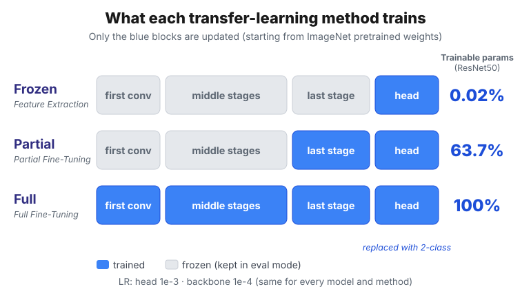

## 0. Introduction

In the [previous post](/posts/ai/experiment-x-ray-transfer-learning), I explored the chest X-Ray data with EDA and built the rationale for a preprocessing strategy. I decided to 1. re-split train+val, 2. remove duplicates from test, 3. standardize images on 3 channels, and 4. standardize on normalization with ImageNet statistics. Two things I wasn't sure about, <u><strong>whether to keep the aspect ratio (pad) or ignore it (squash)</strong></u> and <u><strong>whether to apply CLAHE</strong></u>, I left to be settled by experiment.

So now it's time to actually train. The goal of this mission was to build a classifier that tells from an X-Ray whether a patient has pneumonia, and I compared ImageNet-pretrained ResNet50, DenseNet121, and EfficientNet-B0 transfer-learned with three methods: Feature Extraction (Frozen), Partial Fine-Tuning, and Full Fine-Tuning. I started the experiment with three questions.

> 🤔 Among three models × three transfer-learning methods, which <u><strong>combination catches pneumonia best</strong></u>?
>
> 🤔 In the EDA, pneumonia images had larger aspect ratios than normal ones. Then <u><strong>does pad (keeps the aspect ratio) vs. squash (ignores it) affect performance?</strong></u>
>
> 🤔 Does <u><strong>CLAHE</strong></u> rescue low-contrast images and raise performance, or does it erase the hazy signal of pneumonia and lower it?

> **Data used**
>
> :kaggle: [Kaggle Chest X-Ray Images (Pneumonia)](https://www.kaggle.com/datasets/paultimothymooney/chest-xray-pneumonia)

> **Experiment code**
>
> :github: [GitHub repository](https://github.com/raewoo0908/codeit_finetuning_for_x_ray/blob/main/experiment.ipynb)

**Experiment design**

1. **Models under test**

   | Model | First conv | Head | Last stage trained in Partial |
   | --- | --- | --- | --- |
   | resnet50 | conv1 | fc (2048) | layer4 |
   | densenet121 | features.conv0 | classifier (1024) | features.denseblock4, features.norm5 |
   | efficientnet_b0 | features.0.0 | classifier.1 (1280, preceding Dropout kept) | features.7, features.8 (last 1×1 conv) |

2. **Transfer-learning methods under test**

   | Method | Definition |
   | --- | --- |
   | Feature Extraction (Frozen) | Freeze the feature extractor entirely and train only the classifier (head). |
   | Partial Fine-Tuning | Train only the last stage of the feature extractor and the head; freeze the rest. |
   | Full Fine-Tuning | Train every weight, starting from the ImageNet pretrained weights. |

3. **Data preprocessings under test**

   | Preprocessing | Channel | Sizing | CLAHE | Augmentation | Normalization |
   | --- | --- | --- | --- | --- | --- |
   | pad__none | 3 channels | aspect-preserving pad | X | rotation + Hflip | ImageNet stats |
   | pad__clahe | 3 channels | aspect-preserving pad | O | rotation + Hflip | ImageNet stats |
   | squash__none | 3 channels | direct resize to 224×224 | X | rotation + Hflip | ImageNet stats |
   | squash__clahe | 3 channels | direct resize to 224×224 | O | rotation + Hflip | ImageNet stats |

3 models × 3 methods × 4 preprocessings makes 36 combinations. But training each of the 36 once and picking the top validation score wasn't enough. When score gaps are small, you can't tell whether a gap is real or just luck. So I ran the experiment in this order.

> 📌 **Experiment roadmap**
>
> 1. **Grid search over 36 combinations**: Train every combination once and compare on validation.
> 2. **Factor analysis**: Check which of model, method, sizing, and CLAHE had the biggest influence on the results.
> 3. **5-Fold Cross Validation**: Check the preprocessing methods whose gaps were unclear, using cross validation.
> 4. **Test evaluation**: Fix the preprocessing method to one and evaluate 3 models × 3 methods on test.
> 5. **Grad-CAM**: See with our own eyes where on the image the models looked when deciding.

## 1. Data preparation

### 1.1. Re-splitting train+val and de-duplicating test

The EDA showed that the original validation set had only 16 images. So I merged train and val and re-split them 9:1. I used `StratifiedGroupKFold` so that the class ratio stays similar between train and validation.

```python
# Re-split: merge train+val, then a stratified 9:1 split by patient group
pool = meta[meta["orig_split"] != "test"].reset_index(drop=True)
sgkf = StratifiedGroupKFold(n_splits=round(1 / VAL_RATIO), shuffle=True, random_state=SEED)
tr_idx, va_idx = next(sgkf.split(pool, pool["label"], groups=pool["group"]))
train_df = pool.iloc[tr_idx].reset_index(drop=True)
val_df = pool.iloc[va_idx].reset_index(drop=True)

leak = set(train_df["group"]) & set(val_df["group"])
assert not leak, f"same group found in both train and val: {list(leak)[:5]}"
```

```text
       count            ratio           total groups
cls   NORMAL PNEUMONIA NORMAL PNEUMONIA
train   1211      3514  0.256     0.744  4725   2577
val      138       369  0.272     0.728   507    284
```

As a result, 4,725 train and 507 validation images are ready, and both splits have a similar PNEUMONIA share of about 73–74%.

> 🤔 **The EDA said person# is unlikely to be a patient ID. So why split by group?**
>
> Right. In section 7 of the [previous post](/posts/ai/experiment-x-ray-transfer-learning#7-final-conclusions), 170 person# values appeared in both train and test, yet not a single image was identical, so I inferred that person# isn't a patient identifier. <!-- i18n-intentional(links): heading anchors differ between ko and en -->
>
> But that's only an **inference**. If person# really is the same patient, then the moment one person's images land in both train and validation, we have data leakage. On the other hand, if person# is a meaningless number, grouping by it costs almost nothing. The groups are finely split, 2,577 groups for 4,725 images, so the class ratio can still be matched well.
>
> So <u><strong>I chose group-wise splitting, the option that costs nothing if I'm wrong.</strong></u> For pneumonia I used `person#` as the group key, and for normal images a filename prefix like `IM-0523`.

I left test untouched and only removed the 6 pixel-hash duplicates found in the EDA. If the same image appears twice in test, getting one question right counts as getting two right.

| split | NORMAL | PNEUMONIA | Total | NORMAL ratio | PNEUMONIA ratio |
| --- | --- | --- | --- | --- | --- |
| train | 1,211 | 3,514 | 4,725 | 25.6% | 74.4% |
| validation | 138 | 369 | 507 | 27.2% | 72.8% |
| test | 231 | 387 | 618 | 37.4% | 62.6% |

train and validation have a similar PNEUMONIA ratio of 73–74%, but test is 63%, so normal images make up a larger share.

### 1.2. Class imbalance: WeightedRandomSampler

train is roughly normal : pneumonia ≈ 1 : 3. Because the class imbalance is severe, I used `WeightedRandomSampler` with weights equal to the inverse class frequency, so that normal images are drawn more often.

```python
class_w = 1.0 / np.bincount(df["label"], minlength=len(CLASSES))   # inverse class frequency
sampler = WeightedRandomSampler(class_w[df["label"].to_numpy()], num_samples=len(df),
                                replacement=True, generator=sampler_gen)
```

```text
train epoch sampled class ratio: {'NORMAL': '0.499', 'PNEUMONIA': '0.501'}
```

The ratio actually drawn over one epoch is nearly 50 : 50.

### 1.3. Four preprocessings: same images, same augmentation, different preprocessing

To compare the four preprocessed datasets, <u><strong>the only thing that differs must be the preprocessing.</strong></u> If one dataset sees many normal images first and another sees many pneumonia images first, you can't tell whether a performance gap comes from the preprocessing or the sample order.

So I drew the sampler's and the augmentation's random numbers from dedicated `Generator`s, re-seeded identically for every run. With the same seed, all four datasets draw the same images in the same order, rotate them by the same angles, and flip the same images.

```python
def make_loaders(variant: str, batch_size: int = BATCH_SIZE, seed: int = SEED, df=None):
    images = device_images(variant)                     # per-variant cache (resident on GPU)
    aug_gen = torch.Generator().manual_seed(seed)       # dedicated to augmentation
    sampler_gen = torch.Generator().manual_seed(seed)   # dedicated to the sampler
    ...
```


The figure above shows 8 images from the first train batch of each of the four datasets. Look down a single column. It's the same image rotated by the same angle, and each row differs only in pad/squash and whether CLAHE was applied. The pad rows have black margins at the top and bottom, the squash rows are squeezed into a square, and the clahe rows show the ribs and lung shadows more crisply.

> 🤔 **Why not compare 1 channel vs. 3 channels?**
>
> The first conv layer of a pretrained model is built to take 3 channels (RGB). To feed a 1-channel grayscale image $g$, you have to change the first conv to a 1-channel one, and the usual way is to sum the existing RGB filters into one. But if you copy the grayscale image into 3 channels instead, the first conv computes:
>
> $$
> W_R * g + W_G * g + W_B * g = (W_R + W_G + W_B) * g
> $$
>
> - $W_R, W_G, W_B$: the R, G, B channel weights of the first conv filter
> - $g$: the grayscale image
>
> The left side is "copy into 3 channels," and the right side is "feed one channel into the summed RGB filter." In other words, <u><strong>the two approaches are the same computation.</strong></u> Comparing 1 vs. 3 channels would essentially be training the same model twice, so I left it out.

## 2. Model preparation: Frozen vs Partial vs Full

I load the ImageNet pretrained weights from torchvision, replace the head with a 2-class (normal/pneumonia) Linear layer, and decide how far to turn on `requires_grad` depending on the method.

```python
def build_model(arch: str, mode: str, pretrained: bool = True) -> nn.Module:
    """ImageNet-pretrained model -> replace head with 2 classes -> apply freeze mode. Input is 3-channel."""
    spec = ARCH_SPECS[arch]
    model = spec["ctor"](weights=spec["weights"] if pretrained else None)

    head = model.get_submodule(spec["head"])
    _set_submodule(model, spec["head"], nn.Linear(head.in_features, len(CLASSES)))

    # frozen: head only / partial: last stage + head / full: everything
    trainable = {"frozen": [spec["head"]], "partial": spec["last_stage"] + [spec["head"]], "full": None}[mode]
    for name, p in model.named_parameters():
        p.requires_grad = trainable is None or _under(name, trainable)
    return model
```



The number of trainable parameters varies like this.

| Model | Total | Frozen | Partial | Full |
| --- | --- | --- | --- | --- |
| resnet50 | 23.5M | 4,098 (0.017%) | 15.0M (63.7%) | 100% |
| densenet121 | 7.0M | 2,050 (0.029%) | 2.2M (31.1%) | 100% |
| efficientnet_b0 | 4.0M | 2,562 (0.064%) | 1.1M (28.2%) | 100% |

Frozen trains only a few thousand parameters. Meanwhile, ResNet50's Partial unfreezes just the last stage (`layer4`), yet 63.7% of all parameters get trained. That's because ResNet has more channels in its deeper stages, so its parameters are concentrated toward the end.

> 💡 **For the frozen parts, you have to freeze not just the weights but the "behavior" too.**
>
> In the [normalization and augmentation experiment post](/posts/ai/experiment-data-normalization-and-augmentation), I covered how `requires_grad=False` alone doesn't stop BatchNorm's `running_mean` and `running_var`. This time there's one more thing, because EfficientNet is in the mix. EfficientNet's **StochasticDepth** randomly skips blocks in train mode, and that keeps happening even in frozen blocks.
>
> So instead of picking out only the BatchNorm layers, I switched to <u><strong>putting every submodule with no trainable parameters back into eval mode as a whole</strong></u>.
>
> ```python
> def set_frozen_eval(model):
>     """Submodules with no trainable parameters (frozen stages) are kept in eval mode."""
>     for m in model.modules():
>         params = list(m.parameters())
>         if params and not any(p.requires_grad for p in params):
>             m.eval()
> ```
>
> With Full Fine-Tuning there are no frozen modules, so this does nothing.

I split the learning rate between the head and the backbone. The newly created head starts from random initialization, so it moves fast (1e-3); the pretrained backbone already has good values, so it moves only a little (1e-4). I applied this rule identically to every model and method.

## 3. Training

Every run is trained under the same conditions. Only the model, method, and preprocessing differ.

| Item | Value |
| --- | --- |
| Epochs | 10 (no early stopping) |
| Optimizer | AdamW (head lr 1e-3, backbone lr 1e-4, weight decay 1e-4) |
| Scheduler | CosineAnnealingLR (T_max = 10) |
| Batch size | 32 |
| Loss | CrossEntropyLoss |
| Model selection | Save the weights from the epoch with the highest validation F1 |
| Seed | 42 (re-seeded for every run) |
| Environment | Colab free plan, T4 GPU |

Running 36 runs on Colab's free plan raised two problems: speed and session drops.

**Speed.** Decoding JPEGs, applying CLAHE, and resizing every epoch is wasted work that recomputes the same result. So I computed all the deterministic steps up to augmentation just once, cached them as an `npz`, and loaded the whole thing onto the GPU (about 294MB per preprocessing). Augmentation (rotation + horizontal flip) is done per batch on the GPU with a single affine transform.

```python
def augment(self, x):
    b = x.size(0)
    # draw the angle/flip per sample, not once for the whole batch
    angle = (torch.rand(b, generator=self.gen) * 2 - 1) * np.deg2rad(ROT_DEG)
    flip = torch.where(torch.rand(b, generator=self.gen) < HFLIP_P, -1.0, 1.0)
    cos, sin = torch.cos(angle), torch.sin(angle)
    theta = torch.zeros(b, 2, 3)
    theta[:, 0, 0], theta[:, 0, 1] = cos * flip, -sin
    theta[:, 1, 0], theta[:, 1, 1] = sin * flip, cos
    grid = F.affine_grid(theta.to(x.device), list(x.shape), align_corners=False)
    return F.grid_sample(x, grid, mode="bilinear", padding_mode="zeros", align_corners=False)  # outside = background 0
```

```text
loader + augmentation only: 0.44s / epoch (148 batches)
```

Fetching and augmenting the data takes only 0.44 seconds per epoch. Now almost all of the training time is the model's own computation.

**Session drops.** On Colab's free plan, the session can drop at any time. So every 3 epochs I saved a checkpoint containing the model, optimizer, scheduler, and even the random-number state. So that an existing file wouldn't be corrupted if the session dropped mid-save, I wrote to a temp file first and then swapped it in. Re-running the cell skips finished runs and resumes an in-progress run from where it stopped.

```text
completed 36 / 36 runs
```

## 4. Validation results of the 36 runs

> 📌 **Limitations of this experiment**
>
> 1. **Because of the limits of Colab's free plan and Drive storage, I trained for only 10 epochs.** Frozen in particular had not yet converged at 10 epochs.
> 2. **I used a single seed and trained each combination only once.**
> 3. **The validation set has only 507 images.** As calculated below, getting one more image right or wrong moves F1 by about 0.0014. Smaller gaps are hard to tell apart from luck.
> 4. **I used the same learning rate for every method.** That setting may have been unfavorable to Frozen.
> 5. **For train, I recorded only loss and accuracy.** I didn't record train F1 or recall.

Before reading the results, I first calculated how much "one validation image" moves F1. Without this number, you can't judge whether the gap between 0.99 and 0.992 is big or small.

$$
F1 = \frac{2TP}{2TP + FP + FN}
$$

- Of the 507 validation images, 369 are pneumonia (positive). If nearly everything is right, $2TP + FP + FN \approx 2 \times 369 = 738$.
- Getting one more image wrong increases $FP$ or $FN$ in the denominator by 1. When F1 is close to 1, the change is roughly:

$$
\Delta F1 \approx \frac{1}{2 \times 369} = \frac{1}{738} \approx 0.0014
$$

In other words, <u><strong>a validation F1 gap of 0.0014 is a one-image gap.</strong></u> Let's look at the results with this as the yardstick.


The figure above shows ResNet50's learning curves. Rows are the 4 preprocessings, columns are the 3 methods. Blue is train and red is validation; solid lines are loss (left axis), dashed lines are F1/accuracy (right axis). The star marks the epoch with the highest validation F1, i.e., the saved weights. Since I didn't record train F1, train accuracy is drawn in its place.


With all three figures together, that's 36 plots on one screen, which is hard to take in. So for each finding below, I regathered and redrew only the cells it needs.

### 4.1. Finding 1: Frozen clearly falls behind, as of 10 epochs


I gathered only the squash__none row from each of the three models. For all three models, the red dashed line (val F1) in the leftmost column (frozen) sits below those of partial and full. The same holds for the other preprocessing rows.

- Frozen's last-epoch val F1 averages 0.950. The backbone is untouched ImageNet weights and only the head was trained, so reaching this level means <u><strong>features learned on ImageNet alone are quite useful for judging pneumonia</strong></u>.
- But Full, which adapted the backbone to X-Rays, scored on average 0.0375 higher F1 than Frozen. That's about 27 validation images.
- Frozen even starts from a different point. The epoch-1 train loss is about 0.13 for partial and full but about 0.30 for frozen. The epoch-1 train loss is an average over that epoch, and partial and full, with many weights to train, already pull the loss down quickly within the first epoch.

Yet over 10 epochs, the frozen curves drop by more than partial and full do. Does that mean there was a lot to fix in the ImageNet weights? No. In frozen, the backbone doesn't change at all. <u><strong>The starting point was simply higher, so there was more distance left for a single head to cover.</strong></u>

In fact, 10 of the 12 frozen runs hit their lowest val loss at epoch 8–9. In other words, they hadn't converged even at 10 epochs.

<u><strong>So "Frozen falls behind" is strictly a conclusion as of 10 epochs. With longer training, the gap could shrink.</strong></u>

### 4.2. Finding 2: Partial and Full stop improving on validation after 1–2 epochs

In the partial and full columns, train loss keeps falling toward 0 over all 10 epochs, but validation F1 barely rises after epoch 1–2.

There's also a weak sign of overfitting. In some runs, while train loss fell as low as 0.003, val loss crept back up after its minimum.

- densenet121 / full / squash__clahe: val loss minimum at epoch 1, then +0.0081
- resnet50 / full / pad__none: val loss minimum at epoch 4, then +0.0102


The differences are small, so I zoomed the loss axis to 0–0.2. After the circle (val loss minimum), the blue solid line (train loss) keeps going down, but the red solid line (val loss) stops falling and even creeps back up a little.

Even so, validation F1 and accuracy stayed consistently high at around 0.98. The number of wrong images stayed the same; only the confidence on the few already-wrong images grew. <u><strong>It isn't yet overfitting severe enough to show up in F1.</strong></u>

> 🤔 **Train loss keeps dropping while validation loss is flat. Isn't that overfitting too?**
>
> The two curves aren't measured under the same conditions in the first place, so their slopes are hard to compare directly.
>
> | | train loss | validation loss |
> | --- | --- | --- |
> | When measured | Average of per-batch values over an epoch | Measured once with the model at the end of the epoch |
> | Augmentation | Rotation + horizontal flip | None |
> | Class ratio | About 50 : 50 via the sampler | 73% pneumonia (original distribution) |
>
> So rather than the **absolute gap** between train and validation, you should watch the **trend** of that gap widening as epochs pass.

### 4.3. Finding 3: ResNet50 Frozen wobbled only with pad


In the top two cells (pad__none, pad__clahe), unlike the bottom two, the red solid line (val loss) sits far above the blue solid line (train loss).

| ResNet50 | Last-epoch loss gap (val − train) |
| --- | --- |
| frozen × pad (mean of none, clahe) | 0.200 |
| frozen × squash (mean of none, clahe) | 0.026 |
| partial, full × pad / squash | 0.05 ~ 0.06 |

In partial and full there's almost no difference between pad and squash, but in frozen alone, pad opened up a large gap.

Why only ResNet50 frozen? Here's my guess. In frozen, the backbone's BatchNorm statistics are fixed to ImageNet values (`set_frozen_eval`). But pad images have <u><strong>wide black margins</strong></u> that hardly exist in ImageNet. The backbone would need to adjust for the input distribution shifted by these margins, but frozen can't modify the backbone, so it had to carry that shift as is. The fact that this gap disappears in partial and full, which do train the backbone, supports the hypothesis. That said, it's an untested hypothesis.

### 4.4. Finding 4: There's no difference between models. Only the method matters

To compare all 36 runs at a glance, I drew heatmaps.


In all three panels, rows are model × method (9) and columns are preprocessings (4).

- **best val F1**: the highest val F1 over the 10 epochs. It can be pulled up by a single lucky epoch.
- **last-3-epoch mean val F1**: the mean val F1 over the last 3 epochs. I looked at it alongside to reduce the effect of luck.
- **jitter**: the mean change in val F1 between consecutive epochs. Larger means it wobbled more from epoch to epoch.

In the first two panels, darker means better. What jumps out is that <u><strong>only the three frozen rows are light, and the other six rows are all similarly dark</strong></u>. Here are the top 10 by last-3-epoch mean F1.

| Rank | run | best epoch | best F1 | last3 F1 | AUC | jitter |
| --- | --- | --- | --- | --- | --- | --- |
| 1 | efficientnet_b0 / full / squash__none | 10 | 0.9932 | 0.9923 | 0.9993 | 0.0029 |
| 2 | resnet50 / full / squash__clahe | 8 | 0.9932 | 0.9919 | 0.9976 | 0.0037 |
| 3 | resnet50 / full / pad__none | 10 | 0.9918 | 0.9909 | 0.9974 | 0.0061 |
| 4 | densenet121 / full / pad__clahe | 1 | 0.9905 | 0.9896 | 0.9973 | 0.0045 |
| 5 | resnet50 / partial / squash__none | 7 | 0.9906 | 0.9896 | 0.9967 | 0.0026 |
| 6 | densenet121 / partial / pad__clahe | 7 | 0.9905 | 0.9896 | 0.9970 | 0.0026 |
| 7 | resnet50 / partial / squash__clahe | 9 | 0.9892 | 0.9892 | 0.9964 | 0.0021 |
| 8 | densenet121 / full / squash__clahe | 1 | 0.9919 | 0.9891 | 0.9967 | 0.0037 |
| 9 | densenet121 / partial / squash__none | 5 | 0.9905 | 0.9891 | 0.9983 | 0.0051 |
| 10 | densenet121 / full / squash__none | 5 | 0.9905 | 0.9887 | 0.9978 | 0.0052 |

**Analysis**

- First place is EfficientNet-B0 × Full × squash__none (0.9923). But by best F1, it's essentially tied with ResNet50 × Full × squash__clahe (0.99322 vs 0.99323).
- The gap between 1st and 10th is 0.0036, <u><strong>a 2–3 validation-image gap</strong></u>. It's hard to call this combination a definite winner.
- Nor does it mean EfficientNet is the best model. Looking only at partial and full, the per-model mean last3 F1 is ResNet50 0.9890, DenseNet121 0.9888, and EfficientNet-B0 0.9854, so EfficientNet is actually the lowest. Only its top run did well.
- Of the top 10, 6 are full, 4 are partial, and none are frozen. However, pairing runs with the same model and preprocessing, full − partial in last3 F1 averages +0.0018, about one validation image.

<u><strong>So on validation, there's no performance difference between models. But there is a difference between methods. Frozen is clearly worse, and Full edges out Partial slightly.</strong></u>

> 🤔 **Then why not just use the validation winner as the final model?**
>
> If you pick the best combination by validation and then report its performance using the same validation score, you get an overly optimistic number. Among 36 combinations, one that happened to fit the validation set well may have come out on top by chance. So the final performance is checked on test, which hasn't been used at all so far (section 6).

### 4.5. What shook the results the most?

The heatmaps gave the impression that "the method matters more than the model," but I wanted to confirm it with numbers. So I <u><strong>grouped runs that differ in only one factor while the other three are the same</strong></u>, and computed how far F1 spreads within each group (spread = max − min).

- For example, to see the effect of sizing, I pair the pad and squash runs that share the same (model, method, CLAHE). That gives 18 pairs.
- To see the effect of the model, I group the three models that share the same (method, preprocessing). That gives 12 groups.


The higher the box, the more that factor shakes the results. The two gray horizontal lines are the yardsticks. The dashed line is the median of how much a single run wobbles from epoch to epoch (jitter), and the solid line is one validation image (0.0014). <u><strong>If a spread sits near these lines, that factor's effect is hard to tell apart from luck.</strong></u>

| Factor | Median last3 F1 spread | Without Frozen |
| --- | --- | --- |
| Method (mode) | 0.0306 | 0.0013 (partial vs full) |
| Model (arch) | 0.0067 | 0.0053 |
| sizing (pad/squash) | 0.0023 | 0.0019 |
| CLAHE | 0.0023 | 0.0014 |

**Analysis**

- Overall, the order is **method > model > sizing ≈ CLAHE**.
- But the method ranks first almost entirely because of frozen. Drop frozen and look only at partial and full, and the method's spread shrinks to 0.0013, smaller than even one validation image.
- In the plot, the red dots (frozen) are scattered at the top for every factor. <u><strong>Whichever factor changed, whether model, sizing, or CLAHE, frozen reacted most sensitively.</strong></u>
- Comparing sizing and CLAHE pair by pair, in partial and full squash was better than or equal to pad (by last3 F1, squash wins : pad wins : ties = partial 4 : 0 : 2, full 3 : 1 : 2), and for CLAHE, 5 of 6 partial pairs were ties. But the mean gap is 0.0009–0.0020, i.e., around one validation image.

<u><strong>So whether you train the backbone matters most, and if you do, the model comes next. The differences from sizing and CLAHE are at the level of getting one more validation image right or not.</strong></u>

**Conclusion**

For sizing and CLAHE, I can say neither "there's a difference" nor "there isn't." With a single validation run, a 1–2 image gap can't be told apart from luck. So I <u><strong>decided to fix the model and method to one, vary only the 4 preprocessings, and check with 5-Fold Cross Validation.</strong></u>

As the reference combination I chose EfficientNet-B0 × Full.

| Criterion | Meaning | DenseNet121 | ResNet50 | EfficientNet-B0 |
| --- | --- | --- | --- | --- |
| Epoch-to-epoch F1 jitter | Smaller means preprocessing effects are less buried in noise | 0.0044 | 0.0048 | **0.0026** |
| Val loss rise after its minimum | Smaller means less overfitting, so the last-3-epoch mean is stable | 0.0053 | 0.0046 | **0.0017** |
| Mean best epoch | Too early doesn't fit the 10-epoch setup | 2.0 | 8.0 | 4.75 |
| Training time for 10 epochs | We need to run 20 runs | 559s | 646s | **268s** |
| Std of last3 F1 across the 4 preprocessings | How strongly it reacts to preprocessing | 0.0010 | 0.0021 | **0.0033** |

- EfficientNet-B0 is best on all three of jitter, overfitting, and cost, and it also shows the largest preprocessing-driven differences. If there is an effect, it's the model most likely to catch it.
- DenseNet121 Full has a mean best epoch of 2, so it spends most of the 10 epochs drifting toward overfitting. It's the least suitable reference model.
- I picked Full because a real deployment would most likely train with Full, and since Partial and Full differ by about one validation image, picking one is enough.

## 5. 5-Fold CV: were the preprocessing gaps just luck?

### 5.1. Experiment design

| Item | Details |
| --- | --- |
| Fixed | EfficientNet-B0 × Full Fine-Tuning. Epochs, learning rate, batch, augmentation, normalization, sampler, and seed are the same as in section 4. |
| Varied | The 4 preprocessings (pad__none, pad__clahe, squash__none, squash__clahe) |
| Data split | Split the 5,232 train+val images into 5 by patient group with `StratifiedGroupKFold(n_splits=5)`. Test is not used. |
| Scale | 4 preprocessings × 5 folds = 20 runs |
| Primary metrics | last-3-epoch mean val F1, last-3-epoch mean val recall |

All 4 preprocessings use <u><strong>the same fold split</strong></u>. Only then does the "preprocessing difference" become a clean, sole independent variable.

```text
      train   val  val NORMAL  val PNEUMONIA  val PNEUMONIA ratio  val groups
fold
0      4181  1051         268            783            0.7450         573
1      4227  1005         263            742            0.7383         573
2      4233   999         276            723            0.7237         572
3      4165  1067         262            805            0.7545         572
4      4122  1110         280            830            0.7477         571

avg val per fold 1046 images -> 1 misclassification: F1 ~0.0006, recall ~0.0013
```

Each fold's validation has about 1,046 images, twice that of section 4 (507). Thanks to that, the amount one image moves F1 also shrank to less than half, from 0.0014 to 0.0006.

**Decision rule**

For each fold, compute the difference between two preprocessings (e.g., squash − pad), and:

- If **all 5 folds point the same way** and **the magnitude of the mean difference exceeds the standard deviation** → there is an effect.
- If the directions are mixed, or the mean difference falls within the standard deviation → no difference.


Bars are the 5-fold mean, error bars are the standard deviation, and the colored lines are per-fold values. Since points from the same fold are connected by a line, <u><strong>if all the lines tilt the same way, the preprocessing effect is consistent across folds</strong></u>. The differences are so small that the y-axis is zoomed in, so please read the tick values rather than the ratio of bar heights.

| Preprocessing | last3 val F1 | last3 val recall |
| --- | --- | --- |
| pad__none | **0.9923 ± 0.0023** | **0.9925 ± 0.0015** |
| squash__none | 0.9921 ± 0.0019 | 0.9906 ± 0.0024 |
| squash__clahe | 0.9904 ± 0.0016 | 0.9900 ± 0.0042 |
| pad__clahe | 0.9902 ± 0.0028 | 0.9883 ± 0.0036 |

On means alone, pad__none ranks first in both F1 and recall. But the F1 gap between 1st and 4th is 0.0021, about 3.3 validation images. And that gap is mostly similar to or smaller than the fold-to-fold standard deviation.

### 5.2. Finding 5: pad and squash make no difference. The EDA hypothesis was rejected

| Comparison (last3 F1) | fold0 | fold1 | fold2 | fold3 | fold4 | mean ± std | Verdict |
| --- | --- | --- | --- | --- | --- | --- | --- |
| squash − pad | −0.0035 | +0.0036 | −0.0005 | +0.0008 | −0.0005 | −0.0000 ± 0.0026 | no difference |


Each line is one fold. The pad and squash values are each the mean of two runs, with and without CLAHE. Some folds go up and others go down, and the black line (mean) is almost flat. In other words, <u>**whether you keep the aspect ratio with pad or use a squash resize made no difference to the results.**</u>

- Computing (squash − pad) for each fold, the mean is essentially 0 and the standard deviation is far larger than the mean.
- squash won 2 folds and pad won 3, so the direction is mixed too.
- In validation images, that's a 0.02-image gap. Recall says the same: mean difference −0.0001 ± 0.0023.

In section 4.5, squash looked slightly better than pad in partial and full. But in 5-fold, the gap came out close to 0. <u><strong>The squash edge seen in section 4.5 was most likely a fluke of that single split.</strong></u>

<u><strong>So the EDA hypothesis, "pad vs. squash will affect performance because aspect ratios differ by class," was not supported for EfficientNet-B0 × Full.</strong></u>

### 5.3. Finding 6: CLAHE didn't help. If anything, it leans toward a loss

| Comparison (last3 F1) | fold0 | fold1 | fold2 | fold3 | fold4 | mean ± std | Verdict |
| --- | --- | --- | --- | --- | --- | --- | --- |
| clahe − none | −0.0035 | −0.0020 | −0.0025 | 0.0000 | −0.0015 | −0.0019 ± 0.0013 | no difference |
| clahe − none (pad fixed) | −0.0026 | −0.0036 | −0.0014 | +0.0002 | −0.0032 | −0.0021 ± 0.0016 | no difference |
| clahe − none (squash fixed) | −0.0044 | −0.0004 | −0.0037 | −0.0002 | +0.0002 | −0.0017 ± 0.0022 | no difference |


Unlike the pad vs squash comparison just above, most lines slope down to the right. In other words, <u>**applying CLAHE lowered performance.**</u> The only exception is the one nearly flat red line (fold3).

- In 4 of 5 folds, the side without CLAHE (none) won.
- The mean difference is −0.0019, about 3 validation images. Recall says the same: −0.0024 ± 0.0019, with none ahead in 4 folds.
- The magnitude of the mean difference exceeds the standard deviation (|mean| / std = 1.47 for F1, 1.25 for recall).

> 🤔 **Then why is the verdict "no difference" rather than "effect"?**
>
> Of the rule's two conditions, it passed "mean difference > standard deviation" but failed "all 5 folds point the same way." The culprit is fold3 alone. fold3's difference was essentially 0: 0.0000 in F1 and +0.0008 in recall.
>
> In fact, on the secondary metric best val F1, fold3's difference came out as a tiny negative number, so none won in all 5 folds and the verdict was "effect (none wins)." <u><strong>In other words, a single near-zero fold decided the verdict.</strong></u> CLAHE sits on the borderline between "no difference" and "a loss."


Each dot is one fold, and a dot below the dashed line (0) means the side without CLAHE (none) was better. The black horizontal line is the mean of the 5 folds.

And CLAHE's effect seemed to depend on sizing. With pad fixed, none won 4–5 of 5 folds on all four metrics. With squash fixed, on the other hand, none won only 2–3 folds on the three metrics other than last3 F1, so the direction was mixed.

<u><strong>So CLAHE didn't help performance. It may even hurt slightly. But since it didn't clear the pre-set decision rule, I can't conclude that "CLAHE lowers performance."</strong></u> It adds a preprocessing step with no performance gain, so I chose not to use CLAHE.

> 📌 **Limitations of this verdict**
>
> 1. **It isn't a formal statistical test.** "All the same direction + mean difference > std" is a rule I made up myself, and with only 5 folds, a single near-zero fold can flip the verdict, as with CLAHE above.
> 2. **The 5 folds aren't independent experiments.** They share about 75% of their training data, so the standard deviation may have come out smaller than it really is.
> 3. **I made 24 verdicts.** That's 4 metrics × 6 comparisons. With many verdicts, a few can come out "effect" by chance even when there's no real effect. That's why I drew conclusions only from the pre-set primary metrics (last3 F1, recall).
> 4. **I checked only one combination, EfficientNet-B0 × Full.** I can't say preprocessing has no effect on other models or methods (especially frozen).
> 5. **The range of preprocessing variations is narrow.** I compared only one CLAHE strength (clipLimit 2.0, 8×8 tiles) and only two sizings, pad and squash.

## 6. Test: performance dropped below validation

### 6.1. Fixing the preprocessing for test

In section 5, there was no meaningful difference between preprocessings. So when comparing model × method on test, I fixed it to <u><strong>the one preprocessing that shakes performance the least</strong></u>. The criterion is the standard deviation of last3 val recall across the 5 folds.

```text
Test preprocessing: pad__none (lowest 5-fold last3_recall std)
test 618 images (NORMAL 231, PNEUMONIA 387) -> 1 misclassification: F1 ~0.0013, recall ~0.0026
```

pad__none had the smallest 5-fold recall standard deviation at 0.0015, and also the highest mean at 0.9925.

To be honest, at first I picked squash__clahe based on the standard deviation of last3 F1 and evaluated test with it first. But for pneumonia detection, I judged that <u><strong>not missing pneumonia patients</strong></u> matters most, so I switched the primary metric to recall. By the same principle, I switched the reference preprocessing to pad__none, the recall-based choice. I'll mention the squash__clahe test results along the way too.

Before looking at the results, let me pin down two terms.

> - **FN (False Negative)**: the number of images that are actually pneumonia but were judged normal. These are missed pneumonia patients, so it's the error this task must avoid most. Fewer FNs means higher recall.
> - **FP (False Positive)**: the number of images that are actually normal but were judged pneumonia.

I ranked by fewest FNs, breaking ties by fewest FPs. Judging by recall alone, answering "pneumonia" for every image gives 1.0, so within the same recall you have to look at FP as well.

### 6.2. Finding 7: Frozen misses the most pneumonia

Each model is the one trained in section 4, using the weights from the epoch with the highest validation F1.

| Model | Method | loss | recall | F1 | AUC | FN | FP |
| --- | --- | --- | --- | --- | --- | --- | --- |
| resnet50 | frozen | 0.3505 | 0.8605 | 0.8892 | 0.9342 | 54 | 29 |
| | partial | 0.5710 | **0.9974** | **0.9008** | 0.9825 | **1** | 84 |
| | full | 0.8355 | 0.9948 | 0.8912 | 0.9703 | 2 | 92 |
| densenet121 | frozen | 0.3744 | 0.9819 | 0.8889 | 0.9535 | 7 | 88 |
| | partial | 0.9982 | **0.9974** | 0.8783 | 0.9520 | **1** | 106 |
| | full | 0.7260 | 0.9948 | 0.8740 | 0.9564 | 2 | 109 |
| efficientnet_b0 | frozen | 0.4079 | 0.9638 | 0.8705 | 0.9337 | 14 | 97 |
| | partial | 0.6425 | 0.9948 | 0.8851 | 0.9649 | 2 | 98 |
| | full | 0.6180 | **0.9974** | 0.8843 | 0.9749 | **1** | 100 |


Look at the FN chart (left). Only the green (frozen) bars tower above the rest.

- Compared with the better of partial and full for the same model, frozen missed 53 more pneumonia images with ResNet50, 6 more with DenseNet121, and 13 more with EfficientNet-B0.
- The FN difference between partial and full is 1 image (recall 0.0026) for all three models. That's a one-test-image gap, so you can't call a winner between them.
- In fact, running the same comparison with models trained on squash__clahe, full ranked first in recall for all three models. <u><strong>Partial vs. Full rankings flip just by changing the preprocessing.</strong></u> By contrast, "Frozen misses the most" held for both preprocessings.

<u><strong>So it's Frozen < Partial ≈ Full. If you don't train the backbone, you miss more pneumonia.</strong></u>

> 🤔 **Frozen has the lowest test loss, so why is Frozen the worse model?**
>
> 
>
> On test loss, frozen is the lowest for all three models (0.35–0.41). Judging by loss alone, frozen looks like the best model.
>
> But cross-entropy loss is driven not by **how many** you got wrong but largely by **how confident you were when wrong**. When the probability of the correct class is $p$, the loss is $-\log p$.
>
> - Wrong, but only mildly: correct-class probability 0.4 → $-\log 0.4 \approx 0.92$
> - Wrong with confidence: correct-class probability 0.001 → $-\log 0.001 \approx 6.91$
>
> One confidently wrong image costs as much loss as 7 mildly wrong ones. Partial and full often judged normal images as pneumonia with very high confidence, which inflated their loss (in the section 7 Grad-CAM you'll see them get it wrong with a pneumonia probability of 0.999). <u><strong>So in this task, lower loss doesn't mean better judgment.</strong></u>

### 6.3. Finding 8: A validation F1 of 0.99 dropped to 0.87–0.90 on test

<u><strong>B.U.T.</strong></u> Look at the table again and there's a bigger problem. An F1 that was 0.99 on validation dropped to 0.87–0.90 on test. The culprit is FP.


<details>
<summary>Plot code</summary>

```python
import matplotlib.pyplot as plt
import numpy as np

CLASSES = ["NORMAL", "PNEUMONIA"]
CMS = {  # [[TN, FP], [FN, TP]]
    "validation (507 images, epoch 5)": np.array([[134, 4], [4, 365]]),
    "test (618 images)": np.array([[147, 84], [1, 386]]),
}
fig, axes = plt.subplots(1, 2, figsize=(9, 4.2))
for ax, (title, cm) in zip(axes, CMS.items()):
    rate = cm / cm.sum(axis=1, keepdims=True)   # color by row (true class) ratio
    ax.imshow(rate, cmap="Blues", vmin=0, vmax=1)
    for i in range(2):
        for j in range(2):
            ax.text(j, i, f"{cm[i, j]}\n({rate[i, j]:.1%})", ha="center", va="center", fontsize=12,
                    color="white" if rate[i, j] > 0.5 else "black")
    ax.set_xticks([0, 1], CLASSES)
    ax.set_yticks([0, 1], CLASSES)
    ax.set_xlabel("predicted")
    ax.set_ylabel("true")
    spec = cm[0, 0] / cm[0].sum()
    ax.set_title(f"{title}\nspecificity {spec:.3f} | recall {cm[1, 1] / cm[1].sum():.3f}", fontsize=10)
fig.suptitle("ResNet50 x Partial Fine-Tuning (pad__none)", fontsize=12, weight="bold")
fig.tight_layout()
plt.show()
```

</details>

The figure above puts the confusion matrices of the test winner, ResNet50 × Partial, on validation and test side by side. The bottom row (actual pneumonia) is nearly all correct on both. The difference is in the top row (actual normal).

- On validation, it got 134 of 138 normal images right. $134 / 138 = 0.971$
- On test, it got only 147 of 231 normal images right and <u><strong>misjudged 84 as pneumonia</strong></u>. $147 / 231 = 0.636$

The share of actual normals correctly judged normal is called **specificity**. If recall is "how much pneumonia did we not miss," specificity is "how many normals did we see as normal." The test specificity of the six partial and full models is only 0.53–0.64 (the lowest, DenseNet121 Full: $122 / 231 = 0.528$).

But something is odd. The test ROC-AUC of partial and full is still high at 0.95–0.98. ROC-AUC is a threshold-independent metric of "does the model give pneumonia images a higher pneumonia probability than normal images?" So we can interpret this as <u><strong>the model having a fair ability to separate pneumonia from normal, but with the cutoff for calling pneumonia (pneumonia probability ≥ 0.5) set too low for the test data</strong></u>.

Why did that happen? I suspect two causes.

1. **Validation and test come from different sources.**

   Validation is a re-split of the same original folder as train, while test is a separately provided folder. Just as the EDA found test normal images to be larger and wider than train's (median aspect ratio 1.35 vs 1.22), test may have had differences that validation couldn't show. And those differences didn't surface on validation at all.

2. **The class ratio differs between training and evaluation.**

   During training, the sampler balanced normal : pneumonia to about 50 : 50, but validation is about 73% pneumonia and test about 63%. When the class ratio changes, the appropriate threshold changes even for the same model. The 0.5 cutoff may not have fit test.

<u><strong>So validation failed to represent test. And so far, epoch selection, preprocessing selection, and combination comparison have all relied on that validation.</strong></u>

### 6.4. So which combination is best?

| Rank (FN → FP) | Model | Method | recall (FN) | FP | F1 |
| --- | --- | --- | --- | --- | --- |
| 1 | resnet50 | partial | 0.9974 (1) | 84 | 0.9008 |
| 2 | efficientnet_b0 | full | 0.9974 (1) | 100 | 0.8843 |
| 3 | densenet121 | partial | 0.9974 (1) | 106 | 0.8783 |

Whether by recall or by F1, first place goes to **ResNet50 × Partial Fine-Tuning**. All three combinations have the same single FN, and the ranking was decided by FP.

<u><strong>Still, I can't say "ResNet50 × Partial is definitely the best." What this experiment can claim goes only as far as: "Partial and Full, which train the backbone, miss less pneumonia than Frozen, and among them ResNet50 × Partial had the fewest false alarms (FP)."</strong></u>

## 7. Grad-CAM: where were the models looking?

Finally, I used Grad-CAM to check where on the test images the 9 models looked when deciding. I drew 2 normal and 2 pneumonia images with a fixed seed, and computed Grad-CAM for the correct class from each model's last-stage output.

> 🤔 **What is Grad-CAM?**
>
> It uses gradients to measure how much each channel of the last conv feature map contributed to a given class score, then sums the feature maps with those weights to draw a heatmap of "where the model looked when judging this class." The redder a spot, the more it contributed to the decision.


First, an image that is actually normal. A red title means a wrong prediction. <u><strong>7 of the 9 models judged this normal image as pneumonia, and 4 of those were at least 0.97 confident in pneumonia.</strong></u> The FPs we saw in section 6.3 are exactly images like this.

Looking at the heatmaps, each model looks somewhere different. ResNet50 partial and full look at the center near the heart, and DenseNet121 partial looks at a single small spot in the right lung. EfficientNet-B0 partial in particular looks not at the lungs but strongly at <u><strong>the top edge of the image, i.e., the black padding margin and the image border</strong></u>.


This time, an image that is actually pneumonia. ResNet50 and EfficientNet-B0 frozen missed it as normal. In both models' heatmaps, the red is concentrated not on the lungs but on <u><strong>the black margins and edges outside the image</strong></u>. DenseNet121 frozen and full also look quite a bit at the top margin. This connects to how ResNet50 frozen wobbled only with pad in section 4.3.

**Analysis**

- Wrong predictions often looked at places other than the lungs (the center near the heart, a single spot, pad margins, image borders).
- Correct predictions didn't all look at the lungs either. ResNet50 full and DenseNet121 full, which got the pneumonia image right, also have red on the image corners and top margin. <u><strong>Getting the right answer doesn't guarantee getting it for the right reason.</strong></u>
- <u><strong>The black pad margins and image borders may be serving as decision cues for some models.</strong></u> That section 5 found no difference between pad and squash is a statement about EfficientNet-B0 × Full on validation only; it doesn't mean every model ignores the margins.

That said, Grad-CAM is a **qualitative check**. I looked at only 2 images per class, 4 in total, and didn't quantify how often the models rely on non-lung regions (margins, text, medical devices, etc.). I think it's best to take the observations above only as a sign that "this could be happening."

## 8. Conclusion

Now I can answer the three questions I started with.

> 🤔 Among three models × three transfer-learning methods, which <u><strong>combination catches pneumonia best</strong></u>?
>
> **Answer** → The method mattered more than the model. <u><strong>Partial and Full, which train the backbone, clearly missed less pneumonia than Frozen</strong></u>, and among them ResNet50 × Partial Fine-Tuning had the fewest false alarms on test. But the gaps among the top combinations are on the order of one test image.

> 🤔 In the EDA, pneumonia images had larger aspect ratios than normal ones. Then <u><strong>does pad (keeps the aspect ratio) vs. squash (ignores it) affect performance?</strong></u>
>
> **Answer** → No. Checked with 5-Fold on EfficientNet-B0 × Full, <u><strong>the difference between pad and squash was essentially 0.</strong></u> The EDA hypothesis was not supported.

> 🤔 Does <u><strong>CLAHE</strong></u> rescue low-contrast images and raise performance, or does it erase the hazy signal of pneumonia and lower it?
>
> **Answer** → <u><strong>It didn't raise performance. In 4 of 5 folds the side without CLAHE came out slightly ahead</strong></u>, which puts it on the borderline of the decision rule. It only adds a preprocessing step with no gain, so I decided not to use it.

> 📌 **Limitations of the whole experiment**
>
> 1. **Validation failed to represent test.** Validation performance mostly sat near the 0.99 ceiling, so gaps between combinations only showed up at the 1–3 image level, while on test the problem of misjudging normal images as pneumonia appeared on a large scale. Epoch selection, preprocessing selection, and combination comparison all rely on this validation.
> 2. **The model-selection criterion and the final evaluation criterion don't match.** Checkpoints were chosen by validation F1, but the final evaluation prioritized recall. In 24 of the 36 runs, the best-F1 epoch and the best-recall epoch were the same, so I expect the impact to be small.
> 3. **I fixed the threshold at 0.5.** I didn't adjust the cutoff even though the class ratio differs between training (50 : 50) and evaluation (63–73% pneumonia).
> 4. **I used a single seed and trained each combination only once.** I don't know how much test results would vary if the same combination were trained again.
> 5. **I applied the same training setup to every combination.** 10 epochs and a shared learning rate may have been especially unfavorable to frozen.
> 6. **The dataset itself has limitations.** This dataset is known to be pediatric chest X-Rays collected at a single institution. I can't claim the same performance on adults, other hospitals, or X-Rays from other imaging equipment. Also, I classified into just two classes without distinguishing bacterial from viral pneumonia.

## 📚 References

- :github: [EDA and experiment code repository](https://github.com/raewoo0908/codeit_finetuning_for_x_ray)
- :kaggle: [Chest X-Ray Images (Pneumonia)](https://www.kaggle.com/datasets/paultimothymooney/chest-xray-pneumonia)
- [Building the Rationale for a Transfer-Learning Preprocessing Strategy with EDA](/posts/ai/experiment-x-ray-transfer-learning)
- [In Transfer Learning, Should You Normalize by the Pretraining Data or the Target Data? Does Image Augmentation Improve Performance?](/posts/ai/experiment-data-normalization-and-augmentation)
- [Grad-CAM: Visual Explanations from Deep Networks via Gradient-based Localization](https://arxiv.org/abs/1610.02391)
- [scikit-learn — StratifiedGroupKFold](https://scikit-learn.org/stable/modules/generated/sklearn.model_selection.StratifiedGroupKFold.html)
- [torchvision — Models and pre-trained weights](https://docs.pytorch.org/vision/stable/models.html)
