## 0. 들어가며

[이전 포스트](/posts/ai/experiment-x-ray-transfer-learning)에서는 흉부 X-Ray 데이터를 EDA로 살펴보고, 전처리 전략의 근거를 세웠습니다. 1. train+val을 다시 나누고, 2. test 중복을 지우고, 3. 이미지를 3채널로 통일하고, 4. ImageNet 통계 기준 정규화로 통일하기로 했죠. 그리고 확신이 서지 않았던 두 가지, <u><strong>종횡비를 지킬지(pad) 무시할지(squash)</strong></u>와 <u><strong>CLAHE를 적용할지 말지</strong></u>는 실험으로 확인하기로 했습니다.

그렇다면 이제 실제로 학습을 시켜볼 차례입니다. 이번 미션의 목표는 X-Ray 사진으로 폐렴 여부를 구분하는 분류 모델을 만드는 것이었고, 저는 ImageNet으로 사전학습된 ResNet50, DenseNet121, EfficientNet-B0을 Feature Extraction(Frozen), Partial Fine-Tuning, Full Fine-Tuning 세 방법으로 전이학습해서 비교했습니다. 실험을 시작하면서 품었던 질문은 세 가지입니다.

> 🤔 세 모델 × 세 전이학습 방법 중에서, <u><strong>폐렴을 가장 잘 잡아내는 조합</strong></u>은 무엇일까?
>
> 🤔 EDA에서 폐렴 사진이 정상 사진보다 종횡비가 컸다. 그렇다면 <u><strong>종횡비를 지키는 pad와 무시하는 squash가 성능에 영향을 줄까?</strong></u>
>
> 🤔 <u><strong>CLAHE</strong></u>는 저대비 사진을 살려서 성능을 올릴까, 아니면 폐렴의 뿌연 신호를 지워서 성능을 떨어뜨릴까?

> **사용한 데이터**
>
> :kaggle: [Kaggle Chest X-Ray Images (Pneumonia)](https://www.kaggle.com/datasets/paultimothymooney/chest-xray-pneumonia)

> **실험 코드**
>
> :github: [GitHub 레포지토리](https://github.com/raewoo0908/codeit_finetuning_for_x_ray/blob/main/experiment.ipynb)

**실험 설계**

1. **실험 대상 모델**
   
   | 모델               | 첫 conv         | head                              | Partial에서 학습시키는 마지막 stage            |
   | ---------------- | -------------- | --------------------------------- | ------------------------------------ |
   | resnet50         | conv1          | fc (2048)                         | layer4                               |
   | densenet121      | features.conv0 | classifier (1024)                 | features.denseblock4, features.norm5 |
   | efficientnet\_b0 | features.0.0   | classifier.1 (1280, 앞 Dropout 유지) | features.7, features.8(마지막 1×1 conv) |
   
2. **실험 대상 전이학습 방법**
   
   | 학습 방법                      | 정의                                                      |
   | -------------------------- | ------------------------------------------------------- |
   | Feature Extraction(Frozen) | feature extractor는 완전히 고정하고, 분류기(head)만 학습한다.           |
   | Partial Fine-Tuning        | feature extractor의 마지막 stage 하나와 head만 학습하고, 나머지는 고정한다. |
   | Full Fine-Tuning           | 모든 가중치를 ImageNet 사전학습 가중치 위에서 학습한다.                     |
   
3. **실험 대상 데이터 전처리**
   
   | 전처리             | Channel | Sizing          | CLAHE | Augmentation     | Normalization |
   | --------------- | ------- | --------------- | ----- | ---------------- | ------------- |
   | pad\_\_none     | 3채널     | 비율 유지 패딩        | X     | rotation + Hflip | ImageNet 통계   |
   | pad\_\_clahe    | 3채널     | 비율 유지 패딩        | O     | rotation + Hflip | ImageNet 통계   |
   | squash\_\_none  | 3채널     | 224×224 직접 리사이즈 | X     | rotation + Hflip | ImageNet 통계   |
   | squash\_\_clahe | 3채널     | 224×224 직접 리사이즈 | O     | rotation + Hflip | ImageNet 통계   |

3 모델 × 3 학습방법 × 4 전처리, 총 36가지 조합입니다. 하지만 36개를 한 번씩 학습하고 validation 점수 1등을 고르는 것으로는 부족했습니다. 점수 차이가 작으면 그게 진짜 차이인지 우연인지 알 수 없기 때문입니다. 그래서 실험은 다음 순서로 진행했습니다.

> 📌 **실험 진행 순서**
>
> 1. **36개 경우의 수 그리드 서치**: 모든 조합을 한 번씩 학습하고 validation으로 비교합니다.
> 2. **변수 영향도 분석**: 모델·학습방법·sizing·CLAHE 중 무엇이 결과에 가장 큰 영향을 미쳤는 지 확인합니다.
> 3. **5-Fold Cross Validation**: 차이가 애매했던 전처리 방식을 교차검증으로 확인합니다.
> 4. **Test 평가**: 전처리 방식을 하나로 고정하고 3 모델 × 3 학습방법을 test로 평가합니다.
> 5. **Grad-CAM**: 모델들이 사진의 어디를 보고 판단했는지 눈으로 확인합니다.

## 1. 데이터 준비

### 1.1. train+val 재분할과 test 중복 제거

EDA에서 원본 validation이 16장뿐이라는 걸 확인했습니다. 그래서 train과 val을 합친 뒤 9:1로 다시 나눴습니다. 이때 클래스 비율이 train과 validation에서 비슷하게 유지되도록 `StratifiedGroupKFold`를 썼습니다.

```python
# 데이터 재분할: train+val을 합친 뒤 환자 그룹 단위로 9:1 층화 분할
pool = meta[meta["orig_split"] != "test"].reset_index(drop=True)
sgkf = StratifiedGroupKFold(n_splits=round(1 / VAL_RATIO), shuffle=True, random_state=SEED)
tr_idx, va_idx = next(sgkf.split(pool, pool["label"], groups=pool["group"]))
train_df = pool.iloc[tr_idx].reset_index(drop=True)
val_df = pool.iloc[va_idx].reset_index(drop=True)

leak = set(train_df["group"]) & set(val_df["group"])
assert not leak, f"train/val에 같은 그룹이 섞였습니다: {list(leak)[:5]}"
```

```text
       count            ratio           total groups
cls   NORMAL PNEUMONIA NORMAL PNEUMONIA
train   1211      3514  0.256     0.744  4725   2577
val      138       369  0.272     0.728   507    284
```

결과적으로 train 4,725장, validation 507장이 준비됐고, 두 split의 PNEUMONIA 비율은 약 73~74%로 비슷합니다.

> 🤔 **EDA에서는 person#이 환자 번호로 보기 어렵다고 했는데, 왜 그룹 단위로 나눴나요?**
>
> 맞습니다. [이전 포스트](/posts/ai/experiment-x-ray-transfer-learning#7-최종-결론) 7절에서는 train과 test에 같은 person#이 170개나 겹치는데 같은 사진은 하나도 없었기 때문에, person#은 환자를 식별하는 번호가 아니라고 추정했습니다. <!-- i18n-intentional(links): 한/영 헤딩 앵커가 다름 -->
>
> 하지만 이건 어디까지나 **추정**입니다. 만약 person#이 정말 같은 환자라면, 같은 사람의 사진이 train과 validation에 나뉘어 들어가는 순간 데이터 누수가 됩니다. 반대로 person#이 아무 의미 없는 번호라면, 그룹으로 묶어서 나눠도 잃는 게 거의 없습니다. 그룹이 4,725장 기준 2,577개로 잘게 쪼개져 있어서 클래스 비율도 충분히 맞출 수 있으니까요.
>
> 그래서 <u><strong>틀렸을 때 손해가 없는 쪽인 그룹 단위 분할을 택했습니다.</strong></u> 폐렴은 `person#`, 정상은 `IM-0523` 같은 파일명 접두를 그룹 키로 썼습니다.

test는 손대지 않고, EDA에서 찾은 픽셀 해시 기준 중복 6장만 지웠습니다. 같은 사진이 test에 두 번 있으면 한 문제를 맞히고 두 문제를 맞힌 꼴이 되기 때문입니다.

| split | NORMAL | PNEUMONIA | 합계 | NORMAL 비율 | PNEUMONIA 비율 |
| --- | --- | --- | --- | --- | --- |
| train | 1,211 | 3,514 | 4,725 | 25.6% | 74.4% |
| validation | 138 | 369 | 507 | 27.2% | 72.8% |
| test | 231 | 387 | 618 | 37.4% | 62.6% |

train과 validation은 PNEUMONIA 비율이 73~74%로 비슷하지만, test는 63%로 정상 사진의 비중이 더 큽니다.

### 1.2. 클래스 불균형: WeightedRandomSampler

train은 정상 : 폐렴 ≈ 1 : 3입니다. 클래스 불균형이 심하기 때문에 `WeightedRandomSampler`로 클래스 빈도의 역수만큼 가중치를 줘서, 정상 사진을 더 자주 뽑도록 했습니다.

```python
class_w = 1.0 / np.bincount(df["label"], minlength=len(CLASSES))   # 클래스 역빈도
sampler = WeightedRandomSampler(class_w[df["label"].to_numpy()], num_samples=len(df),
                                replacement=True, generator=sampler_gen)
```

```text
train epoch sampled class ratio: {'NORMAL': '0.499', 'PNEUMONIA': '0.501'}
```

한 에폭 동안 실제로 뽑힌 비율이 거의 50 : 50입니다. 

### 1.3. 전처리 4종: 같은 이미지, 같은 증강, 다른 전처리

4가지 전처리 데이터셋을 비교하려면, <u><strong>달라지는 건 오직 전처리뿐이어야 합니다.</strong></u> 한 데이터셋은 정상 사진을 먼저 많이 보고, 다른 데이터셋은 폐렴 사진을 먼저 많이 본다면, 성능 차이가 전처리 때문인지 샘플 순서 때문인지 알 수 없게 되니까요.

그래서 sampler와 증강의 난수를 run마다 같은 시드로 고정된 전용 `Generator`에서 뽑았습니다. 같은 시드라면 네 데이터셋 모두 같은 순서로 같은 이미지를 뽑고, 같은 각도로 회전하고, 같은 사진을 뒤집습니다.

```python
def make_loaders(variant: str, batch_size: int = BATCH_SIZE, seed: int = SEED, df=None):
    images = device_images(variant)                     # 전처리 변형별 캐시 (GPU 상주)
    aug_gen = torch.Generator().manual_seed(seed)       # 증강 난수 전용
    sampler_gen = torch.Generator().manual_seed(seed)   # sampler 난수 전용
    ...
```

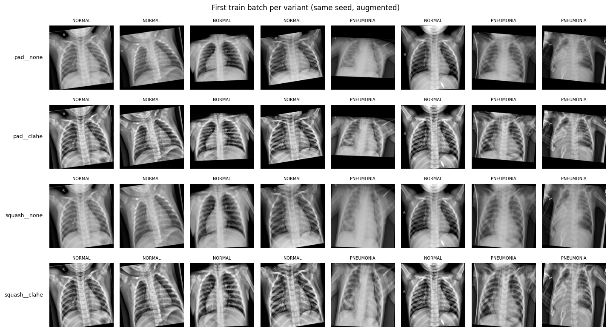

위 그림은 네 데이터셋의 첫 train 배치에서 8장씩 뽑아 그린 겁니다. 세로로 같은 열을 봐주세요. 같은 사진이 같은 각도로 회전되어 있고, 행마다 pad/squash와 CLAHE 적용 여부만 다릅니다. pad 행은 위아래에 검은 여백이 있고, squash 행은 사진이 정사각형으로 눌려 있으며, clahe 행은 갈비뼈와 폐 음영이 더 또렷합니다.

> 🤔 **1채널과 3채널은 왜 비교하지 않았나요?**
>
> 사전학습 모델의 첫 conv 레이어는 3채널(RGB)을 받도록 만들어져 있습니다. 1채널 흑백 사진 $g$를 넣으려면 첫 conv를 1채널용으로 바꿔야 하는데, 이때 보통 기존 RGB 필터를 더해서 하나로 만듭니다. 그런데 흑백 사진을 3채널로 복사해서 넣으면 첫 conv가 계산하는 값은 다음과 같습니다.
>
> $$
> W_R * g + W_G * g + W_B * g = (W_R + W_G + W_B) * g
> $$
>
> - $W_R, W_G, W_B$: 첫 conv 필터의 R, G, B 채널 가중치
> - $g$: 흑백 사진
>
> 좌변은 "3채널로 복사해서 넣기", 우변은 "RGB 필터를 더한 1채널 필터에 넣기"입니다. 즉, <u><strong>두 방식은 같은 계산입니다.</strong></u> 1채널과 3채널을 비교하는 건 사실상 같은 모델을 두 번 돌리는 셈이라 비교 대상에서 뺐습니다.

## 2. 모델 준비: Frozen VS Partial VS Full

torchvision에서 ImageNet 사전학습 가중치를 불러온 뒤, head를 2-class(정상/폐렴) Linear로 교체하고, 학습 방법에 따라 어디까지 `requires_grad`를 켤지 정합니다.

```python
def build_model(arch: str, mode: str, pretrained: bool = True) -> nn.Module:
    """ImageNet 사전학습 모델 -> head를 2-class로 교체 -> freeze 모드 적용. 입력은 3채널."""
    spec = ARCH_SPECS[arch]
    model = spec["ctor"](weights=spec["weights"] if pretrained else None)

    head = model.get_submodule(spec["head"])
    _set_submodule(model, spec["head"], nn.Linear(head.in_features, len(CLASSES)))

    # frozen: head만 / partial: 마지막 stage + head / full: 전부
    trainable = {"frozen": [spec["head"]], "partial": spec["last_stage"] + [spec["head"]], "full": None}[mode]
    for name, p in model.named_parameters():
        p.requires_grad = trainable is None or _under(name, trainable)
    return model
```

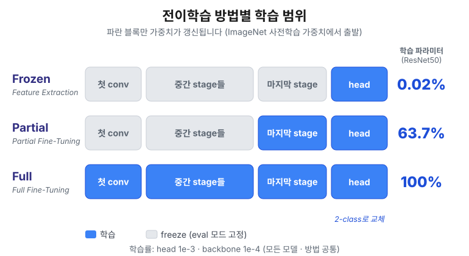

학습되는 파라미터 수는 이렇게 달라집니다.

| 모델 | 전체 | Frozen | Partial | Full |
| --- | --- | --- | --- | --- |
| resnet50 | 23.5M | 4,098개 (0.017%) | 15.0M (63.7%) | 100% |
| densenet121 | 7.0M | 2,050개 (0.029%) | 2.2M (31.1%) | 100% |
| efficientnet_b0 | 4.0M | 2,562개 (0.064%) | 1.1M (28.2%) | 100% |

Frozen은 수천 개의 파라미터만 학습합니다. 반면 ResNet50의 Partial은 마지막 stage(`layer4`) 하나만 풀었는데도 전체의 63.7%가 학습됩니다. ResNet은 깊은 stage일수록 채널 수가 많아서 파라미터가 뒤쪽에 몰려 있기 때문입니다.

> 💡 **Freeze한 부분은 가중치뿐만 아니라 "동작"까지 고정해야 합니다.**
>
> 이전 실험인 [정규화·증강 실험 포스트](/posts/ai/experiment-data-normalization-and-augmentation)에서, `requires_grad=False`만으로는 BatchNorm의 `running_mean`·`running_var`가 멈추지 않는다는 걸 다뤘습니다. 이번에는 EfficientNet도 쓰기 때문에 한 가지가 더 있습니다. EfficientNet의 **StochasticDepth**는 train 모드에서 블록을 무작위로 건너뛰는데, freeze된 블록에서도 이게 계속 일어납니다.
>
> 그래서 BatchNorm만 골라내는 대신, <u><strong>학습 가능한 파라미터가 하나도 없는 서브모듈은 통째로 eval 모드로 돌려놓는</strong></u> 방식으로 바꿨습니다.
>
> ```python
> def set_frozen_eval(model):
>     """학습 가능한 파라미터가 하나도 없는 서브모듈(freeze된 stage)은 eval로 둔다."""
>     for m in model.modules():
>         params = list(m.parameters())
>         if params and not any(p.requires_grad for p in params):
>             m.eval()
> ```
>
> Full Fine-Tuning이면 freeze된 모듈이 없으니 아무 일도 하지 않습니다.

학습률은 head와 backbone을 나눴습니다. 새로 만든 head는 무작위 초기값에서 출발하니 크게(1e-3), 사전학습된 backbone은 이미 좋은 값이니 조금씩만(1e-4) 움직이도록 했습니다. 이 규칙은 모든 모델과 학습 방법에 똑같이 적용했습니다.

## 3. 학습

모든 run은 같은 조건으로 학습합니다. 달라지는 건 모델, 학습 방법, 전처리뿐입니다.

| 항목 | 값 |
| --- | --- |
| 에폭 | 10 (early stopping 없음) |
| 옵티마이저 | AdamW (head lr 1e-3, backbone lr 1e-4, weight decay 1e-4) |
| 스케줄러 | CosineAnnealingLR (T_max = 10) |
| 배치 사이즈 | 32 |
| 손실 함수 | CrossEntropyLoss |
| 모델 선택 | validation F1이 가장 높은 에폭의 가중치를 저장 |
| 시드 | 42 (run마다 다시 고정) |
| 환경 | Colab 무료 플랜 T4 GPU |

36 run을 Colab 무료 플랜에서 돌리려면 두 가지가 문제였습니다. 속도와 세션 끊김입니다.

**속도.** 매 에폭 JPEG를 디코딩하고, CLAHE를 걸고, 리사이즈하는 건 같은 결과를 반복해서 계산하는 낭비입니다. 그래서 증강 직전까지의 결정적인 단계는 한 번만 계산해 `npz`로 캐시하고, 그 결과를 통째로 GPU에 올렸습니다(전처리 하나당 약 294MB). 증강(회전 + 좌우반전)은 배치 단위로 GPU에서 affine 변환 한 번으로 처리합니다.

```python
def augment(self, x):
    b = x.size(0)
    # 배치 전체가 아니라 샘플마다 각도/반전을 따로 뽑는다
    angle = (torch.rand(b, generator=self.gen) * 2 - 1) * np.deg2rad(ROT_DEG)
    flip = torch.where(torch.rand(b, generator=self.gen) < HFLIP_P, -1.0, 1.0)
    cos, sin = torch.cos(angle), torch.sin(angle)
    theta = torch.zeros(b, 2, 3)
    theta[:, 0, 0], theta[:, 0, 1] = cos * flip, -sin
    theta[:, 1, 0], theta[:, 1, 1] = sin * flip, cos
    grid = F.affine_grid(theta.to(x.device), list(x.shape), align_corners=False)
    return F.grid_sample(x, grid, mode="bilinear", padding_mode="zeros", align_corners=False)  # 바깥은 배경 0
```

```text
loader + augmentation only: 0.44s / epoch (148 batches)
```

데이터를 꺼내고 증강하는 데 한 에폭에 0.44초밖에 걸리지 않습니다. 이제 학습 시간의 대부분은 모델 자체의 계산입니다.

**세션 끊김.** Colab 무료 플랜은 언제든 세션이 끊길 수 있습니다. 그래서 3 에폭마다 모델·옵티마이저·스케줄러·난수 상태까지 담아서 checkpoint를 저장했습니다. 저장 도중에 끊겨도 기존 파일이 깨지지 않도록, 임시 파일에 먼저 쓰고 교체하는 방식을 썼습니다. 셀을 다시 실행하면 끝난 run은 건너뛰고, 진행 중이던 run은 끊긴 지점부터 이어서 학습합니다.

```text
완료 36 / 36 run
```

## 4. 36개 run의 validation 결과

> 📌 **이 실험의 한계**
>
> 1. **Colab 무료 플랜과 드라이브 용량의 한계로 10 에폭까지만 학습했습니다.** 특히 Frozen은 10 에폭에서 아직 수렴하지 않았습니다.
> 2. **seed 하나로, 조합마다 한 번씩만 학습했습니다.**
> 3. **validation이 507장뿐입니다.** 아래에서 계산하듯, 1장을 더 맞히거나 틀리면 F1이 약 0.0014 움직입니다. 이보다 작은 차이는 우연과 구분하기 어렵습니다.
> 4. **학습률을 모든 학습 방법에서 똑같이 썼습니다.** Frozen에 불리한 설정이었을 수 있습니다.
> 5. **train은 loss와 accuracy만 기록했습니다.** train F1·recall은 기록하지 않았습니다.

결과를 읽기 전에, "validation 1장"이 F1을 얼마나 움직이는지 먼저 계산해봤습니다. 이 숫자가 있어야 0.99와 0.992의 차이가 큰 건지 작은 건지 판단할 수 있으니까요.

$$
F1 = \frac{2TP}{2TP + FP + FN}
$$

- validation 507장 중 폐렴(positive)은 369장입니다. 거의 다 맞힌다면 $2TP + FP + FN \approx 2 \times 369 = 738$입니다.
- 여기서 1장을 더 틀리면 분모의 $FP$나 $FN$이 1 늘어납니다. F1이 1에 가까울 때 그 변화량은 대략 다음과 같습니다.

$$
\Delta F1 \approx \frac{1}{2 \times 369} = \frac{1}{738} \approx 0.0014
$$

즉, <u><strong>validation F1이 0.0014 차이 나면 사진 한 장 차이입니다.</strong></u> 이걸 기준으로 결과를 보겠습니다.

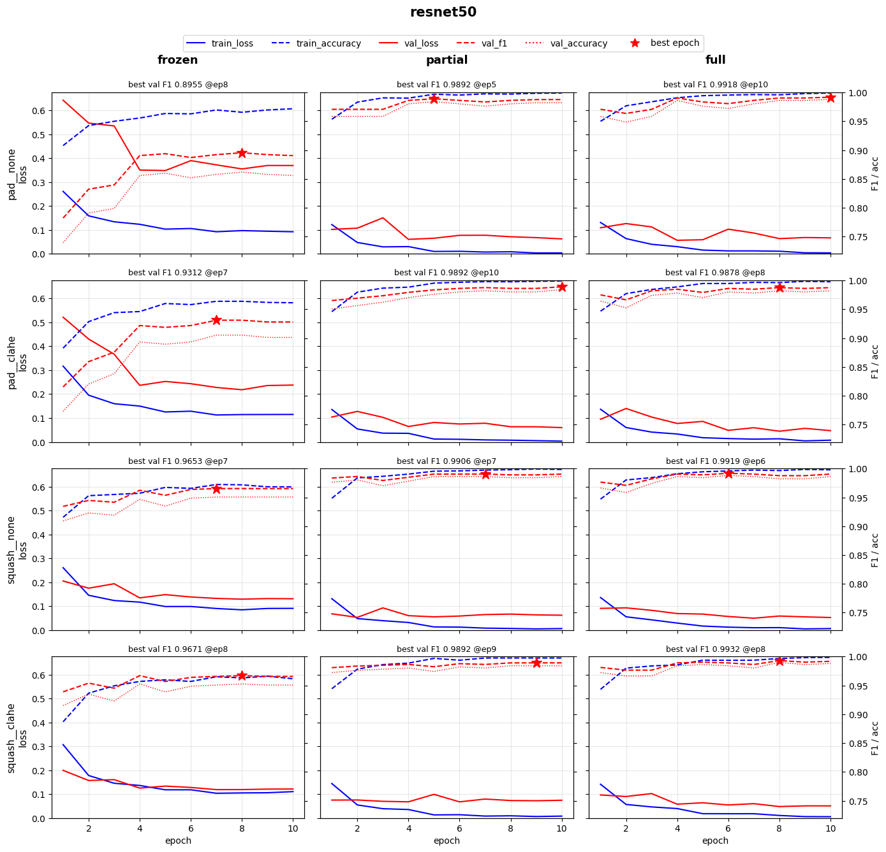

위 그림은 ResNet50의 학습 곡선입니다. 행은 전처리 4가지, 열은 학습 방법 3가지입니다. 파란색은 train, 빨간색은 validation이고, 실선은 loss(왼쪽 축), 점선은 F1·accuracy(오른쪽 축)입니다. 별표는 validation F1이 가장 높았던 에폭, 즉 저장된 가중치입니다. train F1은 기록하지 않아서 train accuracy를 대신 그렸습니다.

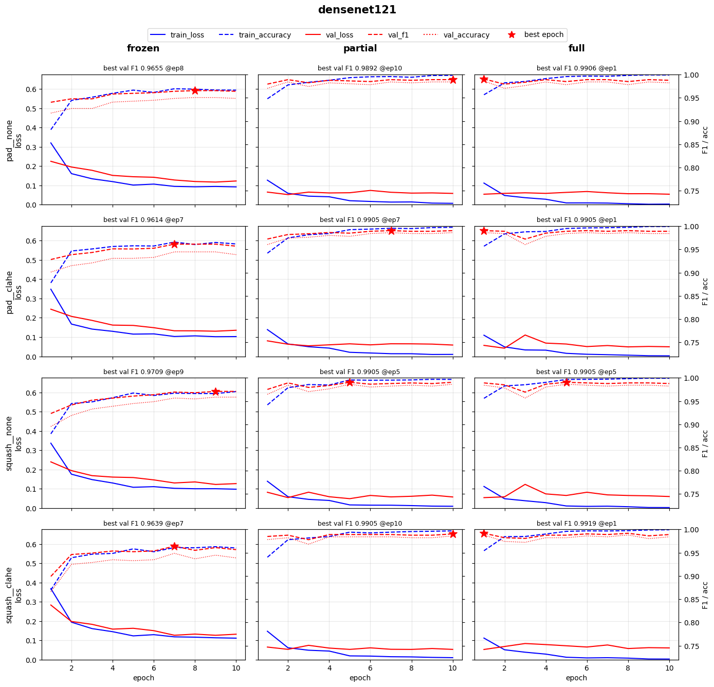

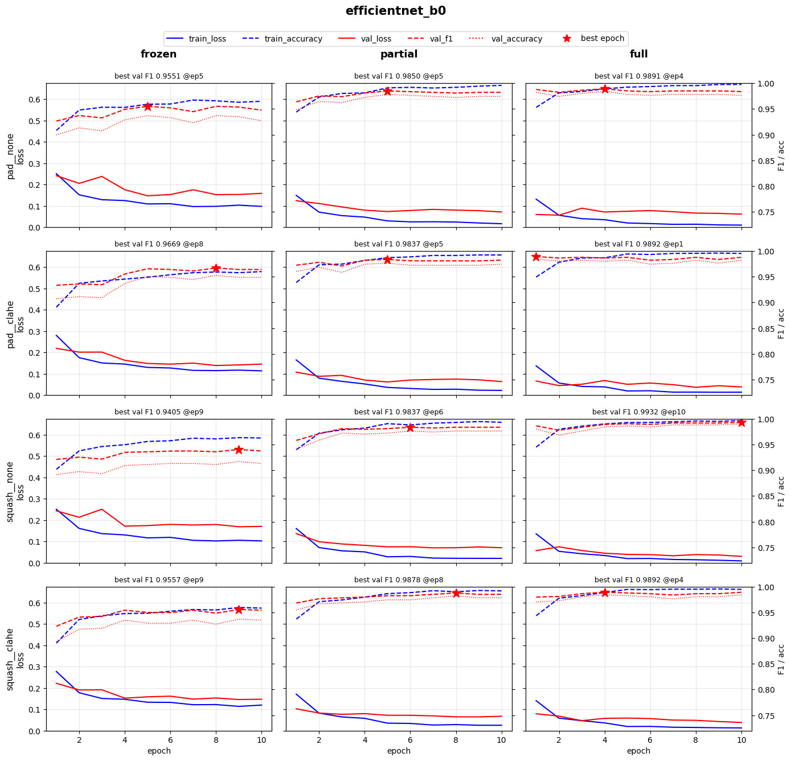

세 장을 모두 놓고 보면 한 화면에 그래프가 36개라 눈에 잘 들어오지 않습니다. 그래서 아래 발견마다 필요한 칸만 다시 모아 그렸습니다.

### 4.1. 발견 1: Frozen은 10 에폭 기준으로 확실히 뒤처진다

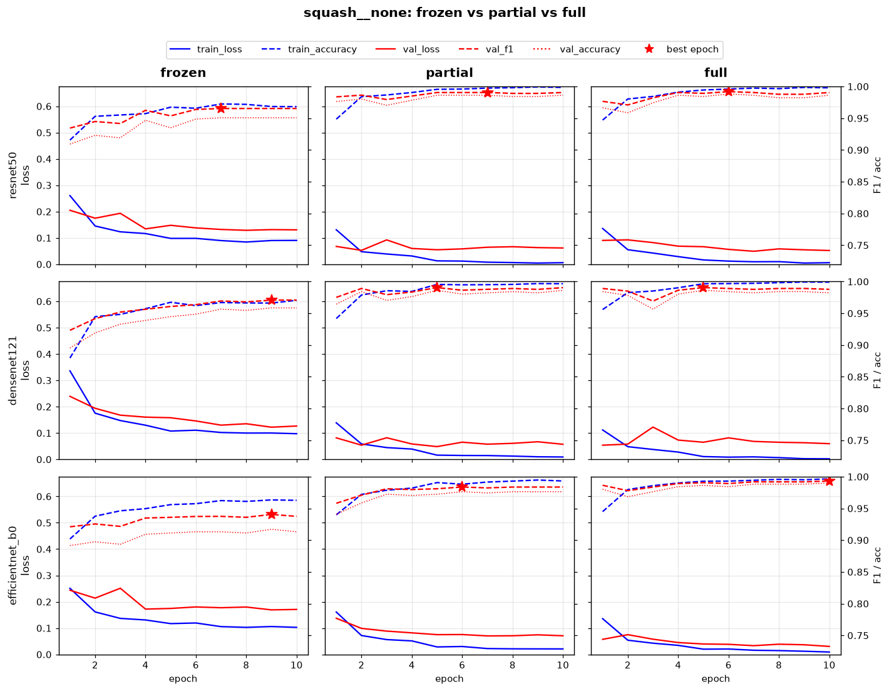

세 모델에서 squash__none 그래프만 모아서 살펴 보겠습니다. 세 모델 모두 가장 왼쪽 열(frozen)의 빨간 점선(val F1)이 partial, full보다 아래에 있습니다. 다른 전처리 행에서도 마찬가지입니다.

- Frozen의 마지막 에폭 val F1은 평균 0.950입니다. backbone은 ImageNet 가중치 그대로이고 head만 학습했는데도 이 정도라면, <u><strong>ImageNet에서 배운 특징만으로도 폐렴 판단에 꽤 쓸모가 있다</strong></u>는 뜻입니다.
- 하지만 backbone을 X-Ray에 맞게 고친 Full은 Frozen보다 F1이 평균 0.0375 높았습니다. validation 약 27장 차이입니다.
- Frozen은 출발점부터 다릅니다. 1 에폭 train loss가 partial, full은 약 0.13인데 frozen은 약 0.30입니다. epoch 1의 train loss는 1 에폭 동안의 평균인데, 학습할 가중치가 많은 partial, full은 첫 에폭 안에서 이미 loss를 빠르게 끌어내리기 때문입니다.

그런데 frozen 곡선은 10 에폭 동안 loss가 내려간 폭이 partial, full보다 큽니다. 그렇다면 ImageNet 가중치에서 고칠 게 많았다는 뜻일까요? 아닙니다. frozen에서 backbone은 전혀 바뀌지 않습니다. <u><strong>출발점이 높아서 head 하나로 내려갈 거리가 더 많이 남아 있었을 뿐입니다.</strong></u>

실제로 frozen 12개 run 중 10개가 val loss 최저점을 8~9 에폭에 찍었습니다. 즉 10 에폭에서도 아직 수렴하지 않았습니다.

<u><strong>따라서 "Frozen이 뒤처진다"는 어디까지나 10 에폭 기준의 결론입니다. 더 오래 학습하면 격차가 줄어들 수 있습니다.</strong></u>

### 4.2. 발견 2: Partial·Full은 1~2 에폭 만에 validation 성능이 멈춘다

partial, full 열을 보면 train loss는 10 에폭 내내 0을 향해 내려가지만, validation F1은 1~2 에폭 이후 거의 오르지 않습니다.

과적합의 신호도 약하게 보입니다. 일부 run은 train loss가 0.003까지 떨어지는 동안 val loss가 최저점 이후 조금씩 올라갔습니다.

- densenet121 / full / squash__clahe: val loss 최저점이 1 에폭, 이후 +0.0081
- resnet50 / full / pad__none: val loss 최저점이 4 에폭, 이후 +0.0102

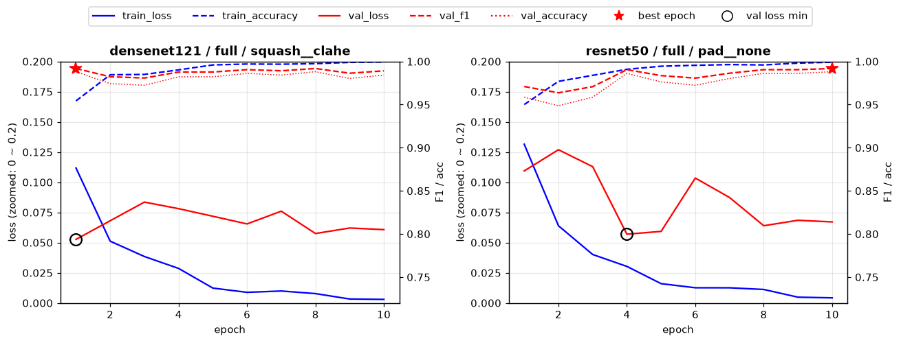

차이가 작아서 loss 축을 0~0.2로 확대했습니다. 동그라미(val loss 최저점) 이후로 파란 실선(train loss)은 계속 내려가지만, 빨간 실선(val loss)은 더 내려가지 않고 오히려 조금 올라와 있습니다.

그런데도 validation F1과 accuracy는 0.98 정도로 일관되게 높았습니다. 틀리는 장수는 그대로인데, 이미 틀린 몇 장에 대한 확신만 강해졌다는 뜻입니다. <u><strong>아직 F1에 드러날 정도의 과적합은 아닙니다.</strong></u>

> 🤔 **train loss는 쭉쭉 내려가는데 validation loss는 완만합니다. 이것도 과적합 아닌가요?**
>
> 두 곡선은 애초에 같은 조건에서 잰 값이 아니라서, 기울기를 그대로 비교하기 어렵습니다.
>
> | | train loss | validation loss |
> | --- | --- | --- |
> | 측정 시점 | 한 에폭 동안 배치마다 잰 값의 평균 | 에폭이 끝난 뒤 모델로 한 번 측정 |
> | 증강 | 회전 + 좌우반전 적용 | 없음 |
> | 클래스 비율 | sampler로 약 50 : 50 | 폐렴 73% (원래 분포) |
>
> 그래서 train과 validation의 **절대적인 차이**보다, 에폭이 지나면서 그 차이가 **벌어지는 추세**를 봐야 합니다.

### 4.3. 발견 3: ResNet50 Frozen은 pad에서만 유독 흔들렸다

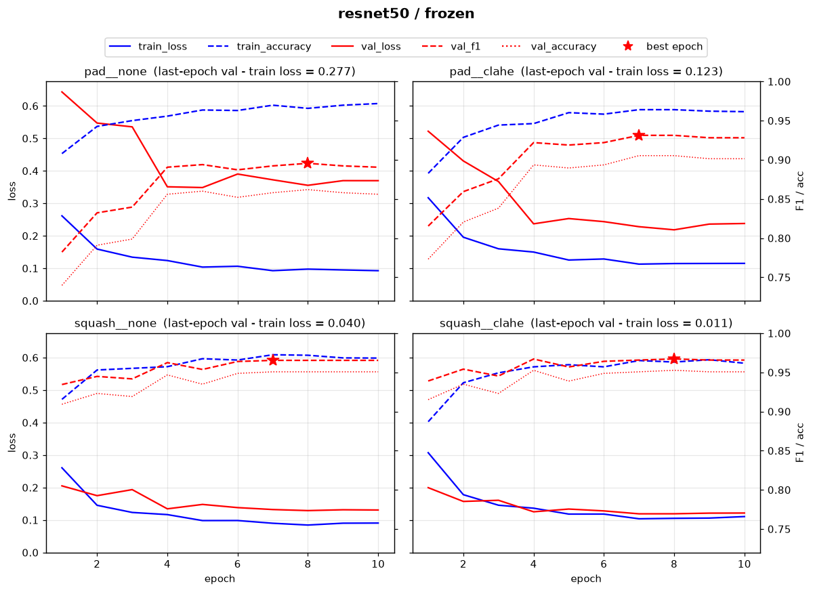

위 두 칸(pad__none, pad__clahe)은 아래 두 칸과 달리 빨간 실선(val loss)이 파란 실선(train loss)보다 한참 위에 있습니다.

| ResNet50 | 마지막 에폭 loss 격차 (val − train) |
| --- | --- |
| frozen × pad (none·clahe 평균) | 0.200 |
| frozen × squash (none·clahe 평균) | 0.026 |
| partial, full × pad / squash | 0.05 ~ 0.06 |

partial, full에서는 pad와 squash의 차이가 거의 없는데, frozen에서만 pad가 크게 벌어졌습니다.

왜 하필 ResNet50 frozen에서만 그랬을까요? 저는 이렇게 추정했습니다. frozen은 backbone의 BatchNorm 통계가 ImageNet 값으로 고정됩니다(`set_frozen_eval`). 그런데 pad 사진에는 ImageNet에는 거의 없는 <u><strong>넓은 검은 여백</strong></u>이 있습니다. 이 여백 때문에 달라진 입력 분포를 backbone이 보정해야 하는데, frozen은 backbone을 고칠 수 없으니 그대로 안고 가야 했다는 겁니다. backbone을 학습하는 partial, full에서는 이 차이가 사라진다는 점이 이 가설을 뒷받침합니다. 다만 이건 검증하지 않은 가설입니다.

### 4.4. 발견 4: 모델 간 차이는 없다. 학습 방법의 차이만 있다

36개 run을 한눈에 비교하기 위해 히트맵을 그렸습니다.

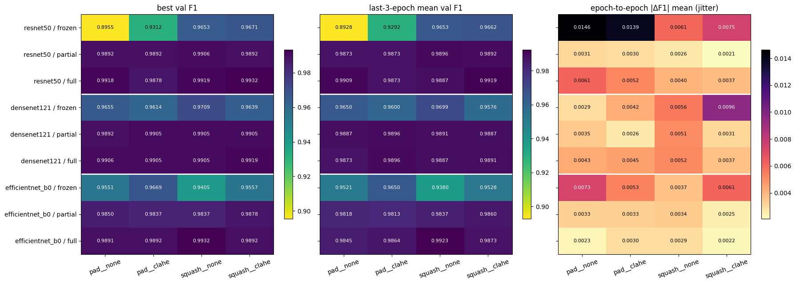

세 패널의 행은 모델 × 학습 방법(9개), 열은 전처리(4개)입니다.

- **best val F1**: 10 에폭 중 가장 높았던 val F1입니다. 운 좋은 에폭 하나에 끌려갈 수 있습니다.
- **last-3-epoch mean val F1**: 마지막 3 에폭의 평균 val F1입니다. 운의 영향을 줄이기 위해 함께 봤습니다.
- **jitter**: 연속한 두 에폭 사이 val F1 변화량의 평균입니다. 클수록 에폭마다 많이 흔들렸다는 뜻입니다.

첫 두 패널은 짙을수록 성능이 좋습니다. 한눈에 보이는 건, <u><strong>frozen 세 줄만 밝고 나머지 여섯 줄은 모두 비슷하게 짙다</strong></u>는 겁니다. 마지막 3 에폭 평균 F1 기준 상위 10개를 뽑아봤습니다.

| 순위 | run | best epoch | best F1 | last3 F1 | AUC | jitter |
| --- | --- | --- | --- | --- | --- | --- |
| 1 | efficientnet_b0 / full / squash__none | 10 | 0.9932 | 0.9923 | 0.9993 | 0.0029 |
| 2 | resnet50 / full / squash__clahe | 8 | 0.9932 | 0.9919 | 0.9976 | 0.0037 |
| 3 | resnet50 / full / pad__none | 10 | 0.9918 | 0.9909 | 0.9974 | 0.0061 |
| 4 | densenet121 / full / pad__clahe | 1 | 0.9905 | 0.9896 | 0.9973 | 0.0045 |
| 5 | resnet50 / partial / squash__none | 7 | 0.9906 | 0.9896 | 0.9967 | 0.0026 |
| 6 | densenet121 / partial / pad__clahe | 7 | 0.9905 | 0.9896 | 0.9970 | 0.0026 |
| 7 | resnet50 / partial / squash__clahe | 9 | 0.9892 | 0.9892 | 0.9964 | 0.0021 |
| 8 | densenet121 / full / squash__clahe | 1 | 0.9919 | 0.9891 | 0.9967 | 0.0037 |
| 9 | densenet121 / partial / squash__none | 5 | 0.9905 | 0.9891 | 0.9983 | 0.0051 |
| 10 | densenet121 / full / squash__none | 5 | 0.9905 | 0.9887 | 0.9978 | 0.0052 |

**분석 결과**

- 1위는 EfficientNet-B0 × Full × squash__none(0.9923)입니다. 하지만 best F1로는 ResNet50 × Full × squash__clahe와 사실상 공동 1위입니다(0.99322 vs 0.99323).
- 1위와 10위의 차이는 0.0036, <u><strong>validation 2~3장 차이</strong></u>입니다. 이 조합을 확실한 1위라고 보기는 어렵습니다.
- 그렇다고 EfficientNet이 가장 좋은 모델이라는 뜻도 아닙니다. partial, full만 놓고 모델별 last3 F1 평균을 보면 ResNet50 0.9890, DenseNet121 0.9888, EfficientNet-B0 0.9854로 오히려 EfficientNet이 가장 낮습니다. 1위 run 하나가 좋았을 뿐입니다.
- 상위 10개 중 6개가 full, 4개가 partial이고 frozen은 하나도 없습니다. 다만 같은 모델·전처리끼리 짝지어 보면 full − partial의 last3 F1 차이는 평균 +0.0018, validation 약 1장입니다.

<u><strong>즉, validation 기준으로 모델 간 성능 차이는 없습니다. 하지만 학습 방법의 차이는 있습니다. Frozen이 확실히 떨어지고, Full이 Partial보다 근소하게 앞섭니다.</strong></u>

> 🤔 **그럼 validation 1등인 조합을 최종 모델로 쓰면 되지 않나요?**
>
> 가장 좋은 조합을 validation으로 고르고, 그 성능을 다시 validation 점수로 보고하면 실제보다 낙관적인 값이 됩니다. 36개 중에 우연히 validation과 잘 맞은 조합이 1등이 됐을 수도 있으니까요. 그래서 최종 성능은 지금까지 한 번도 쓰지 않은 test로 확인합니다(6절).

### 4.5. 어떤 변수가 결과를 가장 크게 흔들었나?

히트맵으로 "어떤 모델을 썼냐"보다 "어떤 학습 방법을 사용했냐"가 더 큰 영향을 끼쳤다는 인상은 얻었지만, 이걸 숫자로 확인해보고 싶었습니다. 그래서 <u><strong>변수 하나만 다르고 나머지 세 변수는 같은 run끼리 묶어서</strong></u>, 그 묶음 안에서 F1이 얼마나 벌어지는지(spread = 최댓값 − 최솟값)를 계산했습니다.

- 예를 들어 sizing의 영향을 보려면, 같은 (모델, 학습방법, CLAHE)에서 pad와 squash 두 run을 한 쌍으로 묶습니다. 이런 쌍이 18개 나옵니다.
- 모델의 영향을 보려면, 같은 (학습방법, 전처리)에서 세 모델을 한 묶음으로 묶습니다. 이런 묶음이 12개 나옵니다.

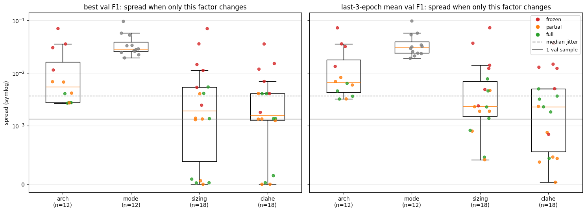

박스가 위에 있을수록 그 변수가 결과를 크게 흔든다는 뜻입니다. 두 개의 회색 가로선이 기준입니다. 점선은 한 run 안에서 에폭마다 흔들리는 정도(jitter)의 중앙값, 실선은 validation 1장이 결과에 미치는 점수(0.0014)입니다. <u><strong>spread가 이 선 근처라면 그 변수의 효과는 운과 구분하기 어렵다는 뜻입니다.</strong></u>

| 변수 | last3 F1 spread 중앙값 | Frozen을 뺐을 때 |
| --- | --- | --- |
| 학습 방법 (mode) | 0.0306 | 0.0013 (partial vs full) |
| 모델 (arch) | 0.0067 | 0.0053 |
| sizing (pad/squash) | 0.0023 | 0.0019 |
| CLAHE | 0.0023 | 0.0014 |

**분석 결과**

- 전체로 보면 **학습 방법 > 모델 > sizing ≈ CLAHE** 순서입니다.
- 하지만 학습 방법이 1위인 건 거의 전부 frozen 때문입니다. frozen을 빼고 partial, full만 보면 학습 방법의 spread는 0.0013으로 validation 1장보다도 작아집니다.
- 그래프에서 빨간 점(frozen)이 모든 변수에서 가장 위에 흩어져 있습니다. <u><strong>모델·sizing·CLAHE 어떤 변수를 바꿔도 가장 민감하게 반응한 건 frozen</strong></u>이었습니다.
- sizing과 CLAHE를 짝별로 비교해보면, partial·full에서는 squash가 pad보다 좋거나 비슷했고(last3 F1 기준 squash 승 : pad 승 : 동률 = partial 4 : 0 : 2, full 3 : 1 : 2), CLAHE는 partial 6짝 중 5짝이 동률이었습니다. 하지만 평균 차이가 0.0009~0.0020, 즉 validation 1장 안팎입니다.

<u><strong>즉, backbone을 학습하느냐 마느냐가 가장 크고, backbone을 학습한다면 그다음은 모델입니다. sizing과 CLAHE의 차이는 validation 1장을 더 맞혔느냐 마느냐 수준입니다.</strong></u>

**결론**

sizing과 CLAHE는 "차이가 있다"고도 "없다"고도 말할 수 없는 상태입니다. validation 한 번으로는 1~2장 차이를 우연과 구분할 수 없으니까요. 그래서 <u><strong>모델과 학습 방법을 하나로 고정하고, 전처리 4가지만 바꿔가며 5-Fold Cross Validation으로 확인하기로 했습니다.</strong></u>

기준 조합으로는 EfficientNet-B0 × Full을 골랐습니다. 

| 기준 | 의미 | DenseNet121 | ResNet50 | EfficientNet-B0 |
| --- | --- | --- | --- | --- |
| 에폭 간 F1 흔들림 | 작을수록 전처리 효과가 노이즈에 덜 묻힌다 | 0.0044 | 0.0048 | **0.0026** |
| val loss 최저점 이후 상승 | 작을수록 과적합이 덜해 마지막 3에폭 평균이 안정적이다 | 0.0053 | 0.0046 | **0.0017** |
| best 에폭 평균 | 너무 이르면 10 에폭 설정과 맞지 않는다 | 2.0 | 8.0 | 4.75 |
| 10 에폭 학습 시간 | 20 run을 돌려야 한다 | 559s | 646s | **268s** |
| 전처리 4종 간 last3 F1 표준편차 | 전처리 차이에 반응하는 정도 | 0.0010 | 0.0021 | **0.0033** |

- EfficientNet-B0는 흔들림, 과적합, 비용 세 기준 모두에서 가장 낫고, 전처리에 따른 차이도 가장 큽니다. 효과가 있다면 잡아낼 가능성이 가장 높은 모델입니다.
- DenseNet121 Full은 best 에폭이 평균 2라서, 10 에폭 대부분을 과적합 쪽으로 보냅니다. 기준 모델로는 가장 부적합합니다.
- Full을 고른 이유는, 실제로 배포한다면 Full로 학습할 가능성이 높고, Partial과 Full의 차이가 validation 1장 수준이라 하나만 골라도 되기 때문입니다.

## 5. 5-Fold CV: 전처리의 차이는 우연이었을까?

### 5.1. 실험 설계

| 구분 | 내용 |
| --- | --- |
| 고정 변수 | EfficientNet-B0 × Full Fine-Tuning. 에폭, 학습률, 배치, 증강, 정규화, sampler, 시드는 4절과 같다. |
| 조작 변수 | 전처리 4가지 (pad__none, pad__clahe, squash__none, squash__clahe) |
| 데이터 분할 | train+val 5,232장을 `StratifiedGroupKFold(n_splits=5)`로 환자 그룹 단위 5등분. test는 사용하지 않는다. |
| 실행 규모 | 4 전처리 × 5 fold = 20 run |
| 주 지표 | last-3-epoch mean val F1, last-3-epoch mean val recall |

4가지 전처리는 <u><strong>모두 같은 fold 분할</strong></u>을 씁니다. 그래야 "전처리 차이"만을 온전한 독립변수로 만들 수 있기 때문입니다. 

```text
      train   val  val NORMAL  val PNEUMONIA  val PNEUMONIA 비율  val groups
fold
0      4181  1051         268            783            0.7450         573
1      4227  1005         263            742            0.7383         573
2      4233   999         276            723            0.7237         572
3      4165  1067         262            805            0.7545         572
4      4122  1110         280            830            0.7477         571

fold당 val 평균 1046장 -> 1장 오분류: F1 약 0.0006, recall 약 0.0013
```

fold마다 validation이 약 1,046장으로, 4절(507장)의 두 배입니다. 덕분에 사진 1장이 F1을 움직이는 크기도 0.0014에서 0.0006으로 절반 이하가 됐습니다.

**판정 규칙**

fold마다 두 전처리의 차이(예: squash − pad)를 계산하고,

- **5개 fold 모두 같은 방향**이고, **평균 차이의 크기가 표준편차보다 크면** → 효과가 있다.
- 방향이 섞이거나, 평균 차이가 표준편차 안에 들어오면 → 차이가 없다.

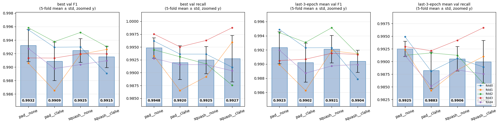

막대는 5-fold 평균, 오차막대는 표준편차, 색깔 선은 fold별 값입니다. 같은 fold끼리 선으로 이었기 때문에, <u><strong>선들이 모두 같은 방향으로 기울면 fold가 달라도 전처리 효과가 일관된다는 뜻</strong></u>입니다. 차이가 워낙 작아서 y축을 확대했으니, 막대 높이의 비율이 아니라 눈금 값으로 읽어주세요.

| 전처리 | last3 val F1 | last3 val recall |
| --- | --- | --- |
| pad__none | **0.9923 ± 0.0023** | **0.9925 ± 0.0015** |
| squash__none | 0.9921 ± 0.0019 | 0.9906 ± 0.0024 |
| squash__clahe | 0.9904 ± 0.0016 | 0.9900 ± 0.0042 |
| pad__clahe | 0.9902 ± 0.0028 | 0.9883 ± 0.0036 |

평균만 보면 F1, recall 모두 pad__none이 1위입니다. 하지만 1위와 4위의 F1 차이가 0.0021, validation 약 3.3장입니다. 그리고 그 차이가 대부분 fold 간 표준편차와 비슷하거나 작습니다.

### 5.2. 발견 5: pad와 squash는 차이가 없다. EDA에서 세운 가설은 기각되었다

| 비교 (last3 F1) | fold0 | fold1 | fold2 | fold3 | fold4 | 평균 ± 표준편차 | 판정 |
| --- | --- | --- | --- | --- | --- | --- | --- |
| squash − pad | −0.0035 | +0.0036 | −0.0005 | +0.0008 | −0.0005 | −0.0000 ± 0.0026 | 차이 없음 |

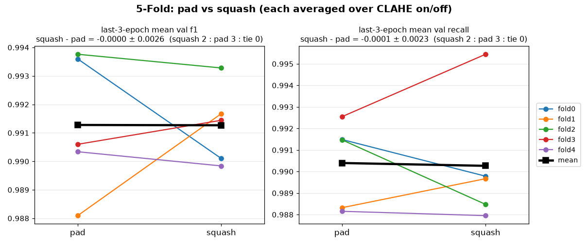

선 하나가 fold 하나입니다. pad와 squash 값은 각각 CLAHE 적용·미적용 두 run의 평균입니다. 선이 오르는 fold와 내리는 fold가 섞여 있고, 검은 선(평균)은 거의 수평입니다. 즉, <u>**비율 유지 pad를 쓰냐, squash Resize를 쓰냐는 결과에 차이가 없었다는 것입니다.**</u>

- fold마다 (squash − pad)를 구했더니 평균은 사실상 0이고, 표준편차가 평균보다 훨씬 큽니다.
- squash가 이긴 fold가 2개, pad가 이긴 fold가 3개로 방향도 섞여 있습니다.
- validation 장수로 환산하면 0.02장 차이입니다. recall로 봐도 평균 차이 −0.0001 ± 0.0023으로 같습니다.

4.5절에서는 partial·full에서 squash가 pad보다 근소하게 좋아 보였습니다. 하지만 5-fold에서는 그 차이가 0에 가깝게 나왔습니다. <u><strong>4.5절에서 본 squash의 우위는 분할 하나에서 생긴 우연이었을 가능성이 높습니다.</strong></u>

<u><strong>즉, "클래스별 종횡비 차이 때문에 pad와 squash가 성능에 영향을 줄 것이다"라는 EDA 가설은 EfficientNet-B0 × Full에서는 지지되지 않았습니다.</strong></u>

### 5.3. 발견 6: CLAHE는 도움이 되지 않았다. 오히려 손해 쪽 경향이 있다

| 비교 (last3 F1) | fold0 | fold1 | fold2 | fold3 | fold4 | 평균 ± 표준편차 | 판정 |
| --- | --- | --- | --- | --- | --- | --- | --- |
| clahe − none | −0.0035 | −0.0020 | −0.0025 | 0.0000 | −0.0015 | −0.0019 ± 0.0013 | 차이 없음 |
| clahe − none (pad 고정) | −0.0026 | −0.0036 | −0.0014 | +0.0002 | −0.0032 | −0.0021 ± 0.0016 | 차이 없음 |
| clahe − none (squash 고정) | −0.0044 | −0.0004 | −0.0037 | −0.0002 | +0.0002 | −0.0017 ± 0.0022 | 차이 없음 |

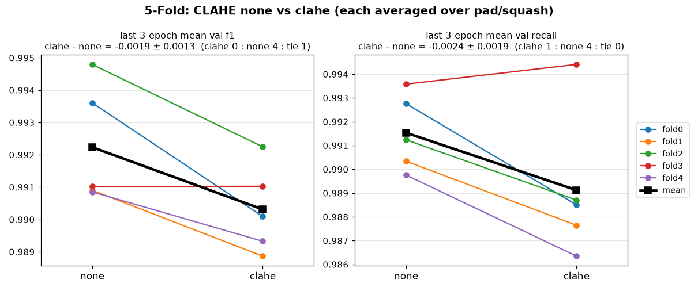

바로 위에서 본 pad vs squash 비교와 달리 대부분의 선이 오른쪽 아래로 내려갑니다. 즉, <u>**clahe를 적용했을 때 성능이 떨어진다는 거죠.**</u> 수평에 가까운 빨간 선 하나(fold3)만 예외입니다.

- 5개 fold 중 4개에서 CLAHE를 적용하지 않은 쪽(none)이 이겼습니다.
- 평균 차이는 −0.0019로, validation 약 3장입니다. recall로 봐도 −0.0024 ± 0.0019, 4개 fold에서 none이 우세합니다.
- 평균 차이의 크기가 표준편차보다 큽니다(|평균| / 표준편차 = F1 1.47, recall 1.25).

> 🤔 **그런데 왜 판정은 '효과 있음'이 아니라 '차이 없음'인가요?**
>
> 판정 기준의 두 조건 중 "평균 차이 > 표준편차"는 통과했지만, "5개 fold 모두 같은 방향"은 아니었기 때문입니다. fold3에서는 그 차이가 없었던 거죠. fold3의 차이가 F1로는 0.0000, recall로는 +0.0008로 사실상 0이었습니다.
>
> 실제로 보조 지표인 best val F1에서는 fold3의 차이가 아주 작은 음수로 나와서 5개 fold 모두 none이 우세했고, "효과 있음(none 우세)"으로 판정됐습니다. <u><strong>즉, 판정을 가른 건 0에 가까운 fold 하나입니다.</strong></u> CLAHE는 "차이 없음"과 "손해" 사이의 아슬아슬하게 걸쳐있는 겁니다.

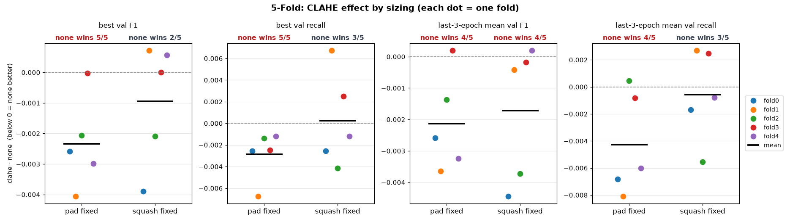

점 하나가 fold 하나이고, 점선(0)보다 아래에 있으면 CLAHE를 쓰지 않은 쪽(none)이 더 좋았다는 뜻입니다. 검은 가로선은 5개 fold의 평균입니다.

그리고 CLAHE의 효과는 sizing에 따라 달라 보였습니다. pad에 고정하고 비교하면 4개 지표 모두에서 5개 fold 중 4~5개가 none 우세였습니다. 반면 squash에 고정하면 last3 F1을 뺀 나머지 3개 지표에서 none 우세가 2\~3개 fold에 그쳐, 방향이 섞였습니다.

<u><strong>즉, CLAHE는 성능에 도움이 되지 않았습니다. 오히려 약간 손해일 가능성이 있습니다. 다만 미리 정한 판정 기준은 넘지 못했으므로 "CLAHE가 성능을 떨어뜨린다"고 단정할 수는 없습니다.</strong></u> 성능 이득 없이 전처리 단계만 하나 늘리는 셈이니, 저는 CLAHE를 쓰지 않는 쪽을 택했습니다.

> 📌 **이 판정의 한계**
>
> 1. **정식 통계 검정이 아닙니다.** "모두 같은 방향 + 평균 차이 > 표준편차"는 제가 직접 정한 규칙이고, fold가 5개뿐이라 위의 CLAHE처럼 0에 가까운 fold 하나에 판정이 바뀔 수 있습니다.
> 2. **5개 fold는 독립적인 실험이 아닙니다.** 서로 학습 데이터의 약 75%를 공유하므로, 표준편차가 실제보다 작게 나왔을 수 있습니다.
> 3. **판정을 24번 했습니다.** 4개 지표 × 6개 비교입니다. 판정을 여러 번 하면 실제 효과가 없어도 몇 개는 우연히 "효과 있음"이 나올 수 있습니다. 그래서 결론은 미리 정한 주 지표(last3 F1, recall)로만 내렸습니다.
> 4. **EfficientNet-B0 × Full 한 조합에서만 확인했습니다.** 다른 모델이나 학습 방법(특히 frozen)에서도 전처리의 영향이 없다고 말할 수는 없습니다.
> 5. **전처리를 바꾼 폭이 좁습니다.** CLAHE는 강도 한 가지(clipLimit 2.0, 8×8 타일)만, sizing은 pad와 squash 두 가지만 비교했습니다.

## 6. Test: validation보다 성능이 떨어짐

### 6.1. test에 쓸 전처리 고정

5절에서 전처리 사이에 의미 있는 차이는 없었습니다. 그래서 test에서 모델 × 학습 방법을 비교할 때는, <u><strong>성능을 가장 덜 흔드는 전처리 하나</strong></u>로 고정했습니다. 기준은 5-fold 사이 last3 val recall의 표준편차입니다.

```text
Test 전처리: pad__none (5-fold last3_recall std 최소)
test 618장 (NORMAL 231, PNEUMONIA 387) -> 1장 오분류: F1 약 0.0013, recall 약 0.0026
```

pad__none은 5-fold recall 표준편차가 0.0015로 가장 작았고, 평균도 0.9925로 가장 높았습니다.

솔직히 말씀드리면, 처음에는 last3 F1의 표준편차를 기준으로 squash__clahe를 골라 test를 먼저 평가했습니다. 그런데 폐렴 판별에서는 <u><strong>폐렴 환자를 놓치지 않는 것</strong></u>이 가장 중요하다고 보고, 주 평가지표를 recall로 바꿨습니다. 같은 원칙으로 기준 전처리도 recall 기준인 pad__none으로 바꿨습니다. squash__clahe의 test 결과도 함께 언급하겠습니다.

결과를 보기 전에 두 용어를 정리하겠습니다.

> - **FN(False Negative)**: 실제로는 폐렴인데 정상이라고 판단한 장수입니다. 폐렴 환자를 놓친 경우이므로 이 과제에서 가장 피해야 할 오류입니다. FN이 적을수록 recall이 높습니다.
> - **FP(False Positive)**: 실제로는 정상인데 폐렴이라고 판단한 장수입니다.

순위는 FN이 적은 순서로 정하고, FN이 같으면 FP가 적은 순서로 정했습니다. recall만 보면 모든 사진을 폐렴이라고 답해도 1.0이 되기 때문에, 같은 recall 안에서는 FP를 함께 봐야 합니다.

### 6.2. 발견 7: Frozen은 폐렴을 가장 많이 놓친다

각 모델은 4절에서 학습한 것이고, validation F1이 가장 높았던 에폭의 가중치를 썼습니다.

| 모델 | 학습 방법 | loss | recall | F1 | AUC | FN | FP |
| --- | --- | --- | --- | --- | --- | --- | --- |
| resnet50 | frozen | 0.3505 | 0.8605 | 0.8892 | 0.9342 | 54 | 29 |
| | partial | 0.5710 | **0.9974** | **0.9008** | 0.9825 | **1** | 84 |
| | full | 0.8355 | 0.9948 | 0.8912 | 0.9703 | 2 | 92 |
| densenet121 | frozen | 0.3744 | 0.9819 | 0.8889 | 0.9535 | 7 | 88 |
| | partial | 0.9982 | **0.9974** | 0.8783 | 0.9520 | **1** | 106 |
| | full | 0.7260 | 0.9948 | 0.8740 | 0.9564 | 2 | 109 |
| efficientnet_b0 | frozen | 0.4079 | 0.9638 | 0.8705 | 0.9337 | 14 | 97 |
| | partial | 0.6425 | 0.9948 | 0.8851 | 0.9649 | 2 | 98 |
| | full | 0.6180 | **0.9974** | 0.8843 | 0.9749 | **1** | 100 |

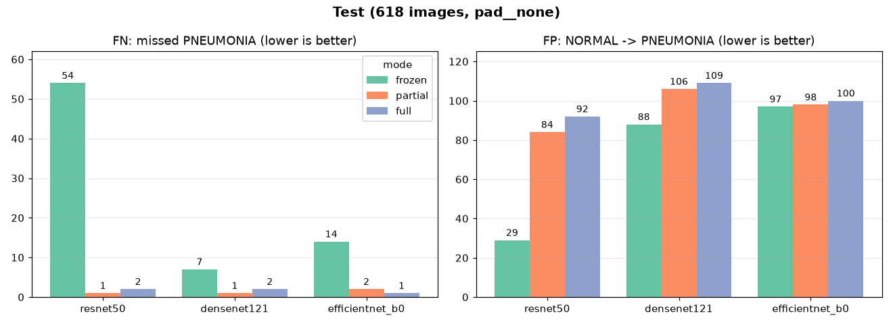

FN 그래프(왼쪽)를 봐주세요. 초록색(frozen) 막대만 우뚝 솟아 있습니다.

- 같은 모델의 partial, full 중 더 나은 쪽과 비교하면, frozen은 폐렴을 ResNet50에서 53장, DenseNet121에서 6장, EfficientNet-B0에서 13장 더 놓쳤습니다.
- partial과 full의 FN 차이는 세 모델 모두 1장(recall 0.0026)입니다. test 1장 차이이므로 둘의 우열은 가릴 수 없습니다.
- 실제로 squash__clahe로 학습한 모델로 같은 비교를 하면, recall 1등은 세 모델 모두 full이었습니다. <u><strong>Partial과 Full의 순위는 전처리만 바꿔도 뒤집힙니다.</strong></u> 반면 "Frozen이 가장 많이 놓친다"는 두 전처리에서 모두 같았습니다.

<u><strong>즉, Frozen < Partial ≈ Full입니다. backbone을 학습하지 않으면 폐렴을 더 많이 놓칩니다.</strong></u>

> 🤔 **test loss는 Frozen이 가장 낮은데, 왜 Frozen이 더 나쁜 모델인가요?**
>
> 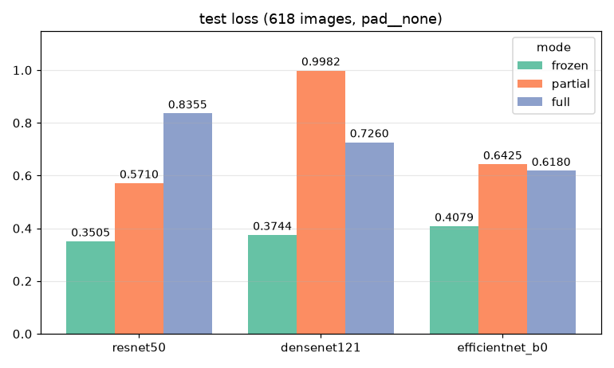
>
> test loss로는 frozen이 세 모델 모두 가장 낮습니다(0.35~0.41). loss만 보면 frozen이 가장 좋은 모델처럼 보이죠.
>
> 하지만 cross entropy loss는 **틀린 개수**가 아니라 **틀릴 때 얼마나 확신했는가**에 크게 영향을 받습니다. 정답 클래스의 확률이 $p$일 때 loss는 $-\log p$입니다.
>
> - 틀리긴 했지만 애매하게 틀린 경우: 정답 확률 0.4 → $-\log 0.4 \approx 0.92$
> - 확신을 갖고 틀린 경우: 정답 확률 0.001 → $-\log 0.001 \approx 6.91$
>
> 확신을 갖고 틀린 한 장이 애매하게 틀린 7장 몫의 loss를 냅니다. partial, full은 정상 사진을 매우 높은 확신으로 폐렴이라고 틀리는 경우가 많아서 loss가 커졌습니다(7절 Grad-CAM에서 폐렴 확률 0.999로 틀리는 장면이 나옵니다). <u><strong>그래서 이 과제에서 loss가 낮다는 건 판단을 더 잘했다는 뜻이 아닙니다.</strong></u>

### 6.3. 발견 8: validation F1 0.99가 test에서 0.87~0.90으로 떨어졌다

<u><strong>하.지.만.</strong></u> 표를 다시 보면 더 큰 문제가 있습니다. validation에서 0.99였던 F1이, test에서는 0.87~0.90으로 떨어졌습니다. 범인은 FP입니다.

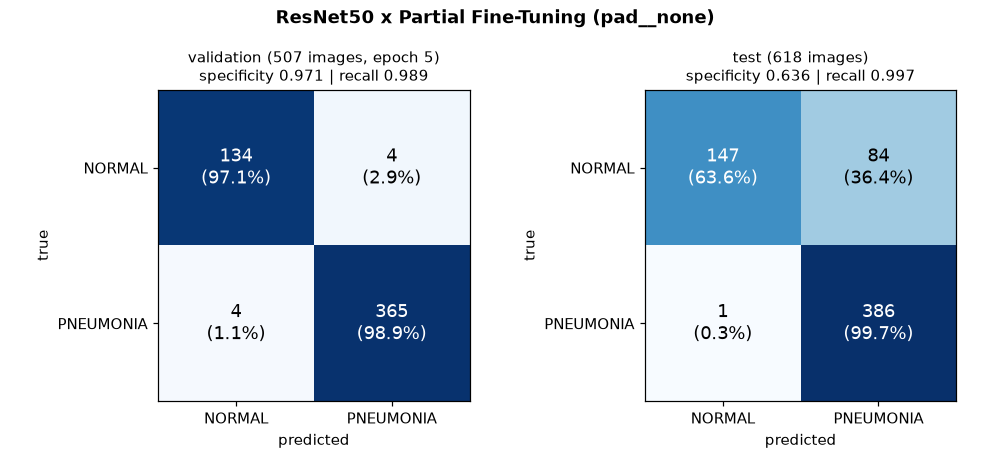

<details>
<summary>그래프 코드</summary>

```python
import matplotlib.pyplot as plt
import numpy as np

CLASSES = ["NORMAL", "PNEUMONIA"]
CMS = {  # [[TN, FP], [FN, TP]]
    "validation (507 images, epoch 5)": np.array([[134, 4], [4, 365]]),
    "test (618 images)": np.array([[147, 84], [1, 386]]),
}
fig, axes = plt.subplots(1, 2, figsize=(9, 4.2))
for ax, (title, cm) in zip(axes, CMS.items()):
    rate = cm / cm.sum(axis=1, keepdims=True)   # 행(실제 클래스) 기준 비율로 색칠
    ax.imshow(rate, cmap="Blues", vmin=0, vmax=1)
    for i in range(2):
        for j in range(2):
            ax.text(j, i, f"{cm[i, j]}\n({rate[i, j]:.1%})", ha="center", va="center", fontsize=12,
                    color="white" if rate[i, j] > 0.5 else "black")
    ax.set_xticks([0, 1], CLASSES)
    ax.set_yticks([0, 1], CLASSES)
    ax.set_xlabel("predicted")
    ax.set_ylabel("true")
    spec = cm[0, 0] / cm[0].sum()
    ax.set_title(f"{title}\nspecificity {spec:.3f} | recall {cm[1, 1] / cm[1].sum():.3f}", fontsize=10)
fig.suptitle("ResNet50 x Partial Fine-Tuning (pad__none)", fontsize=12, weight="bold")
fig.tight_layout()
plt.show()
```

</details>

위 그림은 test 1등인 ResNet50 × Partial의 혼동행렬을 validation과 test에서 나란히 놓은 겁니다. 아랫줄(실제 폐렴)은 두 쪽 모두 거의 다 맞혔습니다. 차이는 윗줄(실제 정상)에 있습니다.

- validation에서는 정상 138장 중 134장을 정상으로 맞혔습니다. $134 / 138 = 0.971$
- test에서는 정상 231장 중 147장만 정상으로 맞히고, <u><strong>84장을 폐렴으로 오판</strong></u>했습니다. $147 / 231 = 0.636$

이렇게 실제 정상 중에 정상으로 맞힌 비율을 **specificity**라고 합니다. recall이 "폐렴을 얼마나 놓치지 않았나"라면, specificity는 "정상을 얼마나 정상으로 봤나"입니다. partial, full 6개 모델의 test specificity는 0.53~0.64에 그칩니다(가장 낮은 DenseNet121 Full: $122 / 231 = 0.528$).

그런데 이상한 점이 있습니다. partial, full의 test ROC-AUC는 0.95~0.98로 여전히 높습니다. ROC-AUC는 threshold와 상관없이 "폐렴 사진에 정상 사진보다 높은 폐렴 확률을 주는가"를 보는 지표입니다. 즉, <u><strong>모델이 폐렴과 정상을 구분하는 능력 자체는 어느 정도 있는데, 폐렴으로 판정하는 기준선(폐렴 확률 0.5 이상)이 test 데이터에 비해 너무 낮게 잡혀 있다</strong></u>고 해석할 수 있습니다.

왜 그렇게 됐을까요? 저는 두 가지 원인을 추정했습니다.

1. **validation과 test는 출처가 다릅니다.**

   validation은 train과 같은 원본 폴더를 다시 나눈 것이고, test는 별도로 제공된 폴더입니다. EDA에서 test의 정상 사진이 train보다 크기와 종횡비가 컸던 것처럼(종횡비 중앙값 1.35 vs 1.22), test에는 validation이 보여주지 못한 차이가 있었을 수 있습니다. 그리고 그 차이는 validation에서는 전혀 드러나지 않았습니다.

2. **학습 때와 평가 때의 클래스 비율이 다릅니다.**

   학습할 때는 sampler로 정상 : 폐렴을 약 50 : 50으로 맞췄지만, validation은 폐렴 약 73%, test는 폐렴 약 63%입니다. 클래스 비율이 바뀌면 같은 모델이라도 적절한 threshold가 달라집니다. 0.5라는 기준선이 test에 맞지 않았을 수 있습니다.

<u><strong>즉, validation이 test를 대표하지 못했습니다. 그리고 지금까지 에폭 선택, 전처리 선택, 조합 비교가 모두 이 validation에 기대고 있었습니다.</strong></u>

### 6.4. 그래서 가장 좋은 조합은?

| 순위 (FN → FP) | 모델 | 학습 방법 | recall (FN) | FP | F1 |
| --- | --- | --- | --- | --- | --- |
| 1 | resnet50 | partial | 0.9974 (1) | 84 | 0.9008 |
| 2 | efficientnet_b0 | full | 0.9974 (1) | 100 | 0.8843 |
| 3 | densenet121 | partial | 0.9974 (1) | 106 | 0.8783 |

recall 기준으로도, F1 기준으로도 1등은 **ResNet50 × Partial Fine-Tuning**입니다. 세 조합 모두 FN이 1장으로 같고, 순위는 FP로 정해졌습니다.

<u><strong>다만 이걸 "ResNet50 × Partial이 확실히 가장 좋다"고 말할 수는 없습니다. 이 실험이 말할 수 있는 범위는 "backbone을 학습하는 Partial, Full이 Frozen보다 폐렴을 덜 놓치고, 그 안에서 ResNet50 × Partial이 오탐(FP)이 가장 적었다"까지입니다.</strong></u>

## 7. Grad-CAM: 모델은 어디를 보고 있었을까?

마지막으로, 9개 모델이 test 사진의 어디를 보고 판단했는지 Grad-CAM으로 확인했습니다. 정상과 폐렴 사진을 2장씩 시드로 고정해서 뽑았고, 각 모델의 마지막 stage 출력에서 정답 클래스를 기준으로 계산했습니다.

> 🤔 **Grad-CAM이란?**
>
> 마지막 conv 특징맵의 각 채널이 특정 클래스 점수에 얼마나 기여했는지를 gradient로 구하고, 그 가중치로 특징맵을 더해서 "모델이 이 클래스라고 판단할 때 본 위치"를 히트맵으로 그리는 방법입니다. 빨간색일수록 그 위치가 판단에 크게 기여했다는 뜻입니다.

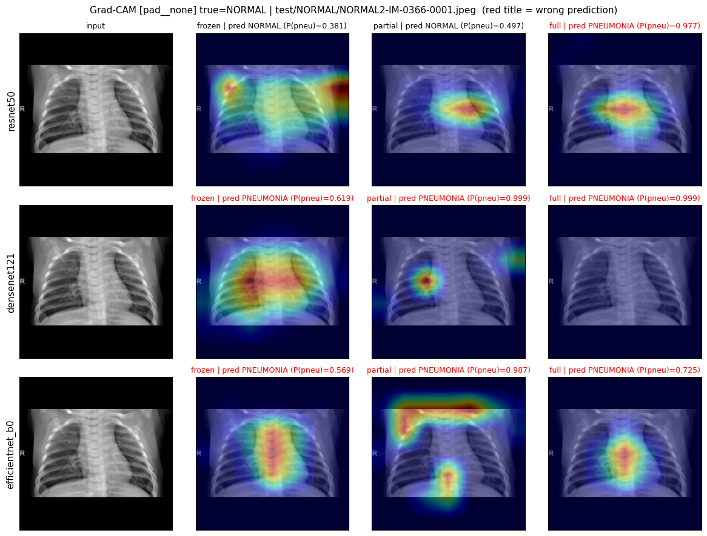

먼저 실제로는 정상인 사진입니다. 제목이 빨간색이면 틀린 예측입니다. <u><strong>9개 모델 중 7개가 이 정상 사진을 폐렴이라고 판단했고, 그중 4개는 폐렴 확률을 0.97 이상으로 확신했습니다.</strong></u> 6.3절에서 본 FP가 바로 이런 사진들입니다.

히트맵을 보면 모델마다 보는 곳이 제각각입니다. ResNet50 partial, full은 심장 근처 가운데를, DenseNet121 partial은 오른쪽 폐의 작은 점 하나를 봤습니다. 특히 EfficientNet-B0 partial은 폐가 아니라 <u><strong>사진 윗변, 즉 pad로 채운 검은 여백과 사진의 경계</strong></u>를 강하게 보고 있습니다.

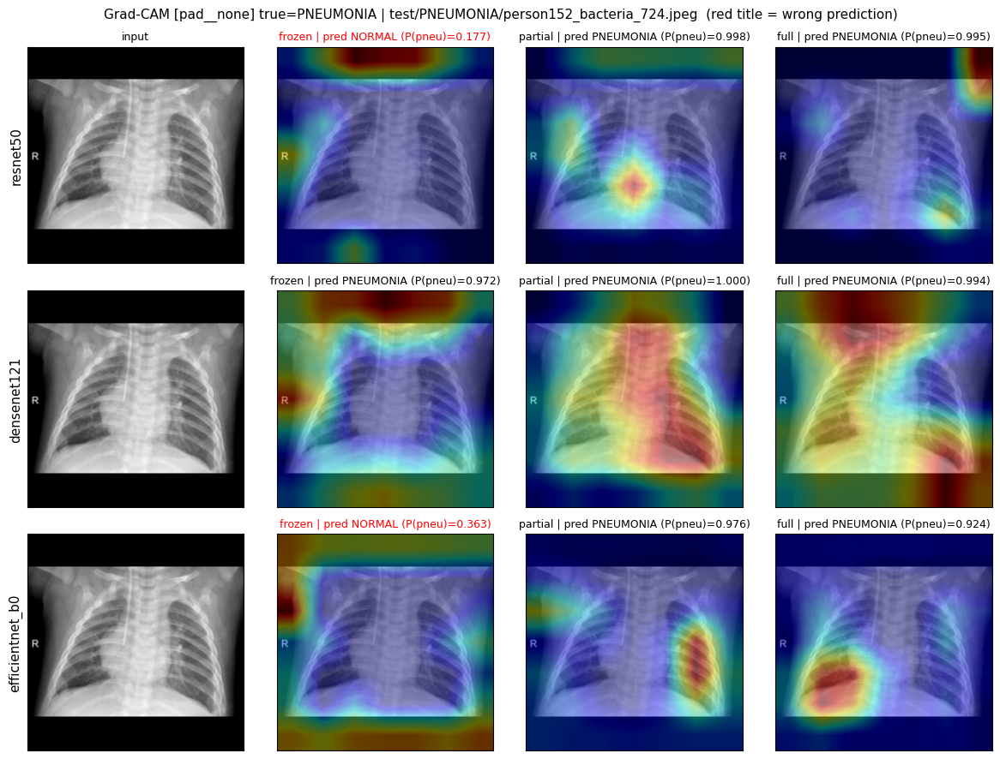

이번에는 실제로 폐렴인 사진입니다. ResNet50과 EfficientNet-B0의 frozen이 이 사진을 정상으로 놓쳤습니다. 두 모델의 히트맵을 보면, 폐보다 <u><strong>사진 바깥의 검은 여백과 가장자리</strong></u>에 빨간색이 몰려 있습니다. DenseNet121 frozen과 full도 사진 윗변 여백을 꽤 많이 보고 있네요. 4.3절에서 ResNet50 frozen이 pad에서만 유독 흔들렸던 것과도 이어지는 모습입니다.

**분석 결과**

- 틀린 예측에서는 폐가 아닌 곳(심장 가운데, 점 하나, pad 여백, 사진 경계)을 보는 경우가 많았습니다.
- 맞힌 예측이라고 다 폐를 본 것도 아닙니다. 폐렴 사진을 맞힌 ResNet50 full과 DenseNet121 full도 사진 모서리와 윗변 여백에 빨간색이 걸려 있습니다. <u><strong>정답을 맞혔다고 해서 올바른 근거로 맞혔다는 보장은 없습니다.</strong></u>
- <u><strong>pad의 검은 여백과 사진 경계가 일부 모델의 판단 근거로 쓰이고 있을 수 있습니다.</strong></u> 5절에서 pad와 squash의 차이가 없었던 건 EfficientNet-B0 × Full의 validation 이야기일 뿐, 모든 모델이 여백을 무시한다는 뜻은 아닙니다.

다만 Grad-CAM은 **정성적인 확인**입니다. 클래스당 2장, 총 4장만 봤고, 모델이 폐가 아닌 영역(여백, 글자, 의료기기 등)을 근거로 판단하는 비율을 수치로 확인하지는 않았습니다. 위 관찰은 "그럴 수 있다"는 신호로만 받아들이는 게 좋을 것 같습니다.

## 8. 결론

이로써 처음에 품었던 세 질문에 답할 수 있게 되었습니다.

> 🤔 세 모델 × 세 전이학습 방법 중에서, <u><strong>폐렴을 가장 잘 잡아내는 조합</strong></u>은 무엇일까?
>
> **답** → 모델보다 학습 방법이 중요했습니다. <u><strong>backbone을 학습하는 Partial, Full이 Frozen보다 폐렴을 확실히 덜 놓쳤고</strong></u>, 그 안에서는 ResNet50 × Partial Fine-Tuning이 test에서 오탐이 가장 적었습니다. 다만 상위 조합들의 차이는 test 1장 수준입니다.

> 🤔 EDA에서 폐렴 사진이 정상 사진보다 종횡비가 컸다. 그렇다면 <u><strong>종횡비를 지키는 pad와 무시하는 squash가 성능에 영향을 줄까?</strong></u>
>
> **답** → 아니요. EfficientNet-B0 × Full에서 5-Fold로 확인했을 때 <u><strong>pad와 squash의 차이는 사실상 0이었습니다.</strong></u> EDA 가설은 지지되지 않았습니다.

> 🤔 <u><strong>CLAHE</strong></u>는 저대비 사진을 살려서 성능을 올릴까, 아니면 폐렴의 뿌연 신호를 지워서 성능을 떨어뜨릴까?
>
> **답** → <u><strong>성능을 올리지 않았습니다. 5개 fold 중 4개에서 CLAHE를 적용하지 않은 쪽이 근소하게 앞섰고</strong></u>, 판정 기준의 경계선에 있습니다. 이득 없이 전처리 단계만 늘리므로 쓰지 않기로 했습니다.

> 📌 **이 실험 전체의 한계**
>
> 1. **validation이 test를 대표하지 못했습니다.** validation 성능은 대부분 0.99 근처로 천장에 가까워 조합 간 차이가 1~3장 수준으로만 드러났고, test에서는 정상을 폐렴으로 오판하는 문제가 크게 나타났습니다. 에폭 선택, 전처리 선택, 조합 비교가 모두 이 validation에 기대고 있습니다.
> 2. **모델을 고른 기준과 최종 평가 기준이 어긋납니다.** checkpoint는 validation F1 기준으로 골랐는데, 최종 평가는 recall을 우선했습니다. 36개 run 중 24개는 F1 최고 에폭과 recall 최고 에폭이 같았으므로 영향은 작을 것으로 봅니다.
> 3. **threshold를 0.5로 고정했습니다.** 학습(50 : 50)과 평가(폐렴 63~73%)의 클래스 비율이 다른데도 기준선을 조정하지 않았습니다.
> 4. **seed 하나로, 조합마다 한 번씩만 학습했습니다.** 같은 조합을 다시 학습했을 때 test 결과가 얼마나 달라지는지 모릅니다.
> 5. **학습 설정을 모든 조합에 똑같이 적용했습니다.** 10 에폭, 같은 학습률은 특히 frozen에 불리했을 수 있습니다.
> 6. **데이터셋 자체의 한계가 있습니다.** 이 데이터셋은 한 기관에서 수집된 소아 흉부 X-Ray로 알려져 있습니다. 성인이나 다른 병원, 다른 촬영 장비의 X-Ray에도 같은 성능이 나온다고 말할 수 없습니다. 또, 세균성과 바이러스성 폐렴을 구분하지 않고 두 클래스로만 분류했습니다.

## 📚 참고자료

- :github: [EDA와 실험 코드 레포지토리](https://github.com/raewoo0908/codeit_finetuning_for_x_ray)
- :kaggle: [Chest X-Ray Images (Pneumonia)](https://www.kaggle.com/datasets/paultimothymooney/chest-xray-pneumonia)
- [전이학습 데이터 전처리 전략의 근거를 EDA로 세워보자](/posts/ai/experiment-x-ray-transfer-learning)
- [전이학습 시, 데이터 정규화를 사전학습 데이터 기준으로 해야 할까, 전이학습 대상 데이터 기준으로 해야 할까? 이미지 증강을 하면 성능이 더 좋을까?](/posts/ai/experiment-data-normalization-and-augmentation)
- [Grad-CAM: Visual Explanations from Deep Networks via Gradient-based Localization](https://arxiv.org/abs/1610.02391)
- [scikit-learn — StratifiedGroupKFold](https://scikit-learn.org/stable/modules/generated/sklearn.model_selection.StratifiedGroupKFold.html)
- [torchvision — Models and pre-trained weights](https://docs.pytorch.org/vision/stable/models.html)
