> 📌 **Summary**
>
> 1. A **perceptron** is shaped after a neuron: it multiplies the inputs by weights, adds a bias, then puts an activation function on top to produce an output.
> 2. A single-layer perceptron cannot solve problems that are **not linearly separable**.
> 3. With a **multi-layer perceptron and a non-linear activation function** you can bend space, and solve problems that are not linearly separable.
> 4. Non-linear activation functions evolved from the step function → the sigmoid function → the **ReLU function**.

## 1. What is a perceptron?

### 1.1. Introducing the Single Layer Perceptron

> 📌 **One-line summary**
>
> A perceptron multiplies its inputs by weights, adds a bias, then puts an activation function on top to produce an output.

The perceptron is a kind of artificial neural network designed to resemble the human nerve cell (neuron).

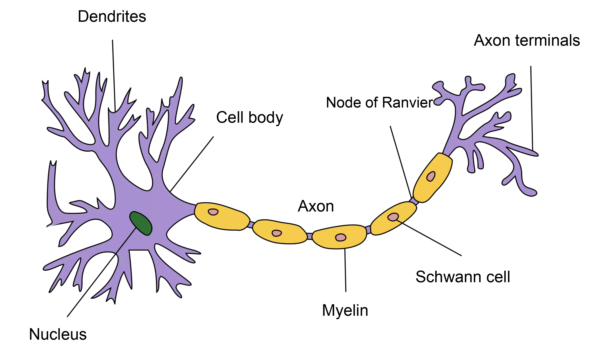

Biologically, the dendrites **receive stimuli from outside**, the cell body **amplifies** that signal, and the amplified signal is **passed on to other nerve cells** through the axon. A perceptron is very much like a neuron.

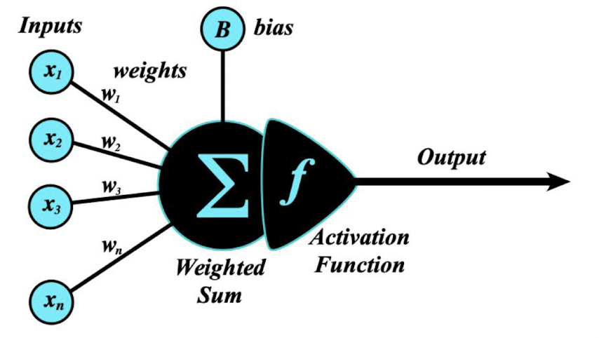

The picture above is a drawing of a **Single Layer Perceptron**. A single-layer perceptron takes the given **input data** $x_i$, multiplies it by a **weight** $w_i$, and then adds a **bias** $b$. It then applies a suitable **activation function** and emits an **output** $\hat y$. Written as a formula, it looks like this.

$$
\hat y = f(W\cdot X + b)\\ = f(\begin{bmatrix} w_1 & w_2 & \dots & w_n \end{bmatrix}
\begin{bmatrix} x_1 \\ x_2 \\ \vdots \\ x_n \end{bmatrix} + b)\\= f(w_1 x_1 + w_2 x_2 + \dots + w_n x_n + b)
$$

## 2. The limits of a linear decision boundary

### 2.1. Problems a single-layer perceptron can solve

A **Single Layer Perceptron** can easily implement models shaped like the `AND` and `OR` gates. That is, given some input $X(x_1,x_2)$, it can easily tell whether the result is $1$ or $0$. What characterises these problems is that the boundary separating 0 from 1 — the **decision boundary** — is linear. We call this being **linearly separable**.

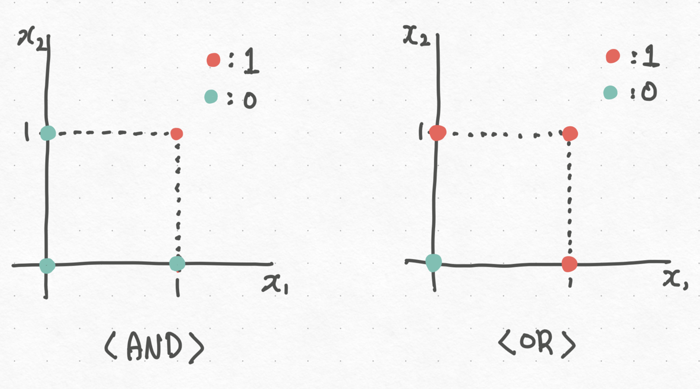

In the `AND` and `OR` graphs we can draw a yellow line to express the boundary between the red dots and the blue dots.

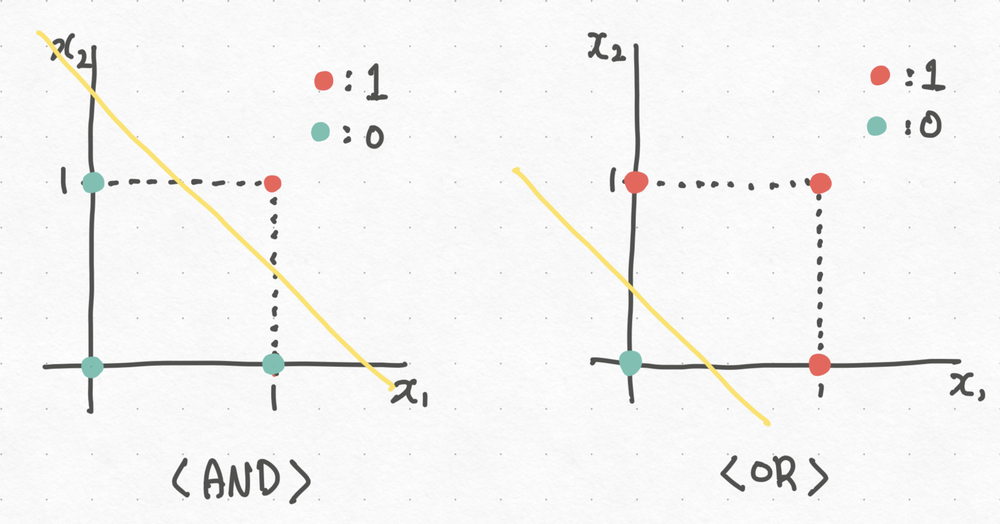

Where does this yellow line come from? Let's take a look at the perceptron below.

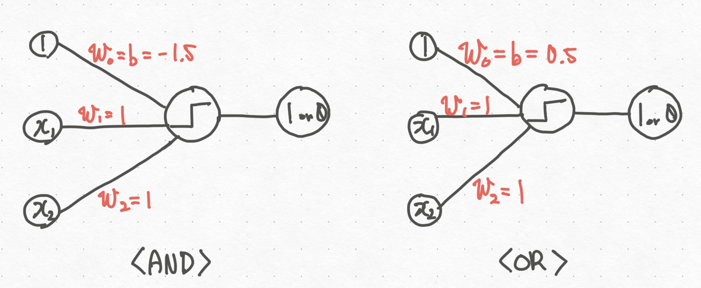

> **Note:** the 1 in the top left is a constant input — that is, the $bias$.

Let's start with the `AND` gate and see how a linear decision boundary arises.

$$
step(z) = \begin{cases} 1 & \text{if } 0 \le z \\ 0 & \text{if } z < 0 \end{cases}
$$

$$
\hat y = step(\begin{bmatrix} 1, 1 \end{bmatrix} \begin{bmatrix} x_1 \\ x_2 \end{bmatrix} - 1.5) \\ = step(w_1 x_1 + w_2 x_2 - 1.5)\\where \{ x \mid x \in (0, 1)\}
$$

> $x_i$ can only ever be 0 or 1.

1. When $x_1 = 0, x_2 = 0$

   $$
   w_1 x_1 + w_2 x_2 - 1.5 = 0 + 0 - 1.5 = -1.5 \\ step(-1.5) = 0
   $$

   ***→ 0 AND 0 = 0***.

2. When $x_1 = 1, x_2 = 0$

   $$
   w_1 x_1 + w_2 x_2 - 1.5 \\= 1 + 0 - 1.5 \\= -0.5 \\ step(-0.5) = 0
   $$

   ***→ 1 AND 0 = 0***.

3. When $x_1 = 0, x_2 = 1$

   $$
   w_1 x_1 + w_2 x_2 - 1.5 \\= 0 + 1 - 1.5 \\= -0.5 \\ step(-0.5) = 0
   $$

   ***→ 0 AND 1 = 0***.

4. When $x_1 = 1, x_2 = 1$

   $$
   w_1 x_1 + w_2 x_2 - 1.5 \\= 1 + 1 - 1.5 \\= 0.5 \\ step(0.5) = 1
   $$

   ***→ 1 AND 1 = 1***.

So we can set up a single **rule**: give each **input** $x_1, x_2$ a **weight** of 1, compare that weighted sum against 1.5, and decide it is 1 if it is **at or above** 1.5 and 0 if it is **below**.

Expressed as a vector, that **weight** is $W = [w_1, w_2] = [1, 1]$. And the **threshold -1.5** is the **bias**.

Writing that out as a formula gives us exactly the equation we saw above.

$$
\hat y = step(\begin{bmatrix} 1, 1 \end{bmatrix} \begin{bmatrix} x_1 \\ x_2 \end{bmatrix} - 1.5)
$$

And drawing it on the plane, we get the following.

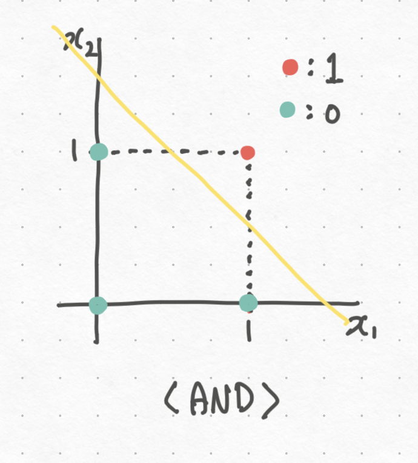

> 💡 The `OR` gate can be solved in the same way. I won't go over the `OR` gate separately.

So a perceptron can be seen as a **linear classifier** that separates linearly separable data.

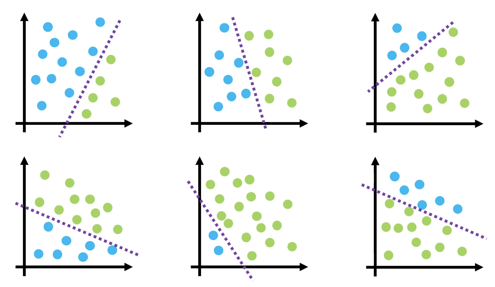

Not just AND and OR — as long as the dataset can be classified with a single line, the perceptron can learn to classify the data well by **adjusting its weights and bias**.

> 🙋 **If the activation function is non-linear, why is the decision boundary still linear?**
>
> The whole computation of a single-layer perceptron splits into two steps.<br>1. Linear combination: $z = w_1x_1 + w_2x_2 + b$<br>2. Passing through the activation function: $\hat y = f(z)$
>
> To classify the data we need to find where the dividing line through the input space $(x_1, x_2)$ — the decision boundary — ends up.
>
> Suppose we use the sigmoid, a non-linear function, as the activation function. We classify a final predicted probability $\hat y$ of 0.5 or more as class 1, and below that as class 0. In other words, this model's decision boundary is the point where $f(z) = 0.5$.
>
> For the sigmoid to output 0.5, the input $z$ going into the function must be exactly 0. So the equation for this model's decision boundary ends up being $w_1x_1 + w_2x_2 + b = 0$.
>
> Whether you use the step function or ReLU, the result is the same. A single perceptron **has already drawn one straight first-degree equation** $z$ across the input space, and all it does is wrap the score from that line in something non-linear (splitting it sharply into 0 and 1, squashing it into a smooth probability, and so on).
>
> So for a single-layer perceptron, **no matter how powerful a non-linear activation function you bolt onto the output, the decision boundary is locked to a single straight line, and the linearly non-separable XOR problem cannot be solved.** To bend space you absolutely need a hidden layer that places two or more lines (nodes).

### 2.2. Problems a single-layer perceptron cannot solve

A single-layer perceptron can classify data as a linear classifier — but what about data like the following? Can a single-layer perceptron learn a dataset that is not linearly separable?

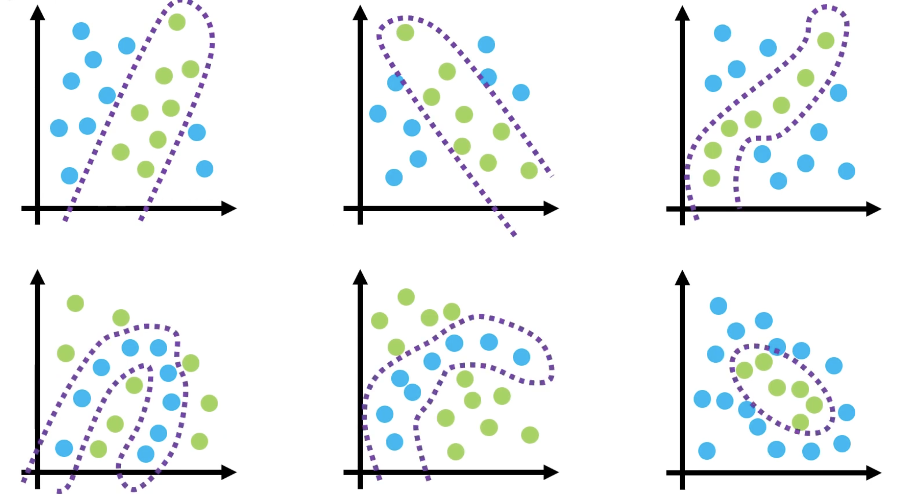

Marvin Minsky mathematically proved the fatal limitation of the single perceptron: the **XOR (exclusive or)** problem. In XOR data, (0,0) and (1,1) belong to the same class and (0,1) and (1,0) belong to the same class, so the classes are **laid out diagonally, crossing over each other**.

No matter how you draw a single straight line on the 2-D plane, you cannot split these points perfectly. This is exactly what it means to be **linearly non-separable**.

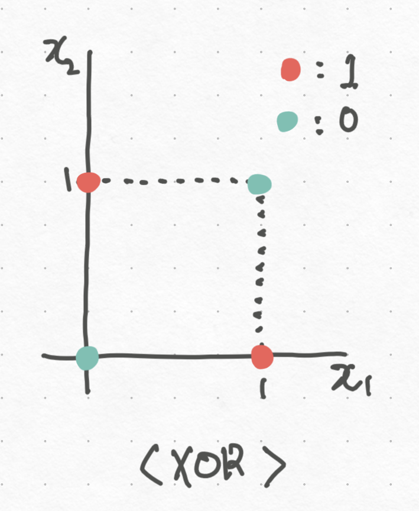

What straight line could you draw on a plane like this to perfectly separate the red dots from the blue dots?

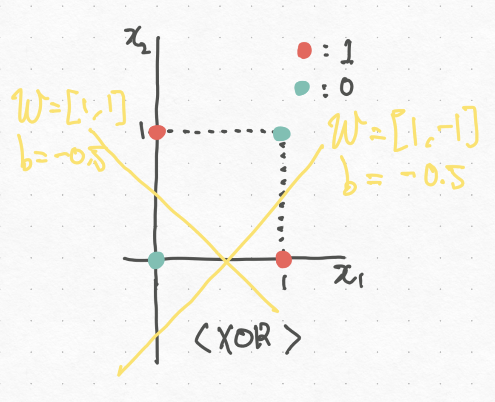

None of the yellow lines I drew at random separates the red dots from the blue dots perfectly. Let's check that in code.

```python
import torch

p03_x = torch.tensor([[0., 0.], [0., 1.], [1., 0.], [1., 1.]])
p03_target = torch.tensor([0, 1, 1, 0])
p03_trials = [
    ("후보 A", [1., 1.], -0.5),
    ("후보 B", [1., -1.], -0.5),
]

for label, weight, bias in p03_trials:
    p03_scores = p03_x @ torch.tensor(weight).reshape(2, 1) + bias
    p03_decisions = (p03_scores >= 0).to(torch.int64).squeeze(1)
    p03_accuracy = (p03_decisions == p03_target).float().mean().item()
    print(label, p03_decisions.tolist(), p03_accuracy)

print("확인한 후보 수:", len(p03_trials))
```

> 후보 A \[0, 1, 1, 1\] 0.75<br>후보 B \[0, 0, 1, 0\] 0.75<br>확인한 후보 수: 2

Even if you generated 100 candidates and ran them all, this code structure (a single linear equation) means **you will never find a line that reaches an accuracy of 1.0 (100%).**

## 3. The rise of the MLP and non-linear functions

If a single straight line can't solve it, what do we do? What if we **draw several straight lines and combine their results**?

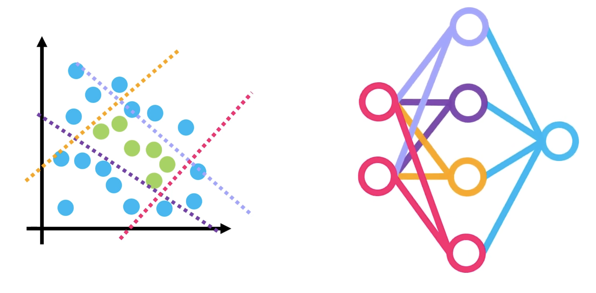

I drew four lines. That gives us four perceptrons. And if we connect yet another perceptron that takes those four outputs as its input, we get a network that can separate this dataset non-linearly.

This is exactly the background to the **Multi-Layer Perceptron (MLP)**. An MLP is made of one **input layer**, one or more **hidden layers**, and an **output layer**, and it **transforms the input data into a new space**. The more hidden layers there are, the more complex the data it can classify — and with a great many hidden layers it becomes a **Deep Neural Network (DNN)**.

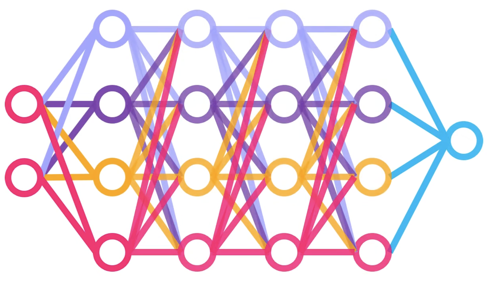

In this process, simply stacking layers still collapses mathematically into a single linear equation. So between the layers there absolutely must be a **non-linear activation function**.

Now let's go back to the `XOR` problem from earlier. How can we solve `XOR` with an **MLP** and a **non-linear activation function**?

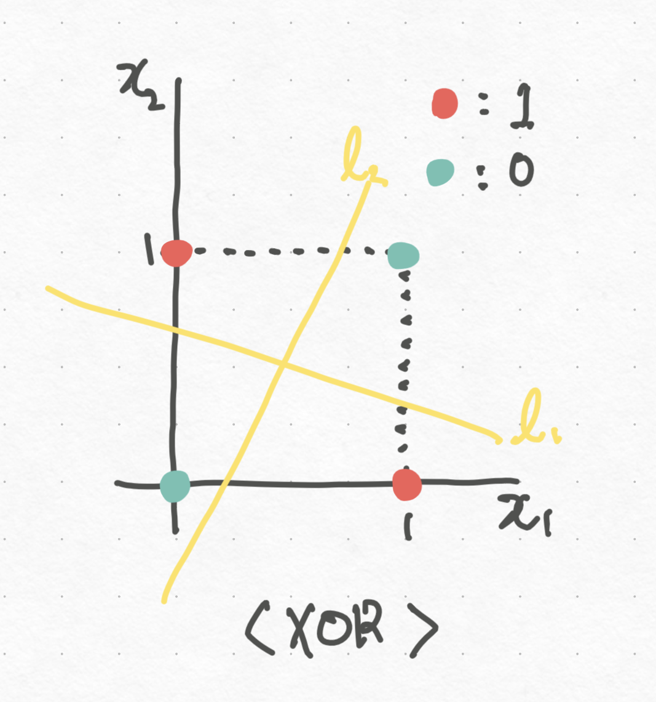

We saw above that a single straight line cannot implement XOR. So we drew two lines on the plane, $l_1$ and $l_2$. With those lines drawn, we can classify XOR like this.

$$
\begin{cases} \text{blue} & \text{if }(l_1 \ge 0 \text{ and } l_2 \le 0) \text{ or } (l_1 \le 0 \text{ and } l_2 \ge 0) \\\text{red} & \text{if } (l_1 \le 0 \text{ and } l_2 \le 0) \text{ or } (l_1 \ge 0 \text{ and } l_2 \ge 0) \end{cases}
$$

Now, what shape does this take once we move it into an MLP?

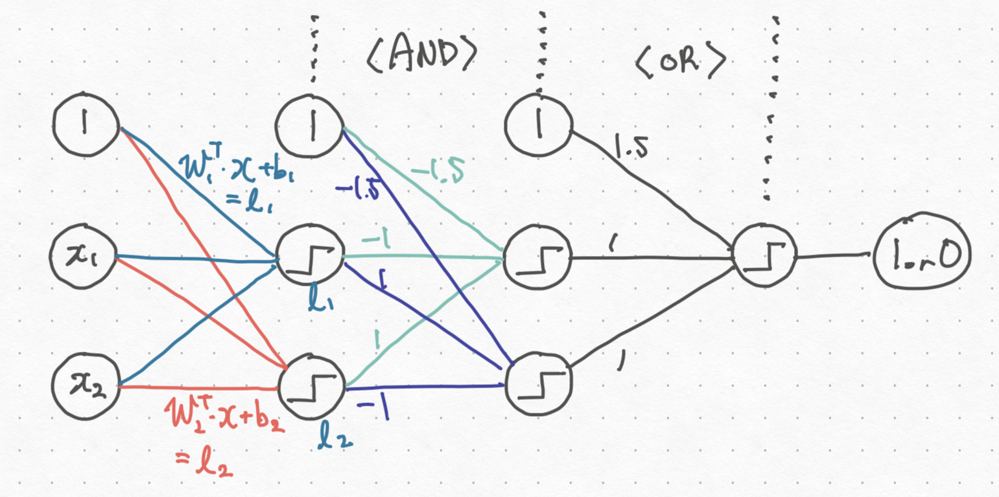

When some vector input $[x_1, x_2]$ arrives, assigning the right $weight$ and $bias$ to each lets us draw the lines $l_1$ and $l_2$. Let's assume for now that we assigned good values and drew the yellow lines $l_1$ and $l_2$ above correctly.

1. **Input layer**

   The nodes where the input vector $[x_1, x_2]$ arrives. No weight computation or activation function is applied here.

2. **First hidden layer**

   Weight and bias computations draw the lines $l_1$ and $l_2$, and the step function decides whether the data lies above or below each line.

3. **Second hidden layer**

   - Look at the mint line. The region that is below $l_1$ (-1) (`AND`) and above $l_2$ (+1) becomes the input to the next hidden layer.
   - Now look at the purple line. The region that is above $l_1$ (+1) (`AND`) and below $l_2$ (-1) becomes the input to the next hidden layer.

4. **Output layer**

   Now it gathers the results of those AND operations, performs a final OR, and outputs the model's final verdict (1 or 0).

   - The region that is below $l_1$ and above $l_2$, (`OR`) above $l_1$ and below $l_2$, is where the **blue** dots are.

How about that? Using a **multi-layer perceptron and a non-linear activation function**, we can solve the XOR problem!

> 💡 **In fact, hidden layers and non-linear activation functions don't bend a straight decision boundary into a wiggly one — they bend and rearrange the coordinate space the data sits in (Space Transformation).**
>
> Let's check the principle behind this space transformation with the step-function equations that solve XOR. We put two nodes $h_1$, $h_2$ in the hidden layer and use a step function — returning 1 if the value is greater than 0 and 0 otherwise — as the activation function.
>
> - $h_1 = \text{step}(x_1 - x_2 - 0.5)$
> - $h_2 = \text{step}(x_2 - x_1 - 0.5)$
>
> The 4 points that lived in the original space $(x_1, x_2)$ are forcibly moved (transformed) into a new coordinate system $(h_1, h_2)$ as they pass through this hidden layer.
>
> - point (0,0) $\rightarrow$ $h_1=0, h_2=0$, so **the new coordinate (0,0)**
> - point (1,1) $\rightarrow$ $h_1=0, h_2=0$, so **the new coordinate (0,0)**
> - point (1,0) $\rightarrow$ $h_1=1, h_2=0$, so **the new coordinate (1,0)**
> - point (0,1) $\rightarrow$ $h_1=0, h_2=1$, so **the new coordinate (0,1)**
>
> The upshot is that the two class-0 points (0,0) and (1,1), which sat far apart on the diagonal, **have been folded perfectly onto a single point, (0,0),** in the new space.
>
> With the criss-crossed data space deformed, the final output layer can now separate the data 100% by drawing just one very simple line: $y = \text{step}(h_1 + h_2 - 0.5)$.
>
> 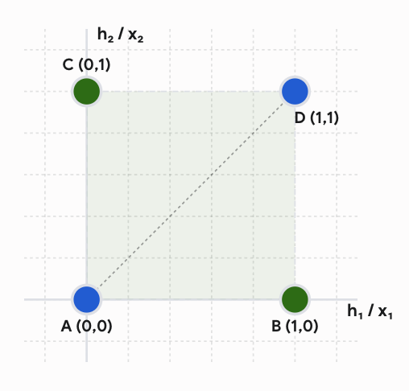
>
> 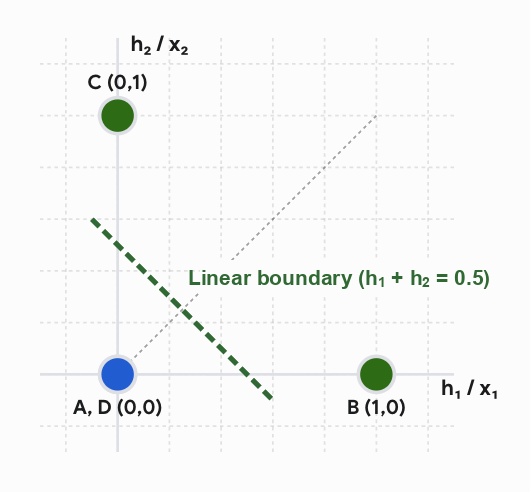
>
> <details>
> <summary>👨‍💻 <b>Code</b></summary>
>
> ```python
> # MLP + step function으로 XOR 풀기
> p03_x = torch.tensor([[0., 0.], [0., 1.], [1., 0.], [1., 1.]])
> p03_target = torch.tensor([0, 1, 1, 0])
>
> # ==========================================
> # 1. hiddne layer: 공간을 구부림
> # (1,0) 또는 (0,1)이라면 그 자리에 두고, (0,0) 또는 (1,1)이라면 (0,0)으로 이동시킴.
> # ==========================================
> # 노드 1: (1,0) 데이터만 찾아내는 필터 (x1 - x2 >= 0.5)
> node1_weight = [1., -1.]
> node1_bias = -0.5
>
> # 노드 2: (0,1) 데이터만 찾아내는 필터 (-x1 + x2 >= 0.5)
> node2_weight = [-1., 1.]
> node2_bias = -0.5
>
> # 각 노드에 행렬 곱셈(@) 연산 후 계단 함수(>= 0) 적용
> score1 = p03_x @ torch.tensor(node1_weight).reshape(2,1) + node1_bias # score1.shape: [4,1]
> h1 = (score1 >= 0).to(torch.float32)
> score2 = p03_x @ torch.tensor(node2_weight).reshape(2,1) + node2_bias
> h2 = (score2 >= 0).to(torch.float32)
>
> # 각 노드의 결과: 새로운 2차원 공간 좌표
> new_space_x = torch.cat([h1, h2], dim=1)
>
> # ==========================================
> # 2. 출력층 (Output Layer): 변환된 공간에서 선 긋기
> # 변환된 공간에서 두 특성(x1, x2) 중 하나라도 1이면 1
> # ==========================================
> # OR 게이트
> final_weight = [1., 1.]
> final_bias = -0.5
>
> # 변환된 공간(new_space_x)에 최종 선형 연산 후 계단 함수 적용
> final_scores = new_space_x @ torch.tensor(final_weight).reshape(2, 1) + final_bias
> final_decisions = (final_scores >= 0).to(torch.int64).squeeze(1)
>
> # ==========================================
> # 3. 결과 확인
> # ==========================================
> final_accuracy = (final_decisions == p03_target).float().mean().item()
>
> print("1. 원본 공간의 데이터:\n", p03_x.numpy())
> print("\n2. 계단 함수를 거쳐 새롭게 재배치된 공간 (h1, h2):\n", new_space_x.numpy())
> print("\n3. 최종 예측값:", final_decisions.tolist())
> print(f"4. 최종 정확도: {final_accuracy * 100}%")
> ```
>
> ```text
> 1. 원본 공간의 데이터:
>  [[0. 0.]
>  [0. 1.]
>  [1. 0.]
>  [1. 1.]]
>
> 2. 계단 함수를 거쳐 새롭게 재배치된 공간 (h1, h2):
>  [[0. 0.]
>  [0. 1.]
>  [1. 0.]
>  [0. 0.]]
>
> 3. 최종 예측값: [0, 1, 1, 0]
> 4. 최종 정확도: 100.0%
> ```
>
> </details>

### 3.1. The weakness of the step function

`XOR` is a very simple problem, so **a human can plug in the weights and biases by hand** and work out the lines. And you can solve it by combining an `AND` gate and an `OR` gate, because the `XOR` gate can be built by combining `NOT`, `AND` and `OR` appropriately.

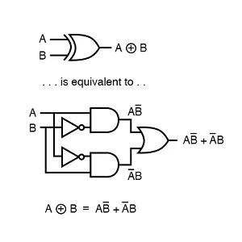

**But for a genuinely complex problem — not XOR — a human clearly can't plug in the weights and biases by hand.** So to compute the weights and biases, we needed **backpropagation** and **gradient descent** to find the right values on their own.

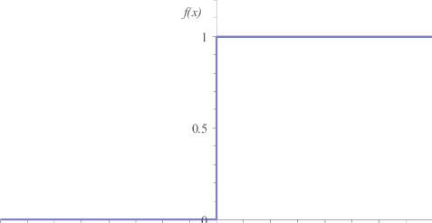

But the step function used in the early days of machine learning didn't meet that need.

- **Errors are flattened**

  In the step function above, it doesn't matter whether the perceptron's computed value is -100, or -0.1, or -0.000001 — **the output is 0**. It's a stimulus below the threshold.

  -0.0000001 is a far better prediction than -100, yet the problem is that the step function **ignores that internal difference and produces exactly the same error**.

  > It's like a truly nasty professor giving the same F to a student who scored 0 and a student who scored 59.

- **Not differentiable**

  The step function is not differentiable at 0, and in every other region its gradient is 0 — so no error signal is propagated and learning stops completely.

### 3.2. The rise of the sigmoid function

To solve these problems with the step function, we needed a function with the following **shape**.

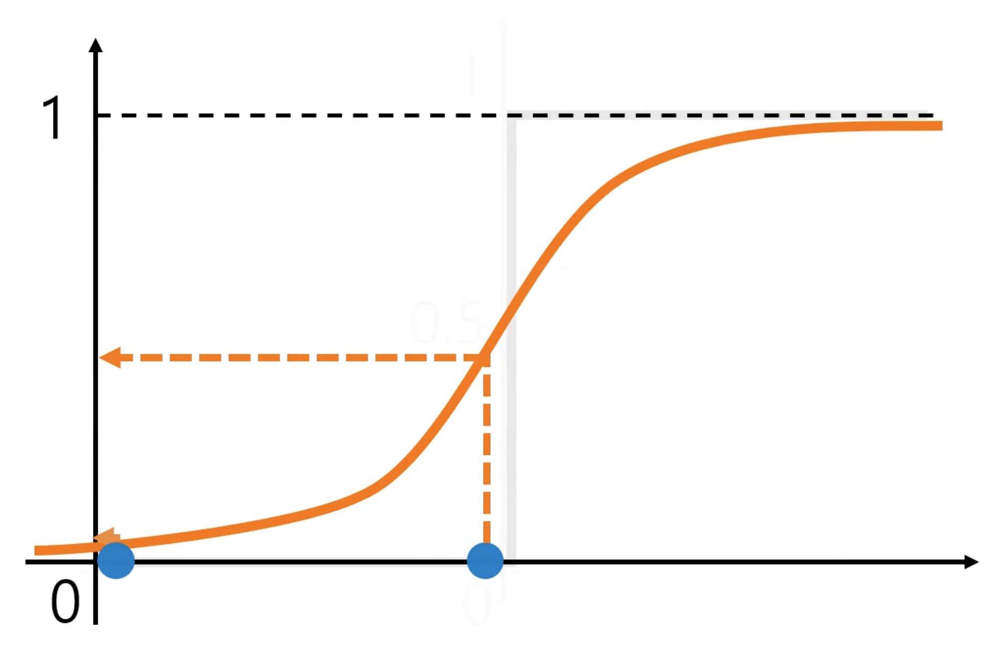

The representative activation function of that shape is the **sigmoid function**.

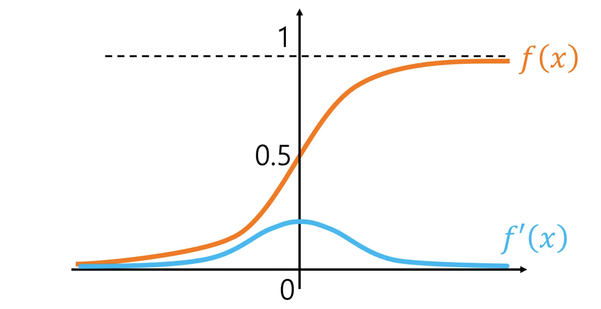

- **Differentiable**

  In an MLP, and especially in a DNN, we use backpropagation to minimise the error. Backpropagation uses gradient descent, and for that, differentiability is a hard requirement.

- **It can express differences in the internal value**

  It can express the differences in the internal value that the step function could not. With the step function, even when the internal value (the x value) changed, anything below a given threshold (e.g. 0) was lumped together as an output of 0.

  The sigmoid, however, outputs a value between 0 and 1 that rises as the internal value grows. So compared with the step function, whose output is only ever 0 or 1, it can compute a far richer range of errors.

- **It expresses probability**

  Because it emits an output between 0 and 1, we can read it as converting the internal value into a probability. The biggest win is that the network's output can be interpreted not as a bare number, but as a number that carries **meaning**.

  > For example, simply being told a shoe size is 270 tells you nothing about whether that is big or not. But once you learn it is in the top 70% for Korea, that plain number takes on meaning.

  So expressing the network's output as a probability between 0 and 1 lets us express the true meaning of the data much better.

  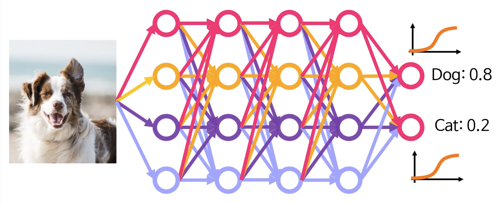

### 3.3. The drawbacks of the sigmoid function

1. **Saturation and killing gradient — the vanishing gradient**

   **The maximum gradient you get from differentiating the sigmoid is only 0.25.**

   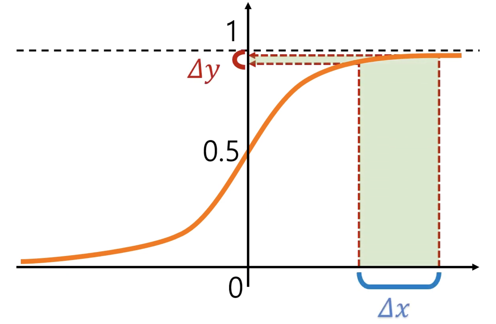

   In particular, **the gradient at both ends is close to 0**. A gradient close to 0 at the ends means that even when the input changes a lot, the output barely changes at all. This is almost the same problem we looked at with the step function: differences in the input are not effectively reflected in the output.

   The deeper the layers get, the more these small fractional values between 0 and 1 are multiplied together in a chain, until the error signal vanishes without a trace to 0 before it even reaches the earlier hidden layers. A gradient of 0 is the same thing as a weight change of 0. So training grinds to a halt part-way through.

2. **Non-zero centered**

   **The sigmoid's output is always positive (0~1)**, which constrains the weight updates. Why is that a problem?

   In a perceptron, weights are updated with the following equations.

   First we can define the loss (L) as the square of the difference between the true value and the prediction.

   $$
   L = \frac{1}{2}(y - \hat y)^2, \hat y = w \cdot x\\
   $$

   Then differentiating the loss ($L$) with respect to the weight $w$ tidies up, via the chain rule, into the following.

   $$
   \frac{\partial L}{\partial w} = \frac{\partial}{\partial w} \left[ \frac{1}{2}(y - \hat y)^2 \right]\\
   = (y - \hat y) \cdot \frac{\partial}{\partial w}(y - \hat y)\\
   = (y - \hat y) \cdot \frac{\partial}{\partial w}(y - w \cdot x)\\
   = (y - \hat y) \cdot (-x)\\
   = \text{residual} \cdot (-x)
   $$

   And when we update the weight $w$, we take the following approach, right?

   $$
   w_{n+1} = w_n - \alpha \cdot\frac{\partial L}{\partial w}  \\
   = w_n + \alpha \cdot x \cdot  \text{residual}
   $$

   So the change in the weight is proportional to the product of the input and the error.

   $$
   \Delta w \propto x \cdot \text{residual}
   $$

   Let's assume a situation where the difference between the output and the prediction — the **residual ($\text{residual}$, $y - \hat y$) is negative**. Since the input came from a sigmoid output (always positive), the input ($x$) is always positive. Here the residual ($\text{residual}$) is negative, so the signs of both weight changes $\Delta w$ for $w_1, w_2$ come out negative (-).

   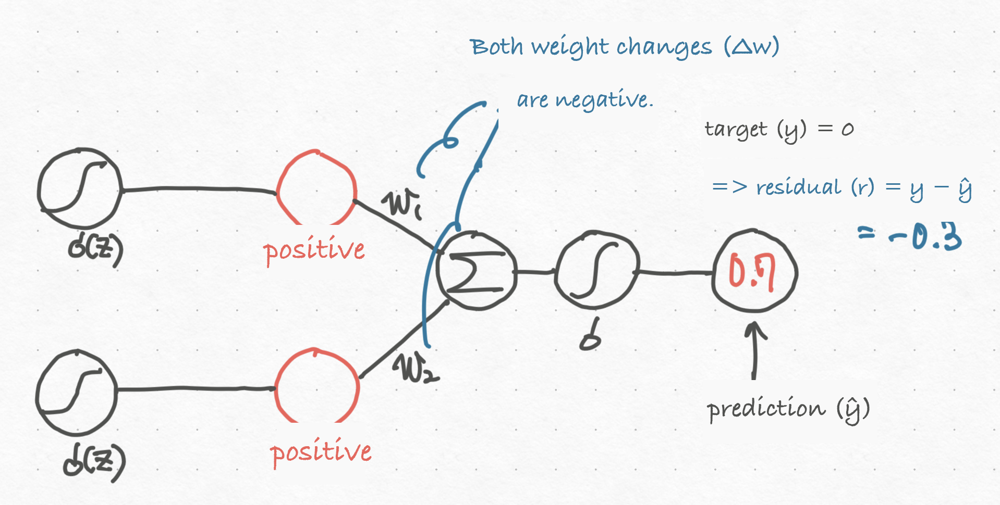

   What if the **residual ($\text{residual}$) is positive**? Likewise, since the input came from a sigmoid output (always positive), the input ($x$) is always positive. Here the residual ($\text{residual}$) is positive, so the signs of both weight changes $\Delta w$ for $w_1, w_2$ come out positive (+).

   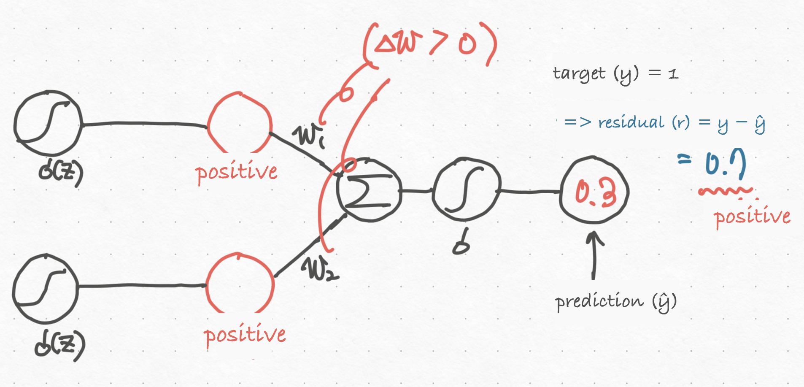

   Saying that both weight changes carry the same sign means that, on the plane whose two axes are $w_1, w_2$, **the new $w_1, w_2$ can only ever land in the first or third quadrant**.

   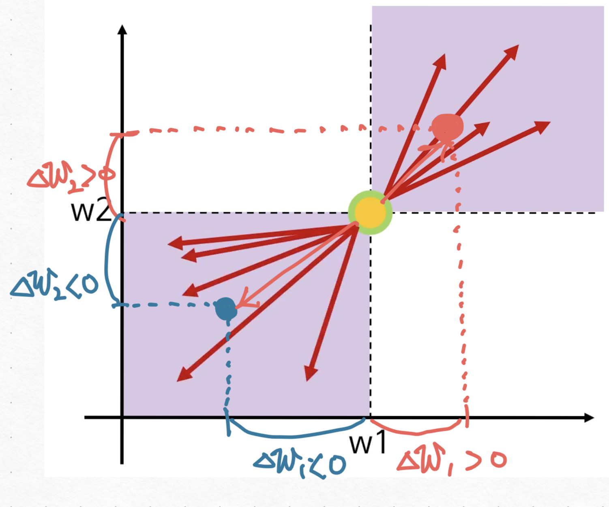

   Now suppose that on the plane whose two axes are $w_1, w_2$, the initial weight values and the optimal weight values sit as follows. The direction of learning we want is to head straight for the optimal weights, like the red dashed arrow.

   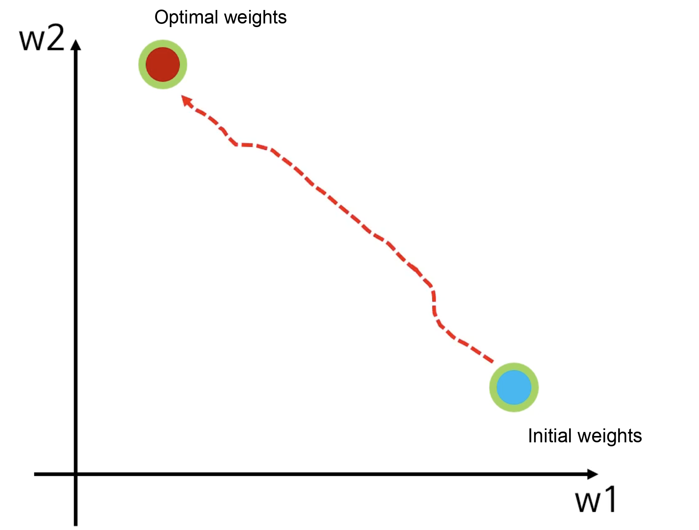

   But if we use the sigmoid as the activation function, the sign of the weight change is always the same, so — as in the left picture below — the next weights can only move into the first and third quadrants. Learning under that constraint ends up converging on the optimal weights in a **zigzag pattern**, as in the right picture. A zigzag pattern is another way of saying that **the learning process is inefficient**.

   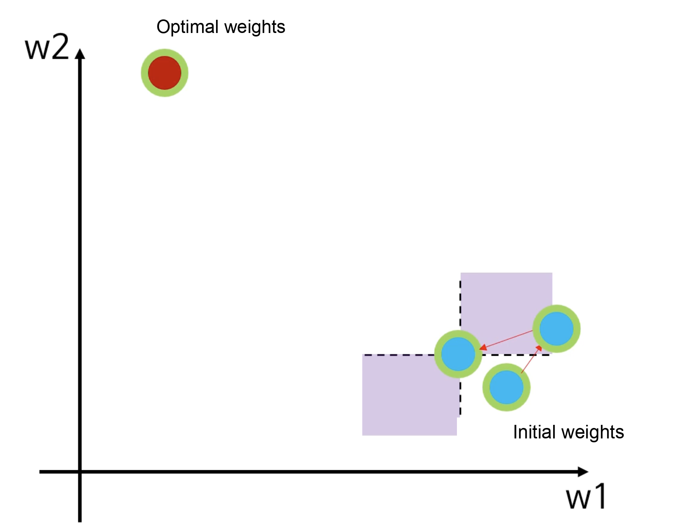

   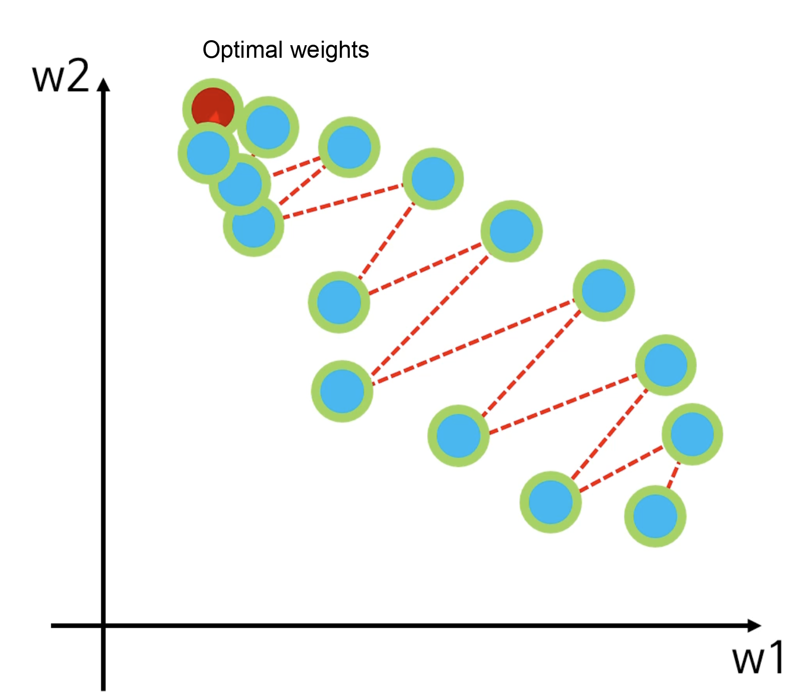

## 4. The rise of tanh and ReLU

The reason the sigmoid showed the non-zero-centered problem is that its output is always positive. To overcome that, the $tanh$ **activation function** appeared. tanh looks similar to the sigmoid, but its distinguishing feature is that it is symmetric about 0.

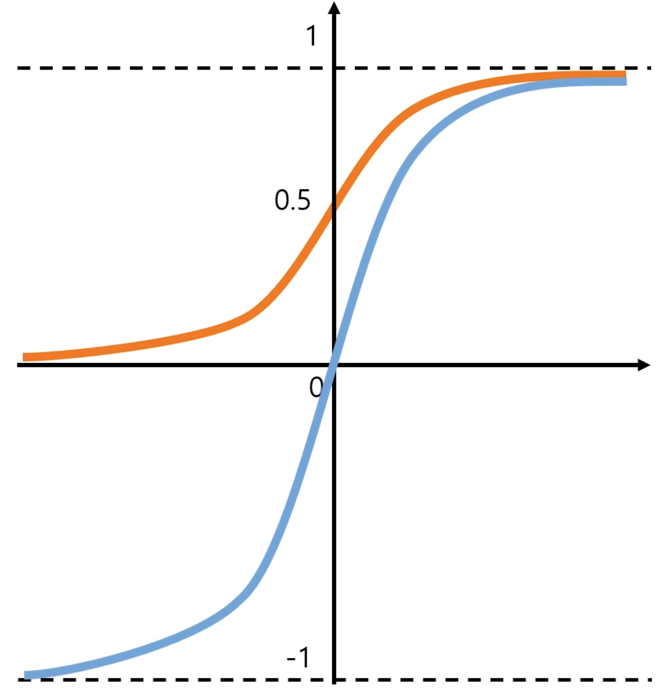

But tanh didn't solve the saturation and killing gradient issue that the sigmoid had either — because the further the input gets from 0, the more it **converges to -1 or 1**.

### 4.1. The rise of ReLU (Rectified Linear Unit)

ReLU was first published in a paper in 1969 by the Japanese computer scientist Professor Kunihiko Fukushima, but it was properly adopted into deep learning only after 2012, when **Professor Geoffrey Hinton's team** put ReLU into **AlexNet** at the image recognition competition (ILSVRC) and won by an overwhelming margin. Once it was proven that it trains 6 times faster than the existing activation functions while solving the vanishing gradient problem, it settled in as **the standard activation function** across AI worldwide.


> On the far left is Ilya Sutskever, co-founder of OpenAI — wow.<br>Front right: Geoffrey Hinton, winner of the Turing Award and the Nobel Prize in Physics — wow.

$$
f(x) = \max(0, x)
$$

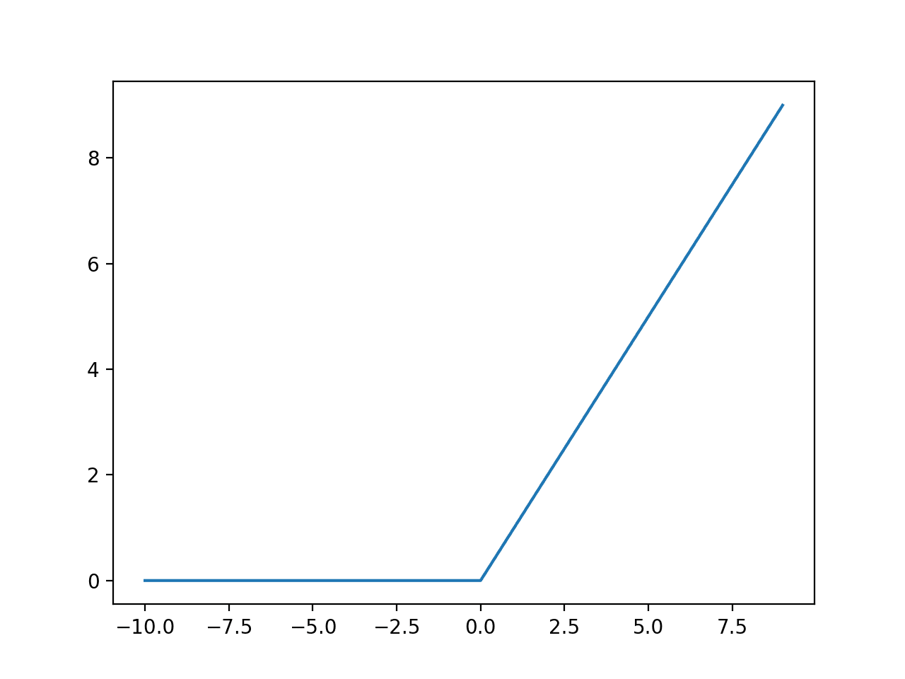

Over the positive domain the gradient is fixed at 1 ($y=x$), so there is no room for the vanishing gradient problem to occur, and learning via backpropagation became possible all the way down to the deep layers of a network.

But ReLU also had the problem that **over the negative domain the gradient dies at 0**. So variants such as **Leaky ReLU, Randomized Leaky ReLU and eLU** started to appear.

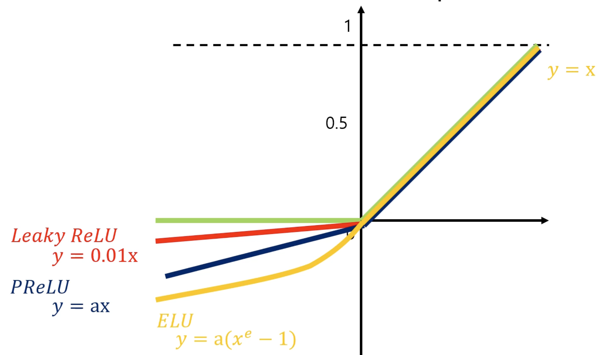

## 5. So how do you actually write the code?

### 5.1. SLP: XOR

```python
p03_x = torch.tensor([[0., 0.], [0., 1.], [1., 0.], [1., 1.]])
p03_target = torch.tensor([0, 1, 1, 0])
p03_trials = [
    ("후보 A", [1., 1.], -0.5),
    ("후보 B", [1., -1.], -0.5),
]

for label, weight, bias in p03_trials:
    p03_scores = p03_x @ torch.tensor(weight).reshape(2, 1) + bias
    p03_decisions = (p03_scores >= 0).to(torch.int64).squeeze(1)
    p03_accuracy = (p03_decisions == p03_target).float().mean().item()
    print(label, p03_decisions.tolist(), p03_accuracy)

print("확인한 후보 수:", len(p03_trials))
```

### 5.2. MLP: XOR

```python
# MLP + step function으로 XOR 풀기
p03_x = torch.tensor([[0., 0.], [0., 1.], [1., 0.], [1., 1.]])
p03_target = torch.tensor([0, 1, 1, 0])

# ==========================================
# 1. hiddne layer: 공간을 구부림
# (1,0) 또는 (0,1)이라면 그 자리에 두고, (0,0) 또는 (1,1)이라면 (0,0)으로 이동시킴.
# ==========================================
# 노드 1: (1,0) 데이터만 찾아내는 필터 (x1 - x2 >= 0.5)
node1_weight = [1., -1.]
node1_bias = -0.5

# 노드 2: (0,1) 데이터만 찾아내는 필터 (-x1 + x2 >= 0.5)
node2_weight = [-1., 1.]
node2_bias = -0.5

# 각 노드에 행렬 곱셈(@) 연산 후 계단 함수(>= 0) 적용
score1 = p03_x @ torch.tensor(node1_weight).reshape(2,1) + node1_bias # score1.shape: [4,1]
h1 = (score1 >= 0).to(torch.float32)
score2 = p03_x @ torch.tensor(node2_weight).reshape(2,1) + node2_bias
h2 = (score2 >= 0).to(torch.float32)

# 각 노드의 결과: 새로운 2차원 공간 좌표
new_space_x = torch.cat([h1, h2], dim=1)

# ==========================================
# 2. 출력층 (Output Layer): 변환된 공간에서 선 긋기
# 변환된 공간에서 두 특성(x1, x2) 중 하나라도 1이면 1
# ==========================================
# OR 게이트
final_weight = [1., 1.]
final_bias = -0.5

# 변환된 공간(new_space_x)에 최종 선형 연산 후 계단 함수 적용
final_scores = new_space_x @ torch.tensor(final_weight).reshape(2, 1) + final_bias
final_decisions = (final_scores >= 0).to(torch.int64).squeeze(1)

# ==========================================
# 3. 결과 확인
# ==========================================
final_accuracy = (final_decisions == p03_target).float().mean().item()

print("1. 원본 공간의 데이터:\n", p03_x.numpy())
print("\n2. 계단 함수를 거쳐 새롭게 재배치된 공간 (h1, h2):\n", new_space_x.numpy())
print("\n3. 최종 예측값:", final_decisions.tolist())
print(f"4. 최종 정확도: {final_accuracy * 100}%")
```

### 5.3. ReLU: XOR

```python
p04_x = torch.tensor([[0., 0.], [0., 1.], [1., 0.], [1., 1.]])
p04_target = torch.tensor([[0.], [1.], [1.], [0.]])

class P04XORMLP(nn.Module):
    def __init__(self):
        super().__init__()
        self.hidden = nn.Linear(2, 16) # 입력 데이터 차원 2, 출력 데이터 차원이 16인 선형변홤을 수행하는 Fully Connected Layer를 생성
        self.output = nn.Linear(16, 1) # 출력은 차원은 1이 되어야함. 
        self.relu = nn.ReLU() # 이렇게 간단하게 모듈을 불러올 수도 있음.

    def forward(self, value):
        hidden_value = self.hidden(value)
        # TODO 1: hidden_value에 ReLU 적용
        activated_value = self.relu(hidden_value)             # OPTION 1: nn.ReLU() 클래스 그대로 사용
        # activated_value = torch.clamp(hidden_value, 0)          # OPTION 2: clamp() 함수를 쓸 수도 있음. 0보다 작은 값은 전부 0으로 잘라버림. 
        # activated_value = hidden_value * (hidden_value >= 0)    # OPTION 3: 논리연산 값을 원래 값에 곱해버리면 음수는 0이 곱해져서 0이 되어버림.
        return self.output(activated_value)

p04_ready = True  # TODO 2: forward 수정 뒤 True
if p04_ready:
    torch.manual_seed(42)
    p04_model = P04XORMLP()
    for _ in range(500):
        p04_output = p04_model(p04_x)
        p04_loss = ((p04_output - p04_target) ** 2).mean()
        p04_loss.backward()
        with torch.no_grad():
            for parameter in p04_model.parameters():
                parameter -= 0.1 * parameter.grad
                parameter.grad.zero_()
    with torch.no_grad():
        p04_output = p04_model(p04_x)
        p04_loss = ((p04_output - p04_target) ** 2).mean()
        p04_decisions = (p04_output >= 0.5).to(torch.int64).squeeze(1)
    print("target shape:", tuple(p04_target.shape))
    print("decisions:", p04_decisions.tolist())
    print("MSE:", f"{p04_loss.item():.10f}")
else:
    print("forward에 ReLU를 넣고 p04_ready를 True로 바꾸면 준비된 loop가 실행됨")
```

## 📚 References

- [\[Neural Network 5\] The limits of the perceptron and the rise of multi-layer networks](https://www.youtube.com/watch?v=vLKkTlPW1S4&list=LL&index=2)
- [\[Neural Network 6\] The sigmoid activation function](https://www.youtube.com/watch?v=WNxCenKxkXI)
- [\[Neural Network 7\] The activation function family](https://www.youtube.com/watch?v=iICZlmAhnf0)
- [\[Deep learning\] Lecture 3-1. The perceptron and the MLP](https://www.youtube.com/watch?v=sDkFJD3UQyY)
- [Python PyTorch course: Lecture 14 - the Perceptron](https://076923.github.io/posts/Python-pytorch-14/)