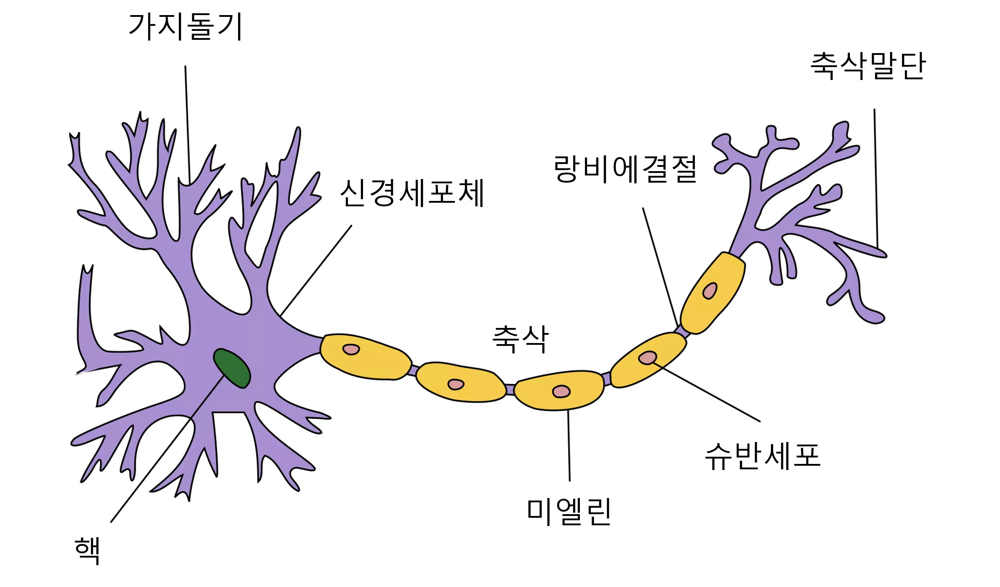
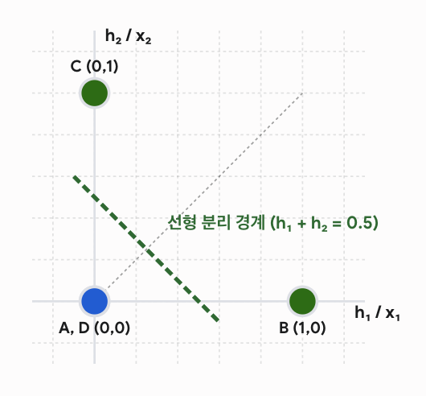
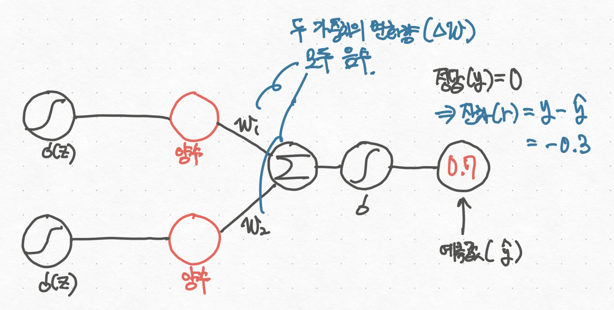
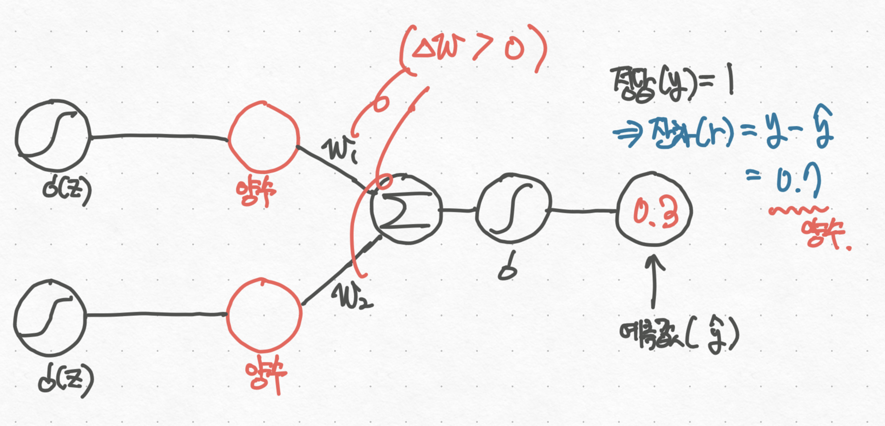
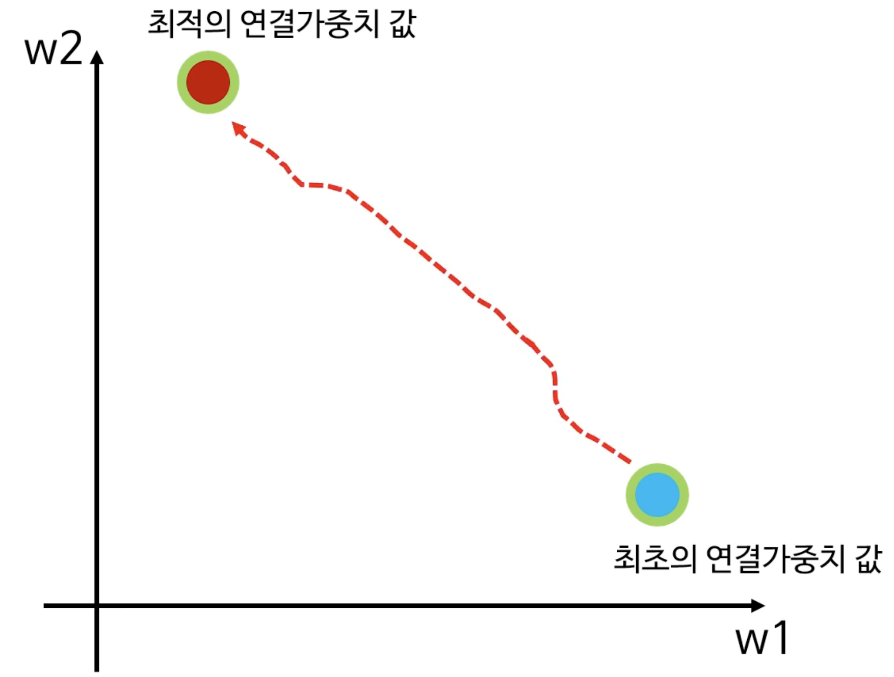
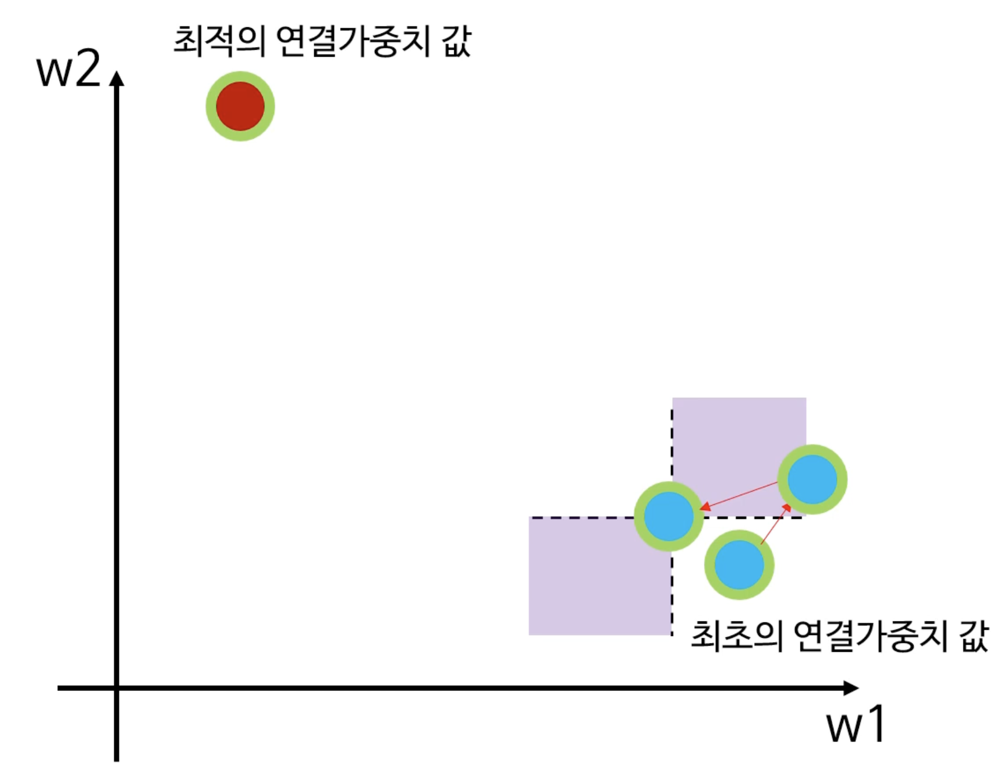
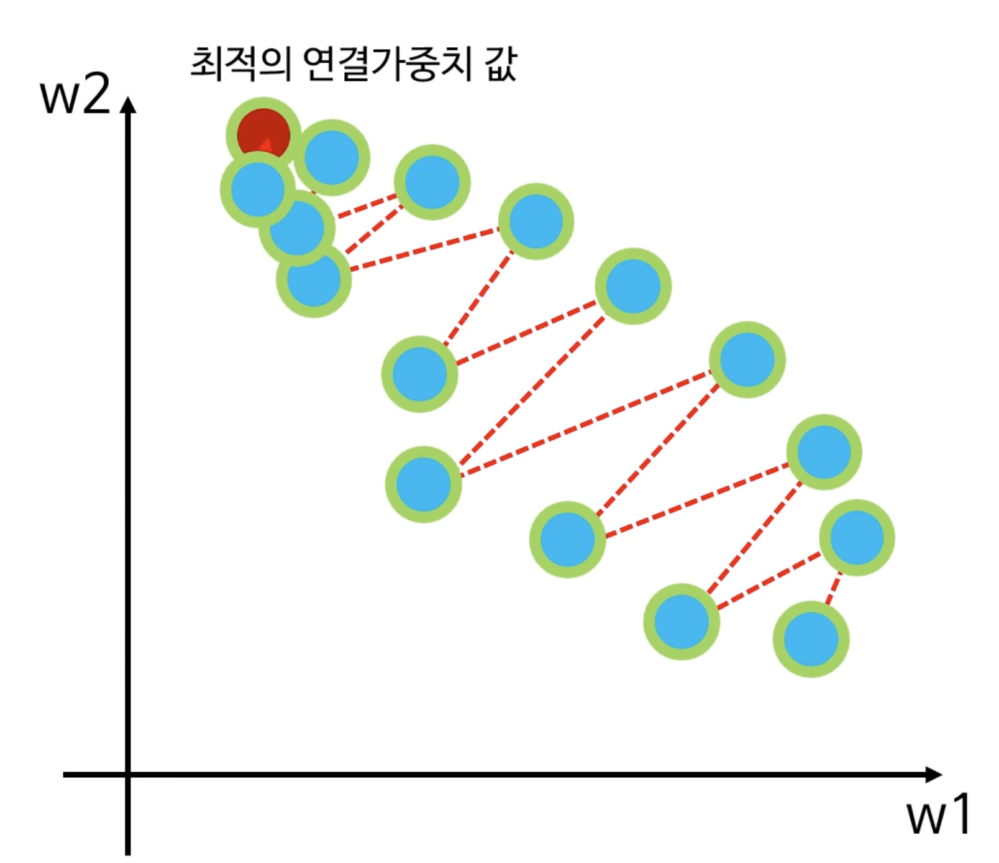

> 📌 **총정리**
>
> 1. **퍼셉트론**은 뉴런을 본딴 모양으로, 입력값에 가중치를 곱하고 편향을 더한 후, 활성화함수를 씌워서 출력을 내놓는다.
> 2. 단층 퍼셉트론으로는 **선형분리불가능**한 문제를 풀지 못한다.
> 3. **다층 퍼셉트론과 비선형 활성화함수**를 사용하면 공간을 구부릴 수 있고, 선형분리불가능한 문제를 풀 수 있다.
> 4. 비선형 활성화함수는 계단함수 → 시그모이드 함수 → **ReLU 함수**로 발전해왔다.

## 1. 퍼셉트론이란?

### 1.1. 단층 퍼셉트론(Single Layer Perceptron)의 소개

> 📌 **한 줄 요약**
>
> 퍼셉트론은 입력에 대해 가중치를 곱하고, 편향을 더한 후 활성화함수를 씌워서 출력을 낸다.

퍼셉트론(Perceptron)은, 인간의 신경세포(Neuron)과 유사하게 디자인된 인공 신경망의 한 종류입니다.



생물학적 관점에서, 가지돌기는 **외부의 자극을 수용**하고, 신경세포체에서 그 신호를 **증폭**하고, 그 증폭된 신호는 축삭을 통해 **다른 신경세포로 전달**됩니다. 퍼셉트론도 뉴런과 아주 유사합니다.


위 사진은 <strong>단층 퍼셉트론(Single Layer Perceptron)</strong>을 그림으로 표현한 것입니다. 단층 퍼셉트론은 주어진 **입력 데이터** $x_i$에 대해서 **가중치** $w_i$를 곱한 후, **편향(bias)** $b$를 더합니다. 그 후 적절한 <strong>활성화 함수(Activation Function)</strong>을 취해 **출력값(Output)** $\hat y$을 내뿜는 형태입니다. 수식으로 나타내면 다음과 같습니다.

$$
\hat y = f(W\cdot X + b)\\ = f(\begin{bmatrix} w_1 & w_2 & \dots & w_n \end{bmatrix}
\begin{bmatrix} x_1 \\ x_2 \\ \vdots \\ x_n \end{bmatrix} + b)\\= f(w_1 x_1 + w_2 x_2 + \dots + w_n x_n + b)
$$

## 2. 선형 결정경계(Linear Decision Boundary)의 한계

### 2.1. 단층 퍼셉트론이 풀 수 있는 문제

<strong>단층 퍼셉트론(Single Layer Perceptron)</strong>은 `AND`, `OR` 게이트와 같은 구조를 갖는 모델은 쉽게 구현할 수 있습니다. 즉, 어떤 입력 $X(x_1,x_2)$가 주어졌을 때, 그 결과가 $1$이냐 $0$이냐를 쉽게 구분할 수 있다는 것이죠. 이런 문제의 특징은 0과 1을 구분하는 경계, 즉 **결정 경계**가 선형이라는 것입니다. 이를 <strong>선형 분리 가능(Linearly Seperable)</strong>하다고 합니다.


`AND`와 `OR` 그래프에서 빨간 점들과 파란 점의 경계를 노란색 선으로 그어서 표현할 수 있습니다.


이 노란 선은 어떤 과정을 거쳐서 나온 걸까요? 아래의 퍼셉트론을 한번 살펴봅시다.


> **참고:** 좌측 상단의 1은 상수 입력이고, 곧 $bias$입니다.

우선 `AND` 게이트부터 어떻게 선형 결정경계가 생기는 지 확인해보겠습니다.

$$
step(z) = \begin{cases} 1 & \text{if } 0 \le z \\ 0 & \text{if } z < 0 \end{cases}
$$

$$
\hat y = step(\begin{bmatrix} 1, 1 \end{bmatrix} \begin{bmatrix} x_1 \\ x_2 \end{bmatrix} - 1.5) \\ = step(w_1 x_1 + w_2 x_2 - 1.5)\\where \{ x \mid x \in (0, 1)\}
$$

> $x_i$는 0 또는 1밖에 들어오지 못합니다.

1. $x_1 = 0, x_2 = 0$ 인 경우

   $$
   w_1 x_1 + w_2 x_2 - 1.5 = 0 + 0 - 1.5 = -1.5 \\ step(-1.5) = 0
   $$

   *<strong>→ 0 AND 0 = 0*</strong>입니다.

2. $x_1 = 1, x_2 = 0$ 인 경우

   $$
   w_1 x_1 + w_2 x_2 - 1.5 \\= 1 + 0 - 1.5 \\= -0.5 \\ step(-0.5) = 0
   $$

   *<strong>→ 1 AND 0 = 0*</strong>입니다.

3. $x_1 = 0, x_2 = 1$ 인 경우

   $$
   w_1 x_1 + w_2 x_2 - 1.5 \\= 0 + 1 - 1.5 \\= -0.5 \\ step(-0.5) = 0
   $$

   *<strong>→ 0 AND 1 = 0*</strong>입니다.

4. $x_1 = 1, x_2 = 1$ 인 경우

   $$
   w_1 x_1 + w_2 x_2 - 1.5 \\= 1 + 1 - 1.5 \\= 0.5 \\ step(0.5) = 1
   $$

   *<strong>→ 1 AND 1 = 1*</strong>입니다.

따라서 **입력값** $x_1, x_2$ 각각에 대해 1만큼 **가중치**를 두고, 그 가중치 합(Weighted Sum)과 1.5를 비교했을 때, 1.5 **이상**이면 1이고 **미만**이면 0이라고 판단하는 하나의 **규칙**을 세울 수 있다는 것입니다.

이 때 이 **가중치**를 벡터로 표현하면 $W = [w_1, w_2] = [1, 1]$로 표현되는 것입니다. 그리고 **임계값 -1.5**는 편향<strong>(bias)</strong>인 것이죠.

그리고 이것을 식으로 표현하면 위에서 확인한 수식이 되는 거죠.

$$
\hat y = step(\begin{bmatrix} 1, 1 \end{bmatrix} \begin{bmatrix} x_1 \\ x_2 \end{bmatrix} - 1.5)
$$

그리고 이걸 평면 상에 그려보면 다음과 같이 그릴 수 있는 것입니다.


> 💡 `OR` 게이트도 마찬가지로 풀 수 있습니다. `OR` 게이트는 굳이 짚고 넘어가지 않겠습니다.

따라서 퍼셉트론은 선형분리 가능한(Linearly Separable) 데이터를 분류해내는 <strong>선형 분류기(Linear Classifier)</strong>라고 볼 수 있습니다.


단순히 AND, OR 뿐만 아니라, 선 하나로 분류할 수 있는 데이터셋이기만 한다면, 퍼셉트론은 학습을 통해서 **가중치와 편향을 조정**해가며 데이터를 잘 분류해낼 수 있습니다.

> 🙋 **왜 활성화함수로 비선형 함수를 쓰는데 결정경계가 선형이 되는건가요?**
>
> 단층 퍼셉트론의 전체 계산 과정은 다음과 같이 두 단계로 나뉩니다.<br>1. 선형 결합: $z = w_1x_1 + w_2x_2 + b$<br>2. 활성화 함수 통과: $\hat y = f(z)$
>
> 데이터를 분류하기 위해서는 입력 공간 $(x_1, x_2)$을 둘로 나누는 기준점, 즉 결정 경계(Decision Boundary)가 어디에 생기는지 확인해야 합니다.
>
> 만약 활성화 함수로 비선형 함수인 시그모이드(Sigmoid)를 사용한다고 가정해 보겠습니다. 우리는 최종 예측 확률 $\hat y$가 0.5 이상이면 클래스 1, 미만이면 클래스 0으로 분류합니다. 즉, 이 모델의 결정 경계는 $f(z) = 0.5$가 되는 지점입니다.
>
> 시그모이드 함수에서 결과값이 0.5가 되려면, 함수 안으로 들어가는 입력값 $z$는 반드시 0이어야 합니다. 따라서 이 모델의 결정 경계를 구하는 식은 최종적으로 $w_1x_1 + w_2x_2 + b = 0$ 이 됩니다.
>
> 계단 함수를 쓰든, ReLU를 쓰든 결과는 동일합니다. 단일 퍼셉트론은 입력 공간 위에 무조건 $z$**라는 반듯한 1차 방정식(직선)을 하나 그어놓은 상태에서**, 그 직선을 기준으로 나온 점수에 비선형적인 포장(0과 1로 극단적으로 쪼개거나 부드러운 확률로 압축하는 등)을 덧씌울 뿐입니다.
>
> 따라서 단층 퍼셉트론은 **아무리 강력한 비선형 활성화 함수를 출력단에 달아주더라도 결정 경계는 무조건 직선 하나로 고정되며, 선형 분리 불가능한 XOR 문제는 풀 수 없습니다.** 공간을 구부리려면 직선(노드)을 2개 이상 배치하는 은닉층이 반드시 필요합니다.

### 2.2. 단층 퍼셉트론이 풀 수 없는 문제

단층 퍼셉트론은 선형 분류기(Linear Classifier)로서 데이터를 분류할 수 있지만, 아래와 같은 데이터는 어떨까요? 이렇게 선형분리가 불가능한 데이터셋을 단층 퍼셉트론이 학습할 수 있을까요?


마빈 민스키(Marvin Minsky)는 단일 퍼셉트론의 치명적인 한계를 수학적으로 증명합니다. 바로 **XOR(배타적 논리합)** 문제입니다. XOR 데이터는 (0,0)과 (1,1)이 같은 클래스이고, (0,1)과 (1,0)이 같은 클래스로 **대각선으로 엇갈려 배치**되어 있습니다.

2차원 평면에 직선 하나를 어떻게 그어도 이 점들을 완벽하게 나눌 수 없습니다. 이것이 바로 <strong>선형 분리 불가능(Linearly Non-separable)</strong>한 문제입니다.


위와 같은 평면상에 어떤 직선을 그어야 빨간 점과 파란 점을 완벽히 분리할 수 있을까요?


제가 임의로 그려본 노란 선 중 그 어떤 것도 빨간 점과 파란 점을 완벽히 분리해내지 못하고 있습니다. 이를 코드로 한번 확인해보겠습니다.

```python
import torch

p03_x = torch.tensor([[0., 0.], [0., 1.], [1., 0.], [1., 1.]])
p03_target = torch.tensor([0, 1, 1, 0])
p03_trials = [
    ("후보 A", [1., 1.], -0.5),
    ("후보 B", [1., -1.], -0.5),
]

for label, weight, bias in p03_trials:
    p03_scores = p03_x @ torch.tensor(weight).reshape(2, 1) + bias
    p03_decisions = (p03_scores >= 0).to(torch.int64).squeeze(1)
    p03_accuracy = (p03_decisions == p03_target).float().mean().item()
    print(label, p03_decisions.tolist(), p03_accuracy)

print("확인한 후보 수:", len(p03_trials))
```

> 후보 A \[0, 1, 1, 1\] 0.75<br>후보 B \[0, 0, 1, 0\] 0.75<br>확인한 후보 수: 2

후보를 100개를 만들어서 돌려보아도, 이 코드 구조(단일 선형 방정식)로는 **정확도 1.0(100%)이 나오는 직선을 절대 찾을 수 없습니다.**

## 3. MLP와 비선형함수의 등장

단일 직선으로 풀 수 없다면 어떻게 해야 할까요? **직선을 여러 개 긋고 그 결과들을 종합**하면 어떨까요?


선을 4개 그어봤습니다. 그 결과 4개의 퍼셉트론이 생겼습니다. 그리고 이 4개의 출력을 다시 입력으로 받는 또다른 퍼셉트론을 연결하면 이 데이터셋을 비선형으로 분리할 수 있는 신경망이 되는 것입니다.

이것이 바로 <strong>다층 퍼셉트론(Multi-Layer Perceptron, MLP)</strong>의 등장 배경입니다. 이렇게 MLP는 하나의 **입력층**과, 하나 이상의 **은닉층(Hidden Layer)**, 그리고 **출력층**으로 구성되어 입력 데이터를 **새로운 공간으로 변환**하는 것입니다. 이 은닉층이 많으면 많을 수록, 더 복잡한 데이터를 분류할 수 있게 되고, 은닉층이 무수히 많다면 <strong>심층 신경망(DNN, Deep Neural Network)</strong>가 되는 것입니다.


이 과정에서 층을 단순히 겹치기만 하면 수학적으로 여전히 하나의 선형 방정식으로 붕괴해버립니다. 따라서 층과 층 사이에는 반드시 <strong>비선형 활성화 함수(Activation Function)</strong>가 필요합니다.

이제 아까의 `XOR` 문제로 넘어가보겠습니다. **MLP**와 **비선형 활성화함수**로 `XOR` 문제를 어떻게 풀 수 있을까요?


저희는 위에서 직선 하나로는 XOR을 구현할 수 없다는 것을 깨달았습니다. 그래서 평면에 직선 두 개, $l_1, l_2$를 그었습니다. 이렇게 직선을 그었다면 다음과 같이 XOR을 분류해볼 수 있겠네요.

$$
\begin{cases} \text{파란색} & \text{if }(l_1 \ge 0 \text{ and } l_2 \le 0) \text{ or } (l_1 \le 0 \text{ and } l_2 \ge 0) \\\text{빨간색} & \text{if } (l_1 \le 0 \text{ and } l_2 \le 0) \text{ or } (l_1 \ge 0 \text{ and } l_2 \ge 0) \end{cases}
$$

이제 이걸 MLP로 옮기면 어떤 모양이 될까요?


어떤 벡터 입력 $[x_1, x_2]$가 들어왔을 때, $weight$와 $bias$를 각각 잘 부여하면 $l_1$과 $l_2$라는 직선을 그릴 수 있을 것입니다. 지금은 값을 잘 부여해서 위의 노란 직선 $l_1$과 $l_2$를 잘 그린 상황이라고 가정해보겠습니다.

1. **입력층**

   입력 벡터 $[x_1, x_2]$가 들어오는 노드입니다. 이곳에서는 가중치 연산이나 활성화 함수가 적용되지 않습니다.

2. **첫 번째 은닉층**

   가중치와 편향 연산을 통해서 $l_1$과 $l_2$ 직선이 그어졌고, 계단함수를 적용해 데이터가 직선 위인지 아래인지를 판별합니다.

3. **두 번째 은닉층**

   - 민트색 선을 볼게요. $l_1$보다 아래(-1)에 있고(`AND`) $l_2$보다 위(+1)에 있는 구역이 그 다음 은닉층의 입력이 됩니다.
   - 이제 보라색 선을 볼게요. $l_1$보다 위(+1)에 있고(`AND`) $l_2$보다 아래(-1)에 있는 구역이 그 다음 은닉층의 입력이 됩니다.

4. **출력층**

   이제 앞선 AND 연산의 결과들을 모아 최종적으로 OR 연산을 수행하고, 모델의 최종 결론(1 또는 0)을 출력합니다.

   - $l_1$보다 아래에 있고, $l_2$보다 위에 있거나(`OR`), $l_1$보다 위에 있고, $l_2$보다 아래에 있는 구역에는 **파란색** 점이 있습니다.

어떤가요? **다층 퍼셉트론과 비선형 활성화함수**를 쓰니 XOR 문제를 풀 수 있습니다!

> 💡 **사실, 은닉층과 비선형 활성화함수는 직선의 결정경계를 구불구불 구부리는 게 아니라, 데이터가 놓인 좌표 공간 자체를 구부리고 재배치(Space Transformation)합니다.**
>
> 이 공간 변환의 원리를 XOR을 푸는 계단 함수(Step Function) 수식으로 확인해 보겠습니다. 은닉층에 두 개의 노드 $h_1$, $h_2$를 두고, 0보다 크면 1, 아니면 0을 반환하는 계단 함수를 활성화 함수로 사용합니다.
>
> - $h_1 = \text{step}(x_1 - x_2 - 0.5)$
> - $h_2 = \text{step}(x_2 - x_1 - 0.5)$
>
> 원본 공간 $(x_1, x_2)$에 있던 4개의 점은 이 은닉층을 통과하며 새로운 좌표계 $(h_1, h_2)$로 강제 이동(변환)됩니다.
>
> - (0,0) 점 $\rightarrow$ $h_1=0, h_2=0$ 이므로 **새로운 좌표 (0,0)**
> - (1,1) 점 $\rightarrow$ $h_1=0, h_2=0$ 이므로 **새로운 좌표 (0,0)**
> - (1,0) 점 $\rightarrow$ $h_1=1, h_2=0$ 이므로 **새로운 좌표 (1,0)**
> - (0,1) 점 $\rightarrow$ $h_1=0, h_2=1$ 이므로 **새로운 좌표 (0,1)**
>
> 결과적으로 대각선으로 멀리 떨어져 있던 클래스 0의 두 점 (0,0)과 (1,1)이 새로운 공간에서는 완벽하게 **(0,0)이라는 하나의 점으로 포개어졌습니다.**
>
> 엇갈려 있던 데이터 공간이 변형되면서, 이제 최종 출력층은 $y = \text{step}(h_1 + h_2 - 0.5)$ 라는 아주 단순한 직선 하나만 그어도 데이터를 100% 분리해 낼 수 있게 됩니다.
>
> 
>
> 
>
> <details>
> <summary>👨‍💻 <b>코드</b></summary>
>
> ```python
> # MLP + step function으로 XOR 풀기
> p03_x = torch.tensor([[0., 0.], [0., 1.], [1., 0.], [1., 1.]])
> p03_target = torch.tensor([0, 1, 1, 0])
>
> # ==========================================
> # 1. hiddne layer: 공간을 구부림
> # (1,0) 또는 (0,1)이라면 그 자리에 두고, (0,0) 또는 (1,1)이라면 (0,0)으로 이동시킴.
> # ==========================================
> # 노드 1: (1,0) 데이터만 찾아내는 필터 (x1 - x2 >= 0.5)
> node1_weight = [1., -1.]
> node1_bias = -0.5
>
> # 노드 2: (0,1) 데이터만 찾아내는 필터 (-x1 + x2 >= 0.5)
> node2_weight = [-1., 1.]
> node2_bias = -0.5
>
> # 각 노드에 행렬 곱셈(@) 연산 후 계단 함수(>= 0) 적용
> score1 = p03_x @ torch.tensor(node1_weight).reshape(2,1) + node1_bias # score1.shape: [4,1]
> h1 = (score1 >= 0).to(torch.float32)
> score2 = p03_x @ torch.tensor(node2_weight).reshape(2,1) + node2_bias
> h2 = (score2 >= 0).to(torch.float32)
>
> # 각 노드의 결과: 새로운 2차원 공간 좌표
> new_space_x = torch.cat([h1, h2], dim=1)
>
> # ==========================================
> # 2. 출력층 (Output Layer): 변환된 공간에서 선 긋기
> # 변환된 공간에서 두 특성(x1, x2) 중 하나라도 1이면 1
> # ==========================================
> # OR 게이트
> final_weight = [1., 1.]
> final_bias = -0.5
>
> # 변환된 공간(new_space_x)에 최종 선형 연산 후 계단 함수 적용
> final_scores = new_space_x @ torch.tensor(final_weight).reshape(2, 1) + final_bias
> final_decisions = (final_scores >= 0).to(torch.int64).squeeze(1)
>
> # ==========================================
> # 3. 결과 확인
> # ==========================================
> final_accuracy = (final_decisions == p03_target).float().mean().item()
>
> print("1. 원본 공간의 데이터:\n", p03_x.numpy())
> print("\n2. 계단 함수를 거쳐 새롭게 재배치된 공간 (h1, h2):\n", new_space_x.numpy())
> print("\n3. 최종 예측값:", final_decisions.tolist())
> print(f"4. 최종 정확도: {final_accuracy * 100}%")
> ```
>
> ```text
> 1. 원본 공간의 데이터:
>  [[0. 0.]
>  [0. 1.]
>  [1. 0.]
>  [1. 1.]]
>
> 2. 계단 함수를 거쳐 새롭게 재배치된 공간 (h1, h2):
>  [[0. 0.]
>  [0. 1.]
>  [1. 0.]
>  [0. 0.]]
>
> 3. 최종 예측값: [0, 1, 1, 0]
> 4. 최종 정확도: 100.0%
> ```
>
> </details>

### 3.1. 계단함수의 약점

`XOR` 문제는 매우 단순한 문제라서 **사람이 직접 손으로** 가중치와 편향을 넣어서 직선을 구해놓을 수 있습니다. 그리고 `AND` 게이트와 `OR` 게이트를 조합하여 문제를 해결할 수 있죠. `XOR` 게이트는 `NOT`, `AND`와 `OR`을 적절히 결합해서 구현할 수 있기 때문입니다.


**하지만 XOR문제가 아닌 아주 복잡한 문제는 사람이 직접 가중치와 편향을 넣어서 풀 수 없겠죠.** 그래서 가중치와 편향을 계산하기 위해선 <strong>역전파(BackPropagation)</strong>과 <strong>경사하강법(Gradient Descent)</strong>를 수행해 적절한 값을 저절로 찾아나가야 할 필요가 있었습니다.


하지만 머신러닝 초기에 사용한 계단함수는 이런 필요성을 만족시키지 못했습니다.

- **오차의 획일화**

  위 계단함수에서는 퍼셉트론의 계산값이 -100이든, -0.1이든, -0.000001이든 상관없이 **출력값은 0**이 됩니다. 역치 이하의 자극이기 때문이죠.

  -0.0000001은 -100보다는 훨씬 더 잘 예측한 것인데, 그런 **내부적인 차이는 무시한 채 똑같은 오차**를 만들어버린다는 문제점이 있는 겁니다.

  > 이건 마치 성격이 아주 더러운 교수님이 0점은 맞은 학생이나 59점을 만은 학생이나 똑같이 F를 주는 것과 마찬가지입니다.

- **미분 불가능**

  계단함수는 0인 지점에서 미분이 불가능하고 그 외의 모든 구간에서는 기울기가 0이 되므로, 오차 신호가 전달되지 않아 학습이 완전히 멈춰버립니다.

### 3.2. 시그모이드 함수의 등장

계단함수의 이런 문제를 해결하기 위해 다음과 같은 **형태**의 함수가 필요해졌습니다.


이런 형태의 활성화 함수 중 대표적인 것이 **시그모이드 함수**입니다.


- **미분 가능(differentiable)**

  MLP, 특히 DNN에서는 오류를 최소화하기 위해서 역전파(backpropagation)을 활용합니다. 역전파는 경사하강법(gradient descendant)를 이용하는데, 이를 위해서는 미분가능성이 필수 조건입니다.

- **내부값의 차이를 표현 가능**

  이전 계단함수에서는 표현할 수 없었던 내부값의 차이를 표현할 수 있습니다. 계단함수에서는 내부값(x값)이 달라져도 특정 역치(ex: 0) 이하였다면 출력값을 0으로 퉁쳤습니다.

  하지만 시그모이드 함수는 내부값이 커짐에 따라서 출력값도 0과 1 사이의 값을 출력합니다. 따라서 0과 1로만 출력값을 갖는 계단함수에 비해 훨씬 다양한 오차를 계산할 수 있게 되었습니다.

- **확률의 표현**

  출력값을 0과 1 사이로 내뿜기 때문에, 내부값을 확률로 변환해주는 의미로 해석할 수 있습니다. 신경망의 출력을 단순한 숫자가 아니라, 어떤 **의미**를 갖는 숫자로 해석할 수 있다는 것이 가장 큽니다.

  > 예를 들어, 단순히 발사이즈가 270이라고 하면 그게 큰 건지 안 큰 건 지 알 수 없습니다. 하지만 한국 기준 상위 70%라는 사실을 알게 되면, 이 단순한 숫자가 의미를 갖게 됩니다.

  따라서 신경망의 출력을 0과 1 사이의 확률로 표현하는 것이 데이터의 참 의미를 더 잘 표현할 수 있게 되는 것입니다.

  

### 3.3. 시그모이드 함수의 단점

1. **saturation and killing gradient, 기울기 소실(Vanishing Gradient)**

   시그모이드 함수를 미분했을 때 나오는 **기울기의 최대값은 0.25에 불과**합니다.

   

   특히 **양 끝쪽의 기울기가 0**에 가깝습니다. 양 끝쪽의 기울기가 0에 가깝다는 것은, 입력값의 차이가 커져도 출력값의 차이는 미미하다는 것입니다. 이는 우리가 계단함수에서 살펴봤던 문제와 거의 비슷합니다. 즉, 입력값의 차이가 출력값에 효과적으로 반영되지 않는 다는 점입니다.

   층이 깊어질수록 0과 1 사이의 작은 소수점 값들이 연쇄적으로 곱해지면서, 오차 신호가 앞쪽 은닉층으로 전달되기도 전에 0으로 흔적도 없이 사라져 버립니다. 기울기가 0이 된다는 것은, 가중치의 변화량이 0이 된다는 것과 마찬가지입니다. 따라서 훈련이 도중에 멈춰버리는 현상이 발생합니다.

2. **Non-zero Centered**

   <strong>시그모이드의 출력값은 항상 양수(0~1)</strong>라서 가중치 갱신에 제약이 생깁니다. 이게 왜 문제가 될까요?

   퍼셉트론에서 가중치의 갱신은 다음과 같은 식으로 이루어집니다.

   우선 손실(L)을 실제값과 예측값 차의 제곱으로 정의할 수 있습니다.

   $$
   L = \frac{1}{2}(y - \hat y)^2, \hat y = w \cdot x\\
   $$

   그러면 손실($L$)을 가중치 $w$에 대해 미분하면 chain rule을 통해 다음과 같이 정리될 수 있습니다.

   $$
   \frac{\partial L}{\partial w} = \frac{\partial}{\partial w} \left[ \frac{1}{2}(y - \hat y)^2 \right]\\
   = (y - \hat y) \cdot \frac{\partial}{\partial w}(y - \hat y)\\
   = (y - \hat y) \cdot \frac{\partial}{\partial w}(y - w \cdot x)\\
   = (y - \hat y) \cdot (-x)\\
   = \text{residual} \cdot (-x)
   $$

   우리가 가중치 $w$를 갱신할 때는 다음과 같은 접근을 취하죠?

   $$
   w_{n+1} = w_n - \alpha \cdot\frac{\partial L}{\partial w}  \\
   = w_n + \alpha \cdot x \cdot  \text{residual}
   $$

   따라서, 가중치의 변화량은 입력값과 오차의 곱에 비례한다고 볼 수 있습니다.

   $$
   \Delta w \propto x \cdot \text{residual}
   $$

   출력값과 예측값의 차이, 즉 **잔차($\text{residual}$, $y - \hat y$)가 음수**인 상황을 가정해보겠습니다. 시그모이드의 출력(항상 양수)를 입력으로 받았으므로, 입력값($x$)은 항상 양수입니다. 이 때, 잔차($\text{residual}$)는 음수이므로, 두 가중치 $w_1, w_2$ 변화량 $\Delta w$의 부호는 모두 음수(-)가 됩니다.

   

   만약 **잔차($\text{residual}$)가 양수**라면 어떻게 될까요? 마찬가지로, 시그모이드의 출력(항상 양수)를 입력으로 받았으므로, 입력값($x$)은 항상 양수입니다. 이 때, 잔차($\text{residual}$)는 양수이므로, 두 가중치 $w_1, w_2$ 변화량 $\Delta w$의 부호는 모두 양수(+)가 됩니다.

   

   두 가중치의 변화량이 같은 부호를 가진다는 말은,  $w_1, w_2$ 를 두 축으로 하는 평면에서, **새로운 $w_1, w_2$ 는 1사분면, 3사분면에만 위치할 수 있다**는 뜻입니다.

   

   그러면 $w_1, w_2$ 를 두 축으로 하는 평면에서, 다음과 같이 최초의 가중치 값과, 최적의 가중치 값이 놓여있다고 가정해보겠습니다. 우리가 원하는 학습의 방향은, 빨간색 점선 화살표와 같이 최적의 가중치로 빠르게 가는 것입니다.

   

   하지만 시그모이드 함수를 활성화함수로 쓰면, 가중치 변화량의 부호가 항상 같기 때문에 아래 왼쪽 그림과 같이 그 다음 가중치가 1사분면과 3사분면으로밖에 이동하지 못하게 됩니다. 이런 제약 위에서 학습을 하면 최종적으로는 오른쪽 그림과 같이 **지그재그 패턴**을 보이면서 최적의 가중치로 수렴하게 됩니다. 지그재그 패턴은 **학습 과정의 능률이 떨어진다**는 말과 같습니다.

   

   

## 4. tanh, ReLU함수의 등장

시그모이드 함수가 non-zero centered 문제를 보인 이유는, 출력이 항상 양수이기 때문입니다. 이런 점을 극복하고자 $tanh$ **활성화함수**가 등장했습니다. tanh 함수는 시그모이드와 유사하게 생겼지만 0을 기준으로 대칭이라는 점이 특징입니다.


하지만 tanh 함수도 시그모이드 함수가 가지고 있던 saturation and killing gradient 이슈를 해결하지는 못했습니다. 입력값이 0을 기준으로 멀어지면 멀어질 수록 **-1 또는 1에 수렴**하기 때문이죠.

### 4.1. ReLU(Rectified Linear Unit)함수의 등장

ReLU 함수는 1969년에 일본의 컴퓨터 과학자 후쿠시마 쿠니히코 교수가 처음 논문에서 발표했으나, 본격적으로 딥러닝에 도입된 것은 2012년 **제프리 힌튼(Geoffrey Hinton) 교수 팀**이 이미지 인식 경진대회(ILSVRC)에서 <strong>알렉스넷(AlexNet)</strong>에 ReLU를 탑재하고 압도적 우승을 자치한 이후입니다. 기존 활성화 함수보다 학습 속도가 6배나 빠르면서 기울기 소실 문제를 해결할 수 있다는 점이 증명되면서 전 세계 인공지능에서 **표준적인 활성화 함수**로 자리잡았습니다.


> 맨 왼쪽은 Ilya Sutskever(일리야 수츠케버), OpenAI 공동창업자 ㄷㄷ<br>맨 앞에 있는 오른쪽: Geoffrey Hinton(제프리 힌튼), 튜링상, 노벨물리학상 수상 ㄷㄷ

$$
f(x) = \max(0, x)
$$


양수 정의역에서는 기울기가 늘 1로 고정($y=x$)되어있어 기울기 소실 문제가 발생할 여지가 없고, 신경망의 깊은 층까지 backpropagation을 통한 학습이 가능해졌습니다.

하지만 ReLU도 **음수 정의역에서는 기울기가 0으로 죽어버리는 문제**가 있었습니다. 그래서 **Leaky ReLU, Randomized Leaky ReLU, eLU**와 같은 변형판이 나오기 시작했습니다.


## 5. 그래서 코드는 어떻게 씀?

### 5.1. SLP: XOR

```python
p03_x = torch.tensor([[0., 0.], [0., 1.], [1., 0.], [1., 1.]])
p03_target = torch.tensor([0, 1, 1, 0])
p03_trials = [
    ("후보 A", [1., 1.], -0.5),
    ("후보 B", [1., -1.], -0.5),
]

for label, weight, bias in p03_trials:
    p03_scores = p03_x @ torch.tensor(weight).reshape(2, 1) + bias
    p03_decisions = (p03_scores >= 0).to(torch.int64).squeeze(1)
    p03_accuracy = (p03_decisions == p03_target).float().mean().item()
    print(label, p03_decisions.tolist(), p03_accuracy)

print("확인한 후보 수:", len(p03_trials))
```

### 5.2. MLP: XOR

```python
# MLP + step function으로 XOR 풀기
p03_x = torch.tensor([[0., 0.], [0., 1.], [1., 0.], [1., 1.]])
p03_target = torch.tensor([0, 1, 1, 0])

# ==========================================
# 1. hiddne layer: 공간을 구부림
# (1,0) 또는 (0,1)이라면 그 자리에 두고, (0,0) 또는 (1,1)이라면 (0,0)으로 이동시킴.
# ==========================================
# 노드 1: (1,0) 데이터만 찾아내는 필터 (x1 - x2 >= 0.5)
node1_weight = [1., -1.]
node1_bias = -0.5

# 노드 2: (0,1) 데이터만 찾아내는 필터 (-x1 + x2 >= 0.5)
node2_weight = [-1., 1.]
node2_bias = -0.5

# 각 노드에 행렬 곱셈(@) 연산 후 계단 함수(>= 0) 적용
score1 = p03_x @ torch.tensor(node1_weight).reshape(2,1) + node1_bias # score1.shape: [4,1]
h1 = (score1 >= 0).to(torch.float32)
score2 = p03_x @ torch.tensor(node2_weight).reshape(2,1) + node2_bias
h2 = (score2 >= 0).to(torch.float32)

# 각 노드의 결과: 새로운 2차원 공간 좌표
new_space_x = torch.cat([h1, h2], dim=1)

# ==========================================
# 2. 출력층 (Output Layer): 변환된 공간에서 선 긋기
# 변환된 공간에서 두 특성(x1, x2) 중 하나라도 1이면 1
# ==========================================
# OR 게이트
final_weight = [1., 1.]
final_bias = -0.5

# 변환된 공간(new_space_x)에 최종 선형 연산 후 계단 함수 적용
final_scores = new_space_x @ torch.tensor(final_weight).reshape(2, 1) + final_bias
final_decisions = (final_scores >= 0).to(torch.int64).squeeze(1)

# ==========================================
# 3. 결과 확인
# ==========================================
final_accuracy = (final_decisions == p03_target).float().mean().item()

print("1. 원본 공간의 데이터:\n", p03_x.numpy())
print("\n2. 계단 함수를 거쳐 새롭게 재배치된 공간 (h1, h2):\n", new_space_x.numpy())
print("\n3. 최종 예측값:", final_decisions.tolist())
print(f"4. 최종 정확도: {final_accuracy * 100}%")
```

### 5.3. ReLU: XOR

```python
p04_x = torch.tensor([[0., 0.], [0., 1.], [1., 0.], [1., 1.]])
p04_target = torch.tensor([[0.], [1.], [1.], [0.]])

class P04XORMLP(nn.Module):
    def __init__(self):
        super().__init__()
        self.hidden = nn.Linear(2, 16) # 입력 데이터 차원 2, 출력 데이터 차원이 16인 선형변홤을 수행하는 Fully Connected Layer를 생성
        self.output = nn.Linear(16, 1) # 출력은 차원은 1이 되어야함. 
        self.relu = nn.ReLU() # 이렇게 간단하게 모듈을 불러올 수도 있음.

    def forward(self, value):
        hidden_value = self.hidden(value)
        # TODO 1: hidden_value에 ReLU 적용
        activated_value = self.relu(hidden_value)             # OPTION 1: nn.ReLU() 클래스 그대로 사용
        # activated_value = torch.clamp(hidden_value, 0)          # OPTION 2: clamp() 함수를 쓸 수도 있음. 0보다 작은 값은 전부 0으로 잘라버림. 
        # activated_value = hidden_value * (hidden_value >= 0)    # OPTION 3: 논리연산 값을 원래 값에 곱해버리면 음수는 0이 곱해져서 0이 되어버림.
        return self.output(activated_value)

p04_ready = True  # TODO 2: forward 수정 뒤 True
if p04_ready:
    torch.manual_seed(42)
    p04_model = P04XORMLP()
    for _ in range(500):
        p04_output = p04_model(p04_x)
        p04_loss = ((p04_output - p04_target) ** 2).mean()
        p04_loss.backward()
        with torch.no_grad():
            for parameter in p04_model.parameters():
                parameter -= 0.1 * parameter.grad
                parameter.grad.zero_()
    with torch.no_grad():
        p04_output = p04_model(p04_x)
        p04_loss = ((p04_output - p04_target) ** 2).mean()
        p04_decisions = (p04_output >= 0.5).to(torch.int64).squeeze(1)
    print("target shape:", tuple(p04_target.shape))
    print("decisions:", p04_decisions.tolist())
    print("MSE:", f"{p04_loss.item():.10f}")
else:
    print("forward에 ReLU를 넣고 p04_ready를 True로 바꾸면 준비된 loop가 실행됨")
```

## 📚 참고자료

- [\[Neural Network 5\] 퍼셉트론의 한계와 다층신경망의 등장](https://www.youtube.com/watch?v=vLKkTlPW1S4&list=LL&index=2)
- [\[Neural Network 6\] 시그모이드 활성화함수](https://www.youtube.com/watch?v=WNxCenKxkXI)
- [\[Neural Network 7\] 활성화함수 가족들](https://www.youtube.com/watch?v=iICZlmAhnf0)
- [\[딥러닝\] 3-1강. 퍼셉트론과 MLP](https://www.youtube.com/watch?v=sDkFJD3UQyY)
- [Python Pytorch 강좌 : 제 14강 - 퍼셉트론(Perceptron)](https://076923.github.io/posts/Python-pytorch-14/)