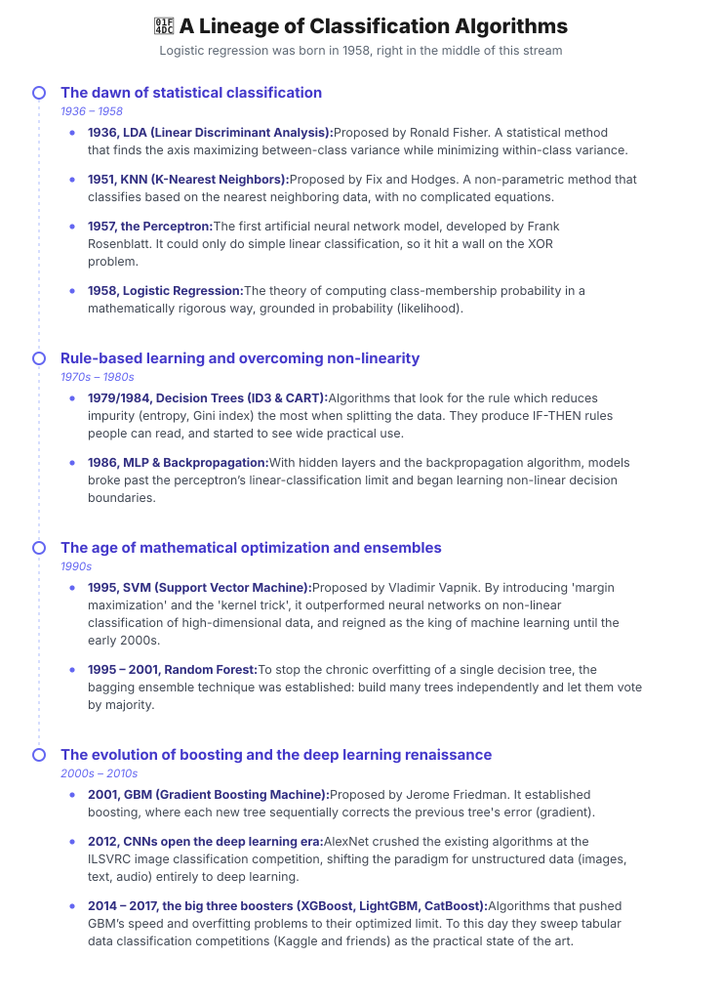
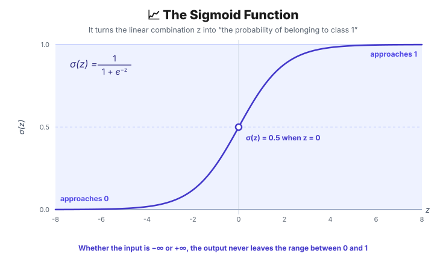
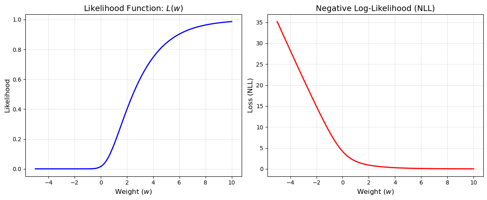
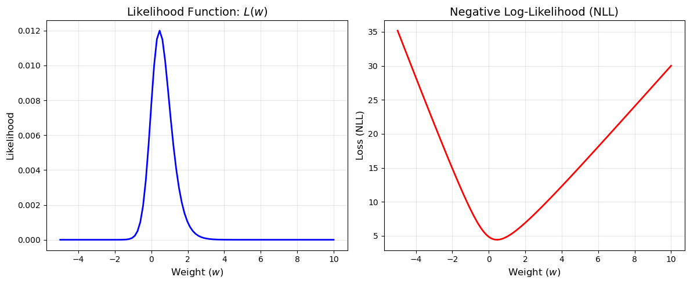
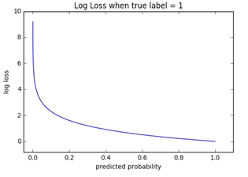
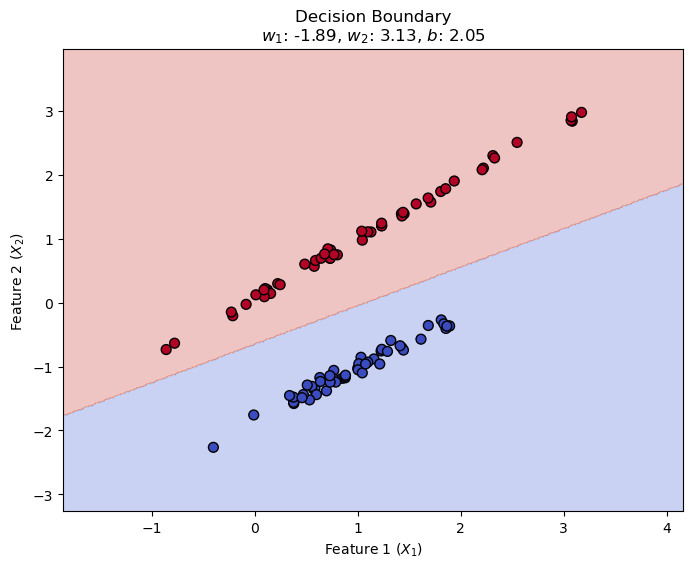

## 1. Why Logistic Regression Appeared

It appeared because of the fatal limits that show up when you apply ordinary linear regression to a 'classification' problem.

- **No probabilistic interpretation:** the predictions of linear regression stretch from $-\infty$ to $+\infty$, so you cannot read them as "the probability of belonging to class 1 (0~1)".
- **Extreme fragility to outliers:** linear regression minimizes squared error, so a single extreme outlier far from the correct answer badly distorts the whole regression line. That in turn wrecks the decision boundary even for the data that used to be classified well.

### 1.1. A Lineage of Classification Algorithms



> 💡 **1.2. The Latest Trends in Machine Learning Classification (mid-2020s)**
>
> Deep learning's attention mechanism and the foundation model paradigm have moved to the frontier of classification algorithms. The most advanced form of classification today splits into two branches.
>
> **1. Deep learning / transformers for tabular data (TabPFN, FT-Transformer)**<br>Traditionally, for tabular data in spreadsheet/DB form, tree-based boosting algorithms such as XGBoost performed better than deep learning. Recently, though, transformer-based classifiers (FT-Transformer and friends) have been developed that treat the interactions between the data's 'features' like context in natural language. In particular, models like **TabPFN (introduced in 2022, still evolving)** are pre-trained on tens of millions of meta datasets, so when new tabular data arrives they perform classification inference in just a few seconds — with no hyperparameter tuning and no training (gradient descent) — bringing 'In-Context Learning' to machine learning.
>
> **2. Zero-shot/few-shot classification with LLMs (large language models)**<br>For text or unstructured data, people no longer collect tens of thousands of labeled examples to fine-tune a dedicated classification model (BERT, say) from scratch. Handing a modern LLM with general reasoning ability (GPT-4, Gemini, and so on) nothing but a prompt — "classify whether this document is positive or negative; here are three examples" — has become the most powerful and most up-to-date classification pipeline.

---

## 2. How It Differs from Other Algorithms

| **Algorithm** | **Decision boundary** | **Optimization objective** | **Key difference** |
| --- | --- | --- | --- |
| **Linear Regression** | None (predicts a continuous value) | Minimize MSE (mean squared error) | For regression, not classification. It cannot output a probability. |
| **Logistic Regression** | **Linear** | Minimize cross-entropy (log-loss) | Outputs the 'probability' of belonging to a class directly, so it is **highly interpretable**. Learns a global pattern through an equation. (A parametric model.) |
| **KNN (K-Nearest Neighbors)** | Non-linear (formed locally, following the data) | **None (lazy learning)** | **The exact opposite philosophy from logistic regression.** There is no training (weight update) step at all; it merely stores the data. When new data arrives it decides by majority vote among the $K$ nearest neighbors — a distance-based, non-parametric algorithm. Vulnerable to the curse of dimensionality. |
| **SVM** | Linear / non-linear (kernel trick) | Maximize the margin | Focuses on finding the safest 'boundary line' separating the classes, not a probability. |
| **Decision Tree** | Non-linear (a staircase perpendicular to the axes) | Maximize information gain (impurity reduction) | Rule-based rather than equation-based. Unaffected by data scaling. |

### 2.1. When You Should Use Logistic Regression

1. **Domains where perfect interpretability is legally/ethically mandatory**

   - **Main fields:** medical diagnosis, pharmaceuticals, public policy

   Deep learning and random forests perform well, but they are **black-box models** whose decision process cannot be traced. A doctor cannot tell a patient only that "the AI says you have cancer."

   Through the weights $w$, logistic regression lets you pull out, as a clear number, how much each independent variable $X$ influences the outcome. In particular, computing the **odds ratio ($e^w$)** — the exponential of the weight — lets you give a complete statistical explanation in human language, like this.

   > *"For every 1-point increase in body mass index (BMI), all else being equal, the risk (odds) of developing diabetes rises by a factor of 1.15."*

2. **Finance and credit scoring under strict compliance**

   - **Main fields:** loan screening, credit card issuance, insurance premium calculation

   Financial regulators legally mandate **model transparency** so they can verify that an AI does not discriminate by race, gender, or age. On top of that, when a customer whose loan was denied asks why, you have to demonstrate numerically "why it was denied, and which numbers (income, delinquency history, and so on) must improve to get approved."

   Logistic regression, whose every decision boundary is a simple linear equation, is the safest and most proven model for passing this kind of regulatory audit and compliance review.

3. **When you need a refined, trustworthy 'probability' rather than a mere 'classification'**

   - **Main fields:** ad click-through rate (CTR) prediction, expected revenue/cost estimation, risk management

   Tree-based ensemble models split the data in steps, so the predicted probabilities get skewed or distorted toward the extremes of 0 and 1. Logistic regression, which trains on maximum likelihood estimation (MLE), instead outputs a probability $\hat{y}$ that is **very well calibrated against the true data distribution**.

   When your business logic has to feed the probability itself straight into arithmetic — **(3.2% chance of a click × 1,000 KRW per ad = 32 KRW expected revenue)** — rather than the classification result (clicked: yes/no), logistic regression's probability is far more trustworthy.

4. **Feature selection and baselines on ultra-high-dimensional sparse data**

   - **High-dimensional sparse data:** it is strong on sparse matrices — natural language processing (TF-IDF) or user log data, where the data has tens of thousands of dimensions (features) but most of the values are 0. Combining it with **L1 regularization (Lasso)** shaves the weights of tens of thousands of useless variables down to exactly 0 (feature selection), making the model extremely light.
   - **Baseline model:** training deep learning from the very start of a new machine learning project is a waste of compute. It is used unconditionally as a sanity check: set a reference point first with logistic regression, which costs almost nothing to compute, then judge whether "the accuracy gain from introducing a complex model justifies the added compute cost."

> **When should you not use it? (Limitations)**<br>When the data's features are not independent but interact in **complex, non-linear ways** — image pixels, audio waveforms, the intricate context of text — logistic regression, with its linear decision boundary, can never learn the pattern. That is when you have to use deep learning or an ensemble model.

---

## 3. How Does It Work?

### 🕵️‍♂️ Prediction

The whole logistic regression pipeline comes down to three steps. Compute the linear combination, convert it into a probability, then apply a threshold for the final classification.

1. **Linear combination**

   - **Input: the feature** $x$
   - **Output:** $z$

   $$
   z = w^T x + b
   $$

   → $z$ can take any value from $-\infty$ to $+\infty$, so it cannot be read as a probability.

2. **Passing through the sigmoid function**

   - **Input: the output of the linear combination,** $z$
   - **Output: the predicted probability** $\hat{y}$ **=** $P(Y=1 \mid X)$
     - **The probability that the class is 1 given the input** $X$**, i.e.** $P(Y=1 \mid X)$

   To convert the result $z$ of the linear combination into a probability, we apply the **sigmoid (= logistic) function**.

   $$
   \sigma(z) = \frac{1}{1 + e^{-z}}
   $$

   

   Whatever value comes in, it always compresses the output into a value between 0 and 1.

   ⭐️ → $\hat{y}$ **means the probability** $P(y=1 \mid x)$ **that the data** $x$ **belongs to class 1.**

3. **Applying a threshold**

   The final class is decided from the output probability. The threshold is generally 0.5.

   - $\hat{y} \ge 0.5$ ⇒ class 1
     - *Reading: if the probability that* $x$ *belongs to class 1 is 0.5 or higher, we judge it to be class 1.*
   - $\hat{y} < 0.5$ ⇒ class 0
     - *Reading: if the probability that* $x$ *belongs to class 0 is below 0.5, we judge it to be class 0.*

### ✏️ Training

> 💡 **The core idea. Just remember this!**
>
> For prediction, you only compute $\hat{y}$ = $P(Y=1 \mid X)$, apply the threshold, and spit out a 1 or a 0.
>
> But to <u>**train**</u> the model, you have to be able to <u>**evaluate**</u> how good that prediction was.
>
> **→ The yardstick for that evaluation: a concept called likelihood.**<br>**→ We update the model's weights so that 'likelihood' is maximized. = maximum likelihood estimation (MLE)**<br>**→ And the instrument for doing so is binary cross-entropy, used as the loss function.**

#### 🪙 Bernoulli Trials

Say we are playing a coin-flipping game. But this coin is a magic coin: **the probability of heads is 0.7** and **the probability of tails is 0.3**. Let us assume the coin never lands on its edge.

- If we call heads 1, then the probability of flipping the coin once and getting heads is as follows.
  - $P(Y=1) = 0.7$
- And the probability of flipping the coin once and getting tails is as follows.
  - $P(Y=0) = 0.3$

  Since this magic coin never lands on its edge, the probability of flipping it once and getting tails can be tidied up like this.
  - $P(Y=0) = 1 - P(Y=1) = 1 - 0.7 = 0.3$

Putting these two cases into a single equation, we can tidy it up like this.

$$
P(Y=y) = p^y(1-p)^{(1-y)}
$$

#### 🏆 Likelihood: The Merit Points We Give the Model

- **The analogy**

  Our model (the student) looked at the patient data and answered like this.

  > "I predict this patient has an 80% ($\hat{y} = 0.8$) chance of being positive!"

  Because this is the stage where we train the model, the system (the teacher) has to grade how well the student did (compute the loss function). Only by scoring according to how much confidence the student put on the true answer can we teach it to do better next time (update the weights).

  - If the patient really is 'positive':

    The model put 80% confidence on the correct answer (positive). It predicted very well, so we give it **a high score (likelihood) of 0.8**.

  - If the patient was actually 'negative':

    The student put a full 80% confidence on the wrong answer. That means it had a mere 20% ($1-0.8$) of confidence in 'negative', the true answer. It put its confidence in the wrong place, so we give it **a low score (likelihood) of 0.2**.

  The model's goal is <u>**to earn the maximum merit points (likelihood)**</u>. So, having predicted on all of the training data, it updates its weights so that the score (likelihood) obtained by comparing each prediction against the correct answer is maximized.

- **The rigorous version**

  $$
  L(\theta \mid X) = P(X \mid \theta)
  $$

  Probability and likelihood are computed on exactly the same equation (the probability distribution function). But mathematically, the meaning changes completely depending on what you treat as a constant (fixed) and what you treat as a variable (unknown).

  - **Probability:** when you already know the rule ($\theta$), you **predict the data** $X$ that will occur.
  - **Likelihood:** when you have already observed the data $X$, you **work backwards to the rule ($\theta$)** that produced it.

  | **Category** | **Notation** | **Fixed (constant)** | **Unknown (variable)** | **What the question is after** |
  | --- | --- | --- | --- | --- |
  | **Probability** | $P(X \mid \theta)$ | **$\theta$ (the model's parameters)** | **$X$ (the data)** | "Given that the die is in state ($\theta$), what is the probability of rolling a 6 ($X$)?" |
  | **Likelihood** | $L(\theta \mid X)$ | **$X$ (the already observed data)** | **$\theta$ (the model's parameters)** | "A 6 came up 10 times in a row ($X$) — how plausible is it that this die is fair ($\theta$)?" |

#### 📚 Let's Update the Model's Weights to Maximize the Likelihood!

1. **Defining the likelihood function**

   As we saw above, the output $\hat{y}$ of logistic regression is **the probability** $P(y=1 \mid x)$ **that the data** $x$ **belongs to class 1**.

   Then <u>**the model's explanatory power (likelihood)**</u> can be expressed with the <u>**Bernoulli probability distribution**</u> below.

   - $(x_i, y_i)$: the **input features** and the **correct label** of the $i$-th data point
   - $\hat{y_i}$: the probability, predicted by the model, that the input feature $x_i$ belongs to class 1

   $$
   P(Y=y_i \mid X=x_i) = \hat{y}_i^{y_i} (1 - \hat{y}_i)^{(1 - y_i)}
   $$

   - If the correct answer is $y_i = 1$,
     - $P(Y=1 \mid X) = \hat{y_i}$

       → If the model predicted a high probability ($\hat{y_i}$) of X being classified as 1, **that is, if it predicted close to the correct answer, the value of this equation will be close to 1.**

       → If the model predicted $\hat{y_i}$ low, **that is, if it predicted close to the wrong answer, the value of this equation will be close to 0.**

   - If the correct answer is $y_i = 0$,
     - $P(Y=0 \mid X) = 1-\hat{y_i}$

       → If the model's predicted probability $\hat{y_i}$ is close to 0, **that is, if it predicted close to the correct answer, the value of this equation will be close to 1.**

       → If the model's predicted probability $\hat{y_i}$ is close to 1, **that is, if it predicted close to the wrong answer, the value of this equation will be close to 0.**

   So we can tidy it up as follows.

   - If the value of the equation (the likelihood) is close to 1:
     - it means the model's prediction is close to the correct answer.
   - If the value of the equation (the likelihood) is close to 0:
     - it means the model's prediction is close to the wrong answer.

2. **Generalizing the likelihood function**

   Up to now we have only worked through an example with a single training data point $(x_i, y_i)$.

   Suppose we have N training data points. Then <u>**if we run the equation above on each of the N training data points and the total result is close to 1**</u>, we can judge that our model gets the answers right.

   Assuming that the model's predictions on each of the N training data points are independent of one another — that is, an earlier prediction does not influence a later one — the equation above (the likelihood) can be tidied up, for N data points, into the following likelihood function.

   $$
   \begin{aligned}
   L(w) &= L_1(w) \times L_2(w) \times \dots \times L_N(w) \\
        &= \prod_{i=1}^{N} P(Y_i=y_i \mid X_i; w) \\
        &= \prod_{i=1}^{N} \hat{y}_i^{y_i} (1 - \hat{y}_i)^{(1 - y_i)}
   \end{aligned}
   $$

   In other words, we have to find the weights $w$ that maximize this likelihood function. That is, we follow **maximum likelihood estimation (MLE)**.

   - **The problem:** $\hat{y}$ is a decimal between 0 and 1. Multiply decimals like 0.8, 0.5, 0.2 a thousand or ten thousand times over and the value gets endlessly close to 0, causing an **underflow** problem the computer cannot compute.

3. **Log-likelihood: turning multiplication into addition**

   To solve this computational problem we take the **natural logarithm ($\ln$)** of both sides — a very useful mathematical tool. Since the logarithm is a monotonically increasing function, the point where the original likelihood $L(w)$ is maximized and the point where the log-likelihood $\log L(w)$ is maximized are exactly the same.

   > **Reference: properties of the logarithm**<br>$\log(AB) = \log A + \log B$<br>$\log(A^B) = B \log A$

   $$
   \ell(w) = \log \left( \prod_{i=1}^{N} \hat{y}_i^{y_i} (1 - \hat{y}_i)^{(1 - y_i)} \right)
   $$

   The multiplication ($\prod$) symbol turns into an addition ($\sum$) symbol, and the $y_i$ and $(1 - y_i)$ that sat in the exponent come down in front of the log as multipliers.

   $$
   \ell(w) = \sum_{i=1}^{N} \left[ y_i \log(\hat{y}_i) + (1 - y_i) \log(1 - \hat{y}_i) \right]
   $$

   Thanks to this transformation, tens of thousands of decimal multiplications become simple additions, and the computer can compute stably.

   - **Problem 1:** now we have to find the weights $w$ that make this log-likelihood $\ell(w)$ **maximum**. But most optimization algorithms in machine learning, gradient descent included, are designed to **minimize** a function's value.
   - **Problem 2:** as $N$ grows without bound, the loss value grows without bound along with $N$ (because we are summing).

4. **Negative log-likelihood: turning maximization into minimization**

   - **Fix 1: put a minus sign ($-$) in front of the whole expression!**
   - **Fix 2: divide by** $N$ **to take the average!**

   $$
   J(w) = -\frac{1}{N} \ell(w) = -\frac{1}{N} \sum_{i=1}^{N} \left[ y_i \log(\hat{y}_i) + (1 - y_i) \log(1 - \hat{y}_i) \right]
   $$

   This is exactly the final form of **binary cross-entropy**, the loss (objective) function used in logistic regression.

   One more thing: take the partial derivative of this $BCE$ with respect to the weights $w$ and the messy sigmoid derivative term cancels perfectly against the derivative of the log and disappears.

   $$
   \frac{\partial J}{\partial w} = \frac{1}{N} \sum_{i=1}^{N} (\hat{y}_i - y_i) x_i
   $$

   

   <details>
   <summary>Plotting code</summary>

   ```python
   import numpy as np
   import matplotlib.pyplot as plt

   # 1. Define the sigmoid function (computes the predicted probability)
   def sigmoid(x):
       return 1 / (1 + np.exp(-x))

   # 2. Create a simple synthetic dataset
   # If N is too large L(w) underflows to 0, so we use only a little data.
   X = np.array([-2.0, -1.0, -0.5, 0.5, 1.0, 2.0])
   y = np.array([0, 0, 0, 1, 1, 1])

   # 3. Set the range of weights w to test (from -5 to 10)
   w_values = np.linspace(-5, 10, 100)
   likelihoods = []
   nlls = []

   # 4. Compute L(w) and NLL(w) for each weight w
   for w in w_values:
       # Predicted probability y_hat
       y_hat = sigmoid(w * X)

       # Likelihood: the product of the probabilities
       # We add a small number (1e-15) to avoid extremely small values.
       y_hat = np.clip(y_hat, 1e-15, 1 - 1e-15)
       L_w = np.prod((y_hat ** y) * ((1 - y_hat) ** (1 - y)))
       likelihoods.append(L_w)

       # Negative log-likelihood: minus the sum of the logs
       nll_w = -np.sum(y * np.log(y_hat) + (1 - y) * np.log(1 - y_hat))
       nlls.append(nll_w)

   # 5. Visualize
   fig, axes = plt.subplots(1, 2, figsize=(12, 5))

   # [Left plot] the likelihood function L(w)
   axes[0].plot(w_values, likelihoods, color='blue', linewidth=2)
   axes[0].set_title('Likelihood Function: $L(w)$', fontsize=14)
   axes[0].set_xlabel('Weight ($w$)', fontsize=12)
   axes[0].set_ylabel('Likelihood', fontsize=12)
   axes[0].grid(True, alpha=0.3)

   # [Right plot] the negative log-likelihood -log(L(w))
   axes[1].plot(w_values, nlls, color='red', linewidth=2)
   axes[1].set_title('Negative Log-Likelihood (NLL)', fontsize=14)
   axes[1].set_xlabel('Weight ($w$)', fontsize=12)
   axes[1].set_ylabel('Loss (NLL)', fontsize=12)
   axes[1].grid(True, alpha=0.3)

   plt.tight_layout()
   plt.show()
   ```

   </details>

   

   <details>
   <summary>Plotting code</summary>

   ```python
   import numpy as np
   import matplotlib.pyplot as plt

   # 1. Define the sigmoid function (computes the predicted probability)
   def sigmoid(x):
       return 1 / (1 + np.exp(-x))

   # 2. Create a simple synthetic dataset (1 if x is positive, 0 if negative)
   # If N is too large L(w) underflows to 0, so we use only a little data.
   X = np.array([-2.0, -1.0, -0.5, 0.5, 1.0, 2.0, 3.0])
   y = np.array([0, 0, 0, 1, 1, 1, 0])

   # 3. Set the range of weights w to test (from -5 to 10)
   w_values = np.linspace(-5, 10, 100)
   likelihoods = []
   nlls = []

   # 4. Compute L(w) and NLL(w) for each weight w
   for w in w_values:
       # Predicted probability y_hat
       y_hat = sigmoid(w * X)

       # Likelihood: the product of the probabilities
       # We add a small number (1e-15) to avoid extremely small values.
       y_hat = np.clip(y_hat, 1e-15, 1 - 1e-15)
       L_w = np.prod((y_hat ** y) * ((1 - y_hat) ** (1 - y)))
       likelihoods.append(L_w)

       # Negative log-likelihood: minus the sum of the logs
       nll_w = -np.sum(y * np.log(y_hat) + (1 - y) * np.log(1 - y_hat))
       nlls.append(nll_w)

   # 5. Visualize
   fig, axes = plt.subplots(1, 2, figsize=(12, 5))

   # [Left plot] the likelihood function L(w)
   axes[0].plot(w_values, likelihoods, color='blue', linewidth=2)
   axes[0].set_title('Likelihood Function: $L(w)$', fontsize=14)
   axes[0].set_xlabel('Weight ($w$)', fontsize=12)
   axes[0].set_ylabel('Likelihood', fontsize=12)
   axes[0].grid(True, alpha=0.3)

   # [Right plot] the negative log-likelihood -log(L(w))
   axes[1].plot(w_values, nlls, color='red', linewidth=2)
   axes[1].set_title('Negative Log-Likelihood (NLL)', fontsize=14)
   axes[1].set_xlabel('Weight ($w$)', fontsize=12)
   axes[1].set_ylabel('Loss (NLL)', fontsize=12)
   axes[1].grid(True, alpha=0.3)

   plt.tight_layout()
   plt.show()
   ```

   </details>

   **What we gain by using BCE as the loss function**

   1. **A perfectly convex shape:** the gradient grows faithfully with the error. There is no vanishing-gradient problem, and no matter which initial weights you start from, it becomes a smooth, bowl-shaped convex function that always reaches one single global minimum.
   2. **It penalizes exponentially as the likelihood gets smaller.**

      The picture below plots $BCE$. When the correct answer is 1, the closer $\hat{y}$ is to 0 — that is, <u>**the further the prediction drifts from the correct answer, the more steeply the loss shoots up.**</u>

      

### 📈 Why Is the Decision Boundary Linear?

The reason the decision boundary comes out 'linear' even though logistic regression uses a 'non-linear function' — the sigmoid — is that **when you work backwards from the probability that serves as the dividing line (usually 0.5), the sigmoid peels away and only a first-degree equation remains.**

#### 1. Defining the Decision Boundary

Given input data $x$, the logistic regression model computes the probability $\hat{y}$ of being class 1 as follows.

$$
\hat{y} = \sigma(w^T x + b) = \frac{1}{1 + e^{-(w^T x + b)}}
$$

To classify, you need a threshold. Usually we judge class 1 if this probability is 0.5 or higher and class 0 if it is lower. In that case, **the decision boundary is precisely the set of points where the probability is exactly 0.5.**

$$
\frac{1}{1 + e^{-(w^T x + b)}} = 0.5
$$

#### 2. Solving the Equation (Peeling Off the Sigmoid)

Let us solve the condition "the probability is 0.5" for $x$.

- Take the reciprocal of both sides.

$$
1 + e^{-(w^T x + b)} = 2
$$

- Subtract 1 from both sides.

$$
e^{-(w^T x + b)} = 1
$$

- For a number raised to a power to equal 1, the exponent must be **0**. ($\ln(1) = 0$)

$$
-(w^T x + b) = 0
$$

- In the end, once we drop the minus sign, only the following equation remains.

$$
w^T x + b = 0
$$

#### 3. What the Remaining Equation Means

Let us write out the equation $w^T x + b = 0$ that we derived. Assuming there are 2 input features ($x_1, x_2$),

$$
w_1 x_1 + w_2 x_2 + b = 0
$$



<details>
<summary>Plotting code</summary>

```python
import numpy as np
import matplotlib.pyplot as plt
from sklearn.linear_model import LogisticRegression
from sklearn.datasets import make_classification

# 1. Generate synthetic 2D data
# We create 100 points with two features.
X, y = make_classification(n_samples=100, n_features=2, n_informative=2,
                           n_redundant=0, n_clusters_per_class=1,
                           random_state=42)

# 2. Train the logistic regression model
model = LogisticRegression()
model.fit(X, y)

# 3. Build a background meshgrid for drawing the decision boundary
# We stamp dense points across the whole plane and check what the model predicts at each spot, 0 or 1.
x_min, x_max = X[:, 0].min() - 1, X[:, 0].max() + 1
y_min, y_max = X[:, 1].min() - 1, X[:, 1].max() + 1
xx, yy = np.meshgrid(np.arange(x_min, x_max, 0.02),
                     np.arange(y_min, y_max, 0.02))

# 4. Run the model's prediction on every coordinate of the background grid
# These predictions decide the background color — the 'decision boundary'.
Z = model.predict(np.c_[xx.ravel(), yy.ravel()])
Z = Z.reshape(xx.shape)

# 5. Visualize (draw the plot)
plt.figure(figsize=(8, 6))

# Paint the background by the model's prediction (0 or 1) — the blue/red regions
plt.contourf(xx, yy, Z, alpha=0.3, cmap='coolwarm')

# Scatter the actual data points on top
# The c=y option colors each point by its true label (0 or 1).
plt.scatter(X[:, 0], X[:, 1], c=y, cmap='coolwarm', edgecolor='k', s=50)

# Print the boundary line (equation) built from the optimized weights (w) and bias (b)
w1, w2 = model.coef_[0]
b = model.intercept_[0]
plt.title(f'Decision Boundary\n$w_1$: {w1:.2f}, $w_2$: {w2:.2f}, $b$: {b:.2f}')
plt.xlabel('Feature 1 ($X_1$)')
plt.ylabel('Feature 2 ($X_2$)')
plt.show()
```

</details>

This is a **first-degree equation**, exactly the same as the equation of a straight line ($ax + by + c = 0$).

- With 2 features it is a **line**
- With 3 features it is a **plane**
- With 4 or more features it is a **hyperplane**

In other words, the sigmoid function only ever plays the role of measuring how far the data sits from this line (the decision boundary) and smoothly squashing that into a probability between 0 and 1, while **the reference line itself — the one deciding "from where on is it class 1?" — is determined entirely by the linear equation ($w^T x + b = 0$) the model produced in the first place.**

---

## 4. Using It in Code

```python
from sklearn.linear_model import LogisticRegression
from sklearn.model_selection import train_test_split
from sklearn.metrics import accuracy_score

# 1. Split the data (X: feature data, y: correct labels)
X_train, X_test, y_train, y_test = train_test_split(X, y, test_size=0.2, random_state=42)

# 2. Initialize and train the model
# In practice you tune the C (regularization strength) parameter to prevent overfitting.
model = LogisticRegression(
					penalty=['l1', 'l2', 'elasticnet', None],
					C=1.0, # smaller means stronger regularization (a simpler, less sensitive model)
					l1_ratio=0, # only active when penalty='elasticnet'. 0 is pure L2, 1 is pure L1
					solver=['lbfgs', 'liblinear', 'sag', 'saga', 'newton-cg', 'newton-cholesky'], # the optimization algorithm used to minimize the loss
					max_iter=5000, # the 'maximum' number of iterations before the solver converges.
					tol=1e-4, # the tolerance for stopping optimization. Stops early once the loss decrease falls below tol
					class_weight=['balanced', {0:1, 1:5}], # weights the classes to deal with class imbalance. Can be set directly with a dict.
					multi_class=['ovr', 'multinomial', 'auto'], # applied when you have to classify 3 or more classes.
					fit_intercept=True # whether to compute the bias in the decision boundary equation. Leave it True unless your input is already perfectly normalized around 0.
					)
model.fit(X_train, y_train)

# 3. Plain final class prediction (0 or 1)
y_pred = model.predict(X_test)
print(f"Accuracy: {accuracy_score(y_test, y_pred)}")

# 4. (The key part) reading the probabilities directly
# The model returns the probability of belonging to each class (0 and 1) as an array.
y_proba = model.predict_proba(X_test)
print("Probabilities for the first test sample:", y_proba[0])
# Example output: [0.15, 0.85] -> an 85% chance of class 1
```

### Hyperparameter Tuning with GridSearchCV

1. The hyperparameters people usually tune

   | **Parameter** | **Role** | **Typical candidate values** |
   | --- | --- | --- |
   | **`C`** | Controls regularization strength (smaller is stronger) | `[0.01, 0.1, 1, 10, 100]` (search wide on a log scale) |
   | **`penalty`** | The regularization style (feature selection vs. weight shrinkage) | `['l1', 'l2']` |
   | **`solver`** | The optimization algorithm | `['liblinear', 'saga']` (solvers that support both L1 and L2) |

   - *Why we don't sweep every parameter:* `fit_intercept`, `tol`, `max_iter` and friends are closer to technical settings of the optimization process than to accuracy gains, so we keep the defaults or adjust them by hand only when a warning shows up. Searching every parameter combination makes training time (O(N)) explode exponentially, so the standard practice is to search only the 2~3 core parameters that most affect the result.

2. Example code

   ```python
   import pandas as pd
   from sklearn.datasets import load_breast_cancer
   from sklearn.model_selection import train_test_split, GridSearchCV
   from sklearn.linear_model import LogisticRegression
   from sklearn.preprocessing import StandardScaler
   from sklearn.metrics import accuracy_score

   # 1. Load and split the data
   cancer = load_breast_cancer()
   X_train, X_test, y_train, y_test = train_test_split(
       cancer.data, cancer.target, test_size=0.2, random_state=42
   )

   # 2. Scale the data (scaling is mandatory since logistic regression is regularized by C)
   scaler = StandardScaler()
   X_train_scaled = scaler.fit_transform(X_train)
   X_test_scaled = scaler.transform(X_test)

   # 3. Initialize the model
   # We set max_iter generously to 1000 to avoid the convergence warning.
   model = LogisticRegression(max_iter=1000, random_state=42)

   # 4. Define the hyperparameter grid to search
   # We match 'liblinear' and 'saga', the solvers that support both L1 and L2 regularization.
   param_grid = {
       'penalty': ['l1', 'l2'],
       'C': [0.001, 0.01, 0.1, 1, 10, 100],
       'solver': ['liblinear', 'saga']
   }

   # 5. Create the GridSearchCV object and fit it (5-fold cross validation)
   # Total combinations = 2(penalty) * 6(C) * 2(solver) * 5(cv) = 120 model fits.
   grid_search = GridSearchCV(
       estimator=model,
       param_grid=param_grid,
       cv=5,                 # 5-fold cross validation (K-Fold)
       scoring='accuracy',   # the evaluation metric
       n_jobs=-1             # use every available CPU core
   )

   # Run the grid search (find the best combination)
   grid_search.fit(X_train_scaled, y_train)

   # 6. Check the results
   print(f"Best parameter combination: {grid_search.best_params_}")
   print(f"Best cross-validation accuracy: {grid_search.best_score_:.4f}")

   # 7. Evaluate the test data with the model using the best parameters
   best_model = grid_search.best_estimator_
   y_pred = best_model.predict(X_test_scaled)
   print(f"Final accuracy on the test data: {accuracy_score(y_test, y_pred):.4f}")
   ```

   The error that comes up most often when setting up GridSearchCV is a **compatibility clash between `solver` and `penalty`**.

   - `solver='lbfgs'` (the default) supports only L2 regularization. Pick that solver, put `penalty: ['l1', 'l2']` in the grid, and training stops with an error when it reaches L1.
   - So if you want to compare L1 and L2 performance, you have to bundle in `solver: ['liblinear', 'saga']` — solvers that can accept both — as the code above does.

---

## 📚 References

- [scikit-learn — `LogisticRegression`](https://scikit-learn.org/stable/modules/generated/sklearn.linear_model.LogisticRegression.html) — the official reference for the parameters covered in section 4 (`C`, `penalty`, `solver`, `class_weight`)
- [scikit-learn — `GridSearchCV`](https://scikit-learn.org/stable/modules/generated/sklearn.model_selection.GridSearchCV.html) — the hyperparameter search API
- [scikit-learn User Guide — Linear Models](https://scikit-learn.org/stable/modules/linear_model.html) — logistic regression's loss function and the table of which penalties each solver supports
- [Logistic regression — Wikipedia](https://en.wikipedia.org/wiki/Logistic_regression) — the maximum likelihood derivation and the history (including D. R. Cox's 1958 formulation)
- [*An Introduction to Statistical Learning*](https://www.statlearning.com/) — chapter 4 covers logistic regression, odds ratios and decision boundaries with figures (free PDF)
- [TabPFN: A Transformer That Solves Small Tabular Classification Problems in a Second](https://arxiv.org/abs/2207.01848) — the In-Context Learning tabular classifier mentioned in section 1.2
- [Revisiting Deep Learning Models for Tabular Data](https://arxiv.org/abs/2106.11959) — the original FT-Transformer paper
