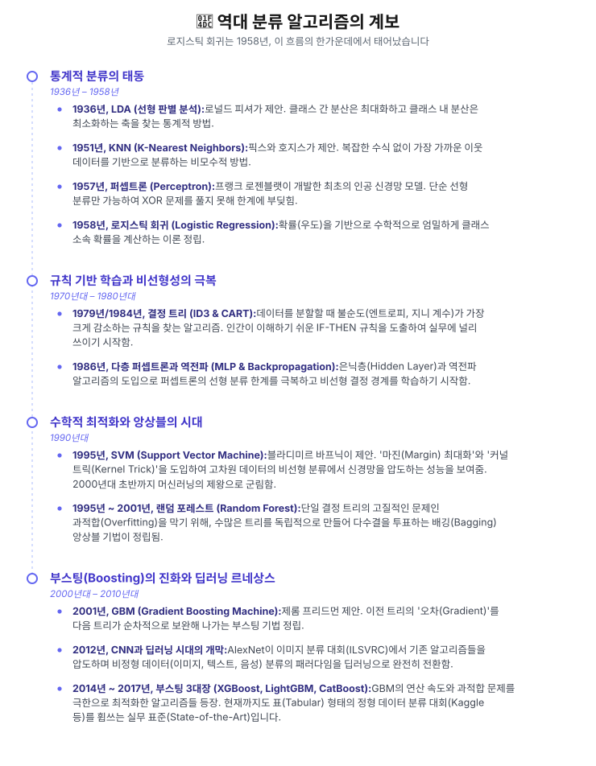
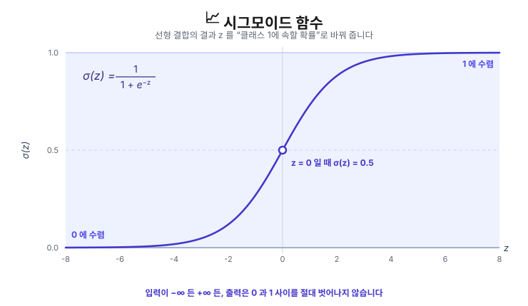

## 1. Logistic Regression이 등장한 배경

기존의 선형 회귀(Linear Regression)를 '분류(Classification)' 문제에 적용했을 때 발생하는 치명적인 한계 때문에 등장했습니다.

- **확률 해석 불가:** 선형 회귀의 예측값은 $-\infty$에서 $+\infty$까지 뻗어 나가므로, 이를 "클래스 1에 속할 확률(0~1)"로 해석할 수 없습니다.
- **이상치(Outlier)에 대한 극단적 취약성:** 선형 회귀는 오차 제곱을 최소화하므로, 정답과 멀리 떨어진 극단적인 이상치 데이터가 하나만 들어와도 전체 회귀선이 크게 왜곡됩니다. 이로 인해 기존에 잘 분류되던 데이터들의 결정 경계마저 망가지는 문제가 발생했습니다.

### 1.1. 역대 분류 알고리즘의 계보



> 💡 **1.2. 가장 최신의 머신러닝 분류 트렌드 (2020년대 중반)**
>
> 딥러닝의 어텐션(Attention) 메커니즘과 파운데이션 모델(Foundation Model) 패러다임이 분류 알고리즘의 최전선으로 넘어왔습니다. 현재 가장 진보된 형태의 분류 기술은 두 갈래로 나뉩니다.
>
> **1. 정형 데이터(Tabular Data)를 위한 딥러닝 / 트랜스포머 (TabPFN, FT-Transformer)**<br>전통적으로 엑셀/DB 형태의 정형 데이터는 XGBoost 등 트리 기반 부스팅 알고리즘이 딥러닝보다 성능이 좋았습니다. 하지만 최근 데이터의 '특성(Feature)' 간 상호작용을 자연어의 문맥처럼 처리하는 트랜스포머 기반 분류기(FT-Transformer 등)가 개발되었습니다. 특히 **TabPFN (2022년 등장, 지속 발전 중)** 같은 모델은 수천만 개의 메타 데이터셋으로 사전 학습(Pre-trained)되어 있어, 새로운 정형 데이터가 들어오면 하이퍼파라미터 튜닝이나 훈련(Gradient Descent) 과정 없이 단 몇 초 만에 분류 추론을 해내는 'In-Context Learning' 방식을 머신러닝에 도입했습니다.
>
> **2. LLM(대형 언어 모델)을 활용한 제로샷/퓨샷 분류 (Zero-Shot/Few-Shot Classification)**<br>텍스트나 비정형 데이터의 경우, 더 이상 분류를 위한 레이블링 데이터 수만 개를 모아 분류 전용 모델(예: BERT)을 처음부터 미세 조정(Fine-tuning)하지 않습니다. 범용적인 추론 능력을 갖춘 최신 LLM(GPT-4, Gemini 등)에게 "이 문서가 긍정인지 부정인지 분류해 줘. 예시 3개는 이거야."라고 프롬프트만 주어 분류 문제를 해결하는 방식이 가장 강력하고 최신화된 분류 파이프라인으로 자리 잡았습니다.

---

## 2. 다른 알고리즘들과의 차이점

| **알고리즘** | **결정 경계 (Decision Boundary)** | **최적화 목표** | **핵심 차이점** |
| --- | --- | --- | --- |
| **Linear Regression** | 없음 (연속값 예측) | MSE (평균 제곱 오차) 최소화 | 분류가 아닌 회귀용. 확률 출력이 불가능합니다. |
| **Logistic Regression** | **선형 (Linear)** | 교차 엔트로피(Log-Loss) 최소화 | 클래스에 속할 '확률'을 직접 출력하여 **해석력이** 뛰어납니다. 수식을 통한 전역적인(Global) 패턴 학습. (모수적 모델) |
| **KNN (K-Nearest Neighbors)** | 비선형 (데이터에 따라 국소적으로 형성) | **없음 (Lazy Learning)** | **로지스틱 회귀와 정반대의 철학.** 학습(가중치 업데이트) 과정 자체가 없으며 데이터를 저장만 해 둡니다. 새로운 데이터가 들어오면 가장 가까운 이웃 $K$개의 다수결로 결정하는 거리 기반, 비모수적(Non-parametric) 알고리즘. 차원의 저주에 취약합니다. |
| **SVM** | 선형 / 비선형(커널 트릭) | 마진(Margin) 최대화 | 확률이 아닌, 클래스를 가르는 가장 안전한 '경계선'을 찾는 데 집중합니다. |
| **Decision Tree** | 비선형 (축에 수직인 계단형) | 정보 이득 (불순도 감소) 최대화 | 수식(방정식) 기반이 아닌 규칙 기반(Rule-based). 데이터 스케일링에 영향을 받지 않습니다. |

### 2.1. Logistic Regression을 써야 하는 상황

1. **완벽한 해석력(Interpretability)이 법적/윤리적으로 필수적인 도메인**

   - **주요 분야:** 의료 진단, 제약, 공공 정책

   딥러닝이나 랜덤 포레스트는 성능이 뛰어나지만 결정 과정을 추적할 수 없는 **블랙박스(Black-box) 모델**입니다. 의사가 환자에게 "인공지능이 당신을 암이라고 하네요"라고만 말할 수는 없습니다.

   로지스틱 회귀는 가중치 $w$를 통해 각 독립변수 $X$가 결과에 미치는 영향력을 명확한 수치로 뽑아낼 수 있습니다. 특히 가중치에 지수를 취한 **오즈비(Odds Ratio, $e^w$)** 를 계산하면, 다음과 같이 인간의 언어로 완벽한 통계적 설명을 제공할 수 있습니다.

   > *"체질량지수(BMI)가 1 증가할 때마다, 다른 조건이 동일하다면 당뇨병 발병 위험(오즈)이 1.15배 증가합니다."*

2. **엄격한 규제(Compliance)를 받는 금융 및 신용 평가**

   - **주요 분야:** 대출 심사, 신용카드 발급, 보험료 산정

   금융 당국은 AI가 특정 인종, 성별, 연령을 차별하지 않는지 검증하기 위해 **모델의 투명성**을 법으로 강제합니다. 또한, 대출이 거절된 고객이 사유를 물었을 때 "왜 거절되었고, 어떤 수치(소득, 연체 이력 등)를 개선해야 승인되는지"를 산술적으로 증명해야 합니다.

   모든 결정 경계가 단순한 선형 방정식(Linear Equation)으로 이루어진 로지스틱 회귀는 이러한 금융 당국의 감사(Audit)와 규제 준수를 통과할 수 있는 가장 안전하고 검증된 모델입니다.

3. **단순 '분류'가 아닌, 정교하고 신뢰할 수 있는 '확률값'이 필요할 때**

   - **주요 분야:** 광고 클릭률(CTR) 예측, 기대 수익/비용 산정, 리스크 관리

   트리 기반 앙상블 모델들은 데이터를 계단식으로 쪼개기 때문에 예측된 확률값이 0이나 1 근처로 극단적으로 쏠리거나 왜곡되는 현상이 발생합니다. 반면, 최대우도추정(MLE)을 기반으로 학습하는 로지스틱 회귀는 출력되는 확률값 $\hat{y}$이 **실제 데이터의 분포와 매우 정교하게 일치(Well-calibrated)** 합니다.

   비즈니스 로직에서 분류 결과(클릭 O/X)보다 **(클릭할 확률 3.2% X 광고 단가 1,000원 = 기대 수익 32원)** 처럼 확률값 자체를 수학적 연산에 직접 태워야 할 때, 로지스틱 회귀의 확률값이 훨씬 신뢰도가 높습니다.

4. **초고차원 희소 데이터(Sparse Data)에서의 특성 선택과 베이스라인**

   - **고차원 희소 데이터:** 자연어 처리(TF-IDF)나 유저 로그 데이터처럼, 데이터의 차원(Feature)은 수만 개인데 대부분의 값이 0으로 채워진 희소 행렬(Sparse Matrix) 상황에서 강력합니다. 여기에 **L1 정규화(Lasso)** 를 결합한 로지스틱 회귀를 사용하면, 쓸모없는 수만 개의 변수 가중치를 정확히 0으로 깎아내어(Feature Selection) 모델을 극단적으로 가볍게 만들 수 있습니다.
   - **베이스라인(Baseline) 모델:** 새로운 머신러닝 프로젝트를 시작할 때 처음부터 딥러닝을 훈련하는 것은 컴퓨팅 자원 낭비입니다. 연산량이 거의 없는 로지스틱 회귀로 먼저 기준점을 잡고, "복잡한 모델을 도입했을 때 얻는 정확도 향상분이 늘어난 연산 비용을 정당화하는가?"를 판단하는 기준(Sanity Check)으로 무조건 사용됩니다.

> **언제 쓰면 안 될까요? (한계점)**<br>이미지 픽셀, 음성 파형, 텍스트의 복잡한 문맥처럼 데이터의 특성(Feature)들이 독립적이지 않고 서로 **복잡한 비선형적 상호작용(Non-linear Interaction)** 을 하는 경우에는, 선형 결정 경계를 가진 로지스틱 회귀로는 패턴을 절대 학습할 수 없습니다. 이때는 딥러닝이나 앙상블 모델을 사용해야 합니다.

---

## 3. 어떻게 동작하는가?

### 🕵️‍♂️ Prediction

로지스틱 회귀의 전체 파이프라인은 총 3단계로 요약됩니다. 선형결합을 계산하고, 이를 확률로 변환한 뒤, 임계값을 적용해 최종 분류합니다.

1. **선형 결합(Linear Combination)**

   - **입력: 특성** $x$
   - **출력:** $z$

   $$
   z = w^T x + b
   $$

   → $z$값은 $-\infty$에서 $+\infty$까지 어떤 값이든 가질 수 있으므로 확률로 해석할 수 없습니다.

2. **시그모이드 함수 통과(Sigmoid Function)**

   - **입력: 선형 결합의 출력** $z$
   - **출력: 예측확률** $\hat{y}$ **=** $P(Y=1 \mid X)$
     - **입력** $X$**가 주어졌을 때, 클래스가 1일 확률** $P(Y=1 \mid X)$

   선형 결합의 결과 $z$를 확률 값으로 변환하기 위해서 **시그모이드(=로지스틱) 함수**를 적용합니다.

   $$
   \sigma(z) = \frac{1}{1 + e^{-z}}
   $$

   

   어떤 값이 들어와도 항상 0과 1 사이의 값으로 압축하여 출력합니다.

   ⭐️ → $\hat{y}$**는 데이터** $x$**가 클래스 1에 속할 확률** $P(y=1 \mid x)$**을 의미합니다.**

3. **임계값(Threshold) 적용**

   출력된 확률값을 기반으로 최종 클래스를 결정합니다. 일반적으로 임계값은 0.5를 사용합니다.

   - $\hat{y} \ge 0.5$ ⇒ 클래스 1
     - *해석:* $x$*가 클래스 1에 속할 확률이 0.5 이상이면 클래스 1이라고 판단합니다.*
   - $\hat{y} < 0.5$ ⇒ 클래스 0
     - *해석:* $x$*가 클래스 0에 속할 확률이 0.5 미만이면 클래스 0이라고 판단합니다.*

### ✏️ Training

> 💡 **핵심 아이디어. 이것만 기억하자!**
>
> 예측(Prediction)을 할 때는, $\hat{y}$ = $P(Y=1 \mid X)$ 만 구하고, 임계값 처리를 해서 1 또는 0을 내뿜으면 됩니다.
>
> 하지만 모델을 <u><strong>학습(Training)</strong></u>시킬 때는 이 예측이 얼마나 잘 된 예측인지 <u>**평가**</u>할 수 있어야 합니다.
>
> **→ 평가의 기준: 우도(가능성, Likelihood)라는 개념을 사용합니다.**<br>**→ '우도'가 최대가 되도록 모델의 가중치를 갱신합니다. = 최대 우도 추정법(MLE)**<br>**→ 그 수단으로 이진 교차 엔트로피(Binary Cross-Entropy)를 손실함수로 사용합니다.**

#### 🪙 베르누이 실행

동전 뒤집기 게임을 한다고 해봅시다. 하지만 이 동전은 마법의 동전이라 **그림이 나올 확률이 0.7**이고, **숫자가 나올 확률이 0.3**입니다. 동전이 옆면으로 서는 경우는 없다고 가정하겠습니다.

- 그림이 나오는 경우를 1이라고 하면, 동전을 한 번 던져서 그림이 나올 확률은 다음과 같습니다.
  - $P(Y=1) = 0.7$
- 그리고 동전을 한 번 던져서 숫자가 나올 확률은 다음과 같습니다.
  - $P(Y=0) = 0.3$

  이 마법의 동전은 옆면으로 서는 경우는 없으므로, 동전을 한 번 던져서 숫자가 나올 확률은 다음과 같이 정리할 수 있습니다.
  - $P(Y=0) = 1 - P(Y=1) = 1 - 0.7 = 0.3$

이 두 경우를 하나의 수식으로 정리하면 이렇게 정리할 수 있습니다.

$$
P(Y=y) = p^y(1-p)^{(1-y)}
$$

#### 🏆 우도(likelihood): 모델에게 주는 상점

- **비유적 설명**

  우리의 모델(학생)이 환자 데이터를 보고 이렇게 답했습니다.

  > "저는 이 환자가 양성일 확률이 80%($\hat{y} = 0.8$)이라고 예측합니다!"

  모델을 훈련시키는 단계이기 때문에, 시스템(선생님)은 학생이 얼마나 잘 했는지 채점(손실함수(Loss) 계산)해야 합니다. 학생이 진짜 정답에 얼마나 높은 확신을 가졌는지에 따라 점수를 매겨야, 다음번에 더 잘 하도록 가르칠(가중치 업데이트) 수 있기 때문입니다.

  - 환자가 진짜 '양성'인 경우:

    모델이 정답(양성)에 80%의 확신을 가졌습니다. 아주 잘 예측했으므로 <strong>0.8이라는 높은 점수(우도)</strong>를 줍니다.

  - 환자가 사실 '음성'이었던 경우:

    학생은 오답에 80%나 확신했습니다. 이는 진짜 정답인 '음성'에 대해서는 겨우 20%($1-0.8$)의 확신밖에 없었다는 뜻입니다. 엉뚱한 곳에 확신을 가졌으므로 <strong>0.2라는 낮은 점수(우도)</strong>를 줍니다.

  모델은 <u>**상점(우도)을 최대로 얻는 것이 목적**</u>입니다. 따라서 훈련 데이터 모두에 대해서 예측을 했을 때, 각각의 예측과 정답을 비교해서 얻은 그 점수(우도)가 최대가 되도록 모델의 가중치를 업데이트합니다.

- **엄밀한 설명**

  $$
  L(\theta \mid X) = P(X \mid \theta)
  $$

  확률과 우도는 완전히 똑같은 수식(확률 분포 함수) 위에서 계산됩니다. 하지만 수학적으로 무엇을 상수(고정값)로 보고, 무엇을 변수(미지수)로 보느냐에 따라 의미가 완전히 달라집니다.

  - **확률:** 규칙($\theta$)을 이미 알고 있을 때, 앞으로 발생할 **데이터** $X$**를 예측합니다**.
  - **우도:** 데이터 $X$를 이미 관측했을 때, 이 데이터를 만들어낸 **규칙($\theta$)을 역추적**합니다.

  | **구분** | **기호** | **고정값 (상수)** | **미지수 (변수)** | **질문의 목적** |
  | --- | --- | --- | --- | --- |
  | **확률 (Probability)** | $P(X \mid \theta)$ | **$\theta$ (모델의 매개변수)** | **$X$ (데이터)** | "주사위의 상태가 ($\theta$)일 때, 숫자 6($X$)이 나올 확률은 얼마인가?" |
  | **우도 (Likelihood)** | $L(\theta \mid X)$ | **$X$ (이미 관측된 데이터)** | **$\theta$ (모델의 매개변수)** | "숫자 6이 연속으로 10번($X$) 나왔는데, 이 주사위가 정상($\theta$)일 그럴싸함은 얼마인가?" |

#### 📚 우도가 최대가 되도록 모델의 가중치를 갱신하자!

1. **우도 함수의 정의**

   앞서 살펴봤듯, 로지스틱 회귀의 출력 $\hat{y}$은 **데이터** $x$**가 클래스 1에 속할 확률** $P(y=1 \mid x)$입니다.

   그러면 이제 <u><strong>모델의 설명력(우도)</strong></u>은 아래와 같은 <u>**베르누이 확률분포**</u>로 표현할 수 있습니다.

   - $(x_i, y_i)$: $i$번째 데이터의 **입력 피처**와 **정답 라벨**
   - $\hat{y_i}$: 모델이 예측한, 입력 피처 $x_i$가 클래스 1에 속할 확률

   $$
   P(Y=y_i \mid X=x_i) = \hat{y}_i^{y_i} (1 - \hat{y}_i)^{(1 - y_i)}
   $$

   - 만약 정답 $y_i = 1$ 이라면,
     - $P(Y=1 \mid X) = \hat{y_i}$

       → 모델이 만약 X가 1에 분류될 확률($\hat{y_i}$)을 높게 예측했다면, **즉 정답에 가깝게 예측했다면, 이 수식의 값은 1에 가깝게** 될 것입니다.

       → 만약 모델이 $\hat{y_i}$을 낮게 예측했다면, **즉 오답에 가깝게 예측했다면, 이 수식의 값이 0에 가깝게 될** 것입니다.

   - 만약 정답 $y_i = 0$ 이라면,
     - $P(Y=0 \mid X) = 1-\hat{y_i}$

       → 모델의 예측 확률 $\hat{y_i}$이 0에 가깝다면, **즉 정답에 가깝게 예측했다면 이 수식의 값은 1에 가깝게** 될 것입니다.

       → 모델의 예측 확률 $\hat{y_i}$이 1에 가깝다면, **즉 오답에 가깝게 예측했다면 이 수식의 값은 0에 가깝게** 될 것입니다.

   따라서 다음과 같이 정리할 수 있습니다.

   - 만약 수식(우도)의 값이 1에 가깝다면:
     - 모델의 예측과 정답에 가깝다는 뜻입니다.
   - 만약 수식(우도)의 값이 0에 가깝다면:
     - 모델의 예측이 오답에 가깝다는 뜻입니다.

2. **우도 함수의 일반화**

   방금까지는 단 하나의 훈련 데이터 $(x_i, y_i)$에 대해서만 예시를 들어봤습니다.

   우리가 N개의 훈련 데이터를 갖고 있다고 해봅시다. 그러면 각각의 <u>**N개의 훈련데이터에 대해 위 수식을 수행하고, 그 총 결과값이 1에 가깝다면**</u> 우리 모델이 정답을 잘 맞춘다고 판단할 수 있습니다.

   모델이 N개의 훈련 데이터 각각에 대해 예측하는 행위가 서로 독립적, 즉 이전 예측이 이후의 예측에 영향을 주지 않는다고 가정하면, 데이터 개수 N에 대해 위 수식(우도)은 다음의 우도함수로 정리할 수 있습니다.

   $$
   \begin{aligned}
   L(w) &= L_1(w) \times L_2(w) \times \dots \times L_N(w) \\
        &= \prod_{i=1}^{N} P(Y_i=y_i \mid X_i; w) \\
        &= \prod_{i=1}^{N} \hat{y}_i^{y_i} (1 - \hat{y}_i)^{(1 - y_i)}
   \end{aligned}
   $$

   즉, 이 우도함수를 최대화하는 가중치 $w$를 찾아야 합니다. 즉, **최대 우도 추정(MLE)** 방식을 따릅니다.

   - **문제점:** $\hat{y}$는 0과 1 사이의 소수입니다. 0.8, 0.5, 0.2 같은 소수를 1,000번, 10,000번 곱하게 되면 그 값은 0에 한없이 가까워져 컴퓨터가 계산하지 못하는 **언더플로우(Underflow)** 문제가 발생합니다.

3. **로그 우도(Log-Likelihood): 곱셈을 덧셈으로 변환**

   이 연산 문제를 해결하기 위해 수학적으로 아주 유용한 도구인 **자연로그($\ln$)를** 양변에 씌웁니다. 로그 함수는 단조 증가(Monotonically increasing) 함수이므로, 원래의 우도 $L(w)$가 최대가 되는 지점과 로그 우도 $\log L(w)$가 최대가 되는 지점은 완전히 동일합니다.

   > **참고: 로그의 성질**<br>$\log(AB) = \log A + \log B$<br>$\log(A^B) = B \log A$

   $$
   \ell(w) = \log \left( \prod_{i=1}^{N} \hat{y}_i^{y_i} (1 - \hat{y}_i)^{(1 - y_i)} \right)
   $$

   곱셈($\prod$) 기호는 덧셈($\sum$) 기호로 바뀌고, 지수 자리에 있던 $y_i$와 $(1 - y_i)$는 로그 앞으로 내려와 곱해집니다.

   $$
   \ell(w) = \sum_{i=1}^{N} \left[ y_i \log(\hat{y}_i) + (1 - y_i) \log(1 - \hat{y}_i) \right]
   $$

   이 변환을 통해 수만 번의 소수 곱셈이 단순한 덧셈으로 바뀌어 컴퓨터가 안정적으로 연산할 수 있게 되었습니다.

   - **문제점 1:** 이제 이 로그 우도 $\ell(w)$가 **최대(Max)** 가 되게 하는 가중치 $w$를 찾아야 합니다. 하지만 경사하강법같은 기계학습의 최적화 알고리즘은 대부분 함수의 값을 <strong>최소화(Minimize)</strong>하도록 설계되어 있습니다.
   - **문제점 2:** $N$이 무수히 많아지면, $N$에 따라 손실 값이 무한정 커지게 됩니다. (더하기 때문)

4. **음의 로그 우도(Negative Log-Likelihood): 최대화를 최소화로 변환**

   - **해결법 1: 식 전체에 마이너스($-$)를 붙이자!**
   - **해결법 2:** $N$**으로 나누어 평균을 내자!**

   $$
   J(w) = -\frac{1}{N} \ell(w) = -\frac{1}{N} \sum_{i=1}^{N} \left[ y_i \log(\hat{y}_i) + (1 - y_i) \log(1 - \hat{y}_i) \right]
   $$

   이것이 바로 로지스틱 회귀에서 사용하는 손실함수(목적함수)인 <strong>이진 크로스 엔트로피(Binary Cross-Entropy)</strong>의 최종 형태입니다.

   한 가지 더, 이 $BCE$를 가중치 $w$에 대해 편미분하면, 복잡했던 시그모이드 미분항이 로그 함수의 미분과 완벽하게 상쇄되어 사라집니다.

   $$
   \frac{\partial J}{\partial w} = \frac{1}{N} \sum_{i=1}^{N} (\hat{y}_i - y_i) x_i
   $$

   

   <details>
   <summary>그래프 코드</summary>

   ```python
   import numpy as np
   import matplotlib.pyplot as plt

   # 1. 시그모이드 함수 정의 (예측 확률 계산)
   def sigmoid(x):
       return 1 / (1 + np.exp(-x))

   # 2. 가상의 간단한 데이터셋 생성
   # N이 너무 크면 L(w)가 0으로 언더플로우 되므로 소량의 데이터만 사용합니다.
   X = np.array([-2.0, -1.0, -0.5, 0.5, 1.0, 2.0])
   y = np.array([0, 0, 0, 1, 1, 1])

   # 3. 테스트할 가중치 w의 범위 설정 (-5 부터 10 까지)
   w_values = np.linspace(-5, 10, 100)
   likelihoods = []
   nlls = []

   # 4. 각 가중치 w에 대해 L(w)와 NLL(w) 계산
   for w in w_values:
       # 예측 확률 y_hat
       y_hat = sigmoid(w * X)

       # 우도(Likelihood): 확률들의 곱
       # 극단적으로 작은 값을 피하기 위해 작은 숫자(1e-15)를 더해줍니다.
       y_hat = np.clip(y_hat, 1e-15, 1 - 1e-15)
       L_w = np.prod((y_hat ** y) * ((1 - y_hat) ** (1 - y)))
       likelihoods.append(L_w)

       # 음의 로그 우도(Negative Log-Likelihood): 로그 합에 마이너스
       nll_w = -np.sum(y * np.log(y_hat) + (1 - y) * np.log(1 - y_hat))
       nlls.append(nll_w)

   # 5. 그래프 시각화
   fig, axes = plt.subplots(1, 2, figsize=(12, 5))

   # [왼쪽 그래프] 우도 함수 L(w)
   axes[0].plot(w_values, likelihoods, color='blue', linewidth=2)
   axes[0].set_title('Likelihood Function: $L(w)$', fontsize=14)
   axes[0].set_xlabel('Weight ($w$)', fontsize=12)
   axes[0].set_ylabel('Likelihood', fontsize=12)
   axes[0].grid(True, alpha=0.3)

   # [오른쪽 그래프] 음의 로그 우도 -log(L(w))
   axes[1].plot(w_values, nlls, color='red', linewidth=2)
   axes[1].set_title('Negative Log-Likelihood (NLL)', fontsize=14)
   axes[1].set_xlabel('Weight ($w$)', fontsize=12)
   axes[1].set_ylabel('Loss (NLL)', fontsize=12)
   axes[1].grid(True, alpha=0.3)

   plt.tight_layout()
   plt.show()
   ```

   </details>

   

   <details>
   <summary>그래프 코드</summary>

   ```python
   import numpy as np
   import matplotlib.pyplot as plt

   # 1. 시그모이드 함수 정의 (예측 확률 계산)
   def sigmoid(x):
       return 1 / (1 + np.exp(-x))

   # 2. 가상의 간단한 데이터셋 생성 (x가 양수면 1, 음수면 0)
   # N이 너무 크면 L(w)가 0으로 언더플로우 되므로 소량의 데이터만 사용합니다.
   X = np.array([-2.0, -1.0, -0.5, 0.5, 1.0, 2.0, 3.0])
   y = np.array([0, 0, 0, 1, 1, 1, 0])

   # 3. 테스트할 가중치 w의 범위 설정 (-5 부터 10 까지)
   w_values = np.linspace(-5, 10, 100)
   likelihoods = []
   nlls = []

   # 4. 각 가중치 w에 대해 L(w)와 NLL(w) 계산
   for w in w_values:
       # 예측 확률 y_hat
       y_hat = sigmoid(w * X)

       # 우도(Likelihood): 확률들의 곱
       # 극단적으로 작은 값을 피하기 위해 작은 숫자(1e-15)를 더해줍니다.
       y_hat = np.clip(y_hat, 1e-15, 1 - 1e-15)
       L_w = np.prod((y_hat ** y) * ((1 - y_hat) ** (1 - y)))
       likelihoods.append(L_w)

       # 음의 로그 우도(Negative Log-Likelihood): 로그 합에 마이너스
       nll_w = -np.sum(y * np.log(y_hat) + (1 - y) * np.log(1 - y_hat))
       nlls.append(nll_w)

   # 5. 그래프 시각화
   fig, axes = plt.subplots(1, 2, figsize=(12, 5))

   # [왼쪽 그래프] 우도 함수 L(w)
   axes[0].plot(w_values, likelihoods, color='blue', linewidth=2)
   axes[0].set_title('Likelihood Function: $L(w)$', fontsize=14)
   axes[0].set_xlabel('Weight ($w$)', fontsize=12)
   axes[0].set_ylabel('Likelihood', fontsize=12)
   axes[0].grid(True, alpha=0.3)

   # [오른쪽 그래프] 음의 로그 우도 -log(L(w))
   axes[1].plot(w_values, nlls, color='red', linewidth=2)
   axes[1].set_title('Negative Log-Likelihood (NLL)', fontsize=14)
   axes[1].set_xlabel('Weight ($w$)', fontsize=12)
   axes[1].set_ylabel('Loss (NLL)', fontsize=12)
   axes[1].grid(True, alpha=0.3)

   plt.tight_layout()
   plt.show()
   ```

   </details>

   
    **BCE를 손실함수로 씀으로써 얻는 이득**

   1. **완벽한 볼록(Convex) 형태:** 오차가 클수록 기울기도 정직하게 커집니다. 기울기 소실 문제가 발생하지 않으며, 어떠한 초기 가중치에서 시작하더라도 반드시 단 하나의 전역 최솟값(Global Minimum)에 도달할 수 있는 밥그릇 형태의 매끄러운 볼록 함수가 됩니다.
   2. **우도가 작을수록 기하급수적으로 패널티를 부여합니다.**

      아래 사진은 $BCE$를 그래프로 그린 것입니다. 정답이 1일 때, $\hat{y}$이 0에 가까울수록, 즉 <u>**정답과 예측확률이 멀어질수록 loss가 급격하게 솟구칩니다.**</u>

      

### 📈 왜 결정경계가 선형인가?

로지스틱 회귀가 시그모이드라는 '비선형 함수'를 사용함에도 불구하고 결정 경계(Decision Boundary)가 '선형'이 되는 이유는, 클래스를 가르는 **기준점이 되는 확률(일반적으로 0.5)을 수식으로 역산해 보면 시그모이드가 벗겨지고 1차 방정식만 남기 때문입니다.**

#### 1. 결정 경계의 정의

로지스틱 회귀 모델은 입력 데이터 $x$가 주어졌을 때, 클래스 1이 될 확률 $\hat{y}$를 다음과 같이 계산합니다.

$$
\hat{y} = \sigma(w^T x + b) = \frac{1}{1 + e^{-(w^T x + b)}}
$$

분류를 하려면 기준(Threshold)이 필요합니다. 보통 이 확률이 0.5 이상이면 클래스 1, 미만이면 클래스 0으로 판단합니다. 그렇다면 **결정 경계선은 정확히 확률이 0.5가 되는 지점입니다.**

$$
\frac{1}{1 + e^{-(w^T x + b)}} = 0.5
$$

#### 2. 방정식 풀기 (시그모이드 벗겨내기)

확률이 0.5가 되는 조건식을 $x$에 대해 풀어봅시다.

- 양변에 역수를 취합니다.

$$
1 + e^{-(w^T x + b)} = 2
$$

- 양변에서 1을 뺍니다.

$$
e^{-(w^T x + b)} = 1
$$

- 어떤 수의 지수승이 1이 되려면, 지수 부분이 반드시 **0**이어야 합니다. ($\ln(1) = 0$)

$$
-(w^T x + b) = 0
$$

- 결국, 마이너스를 떼고 나면 다음 식만 남게 됩니다.

$$
w^T x + b = 0
$$

#### 3. 남은 식의 수학적 의미

도출된 $w^T x + b = 0$ 이라는 식을 풀어서 써봅시다. 입력 특성(Feature)가 2개($x_1, x_2$)라고 가정해 보면,

$$
w_1 x_1 + w_2 x_2 + b = 0
$$


<details>
<summary>그래프 코드</summary>

```python
import numpy as np
import matplotlib.pyplot as plt
from sklearn.linear_model import LogisticRegression
from sklearn.datasets import make_classification

# 1. 가상의 2D 데이터 생성
# 두 개의 특성(Feature)을 가진 100개의 점을 만듭니다.
X, y = make_classification(n_samples=100, n_features=2, n_informative=2,
                           n_redundant=0, n_clusters_per_class=1,
                           random_state=42)

# 2. 로지스틱 회귀 모델 학습
model = LogisticRegression()
model.fit(X, y)

# 3. 결정 경계를 그리기 위한 배경 격자(Meshgrid) 생성
# 화면 전체에 촘촘한 점(격자)을 찍어서 모델이 각 위치를 0과 1중 무엇으로 예측하는지 확인합니다.
x_min, x_max = X[:, 0].min() - 1, X[:, 0].max() + 1
y_min, y_max = X[:, 1].min() - 1, X[:, 1].max() + 1
xx, yy = np.meshgrid(np.arange(x_min, x_max, 0.02),
                     np.arange(y_min, y_max, 0.02))

# 4. 배경 격자의 모든 좌표에 대해 모델 예측 수행
# 이 예측값이 배경의 색상을 결정하는 '결정 경계'가 됩니다.
Z = model.predict(np.c_[xx.ravel(), yy.ravel()])
Z = Z.reshape(xx.shape)

# 5. 시각화 (그래프 그리기)
plt.figure(figsize=(8, 6))

# 모델의 예측 결과(0 또는 1)에 따라 배경색을 칠함 (파란색/빨간색 영역)
plt.contourf(xx, yy, Z, alpha=0.3, cmap='coolwarm')

# 실제 데이터 점(Scatter)을 그 위에 찍음
# c=y 옵션을 통해 실제 정답(0 또는 1)에 따라 점의 색상을 다르게 표시합니다.
plt.scatter(X[:, 0], X[:, 1], c=y, cmap='coolwarm', edgecolor='k', s=50)

# 최적화된 가중치(w)와 편향(b)으로 만들어진 경계선(방정식) 정보 출력
w1, w2 = model.coef_[0]
b = model.intercept_[0]
plt.title(f'Decision Boundary\n$w_1$: {w1:.2f}, $w_2$: {w2:.2f}, $b$: {b:.2f}')
plt.xlabel('Feature 1 ($X_1$)')
plt.ylabel('Feature 2 ($X_2$)')
plt.show()
```

</details>

이는 직선의 방정식($ax + by + c = 0$)과 완전히 동일한 **1차 방정식**입니다.

- 특성이 2개일 때는 **직선(Line)**
- 특성이 3개일 때는 **평면(Plane)**
- 특성이 4개 이상일 때는 **초평면(Hyperplane)**

즉, 시그모이드 함수는 데이터가 이 직선(결정 경계)으로부터 얼마나 멀리 떨어져 있는지를 계산해 0과 1 사이의 확률로 부드럽게 찌그러뜨리는(Squash) 역할만 할 뿐, **'어디서부터가 클래스 1인가?'를 결정하는 기준선 자체는 모델이 초기에 만들어낸 선형 방정식($w^T x + b = 0$)이 그대로 결정**하게 됩니다.

---

## 4. 코드로 활용하는 법

```python
from sklearn.linear_model import LogisticRegression
from sklearn.model_selection import train_test_split
from sklearn.metrics import accuracy_score

# 1. 데이터 분리 (X: 특성 데이터, y: 정답 라벨)
X_train, X_test, y_train, y_test = train_test_split(X, y, test_size=0.2, random_state=42)

# 2. 모델 초기화 및 학습
# 실무에서는 과적합을 막기 위해 C(규제 강도) 파라미터를 조절합니다.
model = LogisticRegression(
					penalty=['l1', 'l2', 'elasticnet', None],
					C=1.0, # 작을 수록 규제가 강해짐(모델이 단순해지고 덜 민감해짐)
					l1_ratio=0, # penalty='elasticnet'일 때만 활성화. 0이면 순수 L2, 1이면 순수 L1
					solver=['lbfgs', 'liblinear', 'sag', 'saga', 'newton-cg', 'newton-cholesky'], # 손실함수 최소화에 사용할 최적화 알고리즘
					max_iter=5000, # solver가 수렴할 때까지 반복할 '최대'횟수.
					tol=1e-4, # 최적화를 멈추는 허용 오차 기준. 손실함수 감소량이 tol보다 작아지면 조기 종료(early-stopping)
					class_weight=['balanced', {0:1, 1:5}], # 클래스 불균형 문제를 해결하기 위해 가중치 부여. 딕셔너리로 직접 설정 가능.
					multi_class=['ovr', 'multinomial', 'auto'], # 3개 이상의 클래스를 분류해야 할 때 적용.
					fit_intercept=True # 결정경계 방정식에서 bias를 계산할 지 여부. 입력 데이터를 사전에 0을 중심으로 완벽히 정규화해둔 특수한 상황이 아니면 무조건 True로 둔다.
					)
model.fit(X_train, y_train)

# 3. 단순 최종 클래스 예측 (0 또는 1)
y_pred = model.predict(X_test)
print(f"정확도: {accuracy_score(y_test, y_pred)}")

# 4. (핵심) 확률값 직접 확인하기
# 모델이 각 클래스(0과 1)에 속할 확률을 배열 형태로 반환합니다.
y_proba = model.predict_proba(X_test)
print("첫 번째 테스트 데이터의 확률:", y_proba[0])
# 출력 예시: [0.15, 0.85] -> 클래스 1일 확률이 85%
```

### GridSearchCV로 하이퍼 파라미터 튜닝

1. 보통 많이 튜닝하는 하이퍼 파라미터

   | **파라미터** | **역할** | **일반적인 후보 값** |
   | --- | --- | --- |
   | **`C`** | 규제 강도 조절 (작을수록 규제 강함) | `[0.01, 0.1, 1, 10, 100]` (로그 스케일로 넓게 탐색) |
   | **`penalty`** | 규제 방식 (특성 선택 vs 가중치 압축) | `['l1', 'l2']` |
   | **`solver`** | 최적화 알고리즘 | `['liblinear', 'saga']` (L1과 L2를 모두 지원하는 솔버) |

   - *모든 파라미터를 돌리지 않는 이유:* `fit_intercept`, `tol`, `max_iter` 등은 모델의 정확도 향상보다는 최적화 과정의 기술적 설정에 가깝기 때문에 기본값을 유지하거나 경고가 뜰 때만 수동으로 조정합니다. 모든 파라미터 조합을 탐색하면 훈련 시간(O(N))이 기하급수적으로 폭발하므로, 결과에 가장 큰 영향을 미치는 핵심 파라미터 2~3개만 탐색하는 것이 정석입니다.

2. 예시 코드

   ```python
   import pandas as pd
   from sklearn.datasets import load_breast_cancer
   from sklearn.model_selection import train_test_split, GridSearchCV
   from sklearn.linear_model import LogisticRegression
   from sklearn.preprocessing import StandardScaler
   from sklearn.metrics import accuracy_score

   # 1. 데이터 로드 및 분할
   cancer = load_breast_cancer()
   X_train, X_test, y_train, y_test = train_test_split(
       cancer.data, cancer.target, test_size=0.2, random_state=42
   )

   # 2. 데이터 스케일링 (로지스틱 회귀는 규제(C)가 들어가므로 스케일링이 필수입니다)
   scaler = StandardScaler()
   X_train_scaled = scaler.fit_transform(X_train)
   X_test_scaled = scaler.transform(X_test)

   # 3. 모델 초기화
   # max_iter 경고를 방지하기 위해 넉넉하게 1000으로 설정합니다.
   model = LogisticRegression(max_iter=1000, random_state=42)

   # 4. 탐색할 하이퍼파라미터 그리드 정의
   # l1과 l2 규제를 모두 지원하는 solver인 'liblinear'와 'saga'를 매칭합니다.
   param_grid = {
       'penalty': ['l1', 'l2'],
       'C': [0.001, 0.01, 0.1, 1, 10, 100],
       'solver': ['liblinear', 'saga']
   }

   # 5. GridSearchCV 객체 생성 및 학습 (5-Fold 교차 검증)
   # 총 조합 수 = 2(penalty) * 6(C) * 2(solver) * 5(cv) = 120번의 모델 학습이 일어납니다.
   grid_search = GridSearchCV(
       estimator=model,
       param_grid=param_grid,
       cv=5,                 # 5겹 교차 검증 (K-Fold)
       scoring='accuracy',   # 평가 기준
       n_jobs=-1             # 사용 가능한 모든 CPU 코어 동원
   )

   # 그리드 서치 실행 (최적의 조합 찾기)
   grid_search.fit(X_train_scaled, y_train)

   # 6. 결과 확인
   print(f"최적의 파라미터 조합: {grid_search.best_params_}")
   print(f"교차 검증 최고 정확도: {grid_search.best_score_:.4f}")

   # 7. 최적의 파라미터가 적용된 모델로 테스트 데이터 평가
   best_model = grid_search.best_estimator_
   y_pred = best_model.predict(X_test_scaled)
   print(f"테스트 데이터 최종 정확도: {accuracy_score(y_test, y_pred):.4f}")
   ```

   GridSearchCV를 구성할 때 가장 자주 발생하는 에러는 **`solver`와 `penalty` 간의 호환성 충돌**입니다.

   - `solver='lbfgs'` (기본값)는 L2 규제만 지원합니다. 이 솔버를 선택하고 그리드에 `penalty: ['l1', 'l2']`를 넣으면 L1 차례에서 에러가 나며 학습이 중단됩니다.
   - 따라서 L1, L2 성능을 모두 비교해보고 싶다면, 위 코드처럼 두 규제를 모두 수용할 수 있는 `solver: ['liblinear', 'saga']`를 함께 묶어주어야 합니다.

---

## 📚 참고자료

- [scikit-learn — `LogisticRegression`](https://scikit-learn.org/stable/modules/generated/sklearn.linear_model.LogisticRegression.html) — 4장에서 다룬 파라미터(`C`, `penalty`, `solver`, `class_weight`)의 공식 레퍼런스
- [scikit-learn — `GridSearchCV`](https://scikit-learn.org/stable/modules/generated/sklearn.model_selection.GridSearchCV.html) — 하이퍼파라미터 탐색 API
- [scikit-learn User Guide — Linear Models](https://scikit-learn.org/stable/modules/linear_model.html) — 로지스틱 회귀의 손실함수와 솔버별 지원 규제 표
- [Logistic regression — Wikipedia](https://en.wikipedia.org/wiki/Logistic_regression) — 최대우도추정 유도 과정과 역사(1958년 D. R. Cox의 정리 포함)
- [*An Introduction to Statistical Learning*](https://www.statlearning.com/) — 4장이 로지스틱 회귀·오즈비·결정 경계를 그림과 함께 다룹니다 (PDF 무료 공개)
- [TabPFN: A Transformer That Solves Small Tabular Classification Problems in a Second](https://arxiv.org/abs/2207.01848) — 1.2절에서 언급한 In-Context Learning 기반 정형 데이터 분류기
- [Revisiting Deep Learning Models for Tabular Data](https://arxiv.org/abs/2106.11959) — FT-Transformer 원 논문
