## 0. Introduction

In the [previous post](/posts/ai/accuracy-precision-recall-f1-auroc/), we looked at the evaluation metrics for <u>**classification**</u> tasks: the <u>**Confusion Matrix**</u>, and what you can compute from it — <u>**Precision**</u>, <u>**Recall**</u>, <u>**F1-Score**</u>, and the <u>**AU-ROC Curve**</u>. For classification tasks such as defect detection or image classification, these metrics let us measure how well a model performs.

So what about <u>**Object Detection**</u> tasks? In object detection, the model has to draw a bounding box (bbox) showing <u>**“where (Location)”**</u> an object is, and at the same time get right <u>**“what (Class)”**</u> the object inside that box is. That means we need <u>**an evaluation metric that reflects both localization accuracy and classification accuracy**</u>.

In this post, I'll introduce the core metrics for this: <u>**AP (Average Precision)**</u> and <u>**mAP (mean Average Precision)**</u>.

## 1. Let's evaluate detection results by eye

Suppose we're building a model that looks at a blood image and detects which cells are Red Blood Cells, White Blood Cells, and Platelets. We fed the same Test dataset to two models trained on the same Training dataset and checked their predictions by eye.

| YOLOv3 | EfficientDet-D0 |
| --- | --- |
| 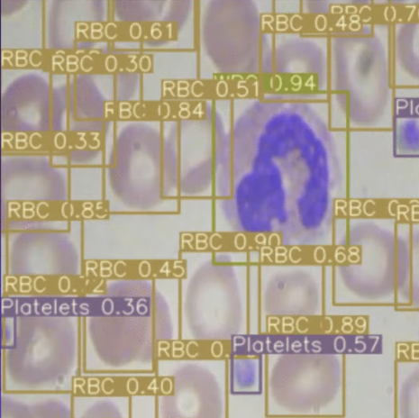 | 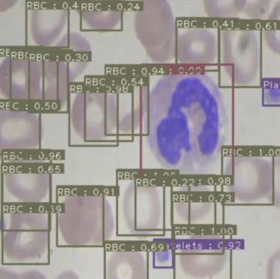 |

Let's start with YOLO. It caught every red blood cell, and it seems to have detected the platelets and white blood cell well too. No overlapping boxes, either. EfficientDet, on the other hand, is mostly similar to YOLO, but around the middle there are clearly two red blood cells and it has drawn one extra, overlapping bbox. Looking at this single image alone, you might conclude that YOLOv3 performs better and pick YOLOv3.

But of course, we can't judge the results for a huge Test dataset one by one like this. We'll need <u>**some way to evaluate every inference the model makes on the entire Test dataset automatically (programmatically)**</u>.

## 2. The Confusion Matrix in object detection

To evaluate automatically (programmatically), we need a mathematical criterion, and the one we can use is the <u>**Confusion Matrix**</u>. But can we use the confusion matrix from classification as-is for object detection?

In classification, each image was matched to a single answer. In object detection, however, <u>**a single image has multiple ground-truth boxes and multiple predicted boxes**</u>. So the criteria for deciding the TP, FP, FN, and TN that make up the confusion matrix are a bit trickier than in classification. Let's walk through the process.

> **📌 NOTE**
>
> The full object detection evaluation pipeline looks like this.
>
> - **Step 1: First-round survivor selection (Confidence Threshold):** Of the tens of thousands of predicted boxes the model spits out, any box that doesn't pass the <u>**Confidence Threshold**</u> is excluded from evaluation entirely.
> - **Step 2: Cleaning up duplicate boxes (NMS):** Among the surviving boxes, those that point to the same object and overlap heavily are filtered with the <u>**NMS Threshold**</u>, leaving only the single most confident representative box for each.
> - **Step 3: Scoring against the answers (TP / FP judgment):** The final surviving predicted boxes are compared with the actual answers (Ground Truth). If a box passes both the <u>**IoU Threshold**</u> **and** <u>**Class match**</u> **conditions** it is a **TP**; if it fails either one, it is an **FP**.
> - **Step 4: Tallying missed answers (FN judgment):** After all scoring is done, every ground-truth object left alone without being paired with any predicted box (because no prediction satisfied the IoU Threshold) is finally counted as an **FN (miss)**.

Before diving into computing the confusion matrix for object detection, let's first go over the essential concepts.

### 2.1. Confidence Threshold

When a model finishes inference, it pours out thousands or tens of thousands of bboxes. Each bbox carries a tag-like <u>**Confidence**</u> that an object exists there. Since we can't consider every bbox the model outputs, <u>**any predicted box whose Confidence is below the threshold is ignored entirely**</u>, and only the predicted boxes that pass this threshold remain.

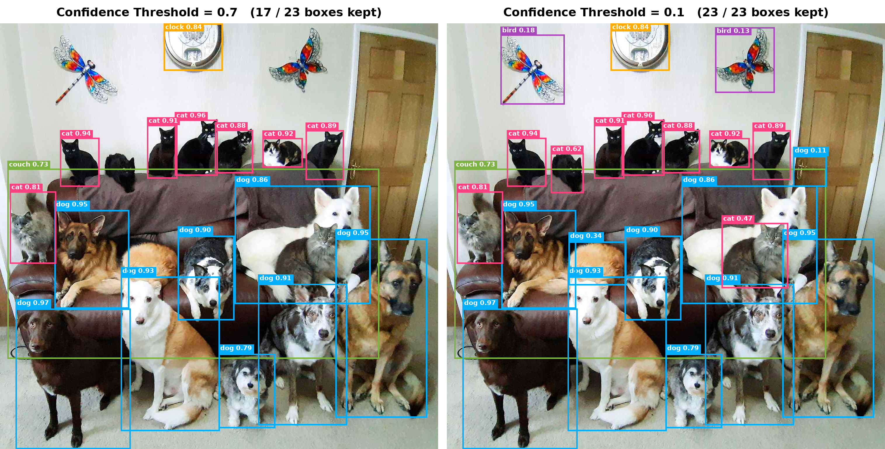

### 2.2. IoU (Intersection over Union)

IoU is a metric used to judge how much two bboxes overlap. It is defined as the intersection of the two boxes divided by their union. In other words, <u>**the smaller the union and the larger the intersection, the higher the IoU**</u>, right?

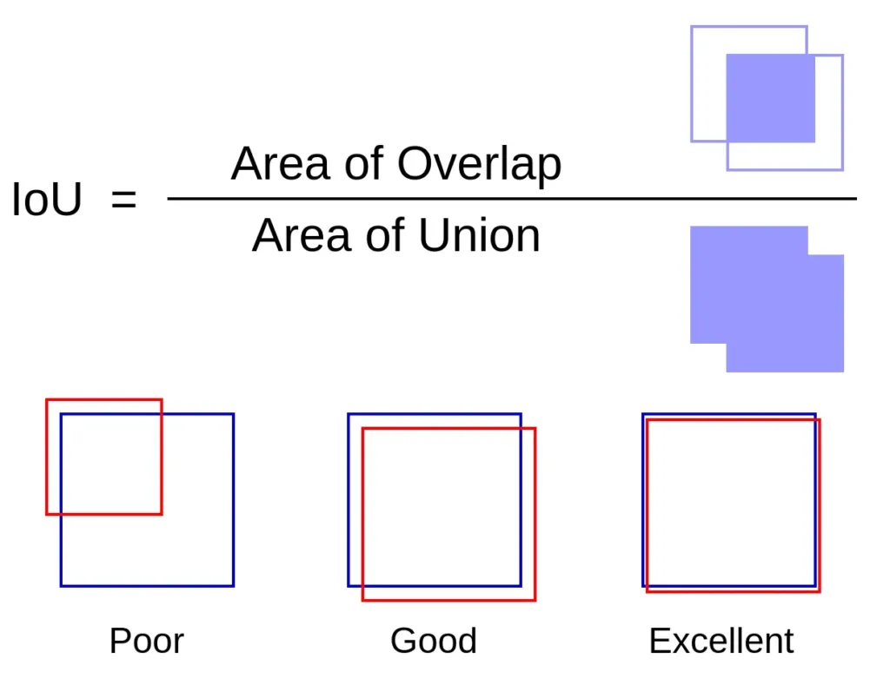

### 2.3. NMS (Non-Maximum Suppression)

NMS is a post-processing technique that, among multiple bboxes generated in duplicate for the same object, keeps only the single most accurate box and removes the rest. NMS works as follows.

1. **Confidence Threshold filtering:** First remove bounding boxes whose confidence score is lower than the set threshold (e.g., 0.5, 0.001).
2. **Sort in descending order:** Sort the remaining boxes from highest to lowest confidence score.
3. **Pick the top score and compute IoU:** Select the box with the highest score, and compute the **IoU** between this box and each of the remaining boxes.
4. **Suppress duplicate boxes:** Remove the surrounding boxes whose IoU with the selected box exceeds the <u>**threshold (NMS Threshold)**</u> (i.e., that overlap heavily).
5. **Repeat:** Repeat the steps above until no boxes remain in the list, completing the final set of bounding boxes.

> **📌 NOTE: Variants of NMS**
>
> The basic NMS described above **always deletes** a box once its IoU exceeds the threshold. This approach has some limitations, so several variants have emerged to address them.
>
> - <u>**Soft-NMS**</u>
>   - Instead of deleting overlapping boxes right away, it **gradually lowers their Confidence the larger the IoU is**.
>   - When **different objects overlap heavily** — like a photo of people standing close together — it reduces the chance of accidentally erasing a real object, which raises Recall.
> - <u>**DIoU-NMS**</u>
>   - It considers not only IoU but also **the distance between the two boxes' center points**.
>   - Even if they overlap a lot, if their centers are far apart, it treats them as **likely to be different objects** and keeps them.
> - <u>**Class-aware NMS**</u>
>   - It runs NMS **separately for each class**.
>   - For example, even if a white blood cell box and a red blood cell box overlap heavily, **they don't erase each other if their classes differ.** Most detection frameworks today use this approach by default.
>
> Recently, models that work **without NMS**, such as **DETR, RT-DETR, and YOLO26**, have also appeared. During training, these models pair each object with exactly one predicted box (one-to-one matching). So they're trained not to produce duplicate boxes in the first place, and NMS isn't needed in post-processing.

### 2.4. Judging TP, FP, FN

| **Metric** | **Intuitive meaning** | **Box predicted** | **Object present** | **IoU & Class condition** |
| --- | --- | --- | --- | --- |
| **TP(True Positive)** | Found it correctly | O | O | IoU ≥ IoU Threshold <strong>AND</strong> Class match |
| **FP(False Positive)** | Barked up the wrong tree (false alarm) | O | X (or condition not met) | Below IoU Threshold <strong>OR</strong> Class mismatch <strong>OR</strong> mistaken background <strong>OR</strong> duplicate |
| **FN(False Negative)** | Missed it (miss) | X | O | No matched predicted box |
| **TN(True Negative)** | - | - | - | **(Not used in object detection evaluation)** |

1. **TP (True Positive) : "Found it correctly"**

   Among what the model predicted to be objects, a detection that **matches the actual answer (Ground Truth)**. To count as a TP, it must satisfy both of the following conditions.

   - **Location condition:** The <u>**IoU between the predicted box and the ground-truth box must be at least the set IoU Threshold (e.g., 0.5)**</u>.
   - **Classification condition:** <u>**The predicted class must be the same as the ground-truth class**</u>.

2. **FP (False Positive) : "Found the wrong thing (false alarm)"**

   The model found something and drew a box, but it **ended up being a wrong prediction**. It's the most common error, and if any one of the following situations applies, it is treated as FP.

   - **Localization Error:** The class was right, but it pointed at the wrong spot and <u>**failed to pass the IoU Threshold**</u>.
   - **Classification Error:** It found the location brilliantly (passed IoU), but <u>**misclassified the class**</u>.
   - **Background Error:** It <u>**mistook**</u> a leaf or shadow in an <u>**empty background**</u> where there's nothing <u>**for an object**</u> and drew a box.
   - **Duplicate Detection:** When the model draws two or more boxes on one ground-truth object (not filtered by NMS), only the prediction with the highest IoU becomes a TP and <u>**all the remaining surplus predictions become FP**</u>.

3. **FN (False Negative) : "Missed it (miss)"**

   This is when **an actual object (answer) clearly exists in the image, but the model fails to find it at all**.

   - Either the model <u>**drew no box at all around that object,**</u>
   - or it did draw boxes, but those predictions were all judged FP for other reasons (localization error, classification error, etc.), leaving <u>**not a single prediction to match the answer**</u>.

4. **TN (True Negative) : "True negative (not used in object detection)"**

   <u>**In object detection, the concept of TN is either not used at all or ignored.**</u>

   - **Why:** TN is "the number of times the model correctly judged that there's no object where there's none." But the meaningless background space in an image where no object exists is **infinitely large**.

   Counting <u>**an infinite number of TNs**</u> — "No object in this empty air, no object on the ground next to that tire either, correct!" — <u>**is impossible**</u>, and it wouldn't help performance evaluation at all.

### 2.5. Example of judging TP, FP, FN

- Target model: YOLOv3
- Target class: Red blood cell
- IoU Threshold = 0.5

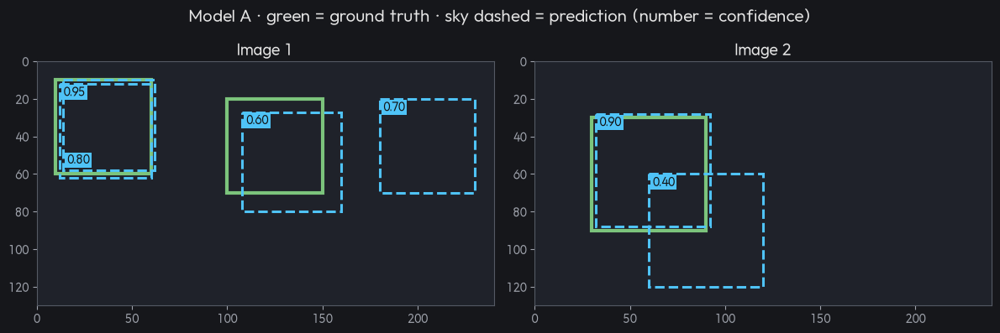

Suppose we got predictions like the image above. The process of completing the confusion matrix goes as follows.

1. **Confidence 0.95 prediction: TP**
   - IoU 0.89 with answer 1 ≥ IoU Threshold (0.5) **AND** Class match
2. **Confidence 0.90 prediction: TP**
   - IoU 0.88 with answer 3 ≥ IoU Threshold (0.5) **AND** Class match
3. **Confidence 0.80 prediction: FP**
   - IoU 0.85 with answer 1 ≥ IoU Threshold (0.5)
   - But answer 1 already has a paired prediction. → **Duplicate Detection**
4. **Confidence 0.70 prediction: FP**
   - No overlapping answer
5. **Confidence 0.60 prediction: TP**
   - IoU 0.53 with answer 2 ≥ IoU Threshold (0.5) **AND** Class match
6. **Confidence 0.40 prediction: FP**
   - IoU 0.14 with answer 2 < IoU Threshold (0.5) → **Localization Error**
   - Answer 2 already has a paired prediction (the Confidence 0.60 prediction) → **Duplicate Detection**
7. **FN (misses): 0**
   - After checking all 6 predictions, 0 answers are left without a pair.

If we mark this on the images, it looks like this.
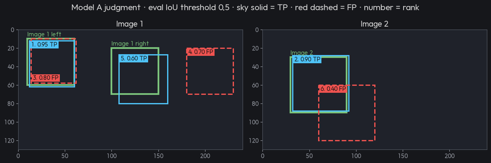

## 3. Can't we use AU-ROC in object detection?

If we can compute TP, FP, and FN, we can compute Precision and Recall, right? And we could also get <u>**Precision**</u>, <u>**Recall**</u>, and their harmonic mean, the <strong>F1-Score</strong>.

> 📌 <strong>NOTE: The relationship between Recall and Precision</strong>
>
> There's a trade-off between Recall and Precision: when one goes up, the other goes down.
>
> For details, see the [previous post](/posts/ai/accuracy-precision-recall-f1-auroc/).

But the F1-Score has a fatal flaw: <u>**it only shows performance at one specific Confidence Threshold**</u>.

Suppose we have two object detection models, A and B. Let's say we plotted the F1-Score of model A and model B against each Confidence Threshold and got the following.

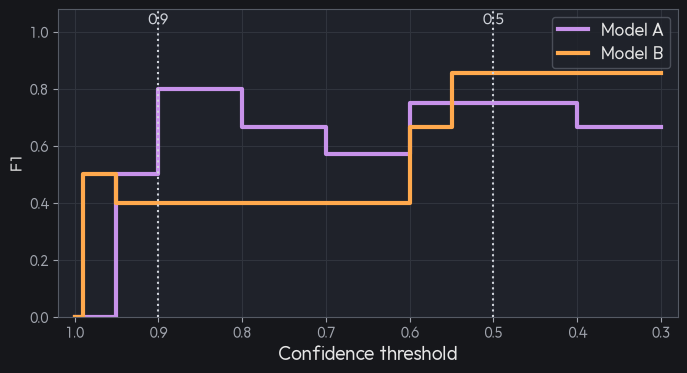

At Confidence Threshold = 0.9, model A comes out ahead, while at Confidence Threshold = 0.5, model B does. When comparing the two, setting the Confidence Threshold to 0.9 favors model A, and setting it to 0.5 favors model B.

So <u>**comparing model performance using only the F1-Score computed at a single fixed Confidence Threshold is unfair**</u>.

> **🤔 In practice, when serving a model to users, we fix the Confidence Threshold to a single value. So why can't we also fix it to one value and just look at F1 when comparing models?**
>
> 1. **Each model's Confidence scores have a different 'scale' (the Calibration problem)**
>
>    Fixing both models at `Confidence = 0.5` and comparing them is actually **an unfair match**.
>
>    - **Model A:** Tends to output high confidence, usually around 0.8\~0.9, when it finds an answer.
>    - **Model B:** Finds answers very well, but the model itself is timid and tends to output low confidence around 0.4 for correct answers. (It does, however, give wrong answers a clearly low 0.1.)
>
>    If you fix these two models at `Threshold = 0.5` and compare F1, Model B finds every answer yet gets unfairly eliminated because its scores are low. Model B's optimal threshold might have been 0.3.
>
> 2. **The process of 'finding' the optimal fixed threshold**
>
>    You might think, "Can't we just fix one threshold according to what the model is used for?" But **whether that 'optimal fixed threshold' is 0.3, 0.5, or 0.8 can only be known by drawing the whole PR Curve.**
>
>    The very process of testing every threshold from 0 to 1 becomes the process of uncovering the highest-F1 point that achieves the service goal you want (e.g., guaranteeing Recall ≥ 0.99). In other words, you have to see the whole thing (AP) before you can pick the best single point (optimal F1).
>
> 3. **Proving general baseline fitness (Generalization)**
>
>    Researchers who build open-source models (YOLO, SSD, Faster R-CNN, etc.) or write papers can't know whether the model will be used for 'medical purposes (High Recall)' or 'defect inspection (High Precision)'.
>
>    So rather than an evaluation biased toward a specific purpose (a specific threshold), they need to prove overall baseline fitness: "however you set the threshold for whatever purpose, this model maintains an excellent balance overall."

That's why we had <u>**AU-ROC**</u>, which shows a model's performance across all thresholds. It seems like we could just use AU-ROC for object detection too — but can we?

The answer is <u>**‘NO’**</u>. Why can't we use AU-ROC?

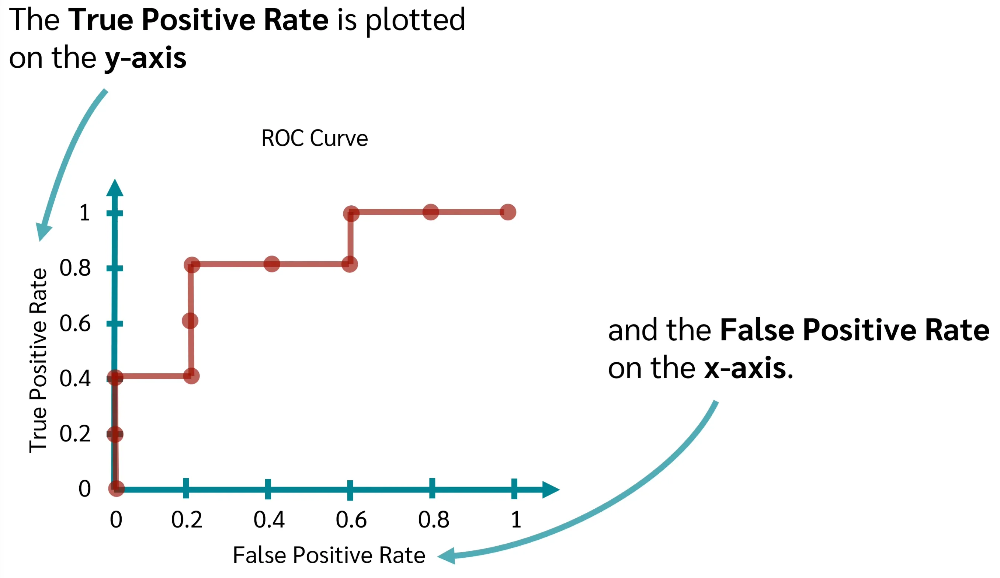

As in the figure above, AU-ROC uses **FPR** (**False Positive Rate) on the x-axis.** But computing it requires $TN$.

$$
\text{FPR} = \frac{\text{FP}}{\text{FP} + \text{TN}}
$$

But in an object detection image, the empty background (TN) is close to infinitely large. Once the TN in the denominator blows up to infinity, no matter how many garbage false alarms (FP) the model produces, <u>**the FPR always converges to 0**</u>. Because of this, even a terrible object detection model <u>**produces a ROC Curve stuck tightly to the top-left, as if it were a perfect model**</u>. It loses all discriminative power.

So we needed a single metric that works for object detection while showing the model's performance across all Confidence Thresholds. What was devised for this is <u>**AP (Average Precision)**</u>.

## 4. Let's use AP (Average Precision)!

AP is <u>**the area under the graph (Area Under Curve) when you plot how Precision and Recall change as you vary the model's Confidence threshold (the PR Curve)**</u>. Because AP draws the entire curve using only Precision and Recall — neither of which includes TN in its formula — it can serve as the most honest and accurate report card in settings with extreme class imbalance (few objects vs. infinite background), like object detection.

Let's bring back the example from Section 2. <u>**Suppose that with Confidence Threshold = 0.3, TP, FP, and FN came out as follows.**</u>

In this case, Precision and Recall are computed as follows.

- $\text{Confidence Threshold} = 0.3$
  - $Precision = 3 / (3 + 3) = 0.5$
  - $Recall= 3 / (3 + 0) = 1.0$

> **📌 Precision and Recall formulas**
>
> $$
> \text{Precision} = \frac{\text{TP}}{\text{TP} + \text{FP}}
> $$
>
> $$
> \text{Recall} = \frac{\text{TP}}{\text{TP} + \text{FN}}
> $$

What happens if the Confidence Threshold is 0.5?

- $\text{Confidence Threshold} = 0.5$

  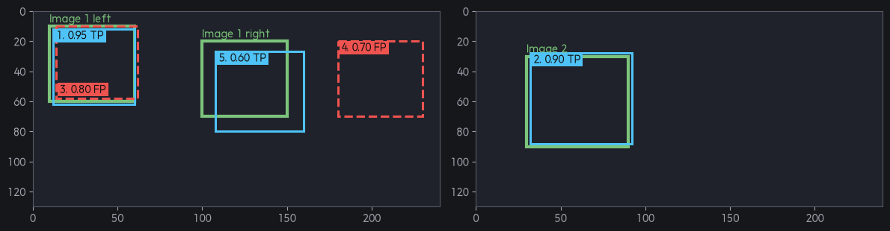

  - $Precision = 3 / (3 + 2) = 0.6$
  - $Recall= 3 / (3 + 0) = 1.0$

Precision went up. Let's raise the Confidence to 0.7 and 0.9 and check.

- $\text{Confidence Threshold} = 0.7$

  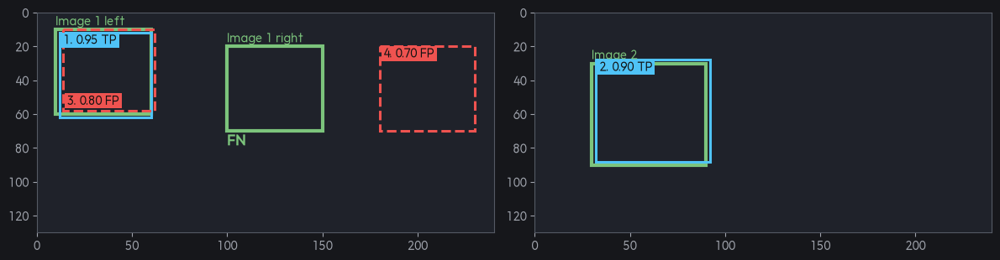

  - $Precision = 2 / (2 + 2) = 0.5$
  - $Recall= 2 / (2 + 1) = 0.67$

- $\text{Confidence Threshold} = 0.9$

  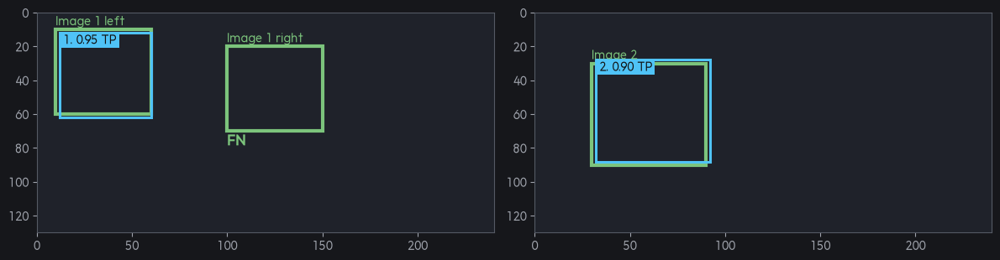

  - $Precision = 2 / (2 + 0) = 1.0$
  - $Recall= 2 / (2 + 1) = 0.67$

In other words, if we compute Precision and Recall for each Confidence Threshold this way and plot them, we can draw a PR Curve like the following.

| Confidence Threshold | Precision | Recall |
| --- | --- | --- |
| 0.95 | 1.0 | 0.33 |
| 0.90 | 1.0 | 0.67 |
| 0.80 | 0.67 | 0.67 |
| 0.70 | 0.5 | 0.67 |
| 0.60 | 0.6 | 1.0 |
| 0.40 | 0.5 | 1.0 |

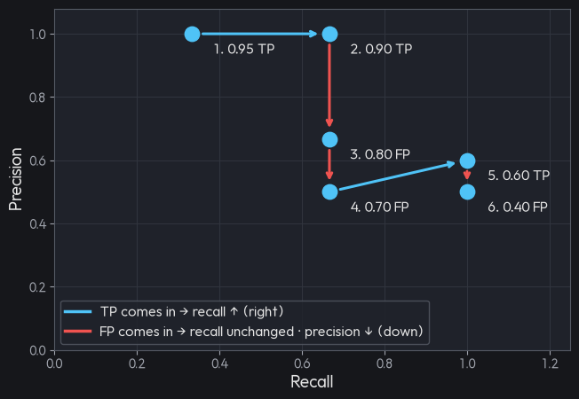

A perfect model would find every hidden answer and <u>**keep Precision at 1.0 without a single wrong answer, all the way until Recall reaches 1.0**</u>. In that case, a full square of width 1 and height 1 is drawn, with an area of 1.0. On the other hand, if the model pushes a little too hard to find answers — that is, <u>**if it starts pouring out wrong answers (FP) while trying to raise Recall, the vertical axis (Precision) drops**</u>. As a result, the top-right of the square gets carved away and the area shrinks.

In other words, to summarize a model's performance as a single number, we need to compute the area under the PR Curve.

> **🤔 We're computing an area, so why is it called AP (Average Precision)?**
>
> In a PR Curve, the horizontal axis is Recall and the vertical axis is Precision. Computing the area under this 2D graph (integration) is mathematically the same as "averaging Precision over all Recall intervals."
>
> - **Area = Average Precision (AP):** Slicing Recall very finely from 0.0 to 1.0 (by varying the threshold) and averaging all the Precision values at each point gives exactly the area.

Here we plotted only 6 Confidence Thresholds, but <u>**if we make these intervals very fine**</u>, we can connect them into a line like the graph below.

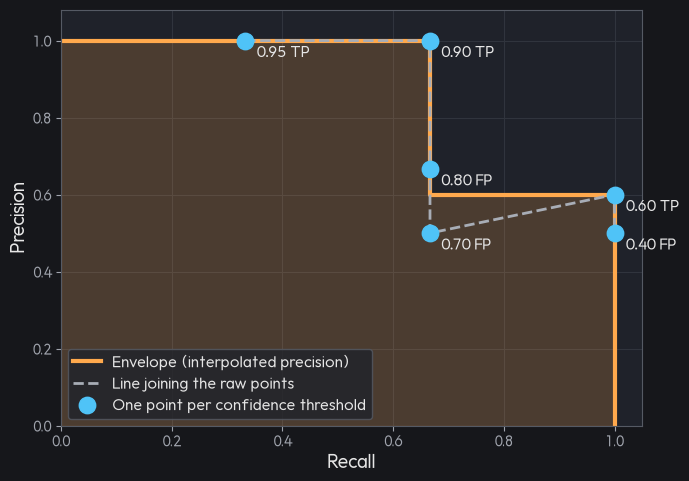

> **📌 Interpolation and the envelope**
>
> If you look closely at the graph above, the curve doesn't descend smoothly; it's <u>**a sawtooth shape that rises once again in the middle**</u>. Going from point 4 (Recall 0.67, Precision 0.5) to point 5 (Recall 1.0, Precision 0.6), Precision actually went up. Precision had been dropping as FPs piled up, then recovered when a new TP came in.
>
> But let's think about point 4 for a moment. At point 4, Recall is 0.67 and Precision is 0.5, but lowering the Confidence Threshold a bit more **increases Recall to 1.0 and also raises Precision to 0.6.** Both get better, so there's no reason to stop at point 4, right? So when computing AP, we replace the Precision at each Recall point as follows.
>
> That is, we replace it with <u>**"the maximum Precision among those obtained at Recall values at or beyond that point."**</u> Put in words, it means "the best Precision you can get when you want to secure at least r Recall." This process is called <u>**Interpolation**</u>.
>
> Applied to our example:
>
> - Recall 0 \~ 0.67 interval: max of the Precisions to the right (1.0, 1.0, 0.67, 0.5, 0.6, 0.5) → **1.0**
> - Recall 0.67 \~ 1.0 interval: max of the Precisions to the right (0.6, 0.5) → **0.6**
>
> Interpolating like this removes the sawtooth and creates a **staircase-shaped outline** that covers the original curve from above. This outline is called the <u>**Envelope**</u>. Since the envelope always goes down or stays flat as it moves right, computing the area becomes much cleaner.

Computing the area here gives exactly the AP! In this case it came out to 0.8667.

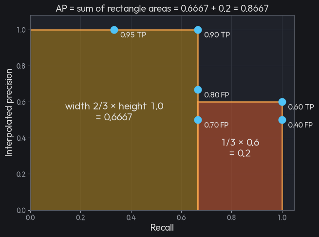

> **🤔 How to compute AP: all-point VS 11-point VS 101-point**
>
> Once you've drawn the envelope, you just need the area under it, and there are three methods depending on **how you approximate** that area.
>
> 1. **11-point (Pascal VOC 2007)**
>    - Look at Recall only at **11 points** — 0.0, 0.1, 0.2, …, 1.0 — and average the interpolated Precision at each point.
>    - Applied to our example, the 7 points from 0.0\~0.6 are 1.0 and the 4 points from 0.7\~1.0 are 0.6, so  $\text{AP} = \frac{1.0 \times 7 + 0.6 \times 4}{11} = 0.8545$
> 2. **all-point (Pascal VOC 2010 and later)**
>    - Without fixing points in advance, it exactly sums the rectangle areas under the envelope at **every point where Recall actually changes**.
>    - This is the method used above.  $\text{AP} = 0.667 \times 1.0 + 0.333 \times 0.6 = 0.8667$
> 3. **101-point (COCO)**
>    - Divide Recall finely into **101 points** — 0.00, 0.01, …, 1.00 — and average.
>    - The 67 points from 0.00\~0.66 are 1.0 and the 34 points from 0.67\~1.00 are 0.6, so
>
>      $\text{AP} = \frac{1.0 \times 67 + 0.6 \times 34}{101} = 0.8653$
>
> Even for the same PR Curve, <u>**AP comes out slightly different depending on the computation method.**</u> 11-point has sparse points and thus a larger error, while 101-point comes very close to all-point. So when comparing AP across papers or reports, **the comparison is only fair if the same method was used**. I'll summarize this again in Section 6.

However, the AP we just computed is only for the red blood cell class at IoU Threshold = 0.5. In other words, it only represents performance for a single class.

<u>**But the ultimate goal of the model we're building is to detect all three objects: red blood cells, white blood cells, and platelets.**</u>

## 5. mAP (mean Average Precision)

To find all three objects — red blood cells, white blood cells, and platelets — at once, we can use <u><strong>the value obtained by computing the AP for every class the model has to detect and then taking their average (mean)</strong></u>.

If we ran exactly the same process as above for all three classes and got the following APs,

- Red blood cell AP: 86.67%
- White blood cell AP: 95.54%
- Platelet AP: 72.15%

then $\text{mAP} = (\frac{86.67+95.54+72.15}{3})\% = 84.79\%$.

### 5.1. What happens if the IoU Threshold changes?

When I started the example in Section 2.5, I fixed the IoU Threshold at 0.5. In other words, I started by setting the criterion for how much the ground-truth bbox and predicted bbox must overlap to count as a TP.

So what happens if the IoU Threshold changes?

- **When IoU Threshold < 0.5:**
  - The criterion is lenient, so <u>**TPs increase and FPs decrease.**</u>
- **When IoU Threshold = 0.5:**
  - A prediction counts as "correct (TP)" if its location overlaps by just 50%.
- **When IoU Threshold > 0.5:**
  - The criterion becomes strict, so predictions that are slightly off in location are all **reclassified as FP (wrong)**.
  - That is, <u>**TPs decrease and FPs increase.**</u>

The vertical axis of the PR Curve is **Precision(**$\frac{\text{TP}}{\text{TP} + \text{FP}}$**)**, and the horizontal axis is **Recall(**$\frac{\text{TP}}{\text{TP + FN}}$**)**.

| Prediction (conf) | Overlapping answer | IoU | @0.25 | @0.5 | @0.75 |
| --- | --- | --- | --- | --- | --- |
| 0.95 | A | 0.82 | TP | TP | TP |
| 0.90 | B | 0.61 | TP | TP | **FP** |
| 0.80 | C | 0.38 | **TP** | FP | FP |
| 0.70 | None (background) | 0.12 | FP | FP | FP |
| 0.60 | C | 0.78 | **FP** (C already matched) | TP | TP |
| 0.40 | A (duplicate) | 0.30 | FP | FP | FP |

Looking at the table above, some predictions that were TP turn into FP as we move the IoU Threshold to 0.25, 0.5, and 0.75. In other words, <u>**even for the exact same predictions from the same model, the shape of the PR Curve changes a lot depending on the IoU threshold**</u>.

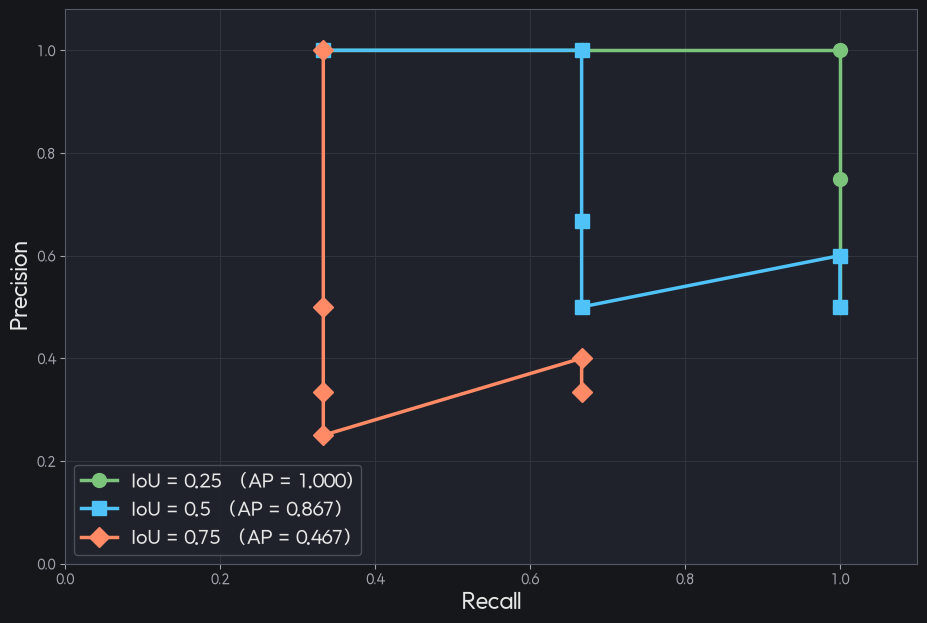

## 6. What to specify when using AP

Putting together everything so far, AP is heavily affected by the following values.

- Minimum Confidence Threshold
- IoU Threshold
- AP computation method (all-point VS 11-point VS 101-point)

So to evaluate a model's performance with mAP, you need to specify which of these values you used.

> **📌 NOTE: When computing AP, set the Confidence lower bound low, close to 0.**
>
> We obtained AP by drawing the PR curve while lowering the Confidence Threshold. But what happens if we set the Minimum Confidence Threshold — <u>**that is, the Confidence lower bound — high, say to 0.75?**</u> Then the PR Curve is cut off at Confidence 0.75. The recall interval beyond that is counted as having zero area.
>
> Recomputing AP at IoU Threshold = 0.5:
>
> | First-round confidence cut | Surviving predictions | Recall reached | AP |
> | --- | --- | --- | --- |
> | 0.001 (effectively none) | All 6 | 1.0 | 0.867 |
> | 0.75 | 0.95, 0.90, 0.80 | 0.667 | 0.667 |
>
> As the 0.60 TP gets cut off, the 0.2 area of the recall 0.67\~1.0 interval disappears entirely. The model found that object, but the evaluation settings made it invisible.
>
> **🤔 If we evaluate with every confidence kept, won't FPs increase and hurt AP?**
>
> It seems like FPs would pile up, but AP barely loses anything. Low-confidence predictions end up at the very end when sorted. So the front part of the already-drawn curve doesn't change; the curve just extends to the right. Let's add two points below the 6th Confidence Threshold.
>
> | Rank | conf | Judgment | Recall | Precision |
> | --- | --- | --- | --- | --- |
> | 1 | 0.95 | TP | 0.33 | 1.00 |
> | 2 | 0.90 | TP | 0.67 | 1.00 |
> | 3 | 0.80 | FP | 0.67 | 0.67 |
> | 4 | 0.70 | FP | 0.67 | 0.50 |
> | 5 | 0.60 | TP | 1.00 | 0.60 |
> | 6 | 0.40 | FP | 1.00 | 0.50 |
> | 7 (added) | 0.30 | FP | 1.00 | 0.43 |
> | 8 (added) | 0.20 | FP | 1.00 | 0.38 |
>
> Rows 1\~6 haven't changed a single character. Rows 7 and 8 just add points where only Precision drops further at the Recall 1.0 position.
>
> Moreover, because <u>**interpolation uses, for each recall point, the maximum precision among those at recall values at or beyond that point**</u>, adding predictions at the end can never decrease AP. It either goes up or stays the same. The added rows 7 and 8 (0.43, 0.38) are smaller than the existing 0.60, so they can't change the maximum of any interval. Besides, FPs don't increase recall, so <u>**they're just vertical drops with zero width**</u>. AP stays at 0.867.
>
> The reason we don't set it all the way to 0 is computational cost. If tens of thousands of garbage boxes come out, matching gets slow.

## 7. Pascal VOC vs. COCO evaluation

The standard protocols for evaluating object detection performance are the **PascalVOC** and **COCO** challenges. They differ in <u><strong>how strictly IoU is applied</strong></u>, <u><strong>how the PR Curve is interpolated</strong></u>, and <u><strong>whether evaluation by object size is supported</strong></u>.

1. **Difference in how IoU is applied**
   - **Pascal VOC:**
     - Uses $\text{IoU} \ge 0.5$ **as its one and only criterion**.
       - Usually written as $\text{mAP}_{50}$.
     - Since it counts a prediction as "correct (TP)" if it overlaps the answer by just 50%, a model can score high even without positioning boxes very precisely.
   - **COCO:**
     - Applies **a total of 10 IoU thresholds** from $\text{IoU} = 0.50$ **to** $0.95$ **in steps of** $0.05$ ($0.50, 0.55, 0.60, \dots, 0.95$).
     - It computes the area (AP) of the 10 PR Curves drawn at each of the 10 IoU criteria, and reports **the average of these 10 APs** as the final score. This is written as $\text{mAP}@[.5:.95]$.
     - If boxes are positioned roughly, the score drops sharply in the IoU 0.75 or 0.85 range, so it <u>**strictly evaluates the localization accuracy of Bounding Boxes**</u>.
2. **Difference in PR Curve computation and interpolation** The algorithm for quantifying the area under the PR Curve (AP) also differs.
   - **Pascal VOC:**
     - **VOC 2007 (11-point interpolation):** Divided the Recall range into 11 points ($0.0, 0.1, 0.2, \dots, 1.0$) and averaged the maximum Precision values appearing at or beyond each Recall point.
     - **VOC 2010 (Continuous area integration):** To eliminate the error from simplifying to 11 points, it built a staircase outline (Envelope) connecting the Maximum Precision of the region to the right over the entire continuous PR Curve, and computed the actual integrated area.
   - **COCO (101-point interpolation):**
     - Divides the Recall range very finely into **101 points** ($0.00, 0.01, 0.02, \dots, 1.00$) and averages the maximum Precision at each point.
     - It has the advantage of being very precise, close to continuous integration, while being simple to implement.
3. **Fine-grained evaluation by object size and detection limits**
   - **Pascal VOC:**
     - Regardless of the size (small/medium/large) or number of objects in an image, it <u>**provides only a single metric: the overall average mAP**</u>.
   - **COCO:**
     - As **small object detection performance** became more important in settings like autonomous driving and CCTV, it <u>**breaks the metric down by object area (number of pixels)**</u>.
       - $\text{AP}_S$ **(Small):** small objects with area under $32^2$ pixels
       - $\text{AP}_M$ **(Medium):** medium objects with area from $32^2$ up to $96^2$
       - $\text{AP}_L$ **(Large):** large objects with area over $96^2$ pixels
     - It also provides recall metrics such as $\text{AR}_{\text{max}=1}$, $\text{AR}_{\text{max}=10}$, and $\text{AR}_{\text{max}=100}$, which measure recall when the maximum number of Bounding Boxes predicted per image is limited.

## 📚 References

- [Mean Average Precision (mAP) \| Explanation and Implementation for Object Detection](https://www.youtube.com/watch?v=duBGmrxNHS8)
- [What is Mean Average Precision (mAP)?](https://www.youtube.com/watch?v=oqXDdxF_Wuw&list=LL&index=2)
- [Mean Average Precision (mAP) Explained and PyTorch Implementation](https://www.youtube.com/watch?v=FppOzcDvaDI)
- [https://github.com/matin-ghorbani/IoU-from-Scratch](https://github.com/matin-ghorbani/IoU-from-Scratch)
- [Non-Maximum Suppression (NMS) Explained](https://datature.io/glossary/non-maximum-suppression-nms)
