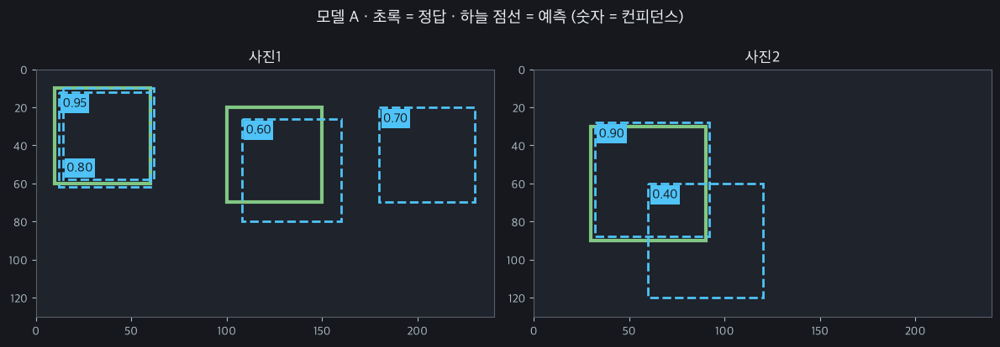
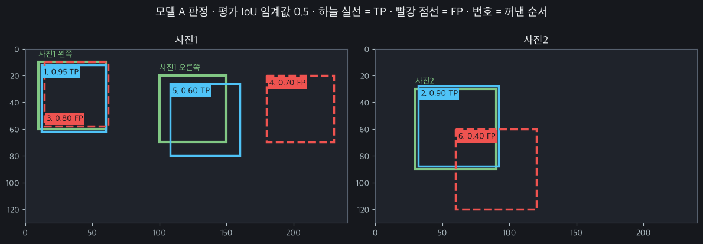
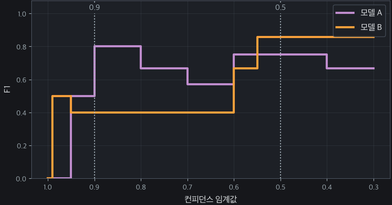
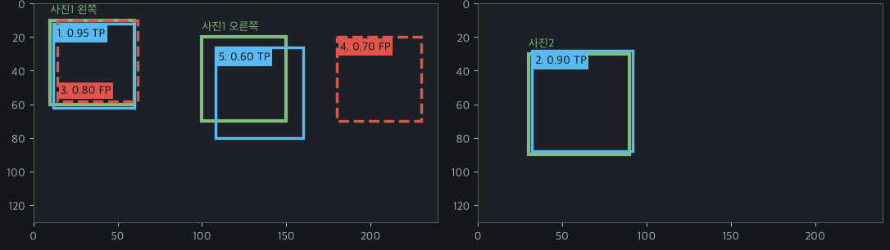
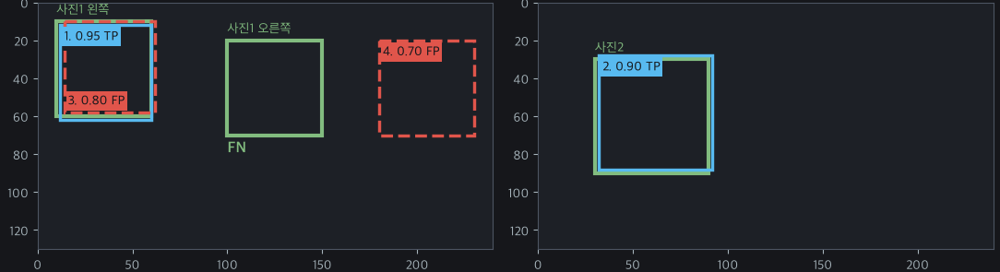
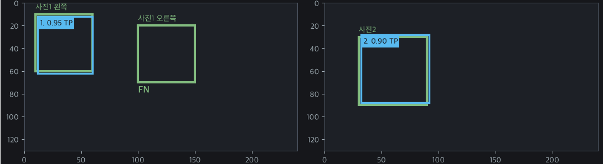
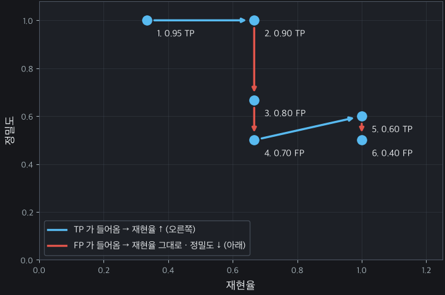
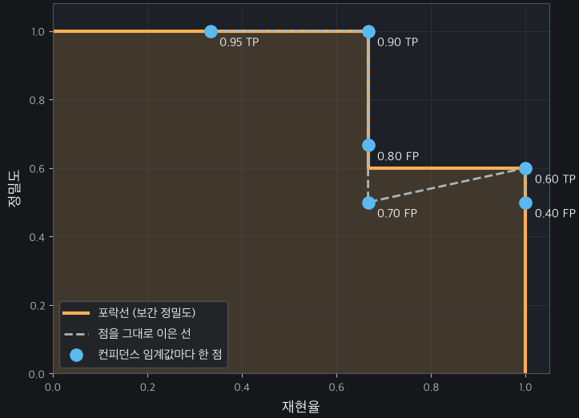
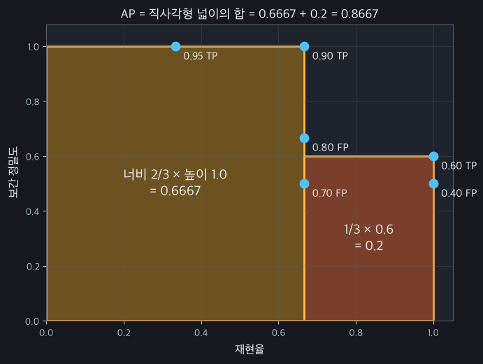
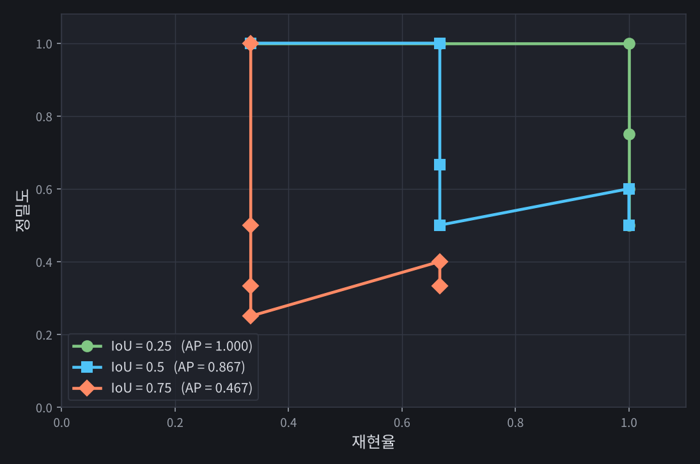

## 0. 들어가며

[이전 포스트](/posts/ai/accuracy-precision-recall-f1-auroc/)에서는 <u>**분류(Classification)**</u> 과제에서의 평가지표로 <u>**혼동행렬(Confusion Matrix)**</u>과, 거기서 계산할 수 있는 <u>**정밀도(Precision)**</u>, <u>**재현율(Recall)**</u>, <u>**F1-Score**</u>, 그리고 <u>**AU-ROC Curve**</u>까지 살펴봤습니다. 불량 탐지나 이미지 분류와 같은 분류 과제에서는 이런 평가지표를 활용해서 모델의 성능을 측정할 수 있었습니다.

그렇다면 <u>**객체 탐지(Object Detection)**</u> 과제에서는 어떨까요? 객체탐지 과제에서는 <u>**“어디에(Location)”**</u> 있는지 경계 상자(Bounding Box, bbox)를 그리고, 그 상자 안의 객체가 <u>**“무엇인지(Class)”**</u>까지 동시에 맞춰야 합니다. 따라서 <u>**위치의 정확도와 분류의 정확도를 모두 반영할 수 있는 평가 지표**</u>가 필요한 것이죠.

오늘 포스트에서는 그 핵심이 되는 <u>**AP(Average Precision)**</u>와 <u>**mAP(mean Average Precision)**</u>를 소개드리겠습니다.

## 1. 객체 탐지 결과를 눈으로 평가해보자

혈액 사진을 보고, 그 중 어떤 게 적혈구(Red Blood Cell), 백혈구(White Blood Cell), 그리고 혈소판(Platelets)인지 탐지하는 모델을 만든다고 가정해보겠습니다. 그리고 같은 Training dataset으로 훈련된 두 모델에게 같은 Test dataset을 먹여서 예측 결과를 눈으로 확인해봤습니다.

| YOLOv3 | EfficientDet-D0 |
| --- | --- |
|  |  |

YOLO의 결과부터 봅시다. 적혈구들을 빠짐없이 잘 탐지했고, 혈소판과 백혈구도 잘 탐지한 것 같습니다. 서로 겹치는 박스도 안 보이구요. 반면 EfficientDet을 보면, 대체로 YOLO의 결과와 비슷한데, 중간쯤에 분명 두 개의 적혈구가 있는데, bbox를 하나 더 겹치게 그려놓은 게 보이네요. 이 이미지 하나만 보면 YOLOv3가 성능이 더 좋다고 판단하고 YOLOv3를 고르겠다고 판단할 수 있겠습니다.

하지만, 당연히 수많은 Test dataset 결과에 대해서 이런 식으로 하나하나 판단할 수는 없겠죠. 아마 <u>**모든 Test dataset에 대한 모델의 모든 추론 결과를 자동으로(Programmatically) 평가할 수 있는 어떤 수단**</u>이 필요할 겁니다.

## 2. 객체 탐지에서의 혼동행렬(Confusion Matrix)

자동으로(Programmatically) 평가하기 위해서는, 수학적 기준이 필요하죠, 그리고 그 때 사용할 수 있는 게 바로 <u>**혼동행렬(Confusion Matrix)**</u>입니다. 하지만, 분류 과제에서 쓰던 혼동행렬을 객체 탐지 과제에서 그대로 쓸 수 있을까요?

분류 과제에서는 사진 한 장에 답 하나가 매치되어있었습니다. 하지만 <u>**객체 탐지 과제에서는 사진 한 장에 정답 박스도 여러개고, 예측 박스도 여러개**</u>죠. 그래서 혼동행렬을 구성하는 TP, FP, FN, TN을 판단하는 기준이 분류과제보다 살짝 까다롭습니다. 이제부터 그 과정을 살펴보겠습니다.

> **📌 NOTE**
>
> 객체 탐지 평가의 전체 파이프라인은 다음과 같습니다.
>
> - **1단계: 1차 생존자 선별 (Confidence Threshold):** 모델이 뱉어낸 수만 개의 예측 박스 중, <u>**Confidence Threshold**</u>를 넘지 못하는 박스는 평가 대상에서 아예 제외됩니다.
> - **2단계: 중복 박스 정리 (NMS):** 살아남은 박스들 중 동일한 객체를 가리키며 심하게 겹쳐 있는 박스들을 <u>**NMS Threshold**</u>로 걸러내어, 가장 확실한 대표 박스 1개씩만 남깁니다.
> - **3단계: 정답 채점 (TP / FP 판정):** 최종 생존한 예측 박스들을 실제 정답(Ground Truth)과 비교합니다. <u>**IoU Threshold**</u>**와** <u>**Class 일치**</u> **조건**을 모두 통과하면 **TP**, 하나라도 실패하면 **FP**가 됩니다.
> - **4단계: 놓친 정답 결산 (FN 판정):** 모든 채점이 끝난 후, 모델이 예측한 어떤 박스와도 짝을 맺지 못하고(IoU Threshold을 만족하는 예측이 없어서) 홀로 남겨진 실제 정답 객체들은 모두 <strong>FN(미탐)</strong>으로 최종 집계됩니다.

본격적으로 객체 탐지에서의 혼동행렬 계산에 대해서 알아보기 전에, 필수적으로 훑어봐야 하는 개념들 먼저 살펴보겠습니다. 

### 2.1. Confidence Threshold

모델이 추론을 마치면, 수천, 수만 개의 bbox를 쏟아냅니다. 이 때, 각각의 bbox에는 여기에 객체가 존재한다는 <u>**확신(Confidence)**</u>이 태그처럼 붙어있습니다. 모델이 쏟아내는 모든 bbox를 고려할 수는 없으니, 그 중 Confidence가 <u>**임계치(Threshold)보다 작은 예측 박스는 모조리 무시**</u>되며, 오직 이 임계치(Threshold)를 넘긴 예측 박스들만 남게 됩니다.

### 2.2. IoU(Intersection over Union)

IoU는 두 bbox가 얼마나 겹쳤는지를 판단하기 위해 사용하는 지표입니다. 두 박스의 교집합을 합집합으로 나눈 값으로 정의됩니다. 즉, <u>**합집합은 더 작고, 교집합은 더 클 수록 IoU가 높아**</u>지겠죠?

### 2.3. NMS(Non-Maximum Suppression)

NMS는 동일한 객체에 중복으로 생성된 여러 개의 bbox 중 가장 정확한 박스 하나만 남기고 나머지를 제거하는 후처리 기법입니다. NMS의 동작 방식은 다음과 같습니다.

1. **Confidence Threshold 필터링:** 설정된 기준(예: 0.5, 0.001)보다 낮은 신뢰도 점수를 가진 바운딩 박스를 먼저 제거합니다.
2. **내림차순 정렬:** 남은 박스들을 신뢰도 점수가 높은 순서대로 정렬합니다.
3. **최고 점수 선택 및 IoU 계산:** 가장 높은 점수를 가진 박스를 선택하고, 이 박스와 나머지 박스들 간의 **IoU**를 각각 계산합니다.
4. **중복 박스 억제(Suppression):** 선택된 박스와의 IoU가 <u>**임계값(NMS Threshold)**</u>을 초과하는(많이 겹치는) 주변 박스들을 제거합니다.
5. **반복:** 리스트에 남은 박스가 없을 때까지 위 과정을 반복하여 최종 바운딩 박스 집합을 완성합니다.

> **📌 NOTE: NMS의 여러 방식**
>
> 위에서 설명한 기본 NMS는 IoU가 임계값을 넘으면 박스를 **무조건 삭제**합니다. 이 방식에는 몇 가지 한계가 있어서, 이를 보완한 여러 변형 기법이 등장했습니다.
>
> - <u>**Soft-NMS**</u>
>   - 겹치는 박스를 바로 삭제하지 않고, **IoU가 클수록 Confidence를 점점 깎는** 방식입니다.
>   - 사람들이 붙어 서 있는 사진처럼 **서로 다른 객체가 많이 겹쳐 있을 때**, 진짜 객체를 실수로 지워버리는 일을 줄여서 Recall을 높여줍니다.
> - <u>**DIoU-NMS**</u>
>   - IoU뿐만 아니라 **두 박스 중심점 사이의 거리**도 함께 고려합니다.
>   - 많이 겹쳐도 중심점이 멀리 떨어져 있으면 **서로 다른 객체일 가능성이 높다**고 보고 남겨둡니다.
> - <u>**Class-aware NMS**</u>
>   - NMS를 **클래스별로 따로** 수행합니다.
>   - 예를 들어 백혈구 박스와 적혈구 박스가 많이 겹쳐 있더라도, **클래스가 다르면 서로 지우지 않습니다.** 현재 대부분의 탐지 프레임워크가 기본으로 이 방식을 사용합니다.
>
> 최근에는 **DETR, RT-DETR, YOLO26**처럼 **NMS 없이** 동작하는 모델도 나왔습니다. 이 모델들은 학습할 때 객체 하나당 예측 박스 하나만 짝지어 주는 방식(일대일 매칭)을 사용합니다. 그래서 애초에 중복 박스를 만들지 않도록 학습되어, 후처리 단계에서 NMS가 필요 없는 거죠.

### 2.4. TP, FP, FN 판단

| **지표** | **직관적 의미** | **박스 예측** | **객체 존재 여부** | **IoU 및 Class 조건** |
| --- | --- | --- | --- | --- |
| **TP(True Positive)** | 제대로 찾음 | O | O | IoU Threshold 이상 <strong>AND</strong> Class 일치 |
| **FP(False Positive)** | 헛다리 짚음 (오탐) | O | X (또는 조건 미달) | IoU Threshold 미달 <strong>OR</strong> Class 불일치 <strong>OR</strong> 배경 착각 <strong>OR</strong> 중복 |
| **FN(False Negative)** | 놓침 (미탐) | X | O | 매칭된 예측 박스 없음 |
| **TN(True Negative)** | - | - | - | **(객체 탐지 평가에서 사용 안 함)** |

1. **TP (True Positive) : "제대로 찾은 경우"**

   모델이 객체라고 예측한 것 중, **실제 정답(Ground Truth)과 일치**하는 탐지입니다. TP로 인정받으려면 다음 두 가지 조건을 모두 만족해야 합니다.

   - **위치 조건:** 예측 박스와 실제 정답 박스의 <u>**IoU가 설정한 IoU Threshold(예: 0.5) 이상**</u>이어야 합니다.
   - **분류 조건:** <u>**예측한 클래스가 실제 정답 클래스와 동일**</u>해야 합니다.

2. **FP (False Positive) : "잘못 찾은 경우 (오탐)"**

   모델이 무언가를 찾아내서 박스를 그렸지만, **결과적으로 틀린 예측**이 된 경우입니다. 가장 흔하게 발생하는 에러이며, 다음 상황 중 하나라도 해당되면 FP로 처리됩니다.

   - **위치 오류 (Localization Error):** 클래스는 맞혔지만, 엉뚱한 곳을 짚어 <u>**IoU Threshold를 넘지 못한 경우**</u>.
   - **분류 오류 (Classification Error):** 위치는 기가 막히게 찾았는데(IoU 통과), <u>**클래스를 잘못 분류**</u>한 경우.
   - **배경 오류 (Background Error):** 아무것도 없는 <u>**빈 배경**</u>의 나뭇잎이나 그림자를 <u>**객체로 착각**</u>하여 박스를 그린 경우.
   - **중복 탐지 (Duplicate Detection):** 하나의 정답 객체에 모델이 박스를 2개 이상 그렸을 때(NMS로 걸러지지 않은 경우), 가장 IoU가 높은 예측 하나만 TP가 되고 <u>**나머지 잉여 예측들은 전부 FP**</u>가 됩니다.

3. **FN (False Negative) : "놓친 경우 (미탐지)"**

   사진 속에 분명히 **실제 객체(정답)가 존재하는데, 모델이 이를 아예 찾아내지 못한 경우**입니다.

   - 모델이 해당 <u>**객체 주변에 아무런 박스도 그리지 않았거나,**</u>
   - 박스를 그리긴 했지만, 그 예측들이 모두 다른 이유(위치 오류, 분류 오류 등)로 FP 판정을 받아버려서 <u>**정답과 매칭될 예측이 하나도 남아있지 않은 상태**</u>를 말합니다.

4. **TN (True Negative) : "진짜 음성 (객체 탐지에서는 안 씀)"**

   <u>**객체 탐지 분야에서는 TN이라는 개념을 아예 사용하지 않거나 무시합니다.**</u>

   - **이유:** TN은 "객체가 없는 곳을 없다고 올바르게 판단한 횟수"입니다. 하지만 이미지 내에서 객체가 존재하지 않는 무의미한 배경(Background) 공간은 **무한히 많습니다**.

   "이 허공에도 객체가 없고, 저 타이어 옆 땅바닥에도 객체가 없네, 정답!" 하면서 <u>**무한대의 TN 개수를 세는 것은 불가능**</u>할뿐더러 성능 평가에 아무런 도움도 되지 않기 때문입니다.

### 2.5. TP, FP, FN 판단 예시

- 대상 모델: YOLOv3
- 대상 클래스: 적혈구
- IoU Threshold = 0.5

위 사진과 같은 예측 결과가 나왔다고 합시다. 혼동행렬을 완성하는 과정은 다음과 같습니다.

1. **Confidence 0.95 예측: TP**
   - 정답1과 IoU 0.89 ≥ IoU Threshold(0.5) **AND** Class 일치
2. **Confidence 0.90 예측: TP**
   - 정답3과 IoU 0.88 ≥ IoU Threshold(0.5) **AND** Class 일치
3. **Confidence 0.80 예측: FP**
   - 정답1과 IoU 0.85 ≥ IoU Threshold(0.5)
   - 하지만 이미 정답1은 짝을 맺은 예측이 있음. → **중복 탐지 (Duplicate Detection)**
4. **Confidence 0.70 예측: FP**
   - 겹치는 정답 없음
5. **Confidence 0.60 예측: TP**
   - 정답2와 IoU 0.53 ≥ IoU Threshold(0.5) **AND** Class 일치
6. **Confidence 0.40 예측: FP**
   - 정답2와 IoU 0.14 < IoU Threshold(0.5) → **위치 오류 (Localization Error)**
   - 정답 2는 이미 짝을 맺은 예측이 있음(Confidence 0.60 예측) → **중복 탐지 (Duplicate Detection)**
7. **FN(미탐): 0**
   - 예측 6개를 전부 확인했을 때 짝이 없는 정답 0개.

이걸 사진 위에 표시하면 아래와 같이 표시할 수 있겠네요.

## 3. 객체 탐지에서 AU-ROC를 사용할 수 없을까?

TP, FP, FN을 계산할 수 있다면, Precision과 Recall을 계산할 수 있겠죠? 그리고 <u>**Precision**</u>과 <u>**Recall**</u>, 그리고 이들의 조화평균인 <strong>F1-Score</strong>를 구할 수도 있을 겁니다. 

> 📌 <strong>NOTE: Recall과 Precision의 관계</strong>
>
> Recall과 Precision은 trade-off가 있습니다. 하나가 늘면 하나가 줄어드는 관계를 갖고 있는 거죠.
>
> 자세한 내용은 [이전 포스트](/posts/ai/accuracy-precision-recall-f1-auroc/)를 참고해주세요.

하지만 F1-Score에는 치명적인 단점이 있습니다. <u>**특정 Confidence Threshold 단 하나에서의 성능만 보여준다**</u>는 점입니다.

두 객체탐지 모델, A와 B가 있다고 해봅시다. 모델A와 모델B의 F1-Score를 각 Confidence Threshold에 따라서 그래프로 그렸더니 다음과 같이 나왔다고 해봅시다.

Confidence Threshold=0.9에서는 모델 A가, Confidence Threshold=0.5에서는 모델B가 더 우세하네요. 이 둘을 비교할 때, Confidence Threshold를 0.9로 놓고 비교하면 모델A에게 유리해지고, 0.5로 놓고 비교하면 모델 B에게 유리할 겁니다.

따라서 <u>**하나의 고정된 Confidence Threshold를 놓고, 거기서 계산된 F1-Score만으로 모델의 성능을 비교하는 건 불공정**</u>한 거죠.

> **🤔 실무에서 모델을 사용자 대상으로 서빙할 때는 Confidence Threshold를 하나로 고정해놓고 사용하는데, 모델을 비교할 때도 Confidence Threshold를 하나로 고정해놓고 F1만 보면 안되는 걸까?**
>
> 1. **모델마다 Confidence 점수의 '스케일'이 다름 (Calibration 문제)**
>
>    두 모델을 동일하게 `Confidence = 0.5`로 고정해 놓고 비교하는 것은 사실 **불공평한 시합**입니다.
>
>    - **Model A:** 정답을 찾았을 때 대체로 0.8\~0.9의 높은 확신도를 뱉어내는 성향이 있습니다.
>    - **Model B:** 정답을 아주 잘 찾지만, 모델 자체가 소심해서 정답에 대해 0.4 수준의 낮은 확신도를 뱉어내는 성향이 있습니다. (단, 오답에 대해서는 0.1로 확실히 낮게 줍니다.)
>
>    이 두 모델을 `Threshold = 0.5`로 고정하고 F1을 비교하면 Model B는 정답을 다 찾고도 점수가 낮아서 억울하게 탈락합니다. Model B의 최적 임계치는 0.3이었을 수 있습니다.
>
> 2. **최적의 고정 임계치를 '찾기 위한' 과정**
>
>    "모델을 쓰는 목적에 따라 하나의 임계치를 고정해 놓고 쓰면 되지 않느냐"고 생각할 수 있습니다. 하지만 그 **'최적의 고정 임계치'가 0.3일지, 0.5일지, 0.8일지는 PR Curve를 전부 그려봐야만 알 수 있습니다.**
>
>    임계치를 0부터 1까지 전부 테스트하는 과정 자체가, 내가 원하는 서비스 목적(예: Recall 0.99 이상 보장)을 달성할 수 있는 가장 높은 F1 지점을 발굴하는 과정이 됩니다. 즉, 전체를 다(AP) 봐야 그중 가장 좋은 하나(최적 F1)를 고를 수 있습니다.
>
> 3. **범용적인 기초 체력(Generalization) 증명**
>
>    오픈소스 모델(YOLO, SSD, Faster R-CNN 등)을 만들거나 논문을 쓰는 연구자들은 이 모델이 '의료용(High Recall)'으로 쓰일지 '불량품 검수용(High Precision)'으로 쓰일지 알 수 없습니다.
>
>    따라서 특정 목적(특정 임계치)에 편향된 평가가 아니라, "어떤 목적을 위해 임계치를 어떻게 세팅하더라도, 이 모델은 전반적으로 훌륭한 균형감을 유지한다"는 종합적인 기초 체력을 증명해야 합니다.

그래서 모든 Threshold에서 모델의 성능을 보여주는 <u>**AU-ROC**</u>가 있는 거였죠. 객체 탐지에서도 AU-ROC를 쓰면 될 것 같은데, 과연 그럴까요?

답은 <u>**‘NO’**</u>입니다. 왜 AU-ROC를 쓸 수 없을까요?

AU-ROC는 위 그림과 같이, x축에 **FPR**(**False Positive Rate)을 사용합니다.** 하지만 이를 계산하기 위해서는 $TN$이 필요합니다.

$$
\text{FPR} = \frac{\text{FP}}{\text{FP} + \text{TN}}
$$

하지만 객체 탐지 이미지에서 빈 배경(TN)은 무한대에 가깝게 많습니다. 분모의 TN이 무한대로 커져버리면, 모델이 아무리 쓰레기 같은 오탐지(FP)를 많이 만들어내도 <u>**FPR 값은 항상 0에 수렴**</u>해버립니다. 이 때문에 아무리 엉망인 객체 탐지 모델이라도 <u>**ROC Curve를 그리면 마치 완벽한 모델인 것처럼 그래프가 왼쪽 위로 쫙 붙어서 나와버립니다**</u>. 변별력이 완전히 사라지는 것입니다.

그래서 객체탐지에서 사용할 수 있으면서, 모든 Confidence Threshold에서의 모델의 성능을 보여주는 하나의 지표가 필요해졌습니다. 그래서 고안한 게 <u>**AP(Average Precision)**</u>입니다.

## 4. AP(Average Precision)를 사용하자!

AP는 <u>**모델의 신뢰도(Confidence) 기준을 바꿔가며 Precision과 Recall의 변화를 그래프(PR Curve)로 그렸을 때, 그 그래프 아래의 면적(Area Under Curve)을 계산한 값**</u>입니다. AP는 식에 TN이 아예 들어가지 않는 Precision과 Recall만으로 전체 곡선을 그리기 때문에, 객체 탐지처럼 극단적인 클래스 불균형(적은 객체 vs 무한한 배경)이 있는 환경에서 가장 정직하고 정확한 성적표로 활용할 수 있습니다.

2절에서 사용했던 예시를 다시 가져와보겠습니다. <u>**Confidence Threshold = 0.3인 경우에 다음과 같이 TP, FP, FN가 계산되었다고 해봅시다.**</u>

이 경우 Precision과 Recall은 다음과 같이 계산되겠죠.

- $\text{Confidence Threshold} = 0.3$
  - $Precision = 3 / (3 + 3) = 0.5$
  - $Recall= 3 / (3 + 0) = 1.0$

> **📌 Precision, Recall 공식**
>
> $$
> \text{Precision} = \frac{\text{TP}}{\text{TP} + \text{FP}}
> $$
>
> $$
> \text{Recall} = \frac{\text{TP}}{\text{TP} + \text{FN}}
> $$

Confidence Threshold가 0.5면 어떻게 될까요?

- $\text{Confidence Threshold} = 0.5$

  

  - $Precision = 3 / (3 + 2) = 0.6$
  - $Recall= 3 / (3 + 0) = 1.0$

정밀도가 올라갔네요. Confidence를 0.7, 0.9로 올려서 확인해보겠습니다.

- $\text{Confidence Threshold} = 0.7$

  

  - $Precision = 2 / (2 + 2) = 0.5$
  - $Recall= 2 / (2 + 1) = 0.67$

- $\text{Confidence Threshold} = 0.9$

  

  - $Precision = 2 / (2 + 0) = 1.0$
  - $Recall= 2 / (2 + 1) = 0.67$

즉, 이런 식으로 Precision과 Recall을 Confidence Threshold에 대해서 구해보고, 이를 그래프로 그려보면 다음과 같이 PR Curve를 그릴 수 있습니다.

| Confidence Threshold | Precision | Recall |
| --- | --- | --- |
| 0.95 | 1.0 | 0.33 |
| 0.90 | 1.0 | 0.67 |
| 0.80 | 0.67 | 0.67 |
| 0.70 | 0.5 | 0.67 |
| 0.60 | 0.6 | 1.0 |
| 0.40 | 0.5 | 1.0 |

완벽한 모델은 숨어있는 모든 정답을 다 찾아내서 <u>**Recall이 1.0이 될 때까지도, 오답을 하나도 내지 않아서 Precision 1.0을 그대로 유지**</u>하는 거겠죠. 이 경우 가로 1, 세로 1인 꽉 찬 정사각형이 그려지며 넓이는 1.0이 될 겁니다. 반면, 만약 모델이 조금만 무리해서 정답을 찾으려 할 때, 즉 <u>**Recall을 높이려 할 때 오답(FP)을 마구 쏟아내기 시작하면, 그래프의 세로축(Precision)이 떨어집니다**</u>. 결과적으로 정사각형의 우측 상단이 깎여나가면서 넓이가 줄어들 겁니다.

즉, 모델의 성능을 하나의 숫자로 요약하기 위해서는 PR Curve의 면적을 계산해야한다는 겁니다.

> **🤔 넓이를 구하는데, 왜 AP(Average Precision)라고 부르나요?**
>
> PR Curve에서 가로축은 Recall, 세로축은 Precision입니다. 이 2차원 그래프의 아래 면적을 구한다는 것(적분)은 수학적으로 "모든 Recall 구간에서의 Precision을 평균 낸다"는 뜻과 같습니다.
>
> - **면적 = Average Precision (AP):** Recall을 0.0부터 1.0까지 아주 미세하게 쪼개면서(임계치를 바꿔가면서) 그때마다의 Precision 값들을 전부 더해 평균을 낸 값이 바로 면적입니다.

지금은 Confidence Threshold를 6개로만 놓고 그렸지만, <u>**이 간격을 아주 촘촘하게 그리면**</u> 아래 그래프와 같이 선을 이을 수 있겠습니다.

> **📌 보간(Interpolation)과 포락선(envelope)**
>
> 위 그래프를 자세히 보면 곡선이 매끄럽게 내려가지 않고 <u>**중간에 한 번 다시 올라가는 톱니 모양**</u>입니다. 4번 점(Recall 0.67, Precision 0.5)에서 5번 점(Recall 1.0, Precision 0.6)으로 가면서 Precision이 오히려 올라갔습니다. FP가 쌓여서 Precision이 떨어지다가, 새로운 TP가 들어오면서 다시 회복된 겁니다.
>
> 그런데 4번 점을 한번 생각해볼까요? 4번 점에서는 Recall 0.67에 Precision 0.5인데, Confidence Threshold를 조금 더 내리면 **Recall도 1.0으로 늘고 Precision도 0.6으로 올라갑니다.** 둘 다 좋아지는데 굳이 4번 점에서 멈출 이유가 없겠죠? 그래서 AP를 계산할 때는 각 Recall 지점의 Precision을 다음과 같이 바꿔줍니다.
>
> 즉, <u>**"그 지점 이상의 Recall에서 나온 Precision 중 최댓값"**</u>으로 바꾸는 겁니다. 말로 풀면 "Recall을 최소 r 이상 확보하고 싶을 때, 얻을 수 있는 최선의 Precision"이라는 뜻이죠. 이 과정을 <u>**보간(Interpolation)**</u>이라고 합니다.
>
> 예시에 적용하면 다음과 같습니다.
>
> - Recall 0 \~ 0.67 구간: 오른쪽 Precision(1.0, 1.0, 0.67, 0.5, 0.6, 0.5) 중 최댓값 → **1.0**
> - Recall 0.67 \~ 1.0 구간: 오른쪽 Precision(0.6, 0.5) 중 최댓값 → **0.6**
>
> 이렇게 보간하면 톱니모양이 사라지고, 원래 곡선을 위에서 덮는 **계단 모양의 외곽선**이 생깁니다. 이 외곽선을 <u>**포락선(Envelope)**</u>이라고 부릅니다. 포락선은 항상 오른쪽으로 갈수록 내려가거나 그대로이기 때문에, 면적을 구하기도 훨씬 깔끔해지죠.

여기서 넓이를 구하면 그게 곧 AP가 되는 겁니다! 이 경우에는 0.8667이 나왔네요.

> **🤔 AP 계산 방법: all-point VS 11-point VS 101-point**
>
> 포락선을 그렸다면 이제 그 아래 면적을 구하면 되는데, 이 면적을 **어떻게 근사하느냐**에 따라 방법이 세 가지로 나뉩니다.
>
> 1. **11-point (Pascal VOC 2007)**
>    - Recall을 0.0, 0.1, 0.2, …, 1.0의 **11개 지점**에서만 보고, 각 지점의 보간된 Precision을 평균냅니다.
>    - 예시에 적용하면 0.0\~0.6의 7개 지점은 1.0, 0.7\~1.0의 4개 지점은 0.6이므로  $\text{AP} = \frac{1.0 \times 7 + 0.6 \times 4}{11} = 0.8545$
> 2. **all-point (Pascal VOC 2010 이후)**
>    - 지점을 따로 정하지 않고, **Recall이 실제로 바뀌는 모든 지점**에서 포락선 아래 직사각형 넓이를 정확히 더합니다.
>    - 위에서 사용한 방식이 이겁니다.  $\text{AP} = 0.667 \times 1.0 + 0.333 \times 0.6 = 0.8667$
> 3. **101-point (COCO)**
>    - Recall을 0.00, 0.01, …, 1.00의 **101개 지점**으로 촘촘하게 나눠 평균냅니다.
>    - 0.00\~0.66의 67개 지점은 1.0, 0.67\~1.00의 34개 지점은 0.6이므로
>
>      $\text{AP} = \frac{1.0 \times 67 + 0.6 \times 34}{101} = 0.8653$
>
> 같은 PR Curve인데도 <u>**계산 방법에 따라 AP가 조금씩 다르게 나오죠.**</u> 11-point는 지점이 듬성듬성해서 오차가 크고, 101-point는 all-point에 거의 근접합니다. 그래서 논문이나 리포트에서 AP를 비교할 때는 **어떤 방법으로 계산했는지가 같아야 공정한 비교**가 됩니다. 이건 6절에서 다시 정리하겠습니다.

하지만 지금 우리가 구한 AP는 IoU Threshold=0.5일 때 적혈구 클래스에 대해서 구한 것에 불과합니다. 즉, 단일 클래스에 대한 성능만 나타낸 거죠.

<u>**하지만 저희가 만드는 모델의 궁극적인 목적은 적혈구, 백혈구, 혈소판 세 객체를 모두 탐지하는 겁니다.**</u>

## 5. mAP(mean Average Precision)

적혈구, 백혈구, 혈소판 세 객체를 동시에 찾기 위해서는 모델이 탐지해야 할 <u><strong>모든 클래스들의 AP를 구한 후, 이를 평균(mean)낸 값</strong></u>을 활용할 수 있습니다.

위에서 진행한 과정과 정확히 똑같은 과정을 세 클래스에 대해서 수행했을 때 다음과 같이 AP가 계산되었다면,

- 적혈구 AP: 86.67%
- 백혈구 AP: 95.54%
- 혈소판 AP: 72.15%

$\text{mAP} = (\frac{86.67+95.54+72.15}{3})\% = 84.79\%$가 됩니다.

### 5.1. IoU Threshold가 달라지면 어떻게 될까요?

2.5절 예시를 시작할 때, 제가 IoU Threshold를 0.5로 박아놓고 시작했습니다. 즉, 정답 bbox와 예측 bbox가 얼마나 겹쳐야 TP로 칠지에 대한 기준을 정해놓고 시작한 거죠.

그러면 만약에 IoU Threshold가 변하면 어떻게 될까요?

- **IoU Threshold < 0.5일 때:**
  - 판정 기준이 너그러우므로 <u>**TP는 많아지고, FP는 적어집니다.**</u>
- **IoU Threshold = 0.5일 때:**
  - 위치가 50%만 겹쳐도 "정답(TP)"으로 인정합니다.
- **IoU Threshold > 0.5일 때:**
  - 판정 기준이 엄격해지므로, 위치가 살짝 어긋난 예측들은 모두 **FP(오답)로 재분류**됩니다.
  - 즉, <u>**TP는 적어지고, FP는 많아집니다.**</u>

PR Curve의 세로축은 <strong>Precision(</strong>$\frac{\text{TP}}{\text{TP} + \text{FP}}$<strong>)</strong>, 가로축은 <strong>Recall(</strong>$\frac{\text{TP}}{\text{TP + FN}}$<strong>)</strong>입니다.

| 예측 (conf) | 겹치는 정답 | IoU | @0.25 | @0.5 | @0.75 |
| --- | --- | --- | --- | --- | --- |
| 0.95 | A | 0.82 | TP | TP | TP |
| 0.90 | B | 0.61 | TP | TP | **FP** |
| 0.80 | C | 0.38 | **TP** | FP | FP |
| 0.70 | 없음 (배경) | 0.12 | FP | FP | FP |
| 0.60 | C | 0.78 | **FP** (C 이미 매칭됨) | TP | TP |
| 0.40 | A (중복) | 0.30 | FP | FP | FP |

위 표를 보면, IoU Threshold를 0.25, 0.5, 0.75로 옮김에 따라 TP였던 게 FP로 변하는 예측이 있네요. 즉, <u>**같은 모델이 예측한 동일한 결과물이라도, IoU 임계값에 따라 PR Curve의 모양이 크게 달라진다**</u>는 거죠.

## 6. AP를 활용할 때 명시해야 할 것

지금까지 살펴본 내용을 종합해보면, AP는 아래 값들에 크게 영향을 받습니다.

- Minimum Confidence Threshold
- IoU Threshold
- AP 계산 방법(all-point VS 11-point VS 101-point)

따라서 모델의 성능을 mAP로 평가하기 위해서는 위 값으로 어떤 걸 썼는지 명시해야 할 필요가 있습니다.

> **📌 NOTE: AP를 계산할 때 Confidence 하한을 0에 가깝도록 낮게 설정합니다.**
>
> AP는 Confidence Threshold를 낮춰가면서 PR 곡선을 그리는 방식으로 구했었죠. 그런데 Minimum Confidence Threshold, 즉 <u>**Confidence의 하한을 높게 설정하면, 예를 들어 0.75로 설정하면 어떻게 될까요?**</u> 그러면 PR Curve가 Confidence 0.75 지점에서 끊깁니다. 그 뒤의 재현율 구간은 면적이 0으로 계산되는 겁니다.
>
> IoU Threshold=0.5일 때로 AP를 다시 계산해보면,
>
> | 1차 confidence 컷 | 살아남는 예측 | 도달 재현율 | AP |
> | --- | --- | --- | --- |
> | 0.001 (사실상 없음) | 6개 전부 | 1.0 | 0.867 |
> | 0.75 | 0.95, 0.90, 0.80 | 0.667 | 0.667 |
>
> 0.60짜리 TP가 잘려나가면서 재현율 0.67\~1.0 구간의 면적 0.2가 통째로 사라졌습니다. 모델은 그 물체를 찾았는데, 평가 설정이 그걸 못 보게 된 겁니다.
>
> **🤔 모든 confidence를 다 살린 채로 평가하면 FP가 늘어서 AP는 손해를 보지 않나요?**
>
> FP가 잔뜩 늘어날 것 같지만 AP는 거의 손해를 보지 않습니다. 낮은 confidence 예측은 정렬했을 때 맨 뒤에 붙습니다. 그래서 이미 그려진 곡선 앞부분은 바뀌지 않고, 곡선이 오른쪽으로 연장될 뿐입니다. 6번째 Confidence Threshold 밑에 두 점을 추가해보겠습니다.
>
> | 순위 | conf | 판정 | 재현율 | 정밀도 |
> | --- | --- | --- | --- | --- |
> | 1 | 0.95 | TP | 0.33 | 1.00 |
> | 2 | 0.90 | TP | 0.67 | 1.00 |
> | 3 | 0.80 | FP | 0.67 | 0.67 |
> | 4 | 0.70 | FP | 0.67 | 0.50 |
> | 5 | 0.60 | TP | 1.00 | 0.60 |
> | 6 | 0.40 | FP | 1.00 | 0.50 |
> | 7 (추가) | 0.30 | FP | 1.00 | 0.43 |
> | 8 (추가) | 0.20 | FP | 1.00 | 0.38 |
>
> 1\~6번 행은 한 글자도 안 바뀌었죠. 7, 8번은 재현율 1.0 위치에서 정밀도만 더 내려가는 점이 추가됐을 뿐입니다.
>
> 게다가 <u>**보간에서 각 재현율 지점의 정밀도를 그 지점 이상의 재현율에서 나온 정밀도 중 최댓값**</u>을 쓰기 때문에, 뒤에 예측을 추가해서 AP가 줄어드는 일은 없습니다. 늘거나 그대로죠. 추가된 7, 8번(0.43, 0.38)은 이미 있는 0.60보다 작아서 어떤 구간의 최댓값도 바꾸지 못합니다. 게다가 FP는 재현율을 늘리지 않으니, <u>**가로 폭이 0인 수직 낙하일 뿐**</u>이죠. AP는 0.867 그대로입니다.
>
> 그렇다고 0으로 두지 않는 이유는 계산량 때문입니다. 쓰레기 박스가 수만 개 나오면 매칭이 느려지니까요.

## 7. Pascal VOC 평가 방식과 COCO 평가 방식

객체 탐지의 성능을 평가할 때 표준적으로 사용하는 방식으로는 **PascalVOC**와 **COCO** 챌린지가 있습니다. 이들은 <u><strong>IoU 적용 엄격도</strong></u>, <u><strong>PR Curve 보간 방식</strong></u>, 그리고 <u><strong>객체 크기별 평가 지원 여부</strong></u>에서 차이를 보입니다.

1. **IoU 적용 방식 차이**
   - **Pascal VOC:**
     - $\text{IoU} \ge 0.5$ **단 하나만을 기준**으로 사용합니다.
       - 보통 $\text{mAP}_{50}$ 이라고 표기.
     - 정답과 위치가 50%만 겹쳐도 "정답(TP)"으로 인정해주기 때문에, 박스의 위치를 아주 정밀하게 맞추지 못해도 높은 점수를 받습니다.
   - **COCO:**
     - $\text{IoU} = 0.50$**부터** $0.95$**까지** $0.05$ **간격으로 총 10개의 IoU 임계값**($0.50, 0.55, 0.60, \dots, 0.95$)을 적용합니다.
     - 10개 각각의 IoU 기준에서 그려지는 10개의 PR Curve 넓이(AP)를 구한 뒤, 이 **10개 AP의 평균**을 최종 성적으로 냅니다. 이를 $\text{mAP}@[.5:.95]$ 라고 표기합니다.
     - 위치를 대충 맞추면 IoU 0.75나 0.85 구간에서 점수가 급격히 깎이므로, <u>**Bounding Box의 위치 정확도(Localization Accuracy)를 엄격하게 평가**</u>합니다.
2. **PR Curve 계산 및 보간(Interpolation) 방식 차이** PR Curve 아래의 넓이(AP)를 수치화하는 계산 알고리즘 방식도 다릅니다.
   - **Pascal VOC:**
     - **VOC 2007 (11-point interpolation):** Recall 구간을 11개 지점($0.0, 0.1, 0.2, \dots, 1.0$)으로 나누어, 각 Recall 지점 이상에서 나타난 최대 Precision 값들의 평균을 구했습니다.
     - **VOC 2010 (Continuous area integration):** 11개 지점으로 단순화할 때 생기는 오차를 없애기 위해, PR Curve 전체 연속 구간에서 오른쪽 영역의 Maximum Precision을 잇는 계단형 외곽선(Envelope)을 만들어 실제 적분 넓이를 구했습니다.
   - **COCO (101-point interpolation):**
     - Recall 구간을 **101개 지점**($0.00, 0.01, 0.02, \dots, 1.00$)으로 매우 촘촘하게 나누어 각 지점의 최대 Precision을 평균냅니다.
     - 연속 적분법에 가깝게 매우 정밀하면서도, 계산 구현이 간결하다는 장점이 있습니다.
3. **객체 크기별 및 탐지 제약별 세분화 평가**
   - **Pascal VOC:**
     - 이미지 내 객체의 크기(소/중/대)나 개수와 관계없이 <u>**전체 평균 mAP 하나의 지표만 제공**</u>합니다.
   - **COCO:**
     - 자율주행이나 CCTV 환경처럼 **작은 객체(Small Object) 탐지 성능**의 중요성이 커짐에 따라, <u>**객체 영역 면적(픽셀 수)에 따라 지표를 세분화하여 평가**</u>합니다.
       - $\text{AP}_S$ **(Small):** 면적이 $32^2$ 픽셀 미만인 작은 객체
       - $\text{AP}_M$ **(Medium):** 면적이 $32^2$ 이상 $96^2$ 이하인 중간 객체
       - $\text{AP}_L$ **(Large):** 면적이 $96^2$ 픽셀 초과인 큰 객체
     - 또한, 한 이미지당 최대 예측할 수 있는 Bounding Box 개수를 제한했을 때의 재현율 지표인 $\text{AR}_{\text{max}=1}$, $\text{AR}_{\text{max}=10}$, $\text{AR}_{\text{max}=100}$등을 함께 제공합니다.

## 📚 참고자료

- [Mean Average Precision (mAP) \| Explanation and Implementation for Object Detection](https://www.youtube.com/watch?v=duBGmrxNHS8)
- [What is Mean Average Precision (mAP)?](https://www.youtube.com/watch?v=oqXDdxF_Wuw&list=LL&index=2)
- [Mean Average Precision (mAP) Explained and PyTorch Implementation](https://www.youtube.com/watch?v=FppOzcDvaDI)
- [https://github.com/matin-ghorbani/IoU-from-Scratch](https://github.com/matin-ghorbani/IoU-from-Scratch)
- [Non-Maximum Suppression (NMS) Explained](https://datature.io/glossary/non-maximum-suppression-nms)
