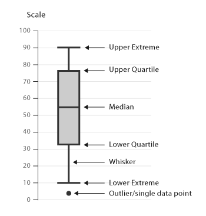
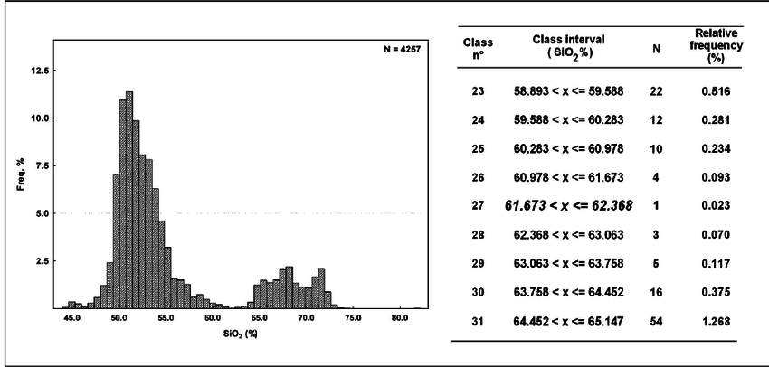
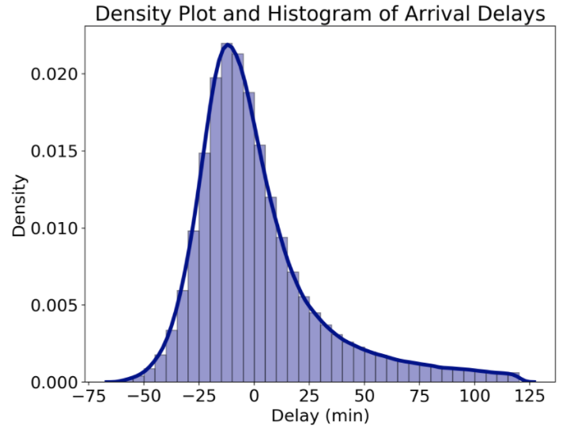
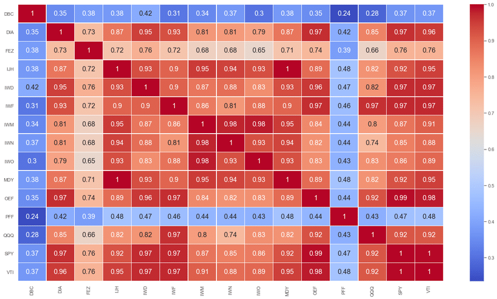
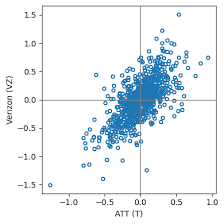
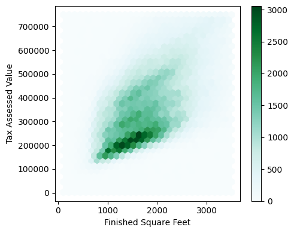
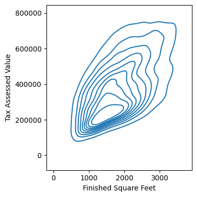
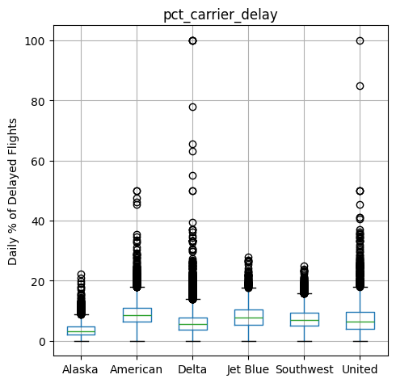
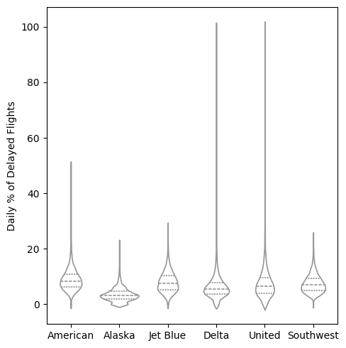
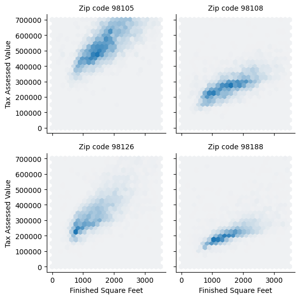

## 1. Exploring the Data Distribution

Estimates of location and estimates of variability both aim to summarize the distribution of data in a single number. On top of that, though, it is also important to look at <u>**how the data is distributed overall**</u>. There are several ways to do this.

> 📌 **Key Takeaways**
>
> - A frequency histogram plots counts on the y-axis and variable values on the x-axis, letting you see the distribution of the data at a glance.
> - In a box plot, the top and bottom of the box mark the 75th and 25th percentiles, respectively, so you can grasp the distribution of the data at a glance. It is mainly used to compare distributions with each other.
> - A density plot can be thought of as a smoothed version of a histogram. The density can be estimated with various estimation methods.

### 1.1. Percentiles and Box Plots

In the previous post, we looked at how to measure the spread of data using percentiles, as with the IQR. Likewise, percentiles are useful for understanding a distribution. In particular, percentiles are effective for describing the tails of a distribution. For example, the 99th percentile can be used to represent the top 1% of values.

The box plot is the representative chart that visualizes the distribution of data using percentiles.



### 1.2. Frequency Tables and Histograms

A frequency table divides the range of a variable into equal-sized intervals (classes) and shows how many values fall into each interval.



> 📌 **NOTE**
>
> Frequency tables and percentiles are both approaches that examine data by splitting it into bins. So what's the difference between the two?
>
> - <u>**Quartiles and deciles**</u> generally have the same amount of data in each bin — that is, <u>**bins of different sizes contain the same number of data points**</u>.
> - A frequency table, on the other hand, has fixed bin sizes, and the number of values in each bin varies.

> 📌 **NOTE**
>
> Statistics apparently often uses a concept called <u>**moments**</u>. Location and variability are referred to as the first and second moments. The third and fourth moments are called <u>**skewness**</u> and <u>**kurtosis**</u>, respectively.
>
> - <u>**Skewness**</u> indicates how much the data is skewed toward larger or smaller values,
> - <u>**Kurtosis**</u> indicates the tendency of the data to have extreme values.
>
> Rather than computing these moments directly, we usually <u>**visualize them with box plots or histograms and check them by eye**</u>.

### 1.3. Density Plots and Estimation

A histogram uses the frequency of each bin as its y-axis. So what is <u>**density**</u>? A density plot shows the distribution of data as a continuous line. You can think of it as a smoother histogram. It is usually computed directly from the data through <u>**Kernel Density Estimation**</u>. The biggest difference from a histogram is the unit of the y-axis values.

- A density plot shows proportions rather than counts, and the total area under the density curve is 1.
- Instead of counts in bins, you compute the area under the curve between two points on the x-axis, which corresponds to the proportion of the distribution lying between those two points.



## 2. Binary and Categorical Data

Analyzing binary variables or categorical variables with only a few categories isn't that difficult. For binary variables, we mainly explore what <u>**proportion**</u> the important category (such as 1) accounts for.

- In tables, this is usually expressed as the <u>**proportion (%)**</u> each class takes up,
- and in visualizations, it is usually shown as a <u>**bar chart**</u>.

> 📌 The difference between a <u>**histogram**</u> and a <u>**bar chart**</u>
>
> - A histogram is a bar chart that splits continuous numeric data into bins and shows the frequency of each bin. Strictly speaking, it can be seen as converting numeric data into an <u>**ordered factor**</u>.
> - In a bar chart, however, the categories on the x-axis are not sequential.

### 2.1. Expected Value

For example, let's say a restaurant has launched two menu items. Menu A costs 50,000 won, and menu B costs 10,000 won. To promote them, the owner ran a free tasting event for passersby on the street and conducted a survey. Based on the results, the owner estimated that about 5% of passersby would order the 50,000-won item, about 15% would order the 10,000-won item, and the remaining 80% or so would order neither. In this case, we can derive the <u>**expected value**</u> using the weighted mean we looked at earlier.

$$
EV = (0.05 \times 50) + (0.15 \times 10) + (0.80 \times 0) \\
= 2.5 + 1.5 + 0 \\
= 4
$$

In this case, the owner's <u>**expected revenue is 40,000 won**</u>.

## 3. Correlation

In modeling projects, EDA usually includes examining the correlation among predictors, or between predictors and the target value.

| Term | Meaning | Notes |
| --- | --- | --- |
| Correlation coefficient | A metric used to indicate how numeric variables are related to each other | Ranges over [-1,+1]. |
| Correlation matrix | A table that arranges the **correlation coefficients** among multiple variables in rows and columns. | The rows and columns hold the variables being analyzed, and each cell represents the correlation between the variables for that row and column. |
| Positive correlation | A relationship in which one variable increases as the other increases | 0 &lt; correlation coefficient &lt; 1 |
| Negative correlation | A relationship in which one variable decreases as the other increases | -1 &lt; correlation coefficient &lt; 0 |

The <u>**correlation coefficient (Pearson's correlation coefficient)**</u> estimates the correlation between two variables by always placing it on the same scale. To compute Pearson's correlation coefficient, you multiply the deviations of variable 1 (x) and variable 2 (y) from their respective means, take the mean of those products, and divide it by the product of the two variables' standard deviations.

$$
r = \frac{\sum_{i=1}^{n} (x_i - \bar{x})(y_i - \bar{y})}{\sqrt{\sum_{i=1}^{n} (x_i - \bar{x})^2} \sqrt{\sum_{i=1}^{n} (y_i - \bar{y})^2}}
$$

A correlation matrix is commonly shown as a heatmap like the one below. The figure below is a heatmap of the correlations between the daily returns of major ETFs.



- The S&P 500 (SPY) and the Dow Jones index (DIA) are highly correlated.
- QQQ and XLK, which consist mainly of high-tech companies, are also positively correlated.
- More defensive ETFs, such as those tracking gold prices (GLD), oil prices (USO), and market volatility (VXX), show weak or negative correlation with the other ETFs.

Since the formula for the correlation coefficient uses the mean, the correlation coefficient is naturally sensitive to outliers in the data as well. For this reason, more robust correlation coefficients are sometimes used.

> 📌 <u>**Spearman's rho**</u> or <u>**Kendall's tau**</u>.
>
> These are <u>**correlation coefficients based on the ranks of the data**</u>. Because they use the ranks of values rather than the values themselves, these estimators are more robust to outliers and can also handle nonlinear relationships.
>
> However, Pearson's correlation coefficient is used most of the time, and rank-based estimators are mainly used <u>**when the dataset is usually small**</u> and some <u>**specific hypothesis test**</u> is needed.

That said, before computing a correlation coefficient, the most basic way to understand the relationship between two variables is to draw a <u>**scatter plot**</u>.



- The two returns are clustered around 0, but they show a strong positive correlation.

## 4. Exploring Two or More Variables

Estimates such as the mean and variance we looked at earlier deal with only one variable at a time (<u>**univariate analysis**</u>). The scatter plot we just looked at, on the other hand, deals with two variables at a time (<u>**bivariate analysis**</u>).

So what approach should we use to deal with three or more variables? This is called <u>**multivariate analysis**</u>.

| Term | Meaning | Notes |
| --- | --- | --- |
| Contingency table | A table that records the frequency counts of two or more categorical variables | Each cell can hold counts or proportions. |
| Hexagonal binning | A plot that divides two variables into hexagon-shaped bins | Fundamentally the same as a scatter plot. However, it is useful for visualizing data without being overwhelmed by its volume when there is a huge amount of data. |
| Contour plot | A plot that shows the density of two variables as contour lines, like a topographic map | Useful when there is a large amount of data. |
| Violin plot | A plot similar to a box plot but that also shows the density estimate | Worse than a box plot at showing outliers. |

Like univariate analysis, bivariate and multivariate analysis are basically about computing summary statistics and visualizing them. But the form they take <u>**depends on whether the data is numeric or categorical, and on the characteristics of the data**</u>.

### 4.1. Numeric vs. Numeric

If you have a few hundred or a few thousand data points, a scatter plot is enough to represent them. But to show hundreds of thousands or millions of records, the points in a scatter plot can become too dense to make sense of. In such cases, you can use <u>**hexagonal binning**</u>. Instead of a square grid, it divides the plane filled with data into a **honeycomb-shaped hexagonal grid**, counts the number (frequency) of data points that fall into each hexagonal bin, and **expresses it through the depth or brightness of the color**.

```python
ax = kc_tax0.plot.hexbin(x='SqFtTotLiving', y='TaxAssessedValue',
                         gridsize=30, sharex=False, figsize=(5, 4))
ax.set_xlabel('Finished Square Feet')
ax.set_ylabel('Tax Assessed Value')

plt.tight_layout()
plt.show()
```



- From this plot, you can easily see that house size and tax-assessed value are positively correlated.
- You can see roughly three groups: the dark group at the very bottom, a slightly lighter group just above it, and an even lighter group above that. In other words, there are three groups with different tax-assessed values for the same square footage.



This graph is a <u>**contour plot**</u> of the same data as the hexagonal plot above. Just like contour lines on a real map, points on the same contour line have the same density, and the density increases toward the peak.

### 4.2. Categorical vs. Categorical

A <u>**contingency table**</u> is mainly used to summarize the relationship between two categorical variables. A contingency table records the frequency count for each category.

| Grade | Charged Off | Current | Fully Paid | Late | All |
| --- | --- | --- | --- | --- | --- |
| A | 1,562 | 50,051 | 20,408 | 469 | 72,490 |
| B | 5,302 | 93,852 | 31,160 | 2,056 | 132,370 |
| C | 6,023 | 88,928 | 23,147 | 2,777 | 120,875 |
| D | 5,007 | 53,281 | 13,681 | 2,308 | 74,277 |
| E | 2,842 | 24,639 | 5,949 | 1,374 | 34,804 |
| F | 1,526 | 8,444 | 2,328 | 606 | 12,904 |
| G | 409 | 1,990 | 643 | 199 | 3,241 |
| Total | 22,671 | 321,185 | 97,316 | 9,789 | 450,961 |

| Grade | Charged Off | Current | Fully Paid | Late | All |
| --- | --- | --- | --- | --- | --- |
| A | 0.021548 | 0.690454 | 0.281528 | 0.006470 | 0.160746 |
| B | 0.040054 | 0.709013 | 0.235401 | 0.015532 | 0.293529 |
| C | 0.049828 | 0.735702 | 0.191495 | 0.022974 | 0.268039 |
| D | 0.067410 | 0.717328 | 0.184189 | 0.031073 | 0.164708 |
| E | 0.081657 | 0.707936 | 0.170929 | 0.039478 | 0.077177 |
| F | 0.118258 | 0.654371 | 0.180409 | 0.046962 | 0.028614 |
| G | 0.126196 | 0.614008 | 0.198396 | 0.061401 | 0.007187 |

The two tables above are contingency tables showing personal loan grades and loan outcomes as counts and proportions.

- You can see that higher-grade loans have much lower late and charge-off rates than lower-grade loans.

### 4.3. Categorical vs. Numeric

<u>**Box plots**</u> and <u>**violin plots**</u> are very convenient for visualizing and comparing the distributions of a numeric variable grouped by a categorical variable.



- You can see at a glance that Alaska had the fewest delays, while American had the most.



The same data can also be shown as a violin plot. The difference from a box plot is that it can simultaneously visualize the density estimate along the y-axis. However, violin plots have the drawback of being weaker than box plots at showing outliers.

- You can see that the data for Alaska, and to a lesser extent Delta, is concentrated near 0.

### 4.4. Visualizing Multiple Variables

Through a concept called <u>**conditioning**</u>, plots for comparing two variables (scatter plots, hexagonal binning, box plots) can be extended to compare more variables.

Earlier, in the hexagonal plot, we found three groups with the same house size but different tax-assessed values. To take a closer look at what these three groups actually are, we can add a geographic factor.



By grouping the data by zip code and plotting it, we can now see the cause. You can confirm that assessed values in zip codes 98105 and 98126 are much higher than in 98108 and 98188.

## 📚 References

- [The Box Plot: A Simple but Informative Visualization](https://medium.com/analytics-vidhya/the-box-plot-a-simple-but-informative-visualization-cacc20d9ff25)
- [Histograms and Density Plots in Python](https://medium.com/data-science/histograms-and-density-plots-in-python-f6bda88f5ac0)
- [practical-statistics-for-data-scientists/python/notebooks/Chapter 1 - Exploratory Data Analysis.ipynb at master · gedeck/practical-statistics-for-data-scientists](https://github.com/gedeck/practical-statistics-for-data-scientists/blob/master/python/notebooks/Chapter%201%20-%20Exploratory%20Data%20Analysis.ipynb)
