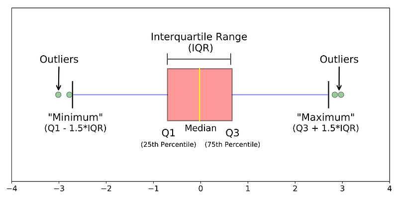
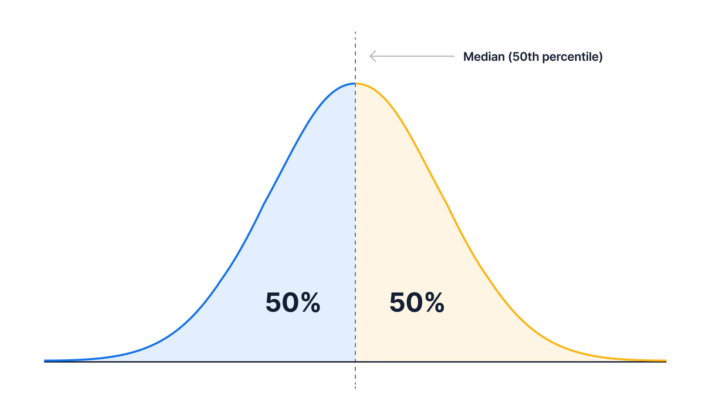
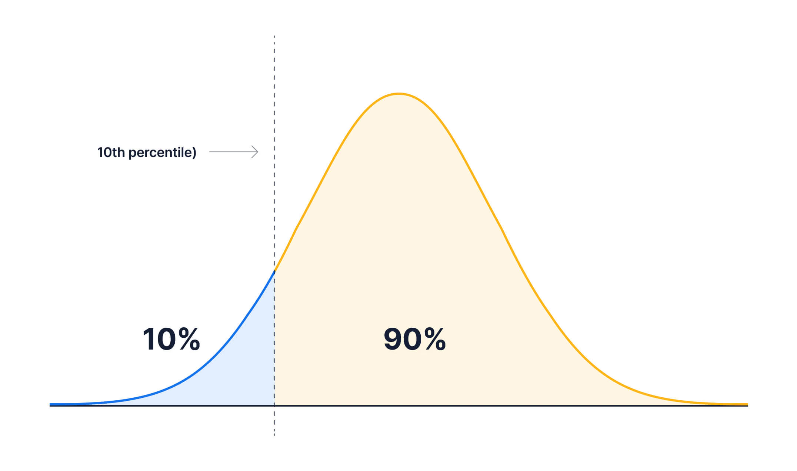

## 1. Exploratory Data Analysis

It is said that in classical statistics, **inference** had more or less become the goal in itself. In other words, drawing conclusions about a large population from a small sample was regarded as the end in itself. But in 1962, John Tukey proposed a new idea in his paper *The Future of Data Analysis*: treating "inference" as a means of **data analysis**. Tukey's conviction was formalized in his 1977 book *Exploratory Data Analysis*, and it carries on to this day.

## 1.1. Elements of Structured Data

The data we can commonly get — sensor measurements, events, text, images, video, and countless others — is unprocessed raw data. To apply statistical concepts, we have to process this unstructured raw data and convert it into a **structured form**. The most common form of structured data is tabular data.

| Data type | Kind | Meaning |
| --- | --- | --- |
| Numeric data | Continuous data | Data that can take any value within a range (real-valued) |
|  | Discrete data | Data that can only take integer values, such as counts (integer-valued) |
| Categorical data | Binary data | A special case of categorical data with only two values (0/1, true/false) |
|  | Ordinal data | Categorical data whose values have a clear ranking |

## 1.2. Tabular Data

Tabular data is the most representative form of object used in data analysis. It is a general term for a two-dimensional matrix whose rows represent records (events) and whose columns represent features (variables).

On the other hand, there are also data structures that are not tabular.

| Data structure | Characteristics | Use cases |
| --- | --- | --- |
| Time series data | Successive measurements are placed within the same feature. | Produced by a wide range of devices, such as the Internet of Things. |
| Spatial data | When representing objects (things recognizable as a single entity — buildings, roads, etc.), an object and its spatial coordinates are the center of the data.  Field information (specific measured values distributed continuously over a space — air temperature, water temperature, pressure, etc.) focuses on small units representing the space and an appropriate measured value. | Used in cartography and location analytics. |
| Graph data | Used to represent physical, social, and somewhat abstract relationships. | Network optimization, recommender systems |

## 1.3. Estimates of Location

The variables that describe data take a great many and varied values. So when data is given to us, the most basic step in looking at it is to find a **"typical value"** for each feature (variable). That is, a single number that expresses the central tendency — roughly where most of the values are located.

| Term | Meaning |
| --- | --- |
| Mean | The sum of all values divided by the number of values. |
| Weighted mean | The sum of the values multiplied by their weights, divided by the sum of the weights. |
| Median | The value in the very middle of the data. |
| Percentile | The value below which P% of the data lies. |
| Weighted median | The data value at which, after sorting the data and adding up the weights from the top, the midpoint of the total is reached. |
| Trimmed mean | The mean of the remaining values after excluding a fixed number of extreme values. |

### 1.3.1. Mean

The **mean** is the most basic way to estimate location. The symbol $\bar{x}$ is commonly used for the sample mean.

$$
\bar{x} = \frac{\sum_{i=1}^{n} x_i}{n}
$$

> $N$ usually denotes the number of records or observations. In statistics, uppercase $N$ refers to the population and lowercase $n$ to the sample size. In data science, however, this distinction usually doesn't matter, so the two are used interchangeably.

But when the data contains outliers, the <u>**mean trap**</u> can occur, where the mean fails to represent the distribution of the data. In such cases we use the **trimmed mean**. The trimmed mean is the mean computed from the values that remain after sorting them by size and removing a fixed number ($p$) of values from each end.

$$
\bar{x}_{tr} = \frac{1}{n - 2p} \sum_{i=p+1}^{n-p} X_{(i)}
$$

Suppose we are averaging data collected from several sensors, and one sensor is less accurate, so its values jump around compared to the others. Can we still use the plain mean? In a situation like this, we can use the **weighted mean**.

$$
\bar{x}_w = \frac{\sum_{i=1}^{n} w_i x_i}{\sum_{i=1}^{n} w_i} = \frac{w_1 x_1 + w_2 x_2 + \dots + w_n x_n}{w_1 + w_2 + \dots + w_n}
$$

Also, when collecting data, the comparison groups don't always come out the same size. If we fail to collect data that reflects exactly the same proportion for every user group, we can compute the mean by applying a higher weight to the minority groups that lack data.

### 1.3.2. Median and Robust Estimates

In many cases, the **median** is better suited to estimating location than the mean, which is sensitive to the data. Because the median is not influenced by outliers (extreme values) that can distort the result, it is known as a <u>**robust**</u> estimate of location.

$$
\text{median} =
\begin{cases}
X_{\left(\frac{n+1}{2}\right)} & \text{if } n \text{ is odd} \\[1ex]
\dfrac{X_{\left(\frac{n}{2}\right)} + X_{\left(\frac{n}{2} + 1\right)}}{2} & \text{if } n \text{ is even}
\end{cases}
$$

For the same reason we use a weighted mean, we can also use a **weighted median**. As when computing the median, we line the data up in order of size. But the weighted median is not simply the value in the middle; it refers to the value at the position where the sum of the weights in the upper half equals the sum of the weights in the lower half.

$$
\text{weighted median} = X_k
\\
\text{where } \sum_{i=1}^{k-1} w_i \le \frac{1}{2} \sum_{i=1}^{n} w_i \quad \text{and} \quad \sum_{i=k+1}^{n} w_i \le \frac{1}{2} \sum_{i=1}^{n} w_i
$$

## 1.4. Estimates of Variability

If location is what summarizes the characteristics of data, **variability** expresses **dispersion** — how spread out the data values are. We need to measure variability in order to tell real variability apart from randomness, to find out the various sources of real variability, and to make decisions in the presence of variability.

| Term | Meaning |
| --- | --- |
| Deviation | The difference between an observed value and the estimate of location (mean) |
| Variance | The sum of the squared deviations from the mean, divided by n-1. |
| Standard deviation | The square root of the variance |
| Mean absolute deviation | The mean of the absolute values of the deviations from the mean |
| Median absolute deviation from the median | The median of the absolute values of the deviations from the median |
| Range | The difference between the largest and smallest values |
| Percentile | The value such that P percent of the values take this value or less, and (100-P) percent take this value or more |
| Interquartile range (IQR) | The difference between the 75th percentile and the 25th percentile |

### 1.4.1. Variance and Standard Deviation

Estimates of variability are fundamentally based on deviations.

Given the data $[1,4,4]$, the mean is 3. The deviations from the mean are $[-2, 1, 1]$. To measure variability, we need to estimate a typical value for these deviations.

That said, simply averaging the deviations themselves is not a good idea, because the negative deviations cancel out the positive ones. For this we use the **variance** and the **standard deviation**.

$$
s^2 = \frac{\sum_{i=1}^{n} (x_i - \bar{x})^2}{n-1}
$$

$$
s = \sqrt{\frac{\sum_{i=1}^{n} (x_i - \bar{x})^2}{n - 1}}
$$

Because the standard deviation is on the same scale as the original data, it is much easier to interpret than the variance.

Of course, we can also simply use the **mean absolute deviation**.

$$
\text{Mean Absolute Deviation} = \frac{\sum_{i=1}^{n} |x_i - \bar{x}|}{n}
$$

However, the variance, standard deviation, and mean absolute deviation are all based on the mean, so none of them are robust to outliers. The variance and standard deviation in particular square the deviations, which makes them even more sensitive to outliers. So as a robust estimate of variability, we can use the **median absolute deviation from the median (MAD)**.

$$
\text{MAD} = \text{median}(|X_i - \text{median}(X)|), \text{where i in [1,n]}
$$

### 1.4.2. Estimates Based on Percentiles

Statistics that describe sorted (ranked) data are called **order statistics**. The most basic of these is the **range**. But the range is very sensitive to outliers and isn't all that useful for measuring the variability of data. So we can remove some values from both ends and measure the range again. This is exactly the **interquartile range (IQR)**.

For example, say we have the data $[3, 1, 5, 3, 6, 7, 2, 9]$. Sorted, it becomes $[1, 2, 3, 3, 5, 6, 7, 9]$. The 25th percentile is $2.5$ and the 75th percentile is $6.5$. So the interquartile range is $6.5 - 2.5 = 4$.

Let's understand the **percentile**, which is the basis for computing the IQR. The median is the reference value such that 50% of the data is smaller than it and 50% of the data is larger than it. This is called the **50th percentile**.

Then how do we find the 10th percentile? The reference value such that 10% of the data is smaller than it and 90% of the data is larger than it is the **10th percentile**.

## 📚 References

- [Removing Outlier Data Using the IQR Method (Korean)](https://hwi-doc.tistory.com/entry/IQR-%EB%B0%A9%EC%8B%9D%EC%9D%84-%EC%9D%B4%EC%9A%A9%ED%95%9C-%EC%9D%B4%EC%83%81%EC%B9%98-%EB%8D%B0%EC%9D%B4%ED%84%B0Outlier-%EC%A0%9C%EA%B1%B0)
- [How Percentiles Work](https://www.tigerdata.com/blog/how-percentiles-work-and-why-theyre-better-than-averages)
