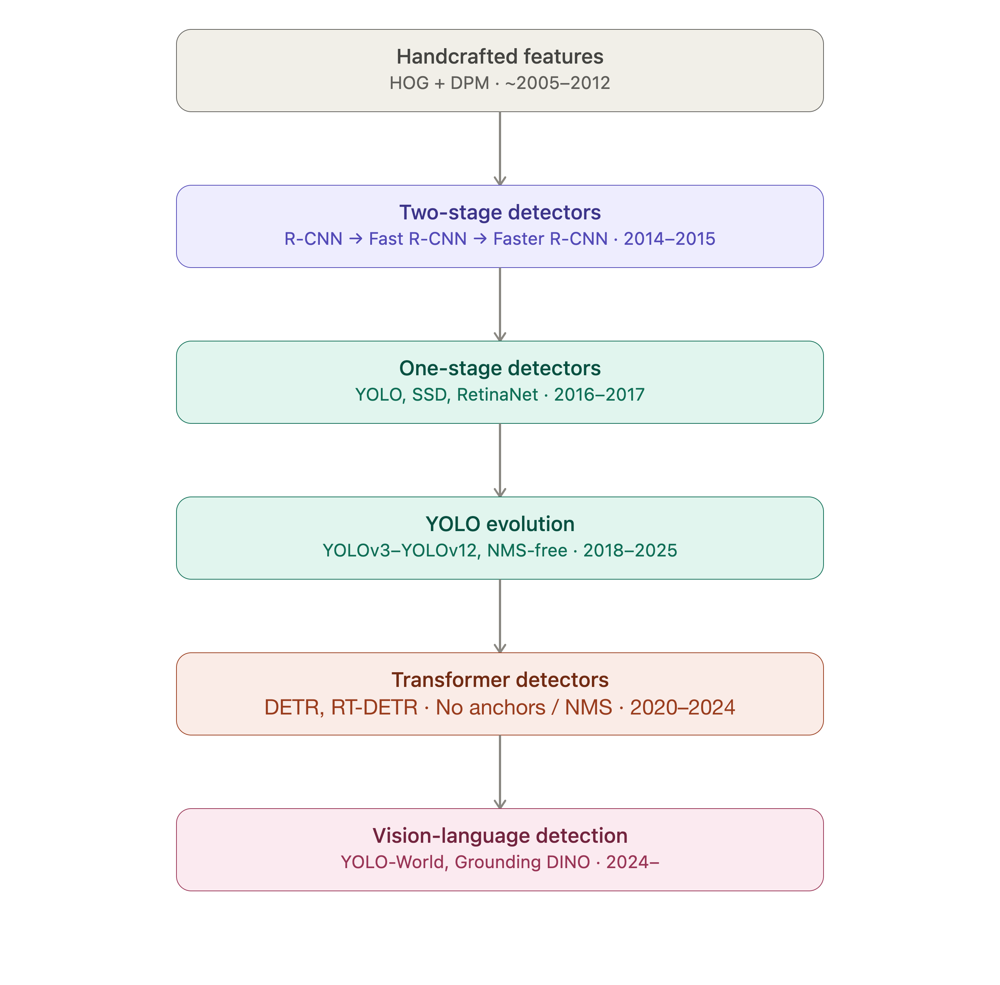
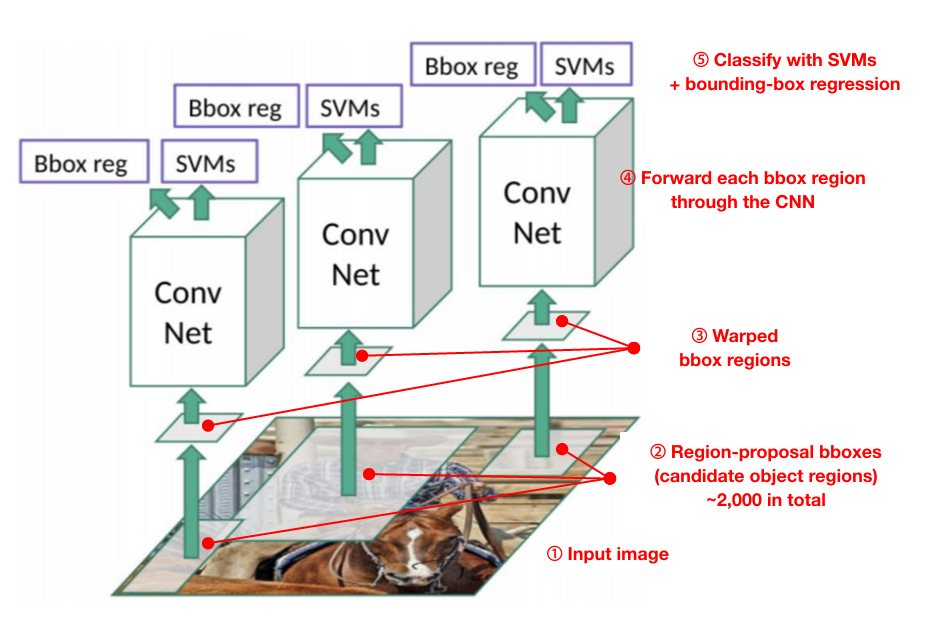
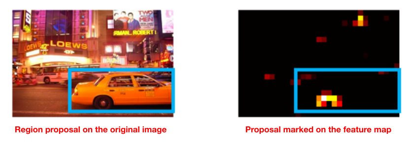
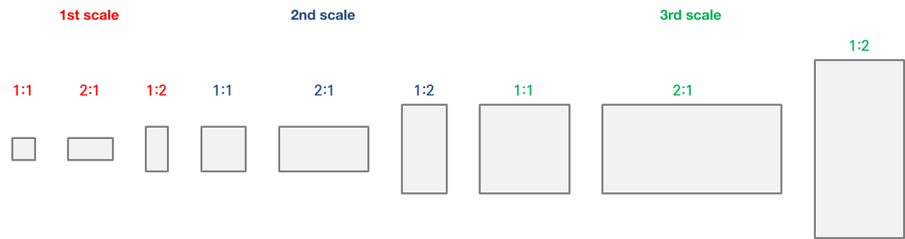

## 1. The Limits of CNNs

### 1.1. Image Classification VS Object Detection

After AlexNet in 2012, CNNs showed overwhelming performance on image classification tasks. In the real world, however, it is far more common to go beyond simply classifying what a single image is: we have to <u>**detect**</u> which objects are in an image and <u>**classify**</u> what each of them is, both at the same time.


> - Classification: look at the whole image and answer "It's a cat!" — done.
> - Object Detection: for the multiple objects in an image, find <u>**each object's location (bounding box)**</u> and <u>**what it is (class)**</u> at the same time.

In other words, detection has to solve two problems at once — <u>**where is it (localization)**</u> and <u>**what is it (classification)**</u> — but the basic CNN architecture (feed in one whole image, output one label) was built on the assumption of "one image = one object" from the start, so it was hard to use for this problem as-is.

So model architectures that could do localization and classification together were devised, and they have evolved as shown below.



Today we will look at the R-CNN family, practically the ancestors of this lineage.

## 2. R-CNN (Region with CNN)

### 2.1. The Arrival of R-CNN

#### 2.1.1. The Structure of R-CNN

R-CNN is an architecture that combines a CNN with Region Proposal.

Put simply, the process is: ① propose regions where an object is likely to be, and ② judge what object is in each proposed region.


1. **Input Image**: the input image can be of any size.
2. **Region Proposal: Selective Search**, a separate algorithm (not a CNN!), extracts about 2000 "candidate regions likely to contain an object" from the image. The sizes and <u>**aspect ratios of these 2000 regions can all differ**</u>.

   > The number of candidate regions is not fixed at 2000. It can vary depending on the data.

   

3. **Warp**: these regions will pass through the CNN and then move on to the FC layer, and to hand them to the FC layer the data dimensions must be uniform. So a step that <u>**transforms the candidate regions into a fixed size**</u> is needed. This is called warping. R-CNN warps each region to $227×227$.
4. **Feature Extraction**: each of these regions is **passed through the CNN independently** to extract features. This produces about 2000 feature maps.
5. **FCNN**: this takes on the role of compressing "features that carry location information (feature map)" into <u>**"abstract features that are good for judging what this is"**</u>. The paper uses two FCNN layers, fc6 and fc7. After passing through these two layers, the final output is 4096-dimensional.
6. **Classification with SVM**: the output of the FCNN is fed into as many SVMs as there are classes ($N$), which finally produces a $2000 \times N$ score matrix.
7. **Apply NMS**: at the end, a post-processing step called Non-Maximum Suppression is applied to each class separately so that only meaningful boxes remain in the final output.

   > **🤔 What is NMS?**
   >
   > For example, in the "cat" class, pick the box with the highest score and keep it, then judge that other candidates that overlap heavily with that box (high IoU) are "duplicates pointing at the same cat anyway" and remove them. Repeating this picks out only the boxes that should really remain for each class.

8. **Bounding-box Regression**: corrects the bounding box positions with regression.

   > Looking at the error analysis in the R-CNN paper (Figure 5, Figure 6), the most common error type was not getting the class wrong but <strong>poor localization</strong>. So this is a correction mechanism added to solve that problem.



In other words, R-CNN swapped the problem into <u>**Object detection = a repetition of many small Classification problems**</u>. It did not change the CNN itself; it was a workaround that attached other algorithms (candidate region extraction, SVM) before and after the CNN.

#### 2.1.2. The Performance of R-CNN

The idea itself was a success, and accuracy jumped by more than 30% over the previous methods (HOG+DPM, etc.).


### 2.2. The Limits of R-CNN

#### 2.2.1. The Limit of Selective Search: It Runs Serially on the CPU.

Selective Search is not a CNN but a traditional computer vision algorithm. The principle is as follows.

1. Split the image into very small pieces (superpixels)
2. Merge neighboring pieces with similar color, texture, etc. **greedily**, one at a time
3. As the merged results grow, keep accumulating candidates that look like "a blob of about this size could be an object"

This "merging" step is the problem. **Which two pieces get merged in the very next step depends on what was merged in the step just before.** In other words, the structure requires the result of step A before step B can be computed. This is called having a <u>**sequential dependency**</u>, and this kind of algorithm is fundamentally hard to parallelize on a GPU. A GPU is strong at "doing lots of mutually independent computations at once," but it does not help with computations where "the previous result is needed before the next is determined."

That is why the Faster R-CNN paper puts it this way:

> *Selective Search, one of the most popular methods, greedily merges superpixels based on engineered low-level features... at 2 seconds per image in a CPU implementation*

In other words, Selective Search is **an algorithm that runs on the CPU in the first place and does not parallelize well**, so it takes 2 seconds per image. No matter how well you use the GPU, it never gets as fast as the CNN side. (This is in fact the very point that Faster R-CNN later replaces entirely with the RPN.)

#### 2.2.2. Each of the 2000 Warped Regions Needs Its Own CNN Computation

The real reason R-CNN is slow is that <u>**it repeats the same computation about 2000 times**</u>.

It is stated that the Selective Search algorithm extracts roughly 2000 candidate regions.

> *At test time, we run selective search on the test image to extract around 2000 region proposals (we use selective search's "fast mode" in all experiments)*

But these ~2000 regions overlap heavily with each other. In the picture below, you can see many regions overlapping one another even though there is only one person.


If you crop these regions and feed each one into the CNN independently:

- Even if region A and region B share 80% of the image, the CNN has no idea about this
- Because each region is cropped (warped) to 227×227 and fed in separately, **the conv computation (filter multiplication) for the overlapping part is computed completely anew — once when processing A, and again when processing B**
- No matter how much you batch these together on the GPU to process them "simultaneously," **the amount of computation (FLOPs) itself does not decrease.** Parallelization means "processing several copies of the same job at once to reduce wall-clock time," not "eliminating duplicated work."

  > *Wall clock time is, in computer science, the total elapsed real time from the start of a task to its end.*

On top of that, there are practical constraints. GPU memory is limited, so you cannot put all 2000 into a single batch without limit and must split them into several runs, and the large matrix multiplication of the fully connected layer has to be repeated for every region, which is a heavy burden. According to the measurements in the Fast R-CNN paper, it took **47 seconds** per image with VGG16 (even on a GPU).

> *Object detection is slow. At test-time, features are extracted from each object proposal in each test image. Detection with VGG16 takes 47s / image (on a GPU).*

#### 2.2.3. Training Is a Pipeline Split into Multiple Stages (multi-stage pipeline)

R-CNN did not train a single model in one go; it had to be trained separately, stage by stage, in order.

- Stage 1: fine-tune the CNN with log loss
- Stage 2: train per-class SVMs separately on the features extracted from the CNN
- Stage 3: train yet another separate regression model to correct bounding box positions

Because these three stages were trained separately with different objective functions, they were cumbersome to manage, and there was a lot of room for suboptimal results as the error of each stage propagated to the next.

#### 2.2.4. Training Time and Storage Are Enormous

To train the SVMs and the bounding box regression, the CNN features for all ~2000 candidate regions extracted per image had to be precomputed and **stored on disk in their entirety**. With a deep network like VGG16, even the VOC07 training data alone (5 thousand images) took 2.5 days on a GPU, and hundreds of gigabytes of storage were needed.

## 3. Fast R-CNN

> 📌 **Key idea**
>
> **"Instead of making the candidate regions and then feeding them into the CNN, overlay the regions onto the feature map that came out of the CNN!"**
>
> **⭐️ Newly introduced concepts**
>
> - **Convolution + Selective Search**
> - **RoI Pooling**
> - **Softmax**

### 3.1. The Arrival of Fast R-CNN

#### 3.1.1. The Structure of Fast R-CNN


1. **Input image (224×224×3):**

   One original image comes in. As in the picture, this image is used **in two branches at the same time**.

2. **Convolution + Selective Search**

   The two processes below run in parallel, simultaneously.

   1. **Fully Convolutional Network (conv + pooling + activation)**

      The entire original image passes **exactly once** through a network made only of conv layers. The result is a <strong>feature map (14×14×512)</strong>. Here 512 is the number of channels (filters), and 14×14 is the spatial size after the original 100×100 has been shrunk through several rounds of conv/pooling.

   2. **Selective Search**

      Separately from that, the same original image also goes into Selective Search, which extracts the <strong>RoIs (a list of candidate region coordinates)</strong>.

3. **Projection**

   The RoI coordinates extracted by Selective Search (in the original image's coordinate system) are converted into the feature map's coordinate system. The result is <u>**a piece cut out of the feature map covering exactly the RoI's position**</u>. So if there were 2000 RoIs, there are 2000 tensors of size $512 \times A_i \times B_i$.

   > *Like cutting cookie dough (feature map) with a cookie cutter (RoI)*

   

4. **RoI Pooling**

   This takes the variable-size $512 \times A_i \times B_i$ piece as input and converts it into a **fixed-size (7×7×512) tensor**. Even though each RoI had a different original size (A×B), after RoI Pooling they are all unified into the same 7×7×512 shape.

5. **FCs → two-way output**

   The fixed-size tensor passes through the FC layers, and at the end it splits into two branches that produce the results.

   - **bbox regressor**: outputs box position corrections, dimension: $RoIs \times 4 \cdot K$
   - **softmax**: outputs class probabilities per bbox, dimension: $RoIs \times (K+1)$

6. **NMS**

   At the end, a post-processing step called Non-Maximum Suppression is applied to each class separately so that only meaningful boxes remain in the final output.

### 3.2. Did Fast R-CNN Clean Up R-CNN's Limits?

| Limit of R-CNN | Solved in Fast R-CNN? | Corresponding part of the figure |
| --- | --- | --- |
| CNN repeated for each of 2000 regions | ✅ Solved | Fully Convolutional Network runs once per image; RoIs are reused via projection |
| Multi-stage pipeline | ✅ Solved | FCs → softmax + bbox regressor output simultaneously, one network |
| Excessive storage / training time | ✅ Solved | Trained end-to-end directly, with no feature caching |
| Selective Search is serial on the CPU | ❌ Unsolved (kept as-is) | The Selective Search box is still there |

✅ **"Each of the 2000 warped regions needs its own CNN computation" → Solved**

R-CNN passed each of the 2000 cropped images through the CNN from start to finish, but Fast R-CNN changed this so that the conv computation (Fully Convolutional Network) is performed <u>**only once per image**</u>, and the RoIs just cut out their positions from that result (the feature map) <u>**(projection)**</u>. Since the conv computation for overlapping regions is shared automatically, the conv cost is fixed regardless of the number of candidate regions.

✅ **"Training is a pipeline split into multiple stages" → Solved**

The output from the FCs splits **simultaneously into the bbox regressor and softmax**. Rather than doing (1) CNN fine-tuning → (2) SVM training → (3) bbox regression training separately and in order as in R-CNN, classification and position correction are learned **at once, in one network with one multi-task loss** (end-to-end, single-stage)

✅ **"Training time and storage are enormous" → Solved**

R-CNN had to precompute the features of the 2000 regions and store them on disk in their entirety for SVM/regression training. Since everything in Fast R-CNN is trained as a single network, **the need to cache intermediate features on disk disappears altogether** (no feature caching required). During training, it just flows through conv → RoI pooling → FC → loss computation on the fly, and that's it.

❌ **"Selective Search runs serially on the CPU" → Not solved**

**Selective Search is still used as-is**. Fast R-CNN only eliminated the duplicated conv computation; **the method of extracting RoIs itself still uses Selective Search exactly as R-CNN did.**

In other words, the Fully Convolutional Network is processed quickly and in parallel on the GPU, but Selective Search is still a slow, serial, CPU-based algorithm. The very fact that these two paths are drawn as proceeding separately and simultaneously shows that **no matter how fast the conv computation gets, Selective Search still remains as the bottleneck**. The Fast R-CNN paper is in fact aware of this problem, and the opening of the Faster R-CNN paper sums it up like this.

> Advances like SPPnet and Fast R-CNN have reduced the running time of these detection networks, exposing region proposal computation as a bottleneck.

In other words, once the conv side got faster, **Selective Search stood out, relatively, as the slowest part of the whole pipeline**. Faster R-CNN solves this problem by swapping it out for a new network.

## 4. The Arrival of Faster R-CNN

As pointed out earlier, Fast R-CNN solved 3 of R-CNN's 4 problems (repeated CNN computation, split pipeline, storage), but **the method of extracting RoIs (Selective Search) itself remained** as-is.

Once the conv computation became enormously faster on the GPU, the slow Selective Search running on the CPU became, relatively, the most conspicuous bottleneck in the whole pipeline.

> Advances like SPPnet and Fast R-CNN have reduced the running time of these detection networks, exposing <u>**region proposal computation as a bottleneck.**</u>

The concrete speed difference is also in the paper.

> Selective Search... is an order of magnitude slower [than Fast R-CNN's detection network], at 2 seconds per image in a CPU implementation.

In other words, Fast R-CNN's detection part takes 0.2~0.3 seconds, but <u>**Selective Search alone takes 2 seconds**</u>, so it drags down the speed of the whole system.

### 4.1. The Key Idea of Faster R-CNN: "Let the CNN Extract the Candidate Regions Too"


Faster R-CNN solves Fast R-CNN's bottleneck by **performing Region Proposal through Convolution operations**, which used to be done by sequential processing.

> we introduce novel Region Proposal Networks (RPNs) that <u>**share convolutional layers**</u> with state-of-the-art object detection networks

> 📌 **Key point**
>
> Faster R-CNN uses <u>**a single feature map**</u> both for detection and for finding RoIs.
>
> > Because our ultimate goal is to share computation with a Fast R-CNN object detection network, we assume that both nets share a common set of convolutional layers.

With this, the separate 2-second CPU computation that Selective Search needed disappears entirely, and RoI extraction also happens **on the GPU, reusing the feature map, almost for free**.

> the marginal cost for computing proposals is small (e.g., 10ms per image)

### 4.2. The Structure and Working Principle of the RPN (Region Proposal Network)

The core of Faster R-CNN is precisely this RPN, so let's look at it in detail.


#### 4.2.1. Is There an Object at a Given Position or Not?


If there is an object in a given area of the original image, a bbox should be drawn there, and if not, no bbox should be drawn. Put another way, if there is an object in the receptive field that a given position of the feature map points to, a bbox should be drawn there, and if not, no bbox should be drawn.

**Expressed in neurons, this can be represented as follows.**


- With 2 neurons,<br>→ the probability that an object exists in the given area, and the probability that it doesn't
- With 4 neurons,<br>→ the coordinates of the given area (x,y,w,h)

#### 4.2.2. What If We Draw Several Boxes (Anchors) at a Given Position?


Do we really have to draw only a square in this rectangular area? Couldn't we in fact put a square here, and a horizontally long rectangle, and a vertically long rectangle, and vary their sizes as well, drawing areas of many different shapes? Like in the picture below.


**That is where the concept of the <u>Anchor</u> comes in.**



By default, anchors use **3 sizes × 3 aspect ratios = 9**.

> we introduce novel "anchor" boxes that serve as references at multiple scales and aspect ratios

> By default we use 3 scales and 3 aspect ratios, yielding k = 9 anchors at each sliding position.


So we can draw 9 anchors in one area, and for each of those anchors express the bbox and whether an object exists with 2 neurons and 4 neurons, right?

If we overlay 9 anchors on every area of the image this way, we can place $14 \times 14 \times 9 = 1764$ anchors, and for each of the 1764 anchors express whether an object exists with 2 and 4 neurons, right?

The RPN is based on exactly this idea.

#### 4.2.3. Mini Sliding Network

- **Conceptually:**

  

  A small 3×3 window slides over the feature map and predicts two things at each position.

  > This feature is fed into two sibling fully-connected layers—a box-regression layer (reg) and a box-classification layer (cls)

  - **cls (classification)**: for each of the 9 anchors at this position, "is it an object or background"
    - Output dimension: 2k ($\text{object or background} \times k \text{ anchors}$)
  - **reg (regression)**: for each of the 9 anchors, how much it must be moved and resized to fit the actual object box
    - Output dimension: 4k ($\text{4 coordinate values per bbox} \times k \text{ anchors}$)

- **Strictly speaking:**

  

  Strictly speaking, it is not that the window slides and predicts cls and reg at each individual position. This structure is implemented **by applying a 1×1 conv + 1x1 conv operation, respectively, to the tensor that comes out of the 3×3 conv**.

  > This mini-network is illustrated at a single position in Figure 3 (left)... This architecture is naturally implemented with an n×n convolutional layer followed by two sibling 1 × 1 convolutional layers

  In other words, it looks like a fully connected layer but is actually **implemented as conv operations**, so it is computed for all positions of the feature map at the same time (in parallel). Rather than sequential sliding, a single conv operation handles every position.

#### 4.2.4. RPN Post-Processing: NMS, Top-N


After passing through the RPN, a cls tensor ($14 \times 14 \times 2k$) and a reg tensor ($14 \times 14 \times 4k$) come out as the result.

- **cls tensor**: for each position, for each of the 9 anchors, 2 scores of "it's an object / it's background"
- **reg tensor**: for each position, for each of the 9 anchors, 4 values of "how to move and resize this anchor" ($t_x, t_y, t_w, t_h$)

In other words, a total of $14 \times 14 \times 9 = 1764$ anchor candidates come out of one image, each with one (score, correction) set attached.

Now we need to do post-processing.

1. **Apply the corrections to convert to actual box coordinates**

   $$
   \hat{x}=w_a \cdot t_x + x_a\\
   \hat{y}=h_a \cdot t_y + y_a\\
   \hat{w}=w_a \cdot exp(t_w)\\
   \hat{h}=h_a \cdot exp(t_h)
   $$

2. **Clean up boxes that go beyond the image boundary**

   Since anchors are placed mechanically on a grid, some of them stick out of the image. These are clipped or removed.

   > During testing, however, we still apply the fully convolutional RPN to the entire image. This may generate cross-boundary proposal boxes, which we clip to the image boundary.

3. **Rank by cls score**

   The 1764 boxes are **sorted in descending order of score** based on the cls score (the probability of being an object). It lines them up in order of confidence that "there really seems to be an object at this position."

4. **Remove duplicates with NMS (Non-Maximum Suppression)**

   The same NMS that kept appearing earlier in R-CNN and Fast R-CNN shows up here exactly the same way.

   > we adopt non-maximum suppression (NMS) on the proposal regions based on their cls scores. We fix the IoU threshold for NMS at 0.7, which leaves us about 2000 proposal regions per image.

   Among boxes that overlap heavily with each other, only the one with the highest score is kept and the rest are removed.

5. **Keep only the top N → final RoIs**

   If there are still many even after NMS, only the top few by score (2000 during training, 300 at test time per the paper) are selected and confirmed as the final RoI list.

   > Using the top-N ranked proposal regions for detection... we train Fast R-CNN using 2000 RPN proposals, but evaluate different numbers of proposals at test-time

Now the final RoIs obtained this way go straight into Fast R-CNN's RoI Pooling stage.

In other words, **the RPN takes over exactly the role that Selective Search used to play**, and the pipeline after that (from RoI Pooling to the final classification / box correction) is completely identical to what we covered in detail for Fast R-CNN earlier.

## 5. The Arrival of One-Stage (YOLO, SSD, RetinaNet)

Two-Stage is accurate but slow (real-time inference is difficult). So a movement emerged to "remove the separate candidate-region extraction stage altogether, and predict boxes and classes at the same time just by looking at the image once."

- **YOLO (You Only Look Once, 2016)**: divides the image into a grid, and each grid cell directly predicts boxes and classes. "Turned detection wholesale into a regression problem"
- **SSD (Single Shot Detector, 2016)**: predicts simultaneously from feature maps at several resolutions to catch objects of various sizes
- **RetinaNet (2017)**: solved the reason One-stage had lower accuracy than Two-stage (background/object imbalance) with Focal Loss, making One-stage competitive in accuracy as well

From here on, real-time detection (autonomous driving, CCTV, etc.) becomes practically feasible.

---

## 6. So How Do We Use R-CNN in Code?

```python
import torch
import torchvision
from PIL import Image
from torchvision.transforms import functional as F
import matplotlib.pyplot as plt
import matplotlib.patches as patches

# 1. Load a pretrained Faster R-CNN model
model = torchvision.models.detection.fasterrcnn_resnet50_fpn(weights=torchvision.models.detection.FasterRCNN_ResNet50_FPN_Weights.DEFAULT)
model.eval()  # set evaluation mode

# 2. Define the paths of the images to predict on
DOG_CAT = "/Users/raewookang/CodeIt/study_1505/data/dog-and-cat.png"
HUMANS = "/Users/raewookang/CodeIt/study_1505/data/multiple-humans.png"
AIRPLANE = "/Users/raewookang/CodeIt/study_1505/data/single-airplane.png"
MANY_ANIMALS = "/Users/raewookang/CodeIt/study_1505/data/many-animals.png"

image_paths = [DOG_CAT, HUMANS, AIRPLANE, MANY_ANIMALS]
images = [Image.open(p).convert("RGB") for p in image_paths]
image_tensors = [F.to_tensor(img) for img in images]

# 3. Run model prediction (3 images at once)
with torch.no_grad():
    predictions = model(image_tensors)
    
# 4. COCO class names (per the torchvision pretrained model; index 0 is background)
COCO_INSTANCE_CATEGORY_NAMES = [
    '__background__', 'person', 'bicycle', 'car', 'motorcycle', 'airplane', 'bus',
    'train', 'truck', 'boat', 'traffic light', 'fire hydrant', 'N/A', 'stop sign',
    'parking meter', 'bench', 'bird', 'cat', 'dog', 'horse', 'sheep', 'cow',
    'elephant', 'bear', 'zebra', 'giraffe', 'N/A', 'backpack', 'umbrella', 'N/A', 'N/A',
    'handbag', 'tie', 'suitcase', 'frisbee', 'skis', 'snowboard', 'sports ball',
    'kite', 'baseball bat', 'baseball glove', 'skateboard', 'surfboard', 'tennis racket',
    'bottle', 'N/A', 'wine glass', 'cup', 'fork', 'knife', 'spoon', 'bowl',
    'banana', 'apple', 'sandwich', 'orange', 'broccoli', 'carrot', 'hot dog', 'pizza',
    'donut', 'cake', 'chair', 'couch', 'potted plant', 'bed', 'N/A', 'dining table',
    'N/A', 'N/A', 'toilet', 'N/A', 'tv', 'laptop', 'mouse', 'remote', 'keyboard', 'cell phone',
    'microwave', 'oven', 'toaster', 'sink', 'refrigerator', 'N/A', 'book',
    'clock', 'vase', 'scissors', 'teddy bear', 'hair drier', 'toothbrush'
]
SCORE_THRESHOLD = 0.5  

# 5. Visualize the predictions (bounding boxes + probabilities) overlaid on the images
n_cols = 2
n_rows = -(-len(images) // n_cols)  # ceiling division
fig, axes = plt.subplots(n_rows, n_cols, figsize=(6 * n_cols, 6 * n_rows))
axes = axes.flatten()

for ax, img, pred, path in zip(axes, images, predictions, image_paths):
    ax.imshow(img)
    ax.set_title(path.split("/")[-1])
    ax.axis("off")

    boxes = pred["boxes"]
    labels = pred["labels"]
    scores = pred["scores"]

    for box, label, score in zip(boxes, labels, scores):
        if score < SCORE_THRESHOLD:
            continue

        x1, y1, x2, y2 = box.tolist()
        class_name = COCO_INSTANCE_CATEGORY_NAMES[label.item()]

        rect = patches.Rectangle(
            (x1, y1), x2 - x1, y2 - y1,
            linewidth=2, edgecolor="lime", facecolor="none"
        )
        ax.add_patch(rect)
        ax.text(
            x1, max(y1 - 5, 0), f"{class_name}: {score:.2f}",
            color="black", fontsize=10, backgroundcolor="lime"
        )

# If there are fewer images than grid cells, hide the leftover axes
for ax in axes[len(images):]:
    ax.axis("off")

plt.tight_layout()
plt.show()
```


## 📚 References

- [Object Detection vs. Classification in Computer Vision: Explained](https://www.augmentedstartups.com/blog/object-detection-vs-classification-in-computer-vision-explained?srsltid=AfmBOopvx62GuN2C2SvPS4pIxGzkWNEvd8Km47hPJcTkStGkH9MAhO1k)
- [Rich feature hierarchies for accurate object detection and...](https://arxiv.org/abs/1311.2524)
- [Computer Vision - 10. An Overview of R-CNN vs. SPP-net vs. Fast R-CNN vs. Faster R-CNN (Korean)](https://bkshin.tistory.com/entry/%EC%BB%B4%ED%93%A8%ED%84%B0-%EB%B9%84%EC%A0%84-10-R-CNN-vs-SPP-net-vs-Fast-R-CNN-vs-Faster-R-CNN-%EA%B0%9C%EC%9A%94)
- [Selective Search for Object Detection | R-CNN - GeeksforGeeks](https://www.geeksforgeeks.org/machine-learning/selective-search-for-object-detection-r-cnn/)
- [Understanding Selective Search for Object Detection](https://medium.com/dataseries/understanding-selective-search-for-object-detection-3f38709067d7)
- [Fast R-CNN - Explained!](https://www.youtube.com/watch?v=rYLD9RLCqGo)
- [Paper Review - A Close Look at Faster R-CNN (Korean)](https://bkshin.tistory.com/entry/%EB%85%BC%EB%AC%B8-%EB%A6%AC%EB%B7%B0-Faster-R-CNN-%ED%86%BA%EC%95%84%EB%B3%B4%EA%B8%B0)
- [Faster R-CNN - Explained!](https://www.youtube.com/watch?v=ws0nlxCWWI8)
