## 1. CNN의 한계

### 1.1. 이미지 분류(Classification) VS 객체 탐지(Object Detection)

2012년 AlexNet 이후, CNN은 이미지 분류(Image Classification) 작업에서 압도적인 성능을 보여줬습니다. 하지만 현실세계에서는 이미지 하나가 뭔 지 단순히 분류하는 것을 넘어서, 한 이미지 안에 어떤 객체들이 있는 지 <u>**탐지**</u>하고, 그 객체가 뭔 지 <u>**분류**</u>하는 문제를 동시에 갖고있는 경우가 더 많습니다.

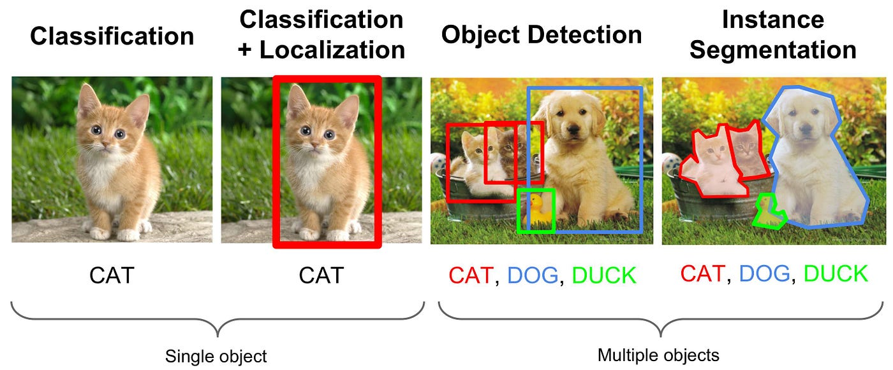

> - 분류(Classification): 이미지 전체를 보고 "이건 고양이야!" 라고 답하면 끝.
> - 탐지(Object Detection): 이미지 안에 있는 여러 <u>**객체 각각의 위치(바운딩 박스)**</u>와, 그것이 <u>**무엇인 지(클래스)**</u>를 동시에 찾아야 함.

즉 탐지는 <u>**어디에 있는가(localization)**</u>와 <u>**무엇인가(classification)**</u>라는 두 가지 문제를 한꺼번에 풀어야 하는데, 기본 CNN 구조(전체 이미지 하나 넣고 하나의 라벨 출력)는 애초에 "이미지 하나 = 객체 하나"를 가정하고 만들어진 구조라 이 문제에 그대로 쓰기에는 어려웠습니다.

그래서 localization과 classification을 같이 해줄 수 있는 모델 아키텍처가 고안되었고, 아래와 같이 발전되어왔습니다.

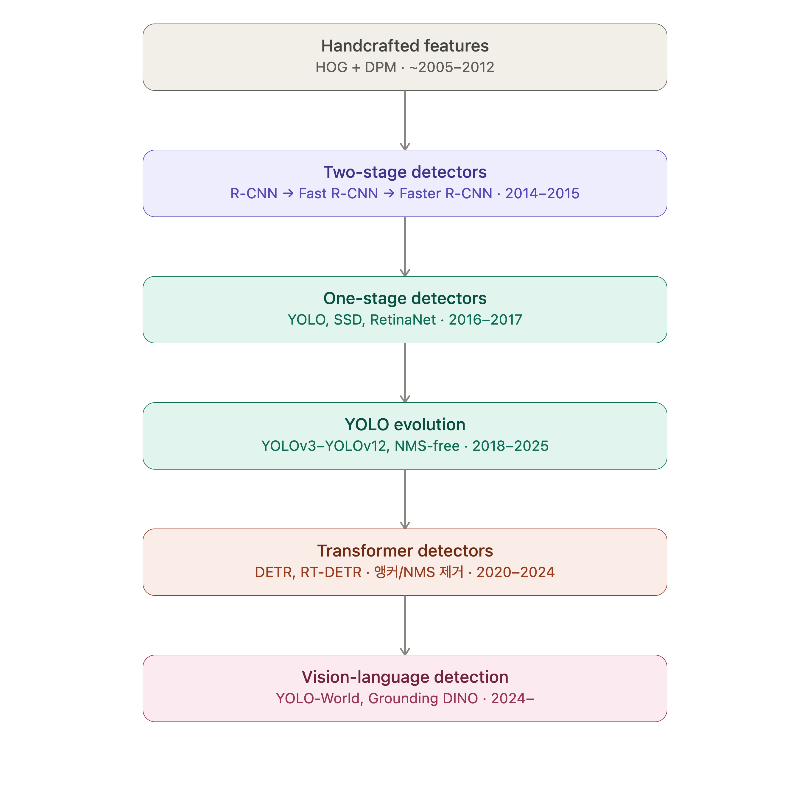

오늘은 이 계보에서 거의 조상격인 R-CNN 패밀리를 살펴보겠습니다.

## 2. R-CNN(Region with CNN)

### 2.1. R-CNN의 등장

#### 2.1.1. R-CNN의 구조

R-CNN은 CNN과 영역 추정(Region Proposal)을 결합한 구조입니다.

쉽게 말하면, ① 객체가 있을 법한 영역들을 제안하고, ② 그 제안된 영역에 어떤 객체가 있는 지 판단하는 과정입니다.

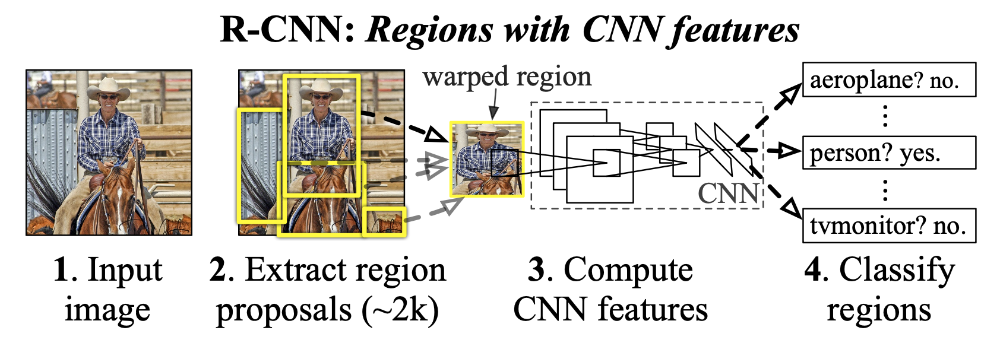

1. **Input Image**: 입력 이미지는 어떤 크기의 이미지든 괜찮습니다.
2. **Region Proposal: Selective Search**라는 별도의 알고리즘(CNN이 아님!)으로 이미지에서 "객체가 있을 법한 후보 영역(Region)" 약 2000개를 뽑아냅니다. 이 2000개의 영역의 크기와 <u>**가로세로 비율은 제각각**</u>일 수 있습니다.

   > 후보 영역의 개수는 2000개로 고정된 게 아닙니다. 데이터에 따라 다를 수 있습니다.

   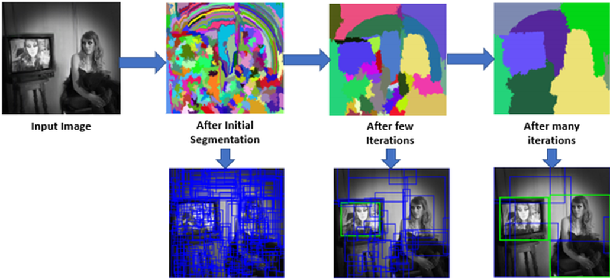

3. **Warp**: 이 영역들은 CNN을 통과한 다음 FC layer로 넘어갈 텐데, FC layer에 넘기기 위해서는 데이터의 차원이 일정해야 합니다. 따라서 <u>**후보 영역(Region)들을 일정한 크기로 변형**</u>하는 과정이 필요합니다. 이 방식을 warping이라고 합니다. R-CNN에서는 영역을 $227×227$로 warping 합니다.
4. **Feature Extraction**: 이 영역(region) 하나하나를 **각각 독립적으로 CNN에 통과**시켜 특징을 뽑습니다. 이 결과로 약 2000개의 Feature map이 생성됩니다.
5. **FCNN**: "위치 정보가 담긴 특징(Feature map)"을 <u>**"이게 무엇인지 판단하기 좋은 추상적인 특징"**</u>으로 압축하는 역할을 담당합니다. 논문에서는 fc6, fc7 총 두 층의 FCNN을 사용했습니다. 이 두 층을 거치면 최종적으로 4096차원이 출력됩니다.
6. **Classification with SVM**: FCNN의 결과로 나온 정보를 클래스 개수($N$)만큼 SVM에 넣어서 최종적으로 $2000 \times N$ 점수 행렬을 내뿜습니다.
7. **NMS 적용**: 마지막에 비최대 억제(Non-Maximum Suppression)이라는 후처리를 클래스별로 각각 적용해 의미있는 박스들만 최종 출력에 남깁니다.

   > **🤔 NMS란?**
   >
   > 예를 들어, "고양이" 클래스에서 점수가 가장 높은 박스를 하나 뽑아 남기고, 그 박스와 많이 겹치는(IoU가 높은) 다른 후보들은 "어차피 같은 고양이를 가리키는 중복이다"라고 판단해서 제거하는 방식입니다. 이걸 반복해서 클래스마다 진짜 남길 박스만 골라냅니다.

8. **Bounding-box Regression**: 회귀로 바운딩 박스 위치를 보정합니다.

   > R-CNN 논문의 오차 분석(Figure 5, Figure 6)을 보면, 가장 흔한 오류 유형이 클래스를 잘못 맞춘 게 아니라 <strong>위치를 부정확하게 잡은 것(poor localization)</strong>이었다고 나옵니다. 그래서 이 문제를 해결하기 위해 넣은 보정 장치입니다.

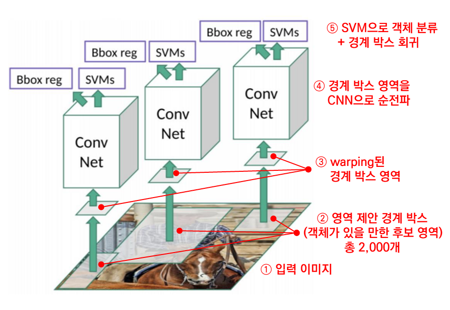

즉 R-CNN은 <u>**Object detection = 수많은 작은 Classification 문제의 반복**</u>으로 문제를 바꿔치기한 겁니다. CNN 자체를 바꾼 게 아니라, CNN 앞뒤에 다른 알고리즘(후보 영역 추출, SVM)을 붙여서 우회한 접근입니다.

#### 2.1.2. R-CNN의 성능

이 아이디어 자체는 성공적이어서 기존 방법(HOG+DPM 등)보다 정확도가 30% 넘게 뛰어올랐습니다.

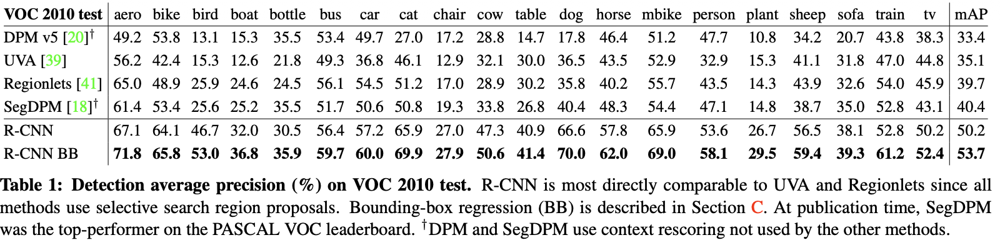

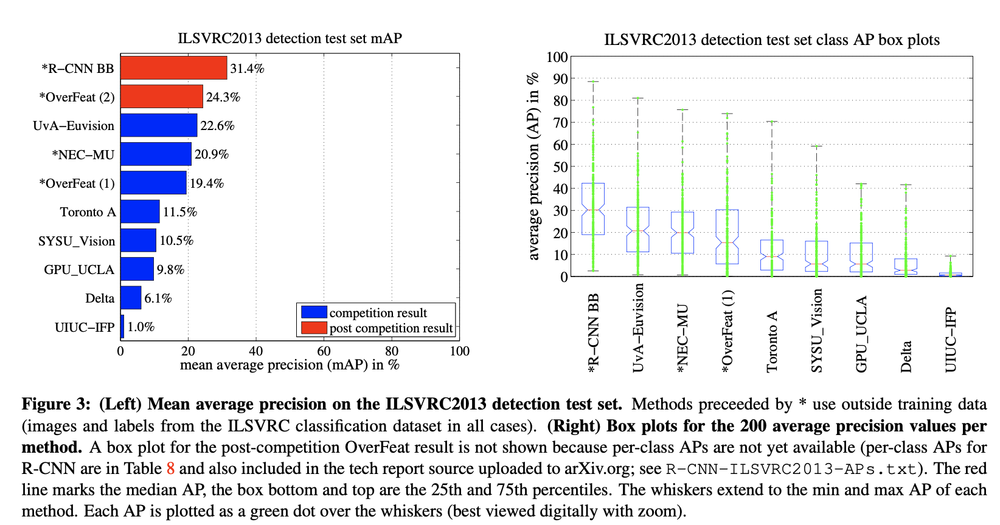

### 2.2. R-CNN의 한계

#### 2.2.1. Selective Search의 한계: CPU에서 직렬로 이루어진다.

Selective Search는 CNN이 아니라 전통적인 컴퓨터 비전 알고리즘입니다. 원리는 다음과 같습니다.

1. 이미지를 아주 작은 조각들(superpixel)로 잘게 쪼갠다
2. 색깔, 질감(texture) 등이 비슷한 이웃 조각들을 **탐욕적으로(greedy)** 하나씩 합쳐나간다
3. 합쳐진 결과가 점점 커지면서 "이 정도 크기의 뭉치가 객체일 수 있겠다" 싶은 후보들을 계속 쌓아간다

이 "합치기" 과정이 문제입니다. **바로 다음 단계에 어떤 두 조각을 합칠지는, 방금 전 단계에서 무엇을 합쳤는지에 따라 달라집니다.** 즉 단계 A의 결과가 있어야 단계 B를 계산할 수 있는 구조입니다. 이런 걸 <u>**순차적 의존성(sequential dependency)**</u>이 있다고 하는데, 이런 종류의 알고리즘은 GPU로 병렬화하기가 근본적으로 어렵습니다. GPU는 "서로 독립적인 계산을 동시에 많이 하는" 데는 강하지만, "이전 결과가 있어야 다음이 정해지는" 계산에는 도움이 안 되기 때문입니다.

그래서 Faster R-CNN 논문에서도 이렇게 언급합니다:

> *Selective Search, one of the most popular methods, greedily merges superpixels based on engineered low-level features... at 2 seconds per image in a CPU implementation*

즉 Selective Search는 **애초에 CPU에서 돌아가는, 병렬화가 잘 안 되는 알고리즘**이라 이미지 한 장당 2초씩 걸립니다. GPU를 아무리 잘 써도 CNN 쪽 속도만큼 빨라지지 않는 거죠. (실제로 이 부분이 나중에 Faster R-CNN이 RPN으로 완전히 대체해버리는 지점이기도 합니다.)

#### 2.2.2. 2000개 warped region에 대해서 각각 CNN 연산이 필요하다

R-CNN이 느린 진짜 이유는 <u>**같은 계산을 약 2000번 중복해서 하기 때문**</u>입니다.

Selective Search 알고리즘은 대략 2000개의 후보 영역을 뽑아준다고 언급되어있습니다.

> *At test time, we run selective search on the test image to extract around 2000 region proposals (we use selective search's "fast mode" in all experiments)*

하지만 이 약 2000개의 영역들은 서로 많이 겹칩니다. 아래 사진을 보면, 사람 하나인데도 여러 영역이 서로 겹쳐있는 모습을 볼 수 있습니다.

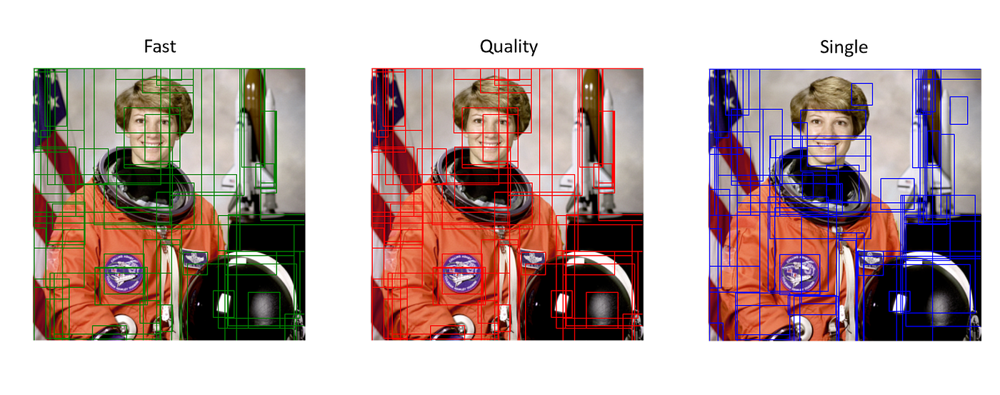

이 영역들을 잘라서 각각 독립적으로 CNN에 넣으면:

- 영역 A와 영역 B가 이미지의 80%를 공유하고 있다고 해도, CNN은 이 사실을 전혀 모릅니다
- 각 영역을 227×227로 따로 잘라서(warping) 넣기 때문에, **겹치는 부분의 conv 연산(필터 곱셈)을 A를 처리할 때 한 번, B를 처리할 때 또 한 번, 완전히 새로 계산**합니다
- 이걸 GPU로 아무리 배치를 묶어서 "동시에" 처리해도, **계산량(FLOPs) 자체가 줄어들지 않습니다.** 병렬화는 "같은 일을 동시에 여러 개 처리해서 wall-clock time을 줄이는 것"이지, "중복된 일을 없애는 것"이 아니거든요.

  > *Wall clock time(벽시계 시간)은 컴퓨터 과학에서 어떤 작업이 시작부터 끝날 때까지 실제로 흘러간 총 소요 시간을 뜻합니다.*

게다가 실용적인 제약도 있습니다. GPU 메모리는 한정되어 있어서 2000개를 무한정 한 번에 배치로 못 넣고 나눠서 여러 번 돌려야 하고, 각 영역마다 fully connected layer의 큰 행렬 곱셈까지 반복해야 하니 부담이 큽니다. Fast R-CNN 논문에 나온 실측치로는 VGG16 기준 이미지 한 장에 **47초**가 걸렸습니다 (GPU 사용 기준인데도).

> *Object detection is slow. At test-time, features are extracted from each object proposal in each test image. Detection with VGG16 takes 47s / image (on a GPU).*

#### 2.2.3. 학습이 여러 단계로 쪼개진 파이프라인이다(multi-stage pipeline)

R-CNN은 하나의 모델을 한 번에 학습시키는 게 아니라, 순서대로 따로따로 학습시켜야 했습니다.

- 1단계: CNN을 로그 손실(log loss)로 파인튜닝
- 2단계: CNN에서 뽑은 특징으로 클래스별 SVM을 따로 학습
- 3단계: 바운딩 박스 위치를 보정하는 회귀 모델을 또 따로 학습

이 세 단계가 서로 다른 목적함수로 따로 학습되다 보니, 관리도 번거롭고 각 단계의 오차가 다음 단계로 전달되면서 최적이 아닌 결과가 나올 여지가 컸습니다.

#### 2.2.4. 학습 시간과 저장공간이 어마어마하게 든다

SVM과 바운딩 박스 회귀를 학습시키려면, 이미지마다 뽑은 약 2000개의 후보 영역 전부에 대해 CNN 특징을 미리 계산해서 **디스크에 통째로 저장**해둬야 했습니다. VGG16 같은 깊은 네트워크를 쓰면 VOC07 학습 데이터(이미지 5천 장)만으로도 GPU 기준 2.5일이 걸리고, 저장 공간도 수백 기가바이트가 필요했습니다.

## 3. Fast R-CNN

> 📌 **핵심 아이디어**
>
> **"후보 영역(region)을 만든 다음에 CNN에 넣지 말고, CNN을 통과한 feature map에다가 region을 겹치자!"**
>
> **⭐️ 추가된 개념**
>
> - **Convolution + Selective Search**
> - **RoI Pooling**
> - **Softmax**

### 3.1. Fast R-CNN의 등장

#### 3.1.1. Fast R-CNN의 구조

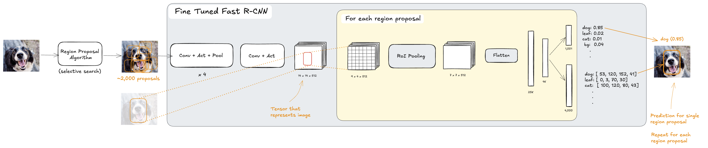

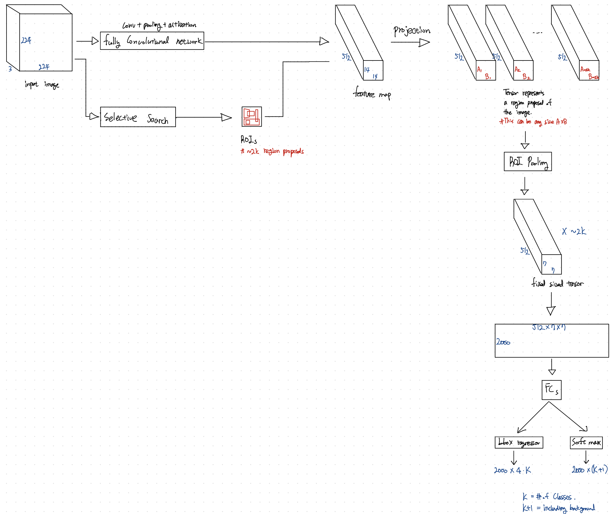

1. **Input image (224×224×3):**

   원본 이미지 하나가 들어옵니다. 이 이미지는 그림처럼 **두 갈래로 동시에** 쓰입니다.

2. **Convolution + Selective Search**

   아래 두 과정이 병렬로 동시에 진행됩니다.

   1. **Fully Convolutional Network (conv + pooling + activation)**

      원본 이미지 전체가 conv 레이어들만으로 이루어진 네트워크를 **딱 한 번** 통과합니다. 그 결과로 <strong>feature map (14×14×512)</strong>이 나옵니다. 여기서 512는 채널(필터) 개수이고, 14×14는 원본 100×100이 여러 번의 conv/pooling을 거치며 축소된 공간 크기입니다.

   2. **Selective Search**

      같은 원본 이미지가 이것과는 별개로 Selective Search에도 들어가서 <strong>RoI들(후보 영역 좌표 목록)</strong>을 뽑아냅니다.

3. **Projection**

   Selective Search가 뽑은 RoI 좌표(원본 이미지 좌표계)를, feature map 좌표계로 환산합니다. 그 결과로 <u>**feature map 위에서 RoI 위치만큼만 잘라낸 조각**</u>이 생성됩니다. 즉, 만약 RoI가 2000개였다면, $512 \times A_i \times B_i$ 텐서가 2000개 있는 거죠.

   > *쿠키 반죽(feature map)에 쿠키 커터(RoI)로 잘라내는 것 처럼요*

   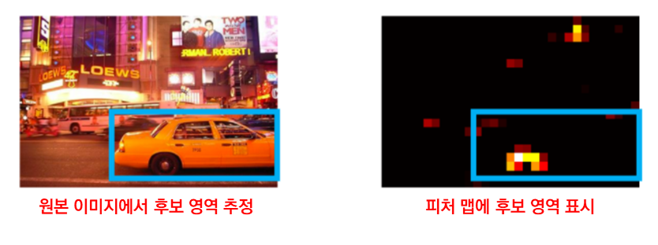

4. **RoI Pooling**

   이 가변 크기 $512 \times A_i \times B_i$ 조각을 입력받아, **고정 크기(7×7×512) 텐서**로 변환합니다. RoI마다 원래 크기(A×B)가 달랐어도, RoI Pooling을 거치면 전부 동일한 7×7×512 형태로 통일됩니다.

5. **FCs → 두 갈래 출력**

   고정 크기 텐서가 FC layer들을 통과한 뒤, 마지막에 두 갈래로 갈라져서 결과를 냅니다.

   - **bbox regressor**: 박스 위치 보정값 출력, 차원: $RoIs \times 4 \cdot K$
   - **softmax**: bbox별 클래스 분류 확률 출력, 차원: $RoIs \times (K+1)$

6. **NMS**

   마지막에 비최대 억제(Non-Maximum Suppression)이라는 후처리를 클래스별로 각각 적용해 의미있는 박스들만 최종 출력에 남깁니다.

### 3.2. Fast R-CNN이 R-CNN의 한계들을 정리했나?

| R-CNN의 한계 | Fast R-CNN에서 해결 여부 | 그림에서 대응되는 부분 |
| --- | --- | --- |
| 2000개 영역마다 CNN 반복 | ✅ 해결 | Fully Convolutional Network가 이미지당 1회, RoI는 projection으로 재사용 |
| 여러 단계 파이프라인 | ✅ 해결 | FCs → softmax + bbox regressor 동시 출력, 하나의 네트워크 |
| 저장공간/학습시간 과다 | ✅ 해결 | 특징 캐싱 없이 end-to-end로 바로 학습 |
| Selective Search가 CPU 직렬 | ❌ 미해결 (그대로 유지) | Selective Search 박스가 그대로 존재 |

✅ **"2000개의 warped region 각각에 CNN 연산이 필요하다" → 해결됨**

R-CNN은 2000개의 잘린 이미지 각각을 처음부터 끝까지 CNN에 통과시켰지만, Fast R-CNN은 conv 연산(Fully Convolutional Network)을 <u>**이미지당 1번만**</u> 수행하고, RoI들은 그 결과물(feature map) 위에서 위치만 잘라 쓰는 방식<u>**(projection)**</u>으로 바뀌었습니다. 겹치는 영역의 conv 계산이 자동으로 공유되므로, 후보 영역 개수와 무관하게 conv 비용은 고정됩니다.

✅ **"학습이 여러 단계로 쪼개진 파이프라인이다" → 해결됨**

FCs에서 나온 출력이 **bbox regressor와 softmax로 동시에** 갈라집니다. R-CNN처럼 (1) CNN 파인튜닝 → (2) SVM 학습 → (3) bbox 회귀 학습을 순서대로 따로 하는 게 아니라, 분류와 위치 보정이 **하나의 네트워크, 하나의 multi-task loss로 한 번에** 학습됩니다(end-to-end, single-stage)

✅ **"학습 시간과 저장공간이 어마어마하게 든다" → 해결됨**

R-CNN은 SVM/회귀 학습을 위해 2000개 영역의 특징을 미리 계산해서 디스크에 통째로 저장해야 했습니다. Fast R-CNN은 모든 게 하나의 네트워크로 학습되니 **중간 특징을 디스크에 캐싱할 필요 자체가 없어집니다**(feature caching 불필요). 학습 중에 그때그때 conv → RoI pooling → FC → loss 계산까지 흘러가면 끝입니다.

❌ **"Selective Search가 CPU에서 직렬로 이루어진다" → 해결 안 됨**

**Selective Search는 여전히 그대로 사용**합니다. Fast R-CNN은 conv 연산의 중복만 없앴을 뿐, **RoI를 뽑아내는 방법 자체는 R-CNN과 똑같이 Selective Search를 그대로 쓰기 때문입니다.**

즉 Fully Convolutional Network는 GPU에서 빠르게 병렬 처리되지만, Selective Search는 여전히 CPU 기반의 느린 직렬 알고리즘입니다. 이 두 경로가 별개로 동시에 진행되도록 그려져 있다는 것 자체가, **conv 계산은 아무리 빨라져도 Selective Search가 여전히 병목으로 남아 있다**는 걸 보여줍니다. 실제로 Fast R-CNN 논문도 이 문제를 인지하고 있고, Faster R-CNN 논문 서두에서 이렇게 정리합니다.

> Advances like SPPnet and Fast R-CNN have reduced the running time of these detection networks, exposing region proposal computation as a bottleneck.

즉 conv 쪽이 빨라지고 나니, 상대적으로 **Selective Search가 전체 파이프라인에서 가장 느린 부분으로 부각**된 겁니다. Faster R-CNN에서 이 문제를 새로운 네트워크로 갈아끼면서 해결합니다.

## 4. Faster R-CNN의 등장

앞서 짚었듯이, Fast R-CNN이 R-CNN의 4가지 문제 중 3개(반복 CNN 연산, 파이프라인 분리, 저장공간)는 해결했지만, **RoI를 뽑는 방법(Selective Search) 자체는 그대로** 남아 있었습니다.

conv 연산이 GPU에서 엄청나게 빨라지고 나니, 상대적으로 CPU에서 돌아가는 느린 Selective Search가 전체 파이프라인에서 가장 눈에 띄는 병목이 되어버렸습니다.

> Advances like SPPnet and Fast R-CNN have reduced the running time of these detection networks, exposing <u>**region proposal computation as a bottleneck.**</u>

구체적인 속도 차이도 논문에 나와 있습니다.

> Selective Search... is an order of magnitude slower [than Fast R-CNN's detection network], at 2 seconds per image in a CPU implementation.

즉 Fast R-CNN의 detection 부분은 0.2~0.3초인데, <u>**Selective Search 혼자 2초**</u>가 걸리니 전체 시스템 속도의 발목을 잡는 셈이죠.

### 4.1. Faster R-CNN의 핵심 아이디어: "후보 영역도 CNN이 뽑게 하자"

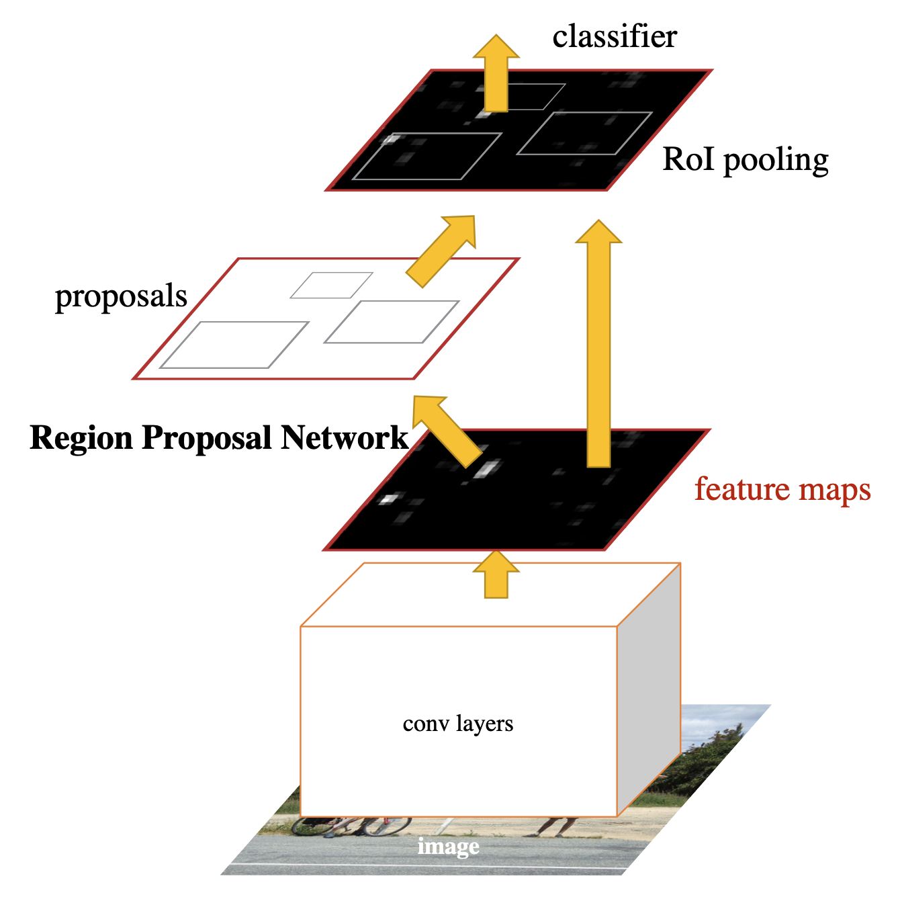

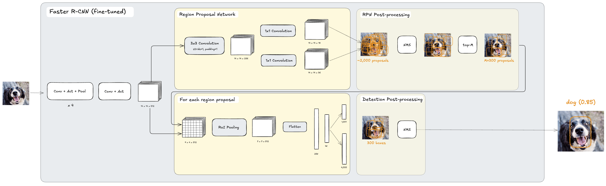

Faster R-CNN은 기존에는 순차처리로 수행하던 **Region Proposal을 Convolution 연산을 통해서 수행**해서 Fast R-CNN의 병목을 해결합니다.

> we introduce novel Region Proposal Networks (RPNs) that <u>**share convolutional layers**</u> with state-of-the-art object detection networks

> 📌 **핵심 포인트**
>
> Faster R-CNN은 <u>**하나의 feature map**</u>을 detection에도 쓰고, RoI를 찾는 데에도 씁니다.
>
> > Because our ultimate goal is to share computation with a Fast R-CNN object detection network, we assume that both nets share a common set of convolutional layers.

이렇게 되면 Selective Search에 필요했던 별도의 2초짜리 CPU 연산이 통째로 사라지고, RoI 추출도 **GPU 위에서, feature map을 재활용해서 거의 공짜로** 이루어집니다.

> the marginal cost for computing proposals is small (e.g., 10ms per image)

### 4.2. RPN(Region Proposal Network)의 구조와 작동 원리

Faster R-CNN의 핵심이 바로 이 RPN인데요, 자세하게 살펴보겠습니다.

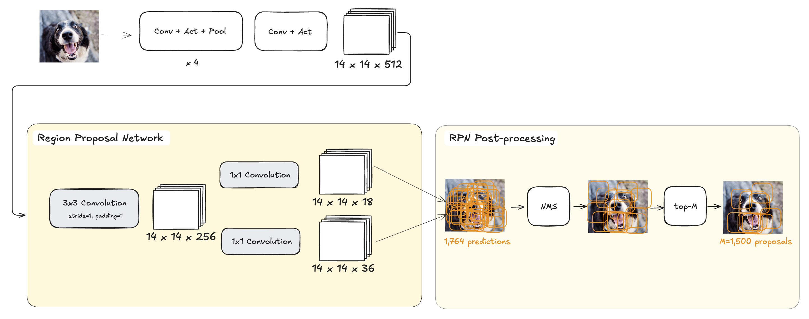

#### 4.2.1. 특정 위치에 객체가 있을까 없을까?

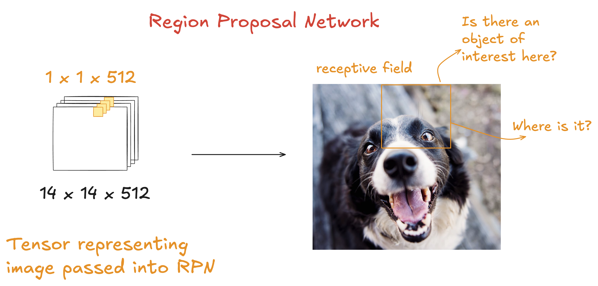

원본 이미지의 특정 영역에 객체가 있다면 그곳에 bbox를 치고, 없다면 bbox를 치지 말아야 할 것입니다. 이를 다시 말하면, feature map의 특정 위치가 가리키는 수용영역(receptive field)에 객체가 있다면 그곳에 bbox를 쳐야하고, 없다면 bbox를 치지 않아야 한다는 것입니다.

**이를 뉴런으로 표현하면 다음과 같이 표현할 수 있습니다.**

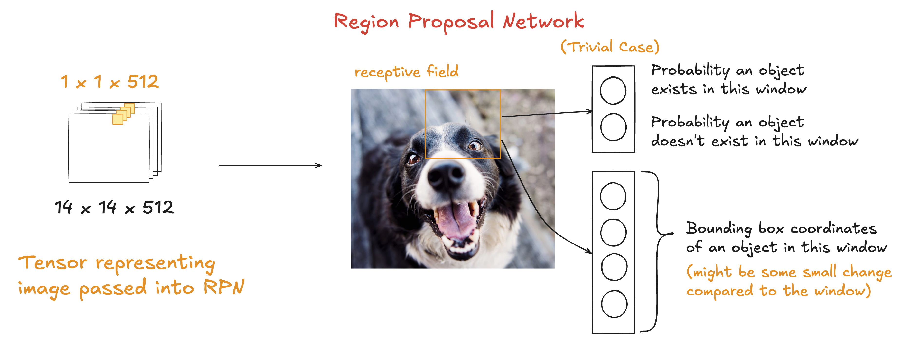

- 뉴런 2개로,<br>→ 특정 영역에 객체가 있을 확률, 객체가 없는 확률
- 뉴런 4개로,<br>→ 특정 영역의 좌표(x,y,w,h)

#### 4.2.2. 특정 위치에 여러 박스(Anchor)를 그려보면 어떨까?

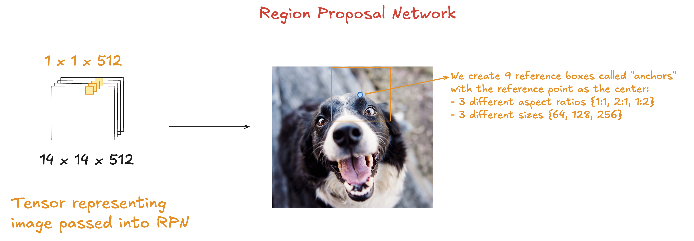

이 네모 영역에 꼭 정방형 네모만 쳐야 할까요? 사실 여기에 정방형도 넣고, 가로로 긴 직사각형도 넣고, 세로로 긴 직사각형도 넣고, 그 크기도 각각 다양하게 해서 여러 모양의 영역을 칠 수 있지 않을까요? 마치 아래 그림처럼요.

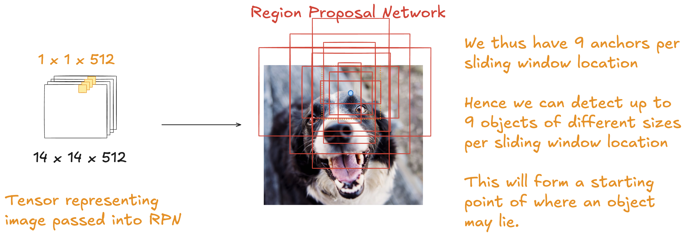

**그래서 등장한 게 <u>Anchor</u>라는 개념입니다.**

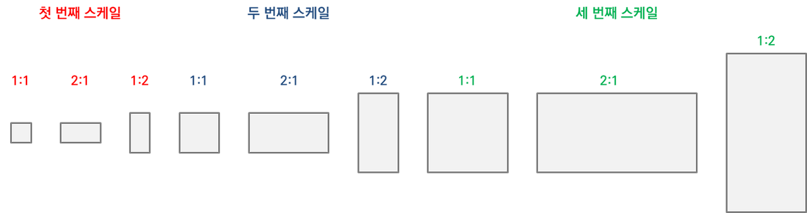

anchor는 **3가지 크기 × 3가지 가로세로 비율 = 9개**를 기본으로 씁니다.

> we introduce novel "anchor" boxes that serve as references at multiple scales and aspect ratios

> By default we use 3 scales and 3 aspect ratios, yielding k = 9 anchors at each sliding position.

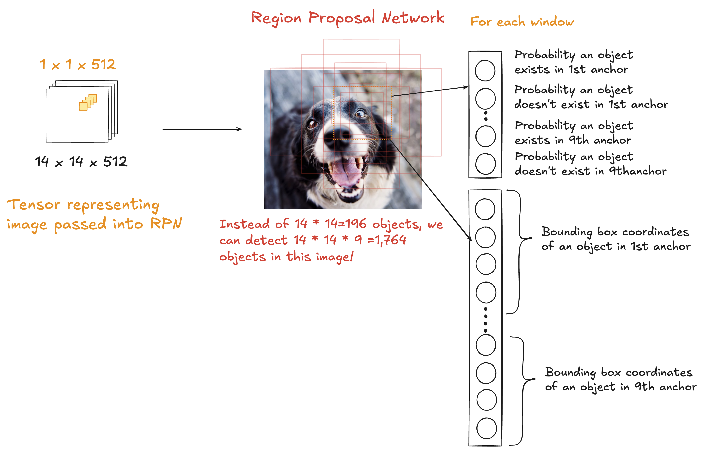

그러면 한 영역에 9개의 anchor를 그릴 수 있고, 그 각각의 anchor에서 2개의 뉴런과 4개의 뉴런으로 bbox와 객체 존재 여부를 표현할 수 있겠네요?

이렇게 이미지의 모든 영역에 9개의 anchor를 겹친다면, $14 \times 14 \times 9 = 1764$개의 anchor를 둘 수 있고, 1764개의 anchor 각각에 대해서 2개와 4개 뉴런으로 객체 존재 여부를 표현할 수 있겠네요?

RPN은 바로 이런 아이디어에 근거를 두고 있습니다.

#### 4.2.3. Mini Sliding Network

- **개념적으로:**

  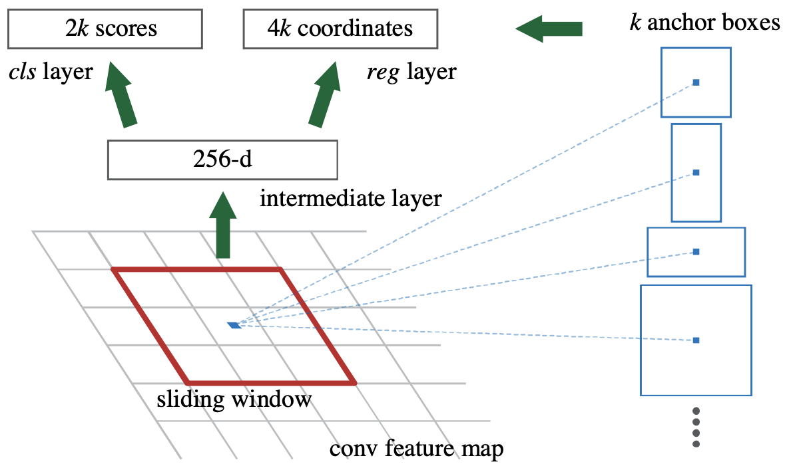

  feature map 위를 3×3 크기의 작은 window가 슬라이딩하면서 각 위치마다 두 가지를 예측합니다.

  > This feature is fed into two sibling fully-connected layers—a box-regression layer (reg) and a box-classification layer (cls)

  - **cls (분류)**: 이 위치의 9개 anchor 각각이 "객체(object)인지 배경(background)인지"
    - 출력 차원: 2k ($\text{객체 or 배경} \times k\text{개 anchor}$)
  - **reg (회귀)**: 9개 anchor 각각을 실제 객체 박스에 맞게 얼마나 옮기고 크기 조절해야 하는지
    - 출력 차원: 4k ($\text{bbox당 4가지 좌표값} \times k\text{개 anchor}$)

- **엄밀하게:**

  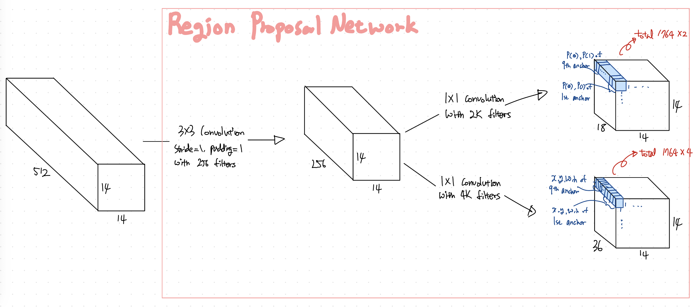

  엄밀하게는 window가 슬라이딩하면서 각각의 위치에서 cls와 reg를 예측하는 게 아닙니다. 이 구조는 **3×3 conv 결과로 나온 텐서에 1×1 conv + 1x1 conv 연산을 각각 취하는 것으로** 구현됩니다.

  > This mini-network is illustrated at a single position in Figure 3 (left)... This architecture is naturally implemented with an n×n convolutional layer followed by two sibling 1 × 1 convolutional layers

  즉 fully connected layer처럼 보이지만 실제로는 **conv 연산으로 구현**되어서, feature map의 모든 위치에 대해 동시에(병렬로) 계산됩니다. 순차적인 슬라이딩이 아니라 conv 연산 한 번으로 전체 위치를 처리하는 겁니다.

#### 4.2.4. RPN Post-Processing: NMS, Top-N

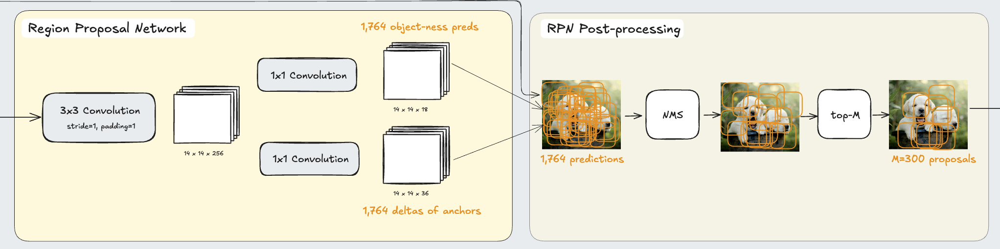

RPN을 통과하면, cls 텐서($14 \times 14 \times 2k$)와, reg 텐서($14 \times 14 \times 4k$)가 결과로 나옵니다.

- **cls 텐서**: 위치마다, 9개 anchor 각각에 대해 "객체다/배경이다" 2개의 점수
- **reg 텐서**: 위치마다, 9개 anchor 각각에 대해 "이 anchor를 어떻게 옮기고 크기 조절할지"($t_x, t_y, t_w, t_h$) 4개 값

즉 이미지 하나에서 총 $14 \times 14 \times 9 = 1764$개의 anchor 후보가 나오고, 각각에 대해 (점수, 보정값) 세트가 하나씩 붙어 있는 상태입니다.

이제 후처리를 해줘야 합니다.

1. **보정값을 적용해서 실제 박스 좌표로 변환**

   $$
   \hat{x}=w_a \cdot t_x + x_a\\
   \hat{y}=h_a \cdot t_y + y_a\\
   \hat{w}=w_a \cdot exp(t_w)\\
   \hat{h}=h_a \cdot exp(t_h)
   $$

2. **이미지 경계를 벗어난 박스 정리**

   anchor는 기계적으로 격자에 배치된 거라, 이미지 밖으로 튀어나가는 것들이 생깁니다. 이런 건 잘라내거나(clip) 제거합니다.

   > During testing, however, we still apply the fully convolutional RPN to the entire image. This may generate cross-boundary proposal boxes, which we clip to the image boundary.

3. **cls 점수로 순위 매기기**

   cls 점수(객체일 확률)를 기준으로 1764개의 박스를 **점수 높은 순으로 정렬**합니다. "이 위치에 진짜로 객체가 있을 것 같다"는 신뢰도가 높은 순서로 줄을 세우는 거예요.

4. **NMS(Non-Maximum Suppression)로 중복 제거**

   이전에 R-CNN, Fast R-CNN에서도 계속 나왔던 그 NMS가 여기서도 똑같이 등장합니다.

   > we adopt non-maximum suppression (NMS) on the proposal regions based on their cls scores. We fix the IoU threshold for NMS at 0.7, which leaves us about 2000 proposal regions per image.

   서로 많이 겹치는 박스들은 점수 가장 높은 것만 남기고 나머지는 제거합니다.

5. **상위 N개만 남기기 → 최종 RoI**

   NMS까지 거친 뒤에도 여전히 많으면, 점수 상위 몇 개(학습 시 2000개, 테스트 시엔 논문 기준 300개)만 골라서 최종 RoI 목록으로 확정합니다.

   > Using the top-N ranked proposal regions for detection... we train Fast R-CNN using 2000 RPN proposals, but evaluate different numbers of proposals at test-time

이제 이렇게 얻은 최종 RoI가 Fast R-CNN의 RoI Pooling 단계로 그대로 들어갑니다.

즉 **Selective Search가 하던 역할을 그대로 RPN이 대신**하는 거고, 그 이후 파이프라인(RoI Pooling부터 최종 분류/박스 보정까지)은 이전에 Fast R-CNN에서 자세히 다뤘던 것과 완전히 동일합니다.

## 5. One-Stage의 등장(YOLO, SSD, RetinaNet)

Two-Stage는 정확하지만 느립니다(실시간 추론이 어려움). 그래서 "후보 영역을 따로 뽑는 단계 자체를 없애고, 이미지를 한 번 보는 것만으로 바로 박스와 클래스를 동시에 예측하자"는 흐름이 등장합니다.

- **YOLO (You Only Look Once, 2016)**: 이미지를 격자로 나누고, 각 격자 칸이 직접 박스와 클래스를 예측. "탐지를 회귀 문제로 통째로 바꿔버림"
- **SSD (Single Shot Detector, 2016)**: 여러 해상도의 feature map에서 동시에 예측해서 다양한 크기의 객체를 잡음
- **RetinaNet (2017)**: One-stage가 Two-stage보다 정확도가 낮았던 이유(배경/객체 불균형)를 Focal Loss로 해결하며 One-stage도 정확도 면에서 경쟁력을 갖추게 됨

이제부터 실시간 탐지(자율주행, CCTV 등)가 실용적으로 가능해집니다.

---

## 6. 그래서 우리는 R-CNN을 코드로 어떻게 사용할까?

```python
import torch
import torchvision
from PIL import Image
from torchvision.transforms import functional as F
import matplotlib.pyplot as plt
import matplotlib.patches as patches

# 1. 사전 학습된 Faster R-CNN 모델 로드
model = torchvision.models.detection.fasterrcnn_resnet50_fpn(weights=torchvision.models.detection.FasterRCNN_ResNet50_FPN_Weights.DEFAULT)
model.eval()  # 평가 모드 설정

# 2. 예측할 이미지 경로 정의
DOG_CAT = "/Users/raewookang/CodeIt/study_1505/data/dog-and-cat.png"
HUMANS = "/Users/raewookang/CodeIt/study_1505/data/multiple-humans.png"
AIRPLANE = "/Users/raewookang/CodeIt/study_1505/data/single-airplane.png"
MANY_ANIMALS = "/Users/raewookang/CodeIt/study_1505/data/many-animals.png"

image_paths = [DOG_CAT, HUMANS, AIRPLANE, MANY_ANIMALS]
images = [Image.open(p).convert("RGB") for p in image_paths]
image_tensors = [F.to_tensor(img) for img in images]

# 3. 모델 예측 수행 (이미지 3장 한번에)
with torch.no_grad():
    predictions = model(image_tensors)
    
# 4. COCO 클래스 이름 (torchvision 사전학습 모델 기준, index 0은 background)
COCO_INSTANCE_CATEGORY_NAMES = [
    '__background__', 'person', 'bicycle', 'car', 'motorcycle', 'airplane', 'bus',
    'train', 'truck', 'boat', 'traffic light', 'fire hydrant', 'N/A', 'stop sign',
    'parking meter', 'bench', 'bird', 'cat', 'dog', 'horse', 'sheep', 'cow',
    'elephant', 'bear', 'zebra', 'giraffe', 'N/A', 'backpack', 'umbrella', 'N/A', 'N/A',
    'handbag', 'tie', 'suitcase', 'frisbee', 'skis', 'snowboard', 'sports ball',
    'kite', 'baseball bat', 'baseball glove', 'skateboard', 'surfboard', 'tennis racket',
    'bottle', 'N/A', 'wine glass', 'cup', 'fork', 'knife', 'spoon', 'bowl',
    'banana', 'apple', 'sandwich', 'orange', 'broccoli', 'carrot', 'hot dog', 'pizza',
    'donut', 'cake', 'chair', 'couch', 'potted plant', 'bed', 'N/A', 'dining table',
    'N/A', 'N/A', 'toilet', 'N/A', 'tv', 'laptop', 'mouse', 'remote', 'keyboard', 'cell phone',
    'microwave', 'oven', 'toaster', 'sink', 'refrigerator', 'N/A', 'book',
    'clock', 'vase', 'scissors', 'teddy bear', 'hair drier', 'toothbrush'
]
SCORE_THRESHOLD = 0.5  

# 5. 예측 결과(바운딩 박스 + 확률)를 이미지 위에 오버레이하여 시각화
n_cols = 2
n_rows = -(-len(images) // n_cols)  # 올림 나눗셈
fig, axes = plt.subplots(n_rows, n_cols, figsize=(6 * n_cols, 6 * n_rows))
axes = axes.flatten()

for ax, img, pred, path in zip(axes, images, predictions, image_paths):
    ax.imshow(img)
    ax.set_title(path.split("/")[-1])
    ax.axis("off")

    boxes = pred["boxes"]
    labels = pred["labels"]
    scores = pred["scores"]

    for box, label, score in zip(boxes, labels, scores):
        if score < SCORE_THRESHOLD:
            continue

        x1, y1, x2, y2 = box.tolist()
        class_name = COCO_INSTANCE_CATEGORY_NAMES[label.item()]

        rect = patches.Rectangle(
            (x1, y1), x2 - x1, y2 - y1,
            linewidth=2, edgecolor="lime", facecolor="none"
        )
        ax.add_patch(rect)
        ax.text(
            x1, max(y1 - 5, 0), f"{class_name}: {score:.2f}",
            color="black", fontsize=10, backgroundcolor="lime"
        )

# 이미지 개수가 격자 칸 수보다 적으면 남는 축은 숨김
for ax in axes[len(images):]:
    ax.axis("off")

plt.tight_layout()
plt.show()
```

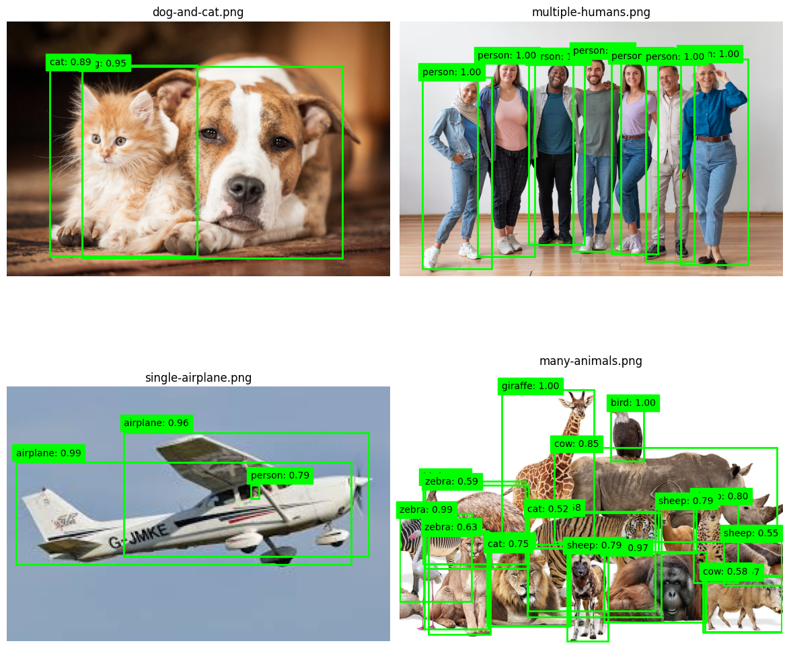

## 📚 참고자료

- [Object Detection vs. Classification in Computer Vision: Explained](https://www.augmentedstartups.com/blog/object-detection-vs-classification-in-computer-vision-explained?srsltid=AfmBOopvx62GuN2C2SvPS4pIxGzkWNEvd8Km47hPJcTkStGkH9MAhO1k)
- [Rich feature hierarchies for accurate object detection and...](https://arxiv.org/abs/1311.2524)
- [컴퓨터 비전 - 10. R-CNN vs. SPP-net vs. Fast R-CNN vs. Faster R-CNN 개요](https://bkshin.tistory.com/entry/%EC%BB%B4%ED%93%A8%ED%84%B0-%EB%B9%84%EC%A0%84-10-R-CNN-vs-SPP-net-vs-Fast-R-CNN-vs-Faster-R-CNN-%EA%B0%9C%EC%9A%94)
- [Selective Search for Object Detection | R-CNN - GeeksforGeeks](https://www.geeksforgeeks.org/machine-learning/selective-search-for-object-detection-r-cnn/)
- [Understanding Selective Search for Object Detection](https://medium.com/dataseries/understanding-selective-search-for-object-detection-3f38709067d7)
- [Fast R-CNN - Explained!](https://www.youtube.com/watch?v=rYLD9RLCqGo)
- [논문 리뷰 - Faster R-CNN 톺아보기](https://bkshin.tistory.com/entry/%EB%85%BC%EB%AC%B8-%EB%A6%AC%EB%B7%B0-Faster-R-CNN-%ED%86%BA%EC%95%84%EB%B3%B4%EA%B8%B0)
- [Faster R-CNN - Explained!](https://www.youtube.com/watch?v=ws0nlxCWWI8)
