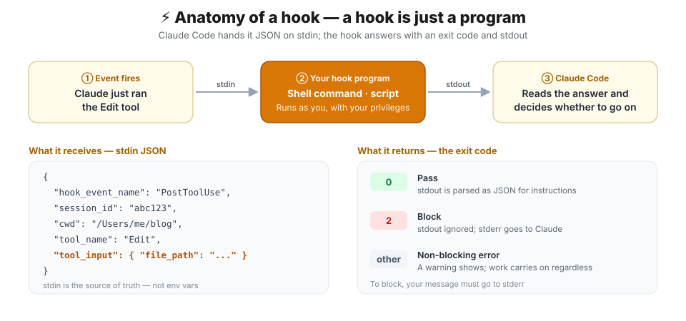
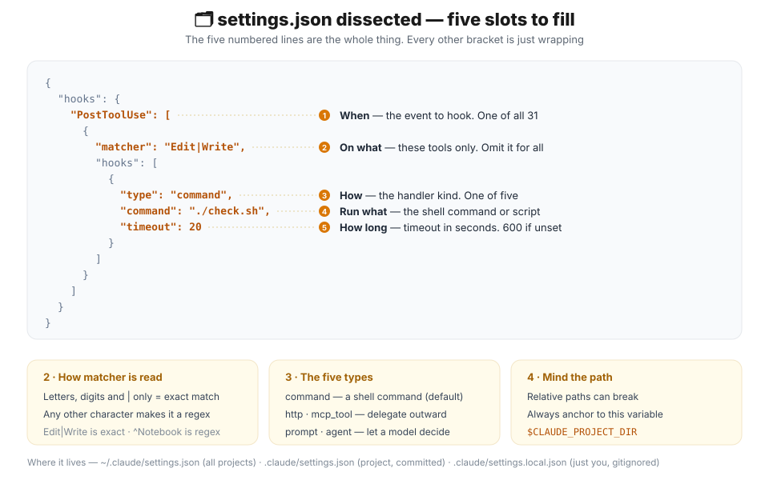
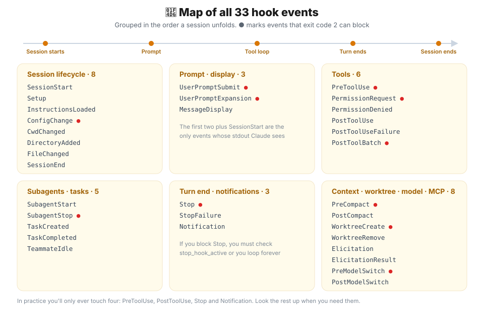
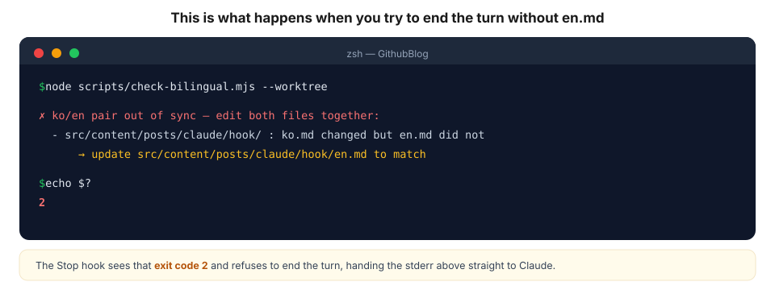
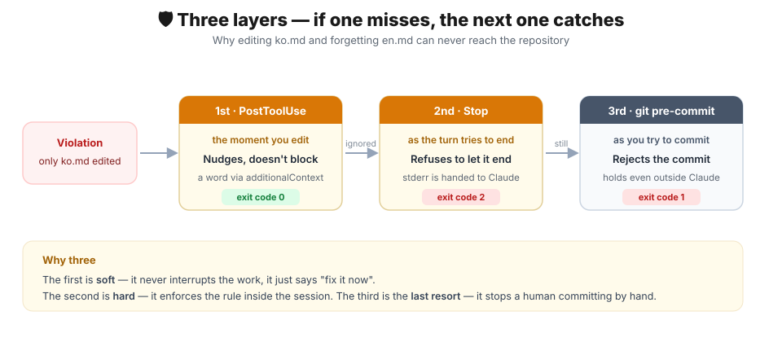
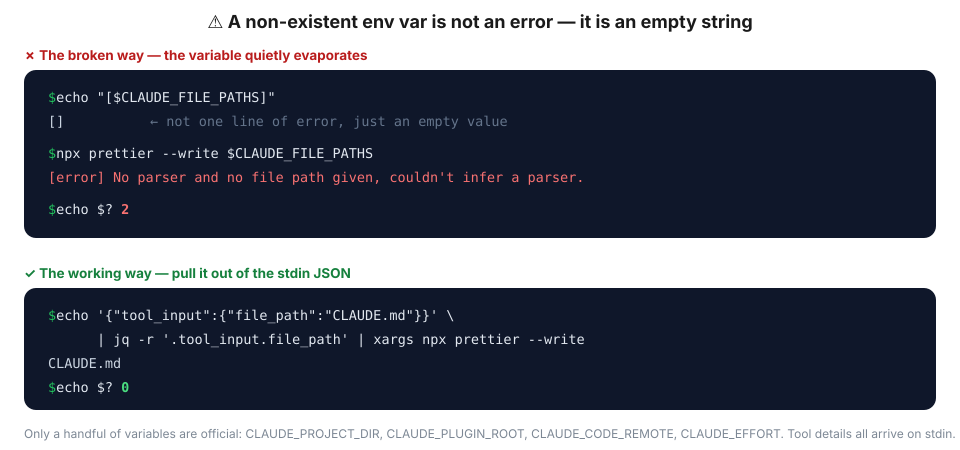

## Getting started — a request gets forgotten, a hook never does

The [automation overview](/posts/claude/intro-automation-hook-loop-routine) walked through Hook, /loop and routine at a glance. This time we're taking the first of the three — **Hook** — all the way to something you actually run.

Before we start, a question. Have you ever written something like this in your `CLAUDE.md`?

> Always format files with Prettier after editing them.

It mostly works. **Mostly.** It gets forgotten when the context grows long, skipped when things are urgent, and overruled when it collides with another instruction. That's because it isn't a rule — it's a **request**.

Hooks are different. A hook isn't a sentence Claude reads and weighs; it's **code that Claude Code, the program, runs unconditionally at a specific moment**. There's no room for judgment, so there's no room for forgetting either.

In this post we'll build three hooks that genuinely run.

1. **A hook that makes this blog check itself** — exactly what this repository runs today
2. **Prettier on every save** — the most common use by far
3. **A hook that pings you when work finishes** — so you can stop staring at the terminal

And at the end, a collection of the **traps** I actually walked into.

## 🎯 When do you reach for a hook?

Hooks aren't a universal answer. Use them only for work that **requires no judgment**.

| A hook is the right answer | A hook is the wrong answer |
| --- | --- |
| Something that must happen every time, no exceptions | Something you decide case by case |
| Something with a fixed outcome (format, lint, check) | Something that needs context (code review, design) |
| Something that must **block** on failure | Something that can safely be ignored |
| Something that finishes fast | Something that takes minutes |

> 💡 If judgment is required, `CLAUDE.md` or a skill is the better fit. If you really want it as a hook anyway, you can set `type` to `prompt` or `agent` (covered below).

## ⚙️ How it works — a hook is just a program

There's only one sentence you need to remember about hooks.

> **A hook is an ordinary program that Claude Code runs, feeding it JSON on stdin.**

No SDK, no framework. A single shell command works. So does a Python script. There are only two rules.

- **What it receives** — one blob of JSON on stdin. Which event fired, which tool it was, what the arguments were — it's all in there.
- **What it returns** — the **exit code** is the substance; stdout JSON is optional.

### The exit code is everything

| Exit code | Meaning | What happens |
| --- | --- | --- |
| **0** | Success | stdout is parsed as JSON for extra instructions |
| **2** | Block | **stdout is ignored entirely**; stderr is handed to Claude |
| anything else | Non-blocking error | A warning shows and work carries on |

This is where people trip most often. **If you want to block, your message must go to `stderr`.** On exit code 2, stdout isn't even read.

And what exit code 2 actually blocks **depends on the event**.

| Event | Can it block? | On exit code 2 |
| --- | --- | --- |
| `PreToolUse` | ✅ | Cancels the tool call itself |
| `PostToolUse` | ❌ | The tool already ran; only stderr reaches Claude |
| `UserPromptSubmit` | ✅ | Rejects the prompt |
| `Stop` · `SubagentStop` | ✅ | Refuses to end the turn and continues the conversation |
| `SessionEnd` · `Notification` | ❌ | Side effects only — no say in the outcome |

### You can see it for yourself in five minutes

Watching it once beats reading about it a hundred times. Let's dump what a hook actually receives.

```bash
#!/usr/bin/env bash
# .claude/hooks/peek.sh — save the hook's input verbatim
jq . > /tmp/hook-input.json
exit 0
```

```json
{
  "hooks": {
    "PostToolUse": [
      {
        "matcher": "Edit|Write",
        "hooks": [
          { "type": "command", "command": "\"$CLAUDE_PROJECT_DIR\"/.claude/hooks/peek.sh" }
        ]
      }
    ]
  }
}
```

Don't forget `chmod +x .claude/hooks/peek.sh`. Then have Claude edit any file and open `/tmp/hook-input.json`. You'll find `tool_name`, `tool_input.file_path`, `session_id` and `cwd` all sitting there. **This JSON is the source of truth for hook input.**

## 🗂️ settings.json — five slots to fill



The configuration always has the same shape: a three-level nest of **event → matcher → hooks array**. That nesting is the only genuinely confusing part.

```json
{
  "hooks": {
    "PostToolUse": [
      {
        "matcher": "Edit|Write",
        "hooks": [
          {
            "type": "command",
            "command": "\"$CLAUDE_PROJECT_DIR\"/.claude/hooks/check.sh",
            "timeout": 20
          }
        ]
      }
    ]
  }
}
```

### Where to put it

| Path | Scope | Shared |
| --- | --- | --- |
| `~/.claude/settings.json` | All my projects | ❌ My machine only |
| `.claude/settings.json` | This project | ✅ Commit it and share with the team |
| `.claude/settings.local.json` | This project, just me | ❌ Gitignored |

Team rules go in `.claude/settings.json`; personal taste (notification sounds and the like) goes in `settings.local.json`. Clean split.

### matcher — there's one quiet trap

`matcher` decides **which tools the hook applies to**. Omit it, or set `"*"`, and it applies to all of them.

| What you write | How it's read |
| --- | --- |
| `"Bash"` | Exactly `Bash`, nothing else |
| `"Edit\|Write"` · `"Edit, Write"` | Either one (`\|` and `,` are the same separator) |
| `"^Notebook"` · `"mcp__memory__.*"` | **Regex** |

The rule: **letters, digits, `_`, `-`, spaces, `,` and `|` only means exact matching**. Slip in any other character and it becomes an **unanchored regex**. Drop in a `.` or a `*` without thinking and you may not get what you meant.

If you want to target one specific command, `if` reads far better than `matcher`.

```json
{ "type": "command", "command": "./guard.sh", "if": "Bash(git push *)" }
```

### type — there are four more besides command

| type | What it does | When |
| --- | --- | --- |
| `command` | Runs a shell command or script | The default. This is what you'll use |
| `http` | POSTs to a URL | When an internal validation service handles it |
| `mcp_tool` | Calls a connected MCP tool | When you already run an MCP server |
| `prompt` | Asks a fast model to decide | Fuzzy judgment you can't express as a rule |
| `agent` | Hands it to a subagent | Experimental. Heavyweight validation |

### Always anchor paths to `$CLAUDE_PROJECT_DIR`

Never trust the hook's working directory. If Claude is working inside a subfolder, relative paths break.

```json
{ "command": "./scripts/check.sh" }                        // ✗ may break
{ "command": "\"$CLAUDE_PROJECT_DIR\"/scripts/check.sh" }  // ✓ always safe
```

Here are the variables you can use. **This is effectively the whole list.**

| Variable | Value |
| --- | --- |
| `CLAUDE_PROJECT_DIR` | Project root |
| `CLAUDE_PLUGIN_ROOT` · `CLAUDE_PLUGIN_DATA` | Plugin hooks only |
| `CLAUDE_CODE_REMOTE` | `"true"` in remote web environments |
| `CLAUDE_EFFORT` | Current reasoning effort |

> ⚠️ There is **no** environment variable holding the tool name or the file path. All of that arrives as stdin JSON. Why that matters comes back in the traps section.

## 📖 A map of all 30 events



The overview post introduced the four best-known events, but there are actually 30. You don't need to memorise them — knowing **that they exist** is enough to look them up when you need one.

**Tool events** — by far the most used.

| Event | When | Used for |
| --- | --- | --- |
| `PreToolUse` | Just before a tool runs | Validation, blocking |
| `PermissionRequest` | When the permission dialog appears | Auto-approve or deny |
| `PermissionDenied` | When auto mode denied a tool | Prompting a retry |
| `PostToolUse` | Right after a tool succeeds | Format, lint, check |
| `PostToolUseFailure` | Right after a tool fails | Collecting failures |
| `PostToolBatch` | After a parallel tool batch resolves | Bulk post-processing |

**Prompt and display events**

| Event | When | Used for |
| --- | --- | --- |
| `UserPromptSubmit` | When you send a prompt | Injecting context, blocking |
| `UserPromptExpansion` | When a command expands into a prompt | Intercepting commands |
| `MessageDisplay` | As the response renders | Reshaping what's shown |

**Session lifecycle events**

| Event | When | Used for |
| --- | --- | --- |
| `SessionStart` | Session starts or resumes | Injecting initial context |
| `Setup` | `--init` family flags | Initial setup |
| `InstructionsLoaded` | `CLAUDE.md` is loaded | Auditing instructions |
| `ConfigChange` | A settings file changes | Blocking the change |
| `CwdChanged` | Working directory changes | Switching environments |
| `FileChanged` | A watched file changes | Detecting `.env` edits |
| `SessionEnd` | Session terminates | Cleanup, logging |

**Turn end and notification events**

| Event | When | Used for |
| --- | --- | --- |
| `Stop` | Claude finishes responding | Final checks, **blocking the turn** |
| `StopFailure` | The turn ended on an API error | Failure alerts |
| `Notification` | A notification fires | Sound, desktop alerts |

**Subagent and task events**

| Event | When |
| --- | --- |
| `SubagentStart` · `SubagentStop` | A subagent starts or finishes |
| `TaskCreated` · `TaskCompleted` | A task is created or completed |
| `TeammateIdle` | A team agent goes idle |

**Context, worktree and MCP events**

| Event | When |
| --- | --- |
| `PreCompact` · `PostCompact` | Around context compaction |
| `WorktreeCreate` · `WorktreeRemove` | A worktree is created or removed |
| `Elicitation` · `ElicitationResult` | An MCP server asks for input |

> 💡 **Only three events have their stdout shown to Claude** — `UserPromptSubmit`, `UserPromptExpansion` and `SessionStart`. Anything you `echo` from the other events lands in the debug log and nowhere else. To speak to Claude, return `additionalContext` JSON; to block, write to stderr.

## 🔥 In practice 1 — this blog checks itself

Now for a hook that genuinely runs: the configuration live in **the very repository holding the post you're reading**.

### The problem

Every post on this blog is written **twice** — once in Korean, once in English. The rule is simple.

```
src/content/posts/<category>/<post-name>/{ko.md, en.md}
```

Edit `ko.md` and you must edit `en.md` too. The problem is that this is **extremely easy to forget**. Touch one Korean paragraph, end the turn, and the English version quietly goes stale. You find out after it's deployed.

I had written "always edit both files together" into `CLAUDE.md` — but as established, that's a request. So I turned it into a hook.

### The configuration

Here is `.claude/settings.json` in full.

```json
{
  "$schema": "https://json.schemastore.org/claude-code-settings.json",
  "hooks": {
    "PostToolUse": [
      {
        "matcher": "Edit|Write",
        "hooks": [
          {
            "type": "command",
            "command": "node \"${CLAUDE_PROJECT_DIR:-.}/scripts/check-bilingual.mjs\" --posttooluse"
          }
        ]
      }
    ],
    "Stop": [
      {
        "hooks": [
          {
            "type": "command",
            "command": "node \"${CLAUDE_PROJECT_DIR:-.}/scripts/check-bilingual.mjs\" --worktree",
            "timeout": 20
          },
          {
            "type": "command",
            "command": "node \"${CLAUDE_PROJECT_DIR:-.}/scripts/check-post-images.mjs\" --worktree",
            "timeout": 20
          }
        ]
      }
    ]
  }
}
```

Three things worth noticing.

1. **The same script is wired to two events.** The `--posttooluse` and `--worktree` flags split its role in two.
2. **`Stop` has no `matcher`.** It isn't a tool event, so there's nothing to match against.
3. **`Stop`'s `hooks` array holds two entries.** Both run, in order.

### Layer one — nudge, don't block (`PostToolUse`)

This fires **the instant you edit**, but blocks nothing at all. It simply has a word with Claude.

```js
// scripts/check-bilingual.mjs — trimmed to the essentials
if (process.argv.includes('--posttooluse')) {
  const payload = readStdinJson();                  // ① read the stdin JSON
  const fp = payload?.tool_input?.file_path || '';  // ② pull out the edited path
  const m = fp.match(/src\/content\/.+\/(ko|en)\.md$/);
  if (m) {
    const other = m[1] === 'ko' ? 'en' : 'ko';
    const sibling = fp.replace(/\/(ko|en)\.md$/, `/${other}.md`);
    process.stdout.write(JSON.stringify({           // ③ return instructions on stdout
      hookSpecificOutput: {
        hookEventName: 'PostToolUse',
        additionalContext:
          `You just edited ${m[1]}.md. Update its sibling ${sibling} to match.`,
      },
    }));
  }
  process.exit(0);                                  // ④ always 0 — it never blocks
}
```

`additionalContext` is the key. Whatever sentence you put there is **injected straight into Claude's context**. Run it for real and you get this.

```console
$ echo '{"tool_input":{"file_path":"src/content/posts/claude/hook/ko.md"}}' \
    | node scripts/check-bilingual.mjs --posttooluse
{"hookSpecificOutput":{"hookEventName":"PostToolUse","additionalContext":"..."}}
$ echo $?
0
```

This layer is non-blocking **on purpose**. Interrupting after every single edit would be maddening. There's no reason to prevent the natural rhythm of fixing three Korean paragraphs and then porting them to English in one go.

### Layer two — actually block (`Stop`)

But ignore the nudge and try to end the turn, and it stops you.

```js
// Guard against re-entry, or the session never ends
if (mode === 'worktree') {
  const payload = readStdinJson();
  if (payload.stop_hook_active) process.exit(0);
}

// … collect changed files from git, check whether only one half of a ko/en pair moved …

if (violations.length > 0) {
  process.stderr.write('\n✗ ko/en pair out of sync — edit both files together:\n');
  for (const v of violations) {
    process.stderr.write(
      `  - ${v.dir}/ : ${v.base} changed but ${v.other} did not\n` +
        `      → update ${v.sibling} to match\n`,
    );
  }
  process.exit(2);   // ← this is the whole trick. Exit 2 and the turn cannot end
}
process.exit(0);
```

Notice that every message goes to `process.stderr`. That's **because stdout is ignored on exit code 2**. Had this used `console.log`, Claude would have seen nothing at all.

Here's what actually happens when you try to end the turn without `en.md`.



```console
$ node scripts/check-bilingual.mjs --worktree

✗ ko/en pair out of sync — edit both files together:
  - src/content/posts/claude/hook/ : ko.md changed but en.md did not
      → update src/content/posts/claude/hook/en.md to match

$ echo $?
2
```

That stderr goes straight to Claude, and instead of ending the turn Claude goes back to fix `en.md`. **Nobody has to nag.**

### Layer three — outside Claude too (`git pre-commit`)

That's already good, but there's a hole. **Hooks only live inside a session.** If I open my editor, change `ko.md` alone and commit, nothing stops me.

So the same script is wired into a git hook as well.

```sh
#!/bin/sh
# .githooks/pre-commit
root="$(git rev-parse --show-toplevel)"
node "$root/scripts/check-bilingual.mjs" --staged || exit 1
node "$root/scripts/check-post-images.mjs" --staged || exit 1
```

```bash
git config core.hooksPath .githooks   # once per clone
```



Each layer has a different character.

| Layer | Moment | Character | Exit code |
| --- | --- | --- | --- |
| `PostToolUse` | Right after an edit | Nudge only (non-blocking) | 0 |
| `Stop` | Attempting to end the turn | Enforced inside the session | 2 |
| `git pre-commit` | Attempting to commit | Enforced on humans too | 1 |

> 💡 **Claude hooks and git hooks aren't competitors.** Put the decision logic in one script and split the modes with flags (`--posttooluse` / `--worktree` / `--staged`), and you reuse the same rule at three checkpoints for free.

## 🎨 In practice 2 — Prettier on every save

The most common use of all. The official one-liner does the job.

```json
{
  "hooks": {
    "PostToolUse": [
      {
        "matcher": "Edit|Write",
        "hooks": [
          {
            "type": "command",
            "command": "jq -r '.tool_input.file_path' | xargs npx prettier --write"
          }
        ]
      }
    ]
  }
}
```

`jq` pulls `tool_input.file_path` out of the stdin JSON and `xargs` hands it to Prettier. If you don't have `jq`, `brew install jq` sorts it out.

That one-liner has a wrinkle, though. Hand Prettier an extension it doesn't know (`.py`, `.svg`) and it errors every time — and that exit code becomes the hook's exit code. For real use, I'd move it into a script.

```bash
#!/usr/bin/env bash
# .claude/hooks/format-on-write.sh
set -euo pipefail

file_path=$(jq -r '.tool_input.file_path // empty')
[ -z "$file_path" ] && exit 0

case "$file_path" in
  *.ts|*.tsx|*.js|*.jsx|*.json|*.css|*.md|*.astro) ;;
  *) exit 0 ;;                       # anything else passes quietly
esac

npx prettier --write "$file_path" >/dev/null 2>&1 || true
exit 0                               # a formatting failure must not block the work
```

```json
{
  "type": "command",
  "command": "\"$CLAUDE_PROJECT_DIR\"/.claude/hooks/format-on-write.sh"
}
```

Don't forget `chmod +x .claude/hooks/format-on-write.sh`. Without the execute bit the hook fails silently.

> ✅ The `// empty`, the `|| true` and that final `exit 0` are the heart of this script. **There's no reason a failing formatter should halt your coding.** Every time you add a hook, ask yourself: "if this fails, should work stop?" Usually the answer is no.

## 🔔 In practice 3 — tell me when it's done

Kicking off a long task and then staring at the terminal is wasted time. Wire up a notification and you can go do something else.

```json
{
  "hooks": {
    "Notification": [
      {
        "hooks": [
          {
            "type": "command",
            "command": "osascript -e 'display notification \"Waiting for your input\" with title \"Claude Code\"'"
          }
        ]
      }
    ],
    "Stop": [
      {
        "hooks": [
          {
            "type": "command",
            "command": "afplay /System/Library/Sounds/Glass.aiff",
            "async": true
          }
        ]
      }
    ]
  }
}
```

- **`Notification`** — raises a desktop alert when Claude is waiting on you (a permission prompt, say).
- **`Stop`** — plays a sound when the turn ends. That's macOS; use `notify-send` on Linux or a PowerShell toast on Windows.

If you'd rather use your terminal's own notifications, a hook can return `terminalSequence` on stdout.

```bash
#!/usr/bin/env bash
# .claude/hooks/notify.sh — terminal notification (OSC 777)
printf '{"terminalSequence":"\\u001b]777;notify;Claude Code;All done\\u0007"}'
exit 0
```

### Heavy commands go `async`

Hooks are **synchronous** by default. A hook that takes ten seconds stalls the session for ten seconds. For something heavy, like a test suite, turn on `async`.

```json
{
  "type": "command",
  "command": "npm test",
  "async": true
}
```

| Option | Behaviour |
| --- | --- |
| (default) | The session waits for the hook to finish |
| `"async": true` | Fires into the background and moves on immediately |
| `"asyncRewake": true` | Runs in the background but **wakes Claude on exit code 2** |

`asyncRewake` is the genuinely useful one. You can run tests in the background and have Claude react **only when they fail**.

## ⚠️ A collection of traps

Ones I walked into, or very nearly did.

### 1. A missing environment variable is an empty string, not an error

The quietest and nastiest trap of the lot. Hooks run in a shell, so **a variable that doesn't exist is substituted with an empty string, with no error, and the command runs anyway.**

There's an example floating around the internet that looks like this.

```json
{ "command": "npx prettier --write $CLAUDE_FILE_PATHS" }
```

Plausible enough — except `CLAUDE_FILE_PATHS` is **not a variable Claude Code sets**. It's absent from the official environment variable list, and the string doesn't even exist inside the executable. I ran it to see what actually happens.



```console
$ echo "[$CLAUDE_FILE_PATHS]"
[]                                    ← not one line of error, just an empty value

$ npx prettier --write $CLAUDE_FILE_PATHS
[error] No parser and no file path given, couldn't infer a parser.
$ echo $?
2
```

The variable vanishes, so `npx prettier --write` runs **with no argument at all**. Prettier tries to read stdin — which is the hook's JSON payload — fails to infer a parser, and dies with exit code 2. In other words: **nothing gets formatted, and every edit hands a hook error to Claude.**

> ⚠️ A typo'd variable (`$CLAUDE_PROJET_DIR`) behaves identically. The shell silently swaps in an empty string, and a command like `rm -rf "$WRONG_VAR/tmp"` turns dangerous in a heartbeat. **Check any variable you put in a hook against the official list.**

> ✅ Environment variables carrying tool information (`tool_name`, `tool_input`, `tool_output`) **have never existed**. All of it arrives as stdin JSON, and `jq` is the only sane way to get at it.

### 2. `Stop` hooks can loop forever

If a `Stop` hook exits 2, the turn doesn't end. But once Claude finishes working again, the `Stop` hook runs **again**. If the condition still holds it blocks again, and again, and the session never ends.

That's why the input JSON carries a `stop_hook_active` flag.

```js
const payload = readStdinJson();
if (payload.stop_hook_active) process.exit(0);   // on re-entry, pass quietly
```

> ⚠️ If you use `Stop` or `SubagentStop` to block, those three lines are **mandatory, not optional**.

### 3. On exit code 2, `stdout` isn't even read

```js
console.log('this does nothing');          // ✗ ignored entirely on exit code 2
process.stderr.write('write it this way'); // ✓ reaches Claude
process.exit(2);
```

### 4. Relative paths can break at any time

Never assume the hook's working directory. Anchor everything to `$CLAUDE_PROJECT_DIR`.

### 5. Without a `timeout`, you get ten minutes

The default for `command` hooks is **600 seconds**. Better than waiting forever, but a check hook hanging for ten minutes is a disaster. Give short hooks a short value.

```json
{ "type": "command", "command": "./check.sh", "timeout": 20 }
```

### 6. Hooks run **with your privileges**

This is the most important property of hooks. A hook isn't sandboxed — it's a shell command running with your account's full rights. It can delete files. It can send things over the network.

> ⚠️ If you've cloned someone else's repository, **read** its `.claude/settings.json` before starting a session. A single settings file can carry arbitrary commands. The same goes for plugins and hooks written by others.

### 7. Changed your settings? Check with `/hooks`

When a hook won't fire and you can't see why, work through this list.

1. `/hooks` — confirm with your own eyes that it's registered
2. `chmod +x` — does the script have the execute bit?
3. JSON syntax — one stray comma and the whole thing is ignored
4. `claude --debug` — prints every hook's stdout and stderr

To switch them all off for a moment, one line does it.

```json
{ "disableAllHooks": true }
```

## In one sentence

> **A hook is an ordinary program that takes JSON on stdin and answers with an exit code — and that one exit code is what turns a "request" into a "rule".**

To sum up:

- Only hook work that needs no judgment. If judgment is needed, `CLAUDE.md` or a skill is the right tool.
- Get details like file paths from the **stdin JSON, not environment variables**.
- To block, use **exit code 2 plus stderr**; to inform, use **exit code 0 plus `additionalContext`**.
- If a rule really matters, layer it the way this blog does. Hooks only live inside a session.

Next up is the second form of automation, **`/loop`**. Where a hook means "every time an event fires", `/loop` means "periodically, while I get on with something else".

## 📚 References

- [Hooks reference — Claude Code docs](https://code.claude.com/docs/en/hooks)
- [Automate actions with hooks — Hooks guide](https://code.claude.com/docs/en/hooks-guide)
- [settings.json reference](https://code.claude.com/docs/en/settings)
- [Automation: Hook, /loop, routine — the series overview](/posts/claude/intro-automation-hook-loop-routine)
- [Mastering Claude Code — Ch01 Deep Dive (lecture slides, Korean)](https://claudecode-lecture.vercel.app/Part1-Claude_Code_%EB%A7%88%EC%8A%A4%ED%84%B0%ED%95%98%EA%B8%B0/Ch01-Claude_Code_%EB%94%A5%EB%8B%A4%EC%9D%B4%EB%B8%8C/learn.html)
