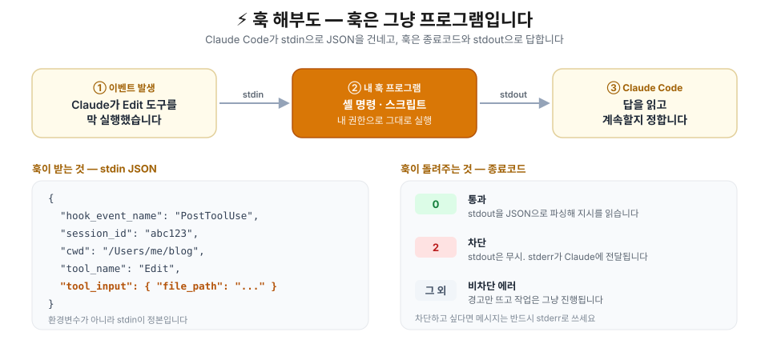
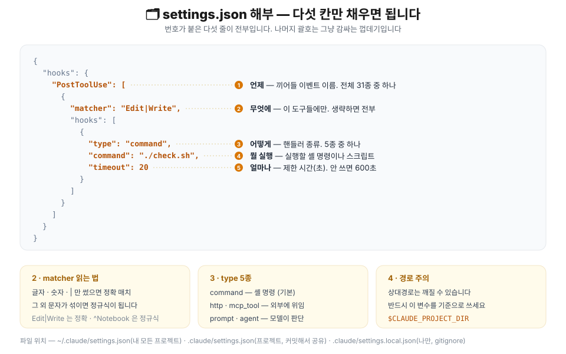
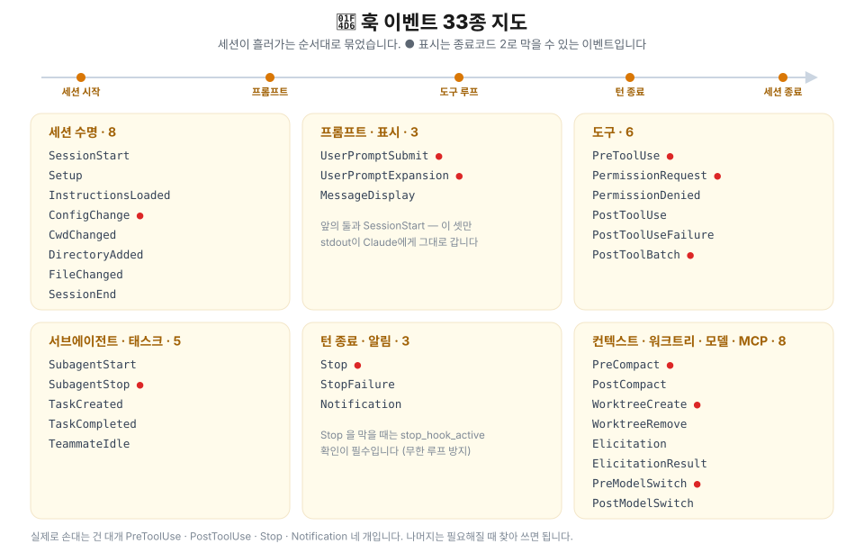
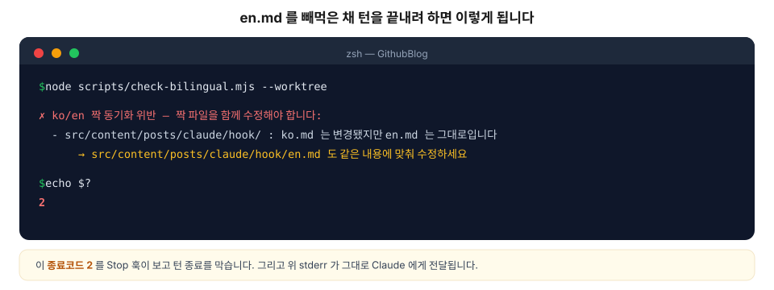
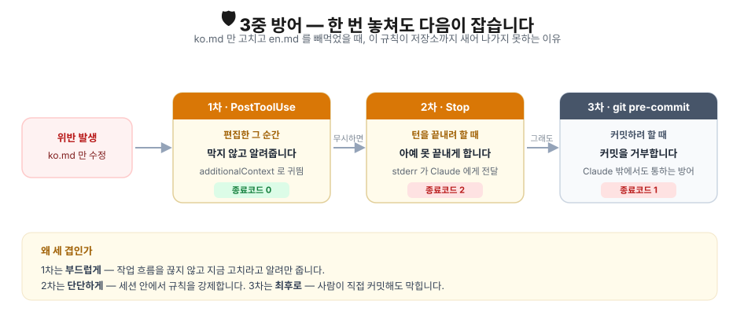
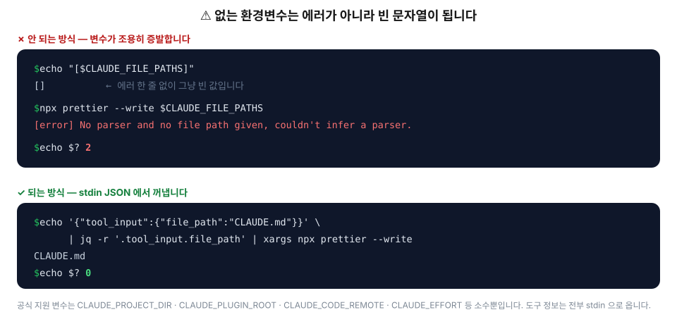

## 들어가며 — 부탁은 잊히지만 훅은 잊히지 않습니다

[자동화 개요 글](/posts/claude/intro-automation-hook-loop-routine)에서 Hook · /loop · routine을 한 바퀴 훑었습니다. 이번엔 그중 첫 번째인 **Hook**을 실제로 설정해서 써먹는 데까지 가보겠습니다.

시작하기 전에 질문 하나 드리겠습니다. `CLAUDE.md`에 이렇게 적어두신 적 있으신가요?

> 파일을 수정하면 항상 prettier로 포맷해주세요.

써두면 대체로 지켜집니다. **대체로**요. 컨텍스트가 길어지면 잊히고, 급하면 건너뛰고, 다른 지시와 부딪히면 밀립니다. 이건 규칙이 아니라 **부탁**이기 때문입니다.

훅은 다릅니다. 훅은 Claude가 읽고 판단하는 문장이 아니라, **Claude Code라는 프로그램이 특정 순간에 무조건 실행하는 코드**입니다. 판단이 개입할 여지가 없으니 잊힐 여지도 없습니다.

이 글에서는 실제로 돌아가는 훅 세 개를 만들어보겠습니다.

1. **이 블로그가 스스로를 검사하는 훅** — 지금 이 저장소에서 운영 중인 것 그대로
2. **저장할 때마다 prettier** — 가장 흔한 용도
3. **다 끝나면 알려주는 훅** — 터미널을 안 쳐다봐도 되게

그리고 마지막에 제가 실제로 밟았던 **함정들**을 모아두겠습니다.

## 🎯 언제 훅을 쓰나요

훅은 만능이 아닙니다. **판단이 필요 없는 일**에만 씁니다.

| 훅이 정답인 일 | 훅이 오답인 일 |
| --- | --- |
| 매번 예외 없이 일어나야 하는 일 | 상황을 봐가며 결정해야 하는 일 |
| 결과가 정해져 있는 일 (포맷·린트·검사) | 맥락을 읽어야 하는 일 (코드 리뷰·설계) |
| 실패하면 **막아야** 하는 일 | 실패해도 넘어가도 되는 일 |
| 빠르게 끝나는 일 | 몇 분씩 걸리는 일 |

> 💡 판단이 필요하면 훅 대신 `CLAUDE.md`나 스킬을 쓰시는 게 맞습니다. 굳이 훅으로 하고 싶다면 `type`을 `prompt`나 `agent`로 두는 방법도 있습니다(뒤에서 다룹니다).

## ⚙️ 동작 원리 — 훅은 그냥 프로그램입니다

훅에 대해 딱 한 문장만 기억하시면 됩니다.

> **훅은 Claude Code가 stdin으로 JSON을 먹여주고 실행하는 평범한 프로그램입니다.**

특별한 SDK도, 프레임워크도 없습니다. 셸 명령 한 줄이어도 되고, 파이썬 스크립트여도 됩니다. 규칙은 두 개뿐입니다.

- **받는 것** — stdin으로 들어오는 JSON 한 덩어리. 어떤 이벤트인지, 어떤 도구였는지, 어떤 인자였는지가 전부 여기 들어 있습니다.
- **돌려주는 것** — **종료코드**가 본체고, stdout JSON은 옵션입니다.

### 종료코드가 전부입니다

| 종료코드 | 의미 | 무슨 일이 벌어지나 |
| --- | --- | --- |
| **0** | 성공 | stdout을 JSON으로 파싱해 추가 지시를 읽습니다 |
| **2** | 차단 | **stdout은 통째로 무시**하고, stderr를 Claude에게 전달합니다 |
| 그 외 | 비차단 에러 | 경고만 뜨고 작업은 그대로 진행됩니다 |

여기서 제일 자주 헛짚는 부분입니다. **막고 싶으면 메시지를 반드시 `stderr`로 써야 합니다.** 종료코드 2일 때 stdout은 읽지도 않습니다.

그리고 종료코드 2가 실제로 무엇을 막는지는 **이벤트마다 다릅니다.**

| 이벤트 | 막을 수 있나 | 종료코드 2일 때 |
| --- | --- | --- |
| `PreToolUse` | ✅ | 도구 호출 자체를 취소합니다 |
| `PostToolUse` | ❌ | 도구는 이미 실행됐고, stderr만 Claude에게 갑니다 |
| `UserPromptSubmit` | ✅ | 프롬프트를 거부합니다 |
| `Stop` · `SubagentStop` | ✅ | 턴을 못 끝내게 하고 대화를 계속시킵니다 |
| `SessionEnd` · `Notification` | ❌ | 부수효과 전용. 결정권이 없습니다 |

### 5분이면 눈으로 확인할 수 있습니다

말로 백 번 듣는 것보다 한 번 찍어보는 게 빠릅니다. 훅이 실제로 뭘 받는지 파일로 떨궈보겠습니다.

```bash
#!/usr/bin/env bash
# .claude/hooks/peek.sh — 훅이 받는 입력을 그대로 저장합니다
jq . > /tmp/hook-input.json
exit 0
```

```json
{
  "hooks": {
    "PostToolUse": [
      {
        "matcher": "Edit|Write",
        "hooks": [
          { "type": "command", "command": "\"$CLAUDE_PROJECT_DIR\"/.claude/hooks/peek.sh" }
        ]
      }
    ]
  }
}
```

`chmod +x .claude/hooks/peek.sh` 를 잊지 마시고, Claude에게 아무 파일이나 고치게 한 뒤 `/tmp/hook-input.json`을 열어보세요. `tool_name`, `tool_input.file_path`, `session_id`, `cwd`가 전부 들어 있습니다. **이 JSON이 훅 입력의 정본입니다.**

## 🗂️ settings.json — 다섯 칸만 채우면 됩니다



설정은 언제나 같은 모양입니다. **이벤트 → matcher → hooks 배열** 3단 중첩이고, 헷갈리는 건 딱 이 중첩뿐입니다.

```json
{
  "hooks": {
    "PostToolUse": [
      {
        "matcher": "Edit|Write",
        "hooks": [
          {
            "type": "command",
            "command": "\"$CLAUDE_PROJECT_DIR\"/.claude/hooks/check.sh",
            "timeout": 20
          }
        ]
      }
    ]
  }
}
```

### 어디에 쓰나

| 경로 | 범위 | 공유 |
| --- | --- | --- |
| `~/.claude/settings.json` | 내 모든 프로젝트 | ❌ 내 컴퓨터에만 |
| `.claude/settings.json` | 이 프로젝트 | ✅ 커밋해서 팀과 공유 |
| `.claude/settings.local.json` | 이 프로젝트, 나만 | ❌ gitignore 대상 |

팀 규칙은 `.claude/settings.json`에, 개인 취향(알림 소리 같은 것)은 `settings.local.json`에 두시면 깔끔합니다.

### matcher — 조용한 함정이 하나 있습니다

`matcher`는 **어떤 도구에만 걸지**를 정합니다. 생략하거나 `"*"`로 두면 전부 걸립니다.

| 쓴 값 | 어떻게 해석되나 |
| --- | --- |
| `"Bash"` | 정확히 `Bash`일 때만 |
| `"Edit\|Write"` · `"Edit, Write"` | 둘 중 하나일 때 (`\|`와 `,`는 같은 구분자) |
| `"^Notebook"` · `"mcp__memory__.*"` | **정규식** |

규칙은 이렇습니다. **글자·숫자·`_`·`-`·공백·`,`·`|` 만 썼으면 정확 매치**, 그 외 문자가 하나라도 섞이면 **정규식(앵커 없음)** 으로 넘어갑니다. `.`이나 `*`를 무심코 넣으면 의도와 다르게 동작할 수 있으니 주의하세요.

특정 명령만 노리고 싶다면 `matcher` 대신 `if`를 쓰는 쪽이 훨씬 읽기 좋습니다.

```json
{ "type": "command", "command": "./guard.sh", "if": "Bash(git push *)" }
```

### type — command 말고도 넷 더 있습니다

| type | 하는 일 | 언제 |
| --- | --- | --- |
| `command` | 셸 명령·스크립트 실행 | 기본값. 대부분 이걸 씁니다 |
| `http` | 지정 URL로 POST | 사내 검증 서버에 물려야 할 때 |
| `mcp_tool` | 연결된 MCP 도구 호출 | 이미 MCP 서버가 있을 때 |
| `prompt` | 빠른 모델에게 판단시킴 | 규칙으로 못 적는 애매한 판단 |
| `agent` | 서브에이전트에게 맡김 | 실험적. 무거운 검증 |

### 경로는 반드시 `$CLAUDE_PROJECT_DIR` 로

훅의 작업 디렉터리를 믿으면 안 됩니다. Claude가 하위 폴더에서 작업 중이면 상대경로는 깨집니다.

```json
{ "command": "./scripts/check.sh" }                        // ✗ 깨질 수 있음
{ "command": "\"$CLAUDE_PROJECT_DIR\"/scripts/check.sh" }  // ✓ 항상 안전
```

쓸 수 있는 환경변수는 이 정도입니다. **이게 사실상 전부입니다.**

| 변수 | 값 |
| --- | --- |
| `CLAUDE_PROJECT_DIR` | 프로젝트 루트 |
| `CLAUDE_PLUGIN_ROOT` · `CLAUDE_PLUGIN_DATA` | 플러그인 훅 전용 |
| `CLAUDE_CODE_REMOTE` | 원격 웹 환경이면 `"true"` |
| `CLAUDE_CODE_BRIDGE_SESSION_ID` | Remote Control 세션 ID |
| `CLAUDE_EFFORT` | 현재 추론 강도 |
| `CLAUDE_PLUGIN_OPTION_<KEY>` | 플러그인 사용자 설정값 |

> ⚠️ 도구 이름이나 파일 경로를 담은 환경변수는 **없습니다.** 그건 전부 stdin JSON으로 옵니다. 이게 왜 중요한지는 함정 모음에서 다시 다루겠습니다.

## 📖 이벤트 31종 지도



개요 글에서는 대표적인 네 개만 소개했지만, 실제로는 31종입니다. 전부 외울 필요는 없고 **"이런 것도 있구나"** 정도만 알아두시면 필요할 때 찾아 쓸 수 있습니다.

**도구 계열** — 제일 많이 씁니다.

| 이벤트 | 언제 | 쓰임 |
| --- | --- | --- |
| `PreToolUse` | 도구 실행 직전 | 검증·차단 |
| `PermissionRequest` | 권한 창이 뜰 때 | 자동 승인·거부 |
| `PermissionDenied` | 자동 모드가 거부했을 때 | 재시도 유도 |
| `PostToolUse` | 도구 성공 직후 | 포맷·린트·검사 |
| `PostToolUseFailure` | 도구 실패 직후 | 실패 수집 |
| `PostToolBatch` | 병렬 도구 묶음이 끝났을 때 | 일괄 후처리 |

**프롬프트·표시 계열**

| 이벤트 | 언제 | 쓰임 |
| --- | --- | --- |
| `UserPromptSubmit` | 프롬프트를 보냈을 때 | 컨텍스트 주입·차단 |
| `UserPromptExpansion` | 커맨드가 프롬프트로 펼쳐질 때 | 커맨드 가로채기 |
| `MessageDisplay` | 응답이 화면에 뿌려질 때 | 표시 내용 가공 |

**세션 수명 계열**

| 이벤트 | 언제 | 쓰임 |
| --- | --- | --- |
| `SessionStart` | 세션 시작·재개 | 초기 컨텍스트 주입 |
| `Setup` | `--init` 계열 플래그 | 초기 설정 |
| `InstructionsLoaded` | `CLAUDE.md` 로드 | 지침 감사 |
| `ConfigChange` | 설정 파일 변경 | 변경 차단 |
| `CwdChanged` | 작업 디렉터리 변경 | 환경 전환 |
| `DirectoryAdded` | `/add-dir` 로 폴더 추가 | 추가 폴더 준비·점검 |
| `FileChanged` | 감시 파일 변경 | `.env` 변화 감지 |
| `SessionEnd` | 세션 종료 | 정리·기록 |

**턴 종료·알림 계열**

| 이벤트 | 언제 | 쓰임 |
| --- | --- | --- |
| `Stop` | Claude가 응답을 마칠 때 | 마무리 검사·**턴 차단** |
| `StopFailure` | API 에러로 끝났을 때 | 실패 알림 |
| `Notification` | 알림이 발생할 때 | 소리·데스크톱 알림 |

**서브에이전트·태스크 계열**

| 이벤트 | 언제 |
| --- | --- |
| `SubagentStart` · `SubagentStop` | 서브에이전트 시작·종료 |
| `TaskCreated` · `TaskCompleted` | 태스크 생성·완료 |
| `TeammateIdle` | 팀 에이전트가 유휴 상태로 |

**컨텍스트·워크트리·MCP 계열**

| 이벤트 | 언제 |
| --- | --- |
| `PreCompact` · `PostCompact` | 컨텍스트 압축 전후 |
| `WorktreeCreate` · `WorktreeRemove` | 워크트리 생성·제거 |
| `Elicitation` · `ElicitationResult` | MCP 서버가 입력을 요청할 때 |

> 💡 **stdout이 Claude에게 보이는 이벤트는 셋뿐입니다** — `UserPromptSubmit`, `UserPromptExpansion`, `SessionStart`. 나머지 이벤트에서 그냥 `echo`한 내용은 디버그 로그로만 갑니다. Claude에게 말을 걸고 싶으면 `additionalContext` JSON을 쓰거나, 차단할 거라면 stderr로 쓰세요.

## 🔥 실전 1 — 이 블로그는 스스로를 검사합니다

이제 진짜 돌아가는 훅입니다. **지금 읽고 계신 이 글이 담긴 저장소에서 실제로 운영 중인** 설정입니다.

### 문제

이 블로그는 한 글을 한국어·영어 **두 벌**로 씁니다. 규칙은 단순합니다.

```
src/content/posts/<카테고리>/<글이름>/{ko.md, en.md}
```

`ko.md`를 고치면 `en.md`도 같이 고쳐야 합니다. 문제는 이게 **너무 쉽게 잊힌다**는 겁니다. 한국어 문단 하나만 손보고 턴을 끝내면, 영어 글은 조용히 낡습니다. 배포되고 나서야 알아차리게 되죠.

`CLAUDE.md`에 "항상 짝을 함께 고치세요"라고 적어뒀지만, 앞서 말씀드린 대로 그건 부탁입니다. 그래서 훅으로 바꿨습니다.

### 설정

`.claude/settings.json` 전문입니다.

```json
{
  "$schema": "https://json.schemastore.org/claude-code-settings.json",
  "hooks": {
    "PostToolUse": [
      {
        "matcher": "Edit|Write",
        "hooks": [
          {
            "type": "command",
            "command": "node \"${CLAUDE_PROJECT_DIR:-.}/scripts/check-bilingual.mjs\" --posttooluse"
          }
        ]
      }
    ],
    "Stop": [
      {
        "hooks": [
          {
            "type": "command",
            "command": "node \"${CLAUDE_PROJECT_DIR:-.}/scripts/check-bilingual.mjs\" --worktree",
            "timeout": 20
          },
          {
            "type": "command",
            "command": "node \"${CLAUDE_PROJECT_DIR:-.}/scripts/check-post-images.mjs\" --worktree",
            "timeout": 20
          }
        ]
      }
    ]
  }
}
```

눈여겨볼 점 세 가지입니다.

1. **같은 스크립트를 두 이벤트에 다르게 걸었습니다.** `--posttooluse`와 `--worktree` 플래그로 역할을 나눕니다.
2. **`Stop`에는 `matcher`가 없습니다.** 도구 이벤트가 아니니 걸 대상이 없습니다.
3. **`Stop`의 `hooks` 배열에 두 개가 들어 있습니다.** 순서대로 둘 다 실행됩니다.

### 1차 방어 — 막지 않고 알려주기 (`PostToolUse`)

편집한 **바로 그 순간** 끼어들지만, 아무것도 막지 않습니다. 그냥 Claude에게 귀띔만 합니다.

```js
// scripts/check-bilingual.mjs — 핵심만 추린 것
if (process.argv.includes('--posttooluse')) {
  const payload = readStdinJson();                  // ① stdin JSON 을 읽고
  const fp = payload?.tool_input?.file_path || '';  // ② 편집된 경로를 꺼내고
  const m = fp.match(/src\/content\/.+\/(ko|en)\.md$/);
  if (m) {
    const other = m[1] === 'ko' ? 'en' : 'ko';
    const sibling = fp.replace(/\/(ko|en)\.md$/, `/${other}.md`);
    process.stdout.write(JSON.stringify({           // ③ stdout 으로 지시를 돌려줍니다
      hookSpecificOutput: {
        hookEventName: 'PostToolUse',
        additionalContext:
          `방금 ${m[1]}.md 를 수정했습니다. 짝 파일 ${sibling} 도 같은 내용에 맞춰 갱신하세요.`,
      },
    }));
  }
  process.exit(0);                                  // ④ 항상 0 — 절대 막지 않습니다
}
```

핵심은 `additionalContext`입니다. 여기 담은 문장이 **Claude의 컨텍스트에 그대로 주입**됩니다. 실제로 돌려보면 이런 JSON이 나옵니다.

```console
$ echo '{"tool_input":{"file_path":"src/content/posts/claude/hook/ko.md"}}' \
    | node scripts/check-bilingual.mjs --posttooluse
{"hookSpecificOutput":{"hookEventName":"PostToolUse","additionalContext":"방금 ko.md 를 수정했습니다: …"}}
$ echo $?
0
```

이 단계를 **일부러 비차단으로** 뒀습니다. 편집 한 번마다 작업을 끊으면 짜증나니까요. 한국어를 세 문단 고치고 나서 영어를 한 번에 옮기는 흐름을 막을 이유가 없습니다.

### 2차 방어 — 진짜로 막기 (`Stop`)

하지만 알림을 무시한 채 턴을 끝내려 하면, 그때는 막습니다.

```js
// Stop 훅 재진입 시 무한 루프 방지 — 이 세 줄이 없으면 세션이 영원히 안 끝납니다
if (mode === 'worktree') {
  const payload = readStdinJson();
  if (payload.stop_hook_active) process.exit(0);
}

// … git 으로 변경된 파일을 모아 ko.md / en.md 짝 중 한쪽만 바뀌었는지 검사 …

if (violations.length > 0) {
  process.stderr.write('\n✗ ko/en 짝 동기화 위반 — 짝 파일을 함께 수정해야 합니다:\n');
  for (const v of violations) {
    process.stderr.write(
      `  - ${v.dir}/ : ${v.base} 는 변경됐지만 ${v.other} 는 그대로입니다\n` +
        `      → ${v.sibling} 도 같은 내용에 맞춰 수정하세요\n`,
    );
  }
  process.exit(2);   // ← 여기가 전부입니다. 2 를 뱉으면 턴이 안 끝납니다
}
process.exit(0);
```

메시지가 전부 `process.stderr`로 나가는 걸 보세요. **종료코드 2에서는 stdout이 무시되기 때문**입니다. 여기서 `console.log`를 썼다면 Claude는 아무것도 못 봤을 겁니다.

실제로 `en.md`를 빼먹은 채 턴을 끝내려 하면 이렇게 됩니다.



```console
$ node scripts/check-bilingual.mjs --worktree

✗ ko/en 짝 동기화 위반 — 짝 파일을 함께 수정해야 합니다:
  - src/content/posts/claude/hook/ : ko.md 는 변경됐지만 en.md 는 그대로입니다
      → src/content/posts/claude/hook/en.md 도 같은 내용에 맞춰 수정하세요

$ echo $?
2
```

이 stderr가 그대로 Claude에게 전달되고, Claude는 턴을 끝내는 대신 `en.md`를 고치러 돌아갑니다. **사람이 잔소리할 필요가 없어집니다.**

### 3차 방어 — Claude 밖에서도 (`git pre-commit`)

여기까지도 훌륭하지만 구멍이 하나 있습니다. **훅은 세션 안에서만 삽니다.** 제가 에디터로 직접 `ko.md`만 고치고 커밋하면 아무도 안 막습니다.

그래서 같은 스크립트를 git 훅에도 물렸습니다.

```sh
#!/bin/sh
# .githooks/pre-commit
root="$(git rev-parse --show-toplevel)"
node "$root/scripts/check-bilingual.mjs" --staged || exit 1
node "$root/scripts/check-post-images.mjs" --staged || exit 1
```

```bash
git config core.hooksPath .githooks   # 저장소당 1회
```



세 겹의 성격이 다릅니다.

| 층 | 시점 | 성격 | 종료코드 |
| --- | --- | --- | --- |
| `PostToolUse` | 편집 직후 | 알리기만 (비차단) | 0 |
| `Stop` | 턴 종료 시도 | 세션 안에서 강제 | 2 |
| `git pre-commit` | 커밋 시도 | 사람까지 포함해 강제 | 1 |

> 💡 **훅과 git 훅은 경쟁 관계가 아닙니다.** 판정 로직을 스크립트 하나에 몰아넣고 플래그(`--posttooluse` / `--worktree` / `--staged`)로 모드만 나누면, 같은 규칙을 세 지점에서 공짜로 재사용할 수 있습니다.

## 🎨 실전 2 — 저장할 때마다 prettier

가장 흔한 용도입니다. 공식 문서 방식이 한 줄로 끝납니다.

```json
{
  "hooks": {
    "PostToolUse": [
      {
        "matcher": "Edit|Write",
        "hooks": [
          {
            "type": "command",
            "command": "jq -r '.tool_input.file_path' | xargs npx prettier --write"
          }
        ]
      }
    ]
  }
}
```

`jq`가 stdin JSON에서 `tool_input.file_path`를 뽑고, `xargs`가 그걸 prettier에 넘깁니다. `jq`가 없으면 `brew install jq`로 설치하시면 됩니다.

다만 이 한 줄에는 문제가 좀 있습니다. prettier가 모르는 확장자(`.py`, `.svg` 등)를 만나면 매번 에러를 뱉고, 그 종료코드가 그대로 훅의 종료코드가 됩니다. 실무에서는 스크립트로 빼시는 걸 권합니다.

```bash
#!/usr/bin/env bash
# .claude/hooks/format-on-write.sh
set -euo pipefail

file_path=$(jq -r '.tool_input.file_path // empty')
[ -z "$file_path" ] && exit 0

case "$file_path" in
  *.ts|*.tsx|*.js|*.jsx|*.json|*.css|*.md|*.astro) ;;
  *) exit 0 ;;                       # 그 외 확장자는 조용히 통과
esac

npx prettier --write "$file_path" >/dev/null 2>&1 || true
exit 0                               # 포맷 실패로 작업을 막지는 않습니다
```

```json
{
  "type": "command",
  "command": "\"$CLAUDE_PROJECT_DIR\"/.claude/hooks/format-on-write.sh"
}
```

`chmod +x .claude/hooks/format-on-write.sh` 잊지 마세요. 실행 권한이 없으면 훅은 조용히 실패합니다.

> ✅ `// empty`와 `|| true`, 그리고 마지막 `exit 0`이 이 스크립트의 핵심입니다. **포맷터가 실패했다고 코딩 작업까지 막을 이유는 없습니다.** 훅을 쓸 때는 "이 훅이 실패하면 작업이 멈춰야 하나?"를 매번 자문해보세요. 대부분은 아닙니다.

## 🔔 실전 3 — 다 끝나면 알려줘

긴 작업을 걸어두고 터미널만 쳐다보는 건 시간 낭비입니다. 알림을 걸어두면 다른 일을 하다 돌아올 수 있습니다.

```json
{
  "hooks": {
    "Notification": [
      {
        "hooks": [
          {
            "type": "command",
            "command": "osascript -e 'display notification \"입력을 기다리고 있습니다\" with title \"Claude Code\"'"
          }
        ]
      }
    ],
    "Stop": [
      {
        "hooks": [
          {
            "type": "command",
            "command": "afplay /System/Library/Sounds/Glass.aiff",
            "async": true
          }
        ]
      }
    ]
  }
}
```

- **`Notification`** — Claude가 내 입력을 기다릴 때(권한 승인 등) 데스크톱 알림을 띄웁니다.
- **`Stop`** — 턴이 끝나면 소리를 냅니다. macOS 기준이고, 리눅스라면 `notify-send`, 윈도우라면 PowerShell 토스트를 쓰시면 됩니다.

터미널 자체 알림을 쓰고 싶다면 stdout으로 `terminalSequence`를 돌려주는 방법도 있습니다.

```bash
#!/usr/bin/env bash
# .claude/hooks/notify.sh — 터미널 알림(OSC 777)
printf '{"terminalSequence":"\\u001b]777;notify;Claude Code;작업이 끝났습니다\\u0007"}'
exit 0
```

### 무거운 명령은 `async`로

훅은 기본적으로 **동기**입니다. 훅이 10초 걸리면 세션이 10초 멈춥니다. 테스트 스위트처럼 무거운 걸 걸어야 한다면 `async`를 켜세요.

```json
{
  "type": "command",
  "command": "npm test",
  "async": true
}
```

| 옵션 | 동작 |
| --- | --- |
| (기본) | 훅이 끝날 때까지 세션이 기다립니다 |
| `"async": true` | 백그라운드로 던지고 바로 진행합니다 |
| `"asyncRewake": true` | 백그라운드로 돌리되, **종료코드 2면 Claude를 깨웁니다** |

`asyncRewake`가 특히 유용합니다. 테스트를 백그라운드로 돌리다가 **실패했을 때만** Claude가 반응하게 만들 수 있습니다.

## ⚠️ 함정 모음

제가 실제로 밟았거나, 밟을 뻔한 것들입니다.

### 1. 없는 환경변수는 에러가 아니라 빈 문자열입니다

가장 조용하고 가장 악질적인 함정입니다. 훅은 셸에서 돌기 때문에, **존재하지 않는 변수는 에러 없이 빈 문자열로 치환되고 명령은 그대로 실행됩니다.**

인터넷에 돌아다니는 예시 중에 이런 게 있습니다.

```json
{ "command": "npx prettier --write $CLAUDE_FILE_PATHS" }
```

그럴듯해 보이지만 `CLAUDE_FILE_PATHS`는 **Claude Code가 설정하는 변수가 아닙니다.** 공식 문서의 환경변수 목록에 없고, 실행 파일 안에 문자열조차 존재하지 않습니다. 결과가 어떻게 되는지 직접 돌려봤습니다.



```console
$ echo "[$CLAUDE_FILE_PATHS]"
[]                                    ← 에러 한 줄 없이 빈 값입니다

$ npx prettier --write $CLAUDE_FILE_PATHS
[error] No parser and no file path given, couldn't infer a parser.
$ echo $?
2
```

변수가 사라지면서 `npx prettier --write`가 **인자 없이** 실행됩니다. prettier는 stdin(=훅에 들어온 JSON 페이로드)을 읽으려다 파서를 못 찾고 종료코드 2로 죽습니다. 즉 **파일은 하나도 포맷되지 않으면서, 편집할 때마다 훅 에러가 Claude에게 전달되는** 상태가 됩니다.

> ⚠️ 오타 난 변수(`$CLAUDE_PROJET_DIR`)도 똑같습니다. 셸은 아무 말 없이 빈 문자열로 바꾸고, `rm -rf "$WRONG_VAR/tmp"` 같은 명령은 순식간에 위험해집니다. **훅에 변수를 쓸 때는 반드시 공식 목록에 있는지 확인하세요.**

> ✅ 도구 정보(`tool_name`·`tool_input`·`tool_output`)를 담은 환경변수는 **처음부터 존재하지 않습니다.** 전부 stdin JSON으로 오고, `jq`로 꺼내는 게 유일하게 정상적인 방법입니다.

### 2. `Stop` 훅은 무한 루프를 만들 수 있습니다

`Stop` 훅이 종료코드 2를 뱉으면 턴이 안 끝납니다. 그런데 Claude가 다시 작업을 마치면 `Stop` 훅이 **또** 돕니다. 조건이 그대로면 또 막고, 또 돌고… 세션이 영원히 안 끝납니다.

그래서 입력 JSON에 `stop_hook_active` 플래그가 들어옵니다.

```js
const payload = readStdinJson();
if (payload.stop_hook_active) process.exit(0);   // 재진입이면 조용히 통과
```

> ⚠️ `Stop`이나 `SubagentStop`을 차단 용도로 쓰신다면 이 세 줄은 **선택이 아니라 필수**입니다.

### 3. 종료코드 2일 때 `stdout`은 읽지도 않습니다

```js
console.log('이러면 안 됩니다');      // ✗ 종료코드 2 에서는 통째로 무시됨
process.stderr.write('이렇게 쓰세요'); // ✓ Claude 에게 전달됨
process.exit(2);
```

### 4. 상대경로는 언제든 깨질 수 있습니다

훅의 작업 디렉터리를 가정하지 마세요. 항상 `$CLAUDE_PROJECT_DIR` 기준으로 쓰시면 됩니다.

### 5. `timeout`을 안 걸면 기본 10분입니다

`command` 타입 기본값은 **600초**입니다. 무한정 기다리는 것보단 낫지만, 검사 훅이 10분 매달리는 건 재앙입니다. 짧은 훅에는 짧은 값을 명시하세요.

```json
{ "type": "command", "command": "./check.sh", "timeout": 20 }
```

### 6. 훅은 **내 권한으로** 실행됩니다

이게 훅의 가장 중요한 성질입니다. 훅은 샌드박스가 아니라 **내 계정 권한 그대로** 도는 셸 명령입니다. 파일을 지울 수도 있고, 네트워크로 뭔가 보낼 수도 있습니다.

> ⚠️ 남의 저장소를 클론했다면 `.claude/settings.json`을 **읽어보고** 세션을 시작하세요. 설정 파일 하나에 임의 명령이 들어갈 수 있습니다. 플러그인이나 남이 만든 훅을 붙일 때도 마찬가지입니다.

### 7. 설정을 고쳤으면 `/hooks`로 확인하세요

훅이 안 도는데 이유를 모르겠다면 순서대로 확인해보세요.

1. `/hooks` — 훅이 등록됐는지 눈으로 확인
2. `chmod +x` — 스크립트에 실행 권한이 있는지
3. JSON 문법 — 콤마 하나 틀리면 통째로 무시됩니다
4. `claude --debug` — 훅 stdout·stderr가 전부 찍힙니다

전부 잠깐 끄고 싶다면 설정에 이 한 줄이면 됩니다.

```json
{ "disableAllHooks": true }
```

## 한 문장 요약

> **훅은 stdin으로 JSON을 받아 종료코드로 답하는 평범한 프로그램이고, 그 종료코드 하나가 "부탁"을 "규칙"으로 바꿉니다.**

정리하면 이렇습니다.

- 판단이 필요 없는 결정적인 일에만 거세요. 판단이 필요하면 `CLAUDE.md`나 스킬이 맞습니다.
- 파일 경로 같은 정보는 **환경변수가 아니라 stdin JSON**에서 꺼내세요.
- 막고 싶으면 **종료코드 2 + stderr**, 알리고 싶으면 **종료코드 0 + `additionalContext`**.
- 정말 중요한 규칙이라면 이 블로그처럼 **여러 겹**으로 거세요. 훅은 세션 안에서만 살아 있습니다.

다음 글에서는 두 번째 자동화인 **`/loop`** 를 다루겠습니다. 훅이 "이벤트가 터질 때마다"라면, `/loop`는 "내가 다른 일 하는 동안 주기적으로"입니다.

## 📚 참고자료

- [Hooks reference — Claude Code 공식 문서](https://code.claude.com/docs/en/hooks)
- [Automate actions with hooks — Hooks 가이드](https://code.claude.com/docs/en/hooks-guide)
- [settings.json 설정 문서](https://code.claude.com/docs/en/settings)
- [자동화: Hook, /loop, routine — 시리즈 개요 글](/posts/claude/intro-automation-hook-loop-routine)
- [Claude Code 마스터하기 — Ch01 딥다이브 (강의 슬라이드)](https://claudecode-lecture.vercel.app/Part1-Claude_Code_%EB%A7%88%EC%8A%A4%ED%84%B0%ED%95%98%EA%B8%B0/Ch01-Claude_Code_%EB%94%A5%EB%8B%A4%EC%9D%B4%EB%B8%8C/learn.html)
