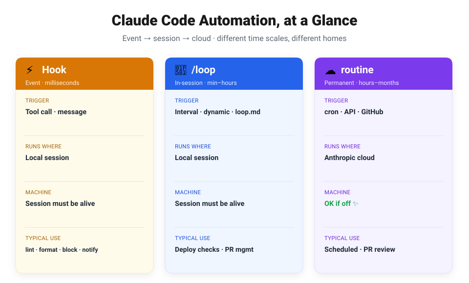
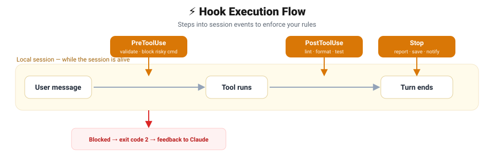
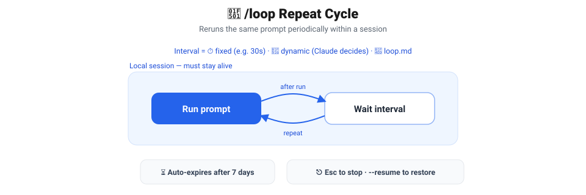
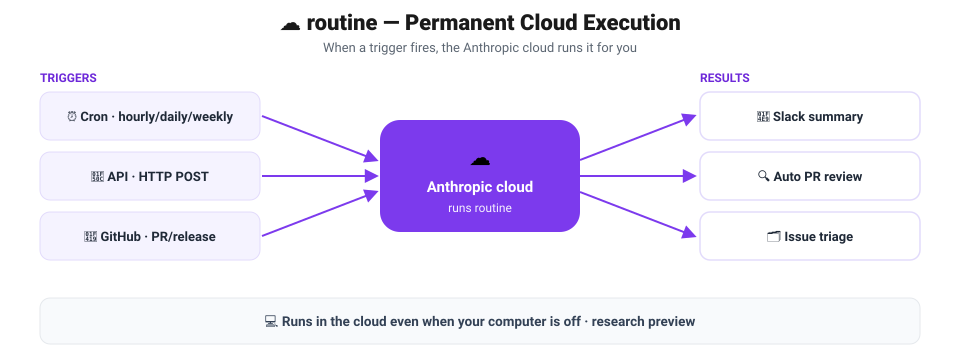

## Intro — Why Automate?

When you use Claude Code for a while, you start repeating the same things over and over. "Run the formatter before committing," "Don't run this dangerous command," "Check every 5 minutes whether the deploy is done" — that kind of thing.

You could ask for these in a prompt every time. But a prompt is just a **request** — Claude might forget it or skip it depending on the situation. Automation, on the other hand, is either **enforced** or **scheduled**. Once the condition is met, it always runs, without you having to think about it.

Claude Code offers three ways to automate: **Hook**, **/loop**, and **/routine**. They aren't competing tools — each one owns a different **time scale**. In this post we'll take a quick tour of when each one fires (its trigger), where it runs (its execution location), and what kind of situation it fits.

## At a Glance — It Comes Down to Time Scale

Here's the one-liner: **"Event → session → cloud."** Where a task belongs depends on how short and immediate it is, or how long and steady it needs to be.

| Method | Time scale | Trigger | Runs where | Machine can be off? | Typical use |
| --- | --- | --- | --- | --- | --- |
| ⚡ **Hook** | Event · milliseconds | Tool call · message | Local session | ❌ needs a session | lint · format · block · notify |
| 🔁 **/loop** | Within a session · minutes–hours | Interval · dynamic · `loop.md` | Local session | ❌ needs a session | Deploy checks · PR babysitting |
| ☁️ **/routine** | Permanent · hours–months | cron · API · GitHub | Anthropic cloud | ✅ OK if off | Scheduled automation · auto PR review |

The further left, the more **immediate**; the further right, the more **long-lasting**. Let's look at each one.

## ⚡ Hook — Enforced on Every Event

The **trigger** is an **event** that happens inside a session. The moment Claude calls a tool or ends a turn, a hook steps in at the millisecond level. Its **execution location** is the local session, so it only works while the session is alive.

The real value of hooks is that they're **enforced, not requested**. If you write "don't use this command" in a prompt, it may or may not be honored. But if you set it as a hook, it runs **every single time**.



Here's how it flows:

1. A user message comes in and Claude tries to call a tool.
2. **PreToolUse** steps in first and checks the input. If it's dangerous, it **blocks** with exit code 2 and gives feedback to Claude.
3. If it passes, the tool runs, and **PostToolUse** immediately handles post-processing like lint/format.
4. When the turn ends, **Stop** does the wrap-up — generating reports, saving state, and so on.

There are four main events.

| Event | Timing | What it does |
| --- | --- | --- |
| `PreToolUse` | **Before** a tool call | Validate input, block dangerous commands (e.g. stop `git push --force`) |
| `PostToolUse` | **After** a tool call | Post-processing — auto-run lint · format · test |
| `Notification` | Waiting for user response | Notify — ping you with a sound when a long task finishes |
| `Stop` | End of the agent's turn | Wrap-up — generate a report, save state, send to Slack |

> These four are the main ones; there are actually more events. The full list and configuration will be covered in a dedicated Hook post.

To **set one up**, add a `hooks` block to `.claude/settings.json`. For example, to format with Prettier every time a file is edited:

```json
{
  "hooks": {
    "PostToolUse": [
      {
        "matcher": "Write|Edit",
        "hooks": [
          { "type": "command", "command": "npx prettier --write $CLAUDE_FILE_PATHS" }
        ]
      }
    ]
  }
}
```

> 💡 When you hook a heavy command, run it in the background (`& disown`) so the session doesn't stall.

> ⚡ **Use it when** — you want to enforce format/lint on every change, block a specific dangerous command outright, or get a notification when work finishes.

## 🔁 /loop — Repeat While You Work

The **trigger** is a **time interval**. It reruns the same prompt on a cycle of minutes to hours. Its **execution location** is the local session, so this one also needs the session to stay alive. If Hook is "when an event fires," /loop is "periodically, while I'm doing something else."



The basic syntax is:

```
/loop [interval] [prompt]
```

There are three modes.

| Mode | Description | Example |
| --- | --- | --- |
| ⏱️ **Fixed interval** | Specify an interval and it repeats on that cycle | `/loop 30s check the deploy` |
| 🤖 **Dynamic** | Omit the interval and Claude decides the next wait itself (1 min–1 hr) | `/loop check CI and review comments` |
| 📝 **Default prompt** | Repeat using `.claude/loop.md` or the built-in maintenance prompt | `/loop` |

A few things worth knowing:

- You can define the recurring task yourself in `.claude/loop.md`.
- A loop you set **expires automatically after 7 days**.
- You can stop it with **`Esc`** before the next iteration, and restore an unexpired task with **`--resume`**.

> 🔁 **Use it when** — polling whether a deploy finished cleanly, periodically checking CI results and review comments, or babysitting (auto-managing) a PR.

## ☁️ /routine — Runs Even With Your Machine Off

There's one decisive difference from the other two: /routine runs in the **Anthropic cloud**. So a scheduled task runs **even when your computer is off**. It's the method for **permanent automation** on an hours-to-months scale. (It's currently in research preview.)



There are three **trigger** styles.

| Trigger | How it works | Example situation |
| --- | --- | --- |
| ⏰ **Scheduled (Cron)** | Hourly / daily / weekly cycles | Every day at 9 AM, triage & assign new issues, then summarize to Slack |
| 🔌 **API** | Fire instantly via HTTP POST | Auto-triage when a Sentry/CI alert arrives |
| 🐙 **GitHub event** | React to PR/release events | On `pull_request.opened`, run a security/perf/test review |

A single routine can even combine all three. For instance, one PR-review routine might handle "nightly scheduled run + trigger on a new PR + call a deploy script" all at once.

> ☁️ **Use it when** — cleaning up the backlog or checking for doc drift overnight, auto-reviewing PRs as they arrive, or auto-triaging alerts from external services — in short, anything that has to run **even when you're not there**.

## How to Choose

Here's the one-line summary:

> **Per event → Hook · While working → /loop · Machine off → /routine**

- If something must run **every time an event happens** → **Hook**
- If you need periodic checks/repeats **while you're working** → **/loop**
- If it must run **even when you're away or your computer is off** → **/routine**

This post was an at-a-glance overview comparing the three methods. The **concrete steps** for actually configuring and using each one will be covered separately in the Hook, /loop, and /routine deep-dive posts.

## 📚 References

- [Mastering Claude Code — Ch01 Deep Dive (lecture slides)](https://claudecode-lecture.vercel.app/Part1-Claude_Code_%EB%A7%88%EC%8A%A4%ED%84%B0%ED%95%98%EA%B8%B0/Ch01-Claude_Code_%EB%94%A5%EB%8B%A4%EC%9D%B4%EB%B8%8C/learn.html)
- [Hooks reference — Claude Code official docs](https://code.claude.com/docs/en/hooks)
- [Automate actions with hooks — Hooks guide](https://code.claude.com/docs/en/hooks-guide)
- [settings.json configuration docs](https://code.claude.com/docs/en/settings)
