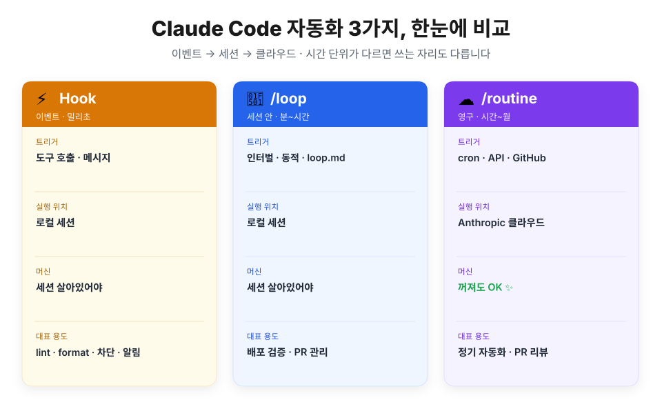
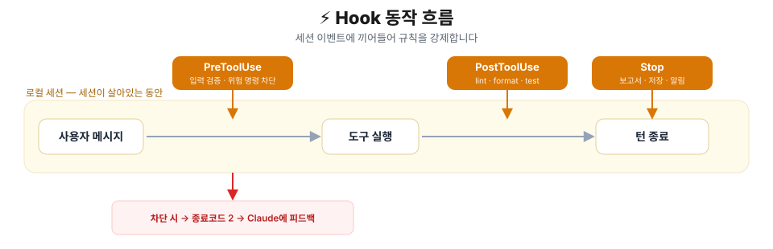
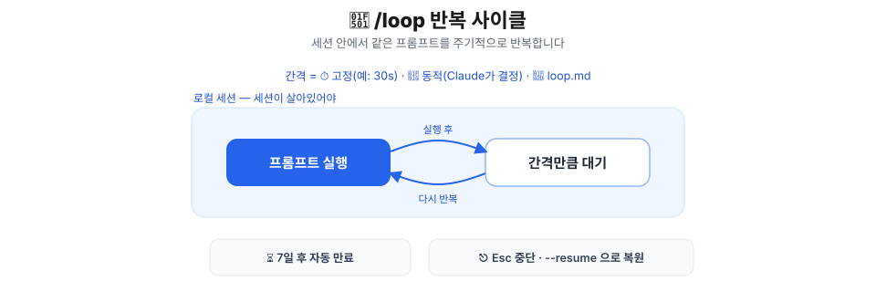
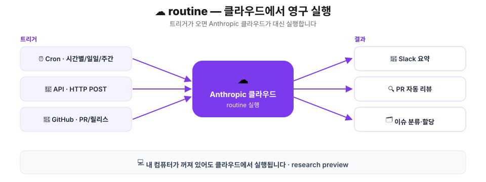

## 들어가며 — 왜 자동화일까요

Claude Code를 쓰다 보면 매번 똑같이 반복하는 일이 생깁니다. "커밋 전에 포맷 돌려줘", "이 위험한 명령은 실행하지 마", "배포 끝났나 5분마다 확인해줘" 같은 것들이죠.

이걸 매번 프롬프트로 부탁할 수도 있습니다. 하지만 프롬프트는 **부탁**일 뿐이라, Claude가 깜빡하거나 상황에 따라 건너뛸 수 있습니다. 반면 자동화는 **강제**이거나 **예약**입니다. 정해진 조건이 되면 사람이 신경 쓰지 않아도 반드시 돌아갑니다.

Claude Code는 자동화를 세 가지 방법으로 제공합니다. **Hook**, **/loop**, **/routine**입니다. 셋은 경쟁하는 도구가 아니라, **서로 다른 시간 단위**를 담당합니다. 이 글에서는 각각이 언제 켜지고(트리거), 어디서 돌고(실행 위치), 어떤 상황에 어울리는지를 한 바퀴 훑어보겠습니다.

## 한눈에 보기 — 시간 단위로 나뉩니다

핵심 한 줄은 이겁니다. **"이벤트 → 세션 → 클라우드."** 자동화를 걸고 싶은 일이 얼마나 짧고 즉각적인지, 아니면 얼마나 길고 꾸준한지에 따라 자리가 달라집니다.

| 방법 | 시간 단위 | 트리거 | 실행 위치 | 머신이 꺼져도? | 대표 용도 |
| --- | --- | --- | --- | --- | --- |
| ⚡ **Hook** | 이벤트 · 밀리초 | 도구 호출 · 메시지 | 로컬 세션 | ❌ 세션 필요 | lint · format · 차단 · 알림 |
| 🔁 **/loop** | 세션 안 · 분~시간 | 인터벌 · 동적 · `loop.md` | 로컬 세션 | ❌ 세션 필요 | 배포 검증 · PR 관리 |
| ☁️ **/routine** | 영구 · 시간~월 | cron · API · GitHub | Anthropic 클라우드 | ✅ 꺼져도 OK | 정기 자동화 · PR 자동 리뷰 |

왼쪽으로 갈수록 **즉각적**이고, 오른쪽으로 갈수록 **오래 지속**됩니다. 그럼 하나씩 보겠습니다.

## ⚡ Hook — 이벤트마다 강제됩니다

**트리거**는 세션 안에서 벌어지는 **이벤트**입니다. Claude가 도구를 부르거나, 턴을 끝내거나 하는 바로 그 순간에 밀리초 단위로 끼어듭니다. **실행 위치**는 로컬 세션이라, 세션이 살아 있는 동안에만 동작합니다.

Hook의 진가는 **"부탁이 아니라 강제"** 라는 데 있습니다. "이 명령은 쓰지 마세요"라고 프롬프트에 적어두면 지켜질 수도, 안 지켜질 수도 있습니다. 하지만 Hook으로 걸면 **매번 반드시** 실행됩니다.



동작 순서는 이렇습니다.

1. 사용자 메시지가 들어오고 Claude가 도구를 호출하려 합니다.
2. **PreToolUse** 가 먼저 끼어들어 입력을 검사합니다. 위험하면 종료코드 2로 **차단**하고 Claude에 피드백합니다.
3. 통과하면 도구가 실행되고, 곧바로 **PostToolUse** 가 lint·format 같은 후처리를 돌립니다.
4. 턴이 끝나면 **Stop** 이 보고서 생성·상태 저장 같은 마무리를 합니다.

대표적인 이벤트는 네 가지입니다.

| 이벤트 | 타이밍 | 무엇을 하나요 |
| --- | --- | --- |
| `PreToolUse` | 도구 호출 **직전** | 입력 검증, 위험 명령 차단 (예: `git push --force` 막기) |
| `PostToolUse` | 도구 호출 **직후** | 후처리 — lint · format · test 자동 실행 |
| `Notification` | 사용자 응답 대기 | 알림 — 긴 작업 끝나면 소리로 알려주기 |
| `Stop` | 에이전트 턴 종료 | 마무리 — 보고서 생성, 상태 저장, Slack 전송 |

> 위 네 가지가 대표적이고, 실제로는 이벤트가 더 있습니다. 자세한 목록과 설정은 별도의 Hook 상세 글에서 다루겠습니다.

**적용 방법**은 `.claude/settings.json`에 `hooks` 블록을 추가하는 것입니다. 예를 들어 파일을 수정할 때마다 Prettier로 포맷하려면 이렇게 씁니다.

```json
{
  "hooks": {
    "PostToolUse": [
      {
        "matcher": "Write|Edit",
        "hooks": [
          { "type": "command", "command": "jq -r '.tool_input.file_path' | xargs npx prettier --write" }
        ]
      }
    ]
  }
}
```

> 💡 무거운 명령을 Hook에 걸 때는 백그라운드(`& disown`)로 돌려서 세션이 멈추지 않게 하는 것이 좋습니다.

> ⚡ **이럴 때 씁니다** — 매 변경마다 포맷/린트를 강제하고 싶을 때, 특정 위험 명령을 원천 차단하고 싶을 때, 작업이 끝나면 알림을 받고 싶을 때.

## 🔁 /loop — 작업 중 반복합니다

**트리거**는 **시간 간격**입니다. 몇 분에서 몇 시간 단위로, 같은 프롬프트를 반복 실행합니다. **실행 위치**는 로컬 세션이라, 이 역시 세션이 살아 있어야 합니다. Hook이 "이벤트가 터질 때"라면, /loop는 "내가 다른 일 하는 동안 주기적으로"입니다.



기본 문법은 이렇습니다.

```
/loop [간격] [프롬프트]
```

모드는 세 가지입니다.

| 모드 | 설명 | 예시 |
| --- | --- | --- |
| ⏱️ **고정 인터벌** | 간격을 명시하면 그 주기로 반복 | `/loop 30s check the deploy` |
| 🤖 **동적** | 간격을 생략하면 Claude가 다음 대기 시간을 스스로 결정 (1분~1시간) | `/loop check CI and review comments` |
| 📝 **기본 프롬프트** | `.claude/loop.md` 또는 내장 유지보수 프롬프트로 반복 | `/loop` |

몇 가지 알아두면 좋은 점이 있습니다.

- `.claude/loop.md`에 반복할 작업을 직접 정의해둘 수 있습니다.
- 걸어둔 루프는 **7일 후 자동으로 만료**됩니다.
- 다음 반복 전에 **`Esc`** 로 중단할 수 있고, 만료되지 않은 작업은 **`--resume`** 으로 복원됩니다.

> 🔁 **이럴 때 씁니다** — 배포가 잘 끝났는지 폴링할 때, CI 결과와 리뷰 코멘트를 주기적으로 확인할 때, PR을 베이비시팅(자동 관리)할 때.

## ☁️ /routine — 머신이 꺼져도 돕니다

앞의 둘과 결정적으로 다른 점이 있습니다. /routine은 **Anthropic 클라우드**에서 돕니다. 그래서 **내 컴퓨터가 꺼져 있어도** 예약된 일이 실행됩니다. 시간~월 단위의 **영구적인 자동화**를 위한 방법입니다. (현재 research preview 단계입니다.)



**트리거**는 세 가지 방식이 있습니다.

| 트리거 | 방식 | 예시 상황 |
| --- | --- | --- |
| ⏰ **예약 (Cron)** | 시간별 / 일일 / 주간 주기 | 매일 오전 9시 새 이슈 분류·할당 후 Slack 요약 |
| 🔌 **API** | HTTP POST로 즉시 실행 | Sentry·CI 경고가 오면 자동 분류 |
| 🐙 **GitHub 이벤트** | PR·릴리스 이벤트에 반응 | `pull_request.opened` 시 보안·성능·테스트 자동 리뷰 |

한 routine이 이 셋을 **함께** 쓸 수도 있습니다. 예를 들어 하나의 PR 리뷰 routine이 "야간 정기 실행 + 새 PR이 열릴 때 트리거 + 배포 스크립트 호출"을 동시에 담당하는 식입니다.

> ☁️ **이럴 때 씁니다** — 야간에 백로그를 정리하거나 문서 드리프트를 점검할 때, 새 PR이 올라오면 자동으로 리뷰할 때, 외부 서비스의 경고를 자동 분류할 때 — 즉, **내가 자리에 없어도 돌아가야 하는** 일 전부.

## 어떻게 고를까요

한 문장으로 정리하겠습니다.

> **이벤트마다 → Hook · 작업 중 → /loop · 머신 꺼져도 → /routine**

- 무언가가 **일어나는 순간마다** 반드시 실행돼야 한다면 → **Hook**
- 내가 **작업하는 동안** 주기적으로 확인·반복이 필요하다면 → **/loop**
- 내가 **자리에 없거나 컴퓨터가 꺼져 있어도** 돌아가야 한다면 → **/routine**

이 글은 세 방법을 한눈에 비교하는 개요였습니다. 각각을 실제로 설정하고 활용하는 **구체적인 방법**은 Hook, /loop, /routine 상세 글에서 하나씩 따로 다루겠습니다.

## 📚 참고자료

- [Claude Code 마스터하기 — Ch01 딥다이브 (강의 슬라이드)](https://claudecode-lecture.vercel.app/Part1-Claude_Code_%EB%A7%88%EC%8A%A4%ED%84%B0%ED%95%98%EA%B8%B0/Ch01-Claude_Code_%EB%94%A5%EB%8B%A4%EC%9D%B4%EB%B8%8C/learn.html)
- [Hooks reference — Claude Code 공식 문서](https://code.claude.com/docs/en/hooks)
- [Automate actions with hooks — Hooks 가이드](https://code.claude.com/docs/en/hooks-guide)
- [settings.json 설정 문서](https://code.claude.com/docs/en/settings)
