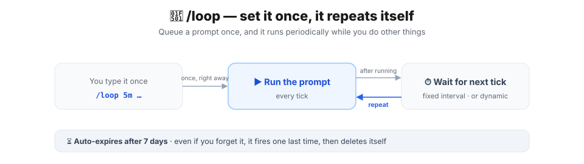
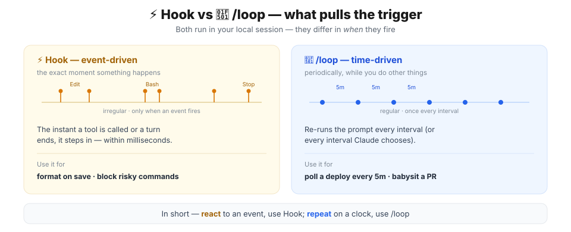
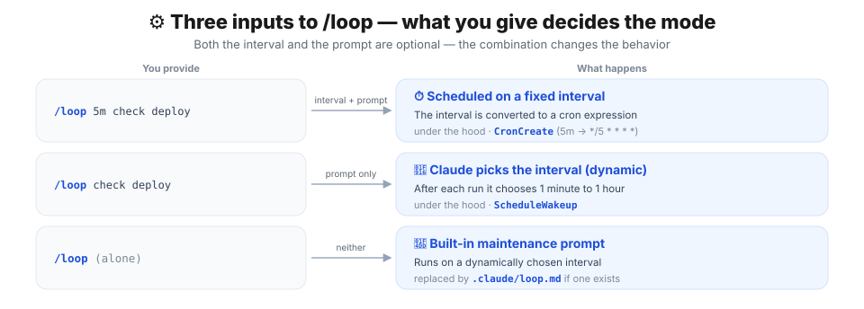
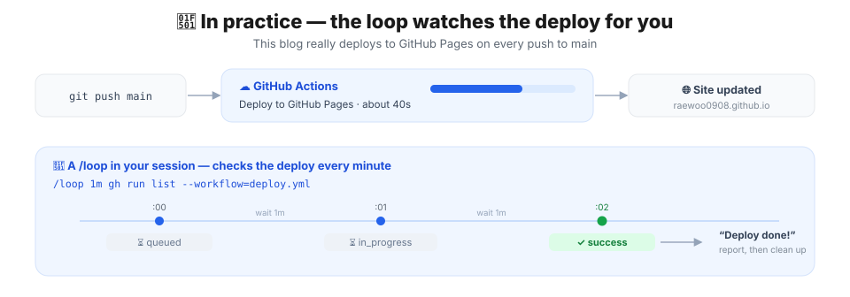
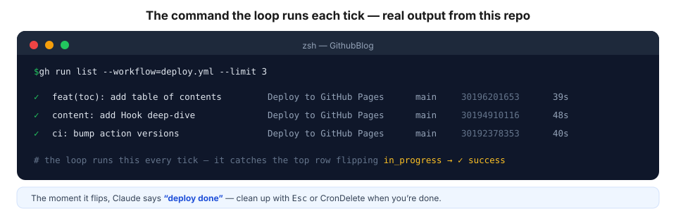
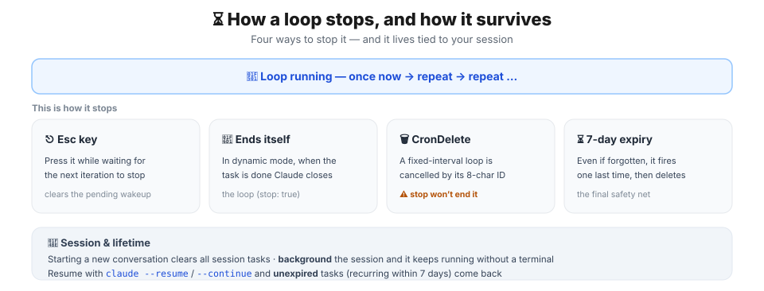

## Intro — stop hitting refresh on your deploy

In [Part 1, Hook](/posts/claude/hook), we saw hooks that fire "every time an event happens," no exceptions. This time it's the second of the [automation trio](/posts/claude/intro-automation-hook-loop-routine): **`/loop`**.

Picture this. You push to `main` and wait for the GitHub Actions deploy to finish. It takes around 40 seconds, and with nothing to do in the meantime you keep typing `gh run list` by hand. Still running, type it again, still running… That **"check on it periodically"** chore is exactly what `/loop` is for.

The difference between Hook and `/loop` fits in one line.

> **Hook is the instant an event fires; `/loop` is periodically, while you do other things.**

## 🎯 When to use /loop — the boundary with Hook



Both run in your **local session**. The only difference is **what pulls the trigger**.

| | ⚡ Hook | 🔁 /loop |
| --- | --- | --- |
| Trigger | event (tool call · turn end) | time (interval · dynamic) |
| Timing | irregular · milliseconds | regular · minutes to hours |
| Nature | react | repeat |
| Typical use | format · lint · block | poll a deploy · manage a PR |

`/loop` shines at things like these.

> 🔁 **Use it for** — polling whether a deploy finished, periodically checking CI results and review comments, kicking off a long build and doing something else, babysitting a PR.

Just remember one thing.

> 💡 `/loop` lives **only inside a session**. If your machine goes to sleep or you start a new conversation, it stops. If the work has to run even when you're not around, that's not `/loop`'s job — it's [routine](/posts/claude/intro-automation-hook-loop-routine)'s (covered in Part 3).

## ⚙️ How it works — /loop actually splits two ways

The basic syntax is this.

```text
/loop [interval] [prompt]
```

**Both the interval and the prompt are optional.** What you provide completely changes the behavior. That's the heart of `/loop`.



| You provide | Example | What happens | Under the hood |
| --- | --- | --- | --- |
| Interval + prompt | `/loop 5m check deploy` | Repeats on a fixed interval | `CronCreate` |
| Prompt only | `/loop check deploy` | Claude picks the interval each time (dynamic) | `ScheduleWakeup` |
| Neither | `/loop` | Built-in maintenance prompt / `loop.md` | (dynamic) |

The parsing rules have a set priority order.

1. **Leading token** — if the first token is `number+unit` like `5m` or `2h`, that's the interval and the rest is the prompt.
2. Otherwise, a **trailing `every` clause** — `every 20m`, `every 5 minutes`, `every 2 hours` gets pulled out as the interval. (But `check every PR` has no interval, since what follows `every` isn't a time.)
3. Neither → **no interval → dynamic mode**.

You can pass a slash command as the prompt too, like `/loop 20m /review-pr 1234`.

> 💡 Interval units are seconds (`s`), minutes (`m`), hours (`h`), and days (`d`). But the **minimum is 1 minute** — give it `30s` and it rounds up to `1m`. Why, in the [gotchas](#️-gotchas) below.

## 🔁 In practice 1 — the loop watches your deploy for you

Theory only goes so far, so let's use a scenario that really runs in **the repository this very post lives in**: polling the deploy.



This blog runs a `Deploy to GitHub Pages` GitHub Actions job on every push to `main`. It takes about 40 seconds. Instead of staring at the terminal to see if it's done, hand it to a loop.

```text
/loop 1m check the deploy status with gh run list --workflow=deploy.yml, and tell me when it's done
```

Here's what happens when you run that.

1. The interval `1m` becomes the cron expression `*/1 * * * *` and is scheduled with `CronCreate`.
2. It **runs once immediately, right there, without waiting for the first tick.**
3. After that it re-runs the prompt every minute.

Here's the command Claude runs each tick and its real output.



```console
$ gh run list --workflow=deploy.yml --limit 3
✓  feat(toc): add table of contents  Deploy to GitHub Pages  main  30196201653  39s
✓  content: add Hook deep-dive       Deploy to GitHub Pages  main  30194910116  48s
✓  ci: bump action versions          Deploy to GitHub Pages  main  30192378353  40s
```

The moment the top row flips from `in_progress` to `✓ success`, Claude tells you **"deploy done."** Once you no longer need the loop, press `Esc` or `CronDelete` it by job ID (more on stopping below).

For reference, here's how intervals map to cron.

| Interval | Cron | Meaning |
| --- | --- | --- |
| `Nm` (N ≤ 59) | `*/N * * * *` | every N minutes |
| `Nh` (N ≤ 23) | `0 */N * * *` | every N hours |
| `Nd` | `0 0 */N * *` | every N days at midnight (local) |

> 💡 Honestly, something that **"eventually finishes"** — like a deploy — suits **dynamic mode** better than a fixed interval. That's up next.

## 🤖 In practice 2 — omit the interval and Claude paces it (dynamic mode)

Drop the interval and give just a prompt, and Claude **decides the next delay itself at the end of each iteration.**

```text
/loop check whether the deploy finished and tell me when it's done
```

Instead of a fixed cron, it adjusts the interval **between 1 minute and 1 hour** based on what it observed: short while a build is running, long when nothing is happening. And it **prints the chosen delay and the reason** at the end of each iteration. Under the hood it uses the `ScheduleWakeup` tool.

One step further is the **Monitor tool**. In a dynamic loop, Claude can use Monitor instead of polling.

> ✅ Monitor runs a background script and **streams its output lines back live.** So rather than asking again every minute, it **wakes the instant the line you want appears** (a deploy-success log line, say). More token-efficient and more responsive than polling.

And the biggest win of dynamic mode — **it knows when to quit.** When the task is complete, Claude closes the loop itself with `stop: true`. Once the deploy is done, there's nothing left to ask.

> 💡 So: for **genuinely periodic work** (an hourly report, etc.), pin an interval and go fixed. For **work with no known end** (a deploy, CI, waiting on a PR), omit the interval and go dynamic.

## 📝 In practice 3 — define a repeat routine with loop.md

Run `/loop` **on its own** and Claude runs a prepared **built-in maintenance prompt**. Each iteration, in order, it:

- continues any unfinished work from the conversation
- tends the current branch's PR (review comments · failed CI · merge conflicts)
- and when even that's quiet, runs cleanup passes like bug hunts or simplification

The way to **swap that default for your own** is `loop.md`. Claude looks in two places, in this order.

| Path | Scope |
| --- | --- |
| `.claude/loop.md` | Project-level (takes precedence when both exist) |
| `~/.claude/loop.md` | All your projects |

The file is just Markdown — write it as if you were typing the `/loop` prompt directly. For this blog, a `loop.md` like this fits.

```markdown
# .claude/loop.md
Check that the ko/en pairs and image language pairs are in sync:
node scripts/check-bilingual.mjs --worktree
node scripts/check-post-images.mjs --worktree
Then confirm astro check and build aren't broken.
If something's wrong, summarize what; if everything's green, just report "all clear" in one line.
```

Now typing `/loop` alone runs this **on a dynamically chosen interval**.

> 💡 `loop.md` defines a **single default prompt**, not a list of separate tasks. Edits take effect on the next iteration, so you can refine the wording while a loop runs. Anything past 25,000 bytes is truncated, and if you pass a prompt on the command line, `loop.md` is ignored.

## ⏳ How it stops · lifetime · restore

How does a loop end, and how does it survive across sessions?



**There are four ways to stop it.**

- **`Esc`** — press it while it's waiting for the next iteration and the pending wakeup is cleared, so it won't fire again. (But tasks you created by **asking Claude directly** — "keep an eye on this too" — aren't affected by `Esc`. Delete those with `CronDelete`.)
- **Self-stop** — in dynamic mode, when the task is done Claude closes the loop with `stop: true`.
- **`CronDelete`** — cancel a fixed-interval loop by its 8-character job ID. ⚠️ **A fixed-interval loop is not stopped by `stop: true`.**
- **7-day auto-expiry** — even if you forget it, it fires one last time and then deletes itself. The final safety net.

**Its lifetime is tied to your session.**

- Starting a new conversation clears **all** session tasks.
- **Backgrounding** the session keeps it running without a terminal.
- Resuming with `claude --resume` or `--continue` restores **unexpired** tasks (recurring ones within 7 days of creation).

You manage it in natural language — **"what scheduled tasks do I have?"**, **"cancel the deploy-check job."** Under the hood, `CronList` and `CronDelete` do the work (up to 50 tasks per session).

> 💡 If it needs to run longer, or run while you're away, you've hit the limits of session-scoped scheduling. Move to [routine](/posts/claude/intro-automation-hook-loop-routine) (cloud), Desktop scheduled tasks, or GitHub Actions.

## ⚠️ Gotchas

The easy-to-miss things I confirmed while digging through the docs and the binary.

### 1. `30s` won't work — 1 minute minimum

Cron's smallest unit is one minute, so seconds **round up to minutes**. `30s` is effectively `1m`. Intervals that don't divide cleanly, like `7m` or `90m`, get rounded to the nearest one that does, and Claude **tells you what it picked.**

### 2. Jitter — it won't fire on the dot

The least-known gotcha. So that every session doesn't hit the API at the same wall-clock moment, the scheduler adds an **offset** to fire times.

- Recurring tasks can fire **up to 30 minutes late** (or up to half the interval, for sub-hourly ones). A `:00` job may show up at `:30`.
- The offset is derived from the job ID, so **the same job is always late by the same amount.**

> ⚠️ If exact timing matters, avoid `:00` and `:30`. Pick an odd minute — `3 9 * * *` instead of `0 9 * * *` — to dodge the jitter. Note that **dynamic mode has no jitter.**

### 3. Fixed intervals don't stop on `stop: true`

A dynamic loop ends with `stop: true`, but a fixed-interval loop is a genuine **recurring cron**, so that won't turn it off. Use `Esc` (while waiting) or `CronDelete` (by job ID).

### 4. Missed fires aren't caught up

If a fire time passes while Claude is busy on a long task, it fires **once** when it goes idle — not once per missed interval.

### 5. Close the session and it dies

Close the terminal or let the session exit and the loop stops too. If the work has to run "even when I'm away," `routine` is the right tool from the start.

### 6. To kill the scheduler entirely

```bash
CLAUDE_CODE_DISABLE_CRON=1
```

Set this environment variable and the cron tools and `/loop` are disabled outright.

## In one line

> **`/loop` re-runs a prompt periodically while you do other things — give it an interval and it's a fixed cron, omit it and Claude paces itself.**

To sum up:

- **Genuinely periodic work** → pin an interval (fixed, `CronCreate`)
- **Work with no known end** → omit the interval (dynamic, `ScheduleWakeup` + Monitor)
- **A repeat routine** → `.claude/loop.md`
- A loop lives **only inside a session** and expires after **7 days**. Stop it with `Esc` / `CronDelete`; restore it with `--resume`.

Next up is the last automation, **[routine](/posts/claude/intro-automation-hook-loop-routine)**. If `/loop` is "while you do other things," `routine` is **"even when your machine is off"** — the story of leaving the session behind and running on Anthropic's cloud.

## 📚 References

- [Run prompts on a schedule — official docs for /loop and scheduled tasks](https://code.claude.com/docs/en/scheduled-tasks)
- [Tools reference — the Monitor and ScheduleWakeup tools](https://code.claude.com/docs/en/tools-reference)
- [Keep Claude working toward a goal — /goal](https://code.claude.com/docs/en/goal)
- [Channels — push events into the session](https://code.claude.com/docs/en/channels)
- [Automate work with routines — official docs for routine](https://code.claude.com/docs/en/routines)
- [Hook: enforcing rules with events — Part 1](/posts/claude/hook)
- [Automation: Hook, /loop, routine — series overview](/posts/claude/intro-automation-hook-loop-routine)
- [Mastering Claude Code — Ch01 deep dive (lecture slides)](https://claudecode-lecture.vercel.app/Part1-Claude_Code_%EB%A7%88%EC%8A%A4%ED%84%B0%ED%95%98%EA%B8%B0/Ch01-Claude_Code_%EB%94%A5%EB%8B%A4%EC%9D%B4%EB%B8%8C/learn.html)
