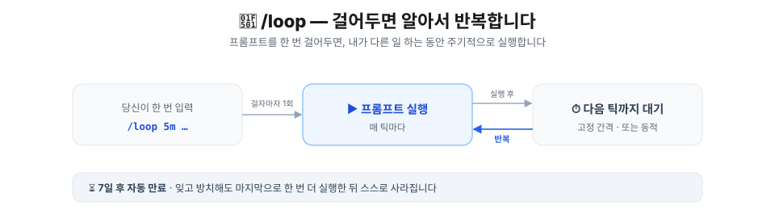
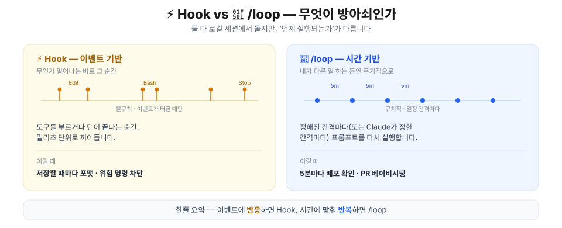
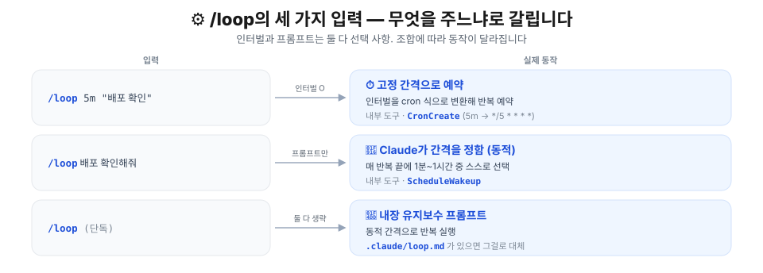
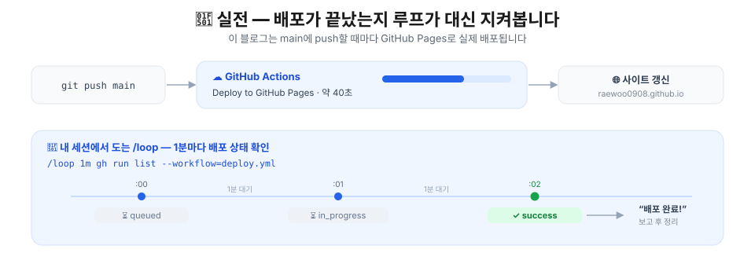
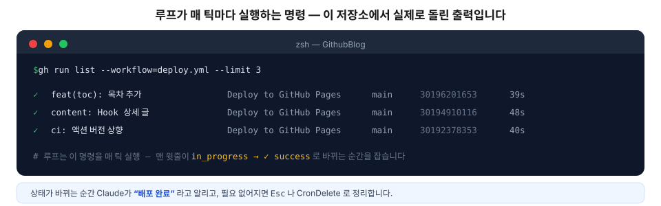
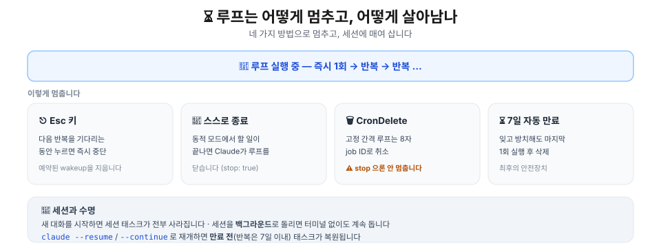

## 들어가며 — 배포 끝났나 직접 새로고침하지 마세요

[1편 Hook](/posts/claude/hook)에서는 "이벤트가 터질 때마다" 무조건 실행되는 훅을 봤습니다. 이번엔 [자동화 3형제](/posts/claude/intro-automation-hook-loop-routine) 중 두 번째, **`/loop`** 입니다.

상황 하나 그려보겠습니다. `main`에 push하고 GitHub Actions 배포가 끝나길 기다립니다. 40초쯤 걸리는데, 그동안 딱히 할 게 없어서 `gh run list`를 손으로 몇 번씩 두드립니다. 아직 도네, 또 두드리고, 아직 도네… 이 **"주기적으로 확인"** 하는 일이 바로 `/loop`의 자리입니다.

Hook과 `/loop`의 차이는 한 줄로 정리됩니다.

> **Hook은 이벤트가 터지는 그 순간, `/loop`는 내가 다른 일 하는 동안 주기적으로.**

## 🎯 언제 /loop를 쓰나 — Hook과의 경계



둘 다 **로컬 세션**에서 돕니다. 차이는 딱 하나, **무엇이 방아쇠인가**입니다.

| | ⚡ Hook | 🔁 /loop |
| --- | --- | --- |
| 방아쇠 | 이벤트 (도구 호출·턴 종료) | 시간 (간격·동적) |
| 타이밍 | 불규칙 · 밀리초 | 규칙적 · 분~시간 |
| 성격 | 반응 | 반복 |
| 대표 용도 | 포맷·린트·차단 | 배포 폴링·PR 관리 |

`/loop`가 빛나는 건 이런 일들입니다.

> 🔁 **이럴 때 씁니다** — 배포가 잘 끝났는지 폴링할 때, CI 결과와 리뷰 코멘트를 주기적으로 확인할 때, 긴 빌드를 걸어두고 다른 일을 할 때, PR을 베이비시팅할 때.

한 가지만 기억하시면 됩니다.

> 💡 `/loop`는 **세션 안에서만** 삽니다. 내 컴퓨터가 꺼지거나 대화를 새로 시작하면 멈춥니다. 자리에 없어도 돌아가야 하는 일이라면 그건 `/loop`가 아니라 [/routine](/posts/claude/intro-automation-hook-loop-routine)의 몫입니다(3편에서 다룹니다).

## ⚙️ 동작 원리 — /loop는 사실 두 갈래입니다

기본 문법은 이렇습니다.

```text
/loop [간격] [프롬프트]
```

**간격과 프롬프트는 둘 다 선택 사항입니다.** 무엇을 주느냐에 따라 동작이 완전히 갈립니다. 이게 `/loop`의 핵심입니다.



| 입력 | 예시 | 실제 동작 | 내부 도구 |
| --- | --- | --- | --- |
| 간격 + 프롬프트 | `/loop 5m 배포 확인` | 고정 간격으로 반복 예약 | `CronCreate` |
| 프롬프트만 | `/loop 배포 확인` | Claude가 매번 간격을 정함 (동적) | `ScheduleWakeup` |
| 둘 다 생략 | `/loop` | 내장 유지보수 프롬프트 / `loop.md` | (동적) |

입력을 파싱하는 규칙은 우선순위가 정해져 있습니다.

1. **맨 앞 토큰**이 `5m`·`2h`처럼 `숫자+단위`면 그게 간격, 나머지는 프롬프트.
2. 아니면 **끝의 `every` 절** — `every 20m`, `every 5 minutes`, `every 2 hours` 같은 시간 표현을 간격으로 떼어냅니다. (단 `check every PR`처럼 뒤가 시간이 아니면 간격이 아닙니다.)
3. 둘 다 아니면 **간격 없음 → 동적 모드**.

슬래시 커맨드도 프롬프트로 넘길 수 있습니다. `/loop 20m /review-pr 1234`처럼요.

> 💡 간격 단위는 초(`s`)·분(`m`)·시(`h`)·일(`d`)입니다. 단 **최소 단위는 1분**이에요. `30s`를 줘도 1분으로 올림됩니다. 왜 그런지는 [함정 모음](#️-함정-모음)에서 다시 짚겠습니다.

## 🔁 실전 1 — 배포가 끝났는지 루프가 대신 지켜봅니다

말로만 하면 와닿지 않으니, **지금 이 글이 담긴 저장소**에서 진짜로 돌아가는 시나리오로 가겠습니다.



이 블로그는 `main`에 push할 때마다 GitHub Actions가 `Deploy to GitHub Pages`를 돌립니다. 실제 소요 시간은 40초 안팎입니다. 그동안 배포가 끝났는지 궁금해서 터미널을 들여다보는 대신, 루프에게 맡깁니다.

```text
/loop 1m gh run list --workflow=deploy.yml 로 배포 상태를 확인하고, 끝나면 알려줘
```

이걸 치면 벌어지는 일은 이렇습니다.

1. 간격 `1m`이 cron 식 `*/1 * * * *`로 바뀌고 `CronCreate`로 예약됩니다.
2. **첫 틱을 기다리지 않고 그 자리에서 한 번 즉시 실행**합니다.
3. 이후 1분마다 프롬프트를 다시 돌립니다.

매 틱마다 Claude가 돌리는 명령과 그 실제 출력은 이렇습니다.



```console
$ gh run list --workflow=deploy.yml --limit 3
✓  feat(toc): 목차 추가        Deploy to GitHub Pages  main  30196201653  39s
✓  content: Hook 상세 글       Deploy to GitHub Pages  main  30194910116  48s
✓  ci: 액션 버전 상향          Deploy to GitHub Pages  main  30192378353  40s
```

맨 윗줄의 상태가 `in_progress`에서 `✓ success`로 바뀌는 순간, Claude가 **"배포 완료"** 라고 알려줍니다. 그때 더 이상 루프가 필요 없으면 `Esc`를 누르거나, 잡 ID로 `CronDelete`하면 됩니다(멈추는 법은 뒤에서 자세히).

참고로 간격을 cron으로 바꾸는 규칙은 이렇습니다.

| 간격 | cron 식 | 의미 |
| --- | --- | --- |
| `Nm` (N ≤ 59) | `*/N * * * *` | N분마다 |
| `Nh` (N ≤ 23) | `0 */N * * *` | N시간마다 |
| `Nd` | `0 0 */N * *` | N일마다 자정(로컬) |

> 💡 사실 배포처럼 **"언젠간 끝나는" 일**은 고정 간격보다 **동적 모드**가 더 잘 어울립니다. 바로 다음이 그 이야기입니다.

## 🤖 실전 2 — 인터벌을 생략하면 Claude가 알아서 (동적 모드)

간격을 빼고 프롬프트만 주면, Claude가 **매 반복 끝에 다음 대기 시간을 스스로 정합니다.**

```text
/loop 배포 끝났는지 확인하고 끝나면 알려줘
```

고정된 cron이 아니라, 관찰한 상황에 따라 **1분에서 1시간 사이**로 간격을 조절합니다. 빌드가 도는 중이면 짧게, 아무 일도 없으면 길게. 그리고 고른 간격과 **그 이유를 매 반복 끝에 출력**합니다. 내부적으로는 `ScheduleWakeup` 도구를 씁니다.

여기서 한 걸음 더 나아간 게 **Monitor 도구**입니다. 동적 루프에서 Claude는 폴링 대신 Monitor를 쓸 수 있습니다.

> ✅ Monitor는 백그라운드 스크립트를 돌리며 **출력 줄을 실시간으로 흘려보냅니다.** 그래서 1분마다 다시 물어보는 대신, 원하는 줄(예: 배포 성공 로그)이 나오는 **바로 그 순간 깨어납니다.** 폴링보다 토큰도 아끼고 반응도 빠릅니다.

그리고 동적 모드의 가장 큰 장점 — **끝날 줄 압니다.** 할 일이 완료되면 Claude가 `stop: true`로 루프를 스스로 닫습니다. 배포가 끝났으면 더 물어볼 이유가 없으니까요.

> 💡 정리하면 이렇습니다. **확실히 주기적인 일**(매시간 리포트 등)은 간격을 지정해 고정으로, **언제 끝날지 모르는 일**(배포·CI·PR 대기)은 간격을 생략해 동적으로 거세요.

## 📝 실전 3 — loop.md 로 반복 루틴을 정의하기

`/loop`를 **단독으로** 치면, Claude는 미리 준비된 **내장 유지보수 프롬프트**를 돕니다. 매 반복마다 순서대로 이런 일을 합니다.

- 대화에서 하다 만 작업 이어가기
- 현재 브랜치의 PR 돌보기 (리뷰 코멘트 · 실패한 CI · 머지 충돌)
- 그마저 조용하면 버그 헌트·단순화 같은 청소

이 기본 프롬프트를 **내 것으로 갈아끼우는** 방법이 `loop.md`입니다. Claude는 두 곳을 이 순서로 찾습니다.

| 경로 | 범위 |
| --- | --- |
| `.claude/loop.md` | 프로젝트 전용 (둘 다 있으면 우선) |
| `~/.claude/loop.md` | 내 모든 프로젝트 |

파일은 그냥 마크다운입니다. `/loop` 프롬프트에 직접 타이핑하듯 쓰면 됩니다. 이 블로그라면 이런 `loop.md`가 어울립니다.

```markdown
# .claude/loop.md
ko/en 짝과 이미지 언어쌍이 맞는지 점검하세요:
node scripts/check-bilingual.mjs --worktree
node scripts/check-post-images.mjs --worktree
그리고 astro check 와 build 가 깨지지 않는지 확인하세요.
문제가 있으면 무엇이 틀렸는지 요약하고, 전부 초록이면 한 줄로 "이상 없음"이라고만 보고하세요.
```

이제 `/loop`만 치면 이 내용이 **동적 간격으로** 반복 실행됩니다.

> 💡 `loop.md`는 **단 하나의 기본 프롬프트**를 정의하는 것이지, 여러 태스크 목록이 아닙니다. 편집하면 다음 반복부터 반영되니, 루프를 돌리면서 문구를 다듬어도 됩니다. 25,000바이트를 넘으면 잘리고, 커맨드에 프롬프트를 직접 주면 `loop.md`는 무시됩니다.

## ⏳ 멈추는 법 · 수명 · 복원

걸어둔 루프는 어떻게 끝나고, 세션을 넘나들며 어떻게 살아남을까요.



**멈추는 법은 네 가지입니다.**

- **`Esc`** — 다음 반복을 기다리는 동안 누르면 예약된 wakeup이 지워져 다시 발화하지 않습니다. (단, Claude에게 "이것도 주기적으로 확인해줘"라고 **직접 부탁해서** 만든 태스크는 `Esc`에 영향받지 않습니다. 그건 `CronDelete`로 지우세요.)
- **자동 종료** — 동적 모드에서 할 일이 끝나면 Claude가 `stop: true`로 루프를 닫습니다.
- **`CronDelete`** — 고정 간격 루프는 8자리 잡 ID로 취소합니다. ⚠️ **고정 간격 루프는 `stop: true`로는 안 멈춥니다.**
- **7일 자동 만료** — 잊고 방치해도 마지막으로 한 번 더 실행한 뒤 스스로 삭제됩니다. 최후의 안전장치죠.

**수명은 세션에 매여 있습니다.**

- 새 대화를 시작하면 세션 태스크가 **전부 사라집니다.**
- 세션을 **백그라운드**로 돌리면 터미널 없이도 계속 돕니다.
- `claude --resume` 또는 `--continue`로 재개하면 **만료 전** 태스크(반복은 생성 후 7일 이내)가 복원됩니다.

관리는 자연어로 하면 됩니다. **"무슨 스케줄 태스크가 걸려 있어?"**, **"배포 확인 잡 취소해줘"** 처럼요. 내부적으로 `CronList`·`CronDelete`가 돕니다(세션당 최대 50개).

> 💡 더 길게, 또는 자리를 비워도 돌아가야 한다면 세션 스케줄링의 한계입니다. 그럴 땐 [/routine](/posts/claude/intro-automation-hook-loop-routine)(클라우드), Desktop 예약 태스크, GitHub Actions로 넘어가세요.

## ⚠️ 함정 모음

제가 문서·실행 파일을 뒤지며 확인한, 헷갈리기 쉬운 것들입니다.

### 1. `30s`는 안 됩니다 — 최소 1분

cron의 최소 단위가 1분이라, 초는 **분으로 올림**됩니다. `30s`는 실질적으로 `1m`이에요. `7m`이나 `90m`처럼 딱 나눠떨어지지 않는 간격도 가까운 값으로 반올림되고, Claude가 **무엇으로 바꿨는지 알려줍니다.**

### 2. 지터 — 정시에 안 옵니다

가장 안 알려진 함정입니다. 모든 세션이 같은 시각에 한꺼번에 API를 때리지 않도록, 스케줄러가 발화 시각에 **오프셋**을 더합니다.

- 반복 태스크는 예정 시각보다 **최대 30분 늦게** 발화할 수 있습니다(시간당 미만이면 간격의 절반까지). 매시 `:00` 잡이 `:30`에 뜰 수도 있다는 뜻입니다.
- 오프셋은 잡 ID에서 결정되므로 **같은 잡은 항상 같은 만큼** 늦습니다.

> ⚠️ 정확한 타이밍이 중요하면 `:00`이나 `:30`을 피하세요. `0 9 * * *` 대신 `3 9 * * *`처럼 어정쩡한 분을 고르면 지터를 피할 수 있습니다. 참고로 **동적 모드에는 지터가 없습니다.**

### 3. 고정 간격은 `stop: true`로 안 멈춥니다

동적 루프는 `stop: true`로 끝나지만, 고정 간격 루프는 엄연한 **반복 cron**이라 그걸로 안 꺼집니다. `Esc`(대기 중일 때) 또는 `CronDelete`(잡 ID)를 쓰세요.

### 4. 놓친 실행은 따라잡지 않습니다

Claude가 긴 작업으로 바쁜 사이 발화 시각이 지나가면, idle이 됐을 때 **한 번만** 돕니다. 놓친 횟수만큼 몰아서 돌지 않아요.

### 5. 세션을 닫으면 죽습니다

터미널을 닫거나 세션이 종료되면 루프도 멈춥니다. "내가 자리를 비워도" 돌아야 하는 일이라면 처음부터 `/routine`이 맞습니다.

### 6. 스케줄러를 통째로 끄려면

```bash
CLAUDE_CODE_DISABLE_CRON=1
```

이 환경변수를 걸면 cron 도구와 `/loop`이 아예 비활성화됩니다.

## 한 문장 요약

> **`/loop`은 내가 다른 일 하는 동안 프롬프트를 주기적으로 돌려주고, 간격을 주면 cron으로 고정, 안 주면 Claude가 알아서 조절합니다.**

정리하면 이렇습니다.

- **확실히 주기적인 일** → 간격 지정 (고정, `CronCreate`)
- **언제 끝날지 모르는 일** → 간격 생략 (동적, `ScheduleWakeup` + Monitor)
- **반복 루틴** → `.claude/loop.md`
- 루프는 **세션 안에서만** 살고 **7일**이면 만료됩니다. 멈추려면 `Esc`·`CronDelete`, 복원은 `--resume`.

다음 글에서는 마지막 자동화인 **[/routine](/posts/claude/intro-automation-hook-loop-routine)** 을 다루겠습니다. `/loop`가 "내가 다른 일 하는 동안"이라면, `/routine`은 **"내 컴퓨터가 꺼져 있어도"** 입니다. 세션을 벗어나 Anthropic 클라우드에서 도는 이야기죠.

## 📚 참고자료

- [Run prompts on a schedule — /loop·스케줄 태스크 공식 문서](https://code.claude.com/docs/en/scheduled-tasks)
- [Tools reference — Monitor·ScheduleWakeup 도구](https://code.claude.com/docs/en/tools-reference)
- [Keep Claude working toward a goal — /goal](https://code.claude.com/docs/en/goal)
- [Channels — 이벤트를 세션에 밀어넣기](https://code.claude.com/docs/en/channels)
- [Automate work with routines — /routine 공식 문서](https://code.claude.com/docs/en/routines)
- [Hook: 이벤트로 규칙을 강제하기 — 1편](/posts/claude/hook)
- [자동화: Hook, /loop, /routine — 시리즈 개요 글](/posts/claude/intro-automation-hook-loop-routine)
- [Claude Code 마스터하기 — Ch01 딥다이브 (강의 슬라이드)](https://claudecode-lecture.vercel.app/Part1-Claude_Code_%EB%A7%88%EC%8A%A4%ED%84%B0%ED%95%98%EA%B8%B0/Ch01-Claude_Code_%EB%94%A5%EB%8B%A4%EC%9D%B4%EB%B8%8C/learn.html)
