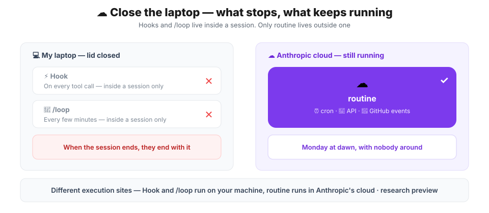
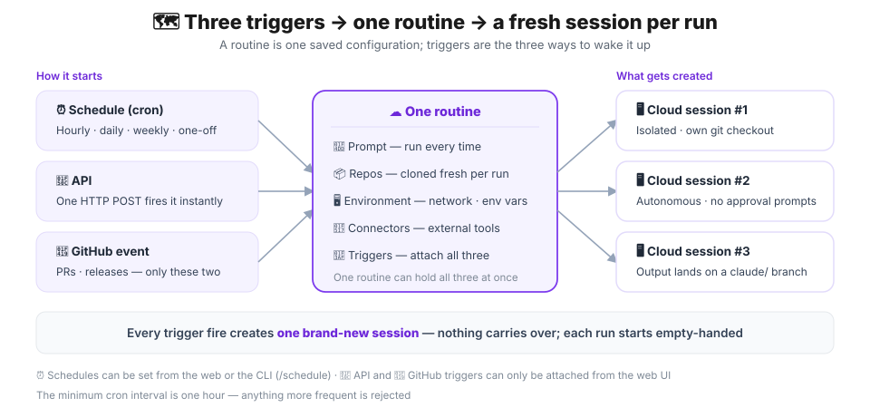
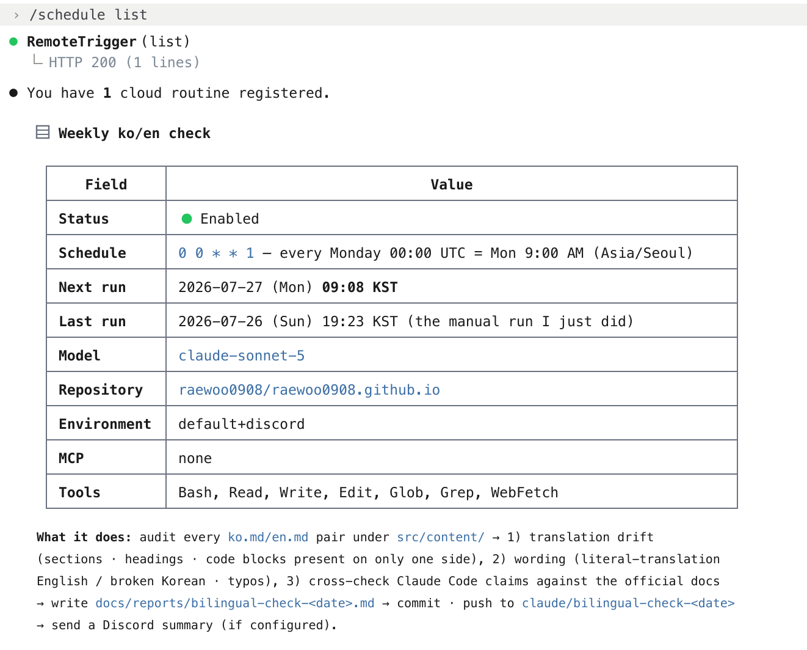
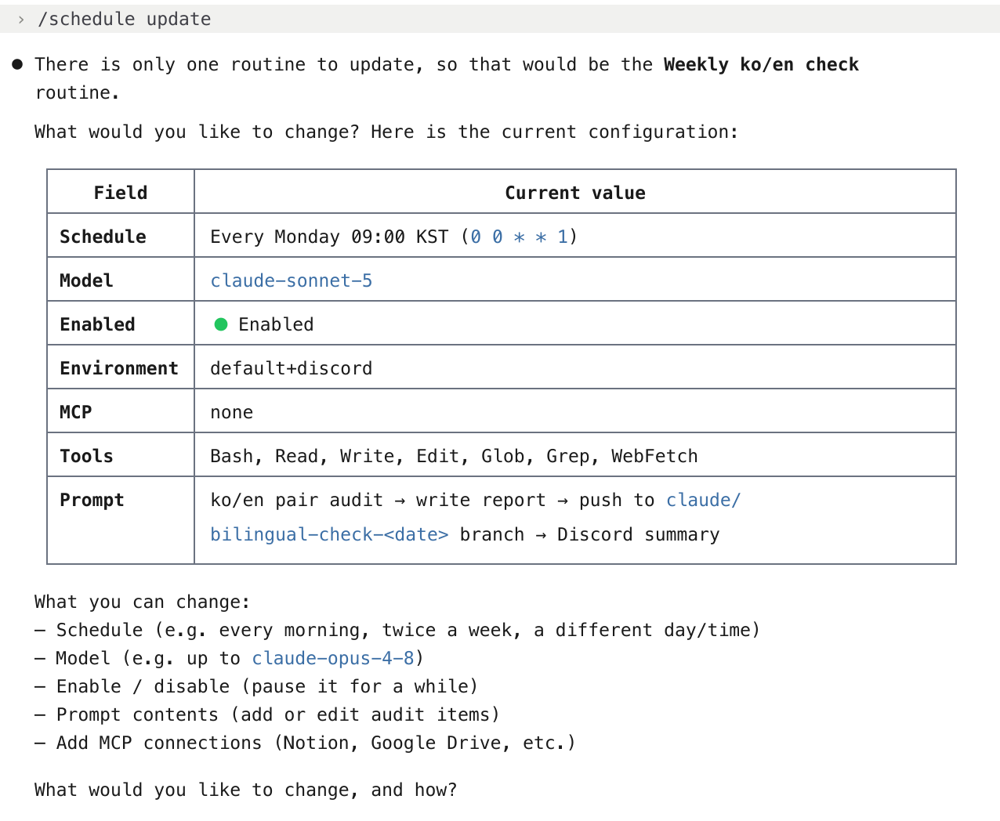
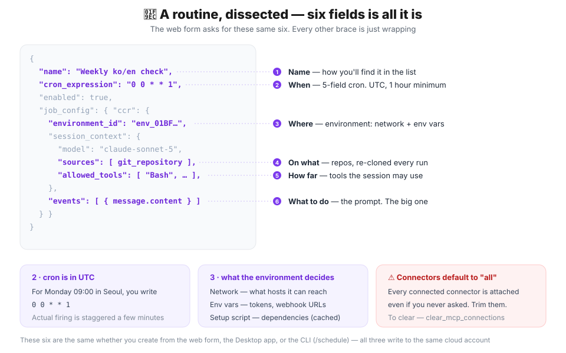
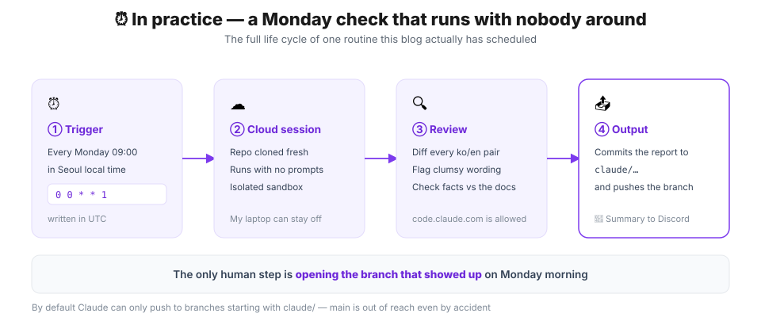
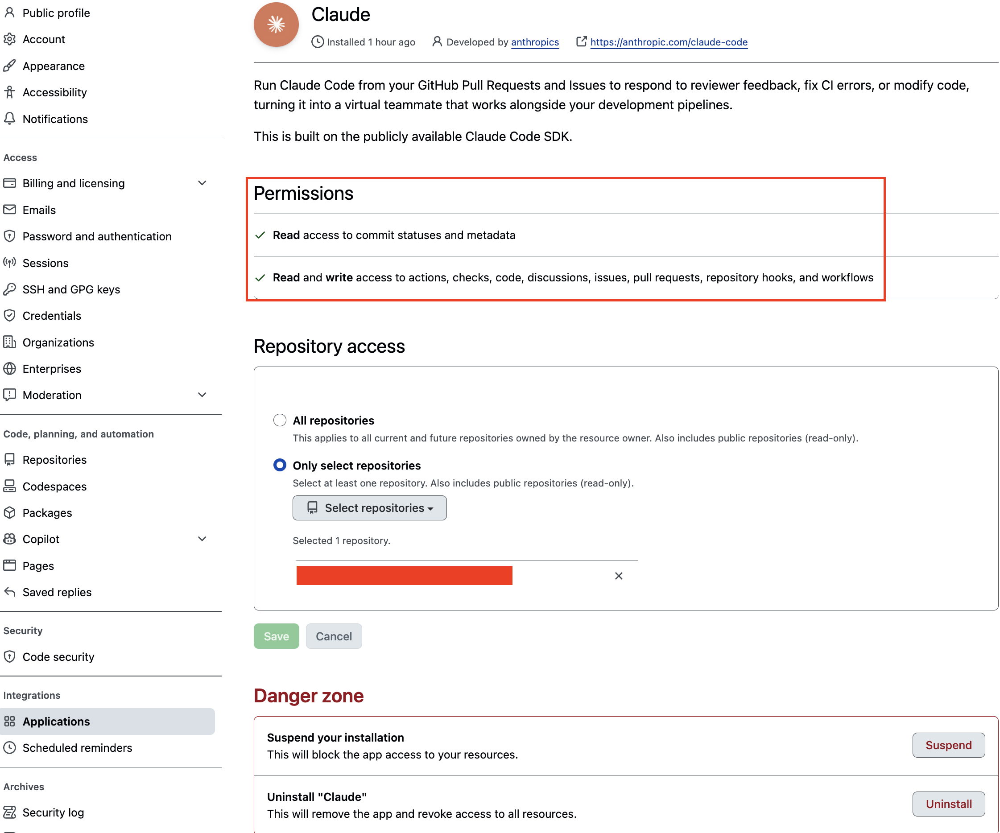
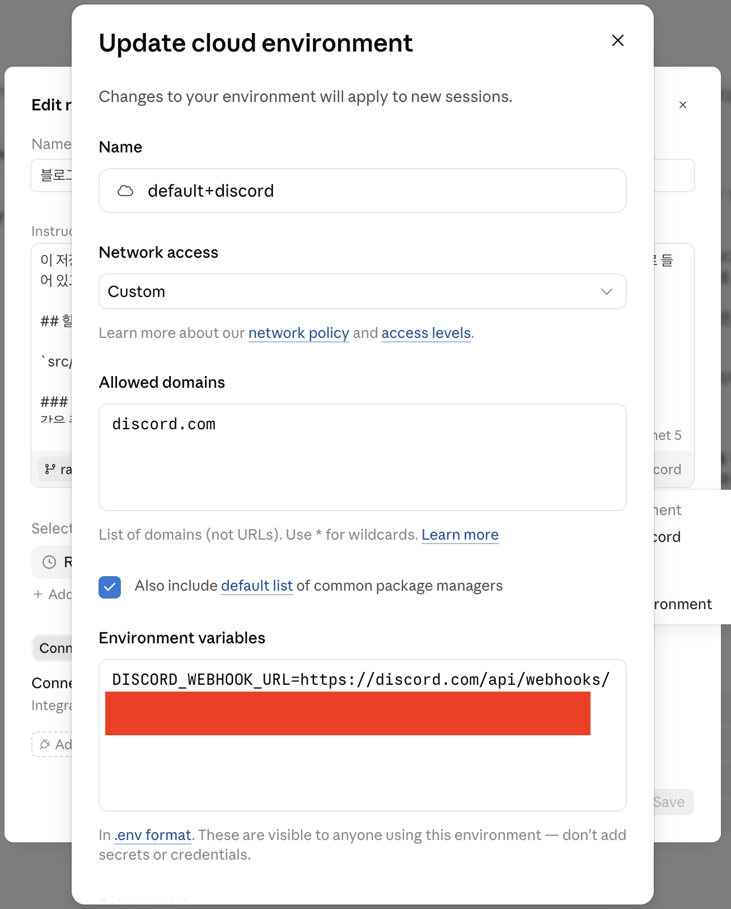
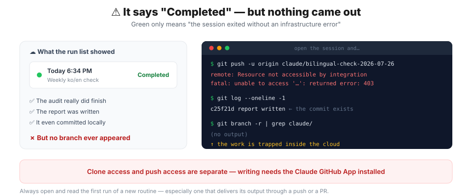
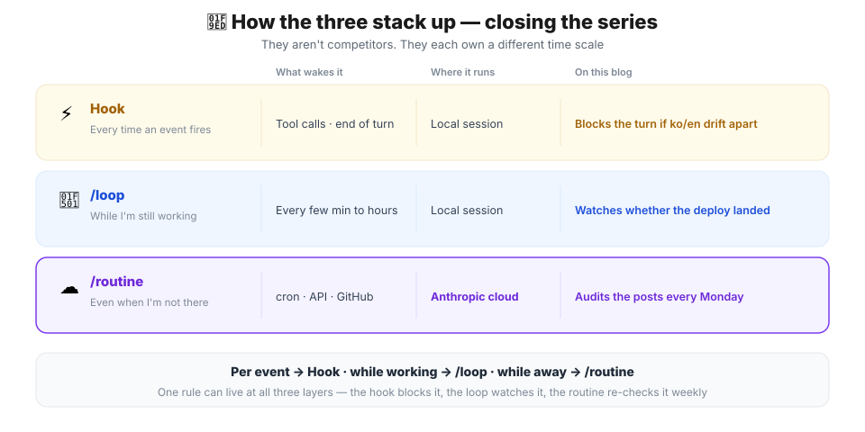

## Getting started — what dies the moment you close the lid

The [automation overview](/posts/claude/intro-automation-hook-loop-routine) walked through Hook, /loop, and routine; [part one](/posts/claude/hook) set up real Hooks on this blog and [part two](/posts/claude/loop) put /loop to work. This is the last one in the series: **`routine`**.

The first two share one property. **They only live while a session lives.**

Hooks are great. Edit `ko.md` alone and try to end the turn, and exit code 2 stops you. But what happens when I close the terminal? Nothing at all. Same with `/loop` — it checks the deploy every five minutes, until the session dies and takes the loop with it.

So neither can do this:

> Every Monday morning, diff every Korean and English post on this blog, find translations that have gone stale and claims that no longer match the official docs, and file a report.

Because I am certainly not sitting there on Monday morning with a session open. **`routine` exists for exactly this.** It runs in Anthropic's cloud, so the state of my computer is irrelevant.

> ⚠️ `routine` is a **research preview**. The official docs say plainly that *"behavior, limits, and the API surface may change."* Everything here reflects July 2026, and I've kept what I actually ran separate from what I only confirmed in the docs.

This post centers on **a routine I actually built and fired**. I'll attach a schedule trigger, run this blog's weekly audit with it, walk through the traps I hit along the way, and then close the series.

## 🎯 When to reach for a routine

The boundary between the three is simpler than it looks. It comes down to one question: **does this have to happen when I'm not here?**

| | ⚡ Hook | 🔁 /loop | ☁️ routine |
| --- | --- | --- | --- |
| What wakes it | Every event | Every few min–hours | cron · API · GitHub |
| Where it runs | Local session | Local session | **Anthropic cloud** |
| Needs a session | ✅ Yes | ✅ Yes | ❌ No |
| Work needing judgment | ❌ Bad fit | ✅ Good fit | ✅ Good fit |
| Time it takes | Milliseconds | Minutes | Minutes to tens of minutes |

Hooks belong on deterministic work that needs no judgment. Routines are the opposite: **work that needs judgment and takes a while** is exactly what suits them. A cloud run is a full Claude Code session — it runs shell commands, reads the repo, and commits.

> 💡 Conversely, **never put something latency-sensitive in a routine.** The minimum cron interval is **one hour**, and each run spins up a heavyweight session that re-clones the repository. If you need a fast reaction, that's a Hook.

## ⚙️ How it works — a routine is "one saved configuration"

There's no need to overthink this. One sentence covers it.

> **A routine is a prompt, repositories, an environment, and connectors saved as one bundle; triggers are the ways to wake it up.**



Two things are easy to miss here.

**First, there are three trigger types but only one routine.** You can attach schedule, API, and GitHub triggers **to the same routine at once**. A single PR-review routine can cover "runs nightly + fires when a PR opens + gets called by the deploy script."

**Second, every firing creates a brand-new session.** It's like spinning up several separate local sessions one by one. Today's run has no idea what yesterday's run did. That's why **the prompt has to be self-contained** — the single most important principle when writing one.

> 💡 Cloud sessions have **no approval prompts**. There's no permission-mode picker and nothing asks "shall I run this command?" mid-run. It goes end to end autonomously. So **narrowing what it can reach beforehand is your only safety mechanism** — so configure the GitHub repositories it can reach, the environment's network policy, and the connectors to match the routine's purpose.

## 🧬 Let's build one — there are only six fields

There are three ways to create one, and **all three write to the same cloud account**. Create it on the web and it shows up in the CLI immediately.

| Method | Where | What you can do |
| --- | --- | --- |
| Web form | [claude.ai/code/routines](https://claude.ai/code/routines) | **Everything** |
| Desktop app | Sidebar → Routines → New routine → **Cloud** | Everything |
| CLI | `/schedule` in any session | **Schedule triggers only** |

The CLI is fastest. You can do it right from the Claude Code chat.

```
/schedule daily PR review at 9am
/schedule tomorrow at 9am, summarize yesterday's merged PRs
/schedule in 2 weeks, open a cleanup PR that removes the feature flag
```

`/schedule list` shows them, `/schedule update` edits one, `/schedule run` fires it now. It's also aliased as `/routines`. Below is what `/schedule list` and `/schedule update` actually printed after I created the routine.



> ⚠️ **`/schedule` only creates schedule triggers.** API and GitHub triggers have to be attached from the web UI, and token generation and revocation aren't available from the CLI either.

### What you fill in

Whichever route you take, the fields are the same. Below is the configuration of the routine I **actually created** while writing this post.



```json
{
  "name": "Weekly ko/en check",
  "cron_expression": "0 0 * * 1",
  "enabled": true,
  "job_config": {
    "ccr": {
      "environment_id": "env_01BFqREp…",
      "session_context": {
        "model": "claude-sonnet-5",
        "sources": [
          { "git_repository": { "url": "https://github.com/raewoo0908/raewoo0908.github.io" } }
        ],
        "allowed_tools": ["Bash", "Read", "Write", "Edit", "Glob", "Grep", "WebFetch"]
      },
      "events": [
        { "data": { "message": { "role": "user", "content": "…the full prompt…" } } }
      ]
    }
  }
}
```

### cron is in UTC

This is the field people get wrong most often. **Cron expressions are always UTC.**

| What you want | cron (UTC) |
| --- | --- |
| Mondays at 09:00 Seoul time | `0 0 * * 1` |
| Daily at 09:00 Seoul time | `0 0 * * *` |
| Every two hours | `0 */2 * * *` |
| 1st of the month, 17:00 Seoul | `0 8 1 * *` |

For 9am in Korea (UTC+9), UTC is **midnight**. Picking a preset in the web form converts for you, but writing the cron by hand means doing the subtraction yourself.

> 💡 **The minimum interval is one hour.** Something like `*/30 * * * *` is rejected. And it won't fire at exactly that moment — runs are staggered by a few minutes to spread load.

I checked this directly. I created it with `0 0 * * 1` and the response came back with this `next_run_at`:

```json
"cron_expression": "0 0 * * 1",
"next_run_at": "2026-07-27T00:08:17Z"
```

**Eight minutes and seventeen seconds** of offset. And the offset is consistent per routine — after editing the configuration it was still `00:08:17`. If you need minute-level precision, plan around this.

## ⏰ In practice 1 — a weekly Monday ko/en consistency check plus a check that claims match the latest docs

Now for the real thing: dissecting **a routine actually scheduled on this blog**.

### The problem

Every post here exists in Korean and English. [The hook built in part one](/posts/claude/hook) stops me from editing `ko.md` alone and ending the turn. But there are things a hook can't catch.

- A hook only sees **the file I just touched**. Nobody ever re-checks a post from six months ago.
- A hook only sees **whether the pair was edited together**. It never judges whether the content actually corresponds.
- Above all, a hook has no idea **whether what the post claims is still true**. Claude Code keeps changing — is a default I wrote down last year still the default?

**Work that needs judgment, takes a while, and has to repeat.** That is the definition of a routine.



### The prompt

**The prompt is 80% of a routine.** Each run starts empty-handed, so every bit of context has to be in there. Below is the exact prompt I put into this blog's routine.

```text
This repository is an Astro-based bilingual (Korean/English) blog. Each post lives in
one folder as a `ko.md` / `en.md` pair, and the folder path becomes the URL.

## Your task
Audit every `ko.md` / `en.md` pair under `src/content/`, write a report, and push it.

### 1. Translation drift
- Sections, paragraphs, table rows, code blocks, or image refs present on only one side
- Headings whose count, order, or nesting diverges
- Code blocks whose actual code differs (translated comments are fine — exclude those)

### 2. Wording
- `en.md`: literal-translation phrasing, contextually awkward sentences, poor term choices
- `ko.md`: broken sentences, typos, awkward particles

### 3. Fact-checking (Claude Code claims)
Cross-check every setting key, hook event name, slash command, environment variable,
default, and limit mentioned in the posts against https://code.claude.com/docs/en/.

**Important**: clearly separate what you confirmed in the official docs from what you could not.
Do not present guesses as facts. If you cannot confirm something, say 'could not confirm in the docs'.

## Output
Write it to `docs/reports/bilingual-check-<today>.md`.

## Finishing up
1. Create a `claude/bilingual-check-<today>` branch, commit, and push.
   **Never push to any other branch.**
2. If the `DISCORD_WEBHOOK_URL` environment variable is set, send the summary to Discord.
```

Three parts carry the weight.

1. **It explains the repository layout first.** The cloud session is seeing this repo for the first time.
2. **It spells out "do not present guesses as facts."** Ask for fact-checking without that line and you get a report full of confident-sounding invention.
3. **It pins down where the output goes and in what form.** It fixes the report's filename format, tells it to create a separate branch and push there, and to send a summary to Discord as well.

> 💡 Always state **where the output goes and what it's named**. Because every routine run is a fresh session, skipping this scatters yesterday's and today's results in different places.

### Setting up the environment

I said I wanted the routine's results delivered as a **git branch** and a **Discord summary**.
- **A git branch** — commit the report and push to `claude/…`. It stays there for whenever I get to it.
- **Discord** — just the summary, immediately. A signal that there's something to look at.

That takes some setup.
- **Install the Claude GitHub App**
  1. Go to https://github.com/apps/claude → Install
  2. Go to https://github.com/settings/installations → Claude → Configure
  3. Check that your repository is included under Repository access
  4. Check that Permissions includes **Contents: Read and write**
    

- **Issue a Discord webhook URL and store it in the cloud environment**
  1. Create a Discord channel, then Integrations → Webhooks → New Webhook → `Copy Webhook URL`
  2. Open the 'Routines' tab in the Claude desktop GUI
  3. Click the 'pencil' icon on the routine you just created
  4. Click the 'cloud' icon right below the prompt
  5. Click `+Add environment` → set a Name → set Network Access: Custom → add `discord.com` to Allowed domains → add `DISCORD_WEBHOOK_URL=<the webhook URL you just created>` under Environment variables.
  6. Check *"Also include default list of common package managers"* — **skip this and GitHub breaks too**
    


### What happened when I ran it

I wasn't going to wait until Monday, so I hit **Run now**.

Below is the summary that arrived as a Discord message once the routine finished successfully.

```text
ko/en pair audit report (2026-07-26)
12 posts audited / 7 findings (4 real drift, 1 wording, 1 intent check) + Claude Code fact-check
cv: portfolio link mismatch, refactoring description drift, missing military unit name, added 'Aspiring'
internship(en): subjectless sentence fragment
algorithms/hello: code literal (greeting) differs by language - needs intent check
hook/loop posts: the 30 hook event names and most claims confirmed against the official docs. the stop_hook_active field, the cron conversion upper bound, and the generalized jitter-avoidance advice could not be confirmed directly / partially mismatched
branch: claude/bilingual-check-2026-07-26
report: docs/reports/bilingual-check-2026-07-26.md
```

Getting that on your phone **without sitting at a terminal** is the whole reason to schedule a routine.

A new branch with the audit report also landed in my GitHub repository.

```console
$ git ls-remote --heads origin 'refs/heads/claude/*'
d8ccf2f  refs/heads/claude/bilingual-check-2026-07-26

$ git diff --stat main...origin/claude/bilingual-check-2026-07-26
 docs/reports/bilingual-check-2026-07-26.md | 148 +++++++++++++++++++++
 1 file changed, 148 insertions(+)
```

**Exactly one file added — the report.** Nothing outside what it was asked to do, and `main` untouched. That `--stat` line is the thing you actually want to check when you hand a repository to an autonomous run.

## ⚠️ Trap 1 — local plugins do not follow you into the cloud

Claude Code has an [official Discord plugin](https://github.com/anthropics/claude-plugins-official) that bridges a local session to Discord. I assumed I could obviously use it from a routine too.

**You can't.** Open the plugin definition and the reason is immediate.

```json
{
  "mcpServers": {
    "discord": {
      "command": "bun",
      "args": ["run", "--cwd", "${CLAUDE_PLUGIN_ROOT}", "--shell=bun", "--silent", "start"]
    }
  }
}
```

It's `command`-based — a **stdio server that spawns a process on my machine**. It reads the bot token from `~/.claude/channels/discord/.env`. The cloud sandbox has no `$CLAUDE_PLUGIN_ROOT` and no `~/.claude/channels/`.

The official docs say the same thing:

> MCP servers you added locally in the CLI with `claude mcp add` are stored **on your machine** rather than your claude.ai account, so they do not appear in the connectors list.

**A routine can only use connectors registered on your claude.ai account.** Local MCP servers, local plugins, local environment variables — none of it follows. That's what "runs in the cloud" really means.

> 💡 This is also the decisive difference from Hooks. A Hook runs on my machine **with my full account privileges**. A routine runs in an isolated cloud sandbox. What you gain in availability you lose in reach.

### So how do you reach Discord?

There are three paths, and they differ sharply in practicality.

| Approach | What it needs | Verdict |
| --- | --- | --- |
| **Incoming webhook + `curl`** | Webhook URL · allowed domain | ✅ Simplest |
| Bot token calling the REST API | Bot token · allowed domain | △ Works, more fuss |
| Commit an `.mcp.json` to the repo | Vendored server · setup script | ✗ Overkill |

The third is a documented path — *"declare it in a committed `.mcp.json` so it is part of the cloned repository."* But moving a server that needs a runtime (bun) and local state is more trouble than it's worth. And since **a routine run is a one-shot session**, it doesn't fit a two-way bot that waits for messages anyway.

Notifications and approval requests only need **Claude → Discord, one way**. A webhook is the right answer.

```bash
# called from inside the routine's prompt
jq -n --arg c "$SUMMARY" '{content: $c}' \
  | curl -sS -X POST "$DISCORD_WEBHOOK_URL" \
      -H 'Content-Type: application/json' -d @-
```

### But it won't just work — the network allowlist

Here's the second trap. The cloud environment defaults to **Trusted**, which does not mean "can reach anything."

| Level | Outbound connections |
| --- | --- |
| **None** | Nowhere |
| **Trusted** (default) | The default allowlist only — package registries · GitHub · cloud SDKs |
| **Custom** | Your own list (optionally including the defaults) |
| **Full** | Anywhere |

The default allowlist holds things like `github.com`, `*.googleapis.com`, and `registry.npmjs.org`. `code.claude.com` is in there too — which is why **checking against the official docs works with no extra setup.**

But `discord.com` is **not**. Leave it alone and the request is blocked with a `403` and an `x-deny-reason: host_not_allowed` header.

So you have to configure it, exactly as described above.

1. Open the environment (cloud icon) from the routine's edit screen
2. Set **Network access** to **`Custom`** and add `discord.com` to **Allowed domains**
3. Check *"Also include default list of common package managers"* — **skip this and GitHub breaks too**
4. Register `DISCORD_WEBHOOK_URL` as an environment variable on the same screen

> ⚠️ Step 3 is the real trap. Leave it unchecked and **only** your listed domains are allowed; the default list vanishes entirely. Repository cloning survives on a separate proxy, but `npm install` dies.

> 💡 A webhook URL **is a password**. Never hardcode it in the prompt — always use an environment variable. Prompts are stored verbatim in the routine's configuration and are readable through the list API.

> 💡 Write the prompt to **send only if the environment variable exists, and skip silently otherwise.** Then the routine runs fine before you've wired up the webhook, and notifications come alive the moment you fill the variable in.

## ⚠️ The remaining traps

One got its own section above. Here's the rest.

### 1. Connectors default to "all of them"

I hit this one directly. Creating a routine through the API, I **omitted `mcp_connections` entirely** — and the response came back with **all six** connectors on my account attached.

```json
"mcp_connections": [
  { "name": "Figma", … }, { "name": "Google_Calendar", … },
  { "name": "Excalidraw", … }, { "name": "Google_Drive", … },
  { "name": "Claude_Code_Remote", … }, { "name": "Notion", … }
]
```

The docs state it too — *"when you create a routine, all of your currently connected connectors are included by default."* And **Claude can call every tool from an included connector, writes included, without asking permission during a run.**

Why would a docs-audit routine need calendar and Drive write access? I stripped them.

```json
{ "clear_mcp_connections": true }
```

> ⚠️ **Check the connector list every time you create a routine.** In the web form, trim them under the Connectors tab. Autonomous execution + no approvals + every connector is a poor combination.

### 2. A green status is not "success" — it caught me immediately

The green marker in the run list only means **the session started and exited without an infrastructure error**. It does not mean everything the prompt asked for was **carried through**.

The run of the routine set up above showed up in the list as **"Completed."** But opening the session, the branch had never been pushed. Inside the session the report was written and the branch was created and committed — then it hit a wall, because there was no permission to push.



```console
$ git push -u origin claude/bilingual-check-2026-07-26
remote: Resource not accessible by integration
fatal: unable to access '…': The requested URL returned error: 403
```

**The audit itself went perfectly.** It diffed all ten ko/en pairs, cross-checked claims against the official docs, wrote the report, and committed locally.

But **one blocked push at the end evaporated the whole output inside the cloud.** The list still showed green.

The cause was permissions: **cloning worked, pushing didn't.** Read access and branch-creation access are separate things, and `/web-setup` grants **cloning only**. Writing requires the **Claude GitHub App installed on that repository**.

> ⚠️ When you create a routine, **always open the first run and read the results to the end.** Even with a green light on the session, a network request may have been blocked, a connector tool may never have been configured, or a permission may have been denied. If your routine delivers its output via push or PR, confirm with your own eyes that the branch actually landed.

> 💡 Adding a line like **"if the push fails, say so plainly in your final message"** to the prompt helps. In my case the session reported the failure clearly even without being asked, which is how I caught it.

### Once it's fixed

After sorting out the permission and re-running, the branch finally landed.

```console
$ git ls-remote --heads origin 'refs/heads/claude/*'
d8ccf2f  refs/heads/claude/bilingual-check-2026-07-26

$ git diff --stat main...origin/claude/bilingual-check-2026-07-26
 docs/reports/bilingual-check-2026-07-26.md | 148 +++++++++++++++++++++
 1 file changed, 148 insertions(+)
```

**Exactly one file added — the report.** Nothing outside what it was asked to do, and `main` untouched. That `--stat` line is the thing you actually want to check when you hand a repository to an autonomous run.

> 💡 "Clones fine, push blocked" is the most confusing failure mode. Remembering that **read access and write access are separate grants** makes it much faster to diagnose.

### 3. `claude/`-prefixed branches always go through; anything else gets checked

Pushes to branches starting with `claude/` are always accepted. When your prompt tells Claude to push somewhere else, Claude Code checks the push first and rejects it if **any** of the following is true:

- The branch is **protected on GitHub**
- **Someone else has an open pull request** from that branch
- The branch carries **commits authored by someone other than you**

That does stop you from accidentally damaging a protected branch, but it doesn't wall off every other branch for you. Given that these runs are autonomous, I'd pin **"never push anywhere but a `claude/` branch"** into the prompt itself.

### 4. A routine acts as *you*

Everything a routine does through your connected GitHub identity and connectors is recorded **as you**. Commits and PRs carry your GitHub user; Slack messages and Notion edits go through your accounts. They aren't shared with teammates either — routines **belong to your personal claude.ai account**.

### 5. Usage is counted separately

Routine runs draw down subscription usage like any session. On top of that there's a **separate daily cap on runs per account**. Hit it and you get `429`; without usage credits enabled, further runs are rejected until the window resets.

> 💡 **One-off runs are exempt from the daily cap.** They consume regular subscription usage but don't count against the routine run allowance, so use them freely for light scheduling.

### 6. When `/schedule` says "Unknown command"

The CLI hides the command when its requirements aren't met. The usual causes, in order:

1. **You're not on a claude.ai subscription login** — a Console API key, or a cloud provider such as Amazon Bedrock, Google Cloud's Agent Platform, or Microsoft Foundry. If `ANTHROPIC_API_KEY` or `ANTHROPIC_AUTH_TOKEN` is in your shell, or `apiKeyHelper` is set, those take precedence. Remove them and run `/login`.
2. **You disabled telemetry** — `DISABLE_TELEMETRY`, `DO_NOT_TRACK`, `CLAUDE_CODE_DISABLE_NONESSENTIAL_TRAFFIC`, `DISABLE_GROWTHBOOK`. These block feature-flag fetching, which the command depends on.
3. **You're inside a web session** — manage them from the web UI there.

In every case, you can always create one at [claude.ai/code/routines](https://claude.ai/code/routines).

### 7. Deletion is web-only

The CLI covers list, update, and run-now. Deleting requires the web UI. Past sessions a routine created stay in your session list afterward.

## 🧭 Closing the series — how the three stack

One diagram runs through all three posts.



They don't compete. They're strongest **layered over the same rule**. This blog's ko/en rule is exactly that.

| Layer | Tool | When | What |
| --- | --- | --- | --- |
| 1 | ⚡ `PostToolUse` hook | Right after an edit | Nudges you to fix the pair |
| 2 | ⚡ `Stop` hook | Trying to end the turn | **Blocks** if you didn't |
| 3 | ⚡ git `pre-commit` | Trying to commit | Blocks humans too |
| 4 | ☁️ **routine** | Every Monday | **Re-audits every past post** |

Layers 1–3 came from [part one](/posts/claude/hook). All three only ever look at **the file you're touching right now**. Without layer 4, nobody revisits a post from six months ago. And with only layer 4, today's mistake rides along until next Monday. What fills the gap between them is [part two's `/loop`](/posts/claude/loop) — watching, alongside you, whether the work you're doing right now actually landed.

The rule for choosing comes down to one line.

> **Per event → Hook · while working → /loop · while away → routine**

## In one sentence

> **A routine is a prompt, repositories, and an environment saved as one bundle that the cloud opens a session for on your behalf — which is why it runs regardless of what your computer is doing.**

Four things worth remembering:

- **Write self-contained prompts.** Every run is a new session with no memory of yesterday.
- **Nothing local follows.** Not plugins, MCP servers, environment variables, or files. Anything needed has to be re-supplied through the environment and connectors — and the repository it sees is **only what you've pushed**.
- **Narrow what it can reach.** These runs are autonomous with no approval prompts, and connectors default to "all."
- **Trust neither the green light nor the report.** Open the run history yourself, and make the call on each finding yourself.

Across three posts we've covered Hook, /loop, and routine. When you're unsure where a piece of automation belongs, ask **"does this have to happen when I'm not here?"** — the answer usually falls out immediately.

## 📚 References

- [Automate work with routines — official Claude Code docs](https://code.claude.com/docs/en/routines)
- [Trigger a routine through the API — API reference](https://platform.claude.com/docs/en/api/claude-code/routines-fire)
- [Claude Code on the web — cloud environments and network policy](https://code.claude.com/docs/en/claude-code-on-the-web)
- [Desktop scheduled tasks — scheduled work that runs on your machine](https://code.claude.com/docs/en/desktop-scheduled-tasks)
- [`/loop` and in-session scheduling](https://code.claude.com/docs/en/scheduled-tasks)
- [MCP connectors](https://code.claude.com/docs/en/mcp)
- [Hook: Enforcing Rules on Every Event — series part 1](/posts/claude/hook)
- [/loop: Run It on Repeat While You Do Other Things — series part 2](/posts/claude/loop)
- [Automation: Hook, /loop, routine — series overview](/posts/claude/intro-automation-hook-loop-routine)
- [Mastering Claude Code — Ch01 Deep Dive (lecture slides)](https://claudecode-lecture.vercel.app/Part1-Claude_Code_%EB%A7%88%EC%8A%A4%ED%84%B0%ED%95%98%EA%B8%B0/Ch01-Claude_Code_%EB%94%A5%EB%8B%A4%EC%9D%B4%EB%B8%8C/learn.html)
