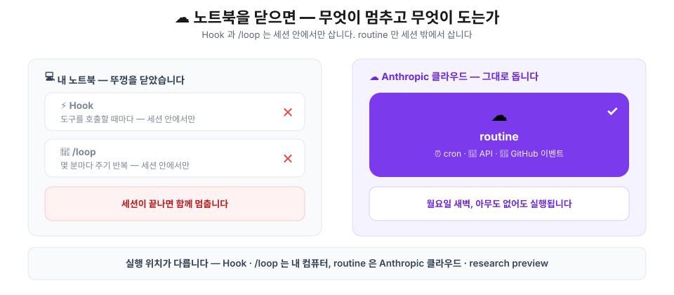
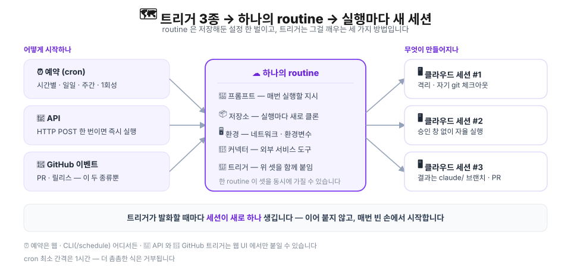
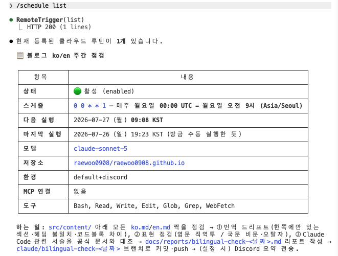
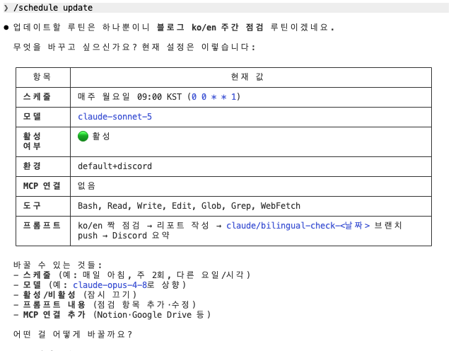
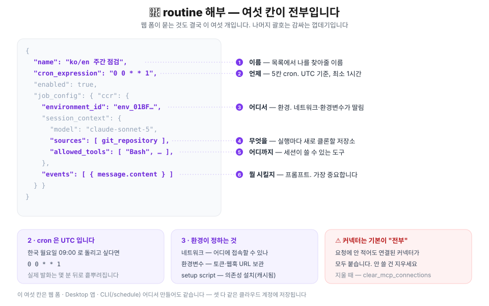
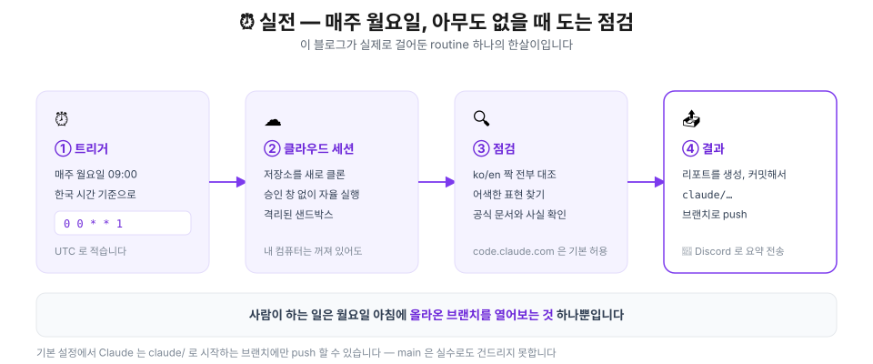
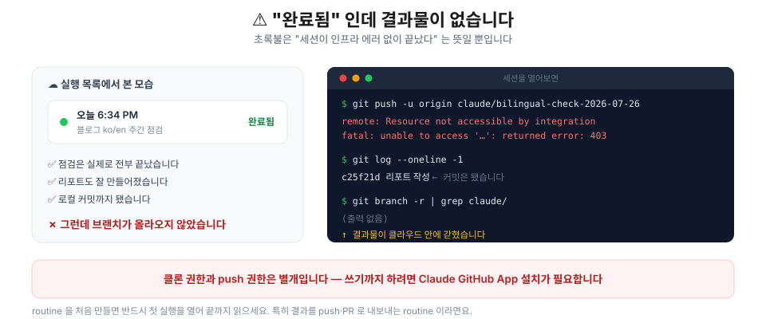
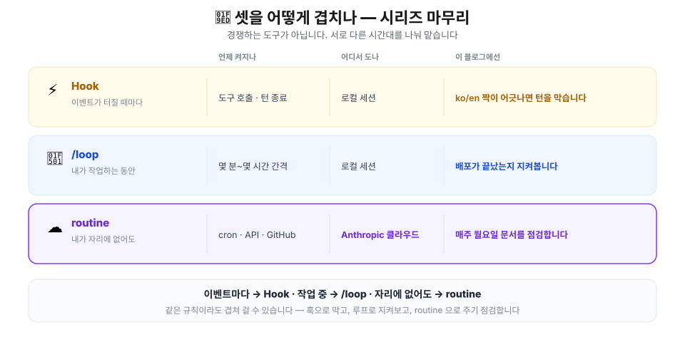

## 들어가며 — 노트북을 닫는 순간 멈추는 것들

[자동화 개요 글](/posts/claude/intro-automation-hook-loop-routine)에서 Hook · /loop · /routine을 한 바퀴 훑었고, [1편에서 Hook](/posts/claude/hook)을, [2편에서 /loop](/posts/claude/loop)를 실제로 걸어봤습니다. 이번이 시리즈의 마지막, **`/routine`** 입니다.

앞의 둘에는 공통점이 하나 있습니다. **세션이 살아 있어야 삽니다.**

Hook은 훌륭합니다. `ko.md`만 고치고 턴을 끝내려 하면 종료코드 2로 막아줍니다. 그런데 제가 터미널을 닫으면요? 아무 일도 일어나지 않습니다. `/loop`도 마찬가지입니다. 5분마다 배포를 확인해주지만, 세션이 죽으면 같이 죽습니다.

그래서 이런 일은 둘 다 못 합니다.

> 매주 월요일 아침에 이 블로그의 한국어·영어 글을 전부 대조해서, 번역이 낡은 곳과 공식 문서와 어긋난 서술을 찾아 리포트로 올려두기.

월요일 아침에 제가 노트북을 켜고 세션을 띄우고 있을 리 없으니까요. **`/routine`은 이 지점을 위해 존재합니다.** Anthropic 클라우드에서 돌기 때문에 제 컴퓨터의 상태와 무관합니다.

> ⚠️ `/routine`은 **research preview** 입니다. 공식 문서도 *"동작·제한·API 표면이 바뀔 수 있다"* 고 명시하고 있습니다. 이 글의 내용은 작성 시점(2026년 7월) 기준이고, 실제로 돌려본 부분과 문서로만 확인한 부분을 구분해 적었습니다.

이 글에서는 실제로 **routine 하나를 만들어 돌려본 기록**을 중심에 두겠습니다. 예약 트리거를 붙여 이 블로그의 주간 점검을 돌려보고, 그 과정에서 밟은 함정들을 정리한 뒤 시리즈를 닫겠습니다.

## 🎯 언제 routine을 쓰나요

셋의 경계는 의외로 단순합니다. **"내가 없어도 돌아야 하는가?"** 하나로 갈립니다.

| | ⚡ Hook | 🔁 /loop | ☁️ /routine |
| --- | --- | --- | --- |
| 언제 켜지나 | 이벤트마다 | 몇 분~몇 시간마다 | cron · API · GitHub |
| 어디서 도나 | 로컬 세션 | 로컬 세션 | **Anthropic 클라우드** |
| 세션이 필요한가 | ✅ 필요 | ✅ 필요 | ❌ 불필요 |
| 판단이 필요한 일 | ❌ 안 맞음 | ✅ 맞음 | ✅ 맞음 |
| 걸리는 시간 | 밀리초 | 분 단위 | 분~수십 분 |

Hook은 "판단이 필요 없는 결정적인 일"에만 걸어야 했습니다. routine은 정반대입니다. **판단이 필요하고 시간도 오래 걸리는 일**이 오히려 어울립니다. 클라우드 세션은 온전한 Claude Code 세션이라 셸도 쓰고, 저장소도 읽고, 커밋도 합니다.

> 💡 반대로 **몇 초 안에 끝나야 하는 일에 routine을 쓰면 안 됩니다.** cron 최소 간격이 **1시간**이고, 실행마다 저장소를 새로 클론하는 무거운 세션이 뜹니다. 빠른 반응이 필요하면 Hook이 맞습니다.

## ⚙️ 동작 원리 — routine은 "저장해둔 설정 한 벌"입니다

routine을 어렵게 생각할 필요가 없습니다. 한 문장이면 됩니다.

> **routine은 프롬프트·저장소·환경·커넥터를 한 벌로 저장해둔 것이고, 트리거는 그걸 깨우는 방법입니다.**



여기서 놓치기 쉬운 점이 두 가지 있습니다.

**첫째, 트리거는 세 종류인데 routine은 하나입니다.** 예약·API·GitHub 이벤트를 **한 routine에 동시에** 붙일 수 있습니다. PR 리뷰 routine 하나가 "야간 정기 실행 + 새 PR이 열릴 때 + 배포 스크립트가 부를 때"를 모두 담당하는 식입니다.

**둘째, 발화할 때마다 세션이 새로 생깁니다.** 마치 로컬 세션을 여러 개 따로따로 생성하는 것과 같습니다. 어제 실행이 무엇을 했는지 오늘 실행은 모릅니다. 그래서 **프롬프트가 자기완결적이어야 합니다.** 이게 routine 프롬프트를 쓸 때 가장 중요한 원칙입니다.

> 💡 클라우드 세션에는 **승인 창이 없습니다.** 권한 모드 선택지도 없고, 실행 중에 "이 명령 실행할까요?"라고 묻지도 않습니다. 자율적으로 끝까지 갑니다. 그러니 **무엇에 닿을 수 있는지를 미리 좁혀두는 게** 유일한 안전장치입니다 — 이를 위해 접근 가능한 Github 저장소, 네트워크 정책, 커넥터 설정을 루틴의 목적에 맞게 설정해놔야 합니다.

## 🧬 만들어봅시다 — 채울 칸은 여섯 개뿐

만드는 방법은 세 가지고, **셋 다 같은 클라우드 계정에 저장**됩니다. 웹에서 만든 게 CLI에도 바로 보입니다.

| 방법 | 어디서 | 할 수 있는 것 |
| --- | --- | --- |
| 웹 폼 | [claude.ai/code/routines](https://claude.ai/code/routines) | **전부** |
| Desktop 앱 | 사이드바 → Routines → New routine → **Cloud** | 전부 |
| CLI | 세션에서 `/schedule` | **예약 트리거만** |

CLI가 제일 빠릅니다. Claude Code 대화창에서 바로 진행할 수 있습니다.

```
/schedule daily PR review at 9am
/schedule tomorrow at 9am, summarize yesterday's merged PRs
/schedule in 2 weeks, open a cleanup PR that removes the feature flag
```

`/schedule list`로 목록을, `/schedule update`로 수정을, `/schedule run`으로 즉시 실행을 할 수 있습니다. `/routines`라는 별칭으로도 부를 수 있습니다. 아래 사진은 routine을 만든 후 직접 `/schedule list`, `/schedule update`를 해본 결과입니다. 



> ⚠️ **CLI `/schedule`로는 예약(cron) 트리거만 만들 수 있습니다.** API 트리거와 GitHub 트리거는 웹 UI에서 붙여야 합니다. 토큰 발급·폐기도 CLI로는 안 됩니다.

### 무엇을 채우는가

어느 경로로 만들든 채우는 칸은 같습니다. 아래는 제가 이 글을 쓰면서 **실제로 만든 routine**의 설정입니다.



```json
{
  "name": "블로그 ko/en 주간 점검",
  "cron_expression": "0 0 * * 1",
  "enabled": true,
  "job_config": {
    "ccr": {
      "environment_id": "env_01BFqREp…",
      "session_context": {
        "model": "claude-sonnet-5",
        "sources": [
          { "git_repository": { "url": "https://github.com/raewoo0908/raewoo0908.github.io" } }
        ],
        "allowed_tools": ["Bash", "Read", "Write", "Edit", "Glob", "Grep", "WebFetch"]
      },
      "events": [
        { "data": { "message": { "role": "user", "content": "…프롬프트 전문…" } } }
      ]
    }
  }
}
```

### cron은 UTC입니다

가장 자주 틀리는 칸입니다. **cron 식은 언제나 UTC 기준**입니다.

| 쓰고 싶은 것 | cron 식 (UTC) |
| --- | --- |
| 매주 월요일 한국 시간 09:00 | `0 0 * * 1` |
| 매일 한국 시간 09:00 | `0 0 * * *` |
| 두 시간마다 | `0 */2 * * *` |
| 매월 1일 한국 시간 17:00 | `0 8 1 * *` |

한국(UTC+9)에서 오전 9시를 원하면 UTC로는 **자정**입니다. 웹 폼에서 프리셋을 고를 때는 알아서 변환해주지만, cron 식을 직접 쓸 때는 손으로 빼야 합니다.

> 💡 **최소 간격은 1시간**입니다. `*/30 * * * *` 같은 식은 거부됩니다. 그리고 정확히 그 시각에 뜨지 않습니다 — 부하 분산을 위해 몇 분씩 흩뿌려집니다(stagger).

이건 실제로 확인해봤습니다. `0 0 * * 1`로 만들었더니 응답의 `next_run_at`이 이렇게 돌아왔습니다.

```json
"cron_expression": "0 0 * * 1",
"next_run_at": "2026-07-27T00:08:17Z"
```

**8분 17초**가 붙었습니다. 그리고 이 오프셋은 routine마다 일정합니다 — 설정을 수정한 뒤에도 `00:08:17` 그대로였습니다. 분 단위 정확도가 필요한 일이라면 이 점을 감안하셔야 합니다.

## ⏰ 실전 1 — 매주 월요일 블로그 한/영 정합성 점검 및 최신 기술문서 반영 여부 점검

**이 블로그에 실제로 걸어둔 routine**을 해부하겠습니다.

### 문제

이 블로그는 한 글을 한국어·영어 두 벌로 씁니다. [1편에서 만든 훅](/posts/claude/hook)이 `ko.md`만 고치고 턴을 끝내는 걸 막아주죠. 그런데 훅이 못 잡는 게 있습니다.

- 훅은 **이번에 고친 파일**만 봅니다. 반년 전에 쓴 글이 지금도 멀쩡한지는 아무도 안 봅니다.
- 훅은 **짝이 같이 수정됐는지**만 봅니다. 내용이 실제로 대응하는지는 판단하지 않습니다.
- 무엇보다 훅은 **글에 적힌 사실이 아직 맞는지** 모릅니다. Claude Code는 계속 바뀌는데, 작년 글에 적어둔 기본값이 지금도 그럴까요?

**판단이 필요하고, 오래 걸리고, 주기적이어야 하는 일.** routine의 정의 그대로입니다.



### 프롬프트

routine에서 **프롬프트가 8할**입니다. 실행마다 빈 손에서 시작하니, 필요한 맥락을 전부 넣어야 합니다. 아래 프롬프트는 제가 이 블로그 루틴에 실제로 넣은 프롬프트입니다.

```text
이 저장소는 Astro 기반 한/영 이중언어 블로그입니다. 한 편의 글은 폴더 하나에
`ko.md`와 `en.md` 짝으로 들어 있고, 폴더 경로가 곧 URL이 됩니다.

## 할 일
`src/content/` 아래의 모든 `ko.md` / `en.md` 짝을 점검하고 리포트를 작성해 push하세요.

### 1. 번역 드리프트
- 한쪽에만 있는 섹션·문단·표 행·코드블록·이미지 참조
- 헤딩의 개수·순서·계층이 어긋나는 곳
- 코드블록의 코드 자체가 다른 곳 (주석이 번역된 것은 정상이니 제외)

### 2. 표현 점검
- `en.md`: 직역투 문장, 문맥상 어색한 표현, 어울리지 않는 용어 선택
- `ko.md`: 비문, 오탈자, 어색한 조사

### 3. 사실 점검 (Claude Code 관련 서술)
글에 나오는 설정 키, 훅 이벤트 이름, 슬래시 커맨드, 환경변수, 기본값, 제한값을
https://code.claude.com/docs/en/ 공식 문서와 대조합니다.

**중요**: 공식 문서로 확인된 것과 확인하지 못한 것을 반드시 구분해 표기하세요.
추측을 사실처럼 쓰지 마세요. 확인이 안 되면 '문서에서 확인 불가'라고 명시하세요.

## 산출물
`docs/reports/bilingual-check-<오늘날짜>.md` 로 작성합니다.

## 마무리
1. `claude/bilingual-check-<오늘날짜>` 브랜치를 만들어 커밋하고 push하세요.
   **다른 브랜치에는 절대 push하지 마세요.**
2. 환경변수 `DISCORD_WEBHOOK_URL`이 설정되어 있으면 요약을 Discord로 보내세요.
```

세 군데가 핵심입니다.

1. **저장소 구조를 먼저 설명합니다.** 클라우드 세션은 이 저장소를 처음 봅니다.
2. **"추측을 사실처럼 쓰지 마세요"를 명시했습니다.** 사실 점검을 시키면서 이 문장을 빼면, 그럴듯한 소리를 지어내는 리포트가 돌아옵니다.
3. **산출물의 위치와 형식을 못박았습니다.** 결과 리포트의 제목 형식을 지정했고, 별도 branch를 만들어서 push하고, Discord로도 요약 메시지를 보내도록 지시했습니다.

> 💡 프롬프트 마지막에 **결과물을 어디에 어떤 이름으로 두라**고 적으세요. routine은 매번 새 세션이라, 이걸 안 적으면 어제와 오늘의 결과가 다른 곳에 흩어집니다.

### 환경 설정
routine의 결과를 **git 브랜치** 와 **Discord 요약 알림**으로 받아본다고 했습니다.
- **git 브랜치** — 리포트를 커밋해서 `claude/…` 브랜치로 push. 나중에 천천히 봐도 남아 있습니다.
- **Discord** — 요약만 즉시. "봐야 할 게 생겼다"는 신호입니다.

이를 위해서는 환경 설정을 해줘야 합니다. 
- **Claude GitHub App 설치**
  1.  https://github.com/apps/claude 접속 → 설치
  2.  https://github.com/settings/installations → Claude → Configure
  3. Repository access에 본인 레포가 포함돼 있는지 확인
  4. Permissions에 **Contents: Read and write** 가 있는지 확인
    

- **Discord Webhook URL 발급 후 cloud environment에 저장하기**
  1. Discord 채널을 만든 다음, 연동 → 웹훅 → 새 웹훅 → `웹훅 URL 복사`
  2. claude Desktop GUI에서 'routine' 탭 접속
  3. 방금 생성한 routine에서 '연필'모양 클릭
  4. 프롬프트 바로 아래에 '구름'모양 클릭
  5. `+Add environment`클릭 → Name 설정 → Network Access: Custom 설정 → Allowed domains에 `discord.com` 추가 → Environment variables에 `DISCORD_WEBHOOK_URL=<방금 생성한 웹훅 URL>`으로 넣어줍니다.
  6. *"Also include default list of common package managers"* 를 체크합니다 — **안 하면 GitHub도 막힙니다**
    


### 돌려본 결과

월요일까지 기다릴 수는 없으니 **Run now**로 즉시 돌렸습니다. 

아래 내용은 routine이 성공적으로 마무리되고 Discord 메시지로 온 요약본입니다.

```text
ko/en 짝 점검 리포트 (2026-07-26)
점검 글 12개 / 발견 7건 (실질 드리프트 4, 표현 1, 의도확인 1) + Claude Code 사실점검
cv: 포트폴리오 링크 불일치, 리팩터링 서술 드리프트, 병역 부대명 누락, 'Aspiring' 첨언
internship(en): 주어 없는 문장 조각
algorithms/hello: 코드 리터럴(인사말) 언어별 다름 - 의도 확인 필요
hook/loop 글: 30개 훅 이벤트 목록 등 대부분 공식 문서와 일치 확인. stop_hook_active 필드, cron 변환 상한값, 지터 회피 조언 일반화는 문서에서 직접 확인 불가/부분 불일치
브랜치: claude/bilingual-check-2026-07-26
리포트: docs/reports/bilingual-check-2026-07-26.md
```

터미널 앞에 앉아 있지 않아도 **폰으로 이걸 받아보는 것** — 이게 routine을 거는 이유입니다.

제 Github repository에도 새로운 브랜치로 분석 레포트가 하나 올라왔습니다. 
```console
$ git ls-remote --heads origin 'refs/heads/claude/*'
d8ccf2f  refs/heads/claude/bilingual-check-2026-07-26

$ git diff --stat main...origin/claude/bilingual-check-2026-07-26
 docs/reports/bilingual-check-2026-07-26.md | 148 +++++++++++++++++++++
 1 file changed, 148 insertions(+)
```

**딱 리포트 파일 하나만 추가됐습니다.** 시킨 것 외에는 아무것도 건드리지 않았고, `main`도 그대로입니다. 자율 실행에 저장소를 맡길 때 실제로 확인하고 싶은 게 이 `--stat` 한 줄입니다.

## ⚠️ 함정 1 — 로컬 플러그인은 클라우드로 따라가지 않습니다

Claude Code에는 [공식 Discord 플러그인](https://github.com/anthropics/claude-plugins-official)이 있습니다. 로컬 세션과 Discord를 이어주는 물건이죠. 저는 당연히 이걸 routine에서도 쓸 수 있을 줄 알았습니다.

**안 됩니다.** 플러그인 정의를 열어보면 이유가 바로 보입니다.

```json
{
  "mcpServers": {
    "discord": {
      "command": "bun",
      "args": ["run", "--cwd", "${CLAUDE_PLUGIN_ROOT}", "--shell=bun", "--silent", "start"]
    }
  }
}
```

`command` 기반, 즉 **내 컴퓨터에서 프로세스를 띄우는 stdio 서버**입니다. 봇 토큰은 `~/.claude/channels/discord/.env`에서 읽습니다. 클라우드 샌드박스에는 `$CLAUDE_PLUGIN_ROOT`도 없고 `~/.claude/channels/`도 없습니다.

공식 문서도 같은 말을 합니다.

> CLI에서 `claude mcp add`로 추가한 MCP 서버는 claude.ai 계정이 아니라 **내 컴퓨터에 저장**되므로, 커넥터 목록에 나타나지 않습니다.

**routine이 쓸 수 있는 건 claude.ai 계정에 등록된 커넥터뿐입니다.** 로컬 MCP 서버, 로컬 플러그인, 로컬 환경변수 — 전부 못 따라갑니다. 클라우드에서 돈다는 말의 진짜 의미가 여기 있습니다.

> 💡 이건 Hook과의 결정적인 차이이기도 합니다. Hook은 **내 계정 권한 그대로** 내 컴퓨터에서 돕니다. routine은 격리된 클라우드 샌드박스에서 돕니다. 편해진 만큼 손이 닿는 범위는 좁아집니다.

### 그래서 Discord에는 어떻게 닿나

세 가지 길이 있고, 실용성이 확연히 갈립니다.

| 방법 | 필요한 것 | 평가 |
| --- | --- | --- |
| **Incoming Webhook + `curl`** | 웹훅 URL · 도메인 허용 | ✅ 가장 간단 |
| 봇 토큰으로 REST 직접 호출 | 봇 토큰 · 도메인 허용 | △ 되지만 번거로움 |
| `.mcp.json`을 저장소에 커밋 | 서버 벤더링 · setup script | ✗ 과합니다 |

세 번째는 문서가 안내하는 정식 경로이긴 합니다 — *"커밋된 `.mcp.json`에 선언하면 클론된 저장소의 일부가 된다"*. 하지만 Discord 플러그인처럼 런타임(bun)과 로컬 상태가 필요한 서버를 이렇게 옮기는 건 배보다 배꼽이 큽니다. 게다가 **routine 실행은 일회성 세션**이라, 메시지를 기다리는 양방향 봇 모델과 애초에 안 맞습니다.

알림과 승인 요청은 **Claude → Discord 단방향**이면 충분합니다. 웹훅이 정답입니다.

```bash
# routine 프롬프트 안에서 이렇게 부릅니다
jq -n --arg c "$SUMMARY" '{content: $c}' \
  | curl -sS -X POST "$DISCORD_WEBHOOK_URL" \
      -H 'Content-Type: application/json' -d @-
```

### 그런데 그냥 되지는 않습니다 — 네트워크 허용목록

여기서 두 번째 함정입니다. 클라우드 환경은 기본이 **Trusted**인데, 이건 "아무 데나 나갈 수 있다"는 뜻이 아닙니다.

| 레벨 | 나갈 수 있는 곳 |
| --- | --- |
| **None** | 아무 데도 |
| **Trusted** (기본) | 기본 허용목록만 — 패키지 레지스트리 · GitHub · 클라우드 SDK |
| **Custom** | 내가 적은 목록 (기본 목록 포함 여부 선택) |
| **Full** | 전부 |

기본 허용목록을 열어보면 `github.com`, `*.googleapis.com`, `registry.npmjs.org` 같은 것들이 들어 있습니다. `code.claude.com`도 있습니다 — 그래서 **공식 문서 대조는 추가 설정 없이 됩니다.**

하지만 `discord.com`은 **없습니다.** 그대로 두면 요청이 `403`으로 막히고 응답 헤더에 `x-deny-reason: host_not_allowed`가 붙습니다.

그래서 위에서 설명한 대로, 설정해야 합니다.

1. routine 편집 화면에서 환경(클라우드 아이콘)을 엽니다
2. **Network access를 `Custom`으로** 바꾸고 **Allowed domains**에 `discord.com`을 넣습니다
3. *"Also include default list of common package managers"* 를 체크합니다 — **안 하면 GitHub도 막힙니다**
4. 같은 화면에서 환경변수 `DISCORD_WEBHOOK_URL`을 등록합니다

> ⚠️ 3번을 빠뜨리는 게 진짜 함정입니다. 체크를 안 하면 **내가 적은 도메인만** 허용되고 기본 목록은 통째로 사라집니다. 저장소 클론은 별도 프록시라 살아남지만, `npm install`은 죽습니다.

> 💡 웹훅 URL은 **그 자체가 비밀번호**입니다. 프롬프트에 하드코딩하지 말고 반드시 환경변수로 두세요. 프롬프트는 routine 설정에 그대로 저장되고, 목록 조회 API로도 읽힙니다.

> 💡 프롬프트를 **"환경변수가 있을 때만 보내고, 없으면 조용히 건너뛰어라"** 로 써두시면 편합니다. 웹훅을 붙이기 전에도 routine이 그대로 돌아가고, 나중에 환경변수만 채우면 알림이 살아납니다.

## ⚠️ 나머지 함정들

앞에서 하나를 크게 다뤘고, 나머지를 모았습니다.

### 1. 커넥터는 기본값이 "전부"입니다

이건 직접 겪었습니다. API로 routine을 만들면서 `mcp_connections`를 **아예 넣지 않았는데**, 응답을 보니 계정에 연결된 커넥터가 **여섯 개 전부** 붙어 있었습니다.

```json
"mcp_connections": [
  { "name": "Figma", … }, { "name": "Google_Calendar", … },
  { "name": "Excalidraw", … }, { "name": "Google_Drive", … },
  { "name": "Claude_Code_Remote", … }, { "name": "Notion", … }
]
```

문서에도 적혀 있습니다 — *"routine을 만들면 현재 연결된 모든 커넥터가 기본 포함된다."* 그리고 **포함된 커넥터의 모든 도구를 쓰기 작업까지 승인 없이 호출할 수 있습니다.**

문서 점검 routine에 캘린더와 Drive 쓰기 권한이 왜 필요하겠습니까. 걷어냈습니다.

```json
{ "clear_mcp_connections": true }
```

> ⚠️ **routine을 만들 때마다 커넥터 목록을 확인하세요.** 웹 폼이라면 Connectors 탭에서 안 쓸 것을 지우면 됩니다. 자율 실행 + 승인 없음 + 전체 커넥터는 조합이 좋지 않습니다.

### 2. 초록불은 "성공"이 아닙니다 — 제가 바로 당했습니다

실행 목록의 초록색 표시는 **세션이 인프라 에러 없이 시작해서 끝났다**는 뜻일 뿐입니다. 프롬프트에서 시킨 일을 모두 **완수**했다는 뜻이 아닙니다.

위에서 설정한 루틴 실행은 목록에 **"완료됨"** 으로 떴습니다. 그런데 세션을 열어보니 브랜치 push가 되어있지 않았습니다. 세션 안에서는 레포트가 생성돼 브랜치 생성과 커밋까지 완료됐지만, push 권한이 없어서 막힌 것이었습니다. 



```console
$ git push -u origin claude/bilingual-check-2026-07-26
remote: Resource not accessible by integration
fatal: unable to access '…': The requested URL returned error: 403
```

**점검은 전부 제대로 됐습니다.** ko/en 짝 10쌍을 전수 대조하고, 공식 문서와 사실을 맞춰보고, 리포트를 써서 로컬 커밋까지 마쳤습니다.

그런데 **마지막 push 한 번이 막히면서 결과물이 클라우드 안에서 증발했습니다.** 목록에는 여전히 초록불이었고요.

원인은 권한이었습니다. **클론은 되는데 push는 안 되는 상태**였던 겁니다. 저장소를 읽을 권한과 브랜치를 만들 권한은 별개인데, `/web-setup`은 **클론 권한만** 줍니다. 쓰기까지 하려면 **Claude GitHub App이 그 저장소에 설치**돼 있어야 합니다.

> ⚠️ routine을 처음 만들면 **반드시 첫 실행을 열어서 실행 결과를 끝까지 읽으세요.** 세션 실행이 초록불이 떴다 하더라도, 네트워크 요청에서 막히거나, 커넥터 도구가 설정되지 않았다거나, 권한이 거부되었을 수도 있습니다. 특히 결과물을 push·PR로 내보내는 routine이라면, 첫 실행에서 실제로 브랜치가 올라왔는지를 눈으로 확인해야 합니다.

> 💡 프롬프트에 **"push가 실패하면 마지막 응답에 그대로 적어라"** 같은 문장을 넣어두면 조금 낫습니다. 제 경우엔 프롬프트에 그런 지시가 없었는데도 세션이 실패를 또렷하게 보고해줘서 알아챌 수 있었습니다.

### 고치고 나면

권한을 손보고 다시 돌리니 그제야 브랜치가 올라왔습니다.

```console
$ git ls-remote --heads origin 'refs/heads/claude/*'
d8ccf2f  refs/heads/claude/bilingual-check-2026-07-26

$ git diff --stat main...origin/claude/bilingual-check-2026-07-26
 docs/reports/bilingual-check-2026-07-26.md | 148 +++++++++++++++++++++
 1 file changed, 148 insertions(+)
```

**딱 리포트 파일 하나만 추가됐습니다.** 시킨 것 외에는 아무것도 건드리지 않았고, `main`도 그대로입니다. 자율 실행에 저장소를 맡길 때 실제로 확인하고 싶은 게 이 `--stat` 한 줄입니다.

> 💡 클론은 되는데 push만 막히는 상태가 가장 헷갈립니다. **읽기 권한과 쓰기 권한은 별개**라는 걸 기억하시면 진단이 빨라집니다.

### 3. `claude/` 접두 브랜치에만 push됩니다

기본 설정에서 Claude는 `claude/`로 시작하는 브랜치에만 push할 수 있습니다. 보호 브랜치를 실수로 건드리는 사고를 원천 차단합니다. 풀고 싶다면 저장소별로 **Allow unrestricted branch pushes**를 켜야 하는데, 자율 실행이라는 성격을 생각하면 **켜지 않는 쪽을 권합니다.**

### 4. routine은 "나"로 행동합니다

routine이 연결된 GitHub 계정과 커넥터를 통해 하는 일은 전부 **내 이름으로** 남습니다. 커밋과 PR에는 내 GitHub 사용자가 찍히고, Slack 메시지나 Notion 변경도 내 계정으로 갑니다. 팀원과 공유되지도 않습니다 — routine은 **개인 claude.ai 계정 소유**입니다.

### 5. 사용량은 따로 셉니다

routine 실행도 일반 세션과 똑같이 구독 사용량을 씁니다. 거기에 더해 **계정당 일일 실행 횟수 상한**이 따로 있습니다. 한도에 걸리면 `429`가 나고, 사용 크레딧을 켜두지 않았다면 창이 리셋될 때까지 거부됩니다.

> 💡 **1회성 실행(one-off)은 일일 상한에서 제외됩니다.** 구독 사용량은 쓰지만 routine 실행 횟수로는 안 세니, 가벼운 예약에 부담 없이 쓰셔도 됩니다.

### 6. `/schedule`이 "Unknown command"로 뜬다면

CLI가 조건을 만족하지 못하면 커맨드 자체를 숨깁니다. 흔한 원인 순서대로입니다.

1. **claude.ai 구독 로그인이 아닌 경우** — Console API 키나 Bedrock·Vertex 같은 클라우드 인증. `ANTHROPIC_API_KEY`나 `ANTHROPIC_AUTH_TOKEN`이 셸에 있거나 `apiKeyHelper`가 설정돼 있으면 그쪽이 우선합니다. 지우고 `/login` 하세요.
2. **텔레메트리를 껐을 때** — `DISABLE_TELEMETRY`, `DO_NOT_TRACK`, `CLAUDE_CODE_DISABLE_NONESSENTIAL_TRAFFIC`, `DISABLE_GROWTHBOOK`. 기능 플래그 조회가 막혀 커맨드가 안 뜹니다.
3. **웹 세션 안에 있을 때** — 웹에서는 웹 UI로 관리합니다.

어느 경우든 [claude.ai/code/routines](https://claude.ai/code/routines)에서는 항상 만들 수 있습니다.

### 7. 삭제는 웹에서만 됩니다

CLI로는 목록·수정·즉시 실행까지만 됩니다. 지우려면 웹 UI로 가야 합니다. 지운 뒤에도 그 routine이 만든 과거 세션은 세션 목록에 남습니다.

## 🧭 시리즈를 닫으며 — 셋을 어떻게 겹치나

세 편을 관통하는 한 장입니다.



셋은 경쟁하지 않습니다. **같은 규칙을 여러 층에 겹쳐 걸 때** 오히려 제일 강합니다. 이 블로그의 ko/en 규칙이 그렇습니다.

| 층 | 도구 | 언제 | 무엇을 |
| --- | --- | --- | --- |
| 1 | ⚡ `PostToolUse` 훅 | 편집 직후 | 짝 파일을 고치라고 알림 |
| 2 | ⚡ `Stop` 훅 | 턴 종료 시도 | 안 고쳤으면 **차단** |
| 3 | ⚡ git `pre-commit` | 커밋 시도 | 사람까지 포함해 차단 |
| 4 | ☁️ **routine** | 매주 월요일 | **과거 글까지 전부 재점검** |

1~3층은 [1편](/posts/claude/hook)에서 만들었습니다. 셋 다 **지금 손대는 파일**만 봅니다. 4층이 없으면 반년 전 글은 아무도 안 봅니다. 반대로 4층만 있으면 오늘의 실수를 다음 월요일까지 안고 갑니다. 그 사이를 메우는 게 [2편의 `/loop`](/posts/claude/loop)입니다 — 지금 이 작업이 잘 끝났는지 옆에서 지켜봐 줍니다.

고르는 기준은 결국 이 한 줄입니다.

> **이벤트마다 → Hook · 작업 중 → /loop · 자리에 없어도 → /routine**

## 한 문장 요약

> **routine은 프롬프트·저장소·환경을 한 벌로 저장해두고 클라우드가 대신 열어주는 세션이며, 그래서 내 컴퓨터의 상태와 무관하게 돕니다.**

기억하실 것 넷입니다.

- **프롬프트는 자기완결적으로.** 실행마다 새 세션이라 어제를 기억하지 못합니다.
- **로컬은 따라오지 않습니다.** 플러그인·MCP·환경변수·파일 전부요. 필요한 건 환경과 커넥터로 다시 넣어야 합니다. 저장소도 **push한 것까지만** 보입니다.
- **닿는 범위를 좁히세요.** 승인 창이 없는 자율 실행입니다. 커넥터는 기본이 "전부"입니다.
- **초록불도, 리포트도 그대로 믿지 마세요.** 실행 기록은 직접 열어보고, 리포트의 지적은 사람이 판정하세요.

세 편에 걸쳐 Hook · /loop · /routine을 봤습니다. 자동화를 어디에 걸지 고민되실 때는 **"이게 내가 없어도 일어나야 하나?"** 를 먼저 물어보시면 답이 거의 나옵니다.

## 📚 참고자료

- [Automate work with routines — Claude Code 공식 문서](https://code.claude.com/docs/en/routines)
- [Trigger a routine through the API — API 레퍼런스](https://platform.claude.com/docs/en/api/claude-code/routines-fire)
- [Claude Code on the web — 클라우드 환경·네트워크 정책](https://code.claude.com/docs/en/claude-code-on-the-web)
- [Desktop scheduled tasks — 내 컴퓨터에서 도는 예약 작업](https://code.claude.com/docs/en/desktop-scheduled-tasks)
- [`/loop` and in-session scheduling](https://code.claude.com/docs/en/scheduled-tasks)
- [MCP 커넥터 문서](https://code.claude.com/docs/en/mcp)
- [Hook: 이벤트로 규칙을 강제하기 — 시리즈 1편](/posts/claude/hook)
- [/loop: 다른 일 하는 동안 주기적으로 시키기 — 시리즈 2편](/posts/claude/loop)
- [자동화: Hook, /loop, /routine — 시리즈 개요 글](/posts/claude/intro-automation-hook-loop-routine)
- [Claude Code 마스터하기 — Ch01 딥다이브 (강의 슬라이드)](https://claudecode-lecture.vercel.app/Part1-Claude_Code_%EB%A7%88%EC%8A%A4%ED%84%B0%ED%95%98%EA%B8%B0/Ch01-Claude_Code_%EB%94%A5%EB%8B%A4%EC%9D%B4%EB%B8%8C/learn.html)
