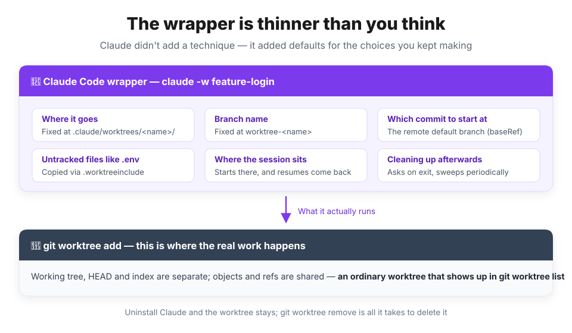
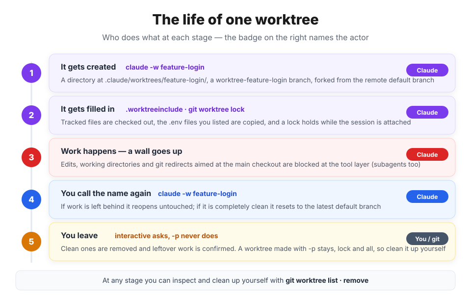
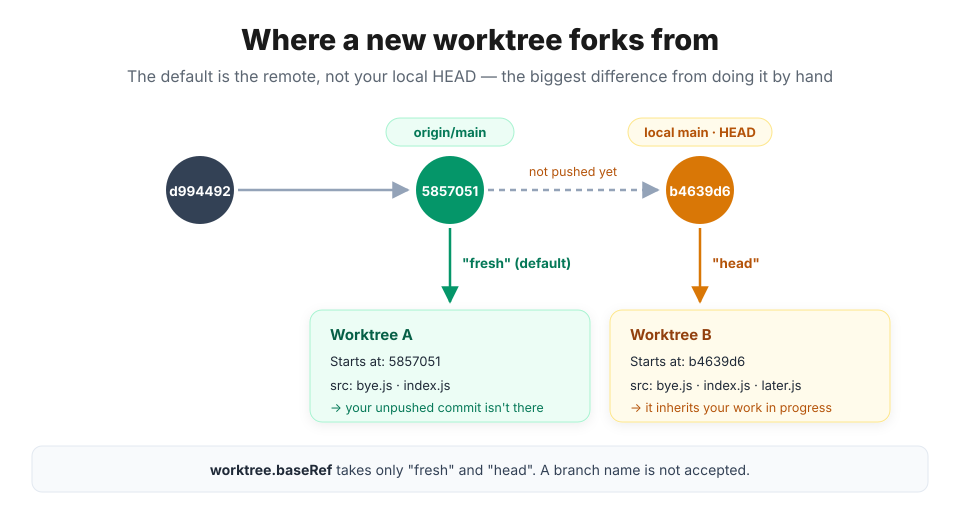

## Getting started — the desk is set up, but who sits at it?

The previous post, [git worktree: don't swap the branch, add a desk](/posts/git/worktree), covered what a worktree is and why it's so cheap. Commit data stays in one place; only the working state gets split.

In practice, though, **getting to the desk is more annoying than setting it up.**

```bash
git worktree add ../demo-login -b feature-login   # 책상 놓기 (여기까진 1초)
cd ../demo-login                                  # 옮겨 앉기
npm install                                       # 빈 책상이라 처음부터
cp ../demo/.env .                                 # 원본에서 손으로 복사
claude                                            # 그리고 다시 실행
```

You pick a path every time, you pick a branch name every time, and you always forget to delete it afterwards. Claude Code shipped a feature that collapses those five lines into one.

```bash
claude -w feature-login
```

This post is about **what that one line actually does**. What a Claude worktree really is, the lifecycle from creation to cleanup, and how it gets used in practice — all of it grounded in real output.

> 📌 **What this post is based on**
>
> Claude Code **2.1.x** (`2.1.222` at the time of writing). The worktree side has been getting refined right up to recent releases, so older versions may behave differently.
>
> The terminal output is verbatim; only the long absolute paths were shortened to `/Users/me/demo`.

> 💡 **If worktrees themselves are new to you**
>
> How commits and branches relate, what is shared and what is split inside `.git`, and why a worktree's `.git` is a text file rather than a folder — all of that is in the [previous post](/posts/git/worktree). Think of this one as its continuation.

## :claude: The wrapper is thinner than you think

What `claude -w` does is, in the end, `git worktree add`. What Claude added on top is almost entirely **defaults for the choices you kept having to make yourself.**



| The choice you kept making | By hand | `claude -w feature-login` |
| --- | --- | --- |
| Where to put it | A path you pick each time | Fixed at `.claude/worktrees/feature-login/` |
| Branch name | Picked each time | `worktree-feature-login` |
| Which commit to start at | The current `HEAD` | **The remote's default branch** (configurable) |
| Untracked files like `.env` | Copied by hand | Automatic, if listed in `.worktreeinclude` |
| Moving the session | `cd`, then relaunch `claude` | Starts there, and `--resume` walks back into that worktree |
| Cleaning up afterwards | Remember to `remove` | Asks you on the way out |

I call it a wrapper because **underneath it is just a git worktree.** No special format, no separate metadata store.

```bash
$ git worktree list
/Users/me/demo                                  5857051 [main]
/Users/me/demo/.claude/worktrees/feature-login  5857051 [worktree-feature-login] locked

$ git branch
* main
+ worktree-feature-login
```

It shows up in `git worktree list` as-is, and `git branch` marks it with `+` (checked out in another worktree) exactly as it would otherwise. Uninstall Claude and the worktree stays; `git worktree remove` deletes it.

The one unfamiliar thing is that `locked` at the end, which is a marker Claude sets. I'll get to it in the last part of the lifecycle.

## 🔄 The lifecycle — what I actually captured

This is the heart of the post. Let's follow one worktree from birth to removal.



I ran everything in a demo repository with two commits, plus one more repository acting as its remote.

```bash
$ git -C /Users/me/demo log --oneline
5857051 feat: bye 추가
d994492 feat: 첫 커밋
```

### 1. Creating a worktree

```bash
$ cd /Users/me/demo
$ claude -w feature-login
```

That one line is all it takes for a directory to appear under `.claude/worktrees/`.

```bash
$ ls -a .claude/worktrees/feature-login
.  ..  .git  .gitignore  package.json  src

$ cat .claude/worktrees/feature-login/.git
gitdir: /Users/me/demo/.git/worktrees/feature-login
```

Right down to `.git` being a one-line text file rather than a folder, it's what the previous post described. You can also drop the name and just type `claude -w`, and it will pick one for you.

```bash
$ ls .claude/worktrees
snuggly-plotting-ritchie
```

> ⚠️ **In a directory where you've never run Claude, `-w` fails**
>
> Interactive runs require workspace trust. If you have never run Claude in that directory, run `claude` once to accept the trust dialog, then use `-w`. Headless mode (`-p`) skips this check.

### 2. It's just a git worktree

The worktrees Claude creates are **plainly visible** from the main checkout. There is no hidden state.

```bash
$ ls .git/worktrees/feature-login
CLAUDE_BASE  HEAD  ORIG_HEAD  commondir  gitdir  index  locked  logs  refs
```

`HEAD`, `index`, `gitdir`, `commondir` — git creates all of those itself. Exactly two entries in that list aren't git's: `CLAUDE_BASE` and `locked`.

```bash
$ cat .git/worktrees/feature-login/CLAUDE_BASE
5857051e1990e19fc040900b5539a562da0cd2a4
```

`CLAUDE_BASE` records **which commit this worktree started from**. It becomes the reference point later, when Claude asks "is there new work at this desk?" That one line is essentially all the state the wrapper layers on top of git.

### 3. Where it forks — `fresh` versus `head`

This is **the biggest difference** from a worktree you make by hand. Given no argument, `git worktree add` forks from your current `HEAD`; Claude forks from **the remote's default branch**.

To see the difference, put your local and your remote out of sync. There is one commit (`b4639d6`) on `main` that hasn't been pushed.

```bash
$ git log --oneline -2
b4639d6 wip: 로컬에만 있는 커밋
5857051 feat: bye 추가

$ git rev-parse --short origin/main
5857051
```

Let's create a worktree from that state with no configuration and check its commit log.

```bash
$ git -C .claude/worktrees/try-default log --oneline -1
5857051 feat: bye 추가

$ ls .claude/worktrees/try-default/src
bye.js  index.js
```

No sign of local commit `b4639d6`, right? By default it followed `origin/main`, the remote's default branch. Now let's add the setting below and create the worktree again.

```json
// .claude/settings.json
{
  "worktree": {
    "baseRef": "head"
  }
}
```

Same repository, same command — and now the local commit is there in the worktree.

```bash
$ git -C .claude/worktrees/try-head log --oneline -1
b4639d6 wip: 로컬에만 있는 커밋

$ ls .claude/worktrees/try-head/src
bye.js  index.js  later.js
```



To summarize:

| `worktree.baseRef` | Where it forks from | When to use it |
| --- | --- | --- |
| `"fresh"` (default) | The remote's default branch (usually `origin/main`) | Starting a new feature or bugfix from a clean state |
| `"head"` | Your current local `HEAD` | When the work has to sit **on top of** what you're doing now |

> 💡 **A branch name is not accepted**
>
> `baseRef` takes exactly two values: `"fresh"` and `"head"`. To start from a specific branch, create the worktree with git and launch `claude` inside it.
>
> And if `baseRef` is `"fresh"` but there is no remote at all, it quietly falls back to your local `HEAD`. When a remote exists, it fetches once every 24 hours (capped at five seconds) to keep the reference current.

### 4. `.env` does not come along

A worktree is a fresh checkout, so **only files tracked by git** arrive. An `.env` caught by `.gitignore` obviously doesn't.

```bash
$ ls -a .claude/worktrees/feature-login
.  ..  .git  .gitignore  package.json  src
```

Present in the original, absent in the worktree. Put a `.worktreeinclude` at the repository root listing the files the worktree needs, and they get copied automatically.

```text
# .worktreeinclude
.env
.env.local
config/secrets.json
```

Run the same command again and you can see the worktree come up with the untracked files included.

```bash
$ ls -a .claude/worktrees/with-env
.  ..  .env  .git  .gitignore  package.json  src

$ cat .claude/worktrees/with-env/.env
API_KEY=local-secret

$ git -C .claude/worktrees/with-env status --short
```

`.env` arrived, and `git status` still prints nothing — it's a gitignored file either way.

The syntax matches `.gitignore`, and **only files that match a pattern and are also gitignored** get copied. Tracked files are already checked out, so there's nothing to duplicate.

> ⚠️ **Better not to list `node_modules` here**
>
> It will be copied if you list it, but copying tens of thousands of files into every worktree is not a good idea. Treat a new worktree as **starting from `npm install`**. Just tell Claude to install the dependencies there.

### 5. When you call the same name again

Calling `-w` with a name that already exists **reopens that worktree instead of creating a new one.** But "reopens" means one of two different things depending on the state.

**If work is left behind, it stays untouched.** I made a commit inside the worktree and called it again.

```bash
$ git -C .claude/worktrees/with-env log --oneline -1
e8f0861 feat: 워크트리에서 만든 커밋

$ claude -w with-env        # 다시 호출

$ git -C .claude/worktrees/with-env log --oneline -1
e8f0861 feat: 워크트리에서 만든 커밋
```

Unchanged. And it isn't only commits: a single uncommitted edit or untracked file is enough to leave it alone.

**If there is no work at all and it's clean, it resets to the latest remote branch.** This time I left a worktree with no work in it and pushed the default branch forward in the meantime.

```bash
$ git -C .claude/worktrees/isolation-demo log --oneline -1
5857051 feat: bye 추가                   # 워크트리에서 아무 작업도 하지 않았습니다

$ git rev-parse --short origin/main     # 그 사이 원격 기본 브랜치에 새로운 커밋이 생겼습니다
da85c39

$ claude -w isolation-demo   # 다시 호출

$ git -C .claude/worktrees/isolation-demo log --oneline -1
da85c39 feat: 기본 브랜치가 앞으로 나갔다      # 원격 기본 브랜치 최신 커밋에 맞춰서 이동했습니다

$ ls .claude/worktrees/isolation-demo/src
bye.js  index.js  upstream.js           # da85c39에서 올라온 파일이 들어와 있습니다
```

The reset happens only when **all** of the following hold. Miss one and it reopens exactly as it was.

- No modified files and no untracked files
- Still on the branch Claude created for it
- No commits of its own — or its pull request was merged and its remote branch deleted
- `baseRef` is `"fresh"`, and the name isn't a pull request number

> 💡 **Why this is convenient**
>
> If you make `claude -w review` a habit, a desk left clean after a review is automatically on the latest `main` next time you call it. Meanwhile half-finished work never gets thrown away.

### 6. It gets cleaned up on the way out — except with `-p`

That `locked` hanging off `git worktree list` earlier is this.

```bash
$ cat .git/worktrees/feature-login/locked
claude session feature-login (pid 52130 start Thu Aug  6 00:32:32 2026)
```

It's a `git worktree lock` that keeps anything else from removing the worktree while a session is attached. When you exit an interactive session normally, Claude inspects the worktree and handles it like this.

| Worktree state | On session exit |
| --- | --- |
| Clean + unnamed session | **Removes** the worktree and its branch automatically |
| Clean + named session | Asks whether to keep it |
| Has changes, untracked files, or new commits | Asks whether to keep or remove |

The problem is **`-p` (headless mode)**. There is no exit prompt at all, so nothing gets cleaned up. Worktrees made with `-p` still had their lock in place after the session ended, and trying to remove one produced the error below.

```bash
$ git worktree remove --force .claude/worktrees/snuggly-plotting-ritchie
fatal: cannot remove a locked working tree, lock reason: claude session snuggly-plotting-ritchie (pid 59595 start Thu Aug  6 00:39:27 2026)
use 'remove -f -f' to override or unlock first
```

`--force` doesn't get you past it, because `locked` isn't what `--force` deals with. Unlock, then remove.

```bash
$ git worktree unlock .claude/worktrees/snuggly-plotting-ritchie
$ git worktree remove .claude/worktrees/snuggly-plotting-ritchie
```

One more thing. **The branch is not deleted.**

```bash
$ git branch
* main
+ worktree-isolation-demo
  worktree-snuggly-plotting-ritchie
```

The missing `+` on the last line means nothing is checking it out any more, but the branch label itself is still there. Clearing it out fully takes a `git branch -D`.

## 🚧 The guardrail is sturdier than you'd expect

A session inside a worktree **cannot touch the main checkout.** I asked it to write a file at a path in the main checkout from inside a worktree, and this came back.

```text
This session is isolated in the worktree /Users/me/demo/.claude/worktrees/isolation-demo.
Edit the worktree copy of this file instead of the shared-checkout path.
```

Three things get blocked.

- **File edits** — an `Edit` or `Write` aimed at a path in the main checkout
- **A command's working directory** — a shell command whose working directory resolves into the main checkout. Commands where it **cannot verify** whether the working directory stays outside are blocked too
- **git redirects** — `git -C`, `--git-dir`, `GIT_DIR`/`GIT_WORK_TREE`, and even `cd`-ing into the main checkout before invoking git

> 💡 **Why this matters**
>
> The whole point of a worktree is that two sessions don't touch each other's files, and that's worthless if it's **a rule resting on the model's good intentions.** Because it's enforced at the tool layer, leaving two windows open and forgetting about it doesn't turn into an accident.
>
> The same checks apply to **every subagent** that session spawns.

## 🤖 Handing desks out to subagents

This is where worktrees really earn their keep. When one session runs several subagents at once, each can get its own desk.

There are two ways to ask. Either just say so,

```text
에이전트들은 워크트리를 써서 작업해줘
```

or, to isolate a particular subagent **always**, put one line in its frontmatter under `.claude/agents/`.

```markdown
---
name: refactorer
description: Applies mechanical refactors across many files
isolation: worktree
---

Apply the requested refactor across every affected file, then run the tests and report the results.
```

I asked a subagent to run `pwd` and report the output.

```text
/Users/me/demo/.claude/worktrees/agent-a45f4969146bb0e58
```

It spreads out its own desk under the same `.claude/worktrees/`, under a name starting with `agent-`. The branch is created by the same rule.

```bash
$ git worktree list
/Users/me/demo                                            b4639d6 [main]
/Users/me/demo/.claude/worktrees/agent-a45f4969146bb0e58  5857051 [worktree-agent-a45f4969146bb0e58]
/Users/me/demo/.claude/worktrees/with-env                 e8f0861 [worktree-with-env] locked
```

Only the agent worktree has no `locked`, and that's **not because it never gets one — it's because the lock is already released.** The lock is held **while the agent is running** and released once it finishes. The output above was captured after the agent had finished, which is why no lock is left.

> 💡 **Note!**
>
> So why does `with-env`, further down the listing, still say `locked`? Because that worktree was created from a `-p` session, which never got to clean up on exit. The difference between those two lines is **not `-w` versus subagent — it's whether cleanup happened.**

### Worktrees a subagent creates disappear on their own when it finishes

Subagent worktrees follow a different cleanup rule than `-w` ones. **Finish with no changes and the worktree is deleted on the spot.** Let's compare an agent that created one file with an agent that touched no files at all.

```bash
# 파일을 하나 만들고 끝낸 에이전트 → 남는다
$ git -C .claude/worktrees/agent-a45f4969146bb0e58 status --short
?? agent.txt

# pwd 만 찍고 끝낸 에이전트 → 흔적도 없다
$ ls .claude/worktrees
agent-a45f4969146bb0e58  isolation-demo  pr-1234  with-env
```

The second agent was given the worktree `agent-a18e5ca218afba02d`, and because its work finished with no changes, the worktree was deleted. It isn't in the listing at all.

**So what happens to worktrees that outlive their work?** A periodic sweep clears them. It removes anything older than your `cleanupPeriodDays` setting, but skips these:

- Worktrees with modified or untracked files, or unpushed commits
- **Worktrees you created with `-w`** — the sweep never touches these

The sweep also releases locks left behind by dead sessions. It will not, however, touch **a `git worktree lock` you set yourself.**

> 💡 **The base is the same as `-w`**
>
> Subagent worktrees honour `worktree.baseRef` too. On the default they start from the remote default branch; on `"head"` they start from your current work. **Set it to `"head"` when you're handing in-progress work out to several agents.** Leave it on the default and the agents work without ever seeing your unpushed commits.

## 🍳 Recipes in practice

### 1. I want to work on two features at once

Open two terminals on the same repository and give them different names.

```bash
# 터미널 A
claude -w feature-login

# 터미널 B
claude -w fix-header
```

Different directories, different branches. The files A touches aren't visible to B, and can't accidentally leak over either.

### 2. I'm working locally but need to review a PR

Pass the PR number with a `#` in front. **Quote it — your shell will otherwise eat the `#` as a comment.**

```bash
claude -w "#1234"
```

It fetches `pull/1234/head` from `origin` and lays it out at `.claude/worktrees/pr-1234`. Pasting the full GitHub PR URL works too.

```bash
$ git worktree list
/Users/me/demo                             b4639d6 [main]
/Users/me/demo/.claude/worktrees/pr-1234   6795641 [worktree-pr-1234] locked

$ git -C .claude/worktrees/pr-1234 log --oneline -1
6795641 fix: 남이 보낸 PR 커밋
```

You get to actually check out someone else's code, run it and review it, while your own work stays on `main`. The config files listed in `.worktreeinclude` come along too, so once you install the dependencies you can run the tests as well as read the code.

### 3. I'm mid-task and want to start another feature on top of this work

```json
// .claude/settings.json
{
  "worktree": {
    "baseRef": "head"
  }
}
```

You need this when the experiment has to sit on unpushed commits, and when you're handing work in progress out to subagents.

### 4. I want the work done on a specific branch

The `baseRef` setting can't do it, so create it with git and go in.

```bash
git worktree add ../project-bugfix fix-issue-456
cd ../project-bugfix
claude
```

Claude **doesn't count a worktree made this way as its own.** It won't ask about it on exit and won't clean it up, so tidying up is on you.

### 5. I want to move into a worktree mid-session

You don't have to pass `-w` at launch. Partway through, just say:

```text
이건 워크트리에서 하자
```

It creates one with `EnterWorktree` and moves over. `ExitWorktree` is how you come back, and resuming the session **puts you back inside that worktree** — interactively or with `-p --resume` alike.

> ⚠️ **Going outside `.claude/worktrees/` prompts you every time**
>
> Moving to such a path takes the session's working directory, write access, and project configuration like `CLAUDE.md` along with it. Neither a permission rule nor clicking "don't ask again" suppresses that confirmation.

### 6. Hiding the worktree directory

The worktree lives **inside** the repository, so without an ignore rule it keeps showing up as untracked files in the main checkout.

```text
# .gitignore
.claude/worktrees/
```

To hide it only on your machine, put the same line in `.git/info/exclude`.

### 7. Clearing out leftover worktrees

```bash
git worktree list                                    # 뭐가 남았나
git worktree unlock  .claude/worktrees/<이름>         # lock 이 남아 있으면
git worktree remove  .claude/worktrees/<이름>         # 깨끗할 때
git worktree remove --force .claude/worktrees/<이름>  # 변경·미추적 파일이 있을 때
git branch -D worktree-<이름>                         # 브랜치는 따로 지워야 한다
```

### Cheat sheet

| What you want | What to use |
| --- | --- |
| Start an isolated session | `claude -w <name>` |
| Any name will do | `claude -w` |
| Review a PR | `claude -w "#1234"` |
| On top of current work | `worktree.baseRef: "head"` |
| From a specific branch | `git worktree add`, then `claude` inside it |
| Copy `.env` automatically | `.worktreeinclude` at the root |
| Isolate subagents | "use worktrees" or `isolation: worktree` in frontmatter |
| Move over mid-session | "let's do this in a worktree" (`EnterWorktree`) |
| List and clean up | `git worktree list` · `remove` · `branch -D` |

## ⚠️ Traps I walked into

1. **One `git add -A` drags the whole worktree in.** I typed it absent-mindedly in the main checkout with no ignore rule in place, and got this.

```text
warning: adding embedded git repository: .claude/worktrees/with-env
hint: You've added another git repository inside your current repository.
hint: Clones of the outer repository will not contain the contents of
hint: the embedded repository and will not know how to obtain it.
```

What makes it nastier is that the files aren't copied — **only an empty shell (a gitlink) gets committed.** Anyone who clones the repository sees an empty folder forever.

```text
# .gitignore
.claude/worktrees/
```

Don't forget this setting.

2. **A dev server that claims one port can't run in two or more worktrees.** This blog pins its dev server to `localhost:4321`, and starting it in two worktrees at once pushes the second one to a different port or just fails. The files are split, but **single-machine resources like ports, databases and cache directories are still singular.**

3. **Nobody cleans up a worktree made with `-p`.** Run `-p --worktree` from a script or CI and there's no exit prompt, so the worktree and its lock both stay. The periodic sweep won't touch anything made with `-w` either, so **whoever creates it owns deleting it.**

4. **If `.claude` is a symlink, worktree creation is refused outright.** This catches setups that manage dotfiles as links. If `.claude`, `.claude/worktrees`, or the worktree directory itself is a symlink, it stops and names the path. There's no way around it other than removing the link and retrying.

5. **Don't run `claude --resume` from inside a worktree.** Resume from **the main checkout**. Launched from inside, Claude says it can't vouch for that directory and either continues without isolation or stops outright. Leave the worktree alone and resume from the main checkout, and it walks back in on its own.

## 🎯 In one sentence

`claude -w` isn't a new isolation technology — it's **the removal of the manual steps that always followed `git worktree add`.**
- It fixes the path and branch name by convention,
- changes the starting point to the remote,
- carries `.env` over,
- pins the session in place,
- and asks on the way out whether to clean the worktree up.

Peel it back and it's an ordinary worktree that shows up in `git worktree list`, so a git command can always undo it.

## 📚 References
- [Claude Code docs: Run parallel sessions with worktrees](https://code.claude.com/docs/en/worktrees)
- [Claude Code docs: Subagents](https://code.claude.com/docs/en/sub-agents)
- [git worktree documentation](https://git-scm.com/docs/git-worktree)
- [git worktree: don't swap the branch, add a desk](/posts/git/worktree)
