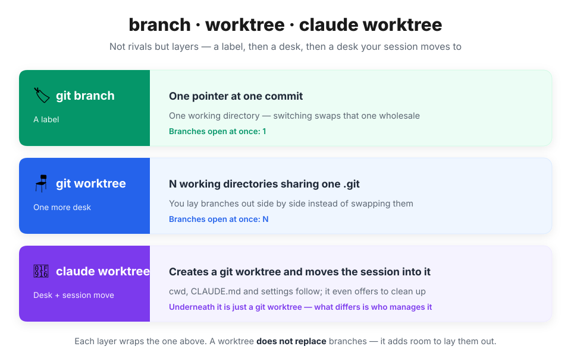
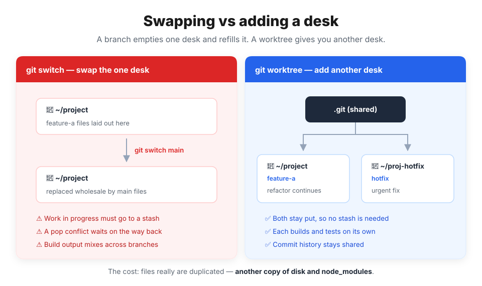
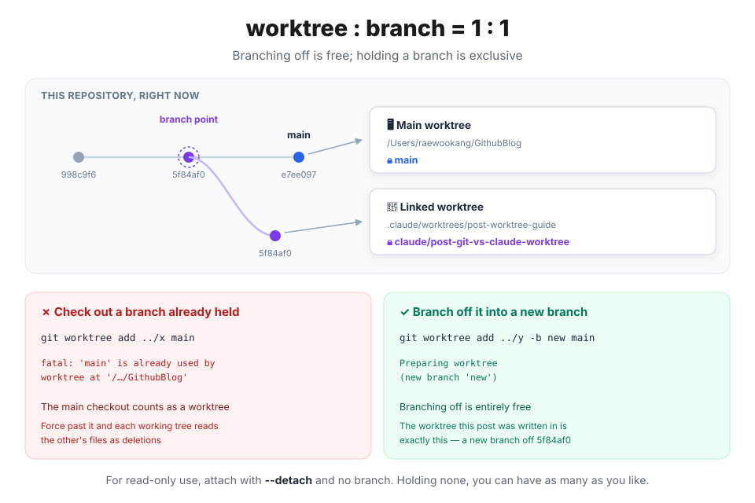
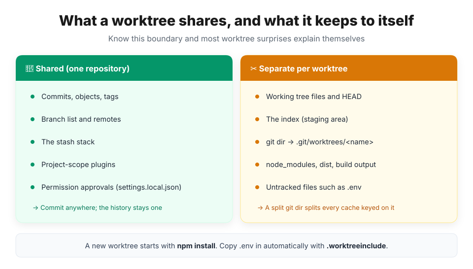

## Getting started — "hang on, let me just stash this"

An urgent fix comes in. Your current branch is covered in half-written code. The familiar ritual begins.

```bash
git stash
git switch main
# ... fix it, commit, push
git switch feature-a
git stash pop   # and then, conflicts
```

Branches did nothing wrong here. The real cause is elsewhere — you have **only one working directory**. With one desk, you have to clear the current job away to lay out the next one. `stash` is a tool for clearing the desk, not for adding one.

`git worktree` is what adds a desk, and Claude Code lays one thin layer on top of it. This post maps how the three relate, briefly, and then spends the rest of its space on **how you actually use them**.

> 📌 The commands and settings here follow Claude Code v2.1.x. `git worktree` itself has been around since git 2.5, so there's no version to worry about there.

## 🧩 They aren't the same layer

The most common misreading is **"which of the three should I use?"** You don't pick one. They **stack**.

- **`git branch`** — a label pointing at a commit. It really is one 40-byte file holding a commit hash (`.git/refs/heads/…`), so creating and deleting one costs essentially nothing.
- **`git worktree`** — it adds **somewhere to lay that label out**. There's still one `.git`; only the working directories multiply.
- **claude worktree** — it creates a worktree and then **moves the Claude session inside it.** Underneath it's still a `git worktree`; what differs is who manages it.

| | `git branch` | `git worktree` | claude worktree |
| --- | --- | --- | --- |
| What it is | A commit pointer | An extra working directory | A git worktree under `.claude/worktrees/` |
| Working directories | 1 (shared) | N | N |
| Open at the same time | ✗ switching only | ✓ | ✓ |
| Cost to switch | Swapping every file | `cd` | A tool call (session context moves too) |
| Disk | Near zero | One more working tree | One more working tree |
| `node_modules` | Stays put | Separate per worktree | Separate per worktree |
| Branch creation | Manual | Manual (`-b`) | Automatic |
| Cleanup | — | Manual `remove` / `prune` | Prompt on exit + periodic sweep |



The difference folds into one line. `git switch` **empties the desk and refills it**; `git worktree` **puts another desk next to it.**

## 🔒 worktree : branch = 1 : 1

A worktree doesn't replace branches. **Each worktree needs a branch of its own, and a branch can be checked out in exactly one worktree.** [git-worktree(1)](https://git-scm.com/docs/git-worktree) states the rule outright.

> If the branch already exists, it gets checked out in the new worktree — but **only if it isn't checked out anywhere else.** Otherwise **the command itself is refused** (unless you pass `--force`).



### The main checkout counts as a worktree

This is where people trip. The git docs define a repository as **one main worktree plus zero or more linked worktrees**. The folder you normally work in is a worktree too. Which means **you cannot create a new worktree on the branch you currently have checked out.**

```bash
$ git worktree add ../x main
fatal: 'main' is already used by worktree at '/Users/raewookang/GithubBlog'
```

**Branching off that same branch**, on the other hand, is entirely unrestricted.

```bash
$ git worktree add ../y -b new main
Preparing worktree (new branch 'new')
```

**Holding is exclusive, branching is free** — keep those two apart and none of this is confusing. A branch someone else (or another session) is holding is still a perfectly good base for your own work.

### What forcing past it actually does

The guard can be overridden with `--force`. I tried it to see what happens. With worktrees A and B on the same branch, I created one file **in A only** and committed it.

```text
[A]  created only-in-a.txt → commit efade04

[B]  ← untouched, and yet
  $ git log --oneline -1
  efade04 commit made in A        ← HEAD dragged along

  $ git status --short
  D  only-in-a.txt                ← a deletion, already staged
```

There's one branch ref in the repository, so A's commit moves it, and B's HEAD — pointing at the same branch — is dragged along. But **B's working tree and index are its own**, and that file isn't in them. To git, "in HEAD but not in the working tree" means **deleted**. Commit absent-mindedly from B and **a commit erasing A's work** lands on the branch.

> ⚠️ The most dangerous part of all is that **nothing conflicts.** No warning, no merge markers, it just goes through. And since pushing works per branch, pushing from B carries **A's commits along with it.** There's no way to split a push per worktree — the unit of separation is the branch, not the worktree.

### Moving work between worktrees

Worktrees share the object database, so **no remote and no network are involved.** Plain git does it.

```bash
git cherry-pick <commit-from-there>   # just one commit
git merge tmp/branch-a                # all of it
git rebase tmp/branch-a               # replay on top
```

### The exception — `--detach`

Hold no branch and the guard has nothing to catch. You can attach as many worktrees to the same commit as you like.

```bash
git worktree add --detach ../wt-readonly HEAD
```

That suits read-only jobs — verifying a build, reading code — **anything with no commits in it.** Commit there and it dangles off no branch at all, so keep it read-only if you use it.

## 🪑 What's shared and what isn't

Almost every worktree surprise is explained by this one boundary.



The shared side is intuitive. One repository means one set of commits and one set of branches. **Commit from any worktree and the history stays a single strand.** On the Claude Code side, project-scope plugins and permission approvals come along too — you don't re-approve "allow this command" in every worktree.

The confusing side is what's separate. The working tree and index splitting is obvious enough, but **the git dir splits as well.** If the main checkout's git dir is `.git`, a linked worktree's is `.git/worktrees/<name>`. See for yourself:

```bash
# in the main checkout
$ git rev-parse --absolute-git-dir
/Users/me/project/.git

# inside the worktree
$ git rev-parse --absolute-git-dir
/Users/me/project/.git/worktrees/my-task
```

Different values mean that **any tool keyed on the git dir path keeps separate state per worktree**. That feeds directly into one of the traps below.

> 💡 **If you were caught out by a missing `.env`** — a worktree checks out tracked files only. Put a `.worktreeinclude` in your project root and Claude Code copies gitignored files into the worktrees it creates. It uses `.gitignore` syntax, and **only files that match a pattern and are actually gitignored** get copied, so tracked files are never duplicated.
>
> ```text
> .env
> .env.local
> config/secrets.json
> ```

## 🤖 claude worktree — the worktree your session moves into

As said, underneath it's just a `git worktree`. The layer on top is two things: **the session follows**, and **cleanup is handled for you**.

### Three ways in

1. **Starting from the terminal** — `claude --worktree feature-auth` (`-w` for short). It creates the worktree at `.claude/worktrees/feature-auth/` and starts the session on a `worktree-feature-auth` branch. Omit the name and it invents one like `bright-running-fox`.
2. **Mid-session** — say "work in a worktree" and Claude creates one with the `EnterWorktree` tool and moves there. `ExitWorktree` takes you back out, and on the way out you choose whether to keep it or delete it.
3. **Straight from a PR** — `claude --worktree "#1234"`. It fetches `pull/1234/head` from `origin` and places the worktree at `.claude/worktrees/pr-1234`. The **quotes are mandatory** so your shell doesn't read `#` as a comment.

### Where it branches from — this is the usual stumble

The default is **not your current branch.**

| `worktree.baseRef` | Branches from | When to use it |
| --- | --- | --- |
| `"fresh"` (default) | The remote's default branch, usually `origin/main` | Starting a new feature from a clean tree |
| `"head"` | Your current local `HEAD` | Continuing **on top of what you're doing now** |

```json
{
  "worktree": {
    "baseRef": "head"
  }
}
```

`"head"` carries your unpushed commits and feature-branch state along. That's the value you need when subagents have to operate on work in progress.

> ⚠️ **You can't put a branch name in `baseRef`.** The only values are `"fresh"` and `"head"`, so starting from a specific branch means creating the worktree with git yourself (recipe 4 below).

### Subagents can be isolated too

When several agents edit **the same files at once**, giving each one a worktree makes the conflicts disappear. For a custom subagent it's one line of frontmatter.

```markdown
---
name: refactorer
description: Applies mechanical refactors across many files
isolation: worktree
---

Apply the requested refactor across every affected file, then run the tests
and report the results.
```

Each worktree carries a setup cost, though, so **there's no reason to isolate work that doesn't overlap on files.** Subagent worktrees follow the same base as `--worktree`, so running them on work in progress means setting `baseRef` to `"head"`.

### Cleanup

- On exiting an interactive session, Claude inspects the worktree. **If it's clean**, an unnamed session's worktree is removed automatically; **if work is left in it**, you're asked whether to keep or remove it.
- Non-interactive `-p` runs have no exit prompt and therefore no cleanup. Remove those with `git worktree remove`.
- Subagent and background-session worktrees are swept periodically once they're older than `cleanupPeriodDays`. The sweep **skips anything holding uncommitted changes or unpushed commits**, and it never touches worktrees you made with `--worktree`.

## ⚙️ Recipes

**1. Open a hotfix desk without disturbing what you're doing**

```bash
git worktree add ../project-hotfix -b hotfix/login
cd ../project-hotfix
```

**2. Lay out a branch that already exists** — handy for review and comparison.

```bash
git worktree add ../project-review fix-issue-456
```

**3. List and clean up**

```bash
git worktree list
git worktree remove ../project-hotfix
git worktree remove --force ../project-hotfix   # when uncommitted changes remain
git worktree prune                              # tidy the registry after deleting a directory by hand
```

**4. A Claude worktree branched off your current branch** — when you'd rather not touch settings, or need the base pinned exactly, create it with git first and then enter that path.

```bash
git worktree add .claude/worktrees/my-task -b my-branch HEAD
```

Then tell Claude "enter this worktree" and `EnterWorktree` takes the path and moves the session. **This post was written exactly that way** — another session was working in the same repository at the time.

**5. Hide the worktree directory**

```bash
echo ".claude/worktrees/" >> .gitignore    # shared with the team
echo ".claude/worktrees/" >> .git/info/exclude   # just you, no commit
```

## 🧭 Which one, when

| Situation | Reach for |
| --- | --- |
| One thing at a time, in order | `git branch` is enough |
| An urgent hotfix lands mid-task | `git worktree` |
| Comparing two branches side by side | `git worktree` |
| Coding on while a long build runs | `git worktree` |
| Handing a big refactor to Claude while protecting your branch | claude worktree |
| Several agents editing the same files in parallel | Subagent `isolation: worktree` |
| Another session is working in the same repository | claude worktree |

The most common misuse is **reaching for a worktree where a branch would do**. If the work is sequential, one branch is the right answer. A worktree trades disk and `npm install` time for **concurrency** — and with nothing to run concurrently, you pay the price and get nothing.

The other direction: telling Claude "make a branch and work there" is just `git switch -c`. The worktree tooling only engages when **"worktree" is said explicitly**, so you have to use the word if you want it.

## ⚠️ Traps I walked into

> ⚠️ **A dev server pinned to one port can't run in two worktrees.** On this blog, `npm run dev` always uses `localhost:4321` by design. That means however many worktrees are open, there's one dev server at a time. It beats letting the port wander — that's what saves a human and Claude from staring at different addresses insisting "the page isn't updating."

> ⚠️ **Tools that cache against the git dir start from scratch in every worktree.** This blog's ko/en drift check stores its verdict in `<git-dir>/ko-en-drift.json`. As shown above, a worktree's git dir is `.git/worktrees/<name>`, so **the cache starts empty.** Posts that already passed get re-checked by the LLM, and those calls cost money. Worth knowing in advance if you create worktrees often.

> ⚠️ **An unignored worktree directory can get committed wholesale.** The moment a worktree lives inside the repository (`.claude/worktrees/` does), its contents show up as untracked files in the main checkout. An absent-minded `git add -A` sweeps the entire copy into the repository. Check the ignore rules **before** you create it.

> ⚠️ **Building one by hand when a native tool exists leaves phantom state.** If Claude Code manages placement, branching and cleanup through `EnterWorktree`, a worktree you created on the side with `git worktree add` is invisible to the harness. No exit prompt, no automatic sweep — you clean it up yourself. Better to do what recipe 4 does: **create it yourself, then enter it with `EnterWorktree`** so the session knows about it.

> ⚠️ **The stash stack is shared.** Worktrees split your files, but stashes pile up in the one repository. Working in several worktrees at once and reaching for `git stash pop` can **pop another worktree's stash.** Safer to label them (`git stash push -m …`) and check what you're pulling out.

## Wrapping up

Folded into one sentence: **a branch is a label, a worktree is a desk to lay that label out on, and a claude worktree seats Claude at that desk too.** The question isn't which of the three to pick — it's only ever **do I have two things to do at once?** If not, one branch is plenty. If so, that's when you add a desk.

## 📚 References

- [Run parallel sessions with worktrees — Claude Code docs](https://code.claude.com/docs/en/worktrees)
- [git-worktree — Git documentation](https://git-scm.com/docs/git-worktree)
- [git-branch — Git documentation](https://git-scm.com/docs/git-branch)
- [Subagents — supported frontmatter fields](https://code.claude.com/docs/en/sub-agents)
- [Settings — worktree settings](https://code.claude.com/docs/en/settings)
- [Tools reference — EnterWorktree and ExitWorktree](https://code.claude.com/docs/en/tools-reference)
- [Hook: Enforcing Rules on Every Event](/posts/claude/hook)
- [Automation: Hook, /loop, routine — series overview](/posts/claude/intro-automation-hook-loop-routine)
