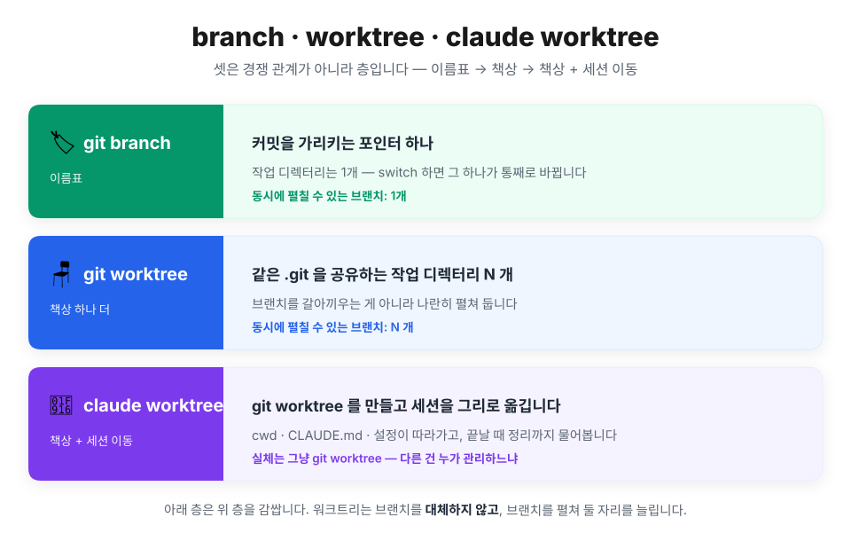
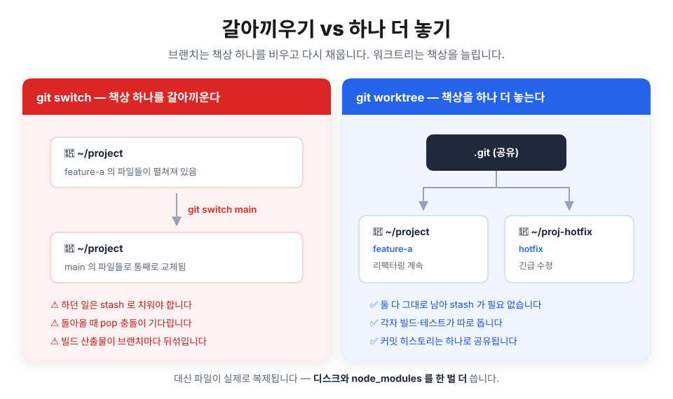
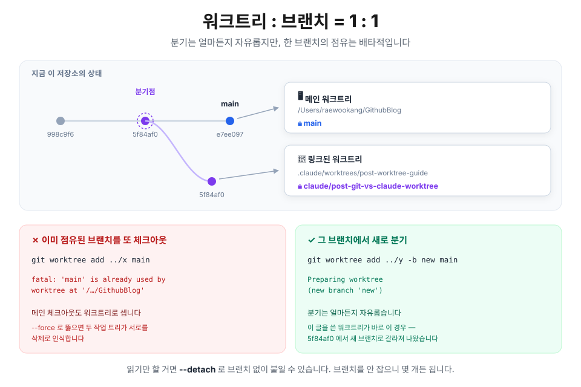
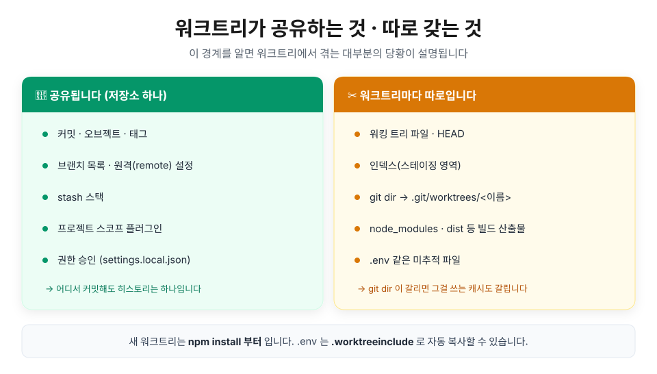

## 들어가며 — "잠깐만요, 이것만 stash 하고요"

급한 수정 요청이 왔습니다. 그런데 지금 브랜치에는 반쯤 짜다 만 코드가 널려 있습니다. 익숙한 순서가 시작됩니다.

```bash
git stash
git switch main
# ... 고치고, 커밋하고, 푸시하고
git switch feature-a
git stash pop   # 그리고 충돌
```

브랜치가 잘못한 건 없습니다. 진짜 원인은 따로 있습니다 — **작업 디렉터리가 하나뿐**이라는 것. 책상이 하나면 다음 일을 펼치려고 하던 일을 치워야 합니다. `stash`는 치우는 도구지, 책상을 늘리는 도구가 아닙니다.

책상을 늘려주는 게 `git worktree`이고, Claude Code는 그 위에 얇은 층을 하나 더 얹었습니다. 이 글은 셋의 관계를 짧게 정리한 뒤, 나머지 지면을 **실제로 어떻게 쓰는지**에 씁니다.

> 📌 명령·설정은 Claude Code v2.1.x 기준입니다. `git worktree` 자체는 git 2.5부터 있는 오래된 기능이라 버전 걱정은 안 하셔도 됩니다.

## 🧩 셋은 같은 계층이 아닙니다

가장 흔한 오해가 **"셋 중에 뭘 쓸까?"** 입니다. 셋은 고르는 게 아니라 **쌓이는** 것입니다.

- **`git branch`** — 커밋을 가리키는 이름표입니다. 실체는 커밋 해시가 든 40바이트짜리 파일 하나(`.git/refs/heads/…`)라, 만들고 지우는 비용이 사실상 0입니다.
- **`git worktree`** — 그 이름표를 **펼쳐 둘 자리**를 늘립니다. `.git`은 여전히 하나인데 작업 디렉터리만 여러 개가 됩니다.
- **claude worktree** — 워크트리를 만든 뒤 **Claude 세션을 그 안으로 옮깁니다.** 실체는 여전히 `git worktree`고, 다른 건 누가 관리하느냐입니다.

| | `git branch` | `git worktree` | claude worktree |
| --- | --- | --- | --- |
| 실체 | 커밋 포인터 | 추가 작업 디렉터리 | `.claude/worktrees/` 아래의 git 워크트리 |
| 작업 디렉터리 | 1개(공유) | N개 | N개 |
| 동시에 열 수 있나 | ✗ 전환만 | ✓ | ✓ |
| 전환 비용 | 파일 갈아끼우기 | `cd` | 도구 호출(세션 컨텍스트까지 이동) |
| 디스크 | 거의 0 | 워킹 트리 한 벌 | 워킹 트리 한 벌 |
| `node_modules` | 그대로 남음 | 워크트리마다 따로 | 워크트리마다 따로 |
| 브랜치 생성 | 직접 | 직접(`-b`) | 자동 |
| 뒷정리 | — | 직접 `remove`·`prune` | 종료 시 안내 + 주기적 청소 |



차이는 한 줄로 접힙니다. `git switch`는 **책상을 비우고 다시 채우고**, `git worktree`는 **책상을 하나 더 놓습니다.**

## 🔒 워크트리 : 브랜치 = 1 : 1

워크트리는 브랜치를 대체하지 않습니다. **워크트리마다 브랜치가 하나씩 필요하고, 한 브랜치는 한 워크트리에만 체크아웃됩니다.** [git-worktree(1)](https://git-scm.com/docs/git-worktree)이 직접 못박은 규칙입니다.

> 브랜치가 이미 있으면 새 워크트리에 체크아웃되는데 — **"다른 곳에 체크아웃돼 있지 않을 때만"** 그렇습니다. 아니면 **명령 자체가 거부됩니다**(`--force`를 쓰지 않는 한).



### 메인 체크아웃도 워크트리로 셉니다

여기서 많이들 걸립니다. git 문서는 저장소를 **"메인 워크트리 하나 + 링크된 워크트리 0개 이상"** 으로 정의합니다. 평소 작업하던 그 폴더도 워크트리라는 뜻이죠. 그래서 **지금 체크아웃해 둔 브랜치로는 새 워크트리를 만들 수 없습니다.**

```bash
$ git worktree add ../x main
fatal: 'main' is already used by worktree at '/Users/raewookang/GithubBlog'
```

반면 **그 브랜치에서 갈라져 나오는 것**은 아무 제약이 없습니다.

```bash
$ git worktree add ../y -b new main
Preparing worktree (new branch 'new')
```

**점유는 배타적, 분기는 자유** — 이 둘만 구분하면 헷갈릴 일이 없습니다. 어떤 브랜치를 동료가(혹은 다른 세션이) 잡고 있어도, 그 브랜치를 기반으로 한 내 작업은 얼마든지 시작할 수 있습니다.

### `--force`로 뚫으면 벌어지는 일

가드는 `--force`로 넘길 수 있습니다. 넘기면 어떻게 되는지 직접 해봤습니다. 워크트리 A와 B를 같은 브랜치에 올려두고 **A에서만** 파일 하나를 만들어 커밋했습니다.

```text
[A]  only-in-a.txt 생성 → commit efade04

[B]  ← 손도 안 댔는데
  $ git log --oneline -1
  efade04 A 에서 만든 커밋        ← HEAD 가 따라 움직임

  $ git status --short
  D  only-in-a.txt                ← "삭제됨"이 스테이징까지 된 상태
```

브랜치 ref는 저장소에 하나뿐이라 A의 커밋이 그 ref를 옮기고, 같은 브랜치를 보던 B의 HEAD도 끌려갑니다. 그런데 **B의 워킹 트리와 인덱스는 따로**라 그 파일이 없죠. git 입장에선 "HEAD엔 있는데 작업 트리엔 없다" = **삭제**입니다. 이 상태로 B가 무심코 커밋하면 **A의 작업을 지우는 커밋**이 브랜치에 올라갑니다.

> ⚠️ 제일 위험한 건 **충돌이 나지 않는다**는 점입니다. 경고도 병합 충돌 표시도 없이 조용히 지나갑니다. 게다가 push는 브랜치 단위라, B에서 밀어도 **A의 커밋까지 전부** 올라갑니다. 워크트리별로 push를 나눌 방법은 없습니다 — 분리 단위는 워크트리가 아니라 브랜치니까요.

### 작업물을 옮기고 싶다면

워크트리끼리는 오브젝트 DB를 공유하니 **원격도 네트워크도 필요 없습니다.** 평범한 git으로 옮기면 됩니다.

```bash
git cherry-pick <저쪽_커밋>   # 커밋 하나만 가져오기
git merge tmp/branch-a        # 통째로 합치기
git rebase tmp/branch-a       # 위에 얹기
```

### 예외 — `--detach`

브랜치를 안 잡으면 가드도 안 걸립니다. 같은 커밋에 워크트리를 몇 개든 붙일 수 있습니다.

```bash
git worktree add --detach ../wt-readonly HEAD
```

빌드 검증이나 코드 열람처럼 **커밋할 일이 없는 용도**에 맞습니다. 커밋하면 어느 브랜치에도 안 달린 채 떠돌게 되니, 쓸 거라면 읽기 전용으로 두는 게 좋습니다.

## 🪑 무엇이 공유되고 무엇이 따로인가

워크트리에서 겪는 당황의 대부분은 이 경계선 하나로 설명됩니다.



공유되는 쪽은 직관적입니다. 저장소가 하나니까 커밋도 브랜치도 하나로 보입니다. **어느 워크트리에서 커밋하든 히스토리는 한 줄기입니다.** Claude Code 쪽에서도 프로젝트 스코프 플러그인과 권한 승인이 함께 따라옵니다 — 워크트리마다 "이 명령 허용" 을 다시 누를 필요가 없습니다.

헷갈리는 건 따로인 쪽입니다. 워킹 트리와 인덱스가 갈리는 건 당연한데, **git dir까지 갈립니다.** 메인 체크아웃의 git dir이 `.git`이라면 링크된 워크트리는 `.git/worktrees/<이름>`입니다. 직접 확인해보면 이렇습니다.

```bash
# 메인 체크아웃에서
$ git rev-parse --absolute-git-dir
/Users/me/project/.git

# 워크트리 안에서
$ git rev-parse --absolute-git-dir
/Users/me/project/.git/worktrees/my-task
```

값이 다르다는 건, **git dir 경로를 기준으로 뭔가를 저장하는 도구는 워크트리마다 따로 논다는 뜻**입니다. 이게 뒤에 나올 함정 하나로 이어집니다.

> 💡 **`.env`가 안 따라와서 당황했다면** — 워크트리는 추적되는 파일만 체크아웃합니다. 프로젝트 루트에 `.worktreeinclude`를 두면 Claude Code가 만드는 워크트리로 gitignore된 파일을 자동 복사해줍니다. `.gitignore` 문법을 쓰고, **패턴에 맞으면서 실제로 gitignore된 파일만** 복사되니 추적 파일이 중복될 걱정은 없습니다.
>
> ```text
> .env
> .env.local
> config/secrets.json
> ```

## 🤖 claude worktree — 세션까지 같이 옮겨주는 워크트리

앞서 말했듯 실체는 그냥 `git worktree`입니다. 얹힌 층은 **"세션이 따라간다"** 와 **"뒷정리를 알아서 챙긴다"** 둘입니다.

### 세 가지 진입로

1. **터미널에서 시작할 때** — `claude --worktree feature-auth` (짧게 `-w`). `.claude/worktrees/feature-auth/`에 워크트리를 만들고 `worktree-feature-auth` 브랜치로 세션을 띄웁니다. 이름을 빼면 `bright-running-fox` 같은 걸 알아서 지어줍니다.
2. **세션 중간에** — "워크트리에서 작업해줘"라고 하면 Claude가 `EnterWorktree` 도구로 만들고 그리로 옮겨갑니다. 나올 때는 `ExitWorktree`고, 나가면서 남길지 지울지 고릅니다.
3. **PR에서 바로** — `claude --worktree "#1234"`. `origin`에서 `pull/1234/head`를 받아 `.claude/worktrees/pr-1234`에 놓습니다. 셸이 `#`을 주석으로 먹지 않게 **따옴표는 필수**입니다.

### 어디서 분기하나 — 여기가 제일 자주 헷갈립니다

기본값은 **현재 브랜치가 아닙니다.**

| `worktree.baseRef` | 분기 지점 | 언제 쓰나 |
| --- | --- | --- |
| `"fresh"` (기본) | 원격의 기본 브랜치, 보통 `origin/main` | 깨끗한 상태에서 새 기능을 시작할 때 |
| `"head"` | 현재 로컬 `HEAD` | **지금 하던 작업 위에서** 이어갈 때 |

```json
{
  "worktree": {
    "baseRef": "head"
  }
}
```

`"head"`는 푸시 안 한 커밋과 피처 브랜치 상태를 그대로 들고 갑니다. 진행 중인 작업 위에서 서브에이전트를 굴려야 할 때 이 값이 필요합니다.

> ⚠️ `baseRef`에 **브랜치 이름은 못 넣습니다.** 값은 `"fresh"`와 `"head"` 둘뿐이라, 특정 브랜치에서 시작하려면 git으로 직접 만들어야 합니다(아래 레시피 4번).

### 서브에이전트도 격리할 수 있습니다

여러 에이전트가 **같은 파일을 동시에 고칠 때**, 각자에게 워크트리를 주면 충돌이 사라집니다. 커스텀 서브에이전트라면 frontmatter에 한 줄이면 됩니다.

```markdown
---
name: refactorer
description: Applies mechanical refactors across many files
isolation: worktree
---

Apply the requested refactor across every affected file, then run the tests
and report the results.
```

다만 워크트리 하나당 준비 비용이 붙으니, **파일이 겹치지 않는 작업까지 격리할 이유는 없습니다.** 서브에이전트 워크트리도 `--worktree`와 같은 base를 따르므로, 진행 중인 작업 위에서 돌리려면 `baseRef`를 `"head"`로 둬야 합니다.

### 뒷정리

- 대화형 세션을 끝낼 때 Claude가 워크트리를 살펴봅니다. **깨끗하면** 이름 없는 세션의 워크트리는 알아서 지우고, **작업이 남아 있으면** 남길지 지울지 물어봅니다.
- `-p` 비대화형 실행은 종료 프롬프트가 없어서 정리도 안 합니다. `git worktree remove`로 직접 지웁니다.
- 서브에이전트·백그라운드 세션 워크트리는 `cleanupPeriodDays`가 지나면 주기적으로 쓸려나갑니다. 단 **미커밋 변경이나 안 푸시한 커밋이 있으면 건너뜁니다.** `--worktree`로 직접 만든 건 이 청소 대상이 아닙니다.

## ⚙️ 실전 레시피

**1. 지금 하던 일을 그대로 두고 핫픽스 책상 하나 열기**

```bash
git worktree add ../project-hotfix -b hotfix/login
cd ../project-hotfix
```

**2. 이미 있는 브랜치를 펼쳐 보기** — 리뷰나 비교용으로 자주 씁니다.

```bash
git worktree add ../project-review fix-issue-456
```

**3. 목록 확인과 정리**

```bash
git worktree list
git worktree remove ../project-hotfix
git worktree remove --force ../project-hotfix   # 미커밋 변경이 남아 있을 때
git worktree prune                              # 디렉터리를 손으로 지운 뒤 등록부 청소
```

**4. 현재 브랜치에서 분기하는 Claude 워크트리** — 설정을 건드리기 싫거나 base를 정확히 지정하고 싶으면, git으로 먼저 만들고 그 경로로 들어가면 됩니다.

```bash
git worktree add .claude/worktrees/my-task -b my-branch HEAD
```

그다음 Claude에게 "이 워크트리로 들어가줘"라고 하면 `EnterWorktree`가 그 경로를 받아 세션을 옮깁니다. **이 글도 정확히 그렇게 썼습니다** — 다른 세션이 같은 저장소에서 작업 중이었거든요.

**5. 워크트리 디렉터리 숨기기**

```bash
echo ".claude/worktrees/" >> .gitignore    # 팀과 공유
echo ".claude/worktrees/" >> .git/info/exclude   # 나만, 커밋 없이
```

## 🧭 언제 무엇을 쓰나

| 상황 | 쓸 것 |
| --- | --- |
| 한 번에 한 가지 일을 순서대로 | `git branch`만으로 충분 |
| 작업 중 급한 핫픽스가 들어옴 | `git worktree` |
| 두 브랜치를 나란히 띄워 비교 | `git worktree` |
| 긴 빌드가 도는 동안 계속 코딩 | `git worktree` |
| 큰 리팩터링을 Claude에게 맡기되 현재 브랜치는 보호 | claude worktree |
| 여러 에이전트가 같은 파일을 병렬로 수정 | 서브에이전트 `isolation: worktree` |
| 다른 세션이 같은 저장소에서 작업 중 | claude worktree |

가장 흔한 오용은 **워크트리를 브랜치 대신 쓰는 것**입니다. 순서대로 한 가지씩 하는 작업이라면 브랜치 하나가 정답입니다. 워크트리는 디스크와 `npm install` 시간을 대가로 **동시성**을 사는 거래인데, 동시에 할 일이 없으면 대가만 치르는 셈입니다.

반대로 Claude에게 "브랜치 만들어서 작업해줘"라고 하면 그건 그냥 `git switch -c`입니다. 워크트리 도구는 **"워크트리"라고 명시했을 때만** 동작하게 되어 있어서, 원하면 그 단어를 넣어야 합니다.

## ⚠️ 밟아본 함정

> ⚠️ **포트를 하나만 쓰는 dev 서버는 워크트리 둘에서 못 띄웁니다.** 이 블로그는 `npm run dev`가 항상 `localhost:4321`을 쓰도록 고정해두었습니다. 워크트리를 여러 개 열어도 dev 서버는 한 번에 하나뿐이라는 뜻입니다. 포트를 옮겨다니게 두는 것보다 낫습니다 — 사람과 Claude가 서로 다른 주소를 보며 "화면이 안 바뀐다"고 헤매는 사고를 막아주거든요.

> ⚠️ **git dir을 기준으로 캐시하는 도구는 워크트리마다 처음부터 시작합니다.** 이 블로그의 ko/en drift 검사는 판정 결과를 `<git-dir>/ko-en-drift.json`에 저장합니다. 앞에서 봤듯 워크트리의 git dir은 `.git/worktrees/<이름>`이라 **캐시가 빈 상태로 출발합니다.** 이미 통과했던 글도 LLM 검사를 다시 돌게 되고, 그 호출은 유료입니다. 워크트리를 자주 만들 계획이라면 미리 알고 있는 게 좋습니다.

> ⚠️ **워크트리 디렉터리를 ignore 하지 않으면 트리째 커밋될 수 있습니다.** 저장소 안에 워크트리를 두는 순간(`.claude/worktrees/`가 그렇습니다) 그 내용이 메인 체크아웃의 untracked 파일로 보입니다. 무심코 `git add -A` 하면 워크트리 사본이 통째로 저장소에 들어갑니다. 만들기 **전에** ignore부터 확인하세요.

> ⚠️ **네이티브 도구가 있는데 손으로 만들면 유령 상태가 남습니다.** Claude Code가 `EnterWorktree`로 배치·브랜치·정리를 관리하는데 옆에서 `git worktree add`만 해두면, 하네스는 그 워크트리의 존재를 모릅니다. 종료 시 정리 안내도 안 뜨고 자동 청소 대상도 아니라, 결국 손으로 치워야 합니다. 위 레시피 4번처럼 **직접 만들었으면 `EnterWorktree`로 들어가서** 세션이 알게 해주는 게 낫습니다.

> ⚠️ **stash 스택은 공유됩니다.** 워크트리는 파일을 갈라놓지만 stash는 저장소 하나에 쌓입니다. 여러 워크트리에서 동시에 작업하다 `git stash pop`을 누르면 **다른 워크트리의 stash를 꺼낼 수 있습니다.** 메시지를 붙여(`git stash push -m …`) 무엇을 꺼내는지 확인하고 쓰는 편이 안전합니다.

## 마무리

한 문장으로 접으면 이렇습니다. **브랜치는 이름표, 워크트리는 그 이름표를 펼쳐 둘 책상, claude worktree는 Claude까지 그 책상으로 옮겨 앉히는 것.** 셋 중 뭘 고를지 고민할 게 아니라, **지금 동시에 해야 할 일이 둘 이상인가**만 물어보면 답이 나옵니다. 아니라면 브랜치 하나로 충분하고, 맞다면 그때가 책상을 늘릴 때입니다.

## 📚 참고자료

- [Run parallel sessions with worktrees — Claude Code 공식 문서](https://code.claude.com/docs/en/worktrees)
- [git-worktree — Git 공식 문서](https://git-scm.com/docs/git-worktree)
- [git-branch — Git 공식 문서](https://git-scm.com/docs/git-branch)
- [Subagents — 서브에이전트 frontmatter 필드](https://code.claude.com/docs/en/sub-agents)
- [Settings — worktree 설정 항목](https://code.claude.com/docs/en/settings)
- [Tools reference — EnterWorktree·ExitWorktree 도구](https://code.claude.com/docs/en/tools-reference)
- [Hook: 이벤트로 규칙을 강제하기](/posts/claude/hook)
- [자동화: Hook, /loop, routine — 시리즈 개요 글](/posts/claude/intro-automation-hook-loop-routine)
