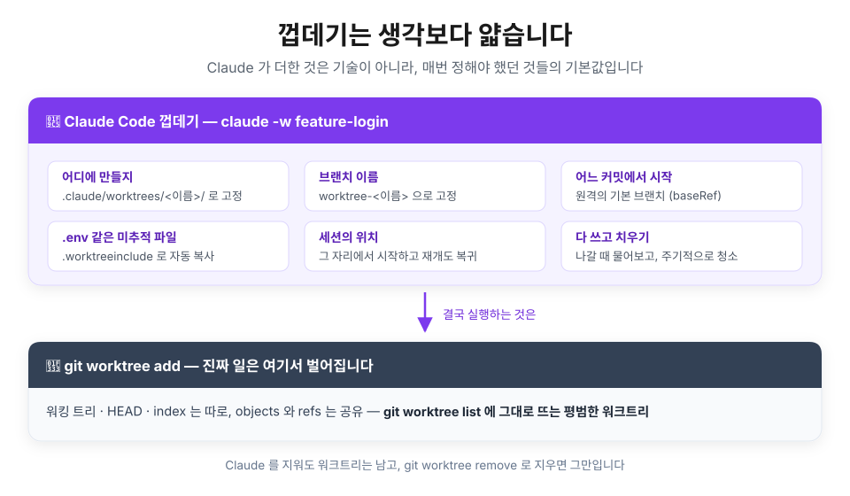
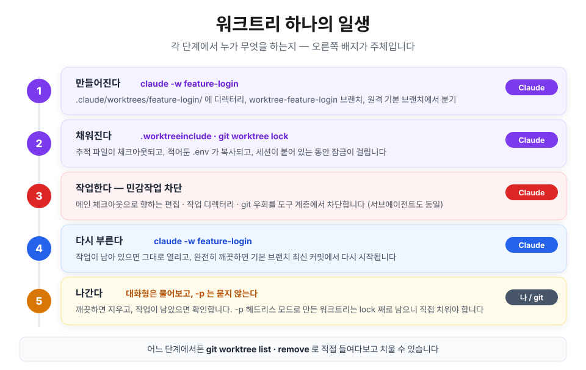
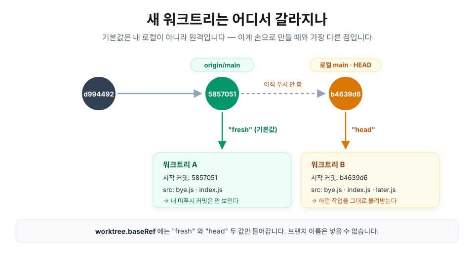

## 들어가며 — 책상은 놓았는데, 누가 앉나

앞 글 [git worktree: 브랜치를 갈아끼우지 말고 책상을 하나 더 놓자](/posts/git/worktree)에서 워크트리가 무엇이고 왜 가벼운지를 정리했습니다. 커밋 데이터는 한 곳에 두고 작업 상태만 갈라놓는다는 이야기였죠.

그런데 막상 써보면, 책상을 놓는 것보다 **그 책상에 앉기까지가 더 귀찮습니다.**

```bash
git worktree add ../demo-login -b feature-login   # 책상 놓기 (여기까진 1초)
cd ../demo-login                                  # 옮겨 앉기
npm install                                       # 빈 책상이라 처음부터
cp ../demo/.env .                                 # 원본에서 손으로 복사
claude                                            # 그리고 다시 실행
```

경로도 매번 정해야 하고, 브랜치 이름도 매번 정해야 하고, 다 쓰고 나서 지우는 건 늘 까먹습니다. Claude Code 는 이 다섯 줄을 한 줄로 줄여주는 기능을 내놨습니다.

```bash
claude -w feature-login
```

이 글은 **이 한 줄 명령어가 실제로 무엇을 하는지**를 다룹니다. 클로드 워크트리의 정체, 만들어지고 치워지기까지의 생명주기, 그리고 실제로 쓰는 활용법까지 실제 출력을 기준으로 살펴보겠습니다.

> 📌 **이 글의 기준**
>
> Claude Code **2.1.x**(작성 시점 `2.1.222`) 기준입니다. 워크트리 쪽은 최근까지도 동작이 다듬어지고 있어서, 오래된 버전에서는 다르게 굴러갈 수 있습니다.
>
> 터미널 출력은 실제 그대로이고, 긴 절대경로만 `/Users/me/demo` 로 줄여 적었습니다.

> 💡 **워크트리 자체가 처음이라면**
>
> 커밋과 브랜치의 관계, `.git` 안에서 무엇이 공유되고 무엇이 갈라지는지, 워크트리의 `.git` 이 왜 폴더가 아니라 텍스트 파일인지는 [앞 글](/posts/git/worktree)에 들어있습니다. 이 글은 그 연장선이라고 생각해주세요. 

## :claude: 껍데기는 생각보다 얇습니다

`claude -w` 가 하는 일은 결국에는 `git worktree add` 입니다. Claude 가 얹은 건 **매번 직접 정해야 했던 것들에 기본값을 박아둔 것** 이 거의 전부입니다.



| 매번 정해야 했던 것 | 손으로 할 때 | `claude -w feature-login` |
| --- | --- | --- |
| 어디에 만들지 | 경로를 그때그때 정함 | `.claude/worktrees/feature-login/` 고정 |
| 브랜치 이름 | 그때그때 정함 | `worktree-feature-login` |
| 어느 커밋에서 시작할지 | 지금 `HEAD` | **원격의 기본 브랜치** (바꿀 수 있음) |
| `.env` 같은 미추적 파일 | 손으로 복사 | `.worktreeinclude` 에 적어두면 자동 |
| 세션을 옮기는 일 | `cd` 하고 `claude` 재실행 | 그 자리에서 시작하고, `--resume` 하면 그 워크트리로 다시 들어감 |
| 다 쓰고 치우는 일 | 기억해뒀다가 `remove` | 나갈 때 물어봄 |

껍데기라고 부르는 이유는, **벗겨보면 그냥 git 워크트리** 이기 때문입니다. 특별한 포맷도, 별도의 메타데이터 저장소도 없습니다.

```bash
$ git worktree list
/Users/me/demo                                  5857051 [main]
/Users/me/demo/.claude/worktrees/feature-login  5857051 [worktree-feature-login] locked

$ git branch
* main
+ worktree-feature-login
```

`git worktree list` 에 그대로 뜨고, `git branch` 에서 `+` 표시(다른 워크트리가 점유 중)도 그대로 붙습니다. Claude 를 지워도 이 워크트리는 남고, `git worktree remove` 로 지우면 그만입니다.

처음 보는 건 끝에 붙은 `locked` 인데, 이건 Claude 가 붙인 표시입니다. 생명주기 마지막 절에서 다뤄보겠습니다.

## 🔄 생명주기 — 직접 찍어본 기록

여기서부터가 본론입니다. 워크트리 하나가 태어나서 사라질 때까지를 순서대로 따라가 봅니다.



실습은 커밋 두 개짜리 데모 저장소와, 그 원격 역할을 하는 저장소 하나로 진행했습니다.

```bash
$ git -C /Users/me/demo log --oneline
5857051 feat: bye 추가
d994492 feat: 첫 커밋
```

### 1. 워크트리 생성

```bash
$ cd /Users/me/demo
$ claude -w feature-login
```

이 한 줄이면 `.claude/worktrees/` 아래에 디렉터리가 하나 생겨 있습니다.

```bash
$ ls -a .claude/worktrees/feature-login
.  ..  .git  .gitignore  package.json  src

$ cat .claude/worktrees/feature-login/.git
gitdir: /Users/me/demo/.git/worktrees/feature-login
```

`.git` 이 폴더가 아니라 한 줄짜리 텍스트 파일인 것까지 앞 글에서 본 그대로입니다. 이름을 빼고 `claude -w` 만 쳐도 됩니다. 그러면 알아서 이름을 지어줍니다.

```bash
$ ls .claude/worktrees
snuggly-plotting-ritchie
```

> ⚠️ **Claude를 처음 실행하는 디렉터리에서는 `-w` 가 실패합니다**
>
> 대화형 실행은 워크스페이스 신뢰(workspace trust)를 요구합니다. 그 디렉터리에서 Claude 를 한 번도 안 돌려봤다면, `claude` 를 한 번 실행해 신뢰 다이얼로그를 수락하고 나서 `-w` 를 쓰세요. 헤드리스 모드(`-p`)는 이 검사를 건너뜁니다.

### 2. 그냥 git 워크트리입니다

Claude 가 만든 워크트리는 메인 체크아웃에서도 **그냥 보입니다.** 숨겨진 상태 같은 건 없습니다.

```bash
$ ls .git/worktrees/feature-login
CLAUDE_BASE  HEAD  ORIG_HEAD  commondir  gitdir  index  locked  logs  refs
```

`HEAD`, `index`, `gitdir`, `commondir` — 전부 git 이 원래 만드는 파일들입니다. 이 목록에서 git 것이 아닌 건 딱 둘, `CLAUDE_BASE` 와 `locked` 뿐입니다.

```bash
$ cat .git/worktrees/feature-login/CLAUDE_BASE
5857051e1990e19fc040900b5539a562da0cd2a4
```

`CLAUDE_BASE` 는 **이 워크트리가 어느 커밋에서 출발했는지**를 적어둔 파일입니다. 나중에 "이 책상에 새로 생긴 작업이 있나"를 판단할 때 기준점이 됩니다. 껍데기가 git 위에 얹은 상태라고는 사실상 이 한 줄이 전부입니다.

### 3. 어디서 갈라지나 — `fresh` 와 `head`

여기가 손으로 만드는 워크트리와 **가장 크게 다른 지점** 입니다. `git worktree add` 는 아무것도 안 적으면 지금 `HEAD` 에서 갈라지지만, Claude 는 **원격의 기본 브랜치** 에서 갈라집니다.

차이를 보려면 로컬과 원격을 어긋나게 해두면 됩니다. `main` 에 아직 푸시하지 않은 커밋(`b4639d6`)이 하나 있습니다.

```bash
$ git log --oneline -2
b4639d6 wip: 로컬에만 있는 커밋
5857051 feat: bye 추가

$ git rev-parse --short origin/main
5857051
```

이 상태에서 아무 설정 없이 워크트리를 만들고 커밋 로그를 확인해보겠습니다.

```bash
$ git -C .claude/worktrees/try-default log --oneline -1
5857051 feat: bye 추가

$ ls .claude/worktrees/try-default/src
bye.js  index.js
```

로컬 커밋 `b4639d6` 이 안 보이죠? 기본적으로 원격의 기본 브랜치인 `origin/main` 을 따라갔기 때문입니다. 이제 아래 설정을 하나 넣고 워크트리를 다시 생성해보겠습니다.

```json
// .claude/settings.json
{
  "worktree": {
    "baseRef": "head"
  }
}
```

같은 저장소, 같은 명령인데, 로컬 커밋이 워크트리에서 잡힙니다.

```bash
$ git -C .claude/worktrees/try-head log --oneline -1
b4639d6 wip: 로컬에만 있는 커밋

$ ls .claude/worktrees/try-head/src
bye.js  index.js  later.js
```



정리하면 이렇습니다.

| `worktree.baseRef` | 어디서 갈라지나 | 언제 쓰나 |
| --- | --- | --- |
| `"fresh"` (기본값) | 원격의 기본 브랜치 (보통 `origin/main`) | 새 기능·새 버그픽스를 깨끗한 상태에서 시작할 때 |
| `"head"` | 지금 내 로컬 `HEAD` | 지금 하던 작업 **위에** 얹어야 할 때 |

> 💡 **브랜치 이름은 넣을 수 없습니다**
>
> `baseRef` 에는 `"fresh"` 와 `"head"` 두 값만 넣을 수 있습니다. 특정 브랜치에서 시작하고 싶으면 git 으로 직접 워크트리를 만들고 그 안에서 `claude` 를 띄우면 됩니다.
>
> 그리고 `"fresh"` 인데 원격이 아예 없으면, 조용히 로컬 `HEAD` 로 떨어집니다. 원격이 있으면 24시간에 한 번(최대 5초) fetch 해서 기준을 갱신합니다.

### 4. `.env` 는 따라오지 않습니다

워크트리는 새 체크아웃이라 **git에서 추적되는 파일만** 들어옵니다. `.gitignore` 에 걸린 `.env` 는 당연히 안 옵니다.

```bash
$ ls -a .claude/worktrees/feature-login
.  ..  .git  .gitignore  package.json  src
```

원본에는 있는데 워크트리에는 없죠. 저장소 루트에 `.worktreeinclude` 를 만들어서 워크트리에서 사용할 파일들을 명시해두면 이걸 자동으로 복사해 줍니다.

```text
# .worktreeinclude
.env
.env.local
config/secrets.json
```

같은 명령으로 다시 만들어보면 미추적 파일까지 포함된 채로 워크트리가 생긴 걸 확인할 수 있습니다.

```bash
$ ls -a .claude/worktrees/with-env
.  ..  .env  .git  .gitignore  package.json  src

$ cat .claude/worktrees/with-env/.env
API_KEY=local-secret

$ git -C .claude/worktrees/with-env status --short
```

`.env` 가 들어왔는데도 `git status` 는 아무것도 안 나옵니다. 어차피 gitignore 된 파일이니까요.

문법은 `.gitignore` 와 같고, **패턴에 맞으면서 동시에 gitignore 된 파일만** 복사됩니다. 추적되는 파일은 이미 체크아웃돼 있으니 중복해서 복사할 일이 없기 때문입니다.

> ⚠️ **`node_modules` 는 여기 적지 않는 게 좋습니다**
>
> 적으면 복사는 되지만, 수만 개 파일을 워크트리마다 복사하는 건 좋은 생각이 아닙니다. 새 워크트리는 **`npm install` 부터** 라고 생각하는 편이 낫습니다. Claude 에게 "여기 의존성 설치해줘"라고 시키면 됩니다.

### 5. 같은 이름을 다시 부르면

이미 있는 이름으로 `-w` 를 다시 부르면 **새로 만들지 않고 그 워크트리로 돌아갑니다.** 그런데 "돌아간다"의 의미가 상황에 따라 둘로 달라집니다.

**작업이 남아 있으면 그대로 둡니다.** 워크트리 안에서 커밋을 하나 만들어두고 다시 불러봤습니다.

```bash
$ git -C .claude/worktrees/with-env log --oneline -1
e8f0861 feat: 워크트리에서 만든 커밋

$ claude -w with-env        # 다시 호출

$ git -C .claude/worktrees/with-env log --oneline -1
e8f0861 feat: 워크트리에서 만든 커밋
```

그대로입니다. 커밋뿐 아니라 커밋 안 한 수정·미추적 파일이 하나라도 있으면 손대지 않습니다.

**아무 작업 내용도 없이 깨끗하면 최신 원격 브랜치로 리셋합니다.** 이번엔 아무 작업도 없는 워크트리를 두고, 그 사이에 기본 브랜치를 앞으로 밀었습니다.

```bash
$ git -C .claude/worktrees/isolation-demo log --oneline -1
5857051 feat: bye 추가                   # 워크트리에서 아무 작업도 하지 않았습니다

$ git rev-parse --short origin/main     # 그 사이 원격 기본 브랜치에 새로운 커밋이 생겼습니다
da85c39

$ claude -w isolation-demo   # 다시 호출

$ git -C .claude/worktrees/isolation-demo log --oneline -1
da85c39 feat: 기본 브랜치가 앞으로 나갔다      # 원격 기본 브랜치 최신 커밋에 맞춰서 이동했습니다

$ ls .claude/worktrees/isolation-demo/src
bye.js  index.js  upstream.js           # da85c39에서 올라온 파일이 들어와 있습니다
```

리셋은 아래를 **전부** 만족할 때만 일어납니다. 하나라도 어긋나면 예전 상태 그대로 열립니다.

- 수정된 파일도, 미추적 파일도 없다
- Claude 가 만들어준 그 브랜치에 그대로 있다
- 자기 커밋이 없다 — 또는 PR 이 병합되고 원격 브랜치가 지워졌다
- `baseRef` 가 `"fresh"` 이고, 이름이 PR 번호가 아니다

> 💡 **이게 왜 편하냐면**
>
> `claude -w review` 를 습관처럼 쓰면, 리뷰가 끝나 깨끗해진 책상은 다음에 부를 때 알아서 최신 `main` 이 됩니다. 반대로 하다 만 작업이 남아 있으면 절대 날아가지 않습니다. 

### 6. 나갈 때 치워집니다 — `-p` 만 빼고

앞에서 `git worktree list` 에 붙어 있던 `locked` 의 정체가 이겁니다.

```bash
$ cat .git/worktrees/feature-login/locked
claude session feature-login (pid 52130 start Thu Aug  6 00:32:32 2026)
```

세션이 붙어 있는 동안 다른 데서 이 워크트리를 지우지 못하게 `git worktree lock` 을 걸어둔 것입니다. 대화형 세션을 정상 종료하면 Claude 가 워크트리를 살펴보고 이렇게 처리합니다.

| 워크트리 상태 | 세션 종료 시 |
| --- | --- |
| 깨끗함 + 이름 없는 세션 | 워크트리와 브랜치를 **자동으로 삭제** |
| 깨끗함 + 이름 붙인 세션 | 남겨둘지 물어봄 |
| 변경·미추적 파일·새 커밋이 있음 | 남길지 지울지 물어봄 |

문제는 **`-p`(헤드리스 모드)** 입니다. 종료 프롬프트 자체가 없으니 아무것도 안 치웁니다. `-p` 로 만든 워크트리는 세션이 끝나도 lock 이 그대로 남아 있었고, 지우려고 하니 아래와 같이 오류가 났습니다.

```bash
$ git worktree remove --force .claude/worktrees/snuggly-plotting-ritchie
fatal: cannot remove a locked working tree, lock reason: claude session snuggly-plotting-ritchie (pid 59595 start Thu Aug  6 00:39:27 2026)
use 'remove -f -f' to override or unlock first
```

`--force` 로도 안 됩니다. `locked` 는 `--force` 가 다루는 대상이 아니거든요. 풀고 지우면 됩니다.

```bash
$ git worktree unlock .claude/worktrees/snuggly-plotting-ritchie
$ git worktree remove .claude/worktrees/snuggly-plotting-ritchie
```

여기서 한 가지 더. **브랜치는 안 지워집니다.**

```bash
$ git branch
* main
+ worktree-isolation-demo
  worktree-snuggly-plotting-ritchie
```

마지막 줄에 `+` 가 없는 걸 보면 점유는 풀렸지만, 브랜치라는 이름표 자체는 그대로 남아 있습니다. 완전히 치우려면 `git branch -D` 까지 해야 합니다.

## 🚧 보호장치는 생각보다 단단합니다

워크트리에 들어간 세션은 **메인 체크아웃을 건드리지 못합니다.** 워크트리 안에서 메인 쪽 경로에 파일을 쓰라고 시켜봤더니 이렇게 응답이 돌아왔습니다.

```text
This session is isolated in the worktree /Users/me/demo/.claude/worktrees/isolation-demo.
Edit the worktree copy of this file instead of the shared-checkout path.
```

막히는 건 세 가지입니다.

- **파일 편집** — 메인 체크아웃 경로를 겨냥한 `Edit`·`Write`
- **명령의 작업 디렉터리** — 작업 디렉터리가 메인 체크아웃으로 풀리는 셸 명령. 작업 디렉터리가 바깥에 머무는지 아닌지 **확인할 수 없는** 명령도 함께 막습니다
- **git 우회** — `git -C`, `--git-dir`, `GIT_DIR`/`GIT_WORK_TREE`, 그리고 `cd` 로 메인에 들어갔다가 git 을 부르는 것까지

> 💡 **이게 왜 중요한가**
>
> 워크트리를 쓰는 이유가 "두 세션이 서로의 파일을 안 건드리게" 인데, 그게 **모델의 선의에 기대는 규칙** 이면 의미가 없습니다. 도구 계층에서 막기 때문에 두 창을 동시에 띄워놓고 잊어버려도 사고가 나지 않습니다.
>
> 이 검사는 그 세션이 만든 **서브에이전트에게도 그대로** 적용됩니다.

## 🤖 서브에이전트에게 책상 나눠주기

워크트리의 진짜 값어치는 여기서 나옵니다. 세션 하나가 서브에이전트 여럿을 동시에 굴릴 때, 각자에게 책상을 따로 줄 수 있습니다.

부르는 방법은 둘입니다. 그냥 말로 시키거나,

```text
에이전트들은 워크트리를 써서 작업해줘
```

특정 서브에이전트를 **항상** 격리하고 싶으면 `.claude/agents/` 의 frontmatter 에 한 줄 박아둡니다.

```markdown
---
name: refactorer
description: 여러 파일에 걸친 기계적인 리팩터링을 수행합니다
isolation: worktree
---

요청받은 리팩터링을 해당하는 모든 파일에 적용하고, 테스트를 돌린 뒤 결과를 보고하세요.
```

서브에이전트에게 `pwd` 를 찍어 보고하라고 시켜봤습니다.

```text
/Users/me/demo/.claude/worktrees/agent-a45f4969146bb0e58
```

같은 `.claude/worktrees/` 아래에, `agent-` 로 시작하는 이름으로 자기만의 책상을 펼치는 겁니다. 브랜치도 똑같은 규칙으로 생성됩니다.

```bash
$ git worktree list
/Users/me/demo                                            b4639d6 [main]
/Users/me/demo/.claude/worktrees/agent-a45f4969146bb0e58  5857051 [worktree-agent-a45f4969146bb0e58]
/Users/me/demo/.claude/worktrees/with-env                 e8f0861 [worktree-with-env] locked
```

에이전트 워크트리에만 `locked` 이 없는데, **원래 안 걸리는 게 아니라 이미 풀린 것** 입니다. 잠금은 에이전트가 **돌아가는 동안** 걸렸다가 일을 마치면 풀립니다. 위 출력은 에이전트가 다 끝난 뒤에 찍은 것이라 잠금이 남아 있지 않은 겁니다.

> 💡 **참고!**
>
> 목록 아래쪽 `with-env` 워크트리에는 왜 `locked` 이 남아 있을까요? 그 워크트리는 `-p` 세션에서 만든 거라 종료 정리를 못 했기 때문입니다. 즉 두 줄의 차이는 **`-w` 냐 서브에이전트냐가 아니라, 정리가 됐느냐** 입니다.

### 서브에이전트가 만든 워크트리는 끝나면 알아서 사라집니다

서브에이전트 워크트리는 뒷정리 규칙이 `-w` 와 다릅니다. **변경 없이 끝나면 그 자리에서 삭제** 됩니다. 파일을 하나 만들고 끝낸 에이전트와, 아무런 파일 작업도 하지 않은 에이전트를 비교해보겠습니다.

```bash
# 파일을 하나 만들고 끝낸 에이전트 → 남는다
$ git -C .claude/worktrees/agent-a45f4969146bb0e58 status --short
?? agent.txt

# pwd 만 찍고 끝낸 에이전트 → 흔적도 없다
$ ls .claude/worktrees
agent-a45f4969146bb0e58  isolation-demo  pr-1234  with-env
```

두 번째 에이전트는 `agent-a18e5ca218afba02d` 워크트리를 받았는데, 변경사항 없이 작업이 끝나서 지워졌습니다. 목록에 아예 안 보이죠.

**그러면 작업은 끝났는데 남아있는 워크트리는 어떻게 정리될까요?** 주기적인 청소 작업을 통해 정리합니다. `cleanupPeriodDays` 설정보다 오래된 것을 쓸어가되, 이런 것들은 건너뜁니다.

- 변경된 파일·미추적 파일이 있거나, 푸시 안 한 커밋이 있는 워크트리
- **`-w` 로 직접 만든 워크트리** — 청소는 여기엔 절대 손대지 않습니다

죽은 세션이 남긴 lock 도 이 청소가 같이 풀어줍니다. 다만 **내가 손으로 건 `git worktree lock` 은 건드리지 않습니다.**

> 💡 **base 는 `-w` 와 같습니다**
>
> 서브에이전트 워크트리도 `worktree.baseRef` 를 따릅니다. 기본값이면 원격 기본 브랜치에서, `"head"` 면 지금 작업 위에서 시작합니다. **하다 만 작업을 여러 에이전트에게 나눠주려면 `"head"` 로 두세요.** 기본값 그대로면 에이전트들이 내 미푸시 커밋을 못 본 채로 일합니다.

## 🍳 실전 레시피

### 1. 두 기능을 동시에 작업하고 싶어요

같은 레포에서 터미널 두 개를 띄우고 이름만 다르게 줍니다.

```bash
# 터미널 A
claude -w feature-login

# 터미널 B
claude -w fix-header
```

각자 다른 디렉터리, 다른 브랜치입니다. A 가 만지는 파일이 B 에 보이지 않고, 실수로 넘어가지도 못합니다.

### 2. 로컬에서 작업하던 중에 PR을 리뷰해야 해요

PR 번호 앞에 `#` 을 붙여 넘기면 됩니다. **셸이 `#` 을 주석으로 먹으니 따옴표는 필수** 입니다.

```bash
claude -w "#1234"
```

`origin` 에서 `pull/1234/head` 를 가져와 `.claude/worktrees/pr-1234` 에 펼칩니다. GitHub PR URL 전체를 그대로 붙여넣어도 됩니다.

```bash
$ git worktree list
/Users/me/demo                             b4639d6 [main]
/Users/me/demo/.claude/worktrees/pr-1234   6795641 [worktree-pr-1234] locked

$ git -C .claude/worktrees/pr-1234 log --oneline -1
6795641 fix: 남이 보낸 PR 커밋
```

내 작업은 `main` 에 그대로 둔 채, 남의 코드를 실제로 체크아웃해서 돌려보고 리뷰할 수 있습니다. `.worktreeinclude` 에 적어둔 설정 파일까지 따라오니, 의존성만 설치하면 코드 리뷰뿐 아니라 테스트까지 돌려볼 수 있습니다.

### 3. 지금 작업을 하고 있는데, 다른 기능을 이 작업 위에서 바로 시작하고 싶어요

```json
// .claude/settings.json
{
  "worktree": {
    "baseRef": "head"
  }
}
```

푸시 안 한 커밋 위에서 실험을 해야 할 때, 그리고 서브에이전트에게 진행 중인 작업을 나눠줄 때 필요합니다.

### 4. 특정 브랜치에서 작업을 시키고 싶어요

`baseRef` 설정값으로는 안 되니 git 으로 만들고 들어갑니다.

```bash
git worktree add ../project-bugfix fix-issue-456
cd ../project-bugfix
claude
```

이렇게 만든 워크트리는 Claude 가 **자기가 만든 것으로 치지 않습니다.** 종료할 때 물어보지도, 자동으로 치워주지도 않으니 정리는 직접 해야 합니다.

### 5. 세션 도중에 워크트리를 옮기고 싶어요

시작할 때 `-w` 를 안 붙였어도 가능합니다. 하던 중에 이렇게 말하면 됩니다.

```text
이건 워크트리에서 하자
```

`EnterWorktree` 로 워크트리를 만들어 옮겨갑니다. 나올 때는 `ExitWorktree` 고, 세션을 재개하면 **그 워크트리로 다시 들어갑니다** — 대화형이든 `-p --resume` 이든 마찬가지입니다.

> ⚠️ **`.claude/worktrees/` 바깥으로 나가면 매번 물어봅니다**
>
> 그 경로로 옮기는 순간 세션의 작업 디렉터리·쓰기 권한·`CLAUDE.md` 같은 프로젝트 설정이 통째로 따라가기 때문입니다. 권한 규칙을 걸어도, "다시 묻지 않기"를 눌러도 이 확인은 안 없어집니다.

### 6. 워크트리 디렉터리 감추기

저장소 **안에** 워크트리가 생기니, ignore 하지 않으면 메인 체크아웃에서 미추적 파일로 계속 보입니다.

```text
# .gitignore
.claude/worktrees/
```

내 로컬에서만 감추고 싶으면 `.git/info/exclude` 에 같은 라인을 넣으면 됩니다.

### 7. 남은 워크트리 치우기

```bash
git worktree list                                    # 뭐가 남았나
git worktree unlock  .claude/worktrees/<이름>         # lock 이 남아 있으면
git worktree remove  .claude/worktrees/<이름>         # 깨끗할 때
git worktree remove --force .claude/worktrees/<이름>  # 변경·미추적 파일이 있을 때
git branch -D worktree-<이름>                         # 브랜치는 따로 지워야 한다
```

### 치트시트

| 하고 싶은 것 | 쓸 것 |
| --- | --- |
| 격리된 세션 시작 | `claude -w <이름>` |
| 이름은 아무거나 | `claude -w` |
| PR 리뷰 | `claude -w "#1234"` |
| 지금 작업 위에서 | `worktree.baseRef: "head"` |
| 특정 브랜치에서 | `git worktree add` 후 그 안에서 `claude` |
| `.env` 자동 복사 | 루트에 `.worktreeinclude` |
| 서브에이전트 격리 | "워크트리 써서 해줘" 또는 frontmatter `isolation: worktree` |
| 도중에 옮겨 앉기 | "워크트리에서 하자" (`EnterWorktree`) |
| 목록·정리 | `git worktree list` · `remove` · `branch -D` |

## ⚠️ 밟아본 함정

1. **`git add -A` 한 방에 워크트리가 통째로 딸려갑니다.** ignore 를 안 걸어둔 상태에서 메인 체크아웃에서 무심코 쳤더니 이렇게 됐습니다.

```text
warning: adding embedded git repository: .claude/worktrees/with-env
hint: You've added another git repository inside your current repository.
hint: Clones of the outer repository will not contain the contents of
hint: the embedded repository and will not know how to obtain it.
```

파일이 복사되는 게 아니라 **빈 껍데기(gitlink)만 커밋** 되기 때문에 더 고약합니다. 클론한 사람에게는 영영 빈 폴더로 보입니다.

```text
# .gitignore
.claude/worktrees/
```

이 설정을 꼭 잊지 마세요.

2. **포트 하나를 점유하는 개발 서버는 두 개 이상의 워크트리에서 못 띄웁니다.** 이 블로그는 개발 서버를 `localhost:4321` 로 고정해두었는데, 워크트리 두 개에서 동시에 띄우면 뒤에 뜬 쪽이 다른 포트로 밀려나거나 그냥 실패합니다. 파일은 갈라졌어도 **포트·DB·캐시 디렉터리 같은 기계 하나짜리 자원은 여전히 하나** 입니다.

3. **`-p` 로 만든 워크트리는 아무도 안 치웁니다.** 스크립트나 CI 에서 `-p --worktree` 를 돌리면 종료 프롬프트가 없어 워크트리도 lock 도 그대로 남습니다. 주기 청소도 `-w` 로 만든 건 건드리지 않으니, **만든 쪽에서 지우는 것까지 책임져야 합니다.**

4. **`.claude` 가 심볼릭 링크면 워크트리 생성 자체를 거부합니다.** dotfiles 를 링크로 관리하는 설정에서 걸립니다. `.claude`, `.claude/worktrees`, 워크트리 디렉터리 자신 중 하나라도 심볼릭 링크면 경로를 짚어주며 멈춥니다. 링크를 풀고 다시 시도하는 것 말고는 방법이 없습니다.

5. **워크트리 안에서 `claude --resume` 하지 마세요.** 재개는 **메인 체크아웃에서** 실행해야 합니다. 워크트리 안에서 띄우면 Claude 가 그 디렉터리를 보증할 수 없다며 격리 없이 이어가거나 아예 멈춥니다. 워크트리는 놔둔 채 메인에서 재개하면 알아서 다시 들어갑니다.

## 🎯 한 문장 요약

`claude -w` 는 새로운 격리 기술이 아니라, **`git worktree add` 뒤에 매번 따라붙던 수작업을 없앤 것** 입니다. 
- 경로와 브랜치 이름을 규칙으로 고정하고, 
- 시작 지점을 원격 기준으로 바꾸고, 
- `.env` 를 옮겨주고, 
- 세션을 그 자리에 붙여두고, 
- 나갈 때 워크트리 정리 여부를 물어봅니다. 

벗겨보면 `git worktree list` 에 그대로 뜨는 평범한 워크트리라, 언제든 git 명령으로 되돌릴 수 있습니다.

## 📚 참고자료
- [Claude Code 공식 문서: Run parallel sessions with worktrees](https://code.claude.com/docs/en/worktrees)
- [Claude Code 공식 문서: Subagents](https://code.claude.com/docs/en/sub-agents)
- [git worktree 공식 문서](https://git-scm.com/docs/git-worktree)
- [git worktree: 브랜치를 갈아끼우지 말고 책상을 하나 더 놓자](/posts/git/worktree)
