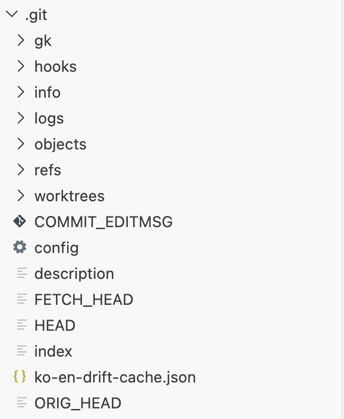
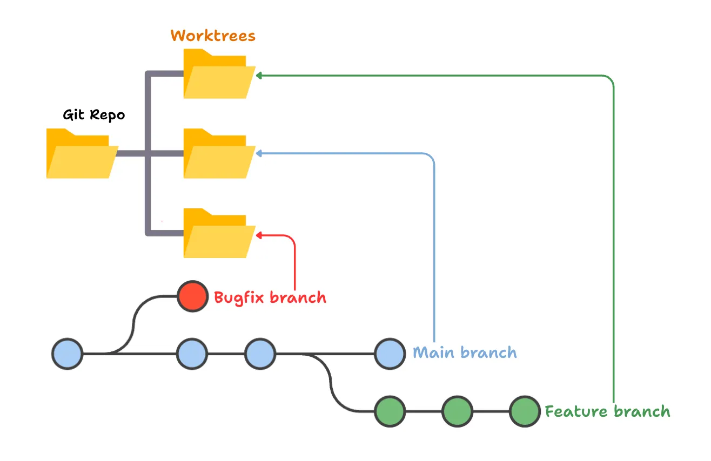
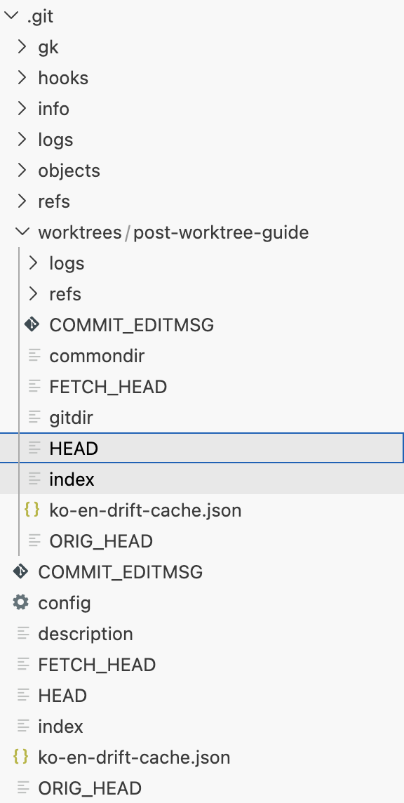

## Getting Started — Branch vs. Worktree, What's the Difference?
Before I got into AI, my understanding of git was only surface-level: commits, branches, rebase, merge, fast-forward — the shape of the workflow and nothing underneath it. But on my capstone design project, working with AI meant I constantly ran into situations where I had to review code in the middle of building a feature.

Since you can't have two branches open in one working directory, I ended up cloning the same remote repository into two local directories, running `fetch origin` in each one by hand, and keeping two IDE windows open at once. On top of that, environment file like `.env` had to be synced across both working directories one by one — a real nuisance.

Somewhere in the middle of all that I came across the idea of a work tree, and with it I could finally spread several branches out from a single working directory in my project and work on them in parallel.

In this post, I'll walk step by step through what a work tree is in git and how to use it.

## 📌 Defining Terms — commit, branch

On GitHub, **commit** is both a noun and a verb, and it carries two meanings.
- Commit as a noun: a snapshot
- Commit as a verb: to save a snapshot

So you could say you commit a commit. When you commit (save) changes to your project code, a commit (snapshot) of the project source at that moment — changes included — is created. This series of snapshots is stored permanently in the repository in that order, and you can later modify the contents of a particular commit through things like reset.

Also, a commit has a parent.

```text
    (A)   <---   (B)    <---    (C) 
     ↑            ↑
(parent of B, C)  (parent of C)
```

A **branch** is a lightweight pointer to a particular commit. Nothing more, nothing less. GitHub gives you a main branch by default. That is, when you leave the first commit in a project initialized with git init, that commit automatically gets a label called main.

Worth noting: in Git, a branch label points at exactly one commit — **the branch's most recent commit (the tip)**. Past commits carry no label of their own.

So how does Git know that past commits belong to a particular branch? Through a "chain of links" (a linked list). Every commit in Git remembers who its own parent commit (the previous commit) is.

```text
(A) <--- (B) <--- (C) 
                   ↑
                 [main] (label)
```

In the diagram above, the label main hangs on commit C alone. But because C points to B and B points to A, Git traces backwards and works out: "ah, A and B are history belonging to the main branch too." It's the same principle as grabbing the last link of a chain and pulling the whole thing up.

**Can a single commit have two or more labels (branches)?**

Of course — branch out from a given commit and you can hang two or more labels on it. Say we create a new branch called feature from commit C, the latest commit on main. (git branch feature)

```text
(A) <--- (B) <--- (C) 
                   ↑
                [main] 
               [feature]
```               
- No new commit is created, and no files are copied.
- All that happens is that one more pointer (label) is added, pointing at that same commit C.
- That's why creating a new branch happens instantly (in well under 0.1 seconds).

**So when do the branches actually diverge?**
The two labels sit on the same commit until we switch to the feature branch and make a new commit D — that's the moment the paths finally split.

```text
                        [main]
                          ↓
(A) <--- (B) <--- (C) <- (E)
                   ↖ 
                    (D)
                     ↑
                 [feature]
```
When the new commit D is added, the currently active feature label moves to the new commit D. The main label, however, stays on C, and from that point the two branches' histories separate.

Earlier I said that Git grabs the last link of the chain and walks up through the parents to decide which commits belong to a branch. So in the diagram above, commits A, B, and C all belong to the main branch and, at the same time, to the feature branch. But E is not on the feature branch, and D is not on the main branch.

In Git, what "belongs to a particular branch" really means is "you can get there by starting at that branch label and walking back up through the parent commits (it is reachable)."

## :table: So What Is a Worktree?
It's a feature that lets you keep several physical working directories open at the same time out of a single Git repository.
Normally a single working directory can only have one branch checked out at a time, but with a worktree you create another working directory underneath your working directory. That lets you check out different branches in different folders at the same time while sharing the same .git history. It's as if you could spread several desks out in one room and work at all of them at once.

How can one repository have several branches open at the same time? Let's work out the mechanism starting from what actually lives inside .git.

## Share the Code Data, Separate the Working State
The reason one repository can have several branches open at once is that Git is **designed so that 'data (objects)' and 'state (HEAD, index)' can be managed separately**.
The .git folder of a Git repository as we usually know it holds two broad kinds of data.



1. Shared data (used in common by every branch):
    - objects/: the actual database — snapshots of the source code, commit history (tree, blob, commit objects), and so on.
    - refs/: the pointers recording which commit each branch (heads) and tag (tags) points at.

2. Working state data (tied to the current workspace):
    - HEAD: the file pointing at which branch I'm currently working on (checked out) — e.g. ref: refs/heads/main.
    - index: the staging area holding the changes I've git added for the next commit.

**How git switch works (1 repo = 1 branch)**

The `git switch feature` (or checkout) command swaps only the state, inside the very same directory.

1. It overwrites the contents of .git/HEAD with ref: refs/heads/feature.
2. It resets .git/index to the state of the new branch.
3. It sweeps the actual visible files (the working directory) over with the feature branch's snapshot.

**The limitation**: because there is physically only one HEAD file and one index file, a single folder can hold the state of only one branch at a time.

**How git worktree works (one set of shared data, many states)**

Running `git worktree add ../hotfix-folder hotfix-branch` pulls a filesystem trick. It gives each folder its own independent HEAD and index without copying the bulky objects.


When you create a worktree, a new directory called worktrees/ appears inside the .git folder, and the state files belonging to the newly created worktree are stored in there.

```text
original-project/.git/
 ├── objects/         (shared: all commit data)
 ├── refs/            (shared: all branch pointers)
 ├── HEAD             (the main folder's current branch)
 ├── index            (the main folder's staging area)
 └── worktrees/
      └── hotfix-folder/
           ├── HEAD   (the new worktree's current branch)
           ├── index  (the new worktree's staging area)
           └── gitdir (a record of the new worktree's physical path)
```

Under the worktree there's no `objects/` or `refs/`, but `HEAD` and `index` are there — see? That's exactly the point made just above: a worktree shares the shared data, `objects/` and `refs/`, from the root working directory's .git, but keeps its own copies of the working state data, `HEAD` and `index`.

The newly created hotfix-folder has a .git of its own too, but it isn't a folder — it's a plain text file.
Open that text file and you'll find the path to the original repository written inside, like this.
```text
gitdir: <project-path>/.git/worktrees/hotfix-folder
```

The .git file in the worktree holds that line because it acts as the navigation (the signpost) that tells Git "where the real data and the current state files are" when you run a Git command inside that folder.

**What happens when you type git status or git commit?**

In an ordinary repository Git would step into the .git folder and read the data, but in a worktree .git is a plain text file. Git opens that file and reasons like this.

- "Ah, this folder isn't a standalone repository — it's a worktree!"
- "My real HEAD (current branch) and index (staging area) live at /path/to/original-project/.git/worktrees/hotfix-folder/. I'd better go there to read the state."
- "And when I save a commit, I should use the original project's objects/ folder."

In other words, without this one-line text file Git would either take the worktree folder for an ordinary plain folder or lose its way entirely as to where it should read data from.

**Why a text file instead of a symbolic link (symlink)?**

You might think, "couldn't we just make a shortcut (symlink) pointing at the original .git folder?" But there are very good reasons for using a text file (gitdir: ...).

- Separation of state: if you simply linked the whole original .git as a shortcut, the worktree would end up sharing the original project's HEAD (current branch) and index identically. Since we built the worktree precisely to share the 'commit data' while separating the 'working state', we need the text file to target exactly the worktree's own subfolder (worktrees/hotfix-folder/) inside the original .git.
- OS compatibility: symbolic links are handled differently, and permissioned differently, on Windows versus Linux/Mac (Unix). Reading a plain text file to trace a path, by contrast, works 100% identically and safely on every operating system.

**It's not only the worktree that looks at the original project — the original project knows exactly where the worktree is, too.**

Step into the original project's .git/worktrees/hotfix-folder/ and you'll find another gitdir file pointing the other way. Written inside it is the physical folder path of the worktree that was created (e.g. /path/to/hotfix-folder).

Thanks to this two-way link, the following safeguards work.

- When you type git worktree list in the original folder, Git can lay out the full list of which folders your worktrees are scattered across.
- Git stops you from accidentally deleting (git branch -D) a branch from the original folder while it's in use by a worktree.

```bash
raewookang@Raewooui-MacBookAir GithubBlog % git branch
  claude/bilingual-check-2026-08-03
  claude/cv-coming-soon-2026-08-03
+ claude/post-git-vs-claude-worktree
* main
raewookang@Raewooui-MacBookAir GithubBlog % git worktree list
/Users/raewookang/GithubBlog                                        db05656 [main]
/Users/raewookang/GithubBlog/.claude/worktrees/post-worktree-guide  2a985f3 [claude/post-git-vs-claude-worktree]
```
As you can see in the output above, running `git branch` from the root working directory shows the worktree's branch marked with a `+`, and running `git worktree list` shows you what the worktree branches are and where they physically sit.

> 💡 **A common misconception: isn't a commit tied to a branch? Shouldn't commits be managed separately per worktree as well?**
>
> No. **A branch is simply a label stuck onto a particular commit.** It isn't that the commit belongs to the branch; it's just that a label called a branch is stuck onto a particular commit. Peeling the label off (deleting the branch) doesn't make the commit data itself disappear.
>
> **The detached HEAD state**: have you ever jumped straight to a particular commit by its hash (e.g. git checkout a1b2c3d)? Git warns you that you're in a "detached HEAD" state. That means you're looking directly at **a commit in the wild, with no branch (label) attached to it**. Which is to say: commits can exist without a branch.

> 💡 **Why aren't commits managed separately per worktree?**
> 
> Because commits were never bound to branches in the first place — they're an independent database. That's what makes it possible, and efficient, to keep just one of them at the center (`.git`) and have several worktrees share it between them.
>
> What would happen if, every time you created a worktree, the commit data were split off and managed separately in each folder? That wouldn't be a worktree at all — **it would be exactly the same as downloading (cloning) the repository over and over again**.
> The whole point of Git worktree's existence is to spin up several working environments **"lightly and quickly."**
> 
> Commit data is very heavy.
> - Inside the `.git/objects` folder sit every snapshot (commit) of the source code, from the beginning to now, all compressed. On a large project that runs from hundreds of MB to several GB. Copying that enormous pile of data three times just to spin up three worktrees would waste a staggering amount of disk space.
> 
> Here's an analogy — `a library and its reading rooms`.
> - The original project's `.git/objects`: the central library's 'basement archive', where every book (commit) is kept together.
> - Each worktree: a 'private reading room (desk)' where you fetch books, read them, and write.
> 
> There's no need to keep a copy of every book in the library in each reading room (worktree). Each reading room only has to manage its own state information: "which book am I holding open right now (`HEAD`)" and "what am I writing anew (`index`)." Once you finish a new book (commit), it goes right back into the central archive (`.git/objects`) so that every reading room can share it.


## 📚 References
- [What a commit is](https://hoohaha.tistory.com/105)
- [PyTorch Korea User Group](https://discuss.pytorch.kr/t/claude-worktree-cwt-git-worktree/8878#p-17465-custom-setup-hook-6)
- [medium.com: How git worktrees improve our git workflow](https://medium.com/threadsafe/how-git-worktrees-improve-our-git-workflow-58f89171eb6b)
