> 📚 **Python memory, part 1 of 4** — **① Everything is an object** · [② A variable is a name tag, not a box](/posts/python/variables-are-name-tags) · [③ Aliasing — two names, one object](/posts/python/alias-and-mutability) · [④ When objects die](/posts/python/refcount-gc-and-pymalloc)

## Getting started — Python has no primitive types at all

If you learned C first, one fact trips you up before anything else: C has **primitive types** like `int`, `double` and `char`, and Python has **none of them**.

`5`, `True` and `None` are all heap-allocated **objects**. And every single object starts with the same **16-byte header**. That header is why `sys.getsizeof(0)` returns 28 rather than 4, why `type(x)` works at runtime, and why a list can hold any mix of types at all.

> 💡 In C, a type **evaporates once compilation finishes**. In Python, a type is **an 8-byte pointer the object carries around with it**. That single line runs through this entire article.

This article has two halves. First we dissect the **header every object shares**, and after that we walk through the **body** that gets attached behind that header, one type at a time.
- the 30-bit digits of `int`,
- the compact representation and interning of `str`,
- the pointer arrays of `list` and `tuple`,
- the compact structure of `dict`,
- `__slots__`,
- and finally **shallow copies and deep copies**.

> 📌 Every number in this article was **produced by actually running the code** in the environment below. A few values will differ across platforms (32/64-bit) and versions.
>
> ```text
> Python 3.13.12 (main, Feb  3 2026) [Clang 17.0.0]
> macOS 26.5 · arm64 · 64-bit
> ```

---

## 🧱 1. Everything is an object — dissecting PyObject

### C has primitive types; Python has none

In C, `int`, `double` and `char` are **the values themselves**. The four bytes that `int a = 5;` occupies hold nothing but the bit pattern for 5 — no tag saying "I am an integer" is stored alongside it. How those four bytes should be read is decided by the compiler from the declaration and baked into the machine code, and once compilation ends the type information itself is gone. Cast it as `*(float *)&a` and the very same memory is read back as a float without complaint — the bits never moved, only the interpretation did. At runtime there is no way to look at those four bytes and ask "is this an integer or a float?" That knowledge only ever lived in the compiler's head.

Python has **no primitive types at all.** `5`, `True` and `None` are all heap-allocated objects. And every object without exception begins with the same header.

```c
/* CPython 3.13 — Include/object.h (conditional compilation elided) */
struct _object {
    union {
        Py_ssize_t  ob_refcnt;         /* reference count */
        PY_UINT32_T ob_refcnt_split[2];
    };
    PyTypeObject *ob_type;             /* pointer to the type object */
};
```

So what does the `PyTypeObject` that `ob_type` points at look like? It is a large struct with over ninety fields, so here are just the ones that matter for this discussion.

```c
/* CPython 3.13 — Include/cpython/object.h (only some of its 90+ fields) */
struct _typeobject {
    PyObject_VAR_HEAD                      /* a type object is an object too — same header as above */
    const char *tp_name;                   /* "int", "list" — the type name used for printing */
    Py_ssize_t tp_basicsize, tp_itemsize;  /* fixed size of an instance / size of one variable-part item */

    destructor tp_dealloc;                 /* the destructor called when refcnt hits zero */
    /* … elided … */
    reprfunc tp_repr;                      /* repr(x) */

    PyNumberMethods   *tp_as_number;       /* +  -  *  /  … the numeric operator suite */
    PySequenceMethods *tp_as_sequence;     /* len(x), x[i], x in y … */
    PyMappingMethods  *tp_as_mapping;      /* x[key] */

    hashfunc     tp_hash;                  /* hash(x) */
    ternaryfunc  tp_call;                  /* x(...) */
    reprfunc     tp_str;                   /* str(x) */
    getattrofunc tp_getattro;              /* x.attr */
    setattrofunc tp_setattro;              /* x.attr = v */
    /* … elided … */
    unsigned long tp_flags;                /* property bits (is it tracked by the cyclic GC, …) */
    const char *tp_doc;                    /* docstring */

    traverseproc tp_traverse;              /* for the cyclic GC to walk child objects */
    inquiry      tp_clear;                 /* for the cyclic GC to drop references */
    richcmpfunc  tp_richcompare;           /* ==  <  > … */
    /* … elided … */
    getiterfunc  tp_iter;                  /* iter(x) */
    iternextfunc tp_iternext;              /* next(x) */

    PyMethodDef  *tp_methods;              /* method table */
    PyTypeObject *tp_base;                 /* parent type */
    PyObject     *tp_dict;                 /* class namespace */
    /* … elided … */
    initproc  tp_init;                     /* __init__ */
    allocfunc tp_alloc;                    /* grab memory */
    newfunc   tp_new;                      /* __new__ */
    freefunc  tp_free;                     /* give memory back */
    /* … elided … */
    PyObject *tp_mro;                      /* method resolution order (MRO) */
    /* … elided … */
};

typedef struct _typeobject PyTypeObject;
```

Look at the first line: `PyObject_VAR_HEAD`. **A type object is itself an ordinary object with its own `ob_refcnt` and `ob_type`.** That is why `type(5)` hands back an *object* called `<class 'int'>`, and calling `type()` on that again gives you `<class 'type'>`. There is a type of type 😂

```python
>>> type(5)
<class 'int'>
>>> type(type(5))
<class 'type'>
>>> id(type(5)) == id(int)
True
>>> id(type(type(5))) == id(type)
True
```

Back to the `PyObject` header. On 64-bit, `Py_ssize_t` is 8 bytes and a pointer is 8 bytes, so **the header is exactly 16 bytes**. Those two fields decide almost everything about Python as a language.

- **`ob_refcnt`** — how many references point at this object. When it reaches zero the object is freed immediately. This is why Python has no `free()`.
- **`ob_type`** — a pointer to its own type object. **The value carries its type with it.** That is the exact opposite of C, where types evaporate at compile time. `type(x)`, `isinstance()`, duck typing and operator overloading all come out of these eight bytes.

Objects that keep an item count in the header add one more field for it. `list`, `tuple`, `bytes` and `bytearray` use this header.

```c
typedef struct {
    PyObject ob_base;      /* the 16-byte header above */
    Py_ssize_t ob_size;    /* number of items in the variable part */
} PyVarObject;
```

> 💡 **`str` and `int` are variable-length and yet they are not `PyVarObject`s.** Both track their length in a field of their own instead of `ob_size` — `length` for `str`, and for `int` an `lv_tag` that packs the digit count together with the sign. `int` used to be a `PyVarObject` and **changed in 3.12.** We will confirm both structs against the source in [§2.1](#21-int--no-upper-bound) and [§2.3](#23-str--compact-representation-and-interning).

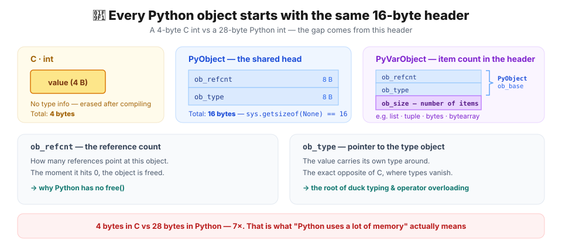

### Checking the 16-byte header in code

`None` is a singleton with no payload at all, so it is a **header and nothing else**. Measure it and you get exactly 16. (We just said `PyObject` is the header every object in Python carries, remember?)

```python
import sys

for v in [None, True, 0, 2**100, 3.14, "", "a", b"", [], (), {}, set()]:
    print(f"{type(v).__name__:>9}  {sys.getsizeof(v):>4} bytes   {v!r:.20}")
```

```text
 NoneType    16 bytes   None
     bool    28 bytes   True
      int    28 bytes   0
      int    40 bytes   12676506002282294014
    float    24 bytes   3.14
      str    41 bytes   ''
      str    42 bytes   'a'
    bytes    33 bytes   b''
     list    56 bytes   []
    tuple    40 bytes   ()
     dict    64 bytes   {}
      set   216 bytes   set()
```

The gap with C is already visible. **A C `int` is 4 bytes; the Python integer `0` is 28 — seven times larger.** An empty list holds nothing yet costs 56 bytes. "Python uses more memory than C" is not a vague impression; it is a structural cost that starts in this header.

> 💡 `sys.getsizeof()` reports the size of **the object itself only**. For a container, the objects inside are not counted. The [list section](#25-list--contiguous-pointers-not-contiguous-values) makes it obvious why.

### `id()` is the object's memory address

In CPython, `id(obj)` is **the object's memory address**. Once you have the address you can read the C struct directly, so let us pry the header open with `ctypes`.

```python
import ctypes, sys

x = ["some", "list"]
addr = id(x)    # the object's starting address

print("id(x)          =", hex(addr))
print("getrefcount    =", sys.getrefcount(x) - 1)   # -1: drops the temporary argument reference
print("*(Py_ssize_t*)addr =", ctypes.c_ssize_t.from_address(addr).value)  # read 8 bytes (ob_refcnt) from that starting address as a signed integer

y = x                                                # add one alias to the object
print("after y = x        =", ctypes.c_ssize_t.from_address(addr).value)  # read the same 8 bytes (ob_refcnt) again → now it is 2

# the second 8 bytes of the header are ob_type
print("ob_type == id(list):",
      ctypes.c_void_p.from_address(addr + 8).value == id(list))
```

```text
id(x)          = 0x1044cc880    // the ["some", "list"] object starts at 0x1044cc880
getrefcount    = 1              // one name references that object
*(Py_ssize_t*)addr = 1          // the first 8 bytes at that address read as 1 — so ob_refcnt == 1
after y = x        = 2          // adding one alias makes ob_refcnt == 2
ob_type == id(list): True       // the next 8 bytes (ob_type) match the address of the list type object
```

Reading eight bytes at that address gives the same number as `sys.getrefcount()`, and the next eight match the address of the `list` type object. That is proof the C struct we just looked at is sitting there in memory exactly as described.

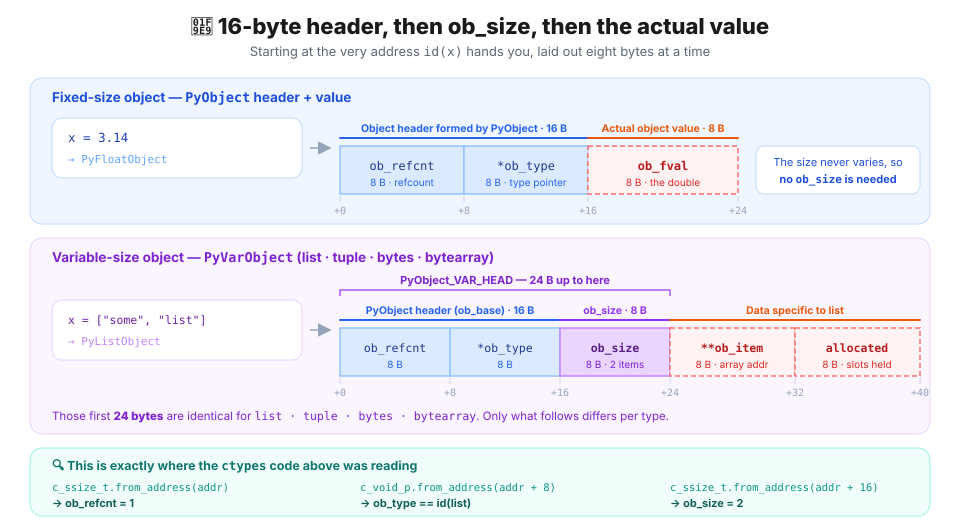

> ⚠️ `ctypes.from_address()` is raw pointer access with no safety net whatsoever. Use it to see the structure with your own eyes, never in real code. Get it wrong and the interpreter dies on the spot.

---

## 📦 2. What each type looks like in memory

Every object carries the same header; what differs is the **body** attached behind it. For each type: what it actually looks like on the heap, and how that shape leads to performance characteristics and traps.

### 2.1 `int` — no upper bound

Python integers have no upper bound. `2**10000` just works. Quite different from C, where an `int` is capped at 4 bytes (32 bits) and so can only go up to `2**31`, right? How is that possible?

```c
/* CPython 3.13 — Include/cpython/longintrepr.h */
typedef struct _PyLongValue {
    uintptr_t lv_tag;      /* digit count + sign + flags */
    digit ob_digit[1];     /* variable-length array of digits */
} _PyLongValue;

struct _longobject {
    PyObject_HEAD          /* 16 bytes */
    _PyLongValue long_value;
};
```

The key point is that **one `digit` element inside the `ob_digit` array holds a 30-bit number** (on a 64-bit build a `digit` is a `uint32_t`, so it is 32 bits wide, but the top 2 bits are left empty to make room for multiplication). Large numbers are chopped into 30-bit pieces and stored in the array. In other words, a Python integer is effectively a **BigNum implementation**, and small integers use the very same structure without exception.

Measure it and the arithmetic works out exactly:

```python
import sys

for n in [0, 1, 2**29, 2**30, 2**59, 2**60, 2**100]:
    print(f"{n:<32} {sys.getsizeof(n)} bytes")
```

```text
0                                28 bytes
1                                28 bytes
536870912                        28 bytes      ← 2**29, still fits in 30 bits
1073741824                       32 bytes      ← 2**30, grows to 2 digits
576460752303423488               32 bytes      ← 2**59, still 60 bits
1152921504606846976              36 bytes      ← 2**60, 3 digits
1267650600228229401496703205376  40 bytes      ← 2**100, 4 digits
```

`16 (header) + 8 (lv_tag) + 4 × digits = 28, 32, 36, 40 …` — four more bytes for every 30 bits, precisely.

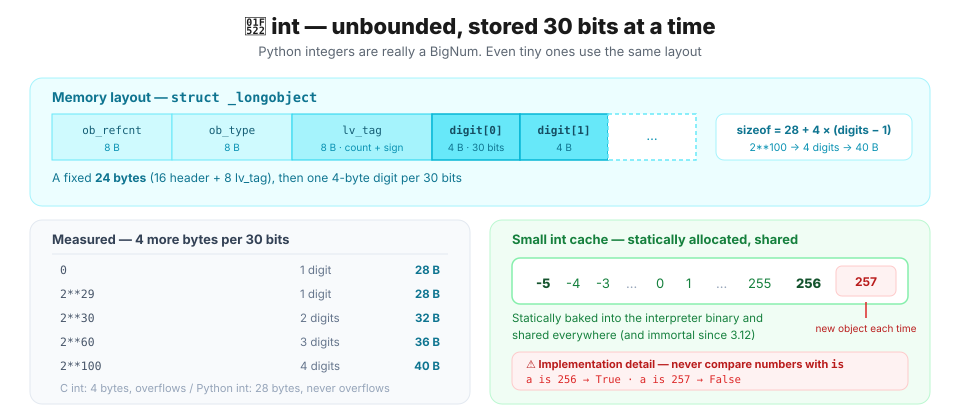

As we just saw, an `int` in Python needs at least 28 bytes no matter how small the number is. That is why Python introduced the **small integer cache**.

Allocating 28 bytes every time an integer is created would be unbearable, so CPython **bakes every integer from `-5` to `256` statically into the interpreter binary and shares them everywhere.** They are not built at runtime — the objects exist from the start and get handed out over and over.

```c
/* Include/internal/pycore_global_objects.h */
#define _PY_NSMALLPOSINTS           257
#define _PY_NSMALLNEGINTS           5
/* the range -_PY_NSMALLNEGINTS (inclusive) to _PY_NSMALLPOSINTS (exclusive),
   held as a static array */
PyLongObject small_ints[_PY_NSMALLNEGINTS + _PY_NSMALLPOSINTS];
```

```python
for n in (-6, -5, -1, 0, 255, 256, 257, 1000):
    a = n
    b = int(str(n))           # force a genuinely new object
    print(f"{n:>5}  a is b → {a is b}")
```

```text
   -6  a is b → False
   -5  a is b → True
   -1  a is b → True
    0  a is b → True
  255  a is b → True
  256  a is b → True
  257  a is b → False
 1000  a is b → False
```

`is` returning True means the starting memory addresses are the same. In other words, everything from -5 to 256 comes out of the cache.

> 💡 **Why exactly `-5 … 256`?**
>
> "Every integer up to 29 bits costs 28 bytes anyway, so why not cache all the way to `2**29`?" is a reasonable thought. But the cache is a **static array**, so the entire range costs memory **whether you use it or not**. And because the cached integers sit in one contiguous array, the gap between consecutive addresses *is* the real footprint of a single object.
>
> ```python
> >>> id(1) - id(0)
> 32                    # not 28 but 32 — 8-byte alignment padding
> >>> id(256) - id(0)
> 8192                  # the whole array is exactly 8 KiB
> ```
>
> Stretch the range to `2**29` and you are looking at **16 GiB resident at all times**. Worse, this is static data baked into the interpreter binary, so the executable on disk would have to grow by the same amount.
>
> At 8 KiB the array also fits entirely in the CPU's L1 cache; 16 GiB has no hope of that. And real programs lean hard on small values — indices, counters — so a wider range buys almost no extra hits while throwing away cache locality.
>
> So why `-5` through `256` specifically?
>
> - **`256` on top** — indexing `bytes`/`bytearray` always yields `0–255`. That covers every byte value, plus one more for `256`, which shows up constantly as a boundary.
> - **`-5` at the bottom** — `-1` is overwhelmingly common (`lst[-1]`, error returns from C functions, a failed `find()`), and `-2` … `-5` come along for the ride.
>
> And the point of the cache was never to **save space.** Caching `5` does not make that object smaller than 28 bytes. What the cache eliminates is the **cost of allocating and freeing** — so that a loop like `for i in range(10**7)` does not call `malloc`/`free` ten million times.

### 2.2 `float` · `bool` · `None` — the fixed-size trio

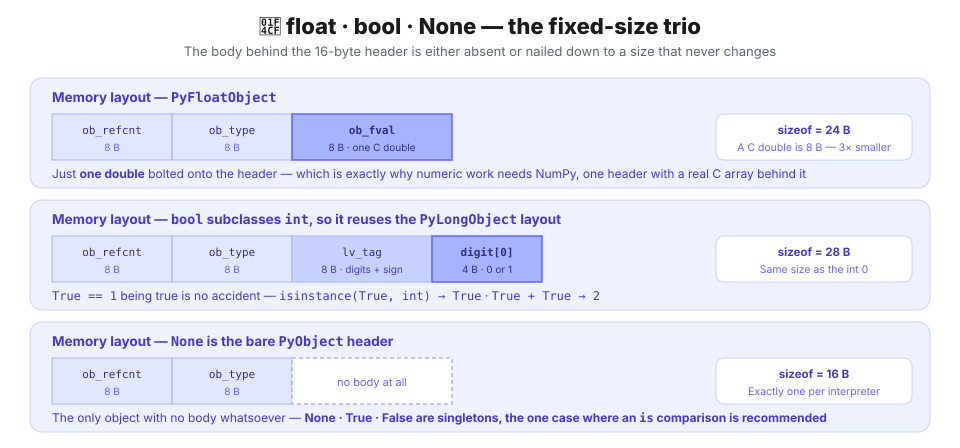

```python
>>> sys.getsizeof(3.14)
24                          # 24 = 16 (header) + 8 (double)
>>> sys.getsizeof(True)
28                          # 28 — bool subclasses int, so it reuses the int layout
>>> sys.getsizeof(None)
16                          # 16 — header only
```

A `float` is just a C `double` bolted onto the header. Eight bytes' worth of data in a 24-byte package, which is exactly why numeric work needs NumPy. A NumPy array keeps one header and puts a **real C array** behind it.

`bool` is a **subclass** of `int`. `True == 1` being true is no accident. And `None`, `True` and `False` are singleton instances that exist exactly once per interpreter, so comparing them with `is` is always the recommended way.

```python
>>> print(isinstance(True, int))
True
>>> True + True
2
```

### 2.3 `str` — compact representation and interning

Strings are the most carefully optimized type in CPython. Since PEP 393 (Flexible String Representation), a string **picks 1, 2 or 4 bytes per character based on its contents.**

```c
/* Include/cpython/unicodeobject.h — comments trimmed */
typedef struct {
    PyObject_HEAD
    Py_ssize_t length;      /* number of code points */
    Py_hash_t hash;         /* cached hash, -1 if not computed */
    struct {
        unsigned int interned:2;   /* interning state */
        unsigned int kind:3;       /* 1 / 2 / 4 bytes */
        unsigned int compact:1;
        unsigned int ascii:1;
        ...
    } state;
} PyASCIIObject;               /* 40 bytes — character data follows immediately */

typedef struct {
    PyASCIIObject _base;
    Py_ssize_t utf8_length;
    char *utf8;                /* cached UTF-8 form */
} PyCompactUnicodeObject;      /* 56 bytes */
```

**"Compact" is the important word.** It means the struct and the character data are **allocated as one block**. Instead of `struct { size_t len; char *data; }` with a pointer to chase, the characters follow directly after the struct. One `malloc`, and better cache locality.

```python
for s in ["", "a", "ab", "abc", "가", "가나", "😀", "가나😂"]:
    print(f"{s!r:>6}  {sys.getsizeof(s):>3} bytes")
```

```text
    ''   41 bytes      ← 40 + 0 + 1 (NUL)
   'a'   42 bytes      ← 40 + 1 + 1
  'ab'   43 bytes
 'abc'   44 bytes
   '가'   60 bytes      ← 56 + 2×(1+1)   UCS2, two bytes per character
  '가나'   62 bytes      ← 56 + 2×(2+1)
   '😀'   64 bytes      ← 56 + 4×(1+1)   UCS4, four bytes per character
  '가나😂'   72 bytes    ← 56 + 4×(3+1)   UCS4, four bytes per character
```

Look at that last string: it mixes Hangul with an emoji. The emoji sits above U+FFFF and needs four bytes, so `kind=4` is chosen for the whole string — and because of that one character, '가' and '나' end up taking four bytes each as well.

> 💡 **Why not mix kinds? — because of the compact representation**
>
> The character data is not linked from the struct by a pointer; it is glued on as one block right behind it. The width has to be fixed for `s[i]` to be found at `base + i*kind` in O(1). If kinds were mixed you would have to count from the front every time, which could make it O(n).

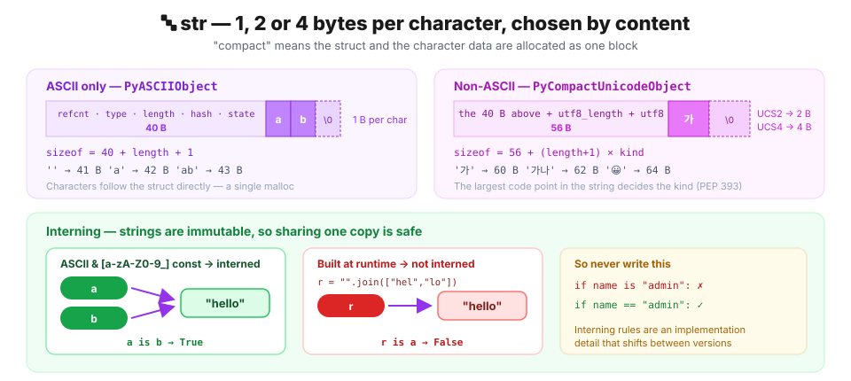

**Interning.** String objects are treated as immutable internally, so keeping one copy of identical content and sharing it is safe. CPython **automatically interns *some* compile-time constant strings.** The word "some" matters — the deciding function sits right there in the source.

> 💡 **What is interning?**
>
> An optimization that stores an immutable object of a given value in memory only once and reuses it, saving memory and making comparison faster.
> [tistory: 잉여 개발자](https://yubi5050.tistory.com/311)

```c
/* Objects/codeobject.c — should_intern_string() (default, GIL-enabled build) */
if (!PyUnicode_IS_ASCII(o))
    return 0;                          /* non-ASCII is never interned */

s = PyUnicode_1BYTE_DATA(o);
e = s + PyUnicode_GET_LENGTH(o);
for (; s != e; s++) {
    if (!Py_ISALNUM(*s) && *s != '_')
        return 0;                      /* one character outside [a-zA-Z0-9_] and it's out */
}
return 1;
```

So only constants that are **ASCII and made up entirely of `[a-zA-Z0-9_]`** — strings that look like identifiers, in practice — get registered in the interpreter-wide table and shared everywhere. Every other constant is left alone, and is merely deduplicated **within a single compilation unit** by the compiler's constant cache.

```python
>>> import sys
...
>>> a = "hello"
>>> b = "hello"
>>> print(a is b)
True                                # "hello" is interned, so they share one object
>>> r = "".join(["hel", "lo"])      # what if we build it at runtime?
>>> print(r == a, r is a)
True False                          # equal in value, but not interned
>>> print(sys.intern(r) is a)
True                                # interning explicitly makes sharing possible
>>>
```

Let us compile the same string twice, separately, within a single interpreter lifetime. That defeats the compiler's constant cache, so only interning is left to observe.

```python
def twice(src):                      # compile the same source twice, separately
    ns1, ns2 = {}, {}
    exec(compile(src, "<u1>", "exec"), ns1) # after compiling into ns1
    exec(compile(src, "<u2>", "exec"), ns2) # compile into ns2
    return ns1["s"] is ns2["s"]

print(twice('s = "hello"'))          # interned
print(twice('s = "hello world"'))    # excluded — it has a space
print(twice('s = "안녕"'))            # excluded — non-ASCII
```

```text
True
False
False
```

`hello` is interned and registered in the global table, so you can see the second compilation sharing the existing object instead of building a new one.

> ⚠️ **So never compare strings with `is`.**
>
>
>  ```python
>  # a.py
>  msg = "hello world"
>
> # b.py
> msg = "hello world"
>
> # main.py
> import a, b
> print(a.msg is b.msg)     # False
> ```
> Say you have two modules, `a.py` and `b.py`. They are compiled separately, so they are different compilation units. If the same "hello world" string appeared twice inside `a.py`, the compiler's constant cache could make `is` return `True`. But the moment you compare across modules in main, it becomes `False`. So use `==` to compare strings.

**Strings are immutable, so every "edit" builds a new object.**

```python
>>> s = "abc"
... before = id(s)
... s += "d"
... print(id(s) == before)
...
False                       # a new object
```

So if you ever need to add characters to an existing string inside a loop, collecting the pieces in a list and using `"".join(parts)` (O(n)) is far cheaper than creating a brand-new string every time with `+=` (O(n²)).

> 💡 **What does "".join(parts) do differently?**
>
> `+=` never knows the final size of the result, so it **builds a new object every time** and copies everything accumulated so far. `join` **walks the list of strings first** to get the total length and `kind`, then **allocates memory once** and copies each character a single time. On top of that, `+=` has to `malloc` a new header whenever the `kind` of the characters changes as it goes, while `join` works out the final string's length and `kind` before allocating — far more efficient.
>
> ```python
> parts = ['a', 'b', 'c', 'd', 'e']
> s = ""
> for x in parts: s += x    # n objects — recopies the whole prefix each time
>
> s = "".join(parts)        # 1 object — measures length·kind first, fills in one pass
> ```
>
> | | Allocations | Total bytes copied |
> | --- | --- | --- |
> | `s += x` × n | n | 1+2+…+n → **O(n²)** |
> | `"".join(parts)` | **1** | n → **O(n)** |

### 2.4 `bytes` · `bytearray` — an immutable/mutable pair

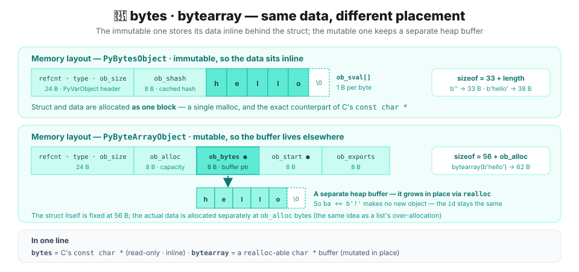

They hold the same kind of data, but one is immutable and one is not. The mutable one carries spare capacity and an extra pointer, so it is bigger.

```python
b  = b"hello"
ba = bytearray(b"hello")

print(sys.getsizeof(b))     # 38  = 33 + 5
print(sys.getsizeof(ba))    # 62

before = id(ba)
ba += b"!"
print(id(ba) == before, ba)  # True bytearray(b'hello!')   ← in-place
```

It is accurate to think of `bytes` as C's `const char *` and `bytearray` as a `realloc`-able `char *` buffer.

### 2.5 `list` — contiguous pointers, not contiguous values

This is where C programmers go most badly wrong. `int arr[10]` puts **ten integers in 40 contiguous bytes**. A Python `list` does not.

```c
/* Include/cpython/listobject.h */
typedef struct {
    PyObject_VAR_HEAD      /* 24 bytes: 16 header + 8 ob_size */
    PyObject **ob_item;    /* pointer to an array of pointers */
    Py_ssize_t allocated;  /* slots reserved (≥ ob_size) */
} PyListObject;
```

**`PyObject **ob_item` — a double pointer.** What is contiguous is **pointers**, not values, and the actual objects are scattered all over the heap.

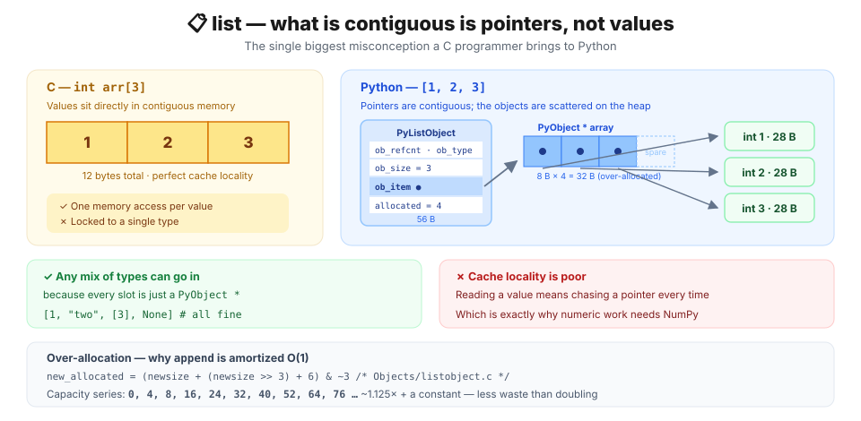

A Python list does not store the values themselves — it stores a pointer to an array of `PyObject*` — so **the size of the list itself has nothing to do with what its elements are**. And because every object in Python inherits `PyObject`, a list can **hold absolutely any type**.

```python
big = "x" * 10_000

small = list((1, 2, 3))
huge  = list((big, big, big))

print(sys.getsizeof(small))   # 88
print(sys.getsizeof(huge))    # 88     ← three 10 KB strings and it is identical
print(sys.getsizeof(big))     # 10041
```

Three pointers are 24 bytes regardless of what they point at. This layout is why a list can **hold any mix of types** (everything is a `PyObject *`) and simultaneously why it has **poor cache locality** (reading a value means chasing a pointer every time).

**Over-allocation.** This is why `append` is amortized O(1). CPython does not grow a list to exactly the size needed; it leaves headroom.

```c
/* Objects/listobject.c
 * The growth pattern is:  0, 4, 8, 16, 24, 32, 40, 52, 64, 76, ... */
new_allocated = ((size_t)newsize + (newsize >> 3) + 6) & ~(size_t)3;
```

Roughly **9/8 plus 6, rounded down to a multiple of 4**. Measure it and the comment's sequence comes right back out.

> 💡 **Breaking the formula apart**
>
> | Piece | What it does |
> | --- | --- |
> | `newsize` | the bare minimum needed now |
> | `newsize >> 3` | shift 3 = ÷8 → **12.5% headroom** (9/8 together) |
> | `+ 6` | below length 8 `>>3` is 0 → guarantees minimum headroom |
> | `& ~3` | clears the low 2 bits → **rounds down to a multiple of 4** |

```python
l, prev = [], -1
for i in range(70):
    l.append(i)
    size = sys.getsizeof(l)
    if size != prev:
        print(f"len={len(l):>3}  sizeof={size:>4}  capacity={(size - 56) // 8}")
        prev = size
```

```text
len=  1  sizeof=  88  capacity=4
len=  5  sizeof= 120  capacity=8
len=  9  sizeof= 184  capacity=16
len= 17  sizeof= 248  capacity=24
len= 25  sizeof= 312  capacity=32
len= 33  sizeof= 376  capacity=40
len= 41  sizeof= 472  capacity=52
len= 53  sizeof= 568  capacity=64
len= 65  sizeof= 664  capacity=76
```

`sizeof = 56 + 8 × capacity`, and the capacities run `0, 4, 8, 16, 24, 32, 40, 52, 64, 76` — an exact match with the source comment. It is similar to the growth-factor strategy you would use writing a dynamic array by hand in C.

> 💡 **The shallow-copy trap.** `l[:]` and `list(l)` build **a new pointer array and nothing more.**
>
> ![Right after a shallow copy orig and copy own different pointer arrays but point at the same inner objects, so mutating orig[0] shows through copy](./image/shallow-copy-trap.en.svg)
>
> ```python
> orig = [[1, 2], [3, 4]]
> copy = orig[:]
>
> print(copy is orig)          # False  — the list objects themselves differ
> print(copy[0] is orig[0])    # True   — the inner element objects are shared!
>
> orig[0].append(99)           # mutate orig[0], and
> print(copy)                  # you can see that mutation through copy [[1, 2, 99], [3, 4]]
> ```

### 2.6 `tuple` — inline storage and a freelist

Tuples hold pointers too, but **they keep them somewhere else.**

```c
/* Include/cpython/tupleobject.h */
typedef struct {
    PyObject_VAR_HEAD
    PyObject *ob_item[1];    /* variable-length array right after the struct */
} PyTupleObject;
```

A list uses `PyObject **ob_item` to point at an array **elsewhere**; a tuple has the array **attached directly behind the struct**. Being immutable, its size can never change, which makes that possible.

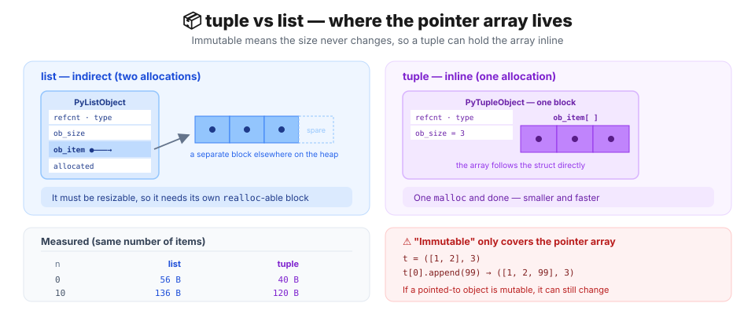

The result is a smaller object, a single allocation, and better cache locality.

```python
for n in (0, 1, 3, 10):
    print(f"n={n:>2}  list={sys.getsizeof(list(range(n))):>4}"
          f"  tuple={sys.getsizeof(tuple(range(n))):>4}")
```

```text
n= 0  list=  56  tuple=  40
n= 1  list=  72  tuple=  48
n= 3  list=  88  tuple=  64
n=10  list= 136  tuple= 120
```

**Freelists.** Small tuples are not handed back to the OS when freed; they go onto a reuse list. You can watch the same address come back over and over.

```python
ids = []
for _ in range(5):
    t = (1, 2, 3)
    ids.append(id(t))
    del t
print(ids)
print("all the same address:", len(set(ids)) == 1)
```

```text
[4368621184, 4368621184, 4368621184, 4368621184, 4368621184]
all the same address: True
```

> ⚠️ Which means **`id()` is only unique among live objects.** Once an object dies, its address gets recycled. Never use `id()` as a durable identifier.

**⚠️ What "tuples are immutable" actually guarantees.** Only that **the pointer array will not change**. If a pointer points at something mutable, that something can change freely.

```python
t = ([1, 2], 3)
t[0].append(99)
print(t)                   # ([1, 2, 99], 3)   ← immutable, and yet
```

And here is the most confusing case of all:

```python
t = ([1, 2, 99], 3)
try:
    t[0] += [100]
except TypeError as e:
    print("TypeError:", e)
print("and yet the list changed:", t)
```

```text
TypeError: 'tuple' object does not support item assignment
and yet the list changed: ([1, 2, 99, 100], 3)
```

**It raised and it still mutated.** `t[0] += [100]` runs in two steps: first `t[0].__iadd__([100])` succeeds and extends the list in place, then the result is stored back with `t[0] =`, which the tuple rejects. Step one has already happened.

> 💡 **Adding with append** raises no error and still adds the value to the list. It looks as if the tuple was modified, but the tuple object was never touched — only the list inside it was.
> ```python
> >>> t = ([1, 2, 99], 3)
> ... try:
> ...     t[0].append(100)
> ... except TypeError as e:
> ...     print("TypeError:", e)
> ... print("final t: ", t)
> ...
> final t:  ([1, 2, 99, 100], 3)
> ```

### 2.7 `dict` — the compact dictionary and insertion order

Since Python 3.7 dictionaries **guarantee insertion order**. That is not a convenience feature; it is a **side effect of a structural change**.

```c
/* Include/cpython/dictobject.h */
typedef struct {
    PyObject_HEAD
    Py_ssize_t ma_used;          /* number of items */
    uint64_t ma_version_tag;
    PyDictKeysObject *ma_keys;   /* index array + entry array */
    PyDictValues *ma_values;     /* NULL → combined; otherwise split (key-sharing) */
} PyDictObject;
```

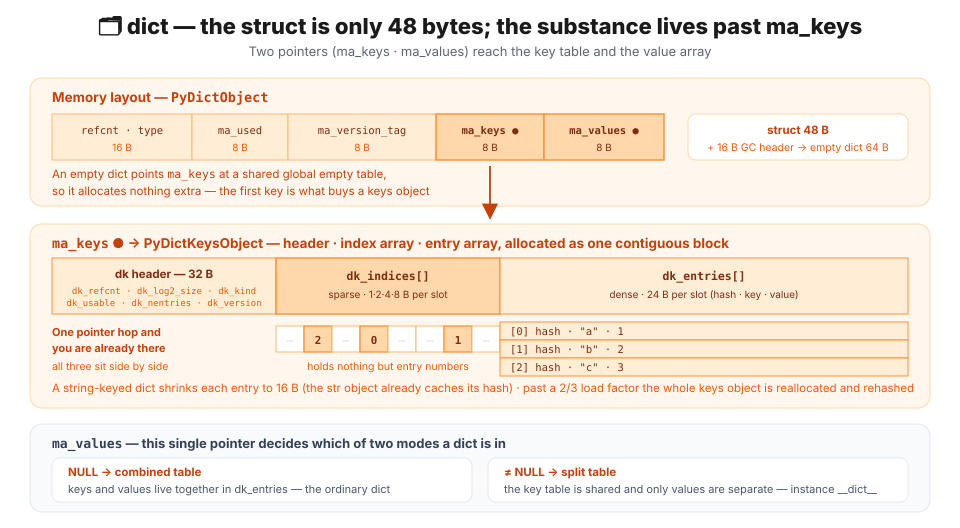

The struct itself is only **48 bytes**. All of the actual data sits behind `ma_keys`, and inside that keys object the **header, index array and entry array are laid out contiguously** in a single allocation.

A traditional hash table drops the whole entry at `hash % size`, so **most of the table is empty slots** and the order is scrambled. The compact dictionary splits that into two arrays:

- **Index array** — sparse, but its elements are small integers (1, 2, 4 or 8 bytes), so the waste is tiny.
- **Entry array** — dense, stacking `(hash, key, value)` in insertion order.

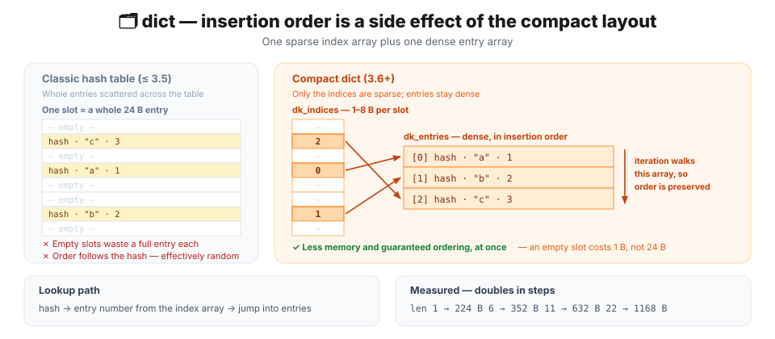

A lookup reads an entry number from the index array and jumps into the entry array. And because the entry array is **already in insertion order**, iterating naturally yields insertion order. Ordering came for free.

```python
d, prev = {}, -1
for i in range(40):
    d[i] = i
    size = sys.getsizeof(d)
    if size != prev:
        print(f"len={len(d):>3}  sizeof={size}")
        prev = size

print(list({"b": 1, "a": 2, "c": 3}))    # ['b', 'a', 'c'] — insertion order
```

```text
len=  1  sizeof=224
len=  6  sizeof=352
len= 11  sizeof=632
len= 22  sizeof=1168
```

Notice it does not grow smoothly like a list but **doubles in steps**. Once a hash table's load factor passes 2/3 it is rebuilt from scratch and everything is rehashed.

### 2.8 `set` · `frozenset` — a hash table with entries only

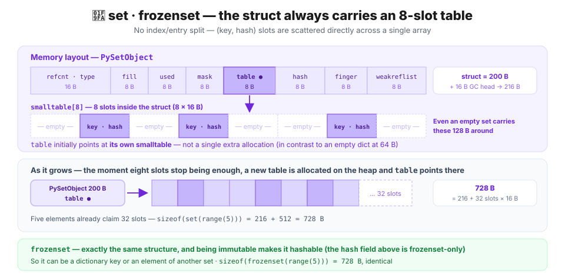

Sets have no values, so they are simpler than dictionaries. But they do not use the compact layout — they keep a plain **open-addressing hash table**. Instead of splitting into an index array and an entry array, they scatter `(key, hash)` slots directly across one array.

```c
/* Include/cpython/setobject.h */
#define PySet_MINSIZE 8

typedef struct {
    PyObject *key;
    Py_hash_t hash;                       /* cached hash */
} setentry;                               /* 16 bytes */

typedef struct {
    PyObject_HEAD
    Py_ssize_t fill;                      /* active + dummy slots */
    Py_ssize_t used;                      /* active slots */
    Py_ssize_t mask;                      /* table size - 1 */
    setentry *table;
    Py_hash_t hash;                       /* frozenset only */
    Py_ssize_t finger;                    /* search finger for pop() */
    setentry smalltable[PySet_MINSIZE];   /* an 8-slot table embedded in the struct itself */
    PyObject *weakreflist;
} PySetObject;
```

That is why an empty set is so big: the struct **always carries an 8-slot `smalltable` (8 × 16 = 128 bytes)** around with it. An empty dictionary, by contrast, just points `ma_keys` at the one interpreter-wide empty-keys object, so it stops at 64 bytes.

```python
print(sys.getsizeof(set()))                # 216  = 200 (struct incl. smalltable) + 16 (GC head)
print(sys.getsizeof(set(range(5))))        # 728  — 5 elements already moved it to a 32-slot table
print(sys.getsizeof(frozenset(range(5))))  # 728  — same structure
```

`frozenset` is the immutable version of `set`. Being immutable makes it **hashable**, so it can be a dictionary key or an element of another set.

```python
{frozenset({1, 2}): "ok"}      # a frozenset works fine
{ {1, 2}: "no" }               # a plain set does not. TypeError: unhashable type: 'set'
```

### 2.9 User-defined classes — `__dict__` versus `__slots__`

By default an instance keeps **its attributes in a dictionary**, which is why you can attach arbitrary attributes later. The price is one dictionary per instance.

```python
class Plain:
    def __init__(self):
        self.x = 1
        self.y = 2

class Slotted:
    __slots__ = ("x", "y")       # fix the attribute names up front
    def __init__(self):
        self.x = 1
        self.y = 2
```

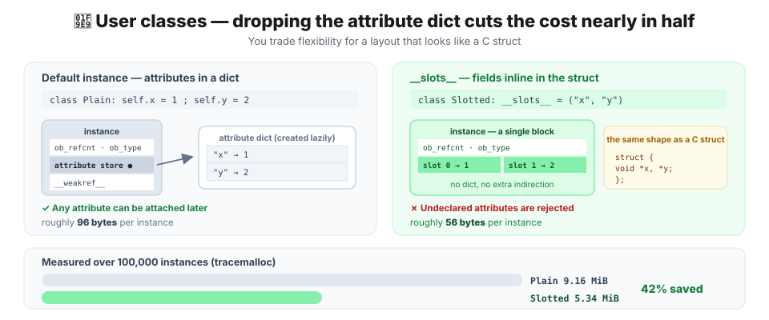

Declaring `__slots__` replaces the dictionary with **fixed slots in the struct** — essentially the layout of a C struct. In return, undeclared attributes are rejected.

```python
p, s = Plain(), Slotted()

p.z = 3                          # fine
try:
    s.z = 3
except AttributeError as e:
    print("AttributeError:", e)
```

```text
AttributeError: 'Slotted' object has no attribute 'z' and no __dict__ for setting new attributes
```

**Be careful how you measure this.** Do not use `sys.getsizeof(p.__dict__)`. Python 3.11+ creates the instance dictionary **lazily** (an optimization layered on PEP 412's key-sharing dictionaries), and merely touching `__dict__` **forces it into existence**. The observation changes the thing observed.

To measure honestly, use `tracemalloc` and look at real allocations:

```python
import tracemalloc

N = 100_000
tracemalloc.start()

objs = [Plain() for _ in range(N)]
plain, _ = tracemalloc.get_traced_memory()
del objs

objs = [Slotted() for _ in range(N)]
slotted, _ = tracemalloc.get_traced_memory()
tracemalloc.stop()

print(f"Plain   × {N:,}: {plain / 1024 / 1024:.2f} MiB")
print(f"Slotted × {N:,}: {slotted / 1024 / 1024:.2f} MiB")
```

```text
Plain   × 100,000: 9.16 MiB
Slotted × 100,000: 5.34 MiB
```

About 96 bytes down to 56 per instance — **42% saved** (the list itself eats 8 bytes per element, so the gap between the objects alone is wider).

> 💡 `__slots__` earns its keep when you build **hundreds of thousands of same-shaped objects**. Adding it to a class you instantiate a handful of times only costs you flexibility. And plenty of articles compute the saving from `sys.getsizeof(obj.__dict__)`, which for the reason above **overstates it**.

### 2.10 Shallow copy and deep copy

Put everything above together and it is obvious why there are two kinds of copy. A container holds pointers, so the question is **whether to copy just the pointers or the things they point at**.

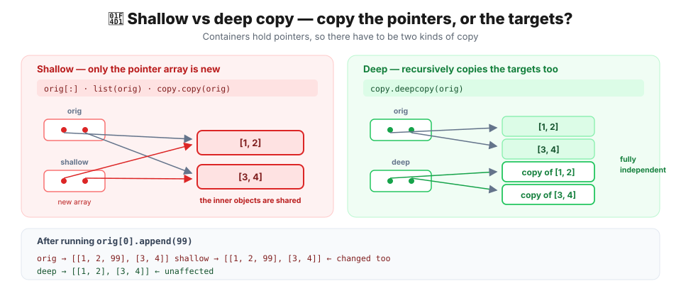

```python
import copy

orig = [[1, 2], [3, 4]]

shallow = copy.copy(orig)       # = orig[:] = list(orig)
deep    = copy.deepcopy(orig)

print("shallow[0] is orig[0]:", shallow[0] is orig[0])   # True
print("deep[0]    is orig[0]:", deep[0]    is orig[0])   # False

orig[0].append(99)
print("orig   :", orig)
print("shallow:", shallow)
print("deep   :", deep)
```

```text
shallow[0] is orig[0]: True
deep[0]    is orig[0]: False
orig   : [[1, 2, 99], [3, 4]]
shallow: [[1, 2, 99], [3, 4]]
deep   : [[1, 2], [3, 4]]
```

| Method | What it does | Nested objects |
| --- | --- | --- |
| `b = a` | Adds a name | Fully shared |
| `a[:]` · `list(a)` · `copy.copy(a)` | Copies the pointer array | Shared |
| `copy.deepcopy(a)` | Copies everything recursively | Independent |

> 💡 `deepcopy` handles reference cycles too (it remembers what it has visited and reuses it). In exchange it is slow, and you can customize it with `__deepcopy__`. **If a structure contains only immutable objects, a shallow copy is enough** — nobody can change them anyway.

---

## 🎯 One sentence

> **Python has no primitive types. It has objects that start with a 16-byte header, and a per-type body attached behind it.**

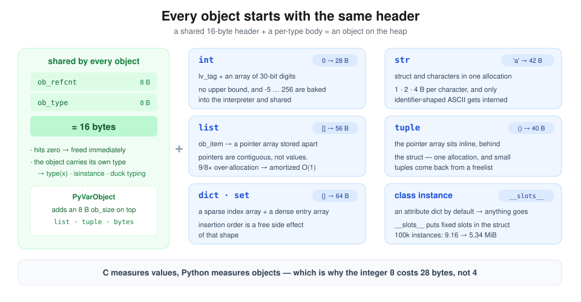

- Every object starts with an `ob_refcnt` + `ob_type` **16-byte header** → that is what makes `type(x)`, `isinstance()` and duck typing work at runtime, and what makes the integer `0` cost **28 bytes** instead of 4
- `int` is an **array of 30-bit digits**, so it has no upper bound, and `-5 … 256` are baked statically into the interpreter and shared by everyone
- `str` uses a **compact representation** (struct and character data allocated as one block) picking 1, 2 or 4 bytes per character, and only ASCII constants made of `[a-zA-Z0-9_]` get interned
- `list` stores **pointers contiguously, not values** (hence the free mixing of types and the poor cache locality), while `tuple` attaches that array **directly behind** the struct
- `dict` is split into a **sparse index array plus a dense entry array**, and insertion order is a free side effect of that shape
- Because containers hold pointers, **shallow and deep copies** are two different things

> 💡 One `sizeof` sums it up: **C measures values, Python measures objects.** Which is exactly why numeric work needs NumPy, where one header is followed by a real C array.

The rest of the series covers how names get attached to these objects ([② A variable is a name tag, not a box](/posts/python/variables-are-name-tags)), what happens once more than one name is attached ([③ Aliasing](/posts/python/alias-and-mutability)), and when and how objects finally disappear ([④ Reference counting and pymalloc](/posts/python/refcount-gc-and-pymalloc)).

---

## 📚 References

**Official Python documentation**

- [The Python Language Reference — Data model](https://docs.python.org/3/reference/datamodel.html) — objects, values and types
- [Python/C API — Object Structures](https://docs.python.org/3/c-api/structures.html) — `PyObject`, `PyVarObject`
- [Python/C API — Type Objects](https://docs.python.org/3/c-api/typeobj.html) — what `ob_type` points at
- [`sys.getsizeof` · `sys.intern`](https://docs.python.org/3/library/sys.html)
- [`copy` — Shallow and deep copy operations](https://docs.python.org/3/library/copy.html)
- [`tracemalloc` — Trace memory allocations](https://docs.python.org/3/library/tracemalloc.html)
- [`ctypes` — A foreign function library for Python](https://docs.python.org/3/library/ctypes.html)
- [What's New In Python 3.12](https://docs.python.org/3.12/whatsnew/3.12.html) — the release where `int` stopped being a `PyVarObject`

**PEPs**

- [PEP 393 — Flexible String Representation](https://peps.python.org/pep-0393/) — the 1/2/4-byte representations of `str`
- [PEP 412 — Key-Sharing Dictionary](https://peps.python.org/pep-0412/) — key sharing for instance dictionaries
- [PEP 468 — Preserving the order of `**kwargs`](https://peps.python.org/pep-0468/) — how dictionary ordering became part of the language

**CPython source (every struct in this article is quoted from here — all links point at the `3.13` branch)**

- [`Include/object.h`](https://github.com/python/cpython/blob/3.13/Include/object.h) — `PyObject`, `PyVarObject`
- [`Include/cpython/longintrepr.h`](https://github.com/python/cpython/blob/3.13/Include/cpython/longintrepr.h) — `_PyLongValue`, the 30-bit `digit`
- [`Include/internal/pycore_global_objects.h`](https://github.com/python/cpython/blob/3.13/Include/internal/pycore_global_objects.h) — the `small_ints` cache
- [`Include/cpython/unicodeobject.h`](https://github.com/python/cpython/blob/3.13/Include/cpython/unicodeobject.h) — the four string representations
- [`Objects/codeobject.c`](https://github.com/python/cpython/blob/3.13/Objects/codeobject.c) — `should_intern_string()` (the constant-interning rule)
- [`InternalDocs/string_interning.md`](https://github.com/python/cpython/blob/3.13/InternalDocs/string_interning.md) — singletons and dynamic interning
- [`Objects/listobject.c`](https://github.com/python/cpython/blob/3.13/Objects/listobject.c) — the over-allocation formula
- [`Objects/tupleobject.c`](https://github.com/python/cpython/blob/3.13/Objects/tupleobject.c) — the freelist
- [`Objects/dictobject.c`](https://github.com/python/cpython/blob/3.13/Objects/dictobject.c) · [`Include/internal/pycore_dict.h`](https://github.com/python/cpython/blob/3.13/Include/internal/pycore_dict.h) — the compact dictionary, `USABLE_FRACTION`
- [`Include/cpython/setobject.h`](https://github.com/python/cpython/blob/3.13/Include/cpython/setobject.h) — `PySetObject`, `smalltable`

**Books and talks**

- Anthony Shaw, *CPython Internals* (Real Python, 2021) — object implementations at source level
- Luciano Ramalho, *Fluent Python*, 2nd ed. (O'Reilly, 2022) — chapter 6, "Object References, Mutability, and Recycling"
- [Raymond Hettinger, "Modern Dictionaries" (PyCon 2017)](https://www.youtube.com/watch?v=p33CVV29OG8) — the compact dictionary explained by its designer
