> 📚 **Python 메모리 4부작 (1/4)** — **① 모든 것은 객체다** · [② 변수는 상자가 아니라 이름표다](/posts/python/02-variables-are-name-tags) · [③ alias — 이름 둘이 객체 하나를 가리킬 때](/posts/python/03-alias-and-mutability) · [④ 객체는 언제 사라지나](/posts/python/04-refcount-gc-and-pymalloc)

## 들어가며 — Python에는 원시 타입이 하나도 없습니다

C를 먼저 배운 사람이 Python 메모리 이야기를 들으면 제일 먼저 걸리는 지점이 있습니다. C에는 `int`·`double`·`char` 같은 **원시 타입**이 있는데, Python에는 그게 **하나도 없다**는 사실입니다.

`5`도, `True`도, `None`도 전부 힙에 할당된 **객체**입니다. 그리고 모든 객체는 예외 없이 똑같이 생긴 **16바이트 헤더**로 시작합니다. `sys.getsizeof(0)`이 4가 아니라 28을 돌려주는 것도, `type(x)`가 런타임에 동작하는 것도, 리스트에 아무 타입이나 섞어 담을 수 있는 것도 전부 이 헤더가 있기 때문에 가능한 것입니다.

> 💡 C에서 타입은 **컴파일이 끝나면 증발**하지만, Python에서 타입은 **객체가 직접 들고 다니는 8바이트 포인터**입니다. 이 한 줄이 이 글 전체를 관통합니다.

이 글은 두 부분으로 구성됩니다. 우선 **모든 객체가 공유하는 헤더**를 직접 뜯어보고, 뒤에서는 자료형 별로 그 헤더 뒤에 붙는 **몸통(body)**을 하나씩 살펴보겠습니다.
- `int`의 30비트 자릿수, 
- `str`의 컴팩트 표현과 인터닝, 
- `list`와 `tuple`의 포인터 배열, 
- `dict`의 컴팩트 구조, 
- `__slots__`, 
- 그리고 **얕은 복사와 깊은 복사**까지 살펴보겠습니다.

> 📌 이 글의 모든 숫자는 아래 환경에서 **실제로 돌려서 얻은 값**입니다. 몇몇 값은 플랫폼(32/64비트)과 버전에 따라 달라질 수 있습니다.
>
> ```text
> Python 3.13.12 (main, Feb  3 2026) [Clang 17.0.0]
> macOS 26.5 · arm64 · 64-bit
> ```

---

## 🧱 1. 모든 것은 객체다 — PyObject 해부

### C에는 원시 타입이 있고, Python에는 없습니다

C에서 `int`, `double`, `char` 타입은 **값 그 자체**입니다. `int a = 5;`가 차지하는 4바이트에는 5라는 비트 패턴만 들어 있을 뿐, "나는 정수다"라고 알려주는 꼬리표가 옆에 함께 저장되지는 않습니다. 그 4바이트를 어떻게 읽을지는 컴파일러가 선언문을 보고 정해서 기계어에 박아 넣는 것이고, 컴파일이 끝나고 기계어에서 그 시작주소에 있는 값이 정수형이라는 타입 정보 자체는 사라집니다. 그래서 `*(float *)&a`처럼 캐스팅하면 같은 메모리를 군말 없이 float으로 읽을 수 있는 겁니다. 즉, 비트는 그대로인데 해석하는 방법만 바뀐 겁니다. 

이미 컴파일된 C 프로그램에서 런타임에 4바이트짜리 `int`를 보고 "이게 정수인지 float인지"를 되물을 방법은 없습니다. 그 정보는 컴파일러의 머릿속에만 있습니다.

하지만 Python에는 원시 타입이 **하나도 없습니다.** `5`도, `True`도, `None`도 전부 똑같이 힙에 할당된 **객체**입니다. 그리고 모든 객체는 예외 없이 같은 헤더로 시작합니다.

```c
/* CPython 3.13 — Include/object.h (조건부 컴파일 부분 생략) */
struct _object {
    union {
        Py_ssize_t  ob_refcnt;         /* 참조 카운트 */
        PY_UINT32_T ob_refcnt_split[2];
    };
    PyTypeObject *ob_type;             /* 타입 객체를 가리키는 포인터 */
};
```

그러면 `ob_type`이 가리키는 `PyTypeObject`는 어떻게 생겼을까요? 필드가 90개가 넘는 큰 구조체라, 지금 이야기에 필요한 것만 추려서 보겠습니다.

```c
/* CPython 3.13 — Include/cpython/object.h (필드 90여 개 중 일부만) */
struct _typeobject {
    PyObject_VAR_HEAD                      /* 타입 객체도 객체다 — 위 헤더를 그대로 갖는다 */
    const char *tp_name;                   /* "int", "list" — 출력에 쓰는 타입 이름 */
    Py_ssize_t tp_basicsize, tp_itemsize;  /* 인스턴스 고정 크기 / 가변부 원소 하나의 크기 */

    destructor tp_dealloc;                 /* refcnt가 0이 됐을 때 불리는 소멸자 */
    /* … 생략 … */
    reprfunc tp_repr;                      /* repr(x) */

    PyNumberMethods   *tp_as_number;       /* +  -  *  /  … 숫자 연산 묶음 */
    PySequenceMethods *tp_as_sequence;     /* len(x), x[i], x in y … */
    PyMappingMethods  *tp_as_mapping;      /* x[key] */

    hashfunc     tp_hash;                  /* hash(x) */
    ternaryfunc  tp_call;                  /* x(...) */
    reprfunc     tp_str;                   /* str(x) */
    getattrofunc tp_getattro;              /* x.attr */
    setattrofunc tp_setattro;              /* x.attr = v */
    /* … 생략 … */
    unsigned long tp_flags;                /* 타입의 성질 비트(순환 GC 대상인가 등) */
    const char *tp_doc;                    /* 독스트링 */

    traverseproc tp_traverse;              /* 순환 GC가 자식 객체를 훑을 때 */
    inquiry      tp_clear;                 /* 순환 GC가 참조를 끊을 때 */
    richcmpfunc  tp_richcompare;           /* ==  <  > … */
    /* … 생략 … */
    getiterfunc  tp_iter;                  /* iter(x) */
    iternextfunc tp_iternext;              /* next(x) */

    PyMethodDef  *tp_methods;              /* 메서드 테이블 */
    PyTypeObject *tp_base;                 /* 부모 타입 */
    PyObject     *tp_dict;                 /* 클래스 네임스페이스 */
    /* … 생략 … */
    initproc  tp_init;                     /* __init__ */
    allocfunc tp_alloc;                    /* 메모리 확보 */
    newfunc   tp_new;                      /* __new__ */
    freefunc  tp_free;                     /* 메모리 반납 */
    /* … 생략 … */
    PyObject *tp_mro;                      /* 메서드 탐색 순서(MRO) */
    /* … 생략 … */
};

typedef struct _typeobject PyTypeObject;
```

첫 줄이 `PyObject_VAR_HEAD`인 걸 보세요. **타입 객체 자신도 `ob_refcnt`와 `ob_type`을 가진 평범한 객체입니다.** `type(5)`가 `<class 'int'>`라는 *객체*를 돌려주고, 거기에 다시 `type()`을 걸면 `<class 'type'>`이 나오는 이유가 이겁니다. 타입이라는 타입이 있는 거죠 😂

```python
>>> type(5)
<class 'int'>
>>> type(type(5))
<class 'type'>
>>> id(type(5)) == id(int)
True
>>> id(type(type(5))) == id(type)
True
```

다시 `PyObject` 헤더로 돌아오죠. 64비트에서 `Py_ssize_t`가 8바이트, 포인터가 8바이트니 **헤더는 정확히 16바이트**입니다. 그리고 이 두 필드가 Python이라는 언어의 성격을 거의 다 결정합니다.

- **`ob_refcnt`** — 이 객체를 가리키는 참조가 몇 개인지. 이게 0이 되면 객체는 즉시 해제됩니다. Python에 `free()`가 없는 이유입니다.
- **`ob_type`** — 자기 타입 객체를 가리키는 포인터. **값이 자기 타입을 직접 들고 다닙니다.** C에서 타입이 컴파일 타임에 증발하는 것과 정확히 반대입니다. python에서 쓸 수 있는 `type(x)`, `isinstance()`, 덕 타이핑, 연산자 오버로딩이 전부 이 8바이트 `ob_type` 덕분에 가능한 겁니다.

`list`·`tuple`·`bytes`·`bytearray`처럼 해당 자료형에 원소 개수 정보를 갖고있어야 하는 객체는 여기에 `ob_size`라는 필드를 하나 더 답니다.

```c
typedef struct {
    PyObject ob_base;      /* 위의 16바이트 헤더 */
    Py_ssize_t ob_size;    /* 가변부의 원소 개수 */
} PyVarObject;
```

> 💡 **`str`과 `int`는 길이가 가변인데도 `PyVarObject`가 아닙니다.** 둘 다 `ob_size` 대신 자기만의 필드로 길이를 관리합니다 — `str`은 `length`, `int`는 자릿수와 부호를 함께 담는 `lv_tag`입니다. `int`는 원래 `PyVarObject`였는데 **3.12에서 바뀌었습니다.** 실제 구조는 [2.1절](#21-int--무한-확장-가능)과 [2.3절](#23-str--컴팩트-표현과-인터닝)에서 소스로 확인합니다.

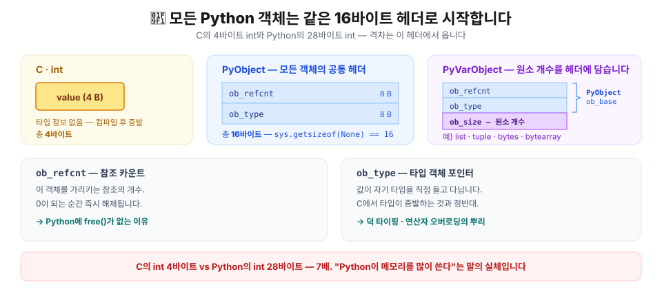

### 16바이트 헤더를 코드로 확인하기

`None`은 아무 데이터도 없는 싱글턴이라 **헤더뿐인 객체**입니다. 크기를 재보면 정확히 16이 나옵니다. (방금 위에서 PyObject는 파이썬에서 모든 객체가 갖고있는 헤더라고 했죠?)

```python
import sys

for v in [None, True, 0, 2**100, 3.14, "", "a", b"", [], (), {}, set()]:
    print(f"{type(v).__name__:>9}  {sys.getsizeof(v):>4} bytes   {v!r:.20}")
```

```text
 NoneType    16 bytes   None
     bool    28 bytes   True
      int    28 bytes   0
      int    40 bytes   12676506002282294014
    float    24 bytes   3.14
      str    41 bytes   ''
      str    42 bytes   'a'
    bytes    33 bytes   b''
     list    56 bytes   []
    tuple    40 bytes   ()
     dict    64 bytes   {}
      set   216 bytes   set()
```

여기서 이미 C와의 차이가 드러납니다. **C의 `int`는 4바이트, Python의 정수 `0`은 28바이트로 7배입니다.** 빈 리스트는 원소가 하나도 없는데 56바이트를 씁니다. Python이 C보다 메모리를 많이 쓴다는 말은 막연한 인상이 아니라 이 헤더에서 오는 구조적 비용인거죠.

> 💡 `sys.getsizeof()`는 **그 객체 자체**의 크기만 알려줍니다. 컨테이너라면 안에 든 객체들의 크기는 포함되지 않습니다. 왜 그런지는 [리스트 절](#25-list--연속된-값이-아니라-연속된-포인터)에서 명확해집니다.

### `id()`는 객체의 메모리 주소입니다

CPython에서 `id(obj)`는 **객체의 메모리 주소**입니다. 주소를 알면 C 구조체를 직접 읽을 수 있으니, `ctypes`로 헤더를 뜯어봅시다.

```python
import ctypes, sys

x = ["some", "list"]
addr = id(x)    # 객체의 시작 주소

print("id(x)          =", hex(addr))                  
print("getrefcount    =", sys.getrefcount(x) - 1)     # -1: 인자로 넘기며 생긴 임시 참조 제외
print("*(Py_ssize_t*)addr =", ctypes.c_ssize_t.from_address(addr).value)  # 그 시작 주소(addr)부터 8바이트(ob_ref_cnt)를 부호있는 정수로 읽기

y = x                                                  # 객체에 alias 하나 추가
print("y = x 후 다시   =", ctypes.c_ssize_t.from_address(addr).value) # 그 시작 주소(addr)부터 8바이트(ob_ref_cnt)를 부호있는 정수로 읽기 -> 2가 나옴

# 헤더의 두 번째 8바이트는 ob_type
print("ob_type == id(list):",
      ctypes.c_void_p.from_address(addr + 8).value == id(list))
```

```text
id(x)          = 0x1044cc880    // ["some", "list"] 객체의 시작 주소는 0x1044cc880
getrefcount    = 1              // 그 객체를 참조하는 변수의 개수는 1개
*(Py_ssize_t*)addr = 1          // 그 객체의 시작 주소부터 처음 8byte 값은 1. 즉, ob_ref_cnt == 1
y = x 후 다시   = 2               // alias를 하나 추가하니 ob_ref_cnt == 2
ob_type == id(list): True       // 그 다음 8byte(ob_type)를 읽어보니 list 객체 타입의 시작주소와 동일.
```
 
`["some", "list"]` 객체의 시작 주소에서 8바이트를 읽었더니 `sys.getrefcount()`랑 같은 값이 나오고, 그다음 8바이트는 바로 `list` 타입 객체의 주소입니다. 아까 본 PyObject 구조체가 메모리에 그대로 놓여 있다는 것을 코드로 확인할 수 있었습니다.

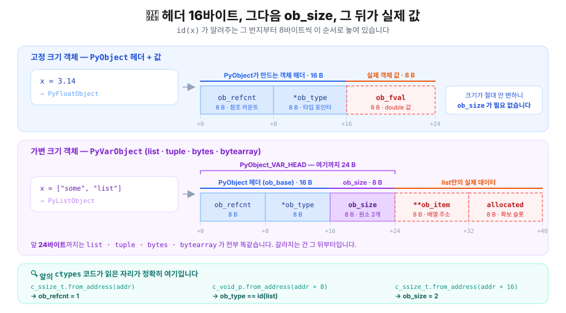

> ⚠️ `ctypes.from_address()`는 안전장치가 전혀 없는 생포인터 접근입니다. 구조를 눈으로 확인하는 실험용으로만 쓰시고, 실제 코드에 넣지 마세요. 잘못 쓰면 인터프리터가 그대로 죽습니다.

---

## 📦 2. 자료형별 메모리 내부

헤더는 모든 객체가 똑같이 갖고 있습니다. 다른 건 그 뒤에 붙는 **몸통**이죠. 각 자료형이 힙에서 실제로 어떤 모양인지, 그리고 그 모양이 성능과 함정으로 어떻게 이어지는지 파헤쳐보겠습니다.

### 2.1 `int` — 무한 확장 가능

Python의 정수에는 상한이 없습니다. `2**10000`도 그냥 됩니다. C에서 `int`가 4byte(32bit) 크기에 한정되어있어 `2**31`까지만 표현할 수 있는 거랑 다르죠? 이게 어떻게 가능한 걸까요?

```c
/* CPython 3.13 — Include/cpython/longintrepr.h */
typedef struct _PyLongValue {
    uintptr_t lv_tag;      /* 자릿수 개수 + 부호 + 플래그 */
    digit ob_digit[1];     /* 가변 길이 자릿수 배열 */
} _PyLongValue;

struct _longobject {
    PyObject_HEAD          /* 16바이트 */
    _PyLongValue long_value;
};
```

핵심은 `ob_digit` 리스트 안에 들어가는 **`digit` 원소 하나가 30비트**의 수를 담는다는 점입니다(64비트 빌드 기준, digit 원소는 uint32_t로서 32bit 크기를 갖지만, 앞 2bit는 곱셈을 위해 비워둔다). 큰 수는 30비트씩 쪼개서 배열에 넣습니다. 즉 Python의 정수는 사실상 **BigNum 구현체**이고, 작은 정수도 예외 없이 같은 구조를 씁니다.

크기를 재보면 계산이 딱 맞습니다.

```python
import sys

for n in [0, 1, 2**29, 2**30, 2**59, 2**60, 2**100]:
    print(f"{n:<32} {sys.getsizeof(n)} bytes")
```

```text
0                                28 bytes
1                                28 bytes
536870912                        28 bytes      ← 2**29, 30비트 안에 들어감
1073741824                       32 bytes      ← 2**30, ob_digit에 digit 원소 2개 필요
576460752303423488               32 bytes      ← 2**59, 아직 60비트 안에 들어감
1152921504606846976              36 bytes      ← 2**60, digit 원소 3개 필요
1267650600228229401496703205376  40 bytes      ← 2**100, digit 원소 4개 필요
```

`16(헤더) + 8(lv_tag) + 4 × 자릿수 = 28, 32, 36, 40 byte…` 정확히 30비트마다 4바이트씩 메모리 용량이 늘어납니다.

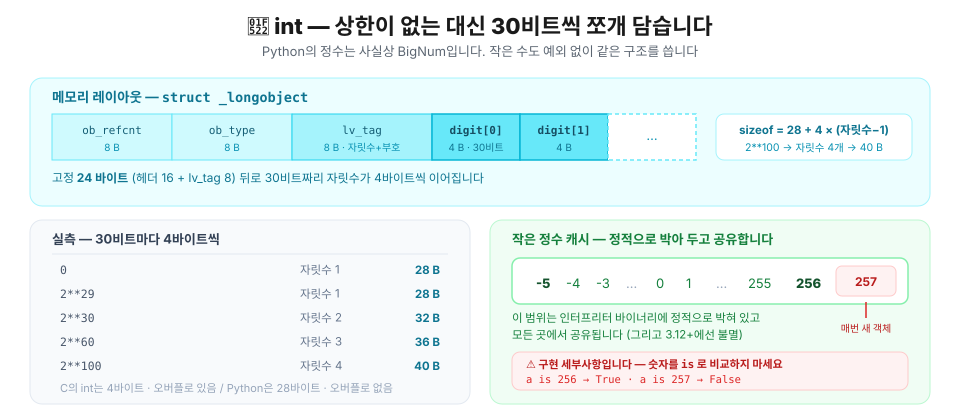

방금 살펴봤듯, python에서 int는 아무리 작은 정수라도 무조건 최소 28byte를 필요로 합니다. 그래서 python에서는 **작은 정수 캐시**를 도입했습니다. 

정수 하나 만들 때마다 28바이트를 할당하면 감당이 안 되니, CPython은 **`-5`부터 `256`까지의 정수 객체를 인터프리터 바이너리에 정적으로 박아 두고 모두가 공유합니다.** 런타임에 만드는 게 아니라 처음부터 객체를 만들어 놓고 돌려 쓰는 겁니다.

```c
/* Include/internal/pycore_global_objects.h */
#define _PY_NSMALLPOSINTS           257
#define _PY_NSMALLNEGINTS           5
/* -_PY_NSMALLNEGINTS(포함) ~ _PY_NSMALLPOSINTS(미포함) 범위를 정적 배열로 들고 있다 */
PyLongObject small_ints[_PY_NSMALLNEGINTS + _PY_NSMALLPOSINTS];
```

```python
for n in (-6, -5, -1, 0, 255, 256, 257, 1000):
    a = n
    b = int(str(n))           # 확실히 새로 만들게 우회
    print(f"{n:>5}  a is b → {a is b}")
```

```text
   -6  a is b → False
   -5  a is b → True
   -1  a is b → True
    0  a is b → True
  255  a is b → True
  256  a is b → True
  257  a is b → False
 1000  a is b → False
```
`is` 비교로 True가 나왔다는 건 시작 메모리 주소가 같다는 겁니다. 즉 -5부터 256까지는 캐시를 사용한다는 거죠. 

> 💡 **왜 하필 `-5 ~ 256`일까?**
>
> "어차피 29비트까지의 정수는 다 28바이트인데, 이왕이면 `2**29`까지 캐시를 두면 낫지 않나?" 싶을 수 있습니다. 하지만 캐시는 **정적 배열**이라 **쓰든 안 쓰든** 범위 전체가 메모리를 차지합니다. 게다가 캐시된 정수는 연속된 배열이라, 각 요소의 주소 간격이 곧 객체 하나의 실제 크기입니다.
>
> ```python
> >>> id(1) - id(0)
> 32                    # 28이 아니라 32 — 8바이트 정렬 패딩이 붙는다
> >>> id(256) - id(0)
> 8192                  # 배열 전체가 딱 8 KiB
> ```
>
> 만약 `2**29`까지 캐시 범위를 넓힌다면 **상시 점유 메모리가 16 GiB**가 됩니다. 게다가 이건 인터프리터 바이너리에 들어가는 정적 데이터라, 디스크의 실행 파일 크기도 그만큼 커져야 합니다.
>
> 또한 지금은 **8 KiB**라 CPU의 L1 캐시에 통째로 들어가지만, 16 GiB는 어림도 없습니다. 실제로 쓰이는 정수는 인덱스·카운터처럼 작은 값에 쏠려 있어서, 범위를 넓혀도 적중률은 거의 안 오르고 캐시 지역성만 잃습니다.
>
> 그렇다면 **굳이 왜 `-5`부터 `256`까지**일까요?
>
> - **위쪽 `256`** — `bytes`/`bytearray`를 인덱싱하면 항상 `0~255`가 나옵니다. 바이트 값 전체를 커버할 수 있고, `256`은 경계값으로 흔하니 하나 더 얹은 겁니다.
> - **아래쪽 `-5`** — `-1`이 압도적으로 흔하고(`lst[-1]`, C 함수의 에러 반환값, `find()` 실패), `-2`~`-5`는 덤입니다.
>
> 그리고 캐시의 목적은 애초에 **크기 절약이 아닙니다.** `5`를 캐시한다고 그 객체가 28바이트보다 작아지지 않습니다. 캐시가 없애는 건 **할당·해제에 드는 비용**입니다 — `for i in range(10**7)` 같은 루프에서 `malloc`/`free`를 천만 번 하지 않게 하는 것이죠.

### 2.2 `float` · `bool` · `None` — 고정 크기 3인방

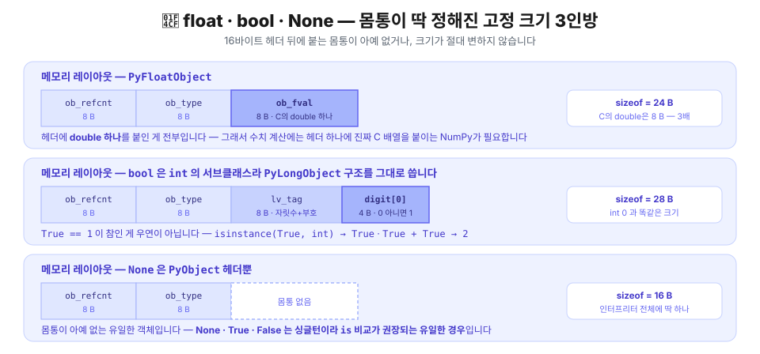

```python
>>> sys.getsizeof(3.14)     
24                          # 24 = 16(헤더) + 8(double)
>>> sys.getsizeof(True)
28                          # 28 — bool은 int의 서브클래스라 int 구조를 그대로 씀
>>> sys.getsizeof(None)
16                          # 16 — 헤더뿐   
```

`float`는 C의 `double` 하나를 헤더에 붙인 게 전부입니다. C에서 8바이트면 되는 걸 24바이트에 담는 셈이고, 그래서 수치 계산에 NumPy가 필요합니다. NumPy 배열은 헤더를 하나만 두고 그 뒤에 **진짜 C 배열**을 놓습니다.

`bool`은 `int`의 **서브클래스**입니다. `True == 1`이 참인 게 우연이 아닙니다. 또한, `None`, `True`, `False`는 각각 인터프리터 전체에 딱 하나씩만 존재하는 싱글턴 인스턴스라 항상 `is`로 비교하는 게 권장됩니다.

```python
>>> print(isinstance(True, int))   
True
>>> True + True
2
```

### 2.3 `str` — 컴팩트 표현과 인터닝

문자열은 CPython에서 가장 정교하게 최적화된 자료형입니다. PEP 393(Flexible String Representation) 이후 문자열은 **내용에 따라 문자당 1·2·4바이트를 골라 씁니다.**

```c
/* Include/cpython/unicodeobject.h — 주석 정리 */
typedef struct {
    PyObject_HEAD
    Py_ssize_t length;      /* 코드포인트 개수 */
    Py_hash_t hash;         /* 캐시된 해시, 미계산이면 -1 */
    struct {
        unsigned int interned:2;   /* 인터닝 상태 */
        unsigned int kind:3;       /* 1 / 2 / 4 바이트 */
        unsigned int compact:1;
        unsigned int ascii:1;
        ...
    } state;
} PyASCIIObject;               /* 40바이트 — 문자 데이터가 바로 뒤에 붙는다 */

typedef struct {
    PyASCIIObject _base;
    Py_ssize_t utf8_length;
    char *utf8;                /* UTF-8 캐시 */
} PyCompactUnicodeObject;      /* 56바이트 */
```

**"compact"의 의미가 중요합니다.** 구조체와 문자 데이터를 **한 덩어리로 할당**한다는 뜻입니다. C의 `struct { size_t len; char *data; }`처럼 포인터로 따라가는 게 아니라, 구조체 바로 뒤에 문자가 이어집니다. `malloc` 한 번으로 끝나고 캐시 지역성도 좋습니다.

```python
for s in ["", "a", "ab", "abc", "가", "가나", "😀", "가나😂"]:
    print(f"{s!r:>6}  {sys.getsizeof(s):>3} bytes")
```

```text
    ''   41 bytes      ← 40 + 0 + 1(NUL)
   'a'   42 bytes      ← 40 + 1 + 1
  'ab'   43 bytes
 'abc'   44 bytes
   '가'   60 bytes      ← 56 + 2×(1+1)   UCS2, 문자당 2바이트
  '가나'   62 bytes      ← 56 + 2×(2+1)
   '😀'   64 bytes      ← 56 + 4×(1+1)   UCS4, 문자당 4바이트
  '가나😂'   72 bytes    ← 56 + 4×(3+1)   UCS4, 문자당 4바이트
```
마지막 문자열을 보면, 한글과 이모지가 섞여있습니다. 이모지는 U+FFFF를 넘어 4바이트를 요구하므로 `kind=4`로 결정되고, 이 하나 때문에 '가나'도 각각 4byte를 요구하게 됩니다.
> 💡 **왜 kind를 섞어쓰지 않을까요? - compact 표현 때문**
>
> 구조체 바로 뒤에 문자 데이터가 포인터로 연결되는 게 아니라, 한 덩어리로 이어붙는 구조라, 폭이 고정되어야 `s[i]`를 `base + i*kind`로 O(1)에 찾을 수 있습니다. kind가 섞이면 매번 앞에서부터 세어야 해서 O(n)이 될 수 있습니다.

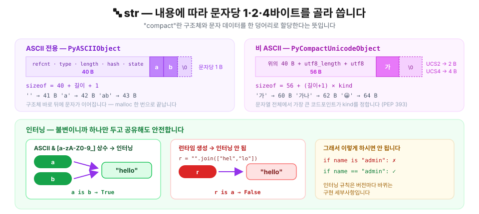

**인터닝.** 문자열 객체는 내부적으로 불변으로 취급되어 같은 내용이면 하나만 두고 공유해도 안전합니다. CPython은 **컴파일 타임 상수 문자열 중 일부를 자동으로 인터닝**합니다. "일부"인 게 중요합니다 — 판정 함수가 소스에 그대로 있습니다.

> 💡 **인터닝이란?**
>
> 같은 값을 가진 불변 객체를 메모리에 한 번만 저장하고 재사용하여 메모리를 아끼고 비교를 빠르게 만드는 최적화 기법입니다. 
> [tistory: 잉여 개발자](https://yubi5050.tistory.com/311)
```c
/* Objects/codeobject.c — should_intern_string() (GIL 있는 기본 빌드) */
if (!PyUnicode_IS_ASCII(o))
    return 0;                          /* 비ASCII면 인터닝하지 않는다 */

s = PyUnicode_1BYTE_DATA(o);
e = s + PyUnicode_GET_LENGTH(o);
for (; s != e; s++) {
    if (!Py_ISALNUM(*s) && *s != '_')
        return 0;                      /* [a-zA-Z0-9_] 밖의 문자가 하나라도 있으면 안 한다 */
}
return 1;
```

즉 **ASCII이면서 `[a-zA-Z0-9_]`로만 이루어진 상수**(사실상 식별자처럼 생긴 문자열)만 인터프리터 전역 테이블에 등록되어 어디서든 공유됩니다. 나머지 상수는 인터닝되지 않고, **같은 컴파일 단위 안에서만** 컴파일러의 상수 캐시로 중복이 제거됩니다.

```python
>>> import sys
... 
>>> a = "hello"
>>> b = "hello"
>>> print(a is b)   
True                                # "hello"가 인터닝되어 같은 객체를 공유한다
>>> r = "".join(["hel", "lo"])      # 런타임에 만들면?
>>> print(r == a, r is a)
True False                          # 값은 같지만 인터닝 되지 않는다
>>> print(sys.intern(r) is a)
True                                # 명시적으로 인터닝하면 객체 공유가 가능하다
>>> 
```

한 인터프리터 생명주기 안에서 같은 문자열을 두 번 따로 컴파일해보겠습니다. 그러면 컴파일러의 상수 캐시 기능을 무효화해 인터닝 여부만 확인할 수 있습니다. 

```python
def twice(src):                      # 같은 소스를 두 번 따로 컴파일한다
    ns1, ns2 = {}, {}
    exec(compile(src, "<u1>", "exec"), ns1) # ns1 컴파일 한 후에
    exec(compile(src, "<u2>", "exec"), ns2) # ns2 컴파일
    return ns1["s"] is ns2["s"]

print(twice('s = "hello"'))          # 인터닝 대상
print(twice('s = "hello world"'))    # 공백이 있어 제외
print(twice('s = "안녕"'))            # 비ASCII라 제외
```

```text
True
False
False
```
`hello`는 인터닝 되어 전역테이블에 등록되어있어서 두 번째 컴파일이 새로 만드는 대신 기존 객체를 공유한 것을 확인할 수 있습니다.

> ⚠️ **따라서 문자열을 `is`로 비교하지 마세요.** 
>
> 
>  ```python
>  # a.py
>  msg = "hello world"
> 
> # b.py
> msg = "hello world"
> 
> # main.py
> import a, b
> print(a.msg is b.msg)     # False
> ```
> `a.py`와 `b.py`라는 모듈이 있다고 해봅시다. 이 두 개는 각각 따로 컴파일되니, 서로 다른 컴파일 단위입니다. `a.py` 안에 같은 "hello world" 문자열이 있으면, 컴파일 상수 캐시 기능으로 `is`가 `True`를 반환할 수 있습니다. 하지만 main에서 `is`로 비교하는 순간, `False`가 됩니다. 따라서 문자열 비교는 `==`을 사용하세요. 

**문자열은 불변이라 "수정"이 항상 새 객체를 만듭니다.**

```python
>>> s = "abc"
... before = id(s)
... s += "d"
... print(id(s) == before)
... 
False                       # 새 객체
```

그래서 만약 반복문에서 기존 문자열에 새로운 문자를 더할 일이 있다면, 더해야 할 문자열을 리스트에 저장해놓고 `"".join(parts)`를 쓰는 게(O(n)) `+=`로 문자열을 일일이 새로 생성하는 것(O(n²))보다 훨씬 이득입니다.

> 💡 **"".join(parts)은 뭐가 다른가요?**
>
> `+=`는 결과 문자열의 최종 크기를 모른 채 **매번 새 객체를 만들어** 지금까지 쌓은 문자를 통째로 복사합니다. `join`은 붙이려는 문자열 리스트를 **먼저 훑어** 총 길이와 `kind`를 구한 뒤 메모리를 **한 번만 할당**하고 문자를 한 번씩 복사합니다. 심지어 `+=`는 매번 더할 때 문자의 kind가 달라지면 그에 따라 새로운 헤더를 malloc해야 하지만, `join`은 최종 문자열의 길이와 kind를 미리 파악한 후에 malloc하기 때문에 훨씬 효율적입니다.
>
> ```python
> parts = ['a', 'b', 'c', 'd', 'e']
> s = ""
> for x in parts: s += x    # 객체 n개 — 매번 앞부분 전체를 다시 복사
>
> s = "".join(parts)        # 객체 1개 — 길이·kind를 먼저 재고 한 번에 담는다
> ```
>
> | | 할당 | 총 복사량 |
> | --- | --- | --- |
> | `s += x` × n | n번 | 1+2+…+n → **O(n²)** |
> | `"".join(parts)` | **1번** | n → **O(n)** |

### 2.4 `bytes` · `bytearray` — 불변/가변 한 쌍

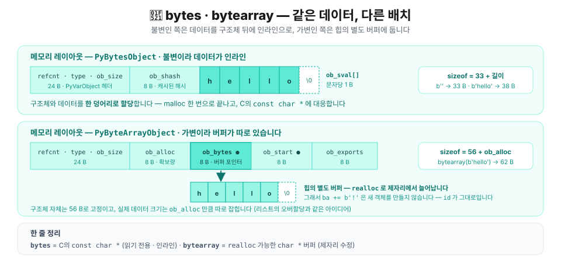

같은 데이터를 담지만 하나는 불변, 하나는 가변입니다. 가변 쪽이 여유 공간과 포인터를 더 들고 있어 더 큽니다.

```python
b  = b"hello"
ba = bytearray(b"hello")

print(sys.getsizeof(b))     # 38  = 33 + 5
print(sys.getsizeof(ba))    # 62

before = id(ba)
ba += b"!"
print(id(ba) == before, ba)  # True bytearray(b'hello!')   ← 제자리 변경
```

`bytes`는 C의 `const char *`, `bytearray`는 `realloc` 가능한 `char *` 버퍼에 대응한다고 보시면 정확합니다.

### 2.5 `list` — 연속된 값이 아니라 연속된 포인터

C를 아는 사람이 가장 크게 오해하는 지점입니다.  C에서 `int arr[10]`은 **40바이트 연속 메모리에 정수 10개**가 놓입니다. Python의 `list`는 그렇지 않습니다.

```c
/* Include/cpython/listobject.h */
typedef struct {
    PyObject_VAR_HEAD      /* 24바이트: 헤더 16 + ob_size 8 */
    PyObject **ob_item;    /* 포인터 배열을 가리키는 포인터 */
    Py_ssize_t allocated;  /* 확보된 슬롯 수 (≥ ob_size) */
} PyListObject;
```

**`PyObject **ob_item` — 이중 포인터입니다.** 연속으로 놓이는 건 값이 아니라 **포인터**이고, 실제 객체들은 힙 여기저기에 흩어져 있습니다.

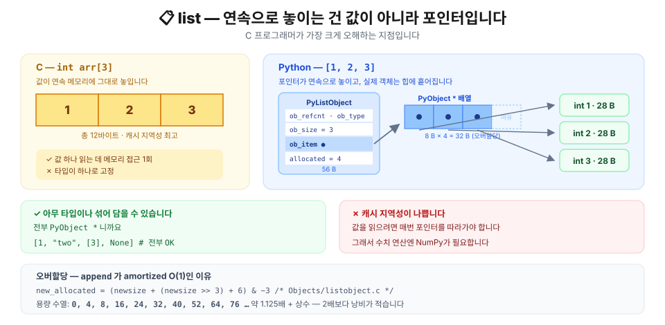

Python의 리스트에는 값 자체가 저장되는 게 아니라, `PyObject*` 배열에 대한 포인터가 저장되기 때문에 **리스트 자체의 크기는 원소가 뭐든 상관없습니다**. 또한, 파이썬에서 모든 객체는 `PyObject`를 상속받기 때문에 리스트에는 **그 어떤 자료형이 와도 상관없습니다**. 

```python
big = "x" * 10_000

small = list((1, 2, 3))
huge  = list((big, big, big))

print(sys.getsizeof(small))   # 88
print(sys.getsizeof(huge))    # 88     ← 10KB짜리 문자열 3개를 담았는데도 똑같다
print(sys.getsizeof(big))     # 10041
```

포인터 3개는 원소가 뭐든 24바이트니까요. 이 구조 때문에 리스트는 **아무 타입이나 섞어 담을 수 있고**(전부 `PyObject *`니까), 동시에 **캐시 지역성이 나쁩니다**(값을 읽으려면 매번 포인터를 따라가야 하니까).

**오버할당(over-allocation).** `append`가 amortized O(1)인 이유입니다. CPython은 리스트를 늘릴 때 딱 맞게 늘리지 않고 여유를 둡니다.

```c
/* Objects/listobject.c
 * The growth pattern is:  0, 4, 8, 16, 24, 32, 40, 52, 64, 76, ... */
new_allocated = ((size_t)newsize + (newsize >> 3) + 6) & ~(size_t)3;
```

대략 **9/8배 + 6 후에 4의 배수로 내림**한 만큼 메모리를 할당합니다. 실제로 측정해보면 주석의 수열이 그대로 나옵니다.

> 💡 **공식 설명**
>
> | 조각 | 하는 일 |
> | --- | --- |
> | `newsize` | 당장 필요한 최소치 |
> | `newsize >> 3` | 3칸 밀기 = ÷8 → **12.5% 여유**(합쳐 9/8배) |
> | `+ 6` | 길이 8 미만이면 `>>3`이 0 → 최소 여유 보장 |
> | `& ~3` | 끝 2비트를 지워 **4의 배수로 내림**(정렬) |

```python
l, prev = [], -1
for i in range(70):
    l.append(i)
    size = sys.getsizeof(l)
    if size != prev:
        print(f"len={len(l):>3}  sizeof={size:>4}  용량={(size - 56) // 8}")
        prev = size
```

```text
len=  1  sizeof=  88  용량=4
len=  5  sizeof= 120  용량=8
len=  9  sizeof= 184  용량=16
len= 17  sizeof= 248  용량=24
len= 25  sizeof= 312  용량=32
len= 33  sizeof= 376  용량=40
len= 41  sizeof= 472  용량=52
len= 53  sizeof= 568  용량=64
len= 65  sizeof= 664  용량=76
```

`sizeof = 56 + 8 × 용량`이고, 용량은 `0, 4, 8, 16, 24, 32, 40, 52, 64, 76`. 소스 주석과 정확히 일치합니다. C에서 동적 배열을 직접 짤 때 쓰는 그로스 팩터 전략과 유사합니다.

> 💡 **얕은 복사의 함정.** `l[:]`이나 `list(l)`은 **포인터 배열만 새로 만듭니다.**
>
> ![얕은 복사 직후 orig와 copy는 서로 다른 포인터 배열을 갖지만 같은 내부 객체를 가리키므로 orig[0]을 수정하면 copy에서도 그 수정이 보인다](./image/shallow-copy-trap.ko.svg)
>
> ```python
> orig = [[1, 2], [3, 4]]
> copy = orig[:]
> 
> print(copy is orig)          # False  — 리스트 객체 자체는 다르다
> print(copy[0] is orig[0])    # True   — 내부 원소 객체는 공유된다!
> 
> orig[0].append(99)           # orig[0]를 수정해도
> print(copy)                  # copy에서 그 수정본을 확인할 수 있다 [[1, 2, 99], [3, 4]]
> ```

### 2.6 `tuple` — 인라인 저장과 freelist

튜플도 포인터를 담지만 **저장 위치가 다릅니다.**

```c
/* Include/cpython/tupleobject.h */
typedef struct {
    PyObject_VAR_HEAD
    PyObject *ob_item[1];    /* 가변 길이 배열이 구조체 뒤에 바로 붙는다 */
} PyTupleObject;
```

리스트는 `PyObject **ob_item`으로 **다른 곳**의 배열을 가리키지만, 튜플은 배열이 **구조체 뒤에 직접** 붙습니다. 불변이라 크기가 절대 안 변하니 가능한 최적화입니다.

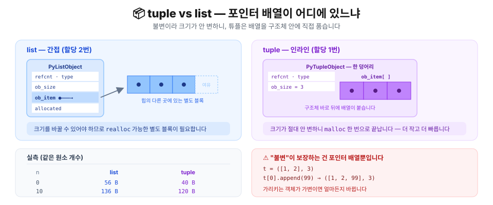

결과적으로 튜플이 더 작고, 할당이 한 번이며, 캐시 지역성도 좋습니다.

```python
for n in (0, 1, 3, 10):
    print(f"n={n:>2}  list={sys.getsizeof(list(range(n))):>4}"
          f"  tuple={sys.getsizeof(tuple(range(n))):>4}")
```

```text
n= 0  list=  56  tuple=  40
n= 1  list=  72  tuple=  48
n= 3  list=  88  tuple=  64
n=10  list= 136  tuple= 120
```

**freelist.** 작은 튜플은 해제해도 메모리를 OS에 돌려주지 않고 재사용 목록에 넣어둡니다. 같은 주소가 반복해서 재사용되는 걸 볼 수 있습니다.

```python
ids = []
for _ in range(5):
    t = (1, 2, 3)
    ids.append(id(t))
    del t
print(ids)
print("전부 같은 주소:", len(set(ids)) == 1)
```

```text
[4368621184, 4368621184, 4368621184, 4368621184, 4368621184]
전부 같은 주소: True
```

> ⚠️ 그래서 **`id()`는 "살아 있는 동안만" 고유합니다.** 객체가 죽으면 그 주소는 재활용됩니다. `id()`를 영구 식별자로 쓰면 안 되는 이유입니다.

**⚠️ 튜플이 불변이라는 말의 정확한 의미.** 튜플이 보장하는 건 **포인터 배열이 안 바뀐다**는 것뿐입니다. 그 포인터가 가리키는 객체가 가변이면 얼마든지 바뀝니다.

```python
t = ([1, 2], 3)
t[0].append(99)
print(t)                   # ([1, 2, 99], 3)   ← 불변인데 바뀐다?!
```

여기서 가장 헷갈리는 사례가 나옵니다.

```python
t = ([1, 2, 99], 3)
try:
    t[0] += [100]
except TypeError as e:
    print("TypeError:", e)
print("그런데 리스트는 바뀌었습니다:", t)
```

```text
TypeError: 'tuple' object does not support item assignment
그런데 리스트는 바뀌었습니다: ([1, 2, 99, 100], 3)
```

**에러가 났는데 변경은 됐습니다.** `t[0] += [100]`은 두 단계로 실행되기 때문입니다. ① `t[0].__iadd__([100])`이 먼저 성공해서 리스트가 제자리에서 늘어나고, ② 그 결과를 `t[0] =`로 되돌려 쓰려다 튜플이 거부합니다. 1단계는 이미 끝난 뒤죠.

> 💡 **append로 추가**하면 에러도 안 나고 리스트에 값 추가도 가능합니다. 튜플이 수정된 것 처럼 보이지만, 튜플 객체는 수정된 적이 없고 그 안에 있는 리스트만 수정된 거죠. 
> ```python
> >>> t = ([1, 2, 99], 3)
> ... try:
> ...     t[0].append(100)
> ... except TypeError as e:
> ...     print("TypeError:", e)
> ... print("final t: ", t)
> ... 
> final t:  ([1, 2, 99, 100], 3)
> ```

### 2.7 `dict` — 컴팩트 딕셔너리와 삽입 순서

Python 3.7부터 딕셔너리는 **삽입 순서를 보장**합니다. 이건 편의 기능이 아니라 **구조 변경의 부수 효과**입니다.

```c
/* Include/cpython/dictobject.h */
typedef struct {
    PyObject_HEAD
    Py_ssize_t ma_used;          /* 항목 수 */
    uint64_t ma_version_tag;
    PyDictKeysObject *ma_keys;   /* 인덱스 배열 + 엔트리 배열 */
    PyDictValues *ma_values;     /* NULL이면 combined, 아니면 split(키 공유) */
} PyDictObject;
```

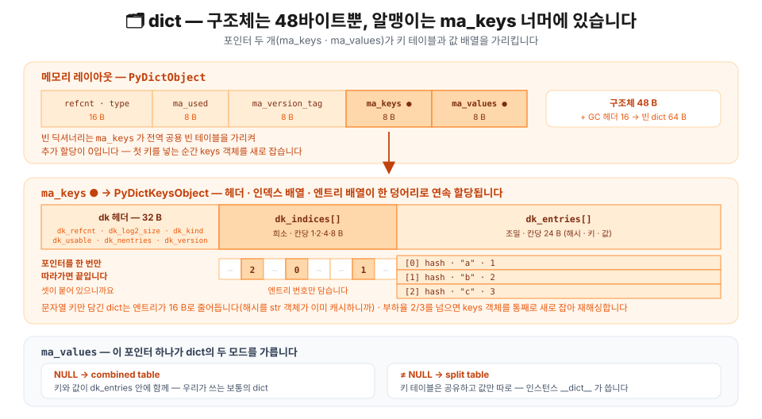

구조체 자체는 **48바이트**밖에 안 됩니다. 실제 데이터는 전부 `ma_keys`가 가리키는 곳에 있고, 그 keys 객체 안에 **헤더 · 인덱스 배열 · 엔트리 배열이 연속으로 붙어** 한 번에 할당됩니다.

전통적인 해시 테이블은 `해시 % 크기` 위치에 엔트리를 통째로 놓기 때문에 **테이블 대부분이 빈 슬롯**이고 순서도 뒤죽박죽입니다. 컴팩트 딕셔너리는 이걸 둘로 나눕니다.

- **인덱스 배열** — 희소(sparse)하지만 원소가 작은 정수(1·2·4·8바이트)라 낭비가 적습니다.
- **엔트리 배열** — 조밀(dense)하게 삽입 순서대로 `(해시, 키, 값)`을 쌓습니다.

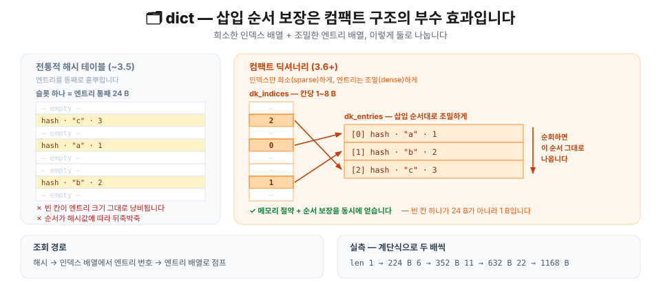

조회는 인덱스 배열에서 엔트리 번호를 얻어 엔트리 배열로 점프합니다. 그리고 엔트리 배열이 **삽입 순서 그대로**이므로, 순회하면 자연히 삽입 순서가 나옵니다. 순서 보장은 공짜로 따라온 셈입니다.

```python
d, prev = {}, -1
for i in range(40):
    d[i] = i
    size = sys.getsizeof(d)
    if size != prev:
        print(f"len={len(d):>3}  sizeof={size}")
        prev = size

print(list({"b": 1, "a": 2, "c": 3}))    # ['b', 'a', 'c'] — 삽입 순서
```

```text
len=  1  sizeof=224
len=  6  sizeof=352
len= 11  sizeof=632
len= 22  sizeof=1168
```

리스트처럼 매끄럽게 늘지 않고 **계단식으로 두 배씩** 뛰는 게 보입니다. 해시 테이블은 부하율(load factor)이 2/3를 넘으면 통째로 새로 만들어 재해싱하기 때문입니다.

### 2.8 `set` · `frozenset` — 엔트리만 있는 해시 테이블

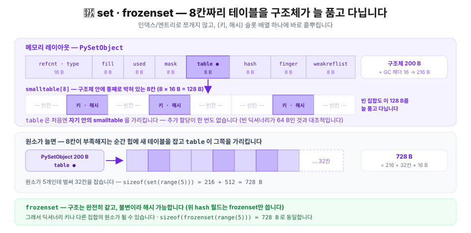

집합은 값이 없으니 딕셔너리보다 단순합니다. 다만 컴팩트 구조를 쓰지 않고 **개방 주소법 해시 테이블**을 그대로 씁니다. 인덱스 배열과 엔트리 배열로 나누지 않고, `(키, 해시)` 슬롯 배열 하나에 바로 흩뿌립니다.

```c
/* Include/cpython/setobject.h */
#define PySet_MINSIZE 8

typedef struct {
    PyObject *key;
    Py_hash_t hash;                       /* 캐시된 해시 */
} setentry;                               /* 16바이트 */

typedef struct {
    PyObject_HEAD
    Py_ssize_t fill;                      /* 활성 + dummy 슬롯 수 */
    Py_ssize_t used;                      /* 활성 슬롯 수 */
    Py_ssize_t mask;                      /* 테이블 크기 - 1 */
    setentry *table;
    Py_hash_t hash;                       /* frozenset만 사용 */
    Py_ssize_t finger;                    /* pop() 탐색 위치 */
    setentry smalltable[PySet_MINSIZE];   /* 8칸짜리 테이블이 구조체 안에 통째로 박혀 있다 */
    PyObject *weakreflist;
} PySetObject;
```

빈 집합이 큰 이유가 여기 있습니다. **8칸짜리 `smalltable`(8 × 16 = 128바이트)을 구조체가 항상 품고 다니기** 때문입니다. 반면 빈 딕셔너리의 `ma_keys`는 인터프리터에 하나뿐인 빈 키 객체를 가리키기만 해서 64바이트에 그칩니다.

```python
print(sys.getsizeof(set()))            # 216  = 200(구조체, smalltable 포함) + 16(GC 헤더)
print(sys.getsizeof(set(range(5))))    # 728  — 5개에서 이미 32칸 테이블로 옮겨감
print(sys.getsizeof(frozenset(range(5))))  # 728  — 구조는 동일
```

`frozenset`은 `set`의 불변 버전입니다. 불변이라 **해시 가능**해서 딕셔너리 키나 다른 집합의 원소가 될 수 있습니다.

```python
{frozenset({1, 2}): "ok"}      # Frozenset은 잘 된다
{ {1, 2}: "no" }               # 일반 set은 안된다. TypeError: unhashable type: 'set'
```

### 2.9 사용자 정의 클래스 — `__dict__`와 `__slots__`

인스턴스는 기본적으로 **속성을 딕셔너리에 담습니다.** 그래서 아무 속성이나 나중에 붙일 수 있습니다. 대신 인스턴스마다 딕셔너리 하나씩이 딸립니다.

```python
class Plain:
    def __init__(self):
        self.x = 1
        self.y = 2

class Slotted:
    __slots__ = ("x", "y")       # 속성 이름을 미리 고정
    def __init__(self):
        self.x = 1
        self.y = 2
```

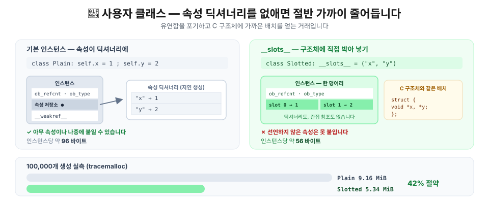

`__slots__`를 선언하면 딕셔너리 대신 **구조체에 고정된 슬롯**이 생깁니다. C의 구조체 필드와 거의 같은 배치입니다. 대신 선언하지 않은 속성은 못 붙입니다.

```python
p, s = Plain(), Slotted()

p.z = 3                          # 잘 된다
try:
    s.z = 3
except AttributeError as e:
    print("AttributeError:", e)
```

```text
AttributeError: 'Slotted' object has no attribute 'z' and no __dict__ for setting new attributes
```

**여기서 측정을 조심해야 합니다.** `sys.getsizeof(p.__dict__)`로 재면 안 됩니다. Python 3.11+는 인스턴스 딕셔너리를 **지연 생성**하는데(PEP 412의 키 공유 딕셔너리 위에 얹힌 최적화), `__dict__`에 접근하는 행위 자체가 딕셔너리를 **강제로 실체화**해버립니다. 관측이 대상을 바꾸는 셈입니다.

정직하게 재려면 `tracemalloc`으로 실제 할당량을 봐야 합니다.

```python
import tracemalloc

N = 100_000
tracemalloc.start()

objs = [Plain() for _ in range(N)]
plain, _ = tracemalloc.get_traced_memory()
del objs

objs = [Slotted() for _ in range(N)]
slotted, _ = tracemalloc.get_traced_memory()
tracemalloc.stop()

print(f"Plain   {N:,}개: {plain / 1024 / 1024:.2f} MiB")
print(f"Slotted {N:,}개: {slotted / 1024 / 1024:.2f} MiB")
```

```text
Plain   100,000개: 9.16 MiB
Slotted 100,000개: 5.34 MiB
```

인스턴스당 약 96바이트 → 56바이트, **42% 절약**입니다(리스트가 원소당 8바이트씩 함께 잡히므로 객체만 놓고 보면 차이는 더 큽니다).

> 💡 `__slots__`는 **같은 모양의 객체를 수십만 개 만들 때** 의미가 있습니다. 몇 개 안 만드는 클래스에 붙이면 유연성만 잃습니다. 그리고 `sys.getsizeof(obj.__dict__)`로 절약량을 계산한 글이 많은데, 위 이유로 **과장된 수치**입니다.

### 2.10 얕은 복사와 깊은 복사

지금까지 본 걸 종합하면 복사가 왜 두 종류인지 자명해집니다. 컨테이너가 담고 있는 건 포인터니까, **포인터만 복사할 것인가 가리키는 대상까지 복사할 것인가**의 문제입니다.

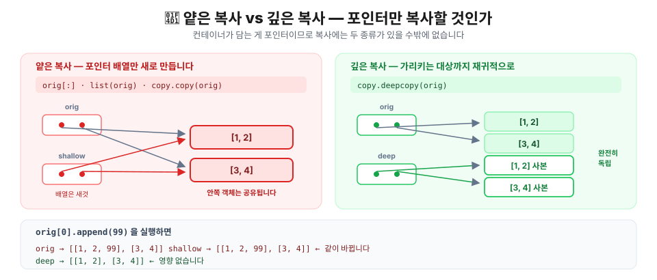

```python
import copy

orig = [[1, 2], [3, 4]]

shallow = copy.copy(orig)       # = orig[:] = list(orig)
deep    = copy.deepcopy(orig)

print("shallow[0] is orig[0]:", shallow[0] is orig[0])   # True
print("deep[0]    is orig[0]:", deep[0]    is orig[0])   # False

orig[0].append(99)
print("orig   :", orig)
print("shallow:", shallow)
print("deep   :", deep)
```

```text
shallow[0] is orig[0]: True
deep[0]    is orig[0]: False
orig   : [[1, 2, 99], [3, 4]]
shallow: [[1, 2, 99], [3, 4]]
deep   : [[1, 2], [3, 4]]
```

| 방법 | 하는 일 | 중첩 객체 |
| --- | --- | --- |
| `b = a` | 이름만 추가 | 완전히 공유 |
| `a[:]` · `list(a)` · `copy.copy(a)` | 포인터 배열 복사 | 공유 |
| `copy.deepcopy(a)` | 재귀적으로 전부 복사 | 독립 |

> 💡 `deepcopy`는 순환 참조도 처리합니다(방문한 객체를 기억해뒀다가 재사용). 대신 느리고, `__deepcopy__`로 동작을 바꿀 수 있습니다. **불변 객체만 담고 있다면 얕은 복사로 충분합니다** — 어차피 아무도 못 바꾸니까요.

---

## 🎯 한 문장 요약

> **Python에 원시 타입은 없습니다. 16바이트 헤더로 시작하는 객체와, 그 뒤에 붙은 타입별 몸통이 있을 뿐입니다.**

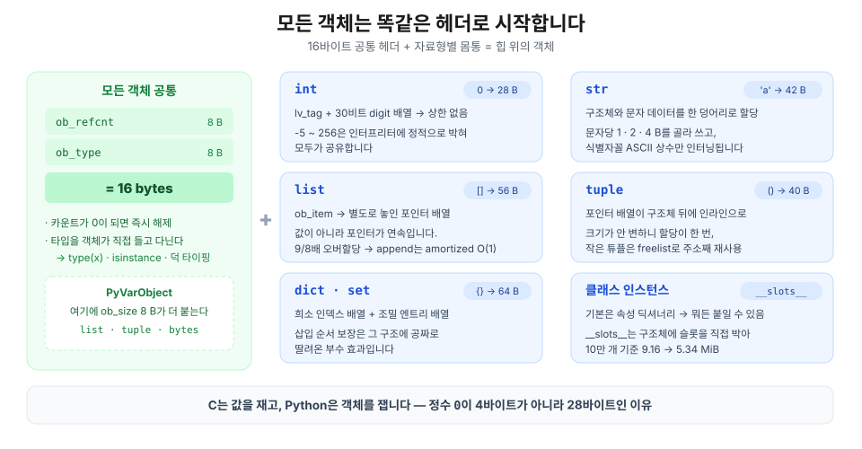

- 모든 객체는 `ob_refcnt` + `ob_type` **16바이트 헤더**로 시작합니다 → 그래서 `type(x)`·`isinstance()`·덕 타이핑이 런타임에 동작하고, 정수 `0`이 4바이트가 아니라 **28바이트**입니다
- `int`는 **30비트씩 쪼갠 자릿수 배열**이라 상한이 없고, `-5 ~ 256`은 인터프리터에 정적으로 박혀 공유됩니다
- `str`은 **컴팩트 표현**(구조체와 문자 데이터를 한 덩어리로 할당)에 문자당 1·2·4바이트를 골라 쓰고, `[a-zA-Z0-9_]`로만 된 ASCII 상수만 인터닝됩니다
- `list`는 **값이 아니라 포인터를 연속으로** 담고(그래서 아무 타입이나 섞이고 캐시 지역성이 나쁩니다), `tuple`은 그 배열을 구조체 뒤에 **직접** 붙입니다
- `dict`는 **인덱스 배열 + 조밀한 엔트리 배열**로 쪼개져 있고, 삽입 순서 보장은 그 구조에 공짜로 딸려온 부수 효과입니다
- 컨테이너가 담는 게 포인터라서 **얕은 복사와 깊은 복사**가 갈립니다

> 💡 `sizeof` 하나로 요약하면 이렇습니다. **C는 값을 재고, Python은 객체를 잽니다.** 그래서 수치 계산에는 헤더를 하나만 두고 뒤에 진짜 C 배열을 놓는 NumPy가 필요합니다.

이어지는 글에서는 이 객체들에 **이름이 어떻게 붙는지**([② 변수는 상자가 아니라 이름표다](/posts/python/02-variables-are-name-tags)), 이름이 둘 이상 붙으면 무슨 일이 생기는지([③ alias](/posts/python/03-alias-and-mutability)), 그리고 객체가 **언제 어떻게 사라지는지**([④ 참조 카운팅과 pymalloc](/posts/python/04-refcount-gc-and-pymalloc))를 봅니다.

---

## 📚 참고자료

**Python 공식 문서**

- [The Python Language Reference — Data model](https://docs.python.org/3/reference/datamodel.html) — 객체·값·타입의 정의
- [Python/C API — Object Structures](https://docs.python.org/3/c-api/structures.html) — `PyObject`, `PyVarObject`
- [Python/C API — Type Objects](https://docs.python.org/3/c-api/typeobj.html) — `ob_type`이 가리키는 것
- [`sys.getsizeof` · `sys.intern`](https://docs.python.org/3/library/sys.html)
- [`copy` — Shallow and deep copy operations](https://docs.python.org/3/library/copy.html)
- [`tracemalloc` — Trace memory allocations](https://docs.python.org/3/library/tracemalloc.html)
- [`ctypes` — A foreign function library for Python](https://docs.python.org/3/library/ctypes.html)
- [What's New In Python 3.12](https://docs.python.org/3.12/whatsnew/3.12.html) — `int`가 `PyVarObject`에서 벗어난 버전

**PEP**

- [PEP 393 — Flexible String Representation](https://peps.python.org/pep-0393/) — `str`의 1·2·4바이트 표현
- [PEP 412 — Key-Sharing Dictionary](https://peps.python.org/pep-0412/) — 인스턴스 딕셔너리의 키 공유
- [PEP 468 — Preserving the order of `**kwargs`](https://peps.python.org/pep-0468/) — 딕셔너리 순서 보장이 언어 명세가 된 경위

**CPython 소스 (이 글의 구조체는 전부 여기서 인용 — 링크는 모두 `3.13` 브랜치)**

- [`Include/object.h`](https://github.com/python/cpython/blob/3.13/Include/object.h) — `PyObject`, `PyVarObject`
- [`Include/cpython/longintrepr.h`](https://github.com/python/cpython/blob/3.13/Include/cpython/longintrepr.h) — `_PyLongValue`, 30비트 `digit`
- [`Include/internal/pycore_global_objects.h`](https://github.com/python/cpython/blob/3.13/Include/internal/pycore_global_objects.h) — 작은 정수 캐시 `small_ints`
- [`Include/cpython/unicodeobject.h`](https://github.com/python/cpython/blob/3.13/Include/cpython/unicodeobject.h) — 문자열의 4가지 표현
- [`Objects/codeobject.c`](https://github.com/python/cpython/blob/3.13/Objects/codeobject.c) — `should_intern_string()` (상수 인터닝 규칙)
- [`InternalDocs/string_interning.md`](https://github.com/python/cpython/blob/3.13/InternalDocs/string_interning.md) — 싱글턴 · 동적 인터닝
- [`Objects/listobject.c`](https://github.com/python/cpython/blob/3.13/Objects/listobject.c) — 오버할당 공식
- [`Objects/tupleobject.c`](https://github.com/python/cpython/blob/3.13/Objects/tupleobject.c) — freelist
- [`Objects/dictobject.c`](https://github.com/python/cpython/blob/3.13/Objects/dictobject.c) · [`Include/internal/pycore_dict.h`](https://github.com/python/cpython/blob/3.13/Include/internal/pycore_dict.h) — 컴팩트 딕셔너리, `USABLE_FRACTION`
- [`Include/cpython/setobject.h`](https://github.com/python/cpython/blob/3.13/Include/cpython/setobject.h) — `PySetObject`, `smalltable`

**서적 · 읽을거리**

- Anthony Shaw, *CPython Internals* (Real Python, 2021) — 객체 구현을 소스 레벨로 다룹니다
- Luciano Ramalho, *Fluent Python* 2nd ed. (O'Reilly, 2022) — 6장 "Object References, Mutability, and Recycling"
- [Raymond Hettinger, "Modern Dictionaries" (PyCon 2017)](https://www.youtube.com/watch?v=p33CVV29OG8) — 컴팩트 딕셔너리를 설계자가 직접 설명합니다
