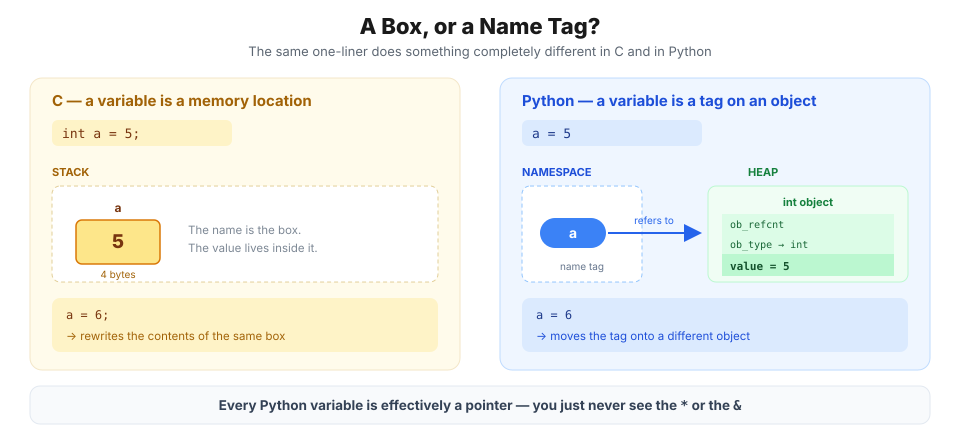
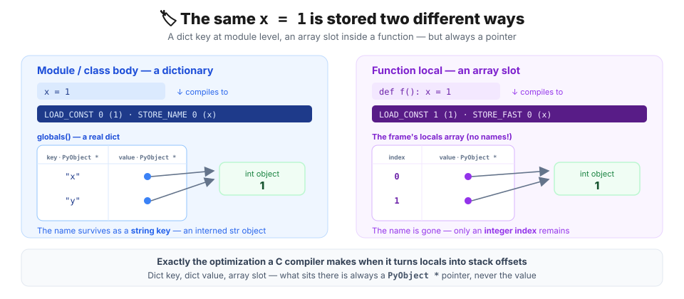
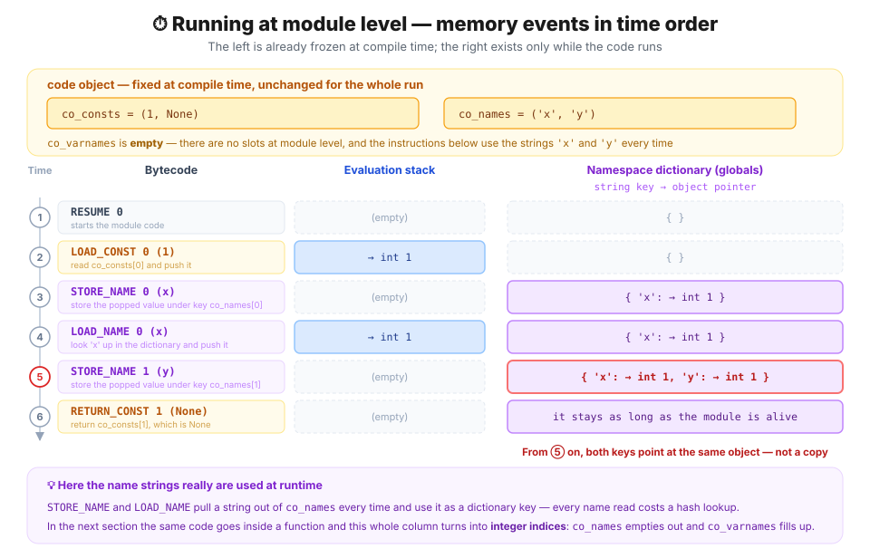
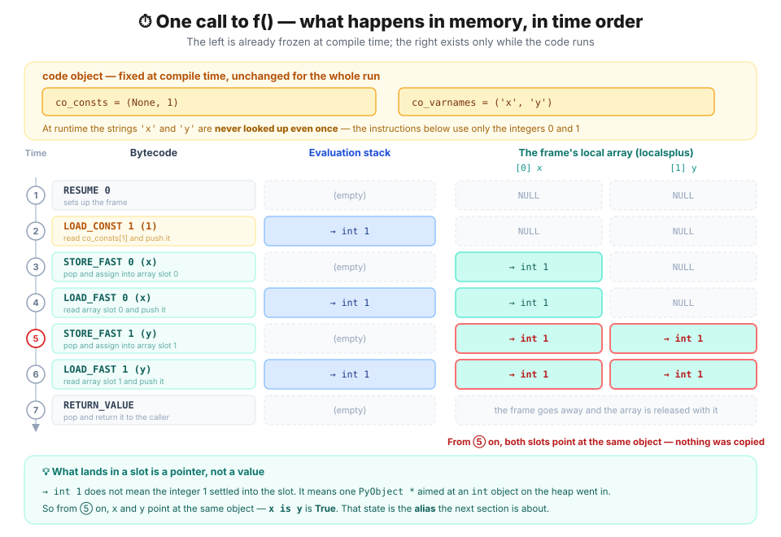
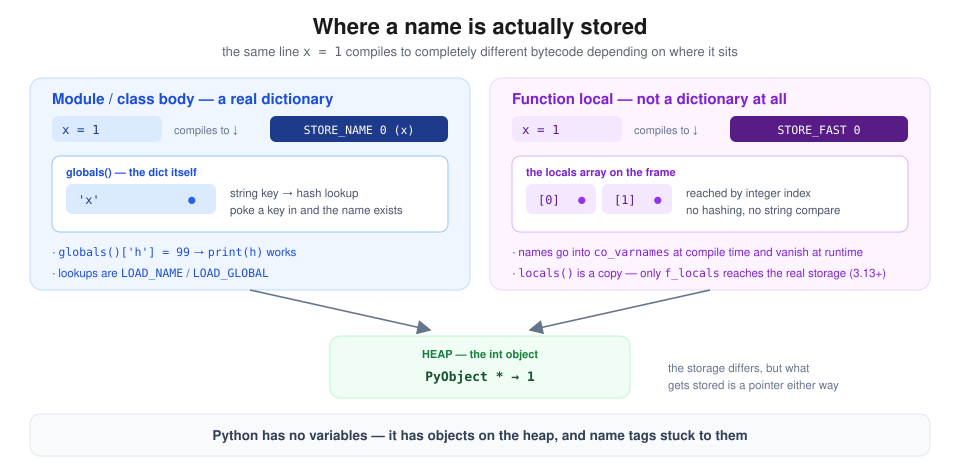

> 📚 **Python memory, part 2 of 4** — [① Everything is an object](/posts/python/01-everything-is-an-object) · **② A variable is a name tag, not a box** · [③ Aliasing — two names, one object](/posts/python/03-alias-and-mutability) · [④ When objects die](/posts/python/04-refcount-gc-and-pymalloc)



## Getting started — `a = 5` is not an assignment

People who learned C first almost all trip on the same step when they meet Python.
- You pass a list to a function and the original changes.
- The empty list you gave as a default argument is no longer empty on the second call.
- `==` says true but `is` says false.

These look like separate traps, but they share a single root: a misunderstanding of **what `a = 5` actually does.**

What does this code mean in C?

```c
int a = 5;
```

Make a four-byte box on the stack and write the bit pattern `00000101` into it. `&a` is the address of that box, and `a = 6` overwrites **the contents of the same box**. The box is born with the name and dies with the scope.

So what does the same line mean in Python?

```python
a = 5
```

**There is no box anywhere.** First, an **integer object `5` exists** somewhere on the heap (in fact it already existed), and then the name `a` is **attached to that object like a tag.** `a = 6` does not rewrite a box — it **peels the tag off and sticks it onto a different object.**

> 💡 A C variable is a **memory location**; a Python variable is a **name that refers to an object**.

If you know C you can probably already feel where this is going. Every Python variable is effectively a **pointer**. You just never see the `*` or the `&`, and you never have to dereference, so it never feels like one.

This article follows that invisible pointer all the way down. What the tags are attached *to* — the objects on the heap — was covered in [① Everything is an object](/posts/python/01-everything-is-an-object). Here we look at the other side: **the tags themselves.**

> 📌 Every number in this article was **produced by actually running the code** in the environment below. A few values may differ across platforms (32/64-bit) and versions.
>
> ```text
> Python 3.13.12 (main, Feb  3 2026) [Clang 17.0.0]
> macOS 26.5 · arm64 · 64-bit
> ```

---

## 📖 1. Here is how the official docs put it

The official Python documentation avoids the word *variable* and says **name** instead.

> *Names refer to objects. Names are introduced by name binding operations.*
> — [The Python Language Reference, Execution model](https://docs.python.org/3/reference/executionmodel.html)

A name **refers to** an object. Not holds, not owns. And names only come into existence through **binding operations**. Assignment (`=`) is merely one of them; all of the following bind names:

| Binding operation | Example |
| --- | --- |
| Assignment statement | `a = 5` |
| Assignment expression | `if (n := len(xs)) > 3:` |
| `for` loop target | `for i in range(3):` |
| `with ... as` | `with open(p) as f:` |
| `except ... as` | `except ValueError as e:` |
| Function definition | `def f(): ...` |
| Class definition | `class C: ...` |
| Function parameters | the `x` in `def f(x):` |
| `import` | `import os`, `from x import y` |
| Pattern-matching capture | `case Point(x=px):` |
| `type` statement (3.12+) | `type Alias = int` |
| Type parameter list (3.12+) | the `T` in `def f[T](x: T):` |
| `del` | `del a` (**unbinds** it) |

Read that table like this: **until one of those operations runs, the name does not exist.** A name has no type and no size. Type and size live entirely on the object side.

So what `a = 5` really does is two steps:

1. Get hold of the integer object `5` (reuse it if it already exists).
2. Make the name `a` in the current namespace refer to that object.

## 🗂️ 2. The namespace is managed with a dictionary

So where, and how, is that mapping between names and objects actually stored?

> 💡 **What is a namespace?**
>
> A store that collects **name → object** mappings. One is created per module, per function call, and per class body. The reason the same name `g` can point at different objects at module level and inside a function is that the stores were separate to begin with.



At module level that mapping lives in a **real `dict`**.

```python
>>> g = 10                      # bind the name g to the object 10
>>> type(globals())
<class 'dict'>                  # the namespace really is a dictionary
>>> globals()['g']
10                              # the name 'g' was just a string key
>>> globals()['h'] = 99         # poke the dictionary directly to make a name?
>>> h
99                              # a global name h appeared with no assignment
```

We only ever wrote `g = 10`, yet `globals()['g']` pulls it right back out. Going the other way, poking a key into the dictionary really did create the name `h`. Which means: **at module level a name is a string key, and the namespace is the dictionary holding those keys.**

Whether it truly uses a dictionary becomes undeniable once you open up the instructions the interpreter **actually executes**. Let us drop down to the bytecode level.

> 💡 **What are bytecode and disassembly?**
>
> CPython compiles source not to machine code but to **bytecode** — a stream of instructions for the Python virtual machine — and then runs it one instruction at a time. The `dis` module unwinds that bytecode back into human-readable instruction names; reading assembly backwards is where the word **disassembly** comes from.

Below is what the `dis` library gives us when it disassembles the compiled bytecode.

```python
# Namespace handling at module level
import dis

dis.dis(compile("x = 1\ny = x\n", "<demo>", "exec"))
```

```text
  0           RESUME                   0
  1           LOAD_CONST               0 (1)
              STORE_NAME               0 (x)
  2           LOAD_NAME                0 (x)
              STORE_NAME               1 (y)
              RETURN_CONST             1 (None)
```



The `LOAD_CONST 0` instruction reads `co_consts[0]` out of the code object and pushes it onto the `evaluation stack` in the frame.
![LOAD_CONST 0 reads co_consts[0] out of the code object and pushes it onto the evaluation stack in the frame](./image/Python-2.png)

Then the `STORE_NAME 0` instruction takes `co_names[0]` from the code object together with the value popped off the frame's `evaluation stack`, and writes that pair into the namespace. Internally the namespace is a dictionary, or a custom mapping.
```python
if (PyDict_CheckExact(ns))
    err = PyDict_SetItem(ns, name, v);
else
    err = PyObject_SetItem(ns, name, v);   // custom mapping in a class body
```

![The STORE_NAME 0 instruction takes co_names[0] from the code object and the value popped off the frame's evaluation stack, and writes them into the namespace](./image/Python-3.png)

That is the module-level story. **Names are string keys; the storage is a dictionary.** But at function level things get a little different.

## ⚡ 3. The twist — inside a function the namespace is not a dictionary

So does the same hold inside a function? Let us take the code we ran with `globals()` at the top and drop it into one, unchanged.

```python
import sys

def f():
    g = 10                                  # bind the name g to the object 10, inside a function

    print(type(locals()))                   # so far this looks exactly like module level
    print(locals()['g'])                    # reading works too

    locals()['h'] = 99                      # poke the dictionary the same way to create a name?
    print('h' in locals())                  # nothing happened at all

    print(type(sys._getframe().f_locals))   # the route to the real storage is a separate thing
    sys._getframe().f_locals['g'] = 20      # write through that instead
    print(g)                                # and this one really does change

f()
```

```text
<class 'dict'>
10
False
<class 'FrameLocalsProxy'>
20
```

Above, what `globals()` handed us was **the module's real namespace dictionary itself**. That is why poking a key into it actually created a global name. A function's `locals()`, by contrast, has **no dictionary to hand back in the first place**, so it copies that function's local names and values into a brand-new dictionary on the spot — a copy of the *locals*, not of the globals. That is why even `locals() is locals()` is `False`. You poked a key into a copy, so the function's namespace never budged.

Yet the value written through `sys._getframe().f_locals` did turn `g` into 20. That object is not a dictionary but a `FrameLocalsProxy`, **a write-through proxy that plants the value straight into the real storage**. So inside a function there is no dictionary for us to hold in the first place — there is *something else*, reachable only through the proxy.

> 💡 `f_locals` only became write-through **in 3.13** ([PEP 667](https://peps.python.org/pep-0667/)). Through 3.12 it was a plain `dict` snapshot too, so `g` in the code above stayed 10. Also, if you push **a name that was never there** — `f_locals['h'] = 99` — it sticks to the proxy, yet `print(h)` still raises `NameError`. It was not a local name at compile time, so that spot was already compiled to go look in the globals.

That *something else* shows its face at the bytecode level too. What follows is the same `x = 1` / `y = x` we disassembled at module level, moved into a function without a character changed.

```python
# Namespace handling at function level
def f():
    x = 1
    y = x
    return y

dis.dis(f)
print("co_varnames:", f.__code__.co_varnames)
```

```text
  RESUME                   0
  LOAD_CONST               1 (1)
  STORE_FAST               0 (x)
  LOAD_FAST                0 (x)
  STORE_FAST               1 (y)
  LOAD_FAST                1 (y)
  RETURN_VALUE

co_varnames: ('x', 'y')
```



The `LOAD_CONST 1` instruction reading `co_consts[1]` out of the code object and pushing it onto the frame's `evaluation stack` is identical to module level. The split comes right after. Where `STORE_NAME 0` used to sit, `STORE_FAST 0` has taken its place — and this instruction **never looks at `co_names`, nor at any namespace.** It simply assigns the value popped off the `evaluation stack` into **slot 0 of the array attached to the frame**. No dictionary lookup, no hashing, no string comparison.

`STORE_FAST 0`, `LOAD_FAST 1` — **the names are gone and only integer indices remain.** At compile time every local name in the function *(a name, not a variable — remember?)* is counted and recorded in order in `co_varnames`, and at runtime access goes through a **slot number** into an array attached to the frame. The string `'x'` never appears even once at runtime.

> 💡 This is exactly the optimization a C compiler performs when it turns locals into stack offsets. **The difference is that what sits in the slot is still a `PyObject *` pointer, not a value.** Only the name lookup got faster; the value did not move onto the stack.

> 💡 **But why is it only functions that get an array, while modules stay dictionaries forever?**
>
> To use array slots, **the number and order of the names has to be settled at compile time**. For a function it is — because the language **closes off** every hole through which a name could appear later inside a function body.
>
> ```python
> >>> def f():
> ...     from math import *          # the compiler cannot know how many names this adds
> ...
> SyntaxError: import * only allowed at module level
>
> >>> def g():
> ...     exec("z = 1")               # a string only reveals itself right before it runs
> ...     print(z)
> ...
> >>> g()
> NameError: name 'z' is not defined  # exec writes to a copy; it cannot create a slot
> ```
>
> The first one **does not even compile**, and the second one runs but never produces a local name `z`. In other words, a function's local names are nailed down the moment the `def` is compiled, and after that there is no way to add more. A wild card (`*`) import gives the compiler no way to know how many names it will add. All it does is bake in an `IMPORT_MODULE` opcode saying "this uses a module called 'math'" — the implementation, that is, which names and functions live inside it, only becomes visible once you get there at run time. A pure Python module, as opposed to a C extension module, is compiled at the very moment its `import` statement runs. Which is why, at the point where `f` is being compiled, the names in the module it imports simply cannot be known.
>
> Module level is the exact opposite. As we just saw with `globals()['h'] = 99`, another module can plant a name via `import`, and `exec` can inject a whole batch. **Names can keep appearing at runtime, so a fixed-size array cannot hold them** — which is why a module never escapes the dictionary.
>
> So `STORE_FAST` is not merely a speed optimization; it is **a consequence of the language design that makes function scope closed.**

So what about reading a **global from inside a function**? With no slot available, we are back to the dictionary.

```python
>>> g = 10
>>> def f():
...     return g                     # a name that is not local
...
>>> dis.dis(f)
  RESUME                   0
  LOAD_GLOBAL              0 (g)     # LOAD_GLOBAL, not STORE_FAST
  RETURN_VALUE
>>> f.__code__.co_varnames
()                                   # not a single local name
>>> f.__code__.co_names
('g',)                               # it stayed in co_names as a string
```

> 💡 **`co_varnames` · `co_names`** — both are **arrays of name strings** carried by the code object. The difference is *whether the slot was fixed at compile time*.
>
> - **`co_varnames`** — names settled as locals. Their slot numbers are baked into the bytecode as in `STORE_FAST 0`, so **the strings are never used at run time.**
> - **`co_names`** — names that must be looked up by string at run time (globals, attributes like `obj.x`, imported module names).
>
> The `0` in `LOAD_GLOBAL 0` above is not a slot but **the position `'g'` gets pulled out of in `co_names`**. The lookup itself takes that `'g'` and goes to the dictionary with it.

The very same `g` becomes an integer index (at function level) or a string key (at module level) depending on **where it was bound**. What decides a name's storage is not the name itself but its **scope**.

Why does this matter? Because the common explanation "Python variables are dictionary keys" is **wrong inside a function**. More precisely:

| Where | How it is stored | Bytecode |
| --- | --- | --- |
| Module / class body | Dictionary (string key) | `STORE_NAME` / `LOAD_NAME` |
| Function local | Array slot in the frame (integer index) | `STORE_FAST` / `LOAD_FAST` |
| Global referenced from a function | Dictionary | `LOAD_GLOBAL` |
| Free variable captured by a closure | Cell object | `LOAD_DEREF` |

Either way, **what gets stored is a pointer to an object**. What happens when more than one of those pointers exists is the subject of [③ Aliasing](/posts/python/03-alias-and-mutability).

---

## 🎯 One sentence

> **Python has no variables. It has objects on the heap, and name tags stuck to them.**



- A name only comes into existence through a **binding operation** — assignment is just one of them; `for`, `with … as`, `import`, function definitions and parameters all bind too
- A name has **no type and no size.** Both live on the object side
- The module-level namespace is a **real `dict`** → `globals()['h'] = 99` creates a name, and the bytecode uses `STORE_NAME` / `LOAD_NAME`
- Inside a function there is **no dictionary at all.** The compiler counts every local name up front, bakes them into `co_varnames`, and at runtime accesses them by **slot number in an array attached to the frame** → `STORE_FAST` / `LOAD_FAST`. The string `'x'` never appears while the function runs
- Only functions get to use an array because **their scope is closed** — inside a function `from x import *` is a `SyntaxError` and `exec` cannot create a local name. A module can keep gaining names at runtime, so an array could never hold them
- `locals()` hands you a **copy**, so writing to it does nothing; since 3.13 `sys._getframe().f_locals` is a write-through proxy that reaches the real storage ([PEP 667](https://peps.python.org/pep-0667/))

> 💡 Turning local names into slot numbers is exactly the same idea as a C compiler turning locals into stack offsets. **The difference is that a slot still holds a `PyObject *` pointer, not a value.**

What happens when **more than one** tag ends up on the same object is the subject of [③ Aliasing](/posts/python/03-alias-and-mutability).

---

## 📚 References

**Official Python documentation**

- [The Python Language Reference — Execution model](https://docs.python.org/3/reference/executionmodel.html) — the definition of name binding and namespaces
- [The Python Language Reference — Naming and binding](https://docs.python.org/3/reference/executionmodel.html#naming-and-binding) — the source of the binding-operation table above
- [The Python Language Reference — Assignment statements](https://docs.python.org/3/reference/simple_stmts.html#assignment-statements)
- [Data model — Code objects · Frame objects](https://docs.python.org/3/reference/datamodel.html#code-objects) — `co_varnames`, `f_locals`
- [`dis` — Disassembler for Python bytecode](https://docs.python.org/3/library/dis.html) — the `STORE_NAME` / `STORE_FAST` instruction reference
- [`globals()` · `locals()` · `compile()` · `exec()`](https://docs.python.org/3/library/functions.html)
- [`sys._getframe`](https://docs.python.org/3/library/sys.html#sys._getframe)
- [`inspect` — Inspect live objects](https://docs.python.org/3/library/inspect.html)
- [What's New In Python 3.13](https://docs.python.org/3.13/whatsnew/3.13.html) — the arrival of `FrameLocalsProxy`

**PEPs**

- [PEP 667 — Consistent views of namespaces](https://peps.python.org/pep-0667/) — why `f_locals` became write-through in 3.13
- [PEP 572 — Assignment Expressions](https://peps.python.org/pep-0572/) — why `:=` counts as a binding operation
- [PEP 3104 — Access to Names in Outer Scopes](https://peps.python.org/pep-3104/) — `nonlocal` and cell objects

**CPython source (all links point at the `3.13` branch)**

- [`Python/bytecodes.c`](https://github.com/python/cpython/blob/3.13/Python/bytecodes.c) — the actual implementation of `STORE_NAME`, `STORE_FAST` and `LOAD_GLOBAL`
- [`Include/internal/pycore_frame.h`](https://github.com/python/cpython/blob/3.13/Include/internal/pycore_frame.h) — `_PyInterpreterFrame` and the locals array
- [`Objects/frameobject.c`](https://github.com/python/cpython/blob/3.13/Objects/frameobject.c) — the `FrameLocalsProxy` implementation
- [`Objects/codeobject.c`](https://github.com/python/cpython/blob/3.13/Objects/codeobject.c) — where `co_varnames` and `co_names` are built
- [`InternalDocs/frames.md`](https://github.com/python/cpython/blob/3.13/InternalDocs/frames.md) — the frame layout explained

**Books and further reading**

- Anthony Shaw, *CPython Internals* (Real Python, 2021) — the compiler and the frame evaluation loop at source level
- Luciano Ramalho, *Fluent Python*, 2nd ed. (O'Reilly, 2022) — chapter 6, "Object References, Mutability, and Recycling"
- [Ned Batchelder, "Facts and Myths about Python names and values"](https://nedbatchelder.com/text/names.html) — the shortest accurate treatment of the name/value split
