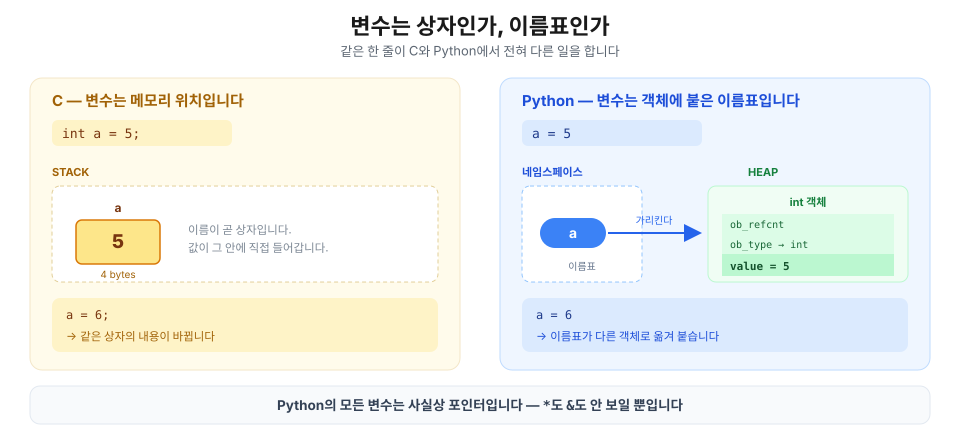
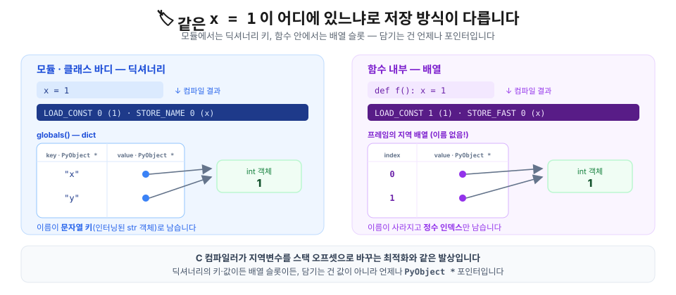
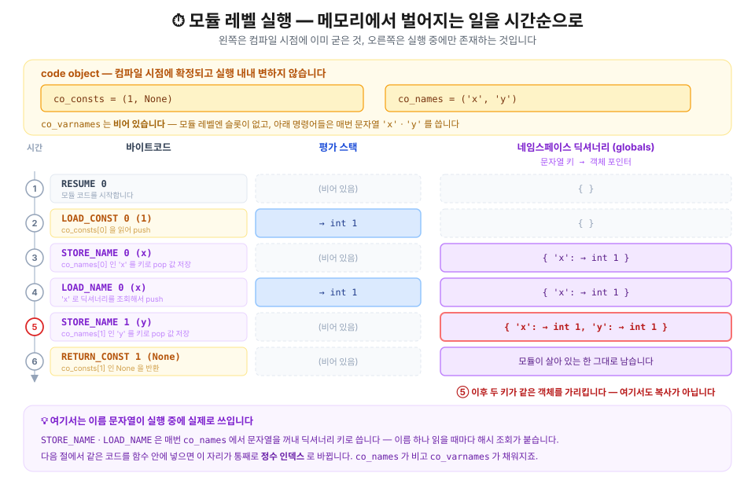
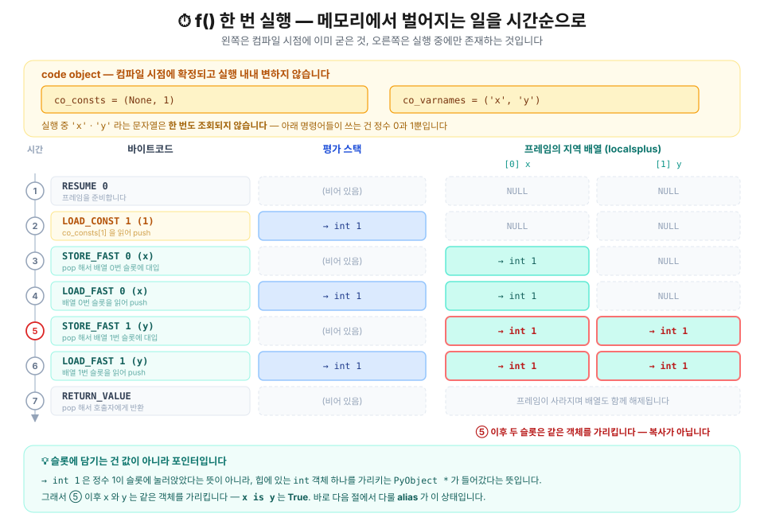
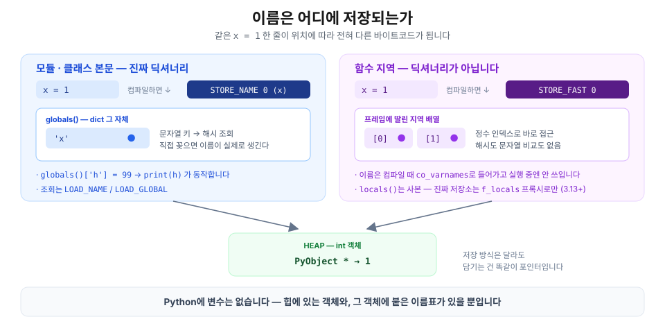

> 📚 **Python 메모리 4부작 (2/4)** — [① 모든 것은 객체다](/posts/python/01-everything-is-an-object) · **② 변수는 상자가 아니라 이름표다** · [③ alias — 이름 둘이 객체 하나를 가리킬 때](/posts/python/03-alias-and-mutability) · [④ 객체는 언제 사라지나](/posts/python/04-refcount-gc-and-pymalloc)



## 들어가며 — `a = 5`는 대입문이 아닙니다

C를 먼저 배운 사람이 Python을 만나면 거의 모두 같은 곳에서 헷갈려합니다.
- 리스트를 함수에 넘겼을 뿐인데 원본이 바뀌어 있고,
- 기본값의 빈 리스트가 두 번째 호출부터 비어 있지 않고,
- `==`는 참인데 `is`는 거짓인 상황.

이 상황들은 서로 다른 문제 때문인 것처럼 보이지만 뿌리는 하나입니다. **`a = 5`가 무슨 일을 하는가**에 대해 오해하고 있기 때문입니다.

C에서 이 코드는 어떤 의미를 가질까요?

```c
int a = 5;
```

스택에 4바이트짜리 상자를 만들고, 그 안에 비트 패턴 `00000101`을 써넣습니다. `&a`는 그 상자의 주소이고, `a = 6`은 **같은 상자의 내용**을 바꿉니다. 상자는 이름과 함께 태어나 스코프가 끝나면 함께 죽습니다.

그러면 Python에서 같은 줄은 어떤 의미일까요?

```python
a = 5
```

어디에도 **상자가 없습니다.** 먼저 힙 어딘가에 **정수 객체 `5`가 존재**하고(정확히는 이미 만들어져 있고), `a`라는 **이름표를 그 객체에 붙입니다.** `a = 6`은 상자의 내용을 바꾸는 게 아니라 **이름표를 떼서 다른 객체에 옮겨 붙이는** 일입니다.

> 💡 C의 변수는 **메모리 위치**이고, Python의 변수는 **객체를 가리키는 이름**입니다.

C를 아신다면 이미 감이 오실 겁니다. Python의 모든 변수는 사실상 **포인터**입니다. 다만 `*`도 `&`도 안 보이고, 역참조를 안 해도 되니 포인터라고 인지되지 않을 뿐입니다.

이 글에서 그 보이지 않는 포인터를 끝까지 파헤쳐 공부해 보겠습니다. 이름표가 붙는 **대상**(힙의 객체)이 어떻게 생겼는지는 [① 모든 것은 객체다](/posts/python/01-everything-is-an-object)에서 다뤘습니다. 여기서는 그 반대편, **이름표 쪽**을 봅니다.

> 📌 이 글의 모든 숫자는 아래 환경에서 **실제로 돌려서 얻은 값**입니다. 몇몇 값은 플랫폼(32/64비트)과 버전에 따라 달라질 수 있습니다.
>
> ```text
> Python 3.13.12 (main, Feb  3 2026) [Clang 17.0.0]
> macOS 26.5 · arm64 · 64-bit
> ```

---

## 📖 1. 공식 문서는 이렇게 말합니다

Python 공식 문서에서는 변수라는 단어 대신 **이름(name)** 을 씁니다.

> *Names refer to objects. Names are introduced by name binding operations.*
> — [The Python Language Reference, Execution model](https://docs.python.org/3/reference/executionmodel.html)

"이름은 객체를 **참조한다**"입니다. 담는다도, 가진다도 아닙니다. 그리고 이름은 **바인딩 연산**으로만 생깁니다. 대입문(`=`)은 그중 하나일 뿐이고, 실제로는 아래가 전부 바인딩 연산입니다.

| 바인딩 연산 | 예시 |
| --- | --- |
| 대입문 | `a = 5` |
| 대입 표현식 | `if (n := len(xs)) > 3:` |
| `for` 루프 변수 | `for i in range(3):` |
| `with ... as` | `with open(p) as f:` |
| `except ... as` | `except ValueError as e:` |
| 함수 정의 | `def f(): ...` |
| 클래스 정의 | `class C: ...` |
| 함수 매개변수 | `def f(x):` 의 `x` |
| `import` | `import os`, `from x import y` |
| 패턴 매칭 캡처 | `case Point(x=px):` |
| `type` 문 (3.12+) | `type Alias = int` |
| 타입 파라미터 목록 (3.12+) | `def f[T](x: T):` 의 `T` |
| `del` | `del a` (바인딩을 **해제**) |

이 표를 이렇게 읽으시면 됩니다. **위 연산 중 하나가 일어나기 전까지 그 이름은 존재하지 않습니다.** 이름은 타입을 갖지도, 크기를 갖지도 않습니다. 타입과 크기는 전부 객체 쪽에 있습니다.

그래서 `a = 5`가 실제로 하는 일은 두 단계입니다.

1. 정수 객체 `5`를 준비한다(이미 있으면 그걸 쓴다).
2. 현재 네임스페이스에서 이름 `a`가 그 객체를 가리키게 한다.

## 🗂️ 2. 네임스페이스는 딕셔너리로 관리됩니다

그렇다면 이름과 객체의 관계, 즉 그 대응은 어디에 어떻게 저장될까요?

> 💡 **네임스페이스(namespace)란?**
>
> **이름 → 객체** 대응을 모아둔 저장소입니다. 모듈 하나, 함수 호출 하나, 클래스 본문 하나마다 각각 따로 만들어집니다. 같은 이름 `g`가 모듈과 함수 안에서 서로 다른 객체를 가리킬 수 있는 건, 애초에 저장소가 분리돼 있기 때문입니다.



모듈 레벨에서 네임스페이스는 **진짜 `dict`** 에 저장됩니다.

```python
>>> g = 10                      # 10 객체에 g라는 이름을 붙였습니다
>>> type(globals())
<class 'dict'>                  # 네임스페이스의 정체는 딕셔너리
>>> globals()['g']
10                              # 이름 'g'는 그냥 문자열 키였다
>>> globals()['h'] = 99         # 딕셔너리를 직접 건드려 이름을 만들어보면?
>>> h
99                              # 대입문 없이 전역 이름 h가 실제로 생겼다
```

`g = 10`이라고 쓴 적밖에 없는데 `globals()['g']`로 꺼내집니다. 반대로 딕셔너리에 키를 꽂았더니 `h`라는 이름이 진짜로 생겼고요. **모듈 레벨에서 이름은 문자열 키이고, 네임스페이스는 그 키를 담은 딕셔너리 그 자체**라는 뜻입니다.

정말 딕셔너리를 쓰는지는 인터프리터가 **실제로 실행하는 명령어**를 열어보면 확실해집니다. 바이트코드 레벨까지 내려가 보겠습니다.

> 💡 **바이트코드 · 디스어셈블이란?**
>
> CPython은 소스를 기계어가 아니라 **바이트코드**(파이썬 가상 머신용 명령어 열)로 컴파일해 두고 한 줄씩 실행합니다. `dis` 모듈은 그 바이트코드를 사람이 읽을 수 있는 명령어 이름으로 되풀어 보여줍니다 — 어셈블리를 거꾸로 읽는다고 해서 **디스어셈블**입니다.

아래는 `dis` 라이브러리로 컴파일된 바이트코드를 디스어셈블한 결과입니다. 

```python
# 모듈 레벨의 네임스페이스 관리
import dis

dis.dis(compile("x = 1\ny = x\n", "<demo>", "exec"))
```

```text
  0           RESUME                   0
  1           LOAD_CONST               0 (1)
              STORE_NAME               0 (x)
  2           LOAD_NAME                0 (x)
              STORE_NAME               1 (y)
              RETURN_CONST             1 (None)
```



`LOAD_CONST 0` 명령어가 code object 영역의 `co_consts[0]`을 읽어 frame 영역의 `평가 스택`에 push합니다. 
![`LOAD_CONST 0`가 code object 영역의 co_consts[0]을 읽어 frame 영역의 평가 스택에 push합니다](./image/Python-2.png)

이제 `STORE_NAME 0` 명령어는 code object 영역의 `co_names[0]`과 frame 영역의 `평가 스택`의 pop 값을 네임스페이스에 쓰는 역할을 합니다. 네임스페이스는 내부적으로 딕셔너리 또는 커스텀할 수 있습니다. 
```python
if (PyDict_CheckExact(ns))
    err = PyDict_SetItem(ns, name, v);
else
    err = PyObject_SetItem(ns, name, v);   // 클래스 바디의 커스텀 매핑
```    

![이제 `STORE_NAME 0` 명령어는 code object 영역의 `co_names[0]`과 frame 영역의 `평가 스택`의 pop 값을 네임스페이스에 쓰는 역할을 합니다.](./image/Python-3.png)

여기까지가 모듈 레벨 이야기입니다. **이름은 문자열 키, 저장소는 딕셔너리.** 하지만 함수 레벨에서는 좀 달라집니다. 

## ⚡ 3. 반전 — 함수 안의 네임스페이스는 딕셔너리가 아닙니다

그럼 함수 안에서도 똑같을까요? 맨 위에서 `globals()`로 돌렸던 코드를 그대로 함수 안에 넣어 돌려보겠습니다.

```python
import sys

def f():
    g = 10                                  # 함수 안에서 10 객체에 g라는 이름을 붙였습니다

    print(type(locals()))                   # 여기까지는 모듈 레벨과 똑같아 보입니다
    print(locals()['g'])                    # 조회도 됩니다

    locals()['h'] = 99                      # 똑같이 딕셔너리를 건드려 이름을 만들어보면?
    print('h' in locals())                  # 아무 일도 일어나지 않았습니다

    print(type(sys._getframe().f_locals))   # 진짜 저장소로 가는 통로는 따로 있고
    sys._getframe().f_locals['g'] = 20      # 이쪽으로 넣으면
    print(g)                                # 이건 진짜로 바뀝니다

f()
```

```text
<class 'dict'>
10
False
<class 'FrameLocalsProxy'>
20
```

위에서 `globals()`가 돌려준 건 **모듈의 진짜 네임스페이스 딕셔너리 그 자체**였습니다. 그래서 거기에 키를 꽂자 전역 이름이 실제로 하나 생겼던 거고요. 반면 함수 안의 `locals()`는 **돌려줄 딕셔너리가 애초에 없어서**, 그 함수의 지역 이름과 값을 그때그때 새 딕셔너리에 옮겨 담아 내놓습니다 — 전역 네임스페이스의 사본이 아니라 **지역 네임스페이스의 사본**입니다. `locals() is locals()`조차 `False`인 이유고요. 사본에 키를 넣었으니 함수의 네임스페이스는 꿈쩍도 안 합니다.

그런데 `sys._getframe().f_locals`로 넣은 값은 `g`를 20으로 바꿔놓았습니다. 이쪽은 딕셔너리가 아니라 `FrameLocalsProxy`, **진짜 저장소에 값을 그대로 꽂아 넣는 write-through 프록시**입니다. 정리하면 함수 안에는 우리가 손에 쥘 수 있는 딕셔너리가 애초에 없고, 프록시를 통해서만 닿을 수 있는 **다른 무언가**가 있습니다.

> 💡 `f_locals`가 write-through가 된 건 **3.13부터**입니다([PEP 667](https://peps.python.org/pep-0667/)). 3.12까지는 `f_locals`도 그냥 `dict` 스냅샷이라 위 코드의 `g`는 10 그대로였습니다. 그리고 프록시에 `f_locals['h'] = 99`처럼 **원래 없던 이름**을 넣으면 프록시에는 남지만 `print(h)`는 여전히 `NameError`입니다. 컴파일 시점에 지역 이름이 아니었으니 그 자리는 전역을 찾아보도록 이미 컴파일됐거든요.

그 '다른 무언가'의 정체도 바이트코드 레벨에서 드러납니다. 위에서 모듈 레벨로 디스어셈블했던 `x = 1` / `y = x`를 토씨 하나 안 바꾸고 함수 안에 넣은 것뿐입니다.

```python
# 함수 레벨의 네임스페이스 관리
def f():
    x = 1
    y = x
    return y

dis.dis(f)
print("co_varnames:", f.__code__.co_varnames)
```

```text
  RESUME                   0
  LOAD_CONST               1 (1)
  STORE_FAST               0 (x)
  LOAD_FAST                0 (x)
  STORE_FAST               1 (y)
  LOAD_FAST                1 (y)
  RETURN_VALUE

co_varnames: ('x', 'y')
```



`LOAD_CONST 1` 명령어가 code object 영역의 `co_consts[1]`을 읽어 frame 영역의 `평가 스택`에 push하는 것까지는 모듈 레벨과 똑같습니다. 갈라지는 건 그다음입니다. `STORE_NAME 0`이 있던 자리에 `STORE_FAST 0`이 들어왔는데, 이 명령어는 **`co_names`도 네임스페이스도 쳐다보지 않습니다.** `평가 스택`에서 pop한 값을 frame 영역에 딸린 **배열의 0번 슬롯**에 그냥 대입할 뿐입니다. 딕셔너리 조회도, 해시 계산도, 문자열 비교도 없습니다.

`STORE_FAST 0`, `LOAD_FAST 1` — **이름이 사라지고 정수 인덱스만 남았습니다.** 컴파일 시점에 함수 안의 지역 이름 *('변수'가 아니라 '이름'입니다. 기억하시죠?)* 을 전부 세어서 `co_varnames`에 순서대로 박아두고, 런타임에는 프레임에 딸린 배열의 **슬롯 번호**로 접근합니다. 실행 중에 `'x'`라는 문자열은 단 한 번도 등장하지 않습니다.

> 💡 이건 C 컴파일러가 지역변수를 스택 오프셋으로 바꾸는 최적화와 정확히 같은 발상입니다. **다만 슬롯에 담기는 건 값이 아니라 여전히 `PyObject *` 포인터입니다.** 이름 조회만 빨라졌을 뿐, 값이 스택에 눌러앉은 게 아닙니다.

> 💡 **그런데 왜 함수 안만 배열이고, 모듈은 끝까지 딕셔너리일까?**
>
> 배열 슬롯을 쓰려면 **컴파일 시점에 이름의 개수와 순서가 확정**돼야 합니다. 함수는 그게 됩니다 — 함수 본문에서 이름이 나중에 불어날 구멍을 언어가 **아예 막아놨기** 때문입니다.
>
> ```python
> >>> def f():
> ...     from math import *          # import *는 이름이 몇 개인지 컴파일러가 알 수 없다.
> ...
> SyntaxError: import * only allowed at module level
>
> >>> def g():
> ...     exec("z = 1")               # 문자열은 실행 직전에야 정체가 드러난다
> ...     print(z)
> ...
> >>> g()
> NameError: name 'z' is not defined  # exec는 사본에 쓸 뿐 슬롯을 못 만든다
> ```
>
> 첫 번째는 **컴파일조차 되지 않고**, 두 번째는 실행은 되지만 `z`라는 지역 이름이 끝내 생기지 않습니다. 함수의 지역 이름은 `def`를 컴파일하는 순간 개수가 못박히고, 그 뒤로는 늘어날 방법이 없다는 뜻입니다. wild card(`*`) import는 이름이 몇 개 늘지 컴파일러가 알 수 없습니다. 그냥 'math'라는 모듈을 사용한다고 `IMPORT_MODULE` opcode로 박아놓는 것 뿐이지, 구현, 즉 그 안에 어떤 이름들이 있고 함수가 있는지는 런타임에 가봐야 알 수 있습니다. python 확장모듈이 아닌, 순수 파이썬 모듈은 import문이 실행되는 그 시점에 컴파일 됩니다. 그래서 `f` 함수를 컴파일하는 시점에는 import 대상 모듈의 이름들을 알 수 없는 거죠. 
>
> 모듈 레벨은 정반대입니다. 방금 `globals()['h'] = 99`로 이름을 하나 만들어봤듯, 다른 모듈이 `import`로 이름을 꽂을 수도 있고 `exec`로 통째로 주입할 수도 있습니다. **런타임에 이름이 계속 늘어날 수 있으니 크기가 고정된 배열로는 담을 수 없고**, 그래서 모듈은 딕셔너리를 쓸 수밖에 없는 거죠.
>
> 정리하면 `STORE_FAST`는 속도만을 위한 최적화가 아니라 **함수 스코프가 닫혀 있다는 언어 설계에서 따라 나온 결과**입니다.

그럼 함수 **안에서 전역 이름을 읽을 때**는 어떨까요? 슬롯이 없으니 다시 딕셔너리로 돌아갑니다.

```python
>>> g = 10
>>> def f():
...     return g                     # 지역에 없는 이름
...
>>> dis.dis(f)
  RESUME                   0
  LOAD_GLOBAL              0 (g)     # STORE_FAST가 아니라 LOAD_GLOBAL
  RETURN_VALUE
>>> f.__code__.co_varnames
()                                   # 지역 이름은 하나도 없고
>>> f.__code__.co_names
('g',)                               # 문자열 그대로 co_names에 남았다
```

> 💡 **`co_varnames` · `co_names`** — 둘 다 code object가 들고 있는 **이름 문자열 배열**이고, 차이는 *컴파일 때 자리가 정해졌느냐*입니다.
>
> - **`co_varnames`** — 지역으로 확정된 이름. 슬롯 번호가 `STORE_FAST 0`처럼 바이트코드에 박혀서, **실행 중엔 문자열이 안 쓰입니다.**
> - **`co_names`** — 런타임에 문자열로 찾아야 하는 이름(전역 · 속성 `obj.x` · import 모듈명). 
> 
> 위 `LOAD_GLOBAL 0`의 `0`은 슬롯이 아니라 **`co_names`에서 `'g'`를 꺼내는 자리**입니다. 조회는 'g'를 꺼내서 딕셔너리에서 합니다. 

같은 `g`인데도 **어디서 바인딩됐느냐**에 따라 정수 인덱스(함수 레벨)이 되기도 하고 문자열 키(모듈 레벨)이 되기도 합니다. 이름의 저장 방식을 정하는 건 이름 자체가 아니라 **스코프**입니다.

이 차이가 왜 중요하냐면, "Python 변수는 딕셔너리 키다"라는 흔한 설명이 **함수 안에서는 틀리기 때문**입니다. 정확히는 이렇습니다.

| 위치 | 저장 방식 | 바이트코드 |
| --- | --- | --- |
| 모듈 · 클래스 본문 | 딕셔너리 (문자열 키) | `STORE_NAME` / `LOAD_NAME` |
| 함수 지역 | 프레임의 배열 슬롯 (정수 인덱스) | `STORE_FAST` / `LOAD_FAST` |
| 함수에서 참조하는 전역 | 딕셔너리 | `LOAD_GLOBAL` |
| 클로저가 잡은 자유변수 | cell 객체 | `LOAD_DEREF` |

어느 쪽이든 **저장되는 건 객체를 가리키는 포인터**라는 점은 똑같습니다. 그 포인터가 둘 이상 생기면 무슨 일이 벌어지는지는 [③ alias](/posts/python/03-alias-and-mutability)에서 이어집니다.

---

## 🎯 한 문장 요약

> **Python에 변수는 없습니다. 힙에 있는 객체와, 그 객체에 붙은 이름표가 있을 뿐입니다.**



- 이름은 **바인딩 연산**으로만 생깁니다 — 대입문은 그중 하나일 뿐이고, `for`·`with as`·`import`·함수 정의·매개변수도 전부 바인딩입니다
- 이름은 **타입도 크기도 갖지 않습니다.** 둘 다 객체 쪽에 있습니다
- 모듈 레벨의 네임스페이스는 **진짜 `dict`** 입니다 → `globals()['h'] = 99`로 이름을 만들 수 있고, 바이트코드는 `STORE_NAME` / `LOAD_NAME`을 씁니다
- 함수 안은 **딕셔너리가 아닙니다.** 컴파일 시점에 지역 이름을 전부 세어 `co_varnames`에 박아두고, 런타임에는 프레임에 딸린 **배열의 슬롯 번호**로 접근합니다 → `STORE_FAST` / `LOAD_FAST`. 실행 중에 `'x'`라는 문자열은 한 번도 등장하지 않습니다
- 함수만 배열을 쓸 수 있는 건 **스코프가 닫혀 있어서**입니다 — 함수 안에서는 `from x import *`가 `SyntaxError`고 `exec`도 지역 이름을 못 만듭니다. 모듈은 런타임에 이름이 계속 늘 수 있으니 배열로 담을 수 없습니다
- `locals()`는 **사본**이라 손대도 소용없고, 3.13부터 `sys._getframe().f_locals`가 write-through 프록시로 진짜 저장소에 닿습니다([PEP 667](https://peps.python.org/pep-0667/))

> 💡 함수 지역 이름을 슬롯 번호로 바꾸는 건 C 컴파일러가 지역변수를 스택 오프셋으로 바꾸는 최적화와 정확히 같은 발상입니다. **다만 슬롯에 담기는 건 값이 아니라 여전히 `PyObject *` 포인터입니다.**

이름표가 **둘 이상** 같은 객체에 붙으면 어떤 일이 생기는지는 [③ alias](/posts/python/03-alias-and-mutability)에서 이어집니다.

---

## 📚 참고자료

**Python 공식 문서**

- [The Python Language Reference — Execution model](https://docs.python.org/3/reference/executionmodel.html) — 이름 바인딩과 네임스페이스의 정의
- [The Python Language Reference — Naming and binding](https://docs.python.org/3/reference/executionmodel.html#naming-and-binding) — 이 글의 바인딩 연산 표의 출처
- [The Python Language Reference — Assignment statements](https://docs.python.org/3/reference/simple_stmts.html#assignment-statements)
- [Data model — Code objects · Frame objects](https://docs.python.org/3/reference/datamodel.html#code-objects) — `co_varnames`, `f_locals`
- [`dis` — Disassembler for Python bytecode](https://docs.python.org/3/library/dis.html) — `STORE_NAME` / `STORE_FAST` 명령어 설명
- [`globals()` · `locals()` · `compile()` · `exec()`](https://docs.python.org/3/library/functions.html)
- [`sys._getframe`](https://docs.python.org/3/library/sys.html#sys._getframe)
- [`inspect` — Inspect live objects](https://docs.python.org/3/library/inspect.html)
- [What's New In Python 3.13](https://docs.python.org/3.13/whatsnew/3.13.html) — `FrameLocalsProxy` 도입

**PEP**

- [PEP 667 — Consistent views of namespaces](https://peps.python.org/pep-0667/) — 3.13부터 `f_locals`가 write-through가 된 이유
- [PEP 572 — Assignment Expressions](https://peps.python.org/pep-0572/) — `:=`도 바인딩 연산인 근거
- [PEP 3104 — Access to Names in Outer Scopes](https://peps.python.org/pep-3104/) — `nonlocal`과 cell 객체

**CPython 소스 (링크는 모두 `3.13` 브랜치)**

- [`Python/bytecodes.c`](https://github.com/python/cpython/blob/3.13/Python/bytecodes.c) — `STORE_NAME` · `STORE_FAST` · `LOAD_GLOBAL`의 실제 구현
- [`Include/internal/pycore_frame.h`](https://github.com/python/cpython/blob/3.13/Include/internal/pycore_frame.h) — `_PyInterpreterFrame`과 지역 배열
- [`Objects/frameobject.c`](https://github.com/python/cpython/blob/3.13/Objects/frameobject.c) — `FrameLocalsProxy` 구현
- [`Objects/codeobject.c`](https://github.com/python/cpython/blob/3.13/Objects/codeobject.c) — `co_varnames` · `co_names`가 만들어지는 곳
- [`InternalDocs/frames.md`](https://github.com/python/cpython/blob/3.13/InternalDocs/frames.md) — 프레임 레이아웃 설명

**서적 · 읽을거리**

- Anthony Shaw, *CPython Internals* (Real Python, 2021) — 컴파일러와 프레임 평가 루프를 소스 레벨로 다룹니다
- Luciano Ramalho, *Fluent Python* 2nd ed. (O'Reilly, 2022) — 6장 "Object References, Mutability, and Recycling"
- [Ned Batchelder, "Facts and Myths about Python names and values"](https://nedbatchelder.com/text/names.html) — 이름/값 구분을 가장 짧고 정확하게 정리한 글
