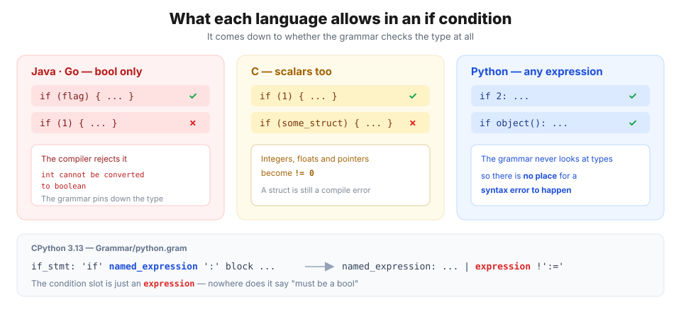
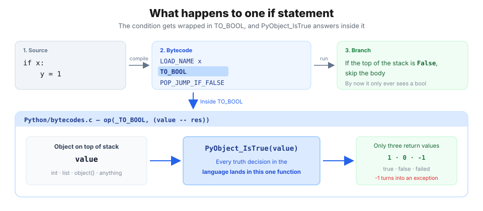
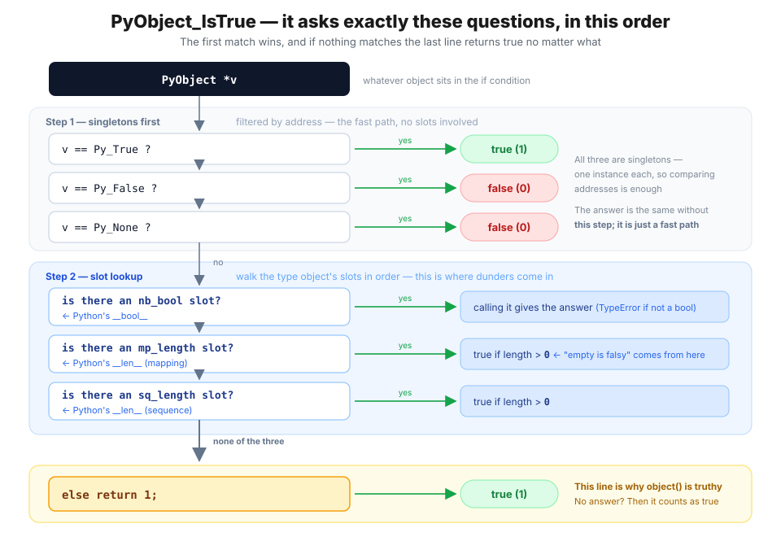
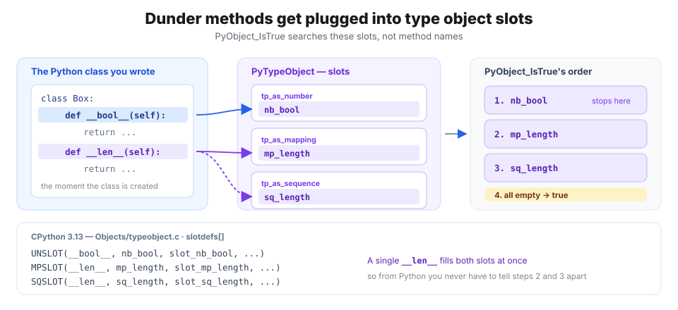
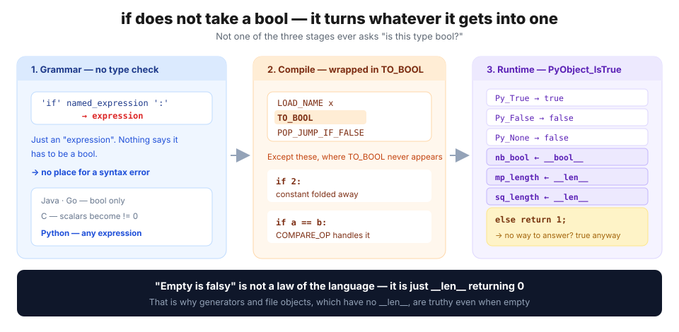

## Getting started — why does anything you put in an if pass without a syntax error?

```python
>>> if True: print("True")
... 
True
>>> if False: print("False")
...
>>> if 0: print("0")
... 
>>> if 1: print("1")
... 
1
>>> if 2: print("2")
... 
2
>>> if set(["A", "B"]): print("set")
... 
set
>>> if object(): print("object")
... 
object
```
We usually think of `if` as something that inspects a bool value: run the inner block when it's True, skip it when it's False. But once you spend some time with Python, that piece of common sense starts to look shaky.

> **Why do `if 0`, `if 1`, `if 2`, `if set()`, and even `object()` all get accepted without a syntax error and treated as True?**

Let me throw one more question at you.

```python
>>> bool(2)
True
>>> 2 == True
False
>>> if 2: print("we do get in here")
... 
we do get in here
```
- `bool(2)` is `True`.
- And yet `2 == True` is `False`.
- And yet `if 2:` passes.

What is going on? Python says `2` is not `True`, and still `if 2:` gets in. Why is that?

In this article we'll go all the way down to the source to see how `if` is actually implemented, and dig out its secret.

> 📌 Every bytecode listing and measurement here was **actually run** in the environment below. The bytecode changes quite a bit between versions, so keep an eye on the version in particular.
>
> ```text
> Python 3.13.12 (main, Feb  3 2026) [Clang 17.0.0]
> macOS 26.5 · arm64 · 64-bit
> ```

---

## 🧭 1. The grammar already answers half the question

What happens if you put the same code into Java?

```java
if (1) {          // ✗ error: incompatible types: int cannot be converted to boolean
    System.out.println("1");
}
```

Java **stops you at compile time.** Its grammar pins down the condition slot of `if` so that only a `boolean` fits there. Go is the same (`non-boolean condition in if statement`). C is a bit looser — any **scalar type** (integer, float, pointer) gets rewritten as `!= 0` — but hand it a whole struct and you're back to a compile error.

So what does Python's grammar say? Let's open CPython's grammar file directly.

```peg
/* CPython 3.13 — Grammar/python.gram */
if_stmt[stmt_ty]:
    | invalid_if_stmt
    | 'if' a=named_expression ':' b=block c=elif_stmt { ... }
    | 'if' a=named_expression ':' b=block c=[else_block] { ... }
```

The slot after `'if'` is a `named_expression`. So then what is a `named_expression`?

```peg
named_expression[expr_ty]:
    | assignment_expression      /* the walrus —  (n := f()) */
    | invalid_named_expression
    | expression !':='           /* literally any expression */
```

**`expression`** — just an "expression". Nowhere is there a condition saying "this must be a bool". `2` is an expression, `set(["A", "B"])` is an expression, `object()` is an expression. In other words, **the grammar never looks at types in the first place, so there is no place for a syntax error to happen.**



> 💡 **Passing the grammar doesn't mean it will run.**
>
> ```python
> >>> if [1, 2] > "a": pass
> ... 
> TypeError: '>' not supported between instances of 'list' and 'str'
> ```
> This one sails through the grammar too, and blows up when you run it. The grammar only looks at **shape**; whether the value makes sense is the **runtime's** job. So the real question is this — **what exactly does the runtime do with `object()` such that it answers "true" without an error?**

---

## ⚙️ 2. What does `if` compile into? — `TO_BOOL`

Code that clears the grammar becomes bytecode. Let's use the `dis` module to see which instructions one `if x:` turns into.

```python
>>> import dis
>>> dis.dis(compile("if x:\n    y = 1\n", "<s>", "exec"))
```

```text
  0           RESUME                   0

  1           LOAD_NAME                0 (x)
              TO_BOOL
              POP_JUMP_IF_FALSE        3 (to L1)

  2           LOAD_CONST               0 (1)
              STORE_NAME               1 (y)
              RETURN_CONST             1 (None)

  1   L1:     RETURN_CONST             1 (None)
```

Three lines, that's all. **① push `x` onto the stack (`LOAD_NAME`) → ② `TO_BOOL` → ③ jump past the body if it's false (`POP_JUMP_IF_FALSE`).**

The culprit we were looking for is the one in the middle: **`TO_BOOL`**. It means exactly what it says — "take the object on top of the stack and replace it with `True` or `False`". In other words, **`if` doesn't take a bool; it turns whatever it got into one.**



> 💡 `TO_BOOL` is **a new instruction introduced in Python 3.13.** Compile the same code with 3.12 or earlier and `POP_JUMP_IF_FALSE` comes straight after, with no `TO_BOOL` — not because 3.12 skipped the truth test, but because **`POP_JUMP_IF_FALSE` used to do that work inside itself.**

### How `TO_BOOL` is implemented

Look up `TO_BOOL` in CPython's bytecode definition file and the substance is exactly five lines.

```c
/* CPython 3.13 — Python/bytecodes.c */
op(_TO_BOOL, (value -- res)) {
    int err = PyObject_IsTrue(value);      /* ← this is the whole thing */
    DECREF_INPUTS();
    ERROR_IF(err < 0, error);
    res = err ? Py_True : Py_False;
}
```

It calls `PyObject_IsTrue(value)` and pushes `Py_True` if the result is nonzero, `Py_False` if it's zero. Which means **the entire responsibility for deciding truth sits in `PyObject_IsTrue` alone.**

> 💡 Notice that `err < 0` counts as an error. `PyObject_IsTrue` returns **three** things: **true (1) · false (0) · failure (-1)**. So there is a path where the decision itself fails and turns into an exception — the NumPy case in section 6 is exactly that.

---

## 🫀 3. `PyObject_IsTrue` — the heart of `if`

Every judgement `if` makes is decided in this one function.

```c
/* CPython 3.13 — Objects/object.c
   Test a value used as condition, e.g., in a while or if statement.
   Return -1 if an error occurred */
int
PyObject_IsTrue(PyObject *v)
{
    Py_ssize_t res;
    if (v == Py_True)
        return 1;
    if (v == Py_False)
        return 0;
    if (v == Py_None)
        return 0;
    else if (Py_TYPE(v)->tp_as_number != NULL &&
             Py_TYPE(v)->tp_as_number->nb_bool != NULL)
        res = (*Py_TYPE(v)->tp_as_number->nb_bool)(v);
    else if (Py_TYPE(v)->tp_as_mapping != NULL &&
             Py_TYPE(v)->tp_as_mapping->mp_length != NULL)
        res = (*Py_TYPE(v)->tp_as_mapping->mp_length)(v);
    else if (Py_TYPE(v)->tp_as_sequence != NULL &&
             Py_TYPE(v)->tp_as_sequence->sq_length != NULL)
        res = (*Py_TYPE(v)->tp_as_sequence->sq_length)(v);
    else
        return 1;
    /* if it is negative, it should be either -1 or -2 */
    return (res > 0) ? 1 : Py_SAFE_DOWNCAST(res, Py_ssize_t, int);
}
```

### The decision is over in six steps

Reading the code top to bottom gives us this.

1. Is it `Py_True`? → **true**
2. Is it `Py_False`? → **false**
3. Is it `Py_None`? → **false**
4. Does the type have an `nb_bool` slot? → **whatever calling it returns**
5. Otherwise, is there an `mp_length` slot? → **true if the length is greater than 0**
6. Otherwise, an `sq_length` slot → **true if the length is greater than 0**
7. **Nothing at all? → `return 1`, unconditionally true**



### The last line is the whole answer — `else return 1`

Why `object()` was truthy is right there in that final `else`.

```python
>>> o = object()
>>> hasattr(o, "__bool__")
False
>>> hasattr(o, "__len__")
False
>>> bool(o)
True
```

`object()` has neither `__bool__` nor `__len__`. So it falls straight through steps 4, 5 and 6 down to the `else`, and **CPython does `return 1` with no evidence whatsoever.** It isn't that an error fails to happen — **the design never intended to raise one.**

> 💡 **Why is the default "true" of all things?**
>
> What would the world look like if the last line of `PyObject_IsTrue` were `return 0`?
>
> First, **every class in the world would have to define `__bool__`.** Every time you wrote a class you'd have to spell out by hand that "this object is true when it exists". Forget to, and `if <custom class>:` quietly becomes false and slips past. That is exactly how **a silent bug that never raises anything** is born.
> We write code like the function below all the time.
> ```python
> def greet(user):
>     if user:                      # "if the user object is there"
>         return f"Hello, {user.name}"
>     return "Please log in"
> ```
> Even when the custom `user` class defines neither `__bool__` nor `__len__`, the last line of `PyObject_IsTrue` hands back `return 1` by default, which is why an object that exists gets the greeting. Had that last line handed back `return 0` instead, every custom class we ever write would have had to spell out `__bool__` or `__len__` one by one.
> ```python
> class User:
>     def __init__(self, name):
>         self.name = name
> 
>     def __bool__(self):    # ← declaring by hand: "I am true just by existing"
>         return True
> ```
> For `if x:` to come out false, `x` has to be a type that announced "I am the kind of thing that can be empty" through `__len__` — list, dict, str and friends — or one of the specially treated values like `None`, `False`, `0`. Everything else is simply true by default.
> Second, this is **more consistent with duck typing.** Python doesn't ask "what type is this?", it asks "can you do this?". An object that can't answer whether it's empty isn't interrogated any further; it just gets waved through.
>
> By the way, `bool(x)` uses exactly the same function. That's why `bool(object())` is `True` too.
>
> ```c
> /* Objects/boolobject.c — bool_new() */
> ok = PyObject_IsTrue(x);
> if (ok < 0)
>     return NULL;
> return PyBool_FromLong(ok);
> ```

### So what on earth are `nb_bool`, `mp_length` and `sq_length`?

The three slots from the C source are the dunder methods we already know, seen from the Python side. The mapping is written out like a table in CPython's source.

```c
/* CPython 3.13 — Objects/typeobject.c — slotdefs[] */
UNSLOT(__bool__, nb_bool,    slot_nb_bool,    wrap_inquirypred, ...)
MPSLOT(__len__,  mp_length,  slot_mp_length,  wrap_lenfunc,     ...)
SQSLOT(__len__,  sq_length,  slot_sq_length,  wrap_lenfunc,     ...)
```

- **`nb_bool`** ← `__bool__` — the method that answers "are you true?" directly
- **`mp_length` · `sq_length`** ← `__len__` — the method that answers "how many do you hold?"

A single `__len__` **gets plugged into both `mp_length` (for mappings) and `sq_length` (for sequences) at once.** So when you define a class in Python there is no need to tell steps 5 and 6 apart. Built-in types written in C sometimes fill only one of the two, which is the only reason the source still carries both branches.



> 💡 **What is a slot?**
>
> Every Python object carries an `ob_type` pointer to its own type object. Inside that type object (`PyTypeObject`) sit **rows and rows of C function pointers** — how to do `+`, how to measure `len()`, and so on — **and each of those cells is a slot.** Define `__len__` on a class and CPython drops a function pointer into that cell. We took `PyTypeObject` apart in [Everything is an object](/posts/python/01-everything-is-an-object).

### Which path do the built-in types take?

Let's check where the types we use every day get their answer among those six steps.

```python
for t in (bool, int, float, str, list, tuple, dict, set, range, type(None), object):
    has_bool = any("__bool__" in vars(k) for k in t.__mro__)
    has_len  = any("__len__"  in vars(k) for k in t.__mro__)
    slot = "nb_bool" if has_bool else ("mp_length" if has_len else "(none) → default true")
    print(f"{t.__name__:>9}  __bool__={str(has_bool):<5} __len__={str(has_len):<5} → {slot}")
```

```text
     bool  __bool__=True  __len__=False → nb_bool
      int  __bool__=True  __len__=False → nb_bool
    float  __bool__=True  __len__=False → nb_bool
      str  __bool__=False __len__=True  → mp_length
     list  __bool__=False __len__=True  → mp_length
    tuple  __bool__=False __len__=True  → mp_length
     dict  __bool__=False __len__=True  → mp_length
      set  __bool__=False __len__=True  → mp_length
    range  __bool__=True  __len__=True  → nb_bool
 NoneType  __bool__=True  __len__=False → nb_bool
   object  __bool__=False __len__=False → (none) → default true
```

**The number family decides True/False through `__bool__`, the container family through `__len__`.** So the rule "empty things are False" was never written as a rule of its own — it's just what happens when `__len__` returns 0. And `object` is the only one with both cells empty, so it falls through to the default True (`else return 1`).

Here is every built-in value that is false just by being what it is.

```python
>>> for v in [None, False, 0, 0.0, 0j, "", (), [], {}, set(), frozenset(), range(0), b"", bytearray()]:
...     print(f"{type(v).__name__:>10} {v!r:>14}  bool={bool(v)}")
```

```text
  NoneType           None  bool=False
      bool          False  bool=False
       int              0  bool=False
     float            0.0  bool=False
   complex             0j  bool=False
       str             ''  bool=False
     tuple             ()  bool=False
      list             []  bool=False
      dict             {}  bool=False
       set          set()  bool=False
 frozenset    frozenset()  bool=False
     range    range(0, 0)  bool=False
     bytes            b''  bool=False
 bytearray bytearray(b'')  bool=False
```

- int, float and other **numbers** are `False` when they're zero
- str, tuple, list, dict, set and other **containers** are `False` when they're empty
- And `None` and `False` are `False` in themselves.

In Python anything falling into the cases above is false; everything else is true.

> 💡 **Why is `range` the only one carrying its own `__bool__`?**
>
> In the table above, `range` is the only type that has **both** `__bool__` and `__len__`. It's a container — so why bother writing a separate `__bool__`? `__len__` looks like it would be plenty.
>
> The problem is that `__len__` returns a **C `Py_ssize_t`** (an 8-byte signed integer on 64-bit). Python integers can grow without limit, but the moment one passes through the slot it has to be squeezed into a C integer.
>
> ```python
> >>> r = range(0, 2**100)
> >>> bool(r)
> True                                       # works fine
> >>> len(r)
> OverflowError: Python int too large to convert to C ssize_t
> ```
>
> `range(0, 2**100)` never materialises its elements, so creating it costs nothing. But go through `__len__` and `2**100` won't fit in 8 bytes, so it blows up. **You only wanted to know whether it was truthy, and measuring the length killed you.**
>
> That's why `range` keeps its own `__bool__` and only checks "are start and stop the same?". It never counts, so any range is safe. The fact that `__bool__` is checked **before** `__len__` is what makes this pay off. Rather exquisite, isn't it?
>
> Build a class that doesn't define `__bool__` and imitate it yourself, and you immediately see why it was needed.
>
> ```python
> >>> class Huge:
> ...     def __len__(self): return 2**100
> ... 
> >>> bool(Huge())
> OverflowError: cannot fit 'int' into an index-sized integer
> ```

---

## 🧪 4. Let's build one and check

Now that we know the rule, let's write some classes and watch the order with our own eyes.

### `__bool__` beats `__len__`

Let's make a class with only `__len__`, one with both, and one with neither, and see which of them gets called.

```python
class OnlyLen:
    def __len__(self):
        print("  → __len__ called")
        return 0

class Both:
    def __bool__(self):
        print("  → __bool__ called")
        return True
    def __len__(self):
        print("  → __len__ called")
        return 0

class Neither:
    pass

for cls in (OnlyLen, Both, Neither):
    print(f"if {cls.__name__}():")
    print(f"  result = {bool(cls())}")
```

```text
if OnlyLen():
  → __len__ called
  result = False
if Both():
  → __bool__ called
  result = True
if Neither():
  result = True
```

In `Both`, `__len__` **was never called at all.** The length is 0 so you'd expect false, but `__bool__` returned true first and that was the end of it. The `else if` chain from the source, reproduced exactly. `Neither` called nothing and came out true.

> ⚠️ So don't define `__bool__` and `__len__` **with conclusions that disagree.** When you write a collection class, defining only `__len__` is the safe move — you then get "empty means falsy" for free.

### `__bool__` must return a `bool`

Can `__bool__` return just anything? Let's have it return `1`.

```python
>>> class BadBool:
...     def __bool__(self): return 1
... 
>>> bool(BadBool())
TypeError: __bool__ should return bool, returned int
```

**`1` is not allowed.** It has to be `True`. It's a fun spot — `if 1:` is fine while `__bool__` returning `1` is blocked — and the reason is that they sit in different positions. The `1` in `if 1:` is **the thing being judged**, so it goes through `nb_bool` and gets converted; the return value of `__bool__` is **the verdict**, and there is nothing left to convert it into. So when you write a custom class, define `__bool__` so that it returns `True`.

### `__len__` accepts neither negatives nor huge numbers

```python
>>> class NegLen:
...     def __len__(self): return -1
... 
>>> bool(NegLen())
ValueError: __len__() should return >= 0

>>> class StrLen:
...     def __len__(self): return "3"
... 
>>> bool(StrLen())
TypeError: 'str' object cannot be interpreted as an integer
```

Remember the `OverflowError` from `Huge` earlier, where handing it a number that was too large (2**100) blew up? So `__len__`
- must not be negative,
- must not exceed 8 bytes (2**64),
- and has to be an `int`.

---

## ✂️ 5. When `TO_BOOL` never shows up at all

Here's a twist: **half the examples at the top of this article never go through `TO_BOOL`.**
> 📌 In case you've forgotten them, here they are again
> ```python
> >>> if True: print("True")
> ... 
> True
> >>> if False: print("False")
> ...
> >>> if 0: print("0")
> ... 
> >>> if 1: print("1")
> ... 
> 1
> >>> if 2: print("2")
> ... 
> 2
> >>> if set(["A", "B"]): print("set")
> ... 
> set
> >>> if object(): print("object")
> ... 
> object
> ```

### Constants disappear at compile time

```python
>>> import dis
>>> dis.dis(compile('if 2: print("2")\n', "<s>", "single"))
```

```text
  0           RESUME                   0

  1           LOAD_NAME                0 (print)
              PUSH_NULL
              LOAD_CONST               0 ('2')
              CALL                     1
              CALL_INTRINSIC_1         1 (INTRINSIC_PRINT)
              POP_TOP
              RETURN_CONST             1 (None)
```

**No `TO_BOOL`, and no branch instruction either.** It walks straight past the `if` and calls `print("2")`. **The compiler already knew `2` is true and erased the conditional entirely.** The other direction is the same.

```python
>>> print([i.opname for i in dis.get_instructions(compile('if 0: print("0")\n', "<s>", "single"))])
['RESUME', 'RETURN_CONST']
```

`if 0:` has no branch instruction and **throws the body away too.** All that's left is two instructions, `RESUME` and `RETURN_CONST`. `0` is false no matter what, so the body never even gets compiled into instructions.

A rather beautiful optimization, isn't it? To sum up, the examples from the introduction split like this.

| Code | Judged at runtime? | Why |
| --- | --- | --- |
| `if True:` · `if 1:` · `if 2:` | ✗ | constant, folded by the compiler |
| `if False:` · `if 0:` | ✗ | body deleted too |
| `if set(["A","B"]):` | ✓ | result of a call, unknown before running |
| `if object():` | ✓ | same as above |

But put the same value in a variable and `TO_BOOL` is no longer skipped.

```python
>>> print([i.opname for i in dis.get_instructions(compile("x = 2\nif x: print(x)", "<s>", "exec"))])
['RESUME', 'LOAD_CONST', 'STORE_NAME', 'LOAD_NAME', 'TO_BOOL', 'POP_JUMP_IF_FALSE', ...]
```

`x` is a global name, so **any other module could swap it out at any time**; the compiler knows `2` is in there and still defers the decision to runtime.

### Comparison operators make their own bool

Compile `if a == b:` and `TO_BOOL` is missing again. This time for a different reason.

```python
>>> dis.dis(compile("if a == b: pass\n", "<s>", "exec"))
```

```text
  1           LOAD_NAME                0 (a)
              LOAD_NAME                1 (b)
              COMPARE_OP              88 (bool(==))
              POP_JUMP_IF_FALSE        1 (to L1)
```

The argument to `COMPARE_OP` isn't plain `==` but **`bool(==)`**. Put the same code outside a conditional and the argument changes.

```python
>>> dis.dis(compile("x = (a == b)\n", "<s>", "exec"))
```

```text
              COMPARE_OP              72 (==)
```

In other words, when you compare inside an `if`, the compiler hands `COMPARE_OP` **a flag saying "make the result a bool before you hand it over"**, saving the cost of one more `TO_BOOL` instruction.

---

## ⚠️ 6. So how do we put this to use?

Now that we know the mechanism, let's take apart the spots that trip people up in practice.

### `if x` and `if x == True` ask different questions

```python
>>> bool(2)
True
>>> 2 == True
False
>>> if 2: print("we do get in here")
... 
we do get in here
```
- `bool(2)` is `True`.
- And yet `2 == True` is `False`.
- And yet `if 2:` passes.

What is going on? Python says `2` is not `True`, and still `if 2:` gets in. We've learned the mechanism by now, so we can answer this, right?

> 💡 It's because `==` and `if` ask different questions.
> - `==` compiles into the `COMPARE_OP` instruction by default,
> - while `if` compiles into `TO_BOOL`.
> - Unless it carries the op_arg 88 (`bool(==)`) flag, `COMPARE_OP` never calls `PyObject_IsTrue()`; it calls the `__eq__` method defined on the classes of the operands sitting on either side.
> - `TO_BOOL` returns the value converted into 0, 1 or -1 by `PyObject_IsTrue()`.
> 
> So `2 == True` comes out false through the result of `__eq__` on `int` and `True`, while
> `if 2` passes because `nb_bool` (`__bool__`) on the `int` class returns `True`. *Though of course the compiler treats it as a constant and never calls TO_BOOL at all 😂.*

### `0` and `None` are genuinely different values.

Say we have a timer app with the requirements below.

- The user can set the timer to any number of seconds.
- The default is 30 seconds.
- If the user sets it to 0 seconds, the alarm should fire immediately.

And say we wrote the code like this.
```python
def timer(second=None):
    if not second:                  
        second = 30
    return f"{second} seconds left"

>>> timer()
'30 seconds left'
>>> timer(0)
'30 seconds left'
>>> timer(60)
'60 seconds left'
```
But look at the result. We passed 0 seconds and it says 30 seconds are left. That's not what we programmed for. Why?

> 💡 It's because **`0` and `None` are both equally False.**
> 
> To quote the implementation we saw earlier,
> 
> ```c
> /* CPython 3.13 — Objects/longobject.c */
> static int
> long_bool(PyLongObject *v)
> {
>     return !_PyLong_IsZero(v);      /* true when it isn't 0 */
> }
> ```
> Going all the way down into `_PyLong_IsZero(v)` gets far too complicated 😂, but put simply, that function returns true when the value isn't 0. So `0` is treated as False.

**If you have to tell "no value was passed" from "0 was passed", truthiness is the wrong tool.**

```python
def timer(second=None):
    if second is None:                  
        second = 30
    return f"{second} seconds left"

>>> timer()
'30 seconds left'
>>> timer(0)
'0 seconds left'
>>> timer(60)
'60 seconds left'
```

> 💡 The empty string `""` and the empty list `[]` are false as well. (their `__len__` is 0, after all)
>
> 
> ```python
> name = ""
> if name:
>     ...
> ```
> In the code above, `if name:` cannot tell "there is no name" from "the name is an empty string". It treats both as False. **If you have to handle "there is no name" as its own case, use `if name is None`; if you don't, `if name:`** does the job.

### If `__bool__` raises, the `if` itself blows up

In section 2 we said `PyObject_IsTrue` can also return `-1` (failure). Let's see that situation for real.

```python
>>> class Angry:
...     def __bool__(self): raise ValueError("cannot decide")
... 
>>> if Angry(): pass
... 
ValueError: cannot decide
```

**All you did was put it in a conditional, and you got an exception.** NumPy uses exactly this technique — an array with several elements has no way to answer "are you true?", so rather than quietly making something up it raises and stops you.

```python
>>> bool(np.array([1, 2, 3]))
ValueError: The truth value of an array with more than one element is ambiguous. Use a.any() or a.all()
>>> bool(np.array([]))
ValueError: The truth value of an empty array is ambiguous. Use `array.size > 0` to check that an array is not empty.
```

That it refuses even an empty array is striking. We said `[]` was false and even checked it, and yet `np.array([])` raises. It lets us confirm that **"empty is false" is not a law of the language but merely a convention that `__len__` created.** In other words, it changes with how you define the class.

### A heavy `__len__` makes a heavy `if`

When you define `__len__` on a custom class, that definition is what decides the performance of your `if`.

```python
class SlowLen:
    def __init__(self, n): self.n = n
    def __len__(self):
        c = 0
        for _ in range(self.n): c += 1     # O(n)
        return c

>>> import time
>>> s = SlowLen(1_000_000)
>>> t0 = time.perf_counter(); bool(s); t1 = time.perf_counter()
>>> print(f"{(t1 - t0) * 1000:.1f} ms")
24.7 ms
```

25 milliseconds for a single `if s:`. It's an extreme example, but **imagine an ORM that fires a DB query inside `__len__`.** Depending on how that query performs, the `if` could turn horrifying, couldn't it?

### Generators are truthy even when "empty"

```python
>>> l = []                   # let's make an empty list
>>> type(l)                  
<class 'list'>      
>>> bool(l)                  # it's empty, so it's false
False
```
Let's quickly review what we learned above. The list type is a sequence type, and we said it decides its truthiness through `__len__`. That's why an empty list is `False`.

So what about generators?
```python
>>> gen = (x for x in [])    # let's make an empty generator
>>> type(gen)
<class 'generator'>
>>> list(gen)                # definitely empty 
[]
>>> bool(gen)
True                         # empty, and yet true
>>> gen2 = (x for x in [1,2])
>>> bool(gen2)
True                         # true when it holds values too.
```
Hold on, that's odd. An empty list is `False`, and yet an empty generator is `True`? Why is that?

> 💡 **Unlike a list, a generator has no way to answer "are you empty?"**
>
> Let's look at `PyGen_Type`, the implementation behind generators.  
> 
> ```c
> /* CPython 3.13 — Objects/genobject.c — PyTypeObject PyGen_Type */
>     0,                                          /* tp_as_number   */
>     0,                                          /* tp_as_sequence */
>     0,                                          /* tp_as_mapping  */
>     ...
>     PyObject_SelfIter,                          /* tp_iter     */
>     (iternextfunc)gen_iternext,                 /* tp_iternext */
> ```
> For a generator, **`tp_as_number`, `tp_as_mapping` and `tp_as_sequence` are all `0`.** Those three are exactly what `PyObject_IsTrue` goes looking for, and since they are all empty it falls through to the last resort, the default `else return 1`.   

So a generator is `True` whether it holds values, is empty, has had every value drained out of it, or has been shut with `.close()`. 

---

## 🎯 In one sentence

> **`if` doesn't take a bool — it asks the object it got "are you true?", and counts it as true when the object can't answer.**



- **Grammar** — whatever follows `if` is just an `expression`, with no type restriction. So no matter what you put there, **there is no place for a syntax error to happen**
- **Compilation** — the condition gets wrapped in a `TO_BOOL` instruction. Except that **constants are folded away by the compiler** and vanish entirely, and comparison operators are handled instead by `COMPARE_OP` carrying a `bool(==)` flag
- **Runtime** — `PyObject_IsTrue` asks `True` → `False` → `None` → `nb_bool` (`__bool__`) → `mp_length`/`sq_length` (`__len__`) in order, and **`return 1` when nothing matches.** That last line is why `object()` is truthy
- **"Empty is falsy" is not a law of the language** but the result of `__len__` returning 0. That's why generators and file objects, which have no `__len__`, are truthy even when empty
- So when you need to tell `0` from `None`, use **`is None` rather than `if x:`**.

To sum up, `if` doesn't ask "is this value the bool True/False?" — it asks "can you tell me whether you're true?". That permissiveness is what makes short code like `if items:` possible.

---

## 📚 References

**Python official docs**

- [The Python Language Reference — Truth Value Testing](https://docs.python.org/3/library/stdtypes.html#truth-value-testing) — the official list of values considered false
- [The Python Language Reference — `if` statement](https://docs.python.org/3/reference/compound_stmts.html#the-if-statement)
- [Data model — `object.__bool__`](https://docs.python.org/3/reference/datamodel.html#object.__bool__) · [`object.__len__`](https://docs.python.org/3/reference/datamodel.html#object.__len__)
- [Python/C API — `PyObject_IsTrue`](https://docs.python.org/3/c-api/object.html#c.PyObject_IsTrue)
- [`dis` — Disassembler for Python bytecode](https://docs.python.org/3/library/dis.html) — the `TO_BOOL` instruction
- [What's New In Python 3.13](https://docs.python.org/3/whatsnew/3.13.html) — the introduction of `TO_BOOL`
- [`datetime.time`](https://docs.python.org/3/library/datetime.html#datetime.time) — the record of removing falsy midnight in 3.5

**PEPs**

- [PEP 285 — Adding a bool type](https://peps.python.org/pep-0285/) — why `bool` was made a subclass of `int`
- [PEP 617 — New PEG parser for CPython](https://peps.python.org/pep-0617/) — where the `python.gram` grammar file we read comes from

**CPython source (all links point at the `3.13` branch)**

- [`Grammar/python.gram`](https://github.com/python/cpython/blob/3.13/Grammar/python.gram) — `if_stmt`, `named_expression`
- [`Objects/object.c`](https://github.com/python/cpython/blob/3.13/Objects/object.c) — `PyObject_IsTrue`
- [`Objects/boolobject.c`](https://github.com/python/cpython/blob/3.13/Objects/boolobject.c) — `bool()` uses the same function
- [`Objects/typeobject.c`](https://github.com/python/cpython/blob/3.13/Objects/typeobject.c) — `slotdefs[]`, the dunder ↔ slot mapping
- [`Python/bytecodes.c`](https://github.com/python/cpython/blob/3.13/Python/bytecodes.c) — the implementation of `TO_BOOL`
- [`Python/flowgraph.c`](https://github.com/python/cpython/blob/3.13/Python/flowgraph.c) — the optimization that folds constant conditionals away
