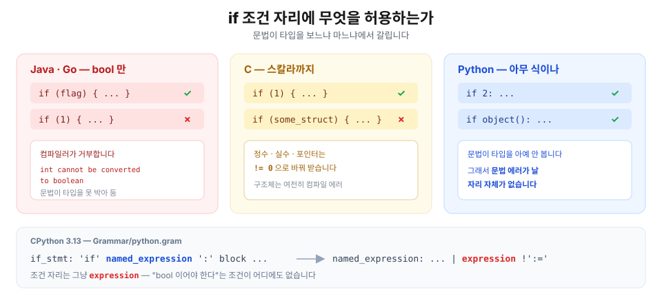
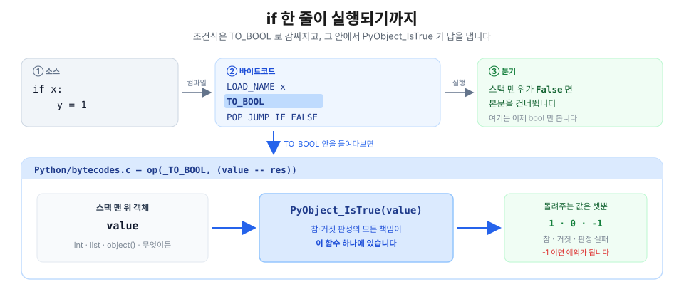
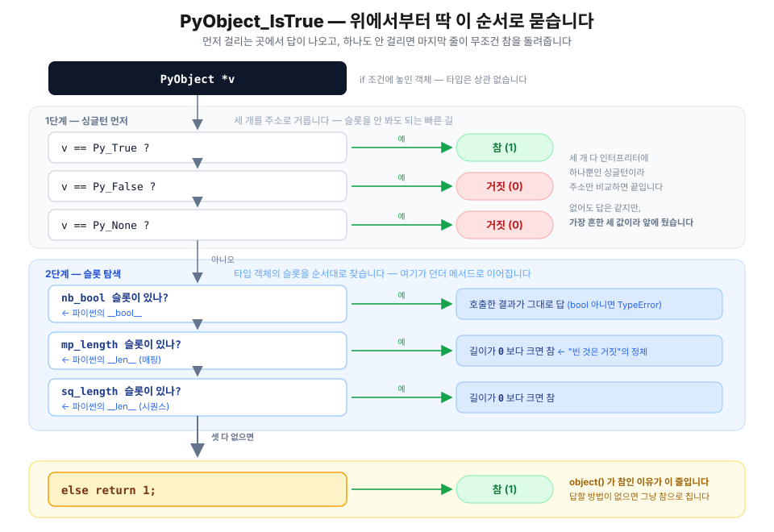
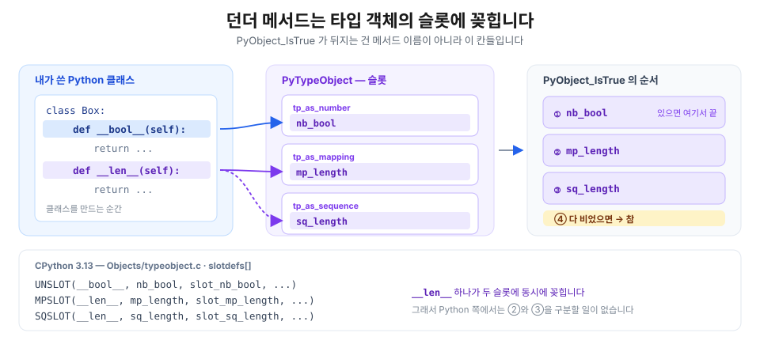
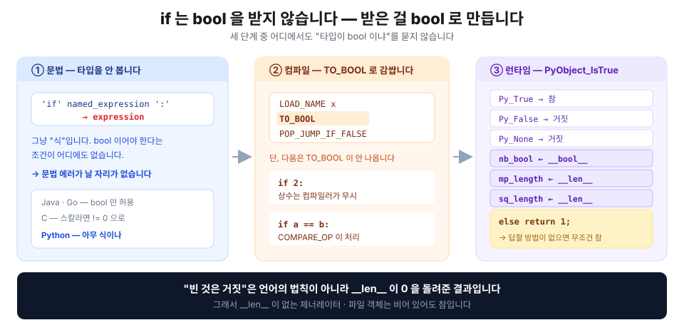

## 들어가며 - if에 왜 아무거나 넣어도 문법 에러가 안 나고 통과하나요?

```python
>>> if True: print("True")
... 
True
>>> if False: print("False")
...
>>> if 0: print("0")
... 
>>> if 1: print("1")
... 
1
>>> if 2: print("2")
... 
2
>>> if set(["A", "B"]): print("set")
... 
set
>>> if object(): print("object")
... 
object
```
우리는 흔히 if는 bool 값을 판단해 True면 내부 블록을 수행하고, False면 그 내부 블록을 수행하지 않는 기능을 한다고 알고 있습니다. 하지만 python을 공부하다 보면 그 상식에 의문이 들 때가 있습니다. 

> **왜 if 0, if 1, if 2, if set(), 심지어 object()를 넣어도 문법 에러 없이 True로 인식될까요?**

또 한가지 질문을 던져보겠습니다. 

```python
>>> bool(2)
True
>>> 2 == True
False
>>> if 2: print("여긴 들어옵니다")
... 
여긴 들어옵니다
```
- `bool(2)`는 `True`입니다. 
- 그런데 `2 == True`는 `False`입니다.
- 그런데 `if 2:`는 통과합니다.

왜 이런 거죠? `2`는 `True`가 아니라고 하는데, `if 2:`는 통과합니다. 왜 그럴까요?

이번 글에서는 `if`가 어떻게 구현되어있는 지 소스코드까지 내려가서 if문의 비밀을 파헤쳐보겠습니다. 

> 📌 이 글의 바이트코드·측정값은 아래 환경에서 **실제로 돌려서 얻은 결과**입니다. 버전에 따라 바이트코드가 꽤 달라지니, 버전을 특히 눈여겨봐 주세요.
>
> ```text
> Python 3.13.12 (main, Feb  3 2026) [Clang 17.0.0]
> macOS 26.5 · arm64 · 64-bit
> ```

---

## 🧭 1. 문법부터 보면 답이 반쯤 나옵니다

같은 코드를 Java에 넣으면 어떻게 될까요?

```java
if (1) {          // ✗ error: incompatible types: int cannot be converted to boolean
    System.out.println("1");
}
```

Java는 **컴파일러가 막습니다.** `if`의 조건 자리에는 `boolean`만 올 수 있다고 문법이 못 박아 두었기 때문입니다. Go도 같습니다(`non-boolean condition in if statement`). C는 조금 느슨해서 **스칼라 타입**(정수·실수·포인터)이면 `!= 0`으로 바꿔 받아주지만, 구조체를 통째로 넣으면 역시 컴파일 에러입니다.

그러면 Python 문법은 뭐라고 되어 있을까요? CPython의 문법 파일을 직접 열어보겠습니다.

```peg
/* CPython 3.13 — Grammar/python.gram */
if_stmt[stmt_ty]:
    | invalid_if_stmt
    | 'if' a=named_expression ':' b=block c=elif_stmt { ... }
    | 'if' a=named_expression ':' b=block c=[else_block] { ... }
```

`'if'` 다음에 오는 자리는 `named_expression`입니다. 그러면 `named_expression`은 또 뭘까요?

```peg
named_expression[expr_ty]:
    | assignment_expression      /* 왈러스 —  (n := f()) */
    | invalid_named_expression
    | expression !':='           /* 그냥 아무 식이나 */
```

**`expression`** — 그냥 "식"입니다. 어디에도 "bool 이어야 한다"는 조건이 없습니다. `2`도 식이고, `set(["A", "B"])`도 식이고, `object()`도 식입니다. 즉 **문법이 애초에 타입을 안 보기 때문에, 문법 에러가 날 자리 자체가 없는 겁니다.**



> 💡 **문법이 통과시킨다고 실행까지 되는 건 아닙니다.**
>
> ```python
> >>> if [1, 2] > "a": pass
> ... 
> TypeError: '>' not supported between instances of 'list' and 'str'
> ```
> 이것도 문법은 멀쩡히 통과하고, 실행할 때 터집니다. 문법은 **모양**만 보고, 값이 말이 되는지는 **런타임**이 봅니다. 그러니 진짜 질문은 이쪽입니다 — **런타임은 `object()`를 받아서 대체 뭘 하길래, 에러 없이 "참"이라고 답할까요?**

---

## ⚙️ 2. `if`는 무엇으로 컴파일될까 — `TO_BOOL`

문법을 통과한 코드는 바이트코드가 됩니다. `dis` 모듈로 `if x:` 한 줄이 어떤 명령어로 바뀌는지 보겠습니다.

```python
>>> import dis
>>> dis.dis(compile("if x:\n    y = 1\n", "<s>", "exec"))
```

```text
  0           RESUME                   0

  1           LOAD_NAME                0 (x)
              TO_BOOL
              POP_JUMP_IF_FALSE        3 (to L1)

  2           LOAD_CONST               0 (1)
              STORE_NAME               1 (y)
              RETURN_CONST             1 (None)

  1   L1:     RETURN_CONST             1 (None)
```

세 줄이 전부입니다. **① `x`를 스택에 올리고(`LOAD_NAME`) → ② `TO_BOOL` → ③ 거짓이면 뛰어넘는다(`POP_JUMP_IF_FALSE`).**

우리가 찾던 범인은 가운데 있는 **`TO_BOOL`** 입니다. 이름 그대로 "스택 맨 위에 있는 객체를 `True` 아니면 `False`로 바꿔 놓아라"라는 명령입니다. 즉 **`if`는 bool을 받는 게 아니라, 받은 걸 bool로 만들어 버립니다.**



> 💡 `TO_BOOL`은 **Python 3.13에서 새로 생긴 명령어**입니다. 3.12 이하로 같은 코드를 컴파일하면 `TO_BOOL` 없이 `POP_JUMP_IF_FALSE`가 곧바로 나오는데, 판정을 안 한 게 아니라 **`POP_JUMP_IF_FALSE`가 그 일까지 안에서 같이 하던 것**뿐입니다.

### `TO_BOOL`의 구현

CPython의 바이트코드 정의 파일에서 `TO_BOOL`을 찾아보면, 알맹이는 딱 다섯 줄입니다.

```c
/* CPython 3.13 — Python/bytecodes.c */
op(_TO_BOOL, (value -- res)) {
    int err = PyObject_IsTrue(value);      /* ← 여기가 전부입니다 */
    DECREF_INPUTS();
    ERROR_IF(err < 0, error);
    res = err ? Py_True : Py_False;
}
```

`PyObject_IsTrue(value)`를 부르고, 그 결과가 0이 아니면 `Py_True`를, 0이면 `Py_False`를 스택에 놓습니다. 참·거짓 판정의 **모든 책임이 `PyObject_IsTrue` 하나에 있다**는 뜻입니다.

> 💡 `err < 0`이면 에러라는 데 주목하세요. `PyObject_IsTrue`는 **참(1) · 거짓(0) · 실패(-1)** 세 가지를 돌려줍니다. 즉 판정 자체가 실패해서 예외가 되는 길도 열려 있습니다 — 6절의 NumPy 사례가 정확히 그 경우입니다.

---

## 🫀 3. `PyObject_IsTrue` — `if`의 심장

`if`가 하는 판단은 전부 이 함수 하나에서 결정됩니다.

```c
/* CPython 3.13 — Objects/object.c
   Test a value used as condition, e.g., in a while or if statement.
   Return -1 if an error occurred */
int
PyObject_IsTrue(PyObject *v)
{
    Py_ssize_t res;
    if (v == Py_True)
        return 1;
    if (v == Py_False)
        return 0;
    if (v == Py_None)
        return 0;
    else if (Py_TYPE(v)->tp_as_number != NULL &&
             Py_TYPE(v)->tp_as_number->nb_bool != NULL)
        res = (*Py_TYPE(v)->tp_as_number->nb_bool)(v);
    else if (Py_TYPE(v)->tp_as_mapping != NULL &&
             Py_TYPE(v)->tp_as_mapping->mp_length != NULL)
        res = (*Py_TYPE(v)->tp_as_mapping->mp_length)(v);
    else if (Py_TYPE(v)->tp_as_sequence != NULL &&
             Py_TYPE(v)->tp_as_sequence->sq_length != NULL)
        res = (*Py_TYPE(v)->tp_as_sequence->sq_length)(v);
    else
        return 1;
    /* if it is negative, it should be either -1 or -2 */
    return (res > 0) ? 1 : Py_SAFE_DOWNCAST(res, Py_ssize_t, int);
}
```

### 판정은 6단계로 결정됩니다

위 코드를 순서대로 읽으면 이렇습니다.

1. `Py_True`면 → **참**
2. `Py_False`면 → **거짓**
3. `Py_None`이면 → **거짓**
4. 타입에 `nb_bool` 슬롯이 있으면 → **그걸 불러서 나온 값**
5. 없으면 `mp_length` 슬롯이 있으면 → **길이가 0보다 크면 참**
6. 그것도 없으면 `sq_length` 슬롯 → **길이가 0보다 크면 참**
7. **아무것도 없으면 → `return 1`, 무조건 참**



### 마지막 줄이 전부입니다 — `else return 1`

`object()`가 왜 참이었는지, 답이 저 마지막 `else`에 있습니다.

```python
>>> o = object()
>>> hasattr(o, "__bool__")
False
>>> hasattr(o, "__len__")
False
>>> bool(o)
True
```

`object()`에는 `__bool__`도 `__len__`도 없습니다. 그러니 4·5·6단계를 전부 통과해 `else`까지 흘러가고, **CPython은 아무 근거 없이 `return 1`을 합니다.** 에러가 안 나는 게 아니라, 애초에 **에러를 낼 생각이 없는 설계**인 겁니다.

> 💡 **왜 기본값이 하필 "참"일까?**
>
> `PyObject_IsTrue`의 마지막 줄이 `return 0`이었다면 세상이 어떻게 됐을까요? 
>
> 첫째, **세상의 모든 클래스가 `__bool__`을 정의해야 합니다.** 클래스를 하나 만들 때마다 "이 객체는 존재하면 참입니다"를 손으로 적어야 하는 거죠. 안 적으면 `if <custom class>:`가 조용히 거짓이 되어 넘어갑니다. **에러도 안 나는 조용한 버그**가 생겨나는 겁니다.
> 우리는 흔히 아래 함수와 같은 코드를 작성합니다. 
> ``` python
> def greet(user):
>     if user:                      # "user 객체가 있으면"
>         return f"안녕하세요, {user.name}님"
>     return "로그인이 필요합니다"
> ```
> 만약 user 커스텀 클래스에 `__bool__`, `__len__`을 정의하지 않았다고 하더라도, PyObject_IsTrue의 마지막 줄이 return 1을 기본으로 넘겨주기 때문에 객체가 존재하면 환영인사를 줄 수 있는 겁니다. 만약 PyObject_IsTrue의 마지막 줄이 return 0을 기본으로 넘겨준다면, 우리가 만드는 모든 커스텀 클래스는 `__bool__`, `__len__`을 일일이 정의했어야 할 겁니다. 
> ```python
> class User:
>     def __init__(self, name):
>         self.name = name
> 
>     def __bool__(self):    # ← "나는 존재하는 것만으로 참이다" 라고 손으로 선언
>         return True
> ```
> `if x:`가 거짓이 되려면 list·dict·str처럼 "나는 비어 있을 수 있는 물건이다"라고 `__len__`으로 밝힌 타입이거나, `None`·`False`·`0`처럼 특별 취급받는 값이어야 합니다. 그렇지 않은 나머지 전부는 그냥 참이 기본입니다.
> 둘째, 이게 **덕 타이핑 관점에서 더 일관**됩니다. Python은 "이 타입이 뭔지"를 묻지 않고 "이걸 할 줄 아느냐"를 묻습니다. 비어 있는지 답할 줄 모르는 객체에게는 더 캐묻지 않고 그냥 통과시키는 거죠.
>
> 참고로 `bool(x)`도 완전히 같은 함수를 씁니다. 그래서 `bool(object())`도 `True`입니다.
>
> ```c
> /* Objects/boolobject.c — bool_new() */
> ok = PyObject_IsTrue(x);
> if (ok < 0)
>     return NULL;
> return PyBool_FromLong(ok);
> ```

### `nb_bool` · `mp_length` · `sq_length`가 대체 뭔가요

C 소스에 나온 세 슬롯이 Python 쪽에서는 우리가 아는 던더 메서드입니다. 매핑은 CPython 소스에 표처럼 적혀 있습니다.

```c
/* CPython 3.13 — Objects/typeobject.c — slotdefs[] */
UNSLOT(__bool__, nb_bool,    slot_nb_bool,    wrap_inquirypred, ...)
MPSLOT(__len__,  mp_length,  slot_mp_length,  wrap_lenfunc,     ...)
SQSLOT(__len__,  sq_length,  slot_sq_length,  wrap_lenfunc,     ...)
```

- **`nb_bool`** ← `__bool__` — "너 참이야?"에 직접 답하는 메서드
- **`mp_length` · `sq_length`** ← `__len__` — "몇 개 들었어?"에 답하는 메서드

`__len__` 하나가 `mp_length`(매핑용)와 `sq_length`(시퀀스용) **양쪽에 동시에 꽂힙니다.** 그래서 Python으로 클래스를 정의할 때는 5단계와 6단계를 구분할 필요가 없습니다. C로 만든 내장 타입은 둘 중 한쪽만 채우기도 해서 소스에 분기가 둘로 남아 있는 것뿐입니다.



> 💡 **슬롯이 뭔가요?**
>
> 모든 Python 객체는 자기 타입 객체를 가리키는 `ob_type` 포인터를 들고 다닙니다. 그 타입 객체(`PyTypeObject`) 안에는 `+`는 어떻게 할지, `len()`은 어떻게 잴지 같은 **동작들이 C 함수 포인터로 줄줄이 박혀 있고, 그 칸 하나하나가 슬롯**입니다. 클래스에 `__len__`을 정의하면 CPython이 그 칸에 함수 포인터를 꽂아 넣습니다. 이 구조는 [모든 것은 객체다](/posts/python/01-everything-is-an-object)에서 `PyTypeObject`를 뜯어보며 다뤘습니다.

### 내장 타입은 어느 길로 갈까

그럼 우리가 매일 쓰는 타입들은 위 6단계 중 어디서 답이 나오는지 확인해봅시다.

```python
for t in (bool, int, float, str, list, tuple, dict, set, range, type(None), object):
    has_bool = any("__bool__" in vars(k) for k in t.__mro__)
    has_len  = any("__len__"  in vars(k) for k in t.__mro__)
    slot = "nb_bool" if has_bool else ("mp_length" if has_len else "(없음) → 기본값 참")
    print(f"{t.__name__:>9}  __bool__={str(has_bool):<5} __len__={str(has_len):<5} → {slot}")
```

```text
     bool  __bool__=True  __len__=False → nb_bool
      int  __bool__=True  __len__=False → nb_bool
    float  __bool__=True  __len__=False → nb_bool
      str  __bool__=False __len__=True  → mp_length
     list  __bool__=False __len__=True  → mp_length
    tuple  __bool__=False __len__=True  → mp_length
     dict  __bool__=False __len__=True  → mp_length
      set  __bool__=False __len__=True  → mp_length
    range  __bool__=True  __len__=True  → nb_bool
 NoneType  __bool__=True  __len__=False → nb_bool
   object  __bool__=False __len__=False → (없음) → 기본값 참
```

**숫자 계열은 `__bool__`로, 컨테이너 계열은 `__len__`으로 True/False를 판단합니다.** 그래서 "빈 것은 False"라는 규칙이 따로 만들어진 게 아니라, `__len__`이 0을 돌려준 결과일 뿐입니다. 그리고 `object`만 두 칸이 다 비어 있어서 기본값 True(`else return 1`)으로 떨어집니다.

존재 자체로 거짓이 되는 내장값을 전부 모아보면 다음과 같습니다.

```python
>>> for v in [None, False, 0, 0.0, 0j, "", (), [], {}, set(), frozenset(), range(0), b"", bytearray()]:
...     print(f"{type(v).__name__:>10} {v!r:>14}  bool={bool(v)}")
```

```text
  NoneType           None  bool=False
      bool          False  bool=False
       int              0  bool=False
     float            0.0  bool=False
   complex             0j  bool=False
       str             ''  bool=False
     tuple             ()  bool=False
      list             []  bool=False
      dict             {}  bool=False
       set          set()  bool=False
 frozenset    frozenset()  bool=False
     range    range(0, 0)  bool=False
     bytes            b''  bool=False
 bytearray bytearray(b'')  bool=False
```

- int, float 등 **숫자**가 0이면 `False`
- str, tuple, list, dict, set 등 **컨테이너**가 비어있으면 `False`
- 그리고 `None`·`False`는 그 자체로 `False`. 

Python에서는 위 케이스에 속하면 거짓이고, 나머지는 전부 참입니다.

> 💡 **왜 `range`만 `__bool__`을 따로 들고 있을까?**
>
> 위 표에서 `range`만 유일하게 `__bool__`과 `__len__`을 **둘 다** 갖고 있습니다. 컨테이너인데 왜 굳이 `__bool__`을 따로 만들었을까요? `__len__`으로도 충분해 보이는데 말이죠.
>
> 문제는 `__len__`의 반환값이 **C의 `Py_ssize_t`**(64비트에서 8바이트 부호 있는 정수)라는 데 있습니다. Python의 정수는 무한히 커질 수 있지만, 슬롯을 통과하는 순간 C 정수로 우겨넣어야 합니다.
>
> ```python
> >>> r = range(0, 2**100)
> >>> bool(r)
> True                                       # 잘 됩니다
> >>> len(r)
> OverflowError: Python int too large to convert to C ssize_t
> ```
>
> `range(0, 2**100)`은 원소를 실제로 만들지 않으므로 만드는 것 자체는 공짜입니다. 그런데 `__len__`을 거치면 `2**100`을 8바이트에 담지 못해 터집니다. **참인지 아닌지만 알고 싶었는데 길이를 재려다 죽는 셈**이죠.
>
> 그래서 `range`는 `__bool__`을 따로 두고 "시작과 끝이 같은가"만 봅니다. 길이를 세지 않으니 아무리 큰 범위여도 안전합니다. `__bool__`이 `__len__`보다 **먼저** 검사되는 순서가 여기서 그 효과를 보는 거죠. 참 정교하지 않나요?
>
> `__bool__`을 정의하지 않은 클래스를 만들어서 직접 흉내 내보면 이게 왜 필요했는지 바로 보입니다.
>
> ```python
> >>> class Huge:
> ...     def __len__(self): return 2**100
> ... 
> >>> bool(Huge())
> OverflowError: cannot fit 'int' into an index-sized integer
> ```

---

## 🧪 4. 직접 만들어서 확인하기

이제 규칙을 알았으니, 클래스를 만들어 순서를 눈으로 확인해보겠습니다.

### `__bool__`이 `__len__`보다 우선합니다.

`__len__`만 있는 클래스, 둘 다 있는 클래스, 아무것도 없는 클래스를 만들어 어느 쪽이 불리는지 보겠습니다.

```python
class OnlyLen:
    def __len__(self):
        print("  → __len__ 호출됨")
        return 0

class Both:
    def __bool__(self):
        print("  → __bool__ 호출됨")
        return True
    def __len__(self):
        print("  → __len__ 호출됨")
        return 0

class Neither:
    pass

for cls in (OnlyLen, Both, Neither):
    print(f"if {cls.__name__}():")
    print(f"  결과 = {bool(cls())}")
```

```text
if OnlyLen():
  → __len__ 호출됨
  결과 = False
if Both():
  → __bool__ 호출됨
  결과 = True
if Neither():
  결과 = True
```

`Both`에서 `__len__`은 **아예 호출조차 되지 않았습니다.** 길이가 0이라 거짓일 것 같지만 `__bool__`이 먼저 참을 돌려주고 끝났습니다. 소스의 `else if` 사슬이 그대로 재현된 겁니다. `Neither`는 아무것도 안 부르고 참이 됐고요.

> ⚠️ 그래서 `__bool__`과 `__len__`을 **둘 다 정의하면서 결론이 다르게** 만들면 안 됩니다. 컬렉션 클래스를 만들 때 `__len__`만 정의하는 게 안전합니다 — 그러면 "비었으면 거짓"이 공짜로 따라옵니다.

### `__bool__`은 반드시 `bool`을 돌려줘야 합니다

`__bool__`이 아무 값이나 돌려줘도 될까요? `1`을 돌려주게 해보겠습니다.

```python
>>> class BadBool:
...     def __bool__(self): return 1
... 
>>> bool(BadBool())
TypeError: __bool__ should return bool, returned int
```

**`1`은 안 됩니다.** `True`여야 합니다. `if 1:`은 되면서 `__bool__`이 `1`을 돌려주는 건 막힌다는 게 재미있는 지점인데, 이유는 위치가 다르기 때문입니다. `if 1:`의 `1`은 **판정 대상**이라 `nb_bool`을 거쳐 변환되지만, `__bool__`의 반환값은 **판정 결과**라 더 이상 변환할 곳이 없습니다. 그래서 커스텀 클래스를 만들 때는 `__bool__`의 반환값이 `True`가 되게 정의해야 합니다. 

### `__len__`은 음수도, 너무 큰 수도 안 됩니다

```python
>>> class NegLen:
...     def __len__(self): return -1
... 
>>> bool(NegLen())
ValueError: __len__() should return >= 0

>>> class StrLen:
...     def __len__(self): return "3"
... 
>>> bool(StrLen())
TypeError: 'str' object cannot be interpreted as an integer
```

앞서 본 `Huge`의 `OverflowError`에서 너무 큰 수(2**100)을 줬을 때 에러가 나는 걸 봤죠? 따라서 `__len__`은
- 음수면 안되고,
- 8바이트(2**64)를 넘는 수는 안되고,
- 꼭 `int` 타입이어야 합니다. 

---

## ✂️ 5. `TO_BOOL`이 아예 안 나오는 경우

여기서 반전이 하나 있습니다. 이 글 맨 위 예시 중 **절반은 `TO_BOOL`을 거치지도 않습니다.**
> 📌 잊으셨을까봐 다시 보여드릴게요
> ```python
> >>> if True: print("True")
> ... 
> True
> >>> if False: print("False")
> ...
> >>> if 0: print("0")
> ... 
> >>> if 1: print("1")
> ... 
> 1
> >>> if 2: print("2")
> ... 
> 2
> >>> if set(["A", "B"]): print("set")
> ... 
> set
> >>> if object(): print("object")
> ... 
> object
> ```

### 상수는 컴파일 타임에 사라집니다

```python
>>> import dis
>>> dis.dis(compile('if 2: print("2")\n', "<s>", "single"))
```

```text
  0           RESUME                   0

  1           LOAD_NAME                0 (print)
              PUSH_NULL
              LOAD_CONST               0 ('2')
              CALL                     1
              CALL_INTRINSIC_1         1 (INTRINSIC_PRINT)
              POP_TOP
              RETURN_CONST             1 (None)
```

**`TO_BOOL`도, 분기 명령어도 없습니다.** 그냥 `if`문을 통과해서 `print("2")`를 부릅니다. `2`가 참이라는 걸 **컴파일러가 이미 알고 조건문을 통째로 지워버린 것**입니다. 반대쪽도 마찬가지입니다.

```python
>>> print([i.opname for i in dis.get_instructions(compile('if 0: print("0")\n', "<s>", "single"))])
['RESUME', 'RETURN_CONST']
```

`if 0:` 은 분기 명령어도 없고 **본문까지 무시해버립니다.** 남은 건 `RESUME`과 `RETURN_CONST` 두 명령어밖에 없습니다. `0`은 무조건 거짓이니 본문을 그냥 명령어로 컴파일하지도 않는 거죠. 

아주 멋있는 최적화죠? 정리하면, 들어가며 절에서의 예시들은 이렇게 정리됩니다.

| 코드 | 런타임에 판정하나? | 이유 |
| --- | --- | --- |
| `if True:` · `if 1:` · `if 2:` | ✗ | 상수라 컴파일러가 접어버림 |
| `if False:` · `if 0:` | ✗ | 본문까지 삭제 |
| `if set(["A","B"]):` | ✓ | 함수 호출 결과라 실행 전엔 모름 |
| `if object():` | ✓ | 위와 같음 |

하지만 같은 값을 변수에 담으면 `TO_BOOL`을 생략하지 않습니다. 

```python
>>> print([i.opname for i in dis.get_instructions(compile("x = 2\nif x: print(x)", "<s>", "exec"))])
['RESUME', 'LOAD_CONST', 'STORE_NAME', 'LOAD_NAME', 'TO_BOOL', 'POP_JUMP_IF_FALSE', ...]
```

`x`가 전역 이름이라 **다른 모듈이 언제든 바꿔치기할 수 있으니**, 컴파일러는 `2`가 들어 있다는 걸 알면서도 판단을 런타임으로 미루는 겁니다.

### 비교 연산자는 스스로 bool을 만듭니다

`if a == b:` 를 컴파일해보면 또 `TO_BOOL`이 없습니다. 그런데 이번엔 이유가 다릅니다.

```python
>>> dis.dis(compile("if a == b: pass\n", "<s>", "exec"))
```

```text
  1           LOAD_NAME                0 (a)
              LOAD_NAME                1 (b)
              COMPARE_OP              88 (bool(==))
              POP_JUMP_IF_FALSE        1 (to L1)
```

`COMPARE_OP`의 인자가 그냥 `==`가 아니라 **`bool(==)`** 입니다. 똑같은 비교 연산을 조건문 밖에 두면 인자가 달라집니다.

```python
>>> dis.dis(compile("x = (a == b)\n", "<s>", "exec"))
```

```text
              COMPARE_OP              72 (==)
```

즉 `if` 안에서 비교 연산을 하면 컴파일러가 아예 `COMPARE_OP`에 **"결과를 bool로 만들어서 내놔라"는 플래그를 얹어** 보내고, `TO_BOOL`명령어를 하나 더 쓰는 비용을 아끼는 겁니다.  

---

## ⚠️ 6. 그래서 어떻게 활용되냐

원리를 알았으니 실전에서 헷갈리는 지점을 분석해봅시다. 

### `if x`와 `if x == True`는 다른 질문입니다

```python
>>> bool(2)
True
>>> 2 == True
False
>>> if 2: print("여긴 들어옵니다")
... 
여긴 들어옵니다
```
- `bool(2)`는 `True`입니다. 
- 그런데 `2 == True`는 `False`입니다.
- 그런데 `if 2:`는 통과합니다.

왜 이런 거죠? `2`는 `True`가 아니라고 하는데, `if 2:`는 통과합니다. 지금까지 그 원리를 배웠으니, 이 의문에 답할 수 있겠죠?

> 💡 `==`가 물어보는 질문과 `if`가 물어보는 질문이 달라서 그렇습니다. 
> - `==`는 기본적으로 `COMPARE_OP` 명령어로 컴파일되고, 
> - `if`는 `TO_BOOL`로 컴파일되기 때문입니다. 
> - `COMPARE_OP`는 op_arg 88(`bool(==)`) 플래그를 쓰지 않는 이상 `PyObject_IsTrue()`함수를 호출하지 않고, 양 옆에 있는 피연산자들의 클래스에서 정의된 `__eq__` 메서드를 호출합니다.
> - `TO_BOOL`은 `PyObject_IsTrue()` 함수를 통해 0, 1, 또는 -1로 변환한 값을 리턴합니다.
> 
> 그래서 `2 == True`는 int와 True의 `__eq__`메서드의 결과를 통해 거짓이라고 나오지만, 
> `if 2`의 경우에는 `int` 클래스의 `nb_bool`(`__bool__`)이 `True`를 리턴하기 때문에 통과하는 겁니다. *물론 컴파일러가 상수 캐시로 취급해서 TO_BOOL을 호출하지도 않긴 하지만요 😂.*

### `0`과 `None`은 엄연히 다른 값입니다.

아래와 같은 요구사항이 있는 타이머 앱이 있다고 해봅시다.

- 사용자는 타이머 초를 임의로 지정할 수 있습니다.
- 기본값은 30초입니다.
- 사용자가 0초로 설정하면 바로 알람을 줘야합니다. 

그래서 다음과 같이 코드를 짰다고 해봅시다. 
```python
def timer(second=None):
    if not second:                  
        second = 30
    return f"{second}초가 남았습니다"

>>> timer()
'30초가 남았습니다'
>>> timer(0)
'30초가 남았습니다'
>>> timer(60)
'60초가 남았습니다'
```
하지만 결과는 어떨까요? 0초를 넣었는데 30초가 남았다고 합니다. 의도와 다르게 프로그래밍된 거죠. 왜 이럴까요?

> 💡 **0도 None도 똑같이 False**이기 때문입니다. 
> 
> 앞서 배운 구현을 인용한다면, 
> 
> ```c
> /* CPython 3.13 — Objects/longobject.c */
> static int
> long_bool(PyLongObject *v)
> {
>     return !_PyLong_IsZero(v);      /* 0 이 아니면 참 */
> }
> ```
> `_PyLong_IsZero(v)`의 구현까지 내려가면 너무 복잡해서😂, 단순히 하자면 `_PyLong_IsZero(v)` 이 함수는 0이 아니면 참을 리턴합니다. 따라서 0은 False로 취급되는 겁니다.

**"값이 안 들어왔다"와 "0이 들어왔다"를 구분해야 하면 truthiness를 쓰면 안 됩니다.**

```python
def timer(second=None):
    if second is None:                  
        second = 30
    return f"{second}초가 남았습니다"

>>> timer()
'30초가 남았습니다'
>>> timer(0)
'0초가 남았습니다'
>>> timer(60)
'60초가 남았습니다'
```

> 💡 빈 문자열 `""`, 빈 리스트 `[]`도 전부 거짓입니다.(`__len__`이 0이니깐요) 
>
> 
> ```python
> name = ""
> if name:
>     ...
> ```
> 위 코드에서 `if name:`은 "이름이 없다"와 "이름이 빈 문자열이다"를 구분하지 못합니다. 두 경우 모두 False로 취급해버리죠. **만약 "이름이 없는 경우"를 취급해야 한다면 `if name is None`을, 취급이 필요 없으면 `if name:`을** 쓰면 됩니다.

### `__bool__`이 예외를 던지면 `if` 자체가 터집니다

2절에서 `PyObject_IsTrue`가 `-1`(실패)도 돌려줄 수 있다고 했죠. 그 상황을 실제로 확인해보겠습니다. 

```python
>>> class Angry:
...     def __bool__(self): raise ValueError("판단 불가")
... 
>>> if Angry(): pass
... 
ValueError: 판단 불가
```

**조건문에 놓기만 했는데 예외가 납니다.** NumPy가 이 방법으로 예외 핸들링을 합니다. — 원소가 여러 개인 배열은 "참이냐"에 답할 방법이 없으니, 아무 답이나 하는 대신 예외를 던져 멈춰 세우는 거죠.

```python
>>> bool(np.array([1, 2, 3]))
ValueError: The truth value of an array with more than one element is ambiguous. Use a.any() or a.all()
>>> bool(np.array([]))
ValueError: The truth value of an empty array is ambiguous. Use `array.size > 0` to check that an array is not empty.
```

빈 배열조차 거절하는 게 신기하네요. 아까 `[]`는 거짓이라고 했고 확인까지 했는데, `np.array([])`는 예외를 던집니다. **"비었으면 거짓"이 언어의 법칙이 아니라 `__len__`이 만든 관습일 뿐**이라는 걸 확인할 수 있는 거죠. 즉 클래스를 어떻게 정의하냐에 따라 달라지는 겁니다. 

### `__len__`이 무거우면 `if`도 무거워집니다

커스텀 클래스에서 `__len__`을 정의할 때, 그 정의가 곧 `if`문의 성능을 좌우합니다. 

```python
class SlowLen:
    def __init__(self, n): self.n = n
    def __len__(self):
        c = 0
        for _ in range(self.n): c += 1     # O(n)
        return c

>>> import time
>>> s = SlowLen(1_000_000)
>>> t0 = time.perf_counter(); bool(s); t1 = time.perf_counter()
>>> print(f"{(t1 - t0) * 1000:.1f} ms")
24.7 ms
```

`if s:` 한 줄에 25밀리초입니다. 극단적인 예지만, **만약 `__len__` 안에서 DB 쿼리를 날리는 ORM**이 있다고 해봅시다. DB 쿼리 성능에 따라 `if` 성능이 끔찍해질 수도 있겠죠? 

### 제너레이터는 "비어 있어도" 참입니다

```python
>>> l = []                   # 빈 리스트를 만들어보겠습니다
>>> type(l)                  
<class 'list'>      
>>> bool(l)                  # 비어있으므로 거짓입니다.
False
```
위에서 배운 걸 잠깐 복습해보겠습니다. list 자료형은 시퀀스 자료형으로, `__len__`으로 bool 여부를 판단한다고 했습니다. 그래서 비어있는 리스트는 `False`인 거죠. 

그러면 제너레이터는 어떨까요?
```python
>>> gen = (x for x in [])    # 빈 제너레이터를 만들어보겠습니다
>>> type(gen)
<class 'generator'>
>>> list(gen)                # 확실히 비어있습니다 
[]
>>> bool(gen)
True                         # 비었는데 참입니다
>>> gen2 = (x for x in [1,2])
>>> bool(gen2)
True                         # 값이 있어도 참입니다.
```
어라 이상합니다. 리스트는 비어있으면 `False`인데 제너레이터는 비어있어도 `True`네요? 왜 그럴까요?

> 💡 **리스트와 달리, 제너레이터는 "비었니?"에 답할 수단이 없습니다.**
>
> 제너레이터의 구현인 `PyGen_Type`을 살펴보겠습니다.  
> 
> ```c
> /* CPython 3.13 — Objects/genobject.c — PyTypeObject PyGen_Type */
>     0,                                          /* tp_as_number   */
>     0,                                          /* tp_as_sequence */
>     0,                                          /* tp_as_mapping  */
>     ...
>     PyObject_SelfIter,                          /* tp_iter     */
>     (iternextfunc)gen_iternext,                 /* tp_iternext */
> ```
> 제너레이터에는 **`tp_as_number`·`tp_as_mapping`·`tp_as_sequence`이 전부 `0`** 입니다. `PyObject_IsTrue`가 찾는 게 이 세 가지인데, 이게 전부 비어있으니 마지막 기본값인 `else return 1`로 떨어지는 겁니다.   

따라서 제너레이터는 값이 있든, 비어있든, 값을 다 소진했든, `.close()`로 닫아버렸든 모두 `True`입니다. 

---

## 🎯 한 문장 요약

> **`if`는 bool을 받는 게 아니라, 받은 객체에게 "너 참이니?"를 물어보고 대답을 못 하면 참으로 칩니다.**



- **문법 단계** — `if` 뒤는 `expression`일 뿐이라 타입 제한이 없습니다. 그래서 무엇을 넣어도 **문법 에러가 날 자리가 없습니다**.
- **컴파일 단계** — 조건식은 `TO_BOOL` 명령어로 감싸집니다. 단, **상수는 컴파일러가 무시해버려** 아예 사라지고, 비교 연산자는 `COMPARE_OP`이 `bool(==)` 플래그로 대신 처리합니다.
- **런타임** — `PyObject_IsTrue`가 `True` → `False` → `None` → `nb_bool`(`__bool__`) → `mp_length`/`sq_length`(`__len__`) 순으로 묻고, **아무것도 없으면 `return 1`** 입니다. `object()`가 참인 이유가 이 마지막 else 때문입니다.
- **"빈 것은 거짓"은 언어의 법칙이 아니라** `__len__`이 0을 돌려준 결과입니다. 그래서 `__len__`이 없는 제너레이터·파일 객체는 비어 있어도 참입니다.
- 그래서 `0`과 `None`을 구분해야 하면 **`if x:` 말고 `is None`** 을 써야 합니다. 

정리하자면, `if`는 "이 값이 bool 타입 True/False이냐"를 묻지 않고 "참인지 대답할 줄 아느냐"를 묻는 겁니다. 그 관대함이 `if items:` 같은 짧은 코드를 가능하게 하는 거죠.

---

## 📚 참고자료

**Python 공식 문서**

- [The Python Language Reference — Truth Value Testing](https://docs.python.org/3/library/stdtypes.html#truth-value-testing) — 거짓으로 취급되는 값의 공식 목록
- [The Python Language Reference — `if` statement](https://docs.python.org/3/reference/compound_stmts.html#the-if-statement)
- [Data model — `object.__bool__`](https://docs.python.org/3/reference/datamodel.html#object.__bool__) · [`object.__len__`](https://docs.python.org/3/reference/datamodel.html#object.__len__)
- [Python/C API — `PyObject_IsTrue`](https://docs.python.org/3/c-api/object.html#c.PyObject_IsTrue)
- [`dis` — Disassembler for Python bytecode](https://docs.python.org/3/library/dis.html) — `TO_BOOL` 명령어 설명
- [What's New In Python 3.13](https://docs.python.org/3/whatsnew/3.13.html) — `TO_BOOL` 도입
- [`datetime.time`](https://docs.python.org/3/library/datetime.html#datetime.time) — 3.5에서 자정이 거짓이던 동작을 제거한 기록

**PEP**

- [PEP 285 — Adding a bool type](https://peps.python.org/pep-0285/) — `bool`을 `int`의 서브클래스로 만든 이유
- [PEP 617 — New PEG parser for CPython](https://peps.python.org/pep-0617/) — 이 글에서 읽은 `python.gram` 문법 파일의 출처

**CPython 소스 (링크는 모두 `3.13` 브랜치)**

- [`Grammar/python.gram`](https://github.com/python/cpython/blob/3.13/Grammar/python.gram) — `if_stmt`, `named_expression`
- [`Objects/object.c`](https://github.com/python/cpython/blob/3.13/Objects/object.c) — `PyObject_IsTrue`
- [`Objects/boolobject.c`](https://github.com/python/cpython/blob/3.13/Objects/boolobject.c) — `bool()`도 같은 함수를 쓴다
- [`Objects/typeobject.c`](https://github.com/python/cpython/blob/3.13/Objects/typeobject.c) — `slotdefs[]`, 던더 ↔ 슬롯 매핑
- [`Python/bytecodes.c`](https://github.com/python/cpython/blob/3.13/Python/bytecodes.c) — `TO_BOOL` 구현
- [`Python/flowgraph.c`](https://github.com/python/cpython/blob/3.13/Python/flowgraph.c) — 상수 조건문을 접어버리는 최적화
