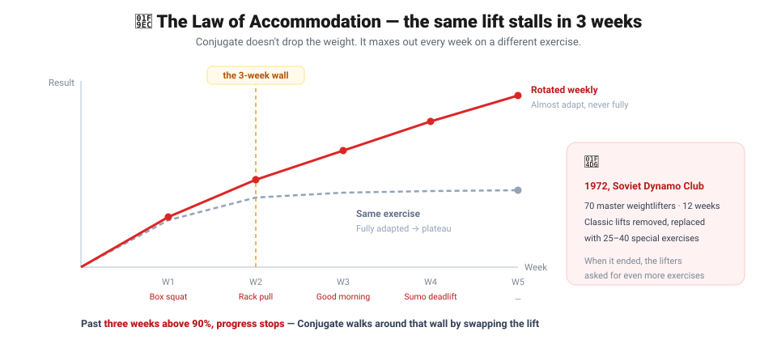
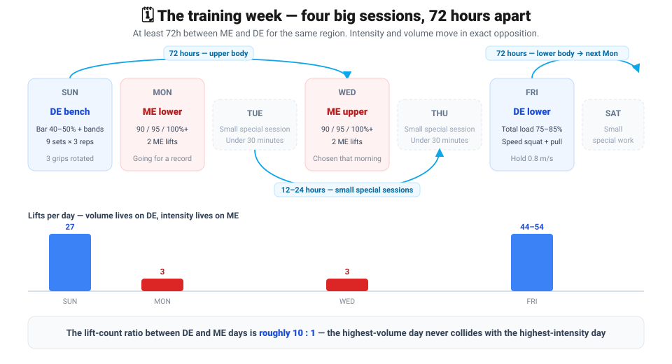
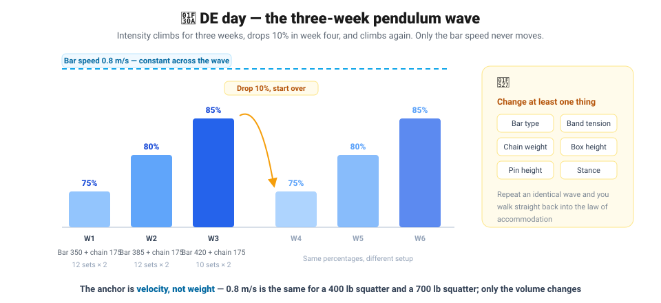
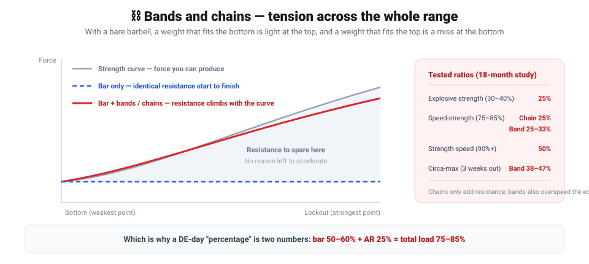

## 🏋️ Intro — 60 to 70 kg on the bench in a month

I'm currently training on a program based on Westside Barbell's **Conjugate System**. My coach (Choi Jin-young of Bibir Fitness in Bucheon) learned the approach directly from Westside Barbell Korea and adapts it through a bodybuilding lens.

Barely a month in, my working bench press moved from a long-standing 50–60 kg to a solid **70 kg**. Barbell rows are now 80 kg × 5 as a working set. The performance jump was big enough to feel.

But the deeper I got, the clearer it became that the **record-keeping and judgment calls** this system demands are rough to carry by hand. Before that story, let's lay out what the method actually is.

---

## 🧬 Why the exercise changes every week — the Law of Accommodation

Everything in Conjugate starts from one idea: the **Law of Accommodation**. Repeat the same load, the same intensity, the same exercise, and the training effect decays. It's a biological law.

> **"To see improvement, one must almost adapt to training but never fully adapt."**

Soviet sport science put a number on it: **train above 90% for more than three weeks and progress stops.** So does avoiding the plateau mean you simply have to push the weight up or pull it down after week three? Conjugate doesn't dodge that wall by adjusting the weight. It walks around it by **putting out a maximal effort on a different exercise every week.**

The origin is 1972. Verkhoshansky and A.N. Medvedev tracked 70 master-class weightlifters at the Soviet Dynamo Club for 12 weeks, replacing the classic lifts with 25–40 special exercises. When it was over, the lifters asked for **even more exercises**. Ten years later the approach reached the West through Westside.

---

## 🎚️ Strength is measured in velocity, not weight

This is where the system parts ways with most programs. It defines types of strength by **bar speed**.

| Type of strength | Intensity | Velocity |
| --- | --- | --- |
| Explosive strength | 30–40% 1RM | Fast |
| **Speed-strength** | **75–85% 1RM** | **Intermediate — 0.8–0.9 m/s** |
| Strength-speed | 90%+ | Slow |
| Isometrics | — | Zero |

> 💡 **"Remember, special strength is measured in velocity, not weight."**
> Every number that follows hangs off this one sentence.

The training methods split four ways as well.

| Method | Intensity | Purpose |
| --- | --- | --- |
| **Maximal Effort (ME)** | Limit weight, **one rep only** | Intra- and intermuscular coordination — the best of all methods |
| Heavy Effort | 90%+, 1–2 reps | The buffered version of ME |
| **Dynamic Effort (DE)** | 75–85%, explosive acceleration | Explosive strength |
| Repeated Effort | Small single-joint special exercises | Hypertrophy and endurance (the last rep of the set is the point) |

> ⚠️ **A true ME is one repetition.** Do two or three and it isn't ME anymore — it's the Heavy Effort Method.

---

## 🗓️ Building the weekly plan — the 72-hour rest rule

Four big sessions, spaced **72 hours** apart. That spacing is the basic unit of the recovery cycle.

| Day | Session | Intensity | Volume | Lifts |
| --- | --- | --- | --- | --- |
| Sun | DE bench | Bar 40–50% + bands | High | 27 |
| Mon | **ME lower** | 90 / 95 / 100%+ | Lowest | 3 |
| Wed | **ME upper** | 90 / 95 / 100%+ | Lowest | 3 |
| Fri | DE squat + speed pull | Total load 75–85% | Highest | 44–54 |

On top of that go **four to eight small special sessions per week**, under 30 minutes each, dropped into the empty days. Big sessions need 72 hours of rest; small ones are fine at 12–24.

> 💡 **Intensity and volume move in exact opposition.** DE days are max volume at moderate intensity; ME days are max intensity at minimum volume. The lift-count ratio is about **10 : 1**.

---

## 🔺 ME day — aiming for a new record every week, exercise decided that morning

There is essentially one operating rule for ME day: **change the exercise every week.**

| Week | ME lower | ME upper |
| --- | --- | --- |
| 1 | Low box squat | Flat bench |
| 2 | Pin 3 rack pull | Incline press |
| 3 | Rack-pin good morning | Floor press |

- **Two ME lifts** per day, followed by two to four small special exercises.
- Keep lifts above 90% to **three reps or fewer**. Rest between sets is 2–4 minutes.
- Every session targets an **all-time record**. Westside sets one more than 90% of the time.

> 💡 **The exercise is chosen the morning of the session.**
> *"By choosing the exercises the morning of the workout, there is no time for fear to form."*
> Plan it a week out and the anxiety compounds all week. That's precisely why ME workouts are never planned long-term.

> ⚠️ **Three consecutive ME sessions is the ceiling.** The fourth scheduled ME gets swapped for a Repetition Method session to recover.

---

## 🌊 DE day — the three-week pendulum wave

The signature idea of Louie Simmons, the head of Westside Barbell. He observed that performance stalls every three weeks, and proposed this as the way to break through it.

| Week | Bar weight | Chain | Total load | Sets × reps | Volume | Target speed |
| --- | --- | --- | --- | --- | --- | --- |
| 1 | 350 lb (50%) | 175 lb | **75%** | 12 × 2 | 8,400 lb | 0.8 m/s |
| 2 | 385 lb (55%) | 175 lb | **80%** | 12 × 2 | 9,240 lb | 0.8 m/s |
| 3 | 420 lb (60%) | 175 lb | **85%** | 10 × 2 | 8,400 lb | 0.8 m/s |

> **"The bar speed remains the same during each wave regardless of the bar weight."**

So whether you squat 400 lb or 700 lb, **0.8 m/s is a constant** — the only thing that changes is volume. And volume scales directly with the 1RM: 4,800 lb at a 400 lb squat, exactly double that at 800 lb.

Week four drops 10% and repeats the same way from 75%. But you must **change at least one thing**: bar type, band tension, chain weight, box height, pin height, stance — anything. Repeat it untouched and the Law of Accommodation catches you again.

---

## ⛓️ Bands and chains — they supply the full-range tension that bar weight alone can't.

Fred Hatfield's CAT (Compensatory Acceleration Training) in the 1970s said to accelerate through the full range. The problem is that **a bare barbell makes that impossible** — the force you can produce changes with joint angle.

> 💡 This is why a DE-day "percentage" is **two numbers**: bar weight 50–60% plus accommodating resistance 25% equals a total load of 75–85%. Fail to say which one you mean and every calculation downstream is wrong.

Chains only add resistance. **Bands also produce an overspeed eccentric and reversible muscle action.** They are not the same tool.

> 💡 **Overspeed eccentric** — the bands drag the bar down faster than gravity alone would, stretching the muscle harder so it stores that much more elastic energy.
>
> **Reversible muscle action** — the instant the descent flips into the ascent, that stored elastic energy is handed straight back. The faster the turnaround, the bigger the return.

---

## 📐 When to end a set — Prilepin, Westside edition

A.S. Prilepin's original table, revised by Louie Simmons over fifty years of coaching.

| Intensity | Reps per set | Optimal lifts | Total lift range |
| --- | --- | --- | --- |
| 50% | 3–6 | 36 | 24–48 |
| 70% | 3–6 | 18 | 12–24 |
| 80% | 2–4 | 15 | 10–20 |
| 90% | 1–2 | 4–10 | 4–10 |

> ⚠️ **"If bar speed is reduced, the set must be stopped because of a power reduction."**
> A set ends on **velocity loss, not rep count**. It's the most practical rule in the system — and the single hardest one to enforce on yourself.

Recommended rest between sets: 40 seconds for explosive work (30% load, 24 sets × 2 reps, 48 lifts total), 60–90 seconds for other DE sets, 2–4 minutes for ME singles.
> **"Each Friday, Westside runs week one at 30 percent, week two at 35 percent, and week three at 40 percent to develop Explosive Strength."**
>  Every Friday, for three weeks, explosive work is run at 30% > 35% > 40% of 1RM. This too rides a three-week pendulum wave.

> **"Explosive Strength is defined as the ability to rapidly increase force (Tidow, 1990). The steeper the increase of strength in time, the greater the explosive strength."**
>  **"Explosive Strength is developed in fast velocity at 30 percent to 40 percent of a one-rep max."**
>  In other words, it trains how fast you can ramp force up, and that demands a light bar — hence 30–40%. Even within a DE day, this is a different zone from 75–85% (Speed-Strength).

---

## 🎯 80% of total training volume is filled with non-barbell work

Westside's internal research landed on this ratio.

| Category | Share |
| --- | --- |
| Barbell / classic lifts | **20%** |
| Special exercises targeting weak points | **80%** |

The reason is safety. Biomechanics differ from person to person, so high-rep barbell work **fatigues the weakest link first and injures it**. Special exercises rotate every three to six sessions, on no fixed cycle — you change them when the body or the mind stops responding.

---

## ✍️ The whole thing in one sentence

> **Max out every week but on a different lift (ME), run three-week waves anchored to a fixed bar speed (DE), use bands and chains to create tension through the full range, and spend 80% of the training on special exercises aimed at weak points.**

Where block periodization trains one capacity per phase, Conjugate trains all four **Special Strengths — the ones defined by velocity — simultaneously**: explosive strength (30–40%, fast), speed-strength (75–85%, intermediate), strength-speed (90%+, slow), and isometrics (zero velocity). What gets **conjugated** are those four velocity zones; what gets **rotated** are the means — exercise, bar type, resistance method, volume.

---

<!-- TODO: restore the "next post" block once 02 is published
## 👉 Next in this series
- [Putting Conjugate into an app — where it breaks](/projects/relu-soft/west-side-barbell-club/02-raise-a-prob-and-sol)
-->

## 📚 References

- Louie Simmons, *The Conjugate Method* (Westside Barbell) — every figure and quote here comes from this book
- [Westside Barbell official site](https://www.westside-barbell.com/)
- A.S. Prilepin's original table and the Louie Simmons revision — Ch.4 of the book above
