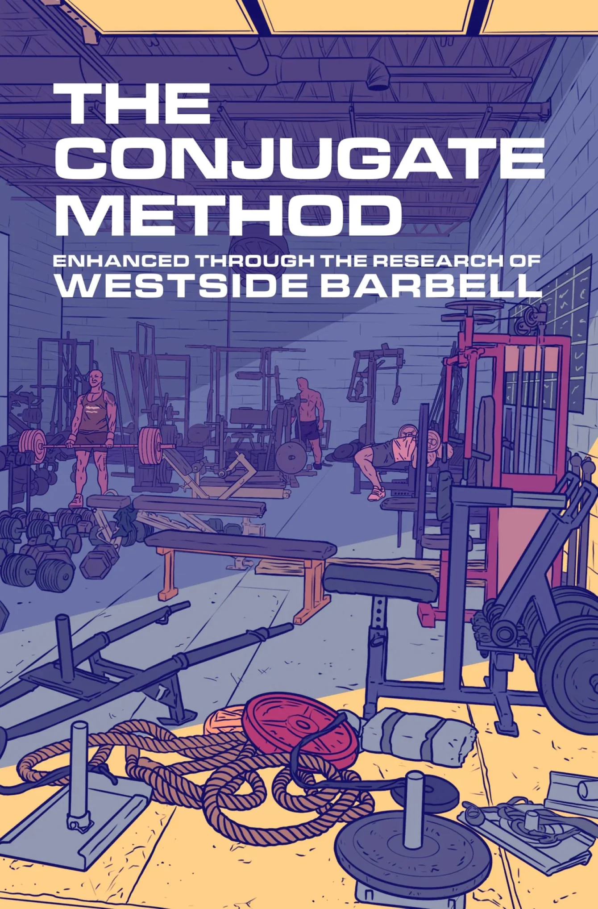
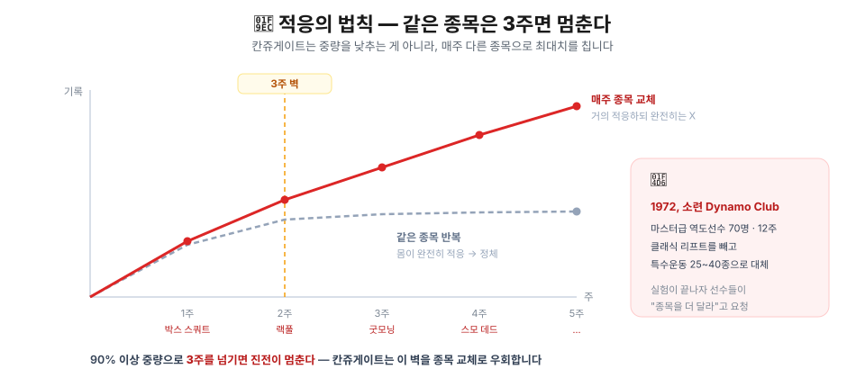
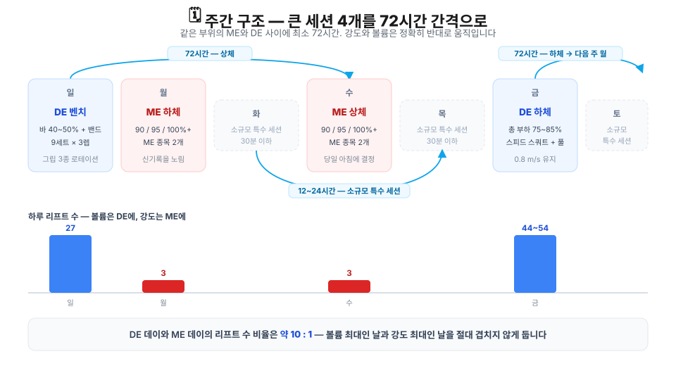
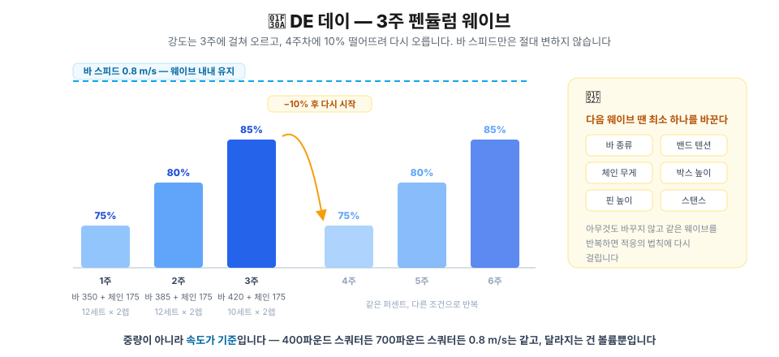
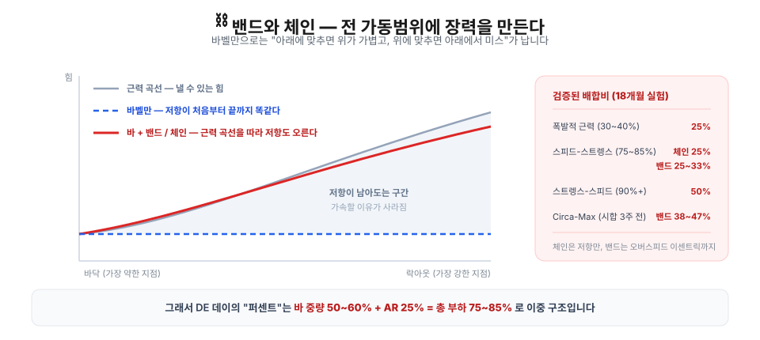

## 🏋️ 들어가며 — 한 달 만에 벤치 60에서 70kg

저는 지금 웨스트사이드 바벨(Westside Barbell)의 **칸쥬게이트 시스템(Conjugate System)** 에 기반한 훈련을 하고 있습니다. 코치님(부천 비비르 피트니스 최진영 코치님)이 Westside Barbell Korea에서 직접 배워오신 방향을 보디빌딩 관점으로 접목해 지도해 주시는 형태입니다.

이 훈련을 따라간 지 거의 한 달 만에, 늘 50~60kg에 머물러 있던 벤치프레스 훈련 중량이 안정적인 **70kg**으로 올라갔습니다. 바벨로우도 이제 80kg 5회를 본세트로 가져갑니다. 체감될 만큼 퍼포먼스가 향상됐습니다.

그런데 훈련을 따라갈수록, 이 시스템이 요구하는 **기록과 판단**을 사람이 손으로 감당하기가 만만치 않다는 걸 알게 됐습니다. 그 이야기를 하기 전에, 먼저 이 메소드가 무엇인지부터 정리해 봅시다.

> 이 글은 Westside Barbell의 수장, 루이 시몬스(Louie Simmons)가 지은 책인 *The Conjugate Method - Enhanced Through The Research Of WestSide Barbell*에 기초해 있다. 

---

## 🧬 왜 매주 종목을 바꾸나 — 적응의 법칙

칸쥬게이트의 모든 것은 **적응의 법칙(Law of Accommodation)** 하나에서 출발합니다. 같은 부하·같은 강도·같은 종목을 반복하면 훈련 효과가 줄어든다는 생물학적 법칙입니다.

> **"To see improvement, one must almost adapt to training but never fully adapt."**
> 퍼포먼스 향상을 위해 훈련에 *거의* 적응해야 하지만, *완전히* 적응해서는 안 된다.

소련 스포츠 과학은 여기에 숫자를 붙였습니다. **90% 이상 중량으로 3주를 넘기면 진전이 멈춘다.** 그러면 정체를 피하기 위해서 3주 이후에는 중량을 무조건 늘리거나 줄여야 할까요? 칸쥬게이트는 이 3주 벽을 중량 조절로 피하는 게 아니라, **매주 다른 종목으로 최대 노력을 함으로써** 우회합니다.

기원은 1972년입니다. Verkhoshansky와 A.N. Medvedev가 소련 Dynamo Club에서 마스터급 역도선수 70명을 12주간 관찰하며 클래식 리프트 대신 특수운동 25~40종을 제시했고, 실험이 끝나자 선수들이 오히려 **"종목을 더 달라"** 고 요청했습니다. 10년 뒤 이 방식이 웨스트사이드를 통해 서구에 알려집니다.

---

## 🎚️ 근력은 중량이 아니라 속도로 잰다

이 시스템이 여느 프로그램과 갈리는 지점입니다. 근력의 종류를 **바 속도**로 정의합니다.

| 근력의 종류 | 강도 | 속도 |
| --- | --- | --- |
| Explosive Strength | 30~40% 1RM | 빠름 |
| **Speed-Strength** | **75~85% 1RM** | **중간 — 0.8~0.9 m/s** |
| Strength-Speed | 90%+ | 느림 |
| Isometrics | — | 0 |

> 💡 **"Remember, special strength is measured in velocity, not weight."**
> 특수 근력은 중량이 아니라 속도로 측정합니다. 이 한 문장이 뒤에 나올 모든 숫자의 기준이 됩니다.

훈련 방법도 네 가지로 나뉩니다.

| 방법 | 강도 | 목적 |
| --- | --- | --- |
| **Maximal Effort (ME)** | 한계 중량, **1회만** | 근내·근간 협응 향상 |
| Heavy Effort | 90%+, 1~2회 | ME의 완충 버전 |
| **Dynamic Effort (DE)** | 75~85%, 폭발적 가속 | 폭발적 근력 |
| Repeated Effort | 소규모 단관절 특수운동 | 근비대·근지구력 (세트 마지막 렙이 핵심) |

> ⚠️ **진짜 ME는 1회입니다.** 2~3회를 하면 그건 ME가 아니라 Heavy Effort Method입니다.

---

## 🗓️ 주간 훈련 계획 작성 — 72시간 휴식 규칙

큰 세션 4개를 **72시간 간격**으로 배치합니다. 이게 회복 사이클의 기본 단위입니다.

| 요일 | 세션 | 강도 | 볼륨 | 리프트 수 |
| --- | --- | --- | --- | --- |
| 일 | DE 벤치 | 바 40~50% + 밴드 | 높음 | 27 |
| 월 | **ME 하체** | 90 / 95 / 100%+ | 최저 | 3 |
| 수 | **ME 상체** | 90 / 95 / 100%+ | 최저 | 3 |
| 금 | DE 스쿼트 + 스피드 풀 | 총 부하 75~85% | 최고 | 44~54 |

여기에 **30분 이하의 소규모 특수 세션을 주 4\~8개** 빈 요일에 끼워 넣습니다. 큰 세션은 72시간 휴식이 필요하지만 소규모 세션은 12\~24시간 간격이면 충분합니다.

> 💡 **강도와 볼륨은 정확히 반대로 움직입니다.** DE 데이는 볼륨 최대·강도 중간, ME 데이는 강도 최대·볼륨 최소. 리프트 수 비율이 약 **10 : 1** 입니다.

---

## 🔺 ME 데이 — 매주 신기록 갱신을 목표로, 종목은 당일 아침에 결정

ME 데이의 운영 원칙은 사실상 하나입니다. **매주 종목을 바꾼다.**

| 주차 | ME 하체 | ME 상체 |
| --- | --- | --- |
| 1주 | 로우 박스 스쿼트 | 플랫 벤치 |
| 2주 | Pin 3 랙풀 | 인클라인 프레스 |
| 3주 | 랙-핀 굿모닝 | 플로어 프레스 |

- 하루에 **ME 종목 2개**, 그 뒤에 소규모 특수운동 2~4개를 붙입니다.
- 90% 이상 리프트는 **3회 반복 이내**로 끝냅니다. 세트 사이 휴식은 2~4분.
- 매 세션 **올타임 레코드를 목표**로 합니다. 웨스트사이드는 90% 이상의 확률로 매 ME마다 신기록을 세운다고 합니다.

> 💡 **종목은 당일 아침에 정합니다.**
> *"By choosing the exercises the morning of the workout, there is no time for fear to form."*
> 일주일 전에 계획하면 그 주 내내 불안이 쌓이기 때문입니다. ME 워크아웃을 장기 계획하지 않는 이유가 이것입니다.

> ⚠️ ME는 **3세션 연속이 한계**입니다. 4번째로 예정된 ME는 Repetition Method 세션으로 대체해 회복시킵니다.

---

## 🌊 DE 데이 — 3주 펜듈럼 웨이브

WestSide Barbell의 수장, 루이 시몬스의 대표 아이디어입니다. 퍼포먼스가 3주마다 정체하는 현상을 발견했고, 이를 극복하기 위해 제시했다고 합니다. 

| 주차 | 바 중량 | 체인 | 총 부하 | 세트×렙 | 볼륨 | 목표 속도 |
| --- | --- | --- | --- | --- | --- | --- |
| 1주 | 350 lb (50%) | 175 lb | **75%** | 12 × 2 | 8,400 lb | 0.8 m/s |
| 2주 | 385 lb (55%) | 175 lb | **80%** | 12 × 2 | 9,240 lb | 0.8 m/s |
| 3주 | 420 lb (60%) | 175 lb | **85%** | 10 × 2 | 8,400 lb | 0.8 m/s |

> **"The bar speed remains the same during each wave regardless of the bar weight."**
> 바 중량이 뭐가 됐든 바 스피드는 웨이브 내내 유지합니다.

즉 400파운드 스쿼터든 700파운드 스쿼터든 **0.8 m/s는 불변 상수**이고, 달라지는 건 볼륨뿐입니다. 볼륨은 1RM에 정비례합니다 — 400파운드면 4,800파운드, 800파운드면 정확히 두 배인 9,600파운드.

4주차에는 10%를 떨어뜨려 75%부터 다시 똑같이 반복합니다. 단, **반드시 무언가 하나는 바꿉니다.** 바 종류·밴드 텐션·체인 무게·박스 높이·핀 높이·스탠스 중 무엇이든. 그대로 반복하면 다시 적응의 법칙에 걸립니다.

---

## ⛓️ 밴드와 체인 — 바벨 중량만으로 부족한, 전 구간에서의 장력을 보충해줍니다. 

1970년대 프레드 햇필드의 CAT(Compensatory Acceleration Training)은 "전 가동범위에서 가속하라"고 했습니다. 문제는 **바벨만으로는 그게 불가능**하다는 겁니다. 관절 각도에 따라 모멘트 암이 달라지고, 낼 수 있는 힘이 달라지니까요.

> 💡 이 때문에 DE 데이의 "퍼센트"는 **이중 구조**입니다. 바 중량 50\~60% + AR(밴드·체인) 25% = 총 부하 75\~85%.

체인은 저항만 더하지만, **밴드는 오버스피드 이센트릭(Overspeed Eccentric)과 가역적 근작용(reversible muscle action)까지** 만들어 냅니다. 둘은 같은 도구가 아닙니다.

> 💡 **오버스피드 이센트릭** — 밴드가 바를 아래로 잡아당겨, 중력만 받을 때보다 빠르게 내려가게 만드는 것. 근육이 더 세게 늘어나 그만큼 탄성 에너지를 많이 저장합니다.
>
> **가역적 근작용** — 내리던 방향이 올리는 방향으로 뒤집히는 순간, 저장해둔 그 탄성 에너지를 곧바로 되돌려 쓰는 것. 전환이 빠를수록 이득이 커집니다.

---

## 📐 세트를 언제 끝내나 — 프릴레핀 수정판

A.S. 프릴레핀의 원표를 루이 시몬스가 50년 경험으로 손본 버전입니다.

| 강도 | 세트당 렙 | 최적 리프트 수 | 총 리프트 허용 범위 |
| --- | --- | --- | --- |
| 50% | 3–6 | 36 | 24~48 |
| 70% | 3–6 | 18 | 12~24 |
| 80% | 2–4 | 15 | 10~20 |
| 90% | 1–2 | 4–10 | 4~10 |

> ⚠️ **"If bar speed is reduced, the set must be stopped because of a power reduction."**
> 세트를 끝내는 기준은 **렙 수가 아니라 속도 저하**입니다. 이 한 문장이 이 시스템에서 가장 실전적인 규칙이고, 동시에 **혼자서는 가장 지키기 어려운 규칙**입니다.

세트 간 휴식은 폭발적 근력 훈련(30% 중량, 24세트×2회, 총 48 리프트) 40초, 그 외 DE 세트 60\~90초, ME 싱글 2\~4분을 권장합니다.
> **"Each Friday, Westside runs week one at 30 percent, week two at 35 percent, and week three at 40 percent to develop Explosive Strength."** 
>  매 주 금요일 3주동안 1RM의 30%>35%>40% 중량으로 폭발적 근력 훈련을 진행하는 것을 권장합니다. 이 또한 마찬가지로 3주 간격 pendulum wave를 돕니다. 

> **"Explosive Strength is defined as the ability to rapidly increase force (Tidow, 1990). The steeper the increase of strength in time, the greater the explosive strength."**
>  **"Explosive Strength is developed in fast velocity at 30 percent to 40 percent of a one-rep max."**
>  즉 힘을 얼마나 빨리 끌어올리는가를 기르는 훈련이고, 그러려면 바가 가벼워야 하니 30\~40%를 씁니다. DE 데이 안에서도 75~85%(Speed-Strength)와는 다른 존입니다.

---

## 🎯 전체 훈련량의 80%는 비(非)바벨 훈련으로 채운다

웨스트사이드 내부 연구가 내놓은 비율은 이렇습니다.

| 구분 | 비중 |
| --- | --- |
| 바벨 / 클래식 리프트 | **20%** |
| 약점을 겨냥한 특수운동 | **80%** |

이유는 안전입니다. 사람마다 생체역학이 다르므로 바벨 리프트를 고반복하면 **가장 약한 부위가 먼저 지쳐 부상**으로 이어집니다. 특수운동은 3~6세션마다 로테이션하며, 정해진 사이클 없이 **몸이나 마음이 반응하지 않을 때** 바꿉니다.

---

## ✍️ 한 문장으로 정리하면

> **매주 최대치를 치되 매주 다른 종목으로 치고(ME), 고정된 바 속도를 기준으로 3주 웨이브를 돌리며(DE), 밴드·체인으로 전 가동범위에 장력을 만들고, 훈련량의 80%는 약점을 겨냥한 특수운동에 쓴다.**

블록 주기화(Block Periodization)가 한 시기에 한 가지 능력만 다루는 것과 달리, 칸쥬게이트는 속도로 구분되는 **특수 근력(Special Strengths) 네 가지를 동시에** 훈련합니다 — 폭발적 근력(30\~40%, 빠른 속도) · 스피드-스트렝스(75\~85%, 중간 속도) · 스트렝스-스피드(90%+, 느린 속도) · 아이소메트릭(속도 0). **결합(conjugate)**되는 건 이 네 개의 속도 구간이고, **회전(rotate)**하는 건 종목·바 종류·저항 방식·볼륨 같은 수단입니다.

---

<!-- TODO: 02 글이 발행되면 아래 "다음 글" 블록을 되살릴 것
## 👉 다음 글
- [칸쥬게이트를 앱으로 옮기려니 막히는 것들](/projects/relu-soft/west-side-barbell-club/02-raise-a-prob-and-sol)
-->

## 📚 참고자료

- Louie Simmons, *The Conjugate Method* (Westside Barbell) — 이 글의 수치와 인용은 전부 이 책 기준입니다
- [Westside Barbell 공식 사이트](https://www.westside-barbell.com/)
- A.S. Prilepin의 원표 및 루이 시몬스 수정판 — 위 책 Ch.4
