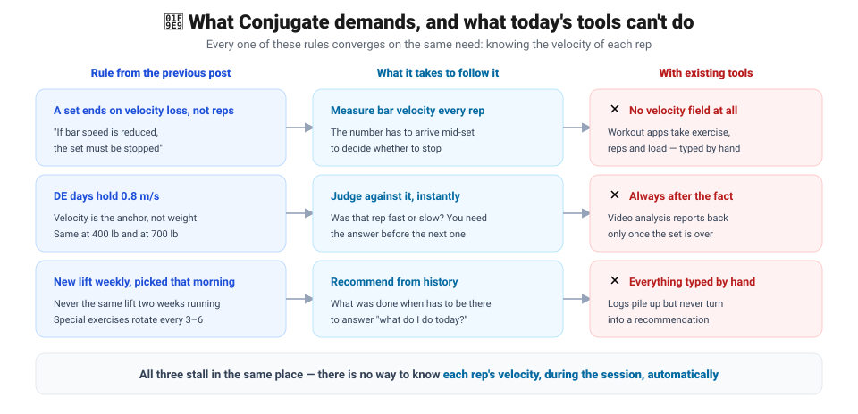

## 🧩 Recognizing the problem

[About the Conjugate Method](/projects/relu-soft/west-side-barbell-club/01-about-canjugate) laid out how this training system runs. Read those rules again from the position of someone **actually following them**, though, and three sentences start to snag.

> ⚠️ **"If bar speed is reduced, the set must be stopped because of a power reduction."**
> A set ends on **velocity loss**, not rep count.

> **"The bar speed remains the same during each wave regardless of the bar weight."**
> What anchors a DE day is a velocity — **0.8 m/s** — not a weight.

> 💡 **"By choosing the exercises the morning of the workout, there is no time for fear to form."**
> The lift is picked **that morning**, and it changes every week.

All three demand a **judgment call mid-session**.

- Did that rep slow down?
- Did it land inside 0.8 m/s?
- Given what the last three weeks looked like, what should today be?

And not one of those calls is possible without knowing the **velocity**.

| Rule of the Conjugate System | What it takes to follow it |
| --- | --- |
| A set ends on velocity loss | Measure bar velocity **mid-set**, every rep |
| DE days hold 0.8 m/s | **Judge against it instantly** and say so |
| New lift weekly, picked that morning | Recommend lift and load **from history** |

> 💡 It all collapses into one requirement — you need **each rep's velocity, during the session, automatically**. And nothing available does that.

Analyzing movement on video to evaluate performance (e.g. [OpenCap](https://www.opencap.ai/)) is still a valid technique, and today's optics can do it — but

- it needs studio-grade facilities,
- even with AI help it takes two phones,
- camera placement constrains the space, and
- immediate feedback is out of reach.

---

## 🛠️ The solution

> Overview: a small velocity/position sensor plus a dedicated app that logs training, with AI performance analysis and exercise recommendations grounded in Westside Barbell.

1. Training log. You enter exercise, reps and load yourself at first; once enough context accumulates, the app recommends them.
2. Apple Watch / Galaxy Watch measures barbell and dumbbell velocity and writes it into the log automatically.
3. No visual motion analysis. Performance is measured by load plus the velocity of the bar or hand.
4. Depending on the training goal (ME / DE / Repetition), real-time audio tells you whether that rep was good or slow against the 0.8 m/s standard — helping the lifter deliberately drive the bar faster.
5. From a Conjugate System perspective, recommend exercise, load and method based on past performance records.

---

## 📦 Deliverables

1. Apple Watch / Galaxy Watch application
2. iOS / Android application

---

## 🗺️ Open questions to work through

<!-- TODO: split each into its own post as the project progresses -->

- **How accurately** can a watch IMU alone recover bar velocity? Validating this comes first.
- What velocity-loss cutoff should end a set? The book stops at "if it slows, stop."
- With bands and chains, a percentage is either **bar weight or total load**. The log schema has to keep the two apart.
- Can real-time audio feedback be delivered **within a single rep**?

---

## 📚 References

- [About the Conjugate Method](/projects/relu-soft/west-side-barbell-club/01-about-canjugate) — source of the rules quoted here
- Louie Simmons, *The Conjugate Method* (Westside Barbell)
- [OpenCap](https://www.opencap.ai/) — smartphone-based optical motion analysis (the comparison point)
