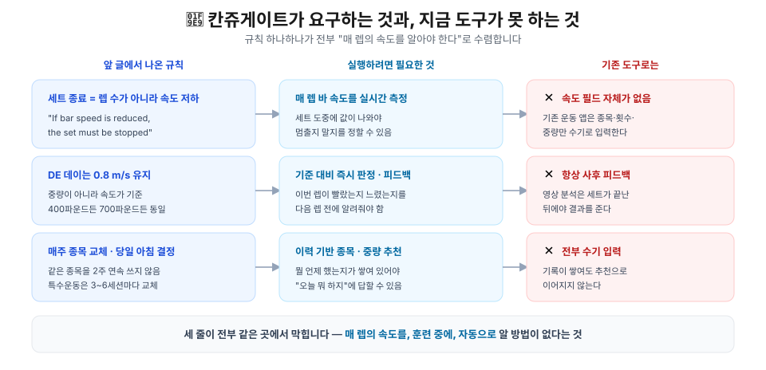

## 🔗 앞 글에서 무엇을 가져오나

[칸쥬게이트 메소드에 대해서](/projects/relu-soft/west-side-barbell-club/01-about-canjugate)에서 이 시스템이 어떻게 굴러가는지 정리했습니다. 그런데 그 규칙들을 **직접 따라가는 입장**에서 다시 읽으면, 유독 걸리는 문장이 셋 있습니다.

> ⚠️ **"If bar speed is reduced, the set must be stopped because of a power reduction."**
> 세트를 끝내는 기준은 렙 수가 아니라 **속도 저하**입니다.

> **"The bar speed remains the same during each wave regardless of the bar weight."**
> DE 데이의 기준은 중량이 아니라 **0.8 m/s**라는 속도입니다.

> 💡 **"By choosing the exercises the morning of the workout, there is no time for fear to form."**
> 종목은 **당일 아침에** 정하고, 매주 바꿉니다.

세 문장 모두 훈련자에게 **훈련 도중의 판단**을 요구합니다. 지금 이 렙이 느려졌는가, 0.8 m/s 안에 들어왔는가, 지난 3주에 뭘 했으니 오늘은 뭘 할 것인가. 그리고 그 판단은 전부 **속도라는 숫자** 위에 서 있습니다.

| 앞 글의 규칙 | 실행하려면 필요한 것 |
| --- | --- |
| 세트 종료 = 속도 저하 | 매 렙 바 속도를 **세트 도중에** 측정 |
| DE는 0.8 m/s 유지 | 기준 대비 **즉시 판정**하고 알려주기 |
| 매주 종목 교체, 당일 아침 결정 | **이력**을 근거로 종목·중량 추천 |

> 💡 결국 하나로 모입니다 — **매 렙의 속도를, 훈련 중에, 자동으로** 알 수 있어야 합니다. 그런데 지금 그걸 해주는 도구가 없습니다.

---

## 🧩 문제의식

<!-- TODO: 아래 목록은 초안 메모. 각 항목을 근거와 함께 서술형으로 풀 것 -->

칸쥬게이트 시스템은 속도 기반 훈련(VBT)에 근거를 두고 있습니다. 메인 훈련에는 항상 바벨 종목을 배치하고, 스트렝스·스피드·파워 위주로 훈련합니다. 그런데 이 시스템을 실제로 따라가려면 매 세트마다 속도를 재고, 매주 종목을 갈아끼우고, 그 기록을 전부 남겨야 합니다.

1. 기존 운동 앱은 운동 종목 설정과 횟수, 중량을 일일이 손수 기입해야 한다.
2. 물리적 장치로 바벨/덤벨의 속도를 측정하고 그걸 훈련 기록에 남길 수 있는 운동 앱은 존재하지 않는다.
3. 시각적으로 움직임을 분석해 운동 수행 능력을 평가하는 것은 현재 광학기술로 가능하지만, 연구실 수준의 시설이 필요하고, AI(ex. OpenCap)의 도움을 받아도 휴대폰 2개가 필요하며, 카메라 설치에 공간적 제약이 따르고, 정확도가 보장되지 않는다.
4. 영상으로 운동 피드백이 가능하다 하더라도, 결국 운동이 종료된 시점에 피드백을 주는 것에 불과하다. 실제 트레이너에게 실시간으로 동작 수행 중 피드백을 받는 것처럼은 불가능하다.

---

## 🛠️ 솔루션

> 개요: 소형 속도/위치 측정 장비와 전용 앱으로 운동을 기록하고, 웨스트사이드 바벨에 기반한 AI 퍼포먼스 분석과 훈련 종목 추천을 제공하는 서비스

1. 운동 기록 기능. 초기에는 종목·횟수·중량을 손수 기입하되, 맥락이 쌓이면 종목과 중량, 횟수를 추천한다.
2. 애플워치/갤럭시워치로 바벨·덤벨 속도를 측정해 훈련 기록에 자동 기입한다.
3. 시각적 움직임 분석은 배제한다. 퍼포먼스는 중량과 바벨/손이 움직이는 속도로 측정한다.
4. 훈련 목적(ME / DE / Repetition)에 따라 실시간 음성으로 해당 렙이 0.8 m/s 기준 양호한지 느린지 알려준다. 훈련자가 의도적으로 바 속도를 높일 수 있게 돕는다.
5. 칸쥬게이트 시스템 관점에서 과거 수행 기록을 기반으로 종목·중량·메소드를 추천한다.

---

## 📦 산출물

1. 애플워치 / 갤럭시워치 애플리케이션
2. iOS / Android 애플리케이션

---

## 🗺️ 앞으로 풀어야 할 것

<!-- TODO: 진행하면서 항목별로 별도 글로 분리 -->

- 워치 IMU만으로 바 속도를 **얼마나 정확히** 낼 수 있는가 — 검증이 먼저다
- 속도 저하 컷오프를 몇 %로 잡을 것인가 — 책은 "느려지면 멈춰라"까지만 말한다
- 밴드·체인을 쓰면 퍼센트가 **바 중량 기준인지 총 부하 기준인지** 갈린다. 기록 스키마에서 두 값을 분리해야 한다
- 실시간 음성 피드백의 지연을 **한 렙 안**으로 줄일 수 있는가

---

## 📚 참고자료

- [칸쥬게이트 메소드에 대해서](/projects/relu-soft/west-side-barbell-club/01-about-canjugate) — 이 글이 인용하는 규칙의 출처
- Louie Simmons, *The Conjugate Method* (Westside Barbell)
- [OpenCap](https://www.opencap.ai/) — 스마트폰 기반 광학 동작 분석 (비교 대상)
